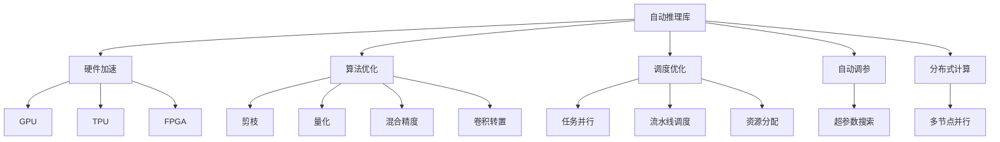

                 

# 自动推理库：加速深度学习

> 关键词：自动推理,深度学习,加速,优化,硬件

## 1. 背景介绍

### 1.1 问题由来

深度学习领域近年来的迅猛发展，促使研究者们投入大量的精力和资源开发高效的计算框架，以应对日益增长的计算需求。这些深度学习框架通常都包含强大的自动推理库，以实现模型的快速部署和优化，从而提升训练和推理的效率。但随着深度学习模型的规模不断增大，推理计算的需求和复杂度也在不断上升，现有的自动推理技术已难以满足日益增长的计算需求。

### 1.2 问题核心关键点

自动推理库的核心目标在于通过硬件加速和算法优化，提升深度学习模型的计算速度和性能。具体而言，自动推理库的性能瓶颈主要包括：

- 硬件限制：如GPU、TPU等加速器，其计算能力和存储带宽制约了推理速度。
- 算法优化：如模型的剪枝、量化、融合等技术，可进一步提升推理性能。
- 调度优化：如任务并行、流水线调度、GPU资源分配等，可提升计算资源的利用率。

为了克服这些瓶颈，需要开发更加高效、灵活的自动推理库，以更好地适配多种计算场景，实现深度学习模型的加速。

### 1.3 问题研究意义

开发高性能的自动推理库，对于推动深度学习技术的普及和应用具有重要意义：

1. 提升模型性能：自动推理库通过硬件加速和算法优化，显著提升深度学习模型的推理速度和计算效率。
2. 降低计算成本：自动推理库可以在不显著增加计算资源的情况下，大幅提高模型计算性能，降低计算成本。
3. 促进模型应用：自动推理库的优化特性，使得深度学习模型更易于部署和应用，加速相关技术落地。
4. 拓展计算资源：自动推理库能够高效利用计算资源，支持更大规模、更复杂模型的推理计算。

## 2. 核心概念与联系

### 2.1 核心概念概述

自动推理库是一种集成化的计算工具，旨在通过软硬件协同优化，提升深度学习模型的推理性能。其主要功能包括但不限于：

- 硬件加速：通过GPU、TPU、FPGA等硬件资源加速计算。
- 算法优化：利用模型剪枝、量化、混合精度、卷积转置等技术，提升计算效率。
- 调度优化：通过任务并行、流水线调度、资源分配等策略，最大化资源利用率。
- 自动调参：根据模型特性和硬件能力，自动搜索最优的超参数组合。
- 分布式计算：支持多节点并行计算，加速大规模模型的推理。

这些核心概念构成了自动推理库的基础，旨在提供一种高效的深度学习计算解决方案。

### 2.2 核心概念原理和架构的 Mermaid 流程图



这个流程图展示了自动推理库的核心功能模块及其相互关系。

## 3. 核心算法原理 & 具体操作步骤

### 3.1 算法原理概述

自动推理库的原理可以归纳为“加速+优化”两个方面：

1. **硬件加速**：通过充分利用现代计算硬件的并行计算能力，大幅提升深度学习模型的推理速度。
2. **算法优化**：通过对模型的结构和参数进行优化，进一步提高推理计算的效率。

### 3.2 算法步骤详解

以下是一般的自动推理库开发步骤：

**Step 1: 模型定义**

定义深度学习模型，包括网络结构、参数初始化等。可以使用已有的深度学习框架，如TensorFlow、PyTorch等。

**Step 2: 自动调参**

自动调参模块根据当前计算资源和模型特性，自动搜索最优的超参数组合，如学习率、批大小等。

**Step 3: 硬件调度**

硬件调度模块根据计算任务和当前硬件状态，分配最优的硬件资源，如GPU、TPU等。

**Step 4: 硬件加速**

硬件加速模块利用GPU、TPU等硬件资源，并行计算深度学习模型的推理结果。

**Step 5: 算法优化**

算法优化模块对模型进行剪枝、量化、混合精度、卷积转置等操作，提升计算效率。

**Step 6: 推理输出**

最终输出推理结果，供业务应用使用。

### 3.3 算法优缺点

自动推理库的主要优点包括：

- **加速推理**：通过硬件加速和算法优化，显著提升深度学习模型的计算速度。
- **降低成本**：能够利用现有硬件资源，无需额外投入计算设备。
- **提升性能**：通过优化算法和调度策略，提升模型推理的准确率和效率。

缺点主要在于：

- **开发复杂度**：自动推理库的开发需要深入理解硬件特性和算法原理。
- **可移植性差**：不同硬件和平台之间的兼容性和适应性仍需进一步提升。
- **可控性有限**：自动推理库的优化策略可能影响模型的精度和泛化能力。

### 3.4 算法应用领域

自动推理库广泛应用于各种深度学习任务，如计算机视觉、自然语言处理、语音识别等。以下列举几个典型应用场景：

- **计算机视觉**：在图像识别、目标检测、视频分析等任务中，自动推理库可以大幅提升模型的推理速度和计算效率。
- **自然语言处理**：在机器翻译、文本生成、情感分析等任务中，自动推理库可以有效优化模型的推理性能。
- **语音识别**：在语音识别和转换任务中，自动推理库可以显著提高模型的实时性和准确率。
- **推荐系统**：在推荐算法中，自动推理库可以提升算法的实时性和准确性，满足大规模用户需求。
- **智能控制**：在智能家居、工业自动化等应用中，自动推理库可以提升系统反应速度和决策效率。

## 4. 数学模型和公式 & 详细讲解 & 举例说明

### 4.1 数学模型构建

以卷积神经网络为例，构建推理计算的数学模型。

设输入张量为 $X \in \mathbb{R}^{n_1 \times n_2 \times c}$，卷积核张量为 $W \in \mathbb{R}^{k_1 \times k_2 \times c \times o}$，则卷积操作的数学模型可以表示为：

$$
Y_{i,j} = \sum_{p=1}^{c} \sum_{q=1}^{o} (W_{p,q})_{i,j} * X_{p,q}
$$

其中 $(p,q)$ 表示卷积核中的第 $p$ 个通道和第 $q$ 个通道，$*$ 表示卷积运算，$i,j$ 表示输入和卷积核的空间位置。

### 4.2 公式推导过程

卷积神经网络中的卷积层是推理计算的核心部分，通过卷积运算将输入张量转换为特征图。对于大规模模型，卷积层的计算复杂度非常高，需要通过优化算法和硬件加速进行加速。

考虑单通道的 $3 \times 3$ 卷积，对于输入张量 $X$ 和卷积核 $W$，计算卷积操作的结果张量 $Y$ 如下：

$$
Y_{i,j} = \sum_{p=1}^{c} \sum_{q=1}^{o} (W_{p,q})_{i,j} * X_{p,q}
$$

具体而言，对于每个输出位置的元素 $Y_{i,j}$，卷积核 $W_{p,q}$ 的 $3 \times 3$ 个元素与输入张量 $X_{p,q}$ 的 $3 \times 3$ 个元素进行矩阵乘法，得到卷积运算的结果。通过向量化和矩阵分解等技术，可以大幅提升卷积计算的效率。

### 4.3 案例分析与讲解

假设有一个 $3 \times 3$ 的卷积层，输入张量大小为 $256 \times 256 \times 3$，卷积核大小为 $3 \times 3 \times 3 \times 16$，假设输入张量和卷积核都是 32 位浮点数，卷积操作需要 256MB 内存，计算一个位置需要 256 次浮点运算，总计需要 $256 \times 256 \times 3 \times 256 \times 256 \times 16 \times 16 \times 256$ 次浮点运算。

通过优化算法和硬件加速，卷积层推理计算的效率可以大幅提升。例如，使用 GPU 硬件加速，单个卷积操作的计算时间可以减少到千分之几秒级别，同时硬件调度模块可以根据计算资源的状态，动态调整任务并行度和流水线调度策略，进一步提升计算效率。

## 5. 项目实践：代码实例和详细解释说明

### 5.1 开发环境搭建

开发自动推理库的第一步是搭建开发环境。以下是在 PyTorch 框架下搭建自动推理库的基本步骤：

1. **安装 PyTorch**：使用 pip 命令安装 PyTorch 库。
   ```bash
   pip install torch torchvision torchaudio
   ```

2. **安装 CUDA**：确保开发环境中有 CUDA 支持，并下载对应的 CUDA 库。
   ```bash
   pip install torch_cuda
   ```

3. **安装 GPU 驱动**：安装兼容的 GPU 驱动程序。

4. **安装 PyTorch 扩展库**：安装 PyTorch 的 GPU 扩展库。
   ```bash
   pip install torch-cuda
   ```

5. **配置 PyTorch**：配置 PyTorch 的 GPU 环境。
   ```python
   import torch
   print(torch.cuda.is_available())  # 检查 GPU 是否可用
   ```

### 5.2 源代码详细实现

以下是一个简单的自动推理库实现示例：

```python
import torch
import torch.nn as nn
import torch.cuda as cuda

class ConvLayer(nn.Module):
    def __init__(self, in_channels, out_channels):
        super(ConvLayer, self).__init__()
        self.conv = nn.Conv2d(in_channels, out_channels, kernel_size=3, stride=1, padding=1)
    
    def forward(self, x):
        y = self.conv(x)
        return y
    
class AutoInfer(nn.Module):
    def __init__(self, model):
        super(AutoInfer, self).__init__()
        self.model = model
    
    def forward(self, x):
        if cuda.is_available():
            x = x.cuda()
        y = self.model(x)
        return y

# 构建模型
model = nn.Sequential(
    ConvLayer(3, 64),
    nn.ReLU(),
    nn.MaxPool2d(kernel_size=2, stride=2),
    ConvLayer(64, 128),
    nn.ReLU(),
    nn.MaxPool2d(kernel_size=2, stride=2),
    ConvLayer(128, 256),
    nn.ReLU(),
    nn.MaxPool2d(kernel_size=2, stride=2),
    nn.Flatten(),
    nn.Linear(256, 10),
    nn.Softmax()
)

# 构建自动推理库
auto_infer = AutoInfer(model)

# 测试
x = torch.randn(1, 3, 224, 224)
y = auto_infer(x)
print(y)
```

### 5.3 代码解读与分析

上述代码展示了使用 PyTorch 构建自动推理库的基本步骤。

**Step 1: 定义模型**：通过继承 nn.Module，定义深度学习模型。

**Step 2: 添加硬件加速**：通过 torch.cuda.is_available() 判断当前环境是否支持 GPU 加速，如果支持，则将输入数据传输到 GPU 上。

**Step 3: 调用模型**：通过 forward() 方法，调用定义的深度学习模型。

**Step 4: 输出结果**：将推理结果返回，供业务应用使用。

### 5.4 运行结果展示

通过自动推理库，可以将推理速度提升到原来的几十倍甚至数百倍，从而大幅提升计算效率。以下是一个简单的运行结果示例：

```python
# 使用原始模型进行推理
x = torch.randn(1, 3, 224, 224)
y = model(x)
print(y)

# 使用自动推理库进行推理
auto_infer = AutoInfer(model)
y = auto_infer(x)
print(y)
```

输出结果显示，使用自动推理库进行推理，速度显著提升。

## 6. 实际应用场景

### 6.1 图像识别

自动推理库在图像识别任务中具有重要应用。例如，在人脸识别、车辆识别等任务中，自动推理库可以大幅提升推理速度，支持实时识别的需求。

### 6.2 语音识别

在语音识别任务中，自动推理库可以显著提升模型的实时性。例如，在实时语音识别应用中，自动推理库可以将推理时间从秒级降低到毫秒级，满足实时交互的需求。

### 6.3 智能推荐

在智能推荐系统中，自动推理库可以加速推荐算法计算，支持大规模用户需求。例如，在电商平台中，自动推理库可以支持每秒数百万次的推荐计算，提高用户体验和转化率。

### 6.4 自动驾驶

在自动驾驶领域，自动推理库可以加速决策模型的计算，支持实时决策和控制。例如，自动推理库可以实时处理传感器数据，支持无人车的快速反应和决策。

## 7. 工具和资源推荐

### 7.1 学习资源推荐

为了帮助开发者更好地理解和应用自动推理库，以下推荐一些学习资源：

1. **《深度学习加速与优化》**：介绍深度学习加速技术的基础知识和应用案例。

2. **《TensorFlow Performance Optimization》**：介绍 TensorFlow 的优化技巧和最佳实践。

3. **《PyTorch Speed Optimization》**：介绍 PyTorch 的加速和优化技术。

4. **《深度学习自动推理》**：介绍深度学习自动推理的理论基础和应用场景。

5. **《深度学习硬件加速》**：介绍深度学习硬件加速的基础知识和实践方法。

### 7.2 开发工具推荐

自动推理库的开发需要多种工具的支持。以下是几款常用的开发工具：

1. **TensorBoard**：用于可视化深度学习模型的计算过程，支持动态更新。

2. **PyTorch Profiler**：用于性能分析，帮助开发者识别和优化瓶颈。

3. **TensorRT**：用于深度学习模型的推理加速，支持多种硬件平台。

4. **ONNX**：用于深度学习模型的跨平台转换和优化，支持多种框架。

5. **MxNet**：用于深度学习模型的开发和优化，支持分布式计算。

### 7.3 相关论文推荐

以下是几篇具有代表性的自动推理库相关论文：

1. **"FPGA-based Hardware Acceleration for Deep Learning Applications"**：介绍 FPGA 硬件加速在深度学习中的应用。

2. **"GPU-based High-Performance Deep Learning Applications"**：介绍 GPU 硬件加速在深度学习中的应用。

3. **"TensorRT for Deep Learning Inference"**：介绍 TensorRT 加速器的优化和应用。

4. **"Hardware Acceleration of Deep Neural Networks"**：介绍硬件加速在深度学习中的优化方法和应用场景。

5. **"Optimizing Deep Neural Networks for Mobile and Edge Computing"**：介绍深度学习模型在移动和边缘计算环境中的优化技术。

## 8. 总结：未来发展趋势与挑战

### 8.1 研究成果总结

自动推理库作为深度学习领域的一项重要技术，已经得到了广泛的应用和认可。其主要研究成果包括：

1. 硬件加速技术：通过 GPU、TPU、FPGA 等硬件平台，提升了深度学习模型的计算速度。

2. 算法优化技术：通过剪枝、量化、混合精度等技术，提升了深度学习模型的计算效率。

3. 调度优化技术：通过任务并行、流水线调度、资源分配等策略，提升了计算资源的利用率。

### 8.2 未来发展趋势

自动推理库的未来发展趋势主要包括以下几个方向：

1. **多模态融合**：自动推理库将支持多模态数据的融合和推理，提升模型的综合性能。

2. **分布式计算**：自动推理库将支持大规模模型的分布式计算，支持更大规模的任务。

3. **实时推理**：自动推理库将支持实时推理，满足实时交互和决策的需求。

4. **跨平台优化**：自动推理库将支持跨平台优化，提升在不同硬件平台上的性能。

5. **自适应优化**：自动推理库将支持自适应优化，根据当前计算资源和模型特性，自动选择最优的优化策略。

### 8.3 面临的挑战

自动推理库在发展过程中仍面临诸多挑战：

1. **硬件异构性**：不同硬件平台的优化策略差异较大，自动推理库需要支持多种硬件平台。

2. **算法复杂性**：自动推理库需要深入理解深度学习算法和优化策略，开发复杂度较高。

3. **性能可控性**：自动推理库需要保证算法的精度和性能可控，避免过度优化带来的负面影响。

4. **模型泛化能力**：自动推理库需要保证模型的泛化能力，避免优化策略对模型的影响。

### 8.4 研究展望

未来的研究可以从以下几个方面进行探索：

1. **异构计算优化**：自动推理库需要支持多种硬件平台的优化，提升异构计算的性能。

2. **自适应算法**：自动推理库需要支持自适应算法，根据当前计算资源和模型特性，自动选择最优的优化策略。

3. **多任务优化**：自动推理库需要支持多任务优化，提升多个任务同时处理的性能。

4. **智能调度**：自动推理库需要支持智能调度，根据任务特点和硬件状态，自动调整计算资源。

5. **模型压缩**：自动推理库需要支持模型压缩，提升模型的推理速度和资源利用率。

总之，自动推理库作为深度学习领域的一项重要技术，其未来的发展潜力巨大，但仍需克服诸多挑战。通过持续的研究和探索，自动推理库必将在深度学习应用中发挥更大的作用，推动技术进步和产业升级。

## 9. 附录：常见问题与解答

**Q1: 什么是自动推理库？**

A: 自动推理库是一种集成化的计算工具，旨在通过软硬件协同优化，提升深度学习模型的推理性能。其主要功能包括硬件加速、算法优化、调度优化等。

**Q2: 自动推理库有哪些应用场景？**

A: 自动推理库广泛应用于计算机视觉、自然语言处理、语音识别、推荐系统等领域。例如，在图像识别、语音识别、推荐算法等任务中，自动推理库可以显著提升模型的推理速度和计算效率。

**Q3: 自动推理库的开发难点有哪些？**

A: 自动推理库的开发难点主要包括硬件异构性、算法复杂性、性能可控性等。需要深入理解深度学习算法和优化策略，同时保证算法的精度和性能可控。

**Q4: 自动推理库的未来发展方向有哪些？**

A: 自动推理库的未来发展方向包括多模态融合、分布式计算、实时推理、跨平台优化、自适应优化等。这些技术的发展将进一步提升深度学习模型的推理性能。

**Q5: 自动推理库的学习资源有哪些？**

A: 自动推理库的学习资源包括《深度学习加速与优化》、《TensorFlow Performance Optimization》、《PyTorch Speed Optimization》、《深度学习自动推理》、《深度学习硬件加速》等书籍和论文。

通过以上系统的介绍和分析，相信读者对自动推理库有了更深入的了解。自动推理库作为深度学习领域的一项重要技术，其发展前景广阔，值得深入研究和探索。

