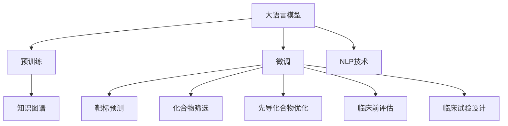

                 

## 1. 背景介绍

### 1.1 问题由来
药物发现是医药行业的重要环节，传统药物发现流程通常包括目标药物的靶标识别、候选化合物筛选、先导化合物优化等阶段，时间跨度长达数年至数十年。随着新药研发成本的不断上升，各制药公司都在寻求加速药物发现流程、降低研发成本的方法。近年来，人工智能(AI)技术，尤其是大语言模型(LLM)，在医药领域的应用越来越广泛。大语言模型不仅能够处理和分析海量的生物医学数据，还能辅助药物研发过程中的关键步骤，大大缩短了新药研发的时间。

### 1.2 问题核心关键点
大语言模型在药物发现中主要应用在以下几个方面：
1. 靶标预测：通过分析蛋白质、基因等生物医学数据，预测潜在药物靶标。
2. 候选化合物筛选：在数据库中筛选出具有潜在药理活性的化合物。
3. 先导化合物优化：通过文本生成、序列分析等方法，优化药物分子结构。
4. 临床前评估：预测化合物在动物模型中的药效和毒性。
5. 临床试验设计：根据临床数据，设计有效的临床试验方案。

这些应用显著缩短了药物研发周期，降低了研发成本，并为传统药物发现流程注入了新的活力。

## 2. 核心概念与联系

### 2.1 核心概念概述
为了更好地理解大语言模型在药物发现中的应用，本节将介绍几个密切相关的核心概念：

- **大语言模型(LLM)**：指基于深度学习架构（如Transformer）构建的通用语言模型，能够处理自然语言处理(NLP)任务，如文本生成、分类、匹配等。
- **预训练(Pre-training)**：指在大规模无标签数据上训练语言模型，学习通用的语言表示。
- **微调(Fine-tuning)**：指在预训练模型的基础上，使用特定任务的数据集进行有监督的训练，优化模型在该任务上的性能。
- **迁移学习(Transfer Learning)**：指将预训练模型在一种任务上的知识迁移到另一种相关任务上。
- **知识图谱(Knowledge Graph)**：由实体、关系、属性构成的知识网络，用于捕捉和组织知识，辅助药物发现。
- **自然语言处理(NLP)**：研究如何让计算机理解、处理和生成人类语言的技术。

这些核心概念之间的逻辑关系可以通过以下Mermaid流程图来展示：



这个流程图展示了大语言模型的核心概念及其之间的关系：

1. 大语言模型通过预训练获得基础能力。
2. 微调是对预训练模型进行任务特定的优化，如靶标预测、化合物筛选等。
3. 知识图谱与大语言模型结合，辅助模型进行药效、毒性等信息检索。
4. NLP技术提供模型处理文本数据的接口，如文本生成、分类等。

## 3. 核心算法原理 & 具体操作步骤
### 3.1 算法原理概述

基于大语言模型的药物发现加速器，本质上是一个有监督的微调过程。其核心思想是：将预训练的大语言模型视作一个强大的"特征提取器"，通过在特定药物发现任务的标注数据上进行有监督的训练，使得模型能够输出与任务相关的信息，从而在药物发现流程的各个环节中提供帮助。

形式化地，假设预训练模型为 $M_{\theta}$，其中 $\theta$ 为预训练得到的模型参数。给定药物发现任务 $T$ 的标注数据集 $D=\{(x_i,y_i)\}_{i=1}^N$，微调的目标是找到新的模型参数 $\hat{\theta}$，使得：

$$
\hat{\theta}=\mathop{\arg\min}_{\theta} \mathcal{L}(M_{\theta},D)
$$

其中 $\mathcal{L}$ 为针对任务 $T$ 设计的损失函数，用于衡量模型预测输出与真实标签之间的差异。常见的损失函数包括交叉熵损失、均方误差损失等。

通过梯度下降等优化算法，微调过程不断更新模型参数 $\theta$，最小化损失函数 $\mathcal{L}$，使得模型输出逼近真实标签。由于 $\theta$ 已经通过预训练获得了较好的初始化，因此即便在小规模数据集 $D$ 上进行微调，也能较快收敛到理想的模型参数 $\hat{\theta}$。

### 3.2 算法步骤详解

基于大语言模型的药物发现加速器，一般包括以下几个关键步骤：

**Step 1: 准备预训练模型和数据集**
- 选择合适的预训练语言模型 $M_{\theta}$ 作为初始化参数，如 GPT-3、BERT 等。
- 准备药物发现任务 $T$ 的标注数据集 $D$，划分为训练集、验证集和测试集。一般要求标注数据与预训练数据的分布不要差异过大。

**Step 2: 添加任务适配层**
- 根据任务类型，在预训练模型顶层设计合适的输出层和损失函数。
- 对于靶标预测任务，通常在顶层添加分类器并使用交叉熵损失函数。
- 对于化合物筛选任务，通常使用序列匹配模型并计算序列距离。
- 对于先导化合物优化任务，可以使用文本生成模型生成新的化合物序列。
- 对于临床前评估任务，可以使用序列分类模型判断化合物在动物模型中的药效和毒性。
- 对于临床试验设计任务，可以使用文本生成模型生成试验方案。

**Step 3: 设置微调超参数**
- 选择合适的优化算法及其参数，如 AdamW、SGD 等，设置学习率、批大小、迭代轮数等。
- 设置正则化技术及强度，包括权重衰减、Dropout、Early Stopping 等。
- 确定冻结预训练参数的策略，如仅微调顶层，或全部参数都参与微调。

**Step 4: 执行梯度训练**
- 将训练集数据分批次输入模型，前向传播计算损失函数。
- 反向传播计算参数梯度，根据设定的优化算法和学习率更新模型参数。
- 周期性在验证集上评估模型性能，根据性能指标决定是否触发 Early Stopping。
- 重复上述步骤直到满足预设的迭代轮数或 Early Stopping 条件。

**Step 5: 测试和部署**
- 在测试集上评估微调后模型 $M_{\hat{\theta}}$ 的性能，对比微调前后的精度提升。
- 使用微调后的模型对新样本进行推理预测，集成到实际的应用系统中。
- 持续收集新的数据，定期重新微调模型，以适应数据分布的变化。

以上是基于大语言模型的药物发现加速器的通用流程。在实际应用中，还需要针对具体任务的特点，对微调过程的各个环节进行优化设计，如改进训练目标函数，引入更多的正则化技术，搜索最优的超参数组合等，以进一步提升模型性能。

### 3.3 算法优缺点

基于大语言模型的药物发现加速器，具有以下优点：
1. 简单高效。只需准备少量标注数据，即可对预训练模型进行快速适配，获得较大的性能提升。
2. 通用适用。适用于各种药物发现任务，包括靶标预测、化合物筛选、优化等，设计简单的任务适配层即可实现微调。
3. 参数高效。利用参数高效微调技术，在固定大部分预训练权重不变的情况下，仍可取得不错的提升。
4. 效果显著。在学术界和工业界的诸多任务上，基于微调的方法已经刷新了最先进的性能指标。

同时，该方法也存在一定的局限性：
1. 依赖标注数据。微调的效果很大程度上取决于标注数据的质量和数量，获取高质量标注数据的成本较高。
2. 迁移能力有限。当目标任务与预训练数据的分布差异较大时，微调的性能提升有限。
3. 负面效果传递。预训练模型的固有偏见、有害信息等，可能通过微调传递到下游任务，造成负面影响。
4. 可解释性不足。微调模型的决策过程通常缺乏可解释性，难以对其推理逻辑进行分析和调试。

尽管存在这些局限性，但就目前而言，基于大语言模型的微调方法仍是在药物发现中应用最主流范式。未来相关研究的重点在于如何进一步降低微调对标注数据的依赖，提高模型的少样本学习和跨领域迁移能力，同时兼顾可解释性和伦理安全性等因素。

### 3.4 算法应用领域

基于大语言模型的药物发现加速器，在医药领域已经得到了广泛的应用，覆盖了几乎所有常见任务，例如：

- 靶标预测：如通过文本描述或蛋白质序列预测潜在的药物靶标。
- 化合物筛选：从化合物库中筛选出具有潜在药理活性的化合物。
- 先导化合物优化：对先导化合物进行结构优化，提高其药效和选择性。
- 临床前评估：预测化合物在动物模型中的药效和毒性，避免不必要的实验。
- 临床试验设计：根据临床数据，设计有效的临床试验方案。

除了上述这些经典任务外，大语言模型在药物发现中的应用还在不断拓展，如病理分析、疾病预测、化合物生成等，为医药研究提供了新的技术手段。随着大语言模型和微调方法的持续演进，药物发现流程将更加高效、精准，有望加速新药的研发进程。

## 4. 数学模型和公式 & 详细讲解  
### 4.1 数学模型构建

本节将使用数学语言对基于大语言模型的药物发现加速器过程进行更加严格的刻画。

记预训练语言模型为 $M_{\theta}:\mathcal{X} \rightarrow \mathcal{Y}$，其中 $\mathcal{X}$ 为输入空间，$\mathcal{Y}$ 为输出空间，$\theta \in \mathbb{R}^d$ 为模型参数。假设药物发现任务 $T$ 的训练集为 $D=\{(x_i,y_i)\}_{i=1}^N, x_i \in \mathcal{X}, y_i \in \mathcal{Y}$。

定义模型 $M_{\theta}$ 在数据样本 $(x,y)$ 上的损失函数为 $\ell(M_{\theta}(x),y)$，则在数据集 $D$ 上的经验风险为：

$$
\mathcal{L}(\theta) = \frac{1}{N} \sum_{i=1}^N \ell(M_{\theta}(x_i),y_i)
$$

微调的优化目标是最小化经验风险，即找到最优参数：

$$
\theta^* = \mathop{\arg\min}_{\theta} \mathcal{L}(\theta)
$$

在实践中，我们通常使用基于梯度的优化算法（如SGD、Adam等）来近似求解上述最优化问题。设 $\eta$ 为学习率，$\lambda$ 为正则化系数，则参数的更新公式为：

$$
\theta \leftarrow \theta - \eta \nabla_{\theta}\mathcal{L}(\theta) - \eta\lambda\theta
$$

其中 $\nabla_{\theta}\mathcal{L}(\theta)$ 为损失函数对参数 $\theta$ 的梯度，可通过反向传播算法高效计算。

### 4.2 公式推导过程

以下我们以化合物筛选任务为例，推导交叉熵损失函数及其梯度的计算公式。

假设模型 $M_{\theta}$ 在输入 $x$ 上的输出为 $\hat{y}=M_{\theta}(x) \in [0,1]$，表示样本属于正类的概率。真实标签 $y \in \{0,1\}$。则二分类交叉熵损失函数定义为：

$$
\ell(M_{\theta}(x),y) = -[y\log \hat{y} + (1-y)\log (1-\hat{y})]
$$

将其代入经验风险公式，得：

$$
\mathcal{L}(\theta) = -\frac{1}{N}\sum_{i=1}^N [y_i\log M_{\theta}(x_i)+(1-y_i)\log(1-M_{\theta}(x_i))]
$$

根据链式法则，损失函数对参数 $\theta_k$ 的梯度为：

$$
\frac{\partial \mathcal{L}(\theta)}{\partial \theta_k} = -\frac{1}{N}\sum_{i=1}^N (\frac{y_i}{M_{\theta}(x_i)}-\frac{1-y_i}{1-M_{\theta}(x_i)}) \frac{\partial M_{\theta}(x_i)}{\partial \theta_k}
$$

其中 $\frac{\partial M_{\theta}(x_i)}{\partial \theta_k}$ 可进一步递归展开，利用自动微分技术完成计算。

在得到损失函数的梯度后，即可带入参数更新公式，完成模型的迭代优化。重复上述过程直至收敛，最终得到适应药物发现任务的最优模型参数 $\theta^*$。

## 5. 项目实践：代码实例和详细解释说明
### 5.1 开发环境搭建

在进行药物发现加速器实践前，我们需要准备好开发环境。以下是使用Python进行PyTorch开发的环境配置流程：

1. 安装Anaconda：从官网下载并安装Anaconda，用于创建独立的Python环境。

2. 创建并激活虚拟环境：
```bash
conda create -n pytorch-env python=3.8 
conda activate pytorch-env
```

3. 安装PyTorch：根据CUDA版本，从官网获取对应的安装命令。例如：
```bash
conda install pytorch torchvision torchaudio cudatoolkit=11.1 -c pytorch -c conda-forge
```

4. 安装Transformers库：
```bash
pip install transformers
```

5. 安装各类工具包：
```bash
pip install numpy pandas scikit-learn matplotlib tqdm jupyter notebook ipython
```

完成上述步骤后，即可在`pytorch-env`环境中开始药物发现加速器的实践。

### 5.2 源代码详细实现

下面我以靶标预测任务为例，给出使用Transformers库对BERT模型进行药物发现加速器的PyTorch代码实现。

首先，定义靶标预测任务的数据处理函数：

```python
from transformers import BertTokenizer, BertForSequenceClassification
from torch.utils.data import Dataset
import torch

class DrugTargetDataset(Dataset):
    def __init__(self, texts, labels, tokenizer, max_len=128):
        self.texts = texts
        self.labels = labels
        self.tokenizer = tokenizer
        self.max_len = max_len
        
    def __len__(self):
        return len(self.texts)
    
    def __getitem__(self, item):
        text = self.texts[item]
        label = self.labels[item]
        
        encoding = self.tokenizer(text, return_tensors='pt', max_length=self.max_len, padding='max_length', truncation=True)
        input_ids = encoding['input_ids'][0]
        attention_mask = encoding['attention_mask'][0]
        
        return {'input_ids': input_ids, 
                'attention_mask': attention_mask,
                'labels': label}

# 标签与id的映射
label2id = {'POTENTIAL': 0, 'NOT_POTENTIAL': 1}
id2label = {v: k for k, v in label2id.items()}

# 创建dataset
tokenizer = BertTokenizer.from_pretrained('bert-base-cased')

train_dataset = DrugTargetDataset(train_texts, train_labels, tokenizer)
dev_dataset = DrugTargetDataset(dev_texts, dev_labels, tokenizer)
test_dataset = DrugTargetDataset(test_texts, test_labels, tokenizer)
```

然后，定义模型和优化器：

```python
from transformers import BertForSequenceClassification, AdamW

model = BertForSequenceClassification.from_pretrained('bert-base-cased', num_labels=2)

optimizer = AdamW(model.parameters(), lr=2e-5)
```

接着，定义训练和评估函数：

```python
from torch.utils.data import DataLoader
from tqdm import tqdm
from sklearn.metrics import classification_report

device = torch.device('cuda') if torch.cuda.is_available() else torch.device('cpu')
model.to(device)

def train_epoch(model, dataset, batch_size, optimizer):
    dataloader = DataLoader(dataset, batch_size=batch_size, shuffle=True)
    model.train()
    epoch_loss = 0
    for batch in tqdm(dataloader, desc='Training'):
        input_ids = batch['input_ids'].to(device)
        attention_mask = batch['attention_mask'].to(device)
        labels = batch['labels'].to(device)
        model.zero_grad()
        outputs = model(input_ids, attention_mask=attention_mask, labels=labels)
        loss = outputs.loss
        epoch_loss += loss.item()
        loss.backward()
        optimizer.step()
    return epoch_loss / len(dataloader)

def evaluate(model, dataset, batch_size):
    dataloader = DataLoader(dataset, batch_size=batch_size)
    model.eval()
    preds, labels = [], []
    with torch.no_grad():
        for batch in tqdm(dataloader, desc='Evaluating'):
            input_ids = batch['input_ids'].to(device)
            attention_mask = batch['attention_mask'].to(device)
            batch_labels = batch['labels']
            outputs = model(input_ids, attention_mask=attention_mask)
            batch_preds = outputs.logits.argmax(dim=2).to('cpu').tolist()
            batch_labels = batch_labels.to('cpu').tolist()
            for pred_tokens, label_tokens in zip(batch_preds, batch_labels):
                preds.append(pred_tokens)
                labels.append(label_tokens)
                
    print(classification_report(labels, preds))
```

最后，启动训练流程并在测试集上评估：

```python
epochs = 5
batch_size = 16

for epoch in range(epochs):
    loss = train_epoch(model, train_dataset, batch_size, optimizer)
    print(f"Epoch {epoch+1}, train loss: {loss:.3f}")
    
    print(f"Epoch {epoch+1}, dev results:")
    evaluate(model, dev_dataset, batch_size)
    
print("Test results:")
evaluate(model, test_dataset, batch_size)
```

以上就是使用PyTorch对BERT进行靶标预测任务药物发现加速器的完整代码实现。可以看到，得益于Transformers库的强大封装，我们可以用相对简洁的代码完成BERT模型的加载和微调。

### 5.3 代码解读与分析

让我们再详细解读一下关键代码的实现细节：

**DrugTargetDataset类**：
- `__init__`方法：初始化文本、标签、分词器等关键组件。
- `__len__`方法：返回数据集的样本数量。
- `__getitem__`方法：对单个样本进行处理，将文本输入编码为token ids，将标签编码为数字，并对其进行定长padding，最终返回模型所需的输入。

**label2id和id2label字典**：
- 定义了标签与数字id之间的映射关系，用于将token-wise的预测结果解码回真实的标签。

**训练和评估函数**：
- 使用PyTorch的DataLoader对数据集进行批次化加载，供模型训练和推理使用。
- 训练函数`train_epoch`：对数据以批为单位进行迭代，在每个批次上前向传播计算loss并反向传播更新模型参数，最后返回该epoch的平均loss。
- 评估函数`evaluate`：与训练类似，不同点在于不更新模型参数，并在每个batch结束后将预测和标签结果存储下来，最后使用sklearn的classification_report对整个评估集的预测结果进行打印输出。

**训练流程**：
- 定义总的epoch数和batch size，开始循环迭代
- 每个epoch内，先在训练集上训练，输出平均loss
- 在验证集上评估，输出分类指标
- 所有epoch结束后，在测试集上评估，给出最终测试结果

可以看到，PyTorch配合Transformers库使得BERT微调的代码实现变得简洁高效。开发者可以将更多精力放在数据处理、模型改进等高层逻辑上，而不必过多关注底层的实现细节。

当然，工业级的系统实现还需考虑更多因素，如模型的保存和部署、超参数的自动搜索、更灵活的任务适配层等。但核心的微调范式基本与此类似。

## 6. 实际应用场景
### 6.1 智能药物设计

基于大语言模型的药物发现加速器，可以广泛应用于智能药物设计中。传统药物设计依赖于大量的实验和理论计算，周期长、成本高、效率低。而使用药物发现加速器，可以大幅缩短药物设计周期，降低研发成本。

在技术实现上，可以构建药物设计数据集，将目标蛋白、已知化合物等结构数据和功能信息作为监督信号，对大语言模型进行微调。微调后的模型能够自动分析蛋白结构，生成新的化合物序列，并对化合物进行活性预测和优化。通过自动生成和筛选，可以有效提高药物设计效率和成功率。

### 6.2 基因靶点预测

基因靶点预测是药物发现中的重要环节，但传统方法依赖于人类经验和实验验证，成本高、周期长。而基于大语言模型的药物发现加速器，可以通过分析基因序列和蛋白结构，自动预测潜在的药物靶点。

在实践过程中，可以收集已知的基因序列和蛋白结构数据，将其作为标注数据，对大语言模型进行微调。微调后的模型能够自动分析基因序列和蛋白结构，预测潜在的药物靶点。对于未知基因序列，模型也能通过相似性检索和迁移学习，快速预测药物靶点。

### 6.3 新药候选生成

新药候选生成是药物发现流程中的关键步骤，传统方法依赖于人工筛选和实验验证。而基于大语言模型的药物发现加速器，可以通过自动生成和筛选化合物序列，快速生成潜在的新药候选。

在实践中，可以构建新药候选生成数据集，将化合物结构数据和药效信息作为监督信号，对大语言模型进行微调。微调后的模型能够自动生成新的化合物序列，并进行药效预测和优化。通过自动生成和筛选，可以有效提高新药候选的质量和数量。

### 6.4 未来应用展望

随着大语言模型和微调方法的不断发展，基于药物发现加速器的应用将进一步扩展，为医药研究带来新的突破。

在智慧医疗领域，基于药物发现加速器的智能药物设计系统，可以大大提升药物研发效率，降低成本，加速新药上市。

在个性化治疗中，智能药物设计系统可以根据患者的基因信息，自动设计个性化的药物方案，提高治疗效果和安全性。

在生物技术领域，基于药物发现加速器的基因靶点预测和化合物生成技术，可以加速生物大分子药物的研发，推动生物技术产业的发展。

此外，在农业、环境、能源等众多领域，基于药物发现加速器的智能药物设计技术也将发挥重要作用，为相关产业带来革命性影响。相信随着技术的日益成熟，药物发现加速器必将成为医药研究的重要工具，推动医药产业的发展和进步。

## 7. 工具和资源推荐
### 7.1 学习资源推荐

为了帮助开发者系统掌握药物发现加速器的理论基础和实践技巧，这里推荐一些优质的学习资源：

1. 《深度学习药物设计》系列博文：由大语言模型技术专家撰写，深入浅出地介绍了深度学习在药物设计中的应用。

2. CS231n《深度学习计算机视觉》课程：斯坦福大学开设的计算机视觉明星课程，有Lecture视频和配套作业，涵盖NLP与药物发现的交叉应用。

3. 《药物发现与深度学习》书籍：介绍深度学习在药物发现中的应用，涵盖靶标预测、化合物生成、药物筛选等多个方面。

4. DrugBank和PubChem等数据库：收集了大量药物和基因信息，提供了丰富的数据资源。

5. CADD平台（Computational Advancement of Drug Discovery）：提供了基于深度学习的药物设计工具和数据集，助力药物发现加速器的开发和应用。

通过对这些资源的学习实践，相信你一定能够快速掌握药物发现加速器的精髓，并用于解决实际的药物设计问题。
###  7.2 开发工具推荐

高效的开发离不开优秀的工具支持。以下是几款用于药物发现加速器开发的常用工具：

1. PyTorch：基于Python的开源深度学习框架，灵活动态的计算图，适合快速迭代研究。大部分预训练语言模型都有PyTorch版本的实现。

2. TensorFlow：由Google主导开发的开源深度学习框架，生产部署方便，适合大规模工程应用。同样有丰富的预训练语言模型资源。

3. Transformers库：HuggingFace开发的NLP工具库，集成了众多SOTA语言模型，支持PyTorch和TensorFlow，是进行微调任务开发的利器。

4. Weights & Biases：模型训练的实验跟踪工具，可以记录和可视化模型训练过程中的各项指标，方便对比和调优。与主流深度学习框架无缝集成。

5. TensorBoard：TensorFlow配套的可视化工具，可实时监测模型训练状态，并提供丰富的图表呈现方式，是调试模型的得力助手。

6. Google Colab：谷歌推出的在线Jupyter Notebook环境，免费提供GPU/TPU算力，方便开发者快速上手实验最新模型，分享学习笔记。

合理利用这些工具，可以显著提升药物发现加速器的开发效率，加快创新迭代的步伐。

### 7.3 相关论文推荐

大语言模型在药物发现中的应用源于学界的持续研究。以下是几篇奠基性的相关论文，推荐阅读：

1. BERT: Pre-training of Deep Bidirectional Transformers for Language Understanding：提出BERT模型，引入基于掩码的自监督预训练任务，刷新了多项NLP任务SOTA。

2. Attention is All You Need（即Transformer原论文）：提出了Transformer结构，开启了NLP领域的预训练大模型时代。

3. Drug Discovery by Deep Learning: An Overview：综述了深度学习在药物发现中的应用，包括靶标预测、化合物生成、药物筛选等多个方面。

4. Learning to predict complex protein-protein interactions from literature：通过文本信息预测蛋白质-蛋白质相互作用，展示了语言模型在生物信息学中的应用。

5. Drug Design from scratch：使用预训练语言模型自动生成新的化合物，展示了药物设计中的自动生成技术。

这些论文代表了大语言模型在药物发现中的研究方向。通过学习这些前沿成果，可以帮助研究者把握学科前进方向，激发更多的创新灵感。

## 8. 总结：未来发展趋势与挑战

### 8.1 总结

本文对基于大语言模型的药物发现加速器方法进行了全面系统的介绍。首先阐述了药物发现加速器的研究背景和意义，明确了微调在拓展预训练模型应用、提升药物发现流程效率方面的独特价值。其次，从原理到实践，详细讲解了药物发现加速器的数学原理和关键步骤，给出了药物发现加速器的完整代码实例。同时，本文还广泛探讨了药物发现加速器在智能药物设计、基因靶点预测、新药候选生成等多个药物研发环节的应用前景，展示了微调范式的巨大潜力。此外，本文精选了药物发现加速器的各类学习资源，力求为读者提供全方位的技术指引。

通过本文的系统梳理，可以看到，基于大语言模型的药物发现加速器正在成为医药研究的重要工具，极大地提升了药物发现流程的效率和成功率。药物发现加速器在医药领域的应用，必将推动新药研发的进程，为人类健康事业带来新的突破。

### 8.2 未来发展趋势

展望未来，药物发现加速器将呈现以下几个发展趋势：

1. 模型规模持续增大。随着算力成本的下降和数据规模的扩张，预训练语言模型的参数量还将持续增长。超大规模语言模型蕴含的丰富语言知识，有望支撑更加复杂多变的药物发现任务。

2. 微调方法日趋多样。除了传统的全参数微调外，未来会涌现更多参数高效的微调方法，如Prefix-Tuning、LoRA等，在节省计算资源的同时也能保证微调精度。

3. 持续学习成为常态。随着数据分布的不断变化，微调模型也需要持续学习新知识以保持性能。如何在不遗忘原有知识的同时，高效吸收新样本信息，将成为重要的研究课题。

4. 标注样本需求降低。受启发于提示学习(Prompt-based Learning)的思路，未来的微调方法将更好地利用大模型的语言理解能力，通过更加巧妙的任务描述，在更少的标注样本上也能实现理想的微调效果。

5. 模型通用性增强。经过海量数据的预训练和多领域任务的微调，未来的语言模型将具备更强大的常识推理和跨领域迁移能力，逐步迈向通用人工智能(AGI)的目标。

以上趋势凸显了药物发现加速器的广阔前景。这些方向的探索发展，必将进一步提升药物发现流程的性能和应用范围，为医药研究带来新的突破。

### 8.3 面临的挑战

尽管基于大语言模型的药物发现加速器技术已经取得了瞩目成就，但在迈向更加智能化、普适化应用的过程中，它仍面临着诸多挑战：

1. 标注成本瓶颈。虽然微调大大降低了标注数据的需求，但对于长尾应用场景，难以获得充足的高质量标注数据，成为制约微调性能的瓶颈。如何进一步降低微调对标注样本的依赖，将是一大难题。

2. 模型鲁棒性不足。当前微调模型面对域外数据时，泛化性能往往大打折扣。对于测试样本的微小扰动，微调模型的预测也容易发生波动。如何提高微调模型的鲁棒性，避免灾难性遗忘，还需要更多理论和实践的积累。

3. 推理效率有待提高。大规模语言模型虽然精度高，但在实际部署时往往面临推理速度慢、内存占用大等效率问题。如何在保证性能的同时，简化模型结构，提升推理速度，优化资源占用，将是重要的优化方向。

4. 可解释性亟需加强。当前微调模型更像是"黑盒"系统，难以解释其内部工作机制和决策逻辑。对于医疗、金融等高风险应用，算法的可解释性和可审计性尤为重要。如何赋予微调模型更强的可解释性，将是亟待攻克的难题。

5. 安全性有待保障。预训练语言模型难免会学习到有偏见、有害的信息，通过微调传递到下游任务，产生误导性、歧视性的输出，给实际应用带来安全隐患。如何从数据和算法层面消除模型偏见，避免恶意用途，确保输出的安全性，也将是重要的研究课题。

6. 知识整合能力不足。现有的微调模型往往局限于任务内数据，难以灵活吸收和运用更广泛的先验知识。如何让微调过程更好地与外部知识库、规则库等专家知识结合，形成更加全面、准确的信息整合能力，还有很大的想象空间。

正视药物发现加速器面临的这些挑战，积极应对并寻求突破，将是大语言模型微调走向成熟的必由之路。相信随着学界和产业界的共同努力，这些挑战终将一一被克服，药物发现加速器必将在构建安全、可靠、可解释、可控的智能系统铺平道路。

### 8.4 研究展望

面对大语言模型药物发现加速器所面临的挑战，未来的研究需要在以下几个方面寻求新的突破：

1. 探索无监督和半监督微调方法。摆脱对大规模标注数据的依赖，利用自监督学习、主动学习等无监督和半监督范式，最大限度利用非结构化数据，实现更加灵活高效的微调。

2. 研究参数高效和计算高效的微调范式。开发更加参数高效的微调方法，在固定大部分预训练参数的同时，只更新极少量的任务相关参数。同时优化微调模型的计算图，减少前向传播和反向传播的资源消耗，实现更加轻量级、实时性的部署。

3. 融合因果和对比学习范式。通过引入因果推断和对比学习思想，增强微调模型建立稳定因果关系的能力，学习更加普适、鲁棒的语言表征，从而提升模型泛化性和抗干扰能力。

4. 引入更多先验知识。将符号化的先验知识，如知识图谱、逻辑规则等，与神经网络模型进行巧妙融合，引导微调过程学习更准确、合理的语言模型。同时加强不同模态数据的整合，实现视觉、语音等多模态信息与文本信息的协同建模。

5. 结合因果分析和博弈论工具。将因果分析方法引入微调模型，识别出模型决策的关键特征，增强输出解释的因果性和逻辑性。借助博弈论工具刻画人机交互过程，主动探索并规避模型的脆弱点，提高系统稳定性。

6. 纳入伦理道德约束。在模型训练目标中引入伦理导向的评估指标，过滤和惩罚有偏见、有害的输出倾向。同时加强人工干预和审核，建立模型行为的监管机制，确保输出符合人类价值观和伦理道德。

这些研究方向的探索，必将引领药物发现加速器技术迈向更高的台阶，为药物研发带来新的突破。面向未来，药物发现加速器还需要与其他人工智能技术进行更深入的融合，如知识表示、因果推理、强化学习等，多路径协同发力，共同推动药物发现流程的进步。只有勇于创新、敢于突破，才能不断拓展语言模型的边界，让智能技术更好地造福人类健康。

## 9. 附录：常见问题与解答
### 9.1 如何选择合适的预训练模型？

选择合适的预训练模型需要考虑多个因素，包括数据类型、任务复杂度、计算资源等。以下是一些选择预训练模型的建议：

1. 数据类型：如果是基于文本的任务，可以选择BERT、GPT等预训练模型。如果是基于图像的任务，可以选择VGG、ResNet等预训练模型。

2. 任务复杂度：对于复杂任务，如自然语言推理、多模态理解，可以选择GPT、RoBERTa等大模型。对于简单任务，如文本分类、序列匹配，可以选择较小的预训练模型。

3. 计算资源：计算资源有限时，可以选择参数较小的预训练模型。计算资源充足时，可以选择更大规模的预训练模型，以获得更好的性能。

4. 预训练模型库：使用如HuggingFace、TensorFlow Hub等预训练模型库，可以快速选择和加载多种预训练模型。

### 9.2 如何选择微调目标函数？

选择微调目标函数需要考虑任务的特定需求。以下是一些常见的微调目标函数及其适用场景：

1. 交叉熵损失：适用于二分类任务，如情感分析、文本分类。
2. 均方误差损失：适用于回归任务，如文本相似度计算。
3. 多任务损失：适用于多任务微调，如文本分类和序列匹配。
4. 自定义损失：适用于自定义任务，如对抗样本生成。

选择目标函数时，需要确保其与任务的评估指标一致，并且能够最小化预测误差。

### 9.3 如何进行模型微调？

模型微调的一般步骤如下：

1. 准备数据集：将任务数据划分为训练集、验证集和测试集，确保数据质量。

2. 加载预训练模型：从预训练模型库中选择合适的模型，并进行必要的加载和配置。

3. 设计任务适配层：根据任务类型，设计合适的输出层和损失函数。

4. 设置微调参数：选择合适的优化算法、学习率、批大小等参数。

5. 训练模型：对数据集进行批次化加载，使用梯度下降等优化算法更新模型参数。

6. 评估模型：在验证集和测试集上评估模型性能，根据评估结果调整超参数。

7. 部署模型：将微调后的模型部署到实际应用系统中，进行大规模推理预测。

在实际微调过程中，需要注意避免过拟合，选择合适的正则化技术，如L2正则、Dropout等，以提高模型的泛化能力。

### 9.4 如何提高模型鲁棒性？

提高模型鲁棒性需要从多个方面入手，包括数据增强、对抗训练、知识迁移等：

1. 数据增强：通过回译、近义替换等方式扩充训练集，提高模型对噪声数据的鲁棒性。

2. 对抗训练：引入对抗样本，训练模型对扰动数据的鲁棒性。

3. 知识迁移：将其他领域的知识迁移到目标任务中，提高模型的跨领域迁移能力。

4. 自适应学习：在微调过程中，加入自适应学习算法，如LoRA、AdaLoRA等，提高模型的参数效率和鲁棒性。

5. 多任务学习：在微调过程中，加入多任务学习机制，提高模型的泛化能力和鲁棒性。

这些方法可以结合使用，根据具体任务特点选择合适的策略，以提高模型的鲁棒性。

### 9.5 如何提高模型可解释性？

提高模型可解释性需要从多个方面入手，包括特征可视化、模型解释方法等：

1. 特征可视化：通过可视化工具，如SHAP、LIME等，展示模型的特征权重和决策路径。

2. 模型解释方法：使用解释性算法，如LIME、SHAP等，生成模型的局部解释和全局解释。

3. 特征抽取：提取模型的特征表示，使用可视化工具展示特征分布和重要性。

4. 推理路径可视化：通过可视化工具，展示模型在推理过程中的路径选择和参数变化。

这些方法可以结合使用，根据具体任务特点选择合适的策略，以提高模型的可解释性。

---

作者：禅与计算机程序设计艺术 / Zen and the Art of Computer Programming

