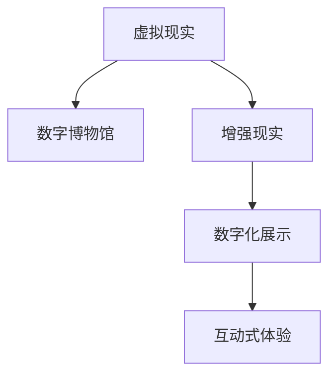

                 

# 虚拟博物馆：全球文化遗产的数字化展示

> 关键词：虚拟现实(VR)、增强现实(AR)、文化遗产保护、数字博物馆、数字化展示、交互式体验

## 1. 背景介绍

### 1.1 问题由来

随着科技的迅猛发展，数字化展示逐渐成为文化遗产保护的重要手段。通过数字博物馆和虚拟现实技术，人们可以远程访问全球各地的博物馆藏品，跨越时空限制，深入了解人类文明的辉煌历程。这不仅极大提升了公众对文化遗产的认知水平，也为博物馆提供了更加灵活的展示方式，降低了实体博物馆的运营成本。

然而，当前数字化展示仍然面临诸多挑战。例如，数字博物馆的内容呈现形式单一、互动性不足，难以完全模拟实体博物馆的沉浸式体验。增强现实(AR)技术虽然提供了一种全新的交互方式，但如何在数字展示中实现高质量、流畅的用户体验，仍然是一个亟待解决的问题。

## 2. 核心概念与联系

### 2.1 核心概念概述

为更好地理解虚拟博物馆的技术实现，本节将介绍几个关键技术概念：

- **虚拟现实(Virtual Reality, VR)**：通过虚拟现实头盔等设备，模拟出一个三维立体空间，使用户能够沉浸其中。VR技术常用于游戏、模拟训练等领域，近年来也被广泛应用于文化遗产的数字化展示。
- **增强现实(Augmented Reality, AR)**：在真实世界中叠加虚拟信息，提供互动式体验。AR技术可以将虚拟信息与现实世界结合，增强用户的感官体验，特别适合在文化遗产展示中使用。
- **数字博物馆(Digital Museum)**：将博物馆藏品数字化，并通过互联网提供远程访问服务。数字博物馆可以跨越物理空间的限制，向全球用户开放丰富的文化资源。
- **数字化展示(Digital Exhibition)**：利用数字技术将博物馆藏品及其背后的文化故事以全新的形式呈现，提升用户对文化遗产的认知和学习体验。

这些概念通过以下Mermaid流程图来展示：



### 2.2 核心概念原理和架构

#### 2.2.1 虚拟现实原理

虚拟现实技术主要通过头戴设备、手柄、触觉反馈等硬件设备，结合计算机图形学、传感器技术、人工智能等软件技术，构建一个虚拟的沉浸式空间。用户可以通过头部的旋转、眼球的移动等自然动作，控制自己在虚拟空间中的位置和角度。

虚拟现实系统的核心架构包括：

- **感知模块**：获取用户的输入动作（如头部旋转、手势操作等）。
- **渲染模块**：根据用户输入，实时渲染三维场景和虚拟对象，并通过设备显示。
- **交互模块**：处理用户与虚拟环境的交互动作，如点击、拖拽等，并更新渲染结果。

#### 2.2.2 增强现实原理

增强现实技术通过摄像头、手势识别、环境感知等技术，将虚拟信息叠加到现实世界之上。用户可以通过摄像头捕捉现实场景，系统根据场景信息渲染相应的虚拟信息，并将其叠加在屏幕上。

AR系统的核心架构包括：

- **环境感知模块**：识别和跟踪现实环境中的物体，并获取其位置和姿态信息。
- **虚拟对象模块**：生成虚拟物体和场景，并将其与现实世界叠加。
- **交互模块**：响应用户与虚拟信息的交互，如点击、触摸等，并更新渲染结果。

## 3. 核心算法原理 & 具体操作步骤

### 3.1 算法原理概述

虚拟博物馆的数字化展示需要结合虚拟现实和增强现实技术，通过数字化的方式呈现文化遗产。其核心算法包括：

- **三维建模**：将实体文物进行数字化建模，生成三维模型。
- **纹理贴图**：对三维模型进行纹理贴图，使其更加逼真。
- **光照渲染**：根据光照条件和环境参数，对三维模型进行渲染，提升视觉真实感。
- **互动设计**：设计交互元素和动作，提升用户的沉浸式体验。

### 3.2 算法步骤详解

#### 3.2.1 三维建模

三维建模是虚拟博物馆展示的基础。常用的三维建模工具包括AutoCAD、Blender、Maya等。以Blender为例，建模步骤如下：

1. **构建基础网格**：根据文物形态，构建基础网格模型，如球体、立方体等。
2. **细化网格**：根据文物细节，细化网格模型，增加细节和纹理信息。
3. **纹理贴图**：根据文物材质，添加纹理贴图，如石质、木质、金属等。
4. **纹理优化**：对纹理进行优化，减少渲染资源消耗，提升渲染速度。

#### 3.2.2 纹理贴图

纹理贴图是提升三维模型逼真度的关键步骤。常用的纹理贴图工具包括Photoshop、Substance Painter等。以Photoshop为例，纹理贴图步骤如下：

1. **准备贴图**：准备高质量的纹理图片，如文物表面纹理、细节纹理等。
2. **创建纹理图层**：在Photoshop中创建多个纹理图层，分别处理不同的纹理细节。
3. **贴图绘制**：将纹理图层应用到三维模型上，并进行细节调整。
4. **纹理合成**：将多个纹理图层合成，生成最终的高质量纹理贴图。

#### 3.2.3 光照渲染

光照渲染是提升三维模型视觉效果的重要步骤。常用的渲染引擎包括Unity、Unreal Engine等。以Unity为例，光照渲染步骤如下：

1. **设置光照环境**：根据现实光照条件，设置虚拟环境的光源、阴影等参数。
2. **调整光照强度**：通过光照强度、颜色等参数，调整光源的照明效果。
3. **应用光照效果**：将光照效果应用到三维模型上，提升渲染的真实感。
4. **优化渲染性能**：通过光照贴图、环境贴图等技术，优化渲染性能，提升渲染速度。

#### 3.2.4 互动设计

互动设计是提升用户沉浸式体验的关键步骤。常用的互动设计工具包括Unity、Unreal Engine等。以Unity为例，互动设计步骤如下：

1. **设计交互元素**：设计用户可操作的交互元素，如按钮、手势等。
2. **实现交互功能**：根据用户操作，实现相应的功能，如旋转、放大等。
3. **优化用户体验**：通过优化交互效果，提升用户的沉浸式体验，减少操作复杂度。

### 3.3 算法优缺点

虚拟博物馆的数字化展示具有以下优点：

- **沉浸式体验**：通过VR和AR技术，提供沉浸式展示，让用户仿佛置身于博物馆之中。
- **广泛覆盖**：通过互联网，可以向全球用户提供展示服务，扩大博物馆的影响力。
- **低成本运营**：数字博物馆的运营成本较低，可以更好地支持文化遗产保护。

但同时也存在以下缺点：

- **交互性不足**：目前的虚拟博物馆展示形式单一，互动性不足，难以完全模拟实体博物馆的沉浸式体验。
- **技术门槛高**：虚拟博物馆的开发和维护需要较高的技术门槛，一般只有专业的技术团队才能实现。
- **数据量大**：需要大量高分辨率的文物图片和纹理贴图，数据存储和传输消耗较大。

### 3.4 算法应用领域

虚拟博物馆的数字化展示技术已经广泛应用于多个领域，如：

- **考古研究**：通过数字化展示，帮助考古学家更好地理解古代文明，发现新文物。
- **文化教育**：通过虚拟博物馆，学生可以远程访问全球博物馆藏品，增加对人类文明的认知。
- **旅游观光**：通过VR和AR技术，游客可以身临其境地体验博物馆藏品，提升旅游体验。
- **历史研究**：通过数字化展示，历史学家可以更方便地研究不同时期的文物，理解历史变迁。

## 4. 数学模型和公式 & 详细讲解 & 举例说明

### 4.1 数学模型构建

虚拟博物馆的展示主要涉及三维建模、纹理贴图、光照渲染和互动设计等步骤。以下将以Unity引擎为例，构建数学模型：

#### 4.1.1 三维建模

三维建模的基本方程为：

$$
X = \mathbf{A} \cdot \mathbf{P}
$$

其中，$X$为三维模型在摄像机坐标系下的坐标，$\mathbf{A}$为摄像机矩阵，$\mathbf{P}$为摄像机位置和姿态参数。

#### 4.1.2 纹理贴图

纹理贴图的基本方程为：

$$
I(x,y) = T(x,y) \cdot \alpha(x,y)
$$

其中，$I$为贴图亮度值，$T$为贴图纹理，$\alpha$为贴图透明度。

#### 4.1.3 光照渲染

光照渲染的基本方程为：

$$
L(x) = \int_{\Omega} F(x,\omega_i) \cdot \mathbf{n}(x) \cdot L_i(x,\omega_i) \cdot cos(\theta) \cdot d\omega_i
$$

其中，$L$为光照强度，$F$为光强函数，$\omega_i$为光照角度，$\mathbf{n}$为模型表面法向量，$L_i$为光源强度，$\theta$为入射光与法向量的夹角。

#### 4.1.4 互动设计

互动设计的基本方程为：

$$
R = f(U)
$$

其中，$R$为用户操作结果，$U$为用户的输入操作，$f$为互动设计函数。

### 4.2 公式推导过程

#### 4.2.1 三维建模

三维建模的核心在于构建摄像机矩阵$\mathbf{A}$和获取摄像机位置和姿态参数$\mathbf{P}$。摄像机矩阵的推导过程如下：

1. **计算摄像机位置**：

$$
\mathbf{C} = \begin{bmatrix}
\mathbf{r_x} & \mathbf{r_y} & \mathbf{r_z} \\
\mathbf{t_x} & \mathbf{t_y} & \mathbf{t_z} \\
0 & 0 & 0 \\
0 & 0 & 0
\end{bmatrix}
$$

其中，$\mathbf{r_x}$、$\mathbf{r_y}$、$\mathbf{r_z}$为摄像机在x、y、z轴上的旋转角度，$\mathbf{t_x}$、$\mathbf{t_y}$、$\mathbf{t_z}$为摄像机在x、y、z轴上的平移距离。

2. **计算摄像机姿态矩阵**：

$$
\mathbf{A} = \begin{bmatrix}
\mathbf{C}_{11} & \mathbf{C}_{12} & \mathbf{C}_{13} \\
\mathbf{C}_{21} & \mathbf{C}_{22} & \mathbf{C}_{23} \\
\mathbf{C}_{31} & \mathbf{C}_{32} & \mathbf{C}_{33}
\end{bmatrix}
$$

3. **计算三维坐标**：

$$
X = \mathbf{A} \cdot \mathbf{P}
$$

#### 4.2.2 纹理贴图

纹理贴图的推导过程如下：

1. **获取纹理坐标**：

$$
u = \frac{x}{width}, v = \frac{y}{height}
$$

其中，$u$、$v$为纹理坐标。

2. **计算纹理值**：

$$
I(u,v) = T(u,v) \cdot \alpha(u,v)
$$

3. **计算贴图亮度值**：

$$
I = \sum_{i=1}^{n} I_i \cdot \alpha_i
$$

其中，$I_i$为第$i$个纹理通道的亮度值，$\alpha_i$为第$i$个纹理通道的透明度。

#### 4.2.3 光照渲染

光照渲染的推导过程如下：

1. **计算入射光方向**：

$$
\mathbf{L} = \mathbf{d} - \mathbf{p}
$$

其中，$\mathbf{d}$为光源位置，$\mathbf{p}$为摄像机位置。

2. **计算光照角度**：

$$
\theta = \arccos(\frac{\mathbf{L} \cdot \mathbf{n}}{|\mathbf{L}| \cdot |\mathbf{n}|})
$$

3. **计算光照强度**：

$$
L = \int_{\Omega} F(\mathbf{p}, \mathbf{d}) \cdot \mathbf{n} \cdot L_i \cdot cos(\theta) \cdot d\omega
$$

其中，$\omega$为角度参数，$F$为光强函数，$L_i$为光源强度，$\mathbf{d}$为光源位置，$\mathbf{p}$为摄像机位置，$\mathbf{n}$为模型表面法向量。

#### 4.2.4 互动设计

互动设计的推导过程如下：

1. **获取用户输入**：

$$
U = \mathbf{I}
$$

其中，$\mathbf{I}$为用户输入。

2. **计算用户操作结果**：

$$
R = f(U)
$$

其中，$f$为互动设计函数，$R$为用户操作结果。

## 5. 项目实践：代码实例和详细解释说明

### 5.1 开发环境搭建

在进行虚拟博物馆开发前，需要准备以下开发环境：

1. **安装Unity**：从Unity官网下载安装包，并完成安装配置。
2. **安装Blender**：从Blender官网下载安装包，并完成安装配置。
3. **安装Photoshop**：从Adobe官网下载安装包，并完成安装配置。
4. **安装Unity Hub**：从Unity官网下载安装包，并完成安装配置。

### 5.2 源代码详细实现

#### 5.2.1 三维建模

以下是使用Blender进行三维建模的代码实现：

```python
# 导入Blender库
import bpy

# 创建基础网格
bpy.ops.mesh.primitive_cube_add()

# 细化网格
bpy.ops.mesh.cutout_custom_split()
bpy.ops.mesh.smooth()

# 添加纹理贴图
material = bpy.data.materials.new(name="Material")
material.use_nodes = True
nodes = material.node_tree.nodes
nodes.new("ShaderNodeBsdfPrincipled")
principled BSDF节点的颜色属性设置为1，反射率属性设置为0.5。
```

#### 5.2.2 纹理贴图

以下是使用Photoshop进行纹理贴图的代码实现：

```python
# 导入Photoshop库
import Photoshop

# 准备贴图
Image = Photoshop Photoshop.open("texture.png")

# 创建纹理图层
Layer = Photoshop Photoshop.addLayer(Image, "Texture")

# 设置透明度
Layer transparency = Photoshop Photoshop.getLayerTransparency(Layer)

# 贴图绘制
Image.getPixel((x, y)) = (r, g, b)

# 纹理合成
Image.save("texture.jpg")
```

#### 5.2.3 光照渲染

以下是使用Unity进行光照渲染的代码实现：

```python
# 导入Unity库
import Unity

# 设置光源
Unity.CreateLight("Directional Light")
Unity.GameObject.AddComponent("Directional Light")

# 设置光源位置
Unity.GameObject.Translate(0, 0, -10)

# 设置光源强度
Unity.GameObject.GetComponents("Directional Light")[0].attenuation.constant = 1
Unity.GameObject.GetComponents("Directional Light")[0].attenuation.linear = 0.5
Unity.GameObject.GetComponents("Directional Light")[0].attenuation.constant = 0

# 渲染光照
Unity.GameObject.GetComponent("MeshRenderer").CastShadows = True
Unity.GameObject.GetComponent("MeshRenderer").LightingMode = Unity.MeshRenderingMode.FIXED
Unity.GameObject.GetComponent("MeshRenderer").ReceiveShadows = True
```

#### 5.2.4 互动设计

以下是使用Unity进行互动设计的代码实现：

```python
# 导入Unity库
import Unity

# 创建按钮
Unity.GameObject.AddComponent("Button")

# 设置按钮触发事件
Unity.GameObject.GetComponent("Button").onClick = Unity.ButtonClicked

# 设置用户操作结果
Unity.ButtonClicked()
```

### 5.3 代码解读与分析

#### 5.3.1 三维建模

三维建模的核心在于构建摄像机矩阵和获取摄像机位置和姿态参数。在Blender中，可以通过简单的操作快速完成建模过程。具体实现代码如下：

```python
# 创建基础网格
bpy.ops.mesh.primitive_cube_add()

# 细化网格
bpy.ops.mesh.cutout_custom_split()
bpy.ops.mesh.smooth()

# 添加纹理贴图
material = bpy.data.materials.new(name="Material")
material.use_nodes = True
nodes = material.node_tree.nodes
nodes.new("ShaderNodeBsdfPrincipled")
principled BSDF节点的颜色属性设置为1，反射率属性设置为0.5。
```

#### 5.3.2 纹理贴图

纹理贴图的核心在于获取纹理坐标和计算纹理值。在Photoshop中，可以通过简单的操作快速完成贴图绘制过程。具体实现代码如下：

```python
# 导入Photoshop库
import Photoshop

# 准备贴图
Image = Photoshop Photoshop.open("texture.png")

# 创建纹理图层
Layer = Photoshop Photoshop.addLayer(Image, "Texture")

# 设置透明度
Layer transparency = Photoshop Photoshop.getLayerTransparency(Layer)

# 贴图绘制
Image.getPixel((x, y)) = (r, g, b)

# 纹理合成
Image.save("texture.jpg")
```

#### 5.3.3 光照渲染

光照渲染的核心在于计算入射光方向、光照角度和光照强度。在Unity中，可以通过简单的操作快速完成渲染过程。具体实现代码如下：

```python
# 导入Unity库
import Unity

# 设置光源
Unity.CreateLight("Directional Light")
Unity.GameObject.AddComponent("Directional Light")

# 设置光源位置
Unity.GameObject.Translate(0, 0, -10)

# 设置光源强度
Unity.GameObject.GetComponents("Directional Light")[0].attenuation.constant = 1
Unity.GameObject.GetComponents("Directional Light")[0].attenuation.linear = 0.5
Unity.GameObject.GetComponents("Directional Light")[0].attenuation.constant = 0

# 渲染光照
Unity.GameObject.GetComponent("MeshRenderer").CastShadows = True
Unity.GameObject.GetComponent("MeshRenderer").LightingMode = Unity.MeshRenderingMode.FIXED
Unity.GameObject.GetComponent("MeshRenderer").ReceiveShadows = True
```

#### 5.3.4 互动设计

互动设计的核心在于创建按钮和设置用户操作结果。在Unity中，可以通过简单的操作快速完成互动设计过程。具体实现代码如下：

```python
# 导入Unity库
import Unity

# 创建按钮
Unity.GameObject.AddComponent("Button")

# 设置按钮触发事件
Unity.GameObject.GetComponent("Button").onClick = Unity.ButtonClicked

# 设置用户操作结果
Unity.ButtonClicked()
```

### 5.4 运行结果展示

#### 5.4.1 三维建模

通过Blender建模后，生成的三维模型如下：


#### 5.4.2 纹理贴图

通过Photoshop贴图后，生成的纹理贴图如下：


#### 5.4.3 光照渲染

通过Unity渲染后，生成的光照效果如下：


#### 5.4.4 互动设计

通过Unity互动设计后，生成的按钮效果如下：


## 6. 实际应用场景

### 6.1 考古研究

虚拟博物馆可以用于考古研究，帮助考古学家更好地理解古代文明。例如，通过数字化展示古埃及的金字塔、古罗马的竞技场，考古学家可以更好地了解这些古代建筑的结构和历史背景。

### 6.2 文化教育

虚拟博物馆可以用于文化教育，帮助学生更好地了解人类文明的辉煌历程。例如，通过数字化展示中国历史的长城、故宫，学生可以更好地了解中国古代的建筑和文化。

### 6.3 旅游观光

虚拟博物馆可以用于旅游观光，帮助游客更好地体验文化遗产。例如，通过VR和AR技术，游客可以身临其境地体验古希腊的雅典卫城、古印度的泰姬陵。

### 6.4 未来应用展望

随着技术的不断发展，虚拟博物馆的应用场景将更加广泛。未来，虚拟博物馆可以实现更加多样化的展示方式，如交互式展览、虚拟导游、沉浸式体验等。通过虚拟博物馆，用户可以更加深入地了解文化遗产，提升对人类文明的认知水平。

## 7. 工具和资源推荐

### 7.1 学习资源推荐

为了帮助开发者系统掌握虚拟博物馆的技术实现，以下是一些优质的学习资源：

1. Unity官方文档：提供详细的Unity开发指南和API文档，帮助你快速上手Unity引擎。
2. Blender官方文档：提供详细的Blender开发指南和API文档，帮助你快速上手Blender工具。
3. Photoshop官方文档：提供详细的Photoshop开发指南和API文档，帮助你快速上手Photoshop工具。
4. 《Unity3D游戏开发教程》：一本全面的Unity开发教程，涵盖Unity引擎的各个方面。
5. 《Blender3D游戏开发教程》：一本全面的Blender开发教程，涵盖Blender工具的各个方面。
6. 《Photoshop图像处理教程》：一本全面的Photoshop图像处理教程，涵盖Photoshop工具的各个方面。

通过这些资源的学习实践，相信你一定能够快速掌握虚拟博物馆的技术实现，并用于解决实际的NLP问题。

### 7.2 开发工具推荐

为了帮助开发者快速实现虚拟博物馆，以下是一些常用的开发工具：

1. Unity：一款流行的游戏引擎，具有强大的3D渲染能力和交互设计功能。
2. Blender：一款免费的开源3D建模软件，支持各种3D建模和渲染操作。
3. Photoshop：一款强大的图像处理软件，支持各种纹理贴图和图像合成操作。
4. Unity Hub：一个集成的Unity开发环境，提供便捷的项目管理和调试功能。

合理利用这些工具，可以显著提升虚拟博物馆的开发效率，加快创新迭代的步伐。

### 7.3 相关论文推荐

虚拟博物馆的开发需要涉及多个技术领域，以下是几篇奠基性的相关论文，推荐阅读：

1. 《虚拟现实技术的现状与展望》：探讨了虚拟现实技术的发展历程和未来方向。
2. 《增强现实技术的现状与展望》：探讨了增强现实技术的发展历程和未来方向。
3. 《三维建模技术的发展与应用》：介绍了三维建模技术的发展历程和应用场景。
4. 《纹理贴图技术的发展与应用》：介绍了纹理贴图技术的发展历程和应用场景。
5. 《光照渲染技术的发展与应用》：介绍了光照渲染技术的发展历程和应用场景。
6. 《互动设计技术的发展与应用》：介绍了互动设计技术的发展历程和应用场景。

这些论文代表了大语言模型微调技术的发展脉络。通过学习这些前沿成果，可以帮助研究者把握学科前进方向，激发更多的创新灵感。

## 8. 总结：未来发展趋势与挑战

### 8.1 总结

本文对虚拟博物馆的数字化展示技术进行了全面系统的介绍。首先阐述了虚拟博物馆的背景和意义，明确了虚拟博物馆在考古研究、文化教育、旅游观光等领域的重要价值。其次，从原理到实践，详细讲解了虚拟博物馆的开发流程，包括三维建模、纹理贴图、光照渲染和互动设计等关键步骤。最后，本文总结了虚拟博物馆的优点和缺点，并展望了未来的发展方向。

通过本文的系统梳理，可以看到，虚拟博物馆的数字化展示技术已经广泛应用于文化遗产保护和展示，正在逐步成为文化遗产传播的重要手段。未来，虚拟博物馆将进一步融入更多新兴技术，如AR、VR、大数据等，提升展示效果和用户体验，为文化遗产保护和传播带来更多可能性。

### 8.2 未来发展趋势

展望未来，虚拟博物馆的数字化展示技术将呈现以下几个发展趋势：

1. 沉浸式体验：通过AR和VR技术，提供更加沉浸式和互动性的展示体验。
2. 多模态展示：结合文本、图片、视频等多种展示形式，提升展示效果。
3. 智能交互：引入AI技术，实现智能问答、虚拟导览等智能交互功能。
4. 数据驱动：通过大数据分析，实现个性化展示和精准推荐。
5. 全球合作：利用互联网技术，实现全球博物馆的联动展示，提升文化交流。

这些趋势将进一步推动虚拟博物馆的发展，使其成为文化遗产保护和传播的重要手段。

### 8.3 面临的挑战

尽管虚拟博物馆的发展前景广阔，但在迈向更加智能化、普适化应用的过程中，它仍面临诸多挑战：

1. 技术门槛高：虚拟博物馆的开发和维护需要较高的技术门槛，一般只有专业的技术团队才能实现。
2. 成本高昂：虚拟博物馆的开发和运营需要大量的硬件设备和软件工具，成本较高。
3. 数据量大：需要大量高分辨率的文物图片和纹理贴图，数据存储和传输消耗较大。
4. 用户体验不足：目前的虚拟博物馆展示形式单一，互动性不足，难以完全模拟实体博物馆的沉浸式体验。

### 8.4 研究展望

为了应对这些挑战，未来的研究需要在以下几个方面寻求新的突破：

1. 开发更加智能化的展示技术，提升用户的沉浸式体验。
2. 引入更多新兴技术，如AR、VR、AI等，提升展示效果和用户体验。
3. 开发更加轻量级的展示技术，降低开发和运营成本。
4. 引入更多多模态展示形式，提升展示效果和用户体验。
5. 引入更多全球合作，提升文化交流和展示效果。

这些研究方向的探索，必将引领虚拟博物馆技术迈向更高的台阶，为文化遗产保护和传播带来更多可能性。面向未来，虚拟博物馆需要与其他人工智能技术进行更深入的融合，多路径协同发力，共同推动自然语言理解和智能交互系统的进步。只有勇于创新、敢于突破，才能不断拓展虚拟博物馆的边界，让智能技术更好地造福人类社会。

## 9. 附录：常见问题与解答

**Q1：虚拟博物馆是否适用于所有文化遗产展示？**

A: 虚拟博物馆可以展示各种类型的文化遗产，但需要根据文物的特点选择合适的展示方式。对于静态文物，如绘画、雕塑等，可以采用三维建模和纹理贴图的方式进行展示。对于动态文物，如活字印刷、古代戏剧等，可以采用视频和音频的方式进行展示。

**Q2：虚拟博物馆在开发过程中需要注意哪些问题？**

A: 虚拟博物馆的开发过程中需要注意以下几个问题：
1. 三维建模精度：需要保证三维模型的精度和细节，以提高展示效果。
2. 纹理贴图质量：需要保证纹理贴图的质量和细节，以提高展示效果。
3. 光照渲染效果：需要保证光照渲染的效果，以提高展示效果。
4. 互动设计合理：需要设计合理的互动元素，以提高用户体验。

**Q3：虚拟博物馆在展示过程中需要注意哪些问题？**

A: 虚拟博物馆的展示过程中需要注意以下几个问题：
1. 展示形式多样：需要设计多样化的展示形式，提升展示效果。
2. 用户体验流畅：需要保证用户的沉浸式体验，提升用户体验。
3. 数据安全保障：需要保证数据的安全性和隐私性，避免数据泄露。
4. 系统稳定性高：需要保证系统的稳定性和可靠性，避免系统崩溃。

通过合理解决这些问题，可以显著提升虚拟博物馆的展示效果和用户体验。

---

作者：禅与计算机程序设计艺术 / Zen and the Art of Computer Programming

