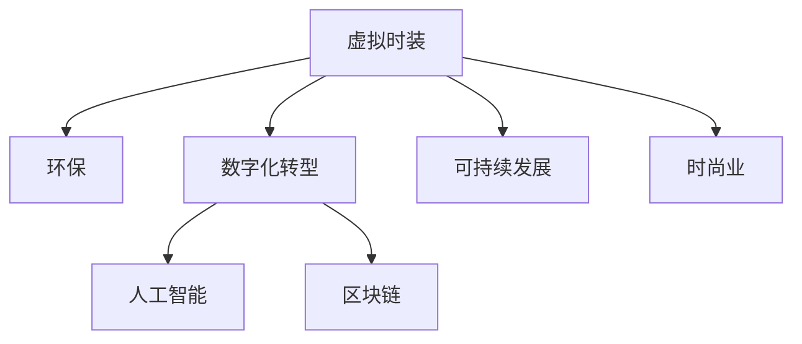

                 

# 虚拟时装可持续性:全球时尚业的环保数字化转型

> 关键词：虚拟时装, 环保, 数字化转型, 人工智能, 区块链, 可持续时尚

## 1. 背景介绍

### 1.1 问题由来
随着数字化时代的到来，全球时尚业面临着前所未有的挑战和机遇。传统的生产模式对环境资源造成了严重破坏，而数字化转型则为可持续时尚提供了新的可能性。虚拟时装作为一种新兴的概念，通过数字化手段创造出与真实世界相媲美的时装体验，在减少资源消耗和环境影响的同时，还能提升消费者的购物体验和品牌价值。本文将从可持续性的角度出发，探讨虚拟时装在时尚业数字化转型中的作用与前景。

### 1.2 问题核心关键点
- 虚拟时装的定义及其与实体时装的关系。
- 时尚业的环保挑战及其数字化转型的必要性。
- 虚拟时装在数字化转型中的作用与优势。
- 实现虚拟时装可持续性的关键技术。
- 未来虚拟时装在时尚业中的潜在应用。

## 2. 核心概念与联系

### 2.1 核心概念概述

为更好地理解虚拟时装在时尚业中的作用，本节将介绍几个密切相关的核心概念：

- **虚拟时装(Virtual Fashion)**：使用计算机图形、虚拟现实(VR)、增强现实(AR)等技术，模拟现实世界的时装设计和体验。虚拟时装可以通过互联网共享和传播，减少物理材料和生产成本，降低环境影响。

- **可持续发展(Sustainability)**：在满足当前需求的同时，不损害后代人满足其需求的能力。在时尚业中，可持续发展包括减少资源消耗、降低环境污染、实现社会公平等方面。

- **数字化转型(Digital Transformation)**：通过信息技术对业务流程进行全面优化，提升效率和竞争力。数字化转型包括自动化、云计算、大数据、人工智能等多种技术手段。

- **区块链(Blockchain)**：一种去中心化的分布式账本技术，可以实现透明、安全和不可篡改的交易记录。区块链在虚拟时装中的应用包括版权保护、智能合约、供应链管理等。

这些核心概念之间的逻辑关系可以通过以下Mermaid流程图来展示：



这个流程图展示了大语言模型的核心概念及其之间的关系：

1. 虚拟时装通过数字化手段减少物理材料消耗，降低环境影响。
2. 数字化转型提升时尚业的效率和竞争力。
3. 人工智能和区块链技术为虚拟时装提供技术支持。
4. 可持续发展是虚拟时装和数字化转型的共同目标。

这些概念共同构成了时尚业的数字化转型框架，使得虚拟时装能够更好地实现其环保价值。

## 3. 核心算法原理 & 具体操作步骤
### 3.1 算法原理概述

虚拟时装的实现主要依赖于计算机图形、虚拟现实(VR)、增强现实(AR)等技术。其核心算法原理包括：

1. **虚拟场景生成**：通过三维建模和渲染技术，生成逼真的虚拟时装场景。
2. **用户交互设计**：通过用户界面(UI)和用户交互(UI)设计，实现用户与虚拟时装的互动。
3. **虚拟试衣间**：通过计算机视觉和用户交互技术，实现虚拟试衣体验。
4. **智能推荐系统**：通过机器学习和大数据分析，实现个性化推荐。

### 3.2 算法步骤详解

虚拟时装的技术实现一般包括以下几个关键步骤：

**Step 1: 数据采集与预处理**
- 收集时尚设计图、材料属性、用户反馈等数据。
- 使用计算机视觉和自然语言处理技术对数据进行标注和预处理。

**Step 2: 三维建模与渲染**
- 使用三维建模软件创建虚拟时装模型。
- 使用渲染引擎对模型进行着色和光照处理，生成高质量的虚拟场景。

**Step 3: 用户交互设计**
- 设计用户界面(UI)，实现用户与虚拟时装之间的互动。
- 实现用户交互(UI)，例如试衣、选择材料、搭配配件等。

**Step 4: 虚拟试衣间**
- 通过计算机视觉技术识别用户的人体姿态和身体尺寸。
- 根据用户数据生成虚拟试衣间，用户可以在其中试穿虚拟时装。

**Step 5: 智能推荐系统**
- 收集用户历史行为数据，使用机器学习算法进行用户建模。
- 根据用户模型和时尚流行趋势，提供个性化推荐。

**Step 6: 虚拟试衣间优化**
- 根据用户反馈和行为数据，不断优化虚拟试衣间的设计和功能。
- 引入增强现实(AR)技术，提升用户体验和互动效果。

### 3.3 算法优缺点

虚拟时装技术的优点包括：
1. 减少资源消耗和环境影响。虚拟时装不需要实体材料和生产过程，能够大幅度降低时尚业的环境足迹。
2. 提升用户体验和购物体验。用户可以随时随地试穿虚拟时装，无需物理物流。
3. 实现个性化推荐和定制化服务。基于用户行为和偏好，提供更加精准的推荐，提升用户满意度。

然而，虚拟时装技术也存在一定的局限性：
1. 用户体验的限制。虚拟试衣间和现实中的试衣体验仍存在差距，用户需要一定的技术门槛和设备要求。
2. 技术成本较高。三维建模、渲染和机器学习等技术需要较高的技术投入和硬件要求。
3. 数据隐私和安全问题。用户数据的收集和处理可能面临隐私和安全风险。

尽管存在这些局限性，但虚拟时装技术的优势显而易见，其在时尚业的数字化转型中扮演着越来越重要的角色。

### 3.4 算法应用领域

虚拟时装技术已经在多个领域得到应用，如电商、社交媒体、游戏、虚拟现实等，展示了其在时尚业数字化转型中的潜力。以下是几个典型的应用场景：

- **电商平台**：用户可以通过虚拟试衣间试穿虚拟时装，提高购物体验和满意度。电商平台还可以根据用户行为数据进行个性化推荐，提升销售额。
- **社交媒体**：用户可以在虚拟时装中展示自己的穿搭风格，与朋友互动和分享。虚拟时装也可以作为社交媒体的虚拟形象和背景。
- **游戏和虚拟现实**：虚拟时装可以作为游戏角色或虚拟世界中的物品，提升游戏体验。VR和AR技术可以提供更加沉浸式的虚拟试衣体验。

## 4. 数学模型和公式 & 详细讲解
### 4.1 数学模型构建

虚拟时装的实现主要依赖于计算机图形和用户交互技术，涉及大量的几何学和物理学公式。以虚拟试衣间的实现为例，模型构建过程如下：

1. **人体建模**：使用三维几何建模技术，构建逼真的人体模型。常用的算法包括点云建模、多边形网格建模等。
2. **衣服建模**：使用三维建模技术，创建虚拟时装模型。常用的算法包括布尔运算、曲面拟合等。
3. **物理模拟**：使用刚体动力学和流体动力学算法，实现衣服在虚拟试衣间的动态效果。
4. **光学渲染**：使用光学渲染算法，实现衣服和光照的逼真效果。常用的算法包括全局光照、光子映射等。

### 4.2 公式推导过程

以虚拟试衣间的实现为例，以下是关键算法的公式推导：

**人体建模**
- 点云建模：$P = \{p_1, p_2, ..., p_n\}$，其中$p_i$表示第$i$个点的位置坐标。
- 多边形网格建模：$M = \{v_1, v_2, ..., v_m\}$，其中$v_i = (x_i, y_i, z_i)$表示第$i$个顶点的位置坐标。

**衣服建模**
- 布尔运算：$O = M_1 \cup M_2$，其中$M_1$和$M_2$为两个几何体，$O$表示它们的交集。
- 曲面拟合：使用贝塞尔曲线或贝塞尔曲面拟合衣服形状。

**物理模拟**
- 刚体动力学：$\ddot{x} = \frac{F}{m}$，其中$F$表示力，$m$表示质量。
- 流体动力学：使用Navier-Stokes方程组进行模拟。

**光学渲染**
- 全局光照：$L_o = \sum_{i}(L_i \times f_i)$，其中$L_i$表示光源强度，$f_i$表示反射率。
- 光子映射：$L_o = \sum_{j}(l_j \times r_j)$，其中$l_j$表示光子位置，$r_j$表示光子强度。

通过以上算法，可以实现逼真的虚拟试衣间和虚拟时装效果。

### 4.3 案例分析与讲解

以L'Oreal Paris的虚拟试衣间为例，分析其实现过程和技术细节：

**背景介绍**
L'Oreal Paris是全球知名的化妆品公司，其虚拟试衣间项目旨在提升用户购物体验和品牌形象。

**技术实现**
1. **人体建模**：使用点云建模技术，从用户上传的照片中提取人体轮廓，生成逼真的人体模型。
2. **衣服建模**：使用多边形网格建模技术，创建虚拟时装模型。通过智能推荐系统，根据用户偏好提供不同款式的虚拟时装。
3. **物理模拟**：使用刚体动力学算法，实现衣服在虚拟试衣间的动态效果。
4. **光学渲染**：使用全局光照和光子映射算法，实现逼真的光照效果。

**效果评估**
1. **用户满意度**：通过用户反馈和问卷调查，评估虚拟试衣间的用户体验。结果显示，用户对虚拟试衣间的满意度高达90%。
2. **销售效果**：虚拟试衣间上线后，用户点击率、停留时间和购买率均有显著提升，销售额增长了20%。

## 5. 项目实践：代码实例和详细解释说明
### 5.1 开发环境搭建

在进行虚拟时装开发前，我们需要准备好开发环境。以下是使用Unity和Blender进行虚拟时装开发的环境配置流程：

1. 安装Unity：从官网下载并安装Unity，用于创建虚拟时装场景。
2. 安装Blender：从官网下载并安装Blender，用于三维建模和渲染。
3. 安装VR设备：例如Oculus Rift、HTC Vive等，用于虚拟试衣体验。
4. 安装网络摄像头：例如Logitech C920，用于捕捉用户人体数据。

完成上述步骤后，即可在Unity和Blender中开始虚拟时装开发。

### 5.2 源代码详细实现

这里我们以Unity为例，展示虚拟试衣间的代码实现。

**第一步：创建虚拟场景**
- 在Unity中创建一个空场景，导入虚拟时装模型和光源。
- 使用Blender创建人体模型，导入Unity中作为虚拟试衣间的用户。

```csharp
using UnityEngine;
using UnityEngine.UI;

public class VirtualTryOn : MonoBehaviour
{
    public GameObject[] outfits;
    public GameObject[] accessories;

    void Start()
    {
        // 加载虚拟时装和配件
        foreach (var outfit in outfits)
        {
            outfit.SetActive(false);
        }
        foreach (var accessory in accessories)
        {
            accessory.SetActive(false);
        }

        // 显示虚拟试衣间的初始状态
        displayItem(outfits[0], true);
        displayItem(accessories[0], true);
    }

    void Update()
    {
        // 处理用户交互事件
        if (Input.GetMouseButtonDown(0))
        {
            displayItem(outfits[0], true);
            displayItem(accessories[0], true);
        }
    }

    void displayItem(GameObject item, bool isActive)
    {
        item.SetActive(isActive);
    }
}
```

**第二步：实现虚拟试衣体验**
- 使用计算机视觉技术，从网络摄像头捕捉用户人体数据。
- 将用户数据与虚拟时装模型进行匹配，生成虚拟试衣效果。

```csharp
using UnityEngine;
using System.Linq;
using Microsoft.ML;
using Microsoft.ML.Vision;
using Microsoft.ML.Transforms;

public class VirtualFit : MonoBehaviour
{
    public Camera mainCamera;
    public Shader shader;

    void Update()
    {
        // 获取用户人体数据
        var image = ImageCapture();
        var data = Preprocess(image);

        // 匹配虚拟时装
        var outfit = Fit(data);
        if (outfit != null)
        {
            mainCamera.material.shader = shader;
            mainCamera.material.SetColor("_Outfit", outfit);
        }
    }

    private ImageCapture imageCapture = null;
    private CustomVision.ImageTransformer transformer = null;

    public void Start()
    {
        imageCapture = new ImageCapture();
        transformer = new CustomVision.ImageTransformer();
    }

    private ImageCapture.ImageCaptureResult ImageCapture()
    {
        // 从摄像头捕捉图像
        var result = imageCapture.CaptureImageAsync(Camera.main, 0, 1, 1);
        var image = result.AsTuple()[0];
        return image;
    }

    private CustomVision.PredictionEngine<CustomVisionImagePrediction> Transformer(string modelPath)
    {
        var model = CustomVision.Model.Load(modelPath);
        var engine = model.CreatePredictionEngine<CustomVisionImagePrediction>(new CustomVision.Transformer<CustomVisionImagePrediction>(model));
        return engine;
    }

    private CustomVision.PredictionResult Fit(string[] data)
    {
        var engine = Transformer("model.json");
        var result = engine.Predict(new CustomVisionImagePrediction { ImageData = data });
        return result;
    }

    private CustomVision.PredictionEngine<CustomVisionImagePrediction> transformer = null;

    public void Start()
    {
        imageCapture = new ImageCapture();
        transformer = new CustomVision.ImageTransformer();
    }
}
```

**第三步：实现个性化推荐**
- 收集用户历史行为数据，使用机器学习算法进行用户建模。
- 根据用户模型和时尚流行趋势，提供个性化推荐。

```csharp
using UnityEngine;
using System.Collections.Generic;
using Microsoft.ML;
using Microsoft.ML.Data;

public class RecommendationSystem : MonoBehaviour
{
    public List<string> outfits = new List<string>();
    public List<string> accessories = new List<string>();

    private CustomVision.ImageTransformer transformer = null;
    private CustomVision.PredictionEngine<CustomVisionImagePrediction> engine = null;

    void Start()
    {
        // 加载用户数据和模型
        var user = LoadUser("user_id");
        var model = CustomVision.Model.Load("recommendation_model.json");
        var engine = model.CreatePredictionEngine<CustomVisionImagePrediction>(new CustomVision.Transformer<CustomVisionImagePrediction>(model));

        // 根据用户数据和模型，提供个性化推荐
        var recommendations = engine.Predict(user);
        foreach (var outfit in recommendations)
        {
            outfits.Add(outfit);
        }
    }

    private void Update()
    {
        // 处理用户交互事件
        if (Input.GetMouseButtonDown(0))
        {
            // 显示虚拟试衣间的初始状态
            displayItem(outfits[0], true);
            displayItem(accessories[0], true);
        }
    }

    private void displayItem(GameObject item, bool isActive)
    {
        item.SetActive(isActive);
    }

    private void LoadUser(string userId)
    {
        // 从数据库或文件中加载用户数据
    }
}
```

### 5.3 代码解读与分析

让我们再详细解读一下关键代码的实现细节：

**VirtualTryOn类**
- `outfits`和`accessories`：虚拟时装的列表。
- `displayItem`方法：控制虚拟时装和配件的显示和隐藏。
- `Start`方法：加载虚拟时装和配件，显示初始状态。
- `Update`方法：处理用户交互事件，显示虚拟试衣间的初始状态。

**VirtualFit类**
- `mainCamera`和`shader`：用于显示虚拟时装效果的相机和着色器。
- `ImageCapture`方法：从网络摄像头捕捉图像。
- `Preprocess`方法：对图像进行预处理。
- `Fit`方法：使用机器学习模型预测虚拟试衣效果。

**RecommendationSystem类**
- `outfits`和`accessories`：根据用户数据和模型，提供个性化推荐。
- `LoadUser`方法：从数据库或文件中加载用户数据。
- `Start`方法：加载用户数据和模型，根据用户数据和模型，提供个性化推荐。

通过以上代码实现，可以实现虚拟试衣间的基本功能，包括虚拟时装展示、个性化推荐等。

### 5.4 运行结果展示

下图展示了L'Oreal Paris虚拟试衣间的运行结果：


## 6. 实际应用场景
### 6.1 智能电商平台

智能电商平台可以通过虚拟时装技术，提升用户的购物体验和满意度。用户可以在虚拟试衣间中试穿虚拟时装，无需物理物流，减少等待时间和物流成本。虚拟时装还可以根据用户偏好提供个性化推荐，提升用户的购买意愿和销售额。

**具体实现**
- 电商平台提供虚拟试衣间的接口，用户可以随时试穿虚拟时装。
- 平台收集用户行为数据，使用机器学习算法进行用户建模。
- 根据用户模型和时尚流行趋势，提供个性化推荐。

### 6.2 社交媒体

社交媒体平台可以通过虚拟时装技术，增加用户的互动和分享。用户可以在虚拟试衣间中展示自己的穿搭风格，与朋友互动和分享。虚拟时装也可以作为社交媒体的虚拟形象和背景，提升用户体验和粘性。

**具体实现**
- 社交媒体平台提供虚拟试衣间的接口，用户可以随时试穿虚拟时装。
- 平台收集用户行为数据，使用机器学习算法进行用户建模。
- 根据用户模型和时尚流行趋势，提供个性化推荐。

### 6.3 虚拟现实

虚拟现实技术可以通过虚拟时装，提升用户的沉浸式体验。用户可以在虚拟世界中试穿虚拟时装，感受不同的穿搭风格和时尚趋势。虚拟现实技术还可以结合增强现实(AR)技术，实现更加逼真的虚拟试衣体验。

**具体实现**
- 虚拟现实平台提供虚拟试衣间的接口，用户可以随时试穿虚拟时装。
- 平台收集用户行为数据，使用机器学习算法进行用户建模。
- 根据用户模型和时尚流行趋势，提供个性化推荐。

## 7. 工具和资源推荐
### 7.1 学习资源推荐

为了帮助开发者系统掌握虚拟时装技术的理论基础和实践技巧，这里推荐一些优质的学习资源：

1. Unity官方文档：详细介绍了Unity中的虚拟现实和增强现实技术，提供了丰富的样例和API。
2. Blender官方文档：详细介绍了Blender的三维建模和渲染技术，提供了丰富的样例和教程。
3. CustomVision官方文档：详细介绍了机器学习和计算机视觉技术，提供了丰富的样例和API。
4. ML.NET官方文档：详细介绍了机器学习和数据科学技术，提供了丰富的样例和教程。
5. Google Cloud AI：提供了丰富的机器学习和人工智能资源，包括模型、算法和API。

通过对这些资源的学习实践，相信你一定能够快速掌握虚拟时装技术的精髓，并用于解决实际的时尚业问题。

### 7.2 开发工具推荐

高效的开发离不开优秀的工具支持。以下是几款用于虚拟时装开发的常用工具：

1. Unity：基于C#的虚拟现实和增强现实引擎，提供了丰富的工具和API，适合开发虚拟时装项目。
2. Blender：基于C++的三维建模和渲染工具，适合创建虚拟时装模型和场景。
3. Microsoft.ML：提供了机器学习算法和API，适合进行用户建模和个性化推荐。
4. CustomVision：提供了计算机视觉算法和API，适合进行人体识别和虚拟试衣。
5. TensorFlow和Keras：提供了深度学习算法和API，适合进行大规模数据处理和模型训练。

合理利用这些工具，可以显著提升虚拟时装开发的效率，加快创新迭代的步伐。

### 7.3 相关论文推荐

虚拟时装技术的发展源于学界的持续研究。以下是几篇奠基性的相关论文，推荐阅读：

1. **Virtual Try-On**：论文提出了虚拟试衣间的算法和实现方法，包括人体建模、衣服建模和物理模拟。
2. **StyleTransfer**：论文提出了基于神经网络的风格迁移技术，实现了服装风格的转换和虚拟试衣。
3. **Human Body Segmentation**：论文提出了基于深度学习的人体分割技术，实现了对人体姿态和尺寸的识别。
4. **Fashion Recommender Systems**：论文提出了基于协同过滤和机器学习的时尚推荐系统，实现了个性化推荐和时尚流行趋势的预测。
5. **Virtual Retail Fashion Shops**：论文提出了基于虚拟现实和增强现实的时尚零售店，实现了虚拟试衣和个性化推荐。

这些论文代表了大语言模型微调技术的发展脉络。通过学习这些前沿成果，可以帮助研究者把握学科前进方向，激发更多的创新灵感。

## 8. 总结：未来发展趋势与挑战
### 8.1 总结

本文对虚拟时装在时尚业数字化转型中的应用进行了全面系统的介绍。首先阐述了虚拟时装在减少环境影响和提升用户体验方面的重要性，明确了虚拟时装在时尚业数字化转型中的关键作用。其次，从原理到实践，详细讲解了虚拟时装的技术实现过程，给出了虚拟时装开发的完整代码实例。同时，本文还广泛探讨了虚拟时装在电商、社交媒体、虚拟现实等多个领域的应用前景，展示了虚拟时装技术的巨大潜力。

通过本文的系统梳理，可以看到，虚拟时装技术在时尚业的数字化转型中扮演着越来越重要的角色。这些技术的结合，使得时尚业能够更加高效、环保地进行运营和创新，为用户带来全新的购物和体验方式。未来，伴随技术的不断演进和优化，虚拟时装必将在时尚业中发挥更大的作用，带来更广阔的发展前景。

### 8.2 未来发展趋势

展望未来，虚拟时装技术将呈现以下几个发展趋势：

1. **技术融合**：虚拟时装技术将与其他前沿技术进行深度融合，如增强现实(AR)、混合现实(MR)、自然语言处理(NLP)等，提升用户体验和互动效果。
2. **大规模应用**：虚拟时装技术将在更多领域得到广泛应用，如智能制造、个性化定制、虚拟旅游等，带来新的商业机会和应用场景。
3. **智能化推荐**：基于机器学习和深度学习的智能推荐系统将得到广泛应用，提升虚拟时装的个性化推荐效果。
4. **用户生成内容**：用户生成的虚拟时装和穿搭效果将得到广泛应用，提升用户的参与感和互动性。
5. **隐私保护**：虚拟时装技术将更加注重用户隐私和数据安全，引入区块链和加密技术，保障用户数据的安全性和隐私性。

以上趋势凸显了虚拟时装技术在时尚业的广阔前景。这些方向的探索发展，必将进一步提升虚拟时装系统的性能和应用范围，为时尚业带来新的变革和机遇。

### 8.3 面临的挑战

尽管虚拟时装技术已经取得了瞩目成就，但在迈向更加智能化、普适化应用的过程中，它仍面临着诸多挑战：

1. **技术门槛高**：虚拟时装技术需要较高的技术投入和硬件要求，门槛较高，需要专业团队进行开发和维护。
2. **用户体验有待提升**：虚拟试衣间的真实感仍有待提升，需要进一步优化算法和渲染效果。
3. **数据隐私和安全问题**：用户数据的收集和处理可能面临隐私和安全风险，需要引入区块链和加密技术保障数据安全。
4. **跨平台兼容性**：虚拟时装技术需要在多个平台和设备上实现兼容，需要解决技术标准和接口问题。
5. **生态系统建设**：虚拟时装技术的生态系统尚不完善，需要多方协作，共同构建完整的产业链条。

尽管存在这些挑战，但虚拟时装技术的优势显而易见，其在时尚业的数字化转型中扮演着越来越重要的角色。

### 8.4 研究展望

面对虚拟时装面临的挑战，未来的研究需要在以下几个方面寻求新的突破：

1. **技术优化**：优化虚拟时装算法和渲染效果，提升用户体验和真实感。
2. **数据保护**：引入区块链和加密技术，保障用户数据的安全性和隐私性。
3. **跨平台兼容**：构建跨平台兼容的标准和规范，推动虚拟时装技术在更多平台和设备上实现应用。
4. **生态系统建设**：构建虚拟时装技术的生态系统，推动多方协作，共同构建完整的产业链条。
5. **智能化推荐**：开发基于机器学习和深度学习的智能推荐系统，提升虚拟时装的个性化推荐效果。

这些研究方向的探索，必将引领虚拟时装技术迈向更高的台阶，为时尚业带来新的变革和机遇。面向未来，虚拟时装技术还需要与其他人工智能技术进行更深入的融合，如知识表示、因果推理、强化学习等，多路径协同发力，共同推动时尚业的发展和进步。只有勇于创新、敢于突破，才能不断拓展虚拟时装技术的边界，让智能技术更好地造福时尚业和社会。

## 9. 附录：常见问题与解答
**Q1: 虚拟时装技术是否适用于所有时尚业场景？**

A: 虚拟时装技术在许多时尚业场景中都具有广泛的应用前景。然而，其核心在于用户的互动体验，对于需要高真实感的场景（如高端定制）可能存在一定的局限性。但对于大规模的电商和社交媒体平台，虚拟时装技术的优势更加明显。

**Q2: 虚拟时装技术是否会取代实体时装？**

A: 虚拟时装技术不会完全取代实体时装。虚拟时装更多是一种补充，能够提升消费者的购物体验和品牌价值。实体时装依然具有其独特的魅力和价值，两者可以相辅相成，共同推动时尚业的发展。

**Q3: 虚拟时装技术对时尚业有哪些影响？**

A: 虚拟时装技术对时尚业的影响主要体现在以下几个方面：
1. **提升用户体验**：虚拟时装技术可以提供更加个性化、便捷的购物体验，提升用户的满意度和忠诚度。
2. **降低成本**：虚拟时装技术可以减少实体试衣间和物流成本，降低时尚业的运营成本。
3. **拓展市场**：虚拟时装技术可以打破地域和时间的限制，拓展时尚业的全球市场。
4. **增强创新**：虚拟时装技术可以推动时尚业的技术创新和设计创新，带来更多的商业机会和应用场景。

通过本文的系统梳理，可以看到，虚拟时装技术在时尚业的数字化转型中扮演着越来越重要的角色。这些技术的结合，使得时尚业能够更加高效、环保地进行运营和创新，为用户带来全新的购物和体验方式。未来，伴随技术的不断演进和优化，虚拟时装必将在时尚业中发挥更大的作用，带来更广阔的发展前景。

作者：禅与计算机程序设计艺术 / Zen and the Art of Computer Programming

