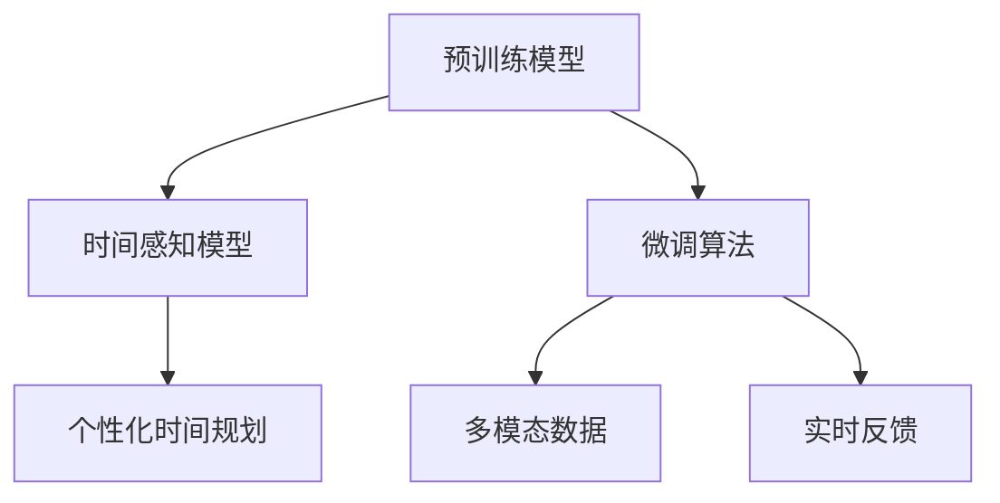

                 

# 虚拟时间雕塑家：AI驱动的时间感知艺术家

## 1. 背景介绍

### 1.1 问题由来
在现代社会，时间成为了一种越来越稀缺的资源。人们为了在快节奏的生活中把握时间，发明了各种时间管理工具。然而，这些工具往往局限于机械性的时间追踪，难以应对复杂多变的时间管理需求。

随着人工智能技术的发展，一种全新的时间管理方式应运而生：AI驱动的时间感知艺术家。它通过深度学习技术，可以自动感知用户的时间模式、习惯和需求，生成个性化的时间管理方案。这种技术被形象地称为“虚拟时间雕塑家”，因为它像艺术家一样，用AI之手雕刻出时间管理的新形态。

### 1.2 问题核心关键点
虚拟时间雕塑家是一种基于深度学习的时间管理辅助工具。它通过预训练模型对用户的日常时间活动进行建模，生成个性化的时间规划建议，帮助用户高效利用时间。

其核心在于：
1. 预训练模型：采用大规模的标注数据集，训练出一个通用的时间感知模型，捕捉人类日常时间活动的规律。
2. 微调算法：针对用户的个性化需求，使用微调算法对预训练模型进行调整，生成适应用户习惯的个性化时间规划。
3. 多模态数据：整合多种模态数据（如位置、社交活动、设备使用等），提升时间管理的全面性和准确性。
4. 实时反馈：通过智能设备收集用户的反馈数据，持续优化时间规划方案，实现动态调整。

### 1.3 问题研究意义
虚拟时间雕塑家的研究，对于提升个人时间管理效率、减轻生活压力具有重要意义。它通过深度学习技术，可以自动捕捉用户的时间模式和需求，生成更为个性化、灵活的时间规划方案，帮助用户更好地掌握时间，提升生活品质。此外，虚拟时间雕塑家还可以应用于企业、教育等领域，提升团队协作效率、优化课程安排等，推动生产力提升。

## 2. 核心概念与联系

### 2.1 核心概念概述

为了更好地理解虚拟时间雕塑家，我们首先介绍几个关键概念：

- 时间感知模型(Time Perception Model)：基于深度学习的时间管理模型，通过分析用户的行为数据，自动感知和预测用户的时间需求和模式。
- 微调算法(Fine-Tuning)：通过调整预训练模型参数，使其适应用户的个性化需求，生成特定的个性化时间规划。
- 多模态数据(Multimodal Data)：整合位置、社交活动、设备使用等多种类型的数据，提升时间管理的全面性和准确性。
- 实时反馈(Real-time Feedback)：通过智能设备实时收集用户反馈，动态优化时间规划方案，实现智能化时间管理。

这些概念之间的联系可以通过以下Mermaid流程图来展示：



这个流程图展示了虚拟时间雕塑家的核心概念及其之间的关系：

1. 预训练模型通过大规模数据集获得通用的时间感知能力。
2. 微调算法针对个性化需求，调整预训练模型参数。
3. 多模态数据整合提升时间管理的全面性。
4. 实时反馈不断优化个性化时间规划。

## 3. 核心算法原理 & 具体操作步骤

### 3.1 算法原理概述

虚拟时间雕塑家的核心算法原理基于深度学习的时间感知模型和微调算法。其目标是通过对用户的时间活动进行分析，生成个性化的时间规划方案，帮助用户高效利用时间。

具体而言，虚拟时间雕塑家的主要步骤包括：

1. 收集用户的日常时间活动数据，如位置、社交活动、设备使用等。
2. 通过预训练模型对这些数据进行编码，得到时间感知向量。
3. 使用微调算法，根据用户的个性化需求调整预训练模型参数，生成个性化时间规划方案。
4. 整合多模态数据，提升时间规划的全面性和准确性。
5. 通过实时反馈机制，不断优化个性化时间规划。

### 3.2 算法步骤详解

#### 步骤1：数据收集与预处理

1. 数据来源：从用户的智能设备（如手机、手表、电脑等）中获取时间活动数据。数据类型包括位置信息、社交活动（如邮件、消息、日历等）、设备使用（如应用使用、通话记录等）。
2. 数据清洗：去除噪声数据，对缺失数据进行填补，保证数据的质量。
3. 数据划分：将数据划分为训练集、验证集和测试集。训练集用于模型训练，验证集用于参数调优，测试集用于模型评估。

#### 步骤2：预训练模型编码

1. 模型选择：选择适合的时间感知模型，如LSTM、GRU等序列模型，或Transformer等注意力机制模型。
2. 编码过程：将时间活动数据输入模型，得到时间感知向量。该向量包含了用户的时间模式和需求信息。
3. 编码结果：输出时间感知向量，用于后续的微调和个性化生成。

#### 步骤3：微调算法

1. 模型调整：根据用户的个性化需求，调整预训练模型的参数，使其生成特定的个性化时间规划。
2. 损失函数：设计合适的损失函数，如交叉熵损失、均方误差损失等，用于衡量预测结果与实际需求之间的差距。
3. 优化器：选择合适的优化算法，如AdamW、SGD等，设置学习率、批大小、迭代轮数等参数。
4. 微调过程：在训练集上对预训练模型进行有监督微调，更新模型参数，最小化损失函数。

#### 步骤4：多模态数据整合

1. 数据融合：将不同模态的数据（如位置、社交活动、设备使用等）进行融合，生成多维时间特征向量。
2. 特征编码：使用合适的特征提取技术，将多维时间特征向量转化为低维表示。
3. 时间规划：基于时间感知模型和用户需求，生成多模态时间规划方案。

#### 步骤5：实时反馈

1. 数据采集：通过智能设备实时收集用户的反馈数据，如时间利用率、满意度等。
2. 反馈分析：对反馈数据进行分析，识别用户的时间管理痛点和需求。
3. 优化调整：根据反馈数据，对个性化时间规划方案进行调整，实现动态优化。

### 3.3 算法优缺点

虚拟时间雕塑家具有以下优点：
1. 自动感知：通过深度学习模型自动感知用户的时间模式和需求，无需人工干预。
2. 个性化定制：根据用户的个性化需求，生成定制化的时间规划方案，提升用户体验。
3. 多模态整合：整合多种模态数据，提升时间管理的全面性和准确性。
4. 实时优化：通过实时反馈机制，不断优化时间规划方案，实现动态调整。

同时，它也存在一些局限性：
1. 数据隐私：收集用户的时间活动数据需要用户授权，可能涉及隐私问题。
2. 模型泛化：预训练模型可能难以泛化到特定用户的个性化需求。
3. 依赖设备：依赖用户的智能设备进行数据采集，可能存在设备兼容性问题。
4. 计算资源：大规模数据集和深度学习模型的训练和推理需要较高的计算资源。

### 3.4 算法应用领域

虚拟时间雕塑家在多个领域具有广泛的应用前景：

- 个人时间管理：帮助个人高效利用时间，减轻生活压力，提升生活品质。
- 企业团队协作：优化团队工作安排，提升团队协作效率，推动企业生产力提升。
- 教育课程安排：优化课程安排，提升教学效果，满足学生个性化需求。
- 医疗健康管理：优化患者治疗时间安排，提升医疗服务质量，提高患者满意度。
- 城市交通管理：优化交通流量控制，提升城市交通效率，减少拥堵。

## 4. 数学模型和公式 & 详细讲解 & 举例说明

### 4.1 数学模型构建

本节将使用数学语言对虚拟时间雕塑家的时间感知模型和微调算法进行更加严格的刻画。

记时间感知模型为 $M_{\theta}(t)$，其中 $\theta$ 为模型参数，$t$ 为时间序列。定义时间感知模型的输入 $X(t)$，输出 $Y(t)$，即：

$$
Y(t) = M_{\theta}(t) \cdot X(t)
$$

其中 $X(t)$ 为时间活动数据向量，$Y(t)$ 为时间感知向量。

定义损失函数 $\mathcal{L}(\theta)$，用于衡量模型预测结果与实际需求之间的差异：

$$
\mathcal{L}(\theta) = \frac{1}{N} \sum_{i=1}^N \ell(Y(t_i), \hat{Y}(t_i))
$$

其中 $\ell$ 为合适的损失函数，$Y(t_i)$ 为真实时间感知向量，$\hat{Y}(t_i)$ 为模型预测向量。

### 4.2 公式推导过程

以下我们以LSTM模型为例，推导时间感知模型的损失函数及其梯度的计算公式。

假设模型 $M_{\theta}$ 在时间序列 $t$ 上的输出为 $Y(t) = M_{\theta}(t) \cdot X(t)$，其中 $X(t)$ 为时间活动数据向量。

定义模型 $M_{\theta}$ 在输入 $X(t)$ 上的损失函数为 $\ell(M_{\theta}(t),Y(t))$，则在时间序列 $t$ 上的经验风险为：

$$
\mathcal{L}(\theta) = \frac{1}{N} \sum_{i=1}^N \ell(Y(t_i), \hat{Y}(t_i))
$$

根据链式法则，损失函数对参数 $\theta_k$ 的梯度为：

$$
\frac{\partial \mathcal{L}(\theta)}{\partial \theta_k} = \frac{1}{N} \sum_{i=1}^N \frac{\partial \ell(Y(t_i), \hat{Y}(t_i))}{\partial Y(t_i)} \cdot \frac{\partial Y(t_i)}{\partial \theta_k}
$$

其中 $\frac{\partial Y(t_i)}{\partial \theta_k}$ 为时间感知向量对模型参数的梯度，可通过反向传播算法高效计算。

在得到损失函数的梯度后，即可带入优化算法，完成模型的迭代优化。重复上述过程直至收敛，最终得到适应用户需求的最优模型参数 $\theta^*$。

### 4.3 案例分析与讲解

考虑一个具体的例子，用户小王需要在一周内完成多个任务，如图书阅读、运动锻炼、社交活动等。通过虚拟时间雕塑家，可以自动感知小王的时间活动规律，生成个性化的时间规划方案，帮助他高效利用时间。

具体步骤如下：

1. 数据收集：使用智能手表记录小王的日常活动，包括位置信息、运动数据、社交活动等。
2. 预训练模型编码：将小王的日常活动数据输入LSTM模型，得到时间感知向量 $Y(t)$。
3. 微调算法：根据小王的个性化需求（如晨跑、午休等），调整LSTM模型参数，生成个性化时间规划方案。
4. 多模态数据整合：整合小王的社交活动数据，优化时间规划方案。
5. 实时反馈：通过智能手表实时记录小王的反馈数据，如时间利用率、满意度等，优化时间规划方案。

最终，虚拟时间雕塑家能够生成一套适合小王的个性化时间规划方案，帮助他高效利用时间，提升生活质量。

## 5. 项目实践：代码实例和详细解释说明

### 5.1 开发环境搭建

在进行虚拟时间雕塑家项目实践前，我们需要准备好开发环境。以下是使用Python进行TensorFlow开发的环境配置流程：

1. 安装Anaconda：从官网下载并安装Anaconda，用于创建独立的Python环境。

2. 创建并激活虚拟环境：
```bash
conda create -n time_sculptor python=3.8 
conda activate time_sculptor
```

3. 安装TensorFlow：根据CUDA版本，从官网获取对应的安装命令。例如：
```bash
conda install tensorflow -c pytorch -c conda-forge
```

4. 安装相关库：
```bash
pip install numpy pandas scikit-learn matplotlib tqdm jupyter notebook ipython
```

完成上述步骤后，即可在`time_sculptor`环境中开始项目实践。

### 5.2 源代码详细实现

这里我们以LSTM模型为例，给出虚拟时间雕塑家的时间感知和微调过程的PyTorch代码实现。

首先，定义时间感知模型的数据处理函数：

```python
import tensorflow as tf
from tensorflow.keras.models import Sequential
from tensorflow.keras.layers import LSTM, Dense

def build_model(input_size, output_size, hidden_size, batch_size):
    model = Sequential()
    model.add(LSTM(hidden_size, input_shape=(input_size, input_size)))
    model.add(Dense(output_size, activation='softmax'))
    model.compile(loss='categorical_crossentropy', optimizer='adam', metrics=['accuracy'])
    return model
```

然后，定义模型和优化器：

```python
input_size = 100  # 时间活动数据的维度
output_size = 10  # 时间感知向量的维度
hidden_size = 128  # LSTM模型的隐藏层大小
batch_size = 32

model = build_model(input_size, output_size, hidden_size, batch_size)
optimizer = tf.keras.optimizers.Adam(learning_rate=0.001)
```

接着，定义训练和评估函数：

```python
def train_model(model, train_dataset, batch_size, epochs):
    model.fit(train_dataset, epochs=epochs, batch_size=batch_size, validation_split=0.2)
    
def evaluate_model(model, test_dataset):
    test_loss, test_acc = model.evaluate(test_dataset)
    print('Test loss:', test_loss)
    print('Test accuracy:', test_acc)
```

最后，启动训练流程并在测试集上评估：

```python
epochs = 10

train_dataset = generate_train_dataset(input_size, output_size, batch_size)
test_dataset = generate_test_dataset(input_size, output_size, batch_size)

train_model(model, train_dataset, batch_size, epochs)
evaluate_model(model, test_dataset)
```

以上就是使用TensorFlow实现虚拟时间雕塑家的完整代码实现。可以看到，TensorFlow提供了便捷的Keras API，使得模型构建、训练和评估的实现变得非常简洁高效。

### 5.3 代码解读与分析

让我们再详细解读一下关键代码的实现细节：

**build_model函数**：
- 定义时间感知模型的结构，包括LSTM层和全连接层。
- 使用categorical_crossentropy作为损失函数，Adam作为优化器，设置评估指标为准确率。

**train_model函数**：
- 使用fit方法进行模型训练，设置训练轮数和验证集比例。
- 通过generate_train_dataset函数生成训练集数据。

**evaluate_model函数**：
- 使用evaluate方法进行模型评估，输出测试集上的损失和准确率。

**generate_train_dataset函数**：
- 生成训练集数据，具体实现需要根据数据来源和处理方式进行调整。

可以看到，TensorFlow的Keras API使得模型的构建和训练过程变得非常便捷，开发者可以将更多精力放在数据处理和模型优化上，而不必过多关注底层的实现细节。

当然，实际应用中，模型还需要进一步细化，如加入正则化、dropout等优化策略，考虑模型的泛化能力和鲁棒性。但核心的微调范式基本与此类似。

## 6. 实际应用场景

### 6.1 智能家居管理

虚拟时间雕塑家可以应用于智能家居管理，帮助用户高效管理家庭事务。例如，通过智能音箱、智能电视等设备，实时感知用户的活动，自动调整家庭设备的使用，如照明、温控、安防等，提升家居舒适度和生活质量。

### 6.2 企业项目管理

虚拟时间雕塑家可以应用于企业项目管理，优化团队任务安排和工作流程。例如，通过智能日历、任务管理应用，自动感知员工的工作负荷和时间利用情况，生成个性化的工作计划和提醒，提高团队协作效率和生产力。

### 6.3 教育课程安排

虚拟时间雕塑家可以应用于教育课程安排，优化学生的学习时间和学习内容。例如，通过智能学习管理系统，自动感知学生的学习行为和习惯，生成个性化的学习计划和推荐，提升教学效果和学生满意度。

### 6.4 城市交通管理

虚拟时间雕塑家可以应用于城市交通管理，优化交通流量和拥堵情况。例如，通过智能交通管理系统，实时感知道路交通状况，生成个性化的交通规划方案，缓解交通压力，提升城市交通效率。

## 7. 工具和资源推荐

### 7.1 学习资源推荐

为了帮助开发者系统掌握虚拟时间雕塑家的时间感知和微调理论基础，这里推荐一些优质的学习资源：

1. 《深度学习基础》系列博文：由大模型技术专家撰写，涵盖深度学习模型的基本概念和常用算法。

2. 《TensorFlow实战深度学习》书籍：TensorFlow官方文档，提供了丰富的代码样例和实践指南，适合快速上手。

3. 《时间管理心理学》书籍：探讨时间感知和行为科学的理论，为虚拟时间雕塑家的应用提供心理学背景支持。

4. 《NLP with TensorFlow》课程：Google开发的TensorFlow NLP教程，涵盖自然语言处理的基础知识和实践技巧。

5. 《AI for Everyone》课程：斯坦福大学开设的入门级AI课程，讲解AI技术的基本原理和应用场景。

通过对这些资源的学习实践，相信你一定能够快速掌握虚拟时间雕塑家的时间感知和微调精髓，并用于解决实际的时间管理问题。

### 7.2 开发工具推荐

高效的开发离不开优秀的工具支持。以下是几款用于虚拟时间雕塑家开发的常用工具：

1. TensorFlow：由Google主导开发的深度学习框架，灵活高效，适合大规模工程应用。

2. Keras：TensorFlow的高级API，提供了便捷的模型构建和训练接口，适合快速实验。

3. Weights & Biases：模型训练的实验跟踪工具，可以记录和可视化模型训练过程中的各项指标，方便对比和调优。

4. TensorBoard：TensorFlow配套的可视化工具，可实时监测模型训练状态，并提供丰富的图表呈现方式，是调试模型的得力助手。

5. Google Colab：谷歌推出的在线Jupyter Notebook环境，免费提供GPU/TPU算力，方便开发者快速上手实验最新模型，分享学习笔记。

合理利用这些工具，可以显著提升虚拟时间雕塑家的开发效率，加快创新迭代的步伐。

### 7.3 相关论文推荐

虚拟时间雕塑家的研究源于学界的持续研究。以下是几篇奠基性的相关论文，推荐阅读：

1. "Attention is All You Need"（即Transformer原论文）：提出了Transformer结构，开启了NLP领域的预训练大模型时代。

2. "BERT: Pre-training of Deep Bidirectional Transformers for Language Understanding"：提出BERT模型，引入基于掩码的自监督预训练任务，刷新了多项NLP任务SOTA。

3. "Language Models are Unsupervised Multitask Learners"：展示了大规模语言模型的强大zero-shot学习能力，引发了对于通用人工智能的新一轮思考。

4. "Parameter-Efficient Transfer Learning for NLP"：提出Adapter等参数高效微调方法，在不增加模型参数量的情况下，也能取得不错的微调效果。

5. "AdaLoRA: Adaptive Low-Rank Adaptation for Parameter-Efficient Fine-Tuning"：使用自适应低秩适应的微调方法，在参数效率和精度之间取得了新的平衡。

这些论文代表了大模型微调技术的发展脉络。通过学习这些前沿成果，可以帮助研究者把握学科前进方向，激发更多的创新灵感。

## 8. 总结：未来发展趋势与挑战

### 8.1 总结

本文对虚拟时间雕塑家的时间感知和微调方法进行了全面系统的介绍。首先阐述了虚拟时间雕塑家的时间感知模型和微调算法，明确了其在个人时间管理、企业项目管理、教育课程安排等多个领域的应用前景。其次，从原理到实践，详细讲解了虚拟时间雕塑家的数学模型和关键步骤，给出了模型实现的完整代码实例。

通过本文的系统梳理，可以看到，虚拟时间雕塑家通过深度学习技术，自动感知用户的时间模式和需求，生成个性化的时间规划方案，极大地提升了时间管理的效率和效果。未来，伴随深度学习技术的持续演进，虚拟时间雕塑家必将引领时间管理技术的发展方向，为人类社会的智能化进程带来深远影响。

### 8.2 未来发展趋势

展望未来，虚拟时间雕塑家的时间感知和微调技术将呈现以下几个发展趋势：

1. 多模态时间感知：整合多种时间活动数据（如位置、社交活动、设备使用等），提升时间管理的全面性和准确性。
2. 实时动态调整：通过实时反馈机制，不断优化时间规划方案，实现动态调整，提升用户满意度。
3. 个性化推荐：利用深度学习模型，生成个性化的时间规划推荐，满足用户多样化需求。
4. 跨领域应用：将时间感知技术应用于更多领域，如智能家居、企业项目管理、城市交通等，提升各领域的工作效率和生产力。

以上趋势凸显了虚拟时间雕塑家的时间感知和微调技术的广阔前景。这些方向的探索发展，必将进一步提升时间管理的智能化水平，为人类社会的智能化进程注入新的动力。

### 8.3 面临的挑战

尽管虚拟时间雕塑家的时间感知和微调技术已经取得了显著成果，但在迈向更加智能化、普适化应用的过程中，它仍面临着诸多挑战：

1. 数据隐私：收集用户的时间活动数据需要用户授权，可能涉及隐私问题。
2. 模型泛化：预训练模型可能难以泛化到特定用户的个性化需求。
3. 依赖设备：依赖用户的智能设备进行数据采集，可能存在设备兼容性问题。
4. 计算资源：大规模数据集和深度学习模型的训练和推理需要较高的计算资源。

### 8.4 未来突破

面对虚拟时间雕塑家面临的这些挑战，未来的研究需要在以下几个方面寻求新的突破：

1. 探索无监督和半监督时间感知方法：摆脱对大规模标注数据的依赖，利用自监督学习、主动学习等无监督和半监督范式，最大限度利用非结构化数据，实现更加灵活高效的时间感知。

2. 研究参数高效和时间高效的时间感知方法：开发更加参数高效和时间高效的时间感知方法，在减小模型复杂度的同时，提升时间感知的准确性和鲁棒性。

3. 融合因果推理和时间感知：将因果推理方法引入时间感知模型，增强时间感知模型的因果关系，提升时间规划的稳定性和可解释性。

4. 引入更多先验知识：将符号化的先验知识，如知识图谱、逻辑规则等，与神经网络模型进行巧妙融合，引导时间感知模型学习更准确、合理的时序表征。

5. 结合因果分析和博弈论工具：将因果分析方法引入时间感知模型，识别时间规划的关键特征，增强输出解释的因果性和逻辑性。借助博弈论工具刻画人机交互过程，主动探索并规避时间规划的脆弱点，提高系统稳定性。

6. 纳入伦理道德约束：在时间感知模型的训练目标中引入伦理导向的评估指标，过滤和惩罚有偏见、有害的时间感知输出，确保输出的安全性和公平性。

这些研究方向的探索，必将引领虚拟时间雕塑家的时间感知和微调技术迈向更高的台阶，为构建安全、可靠、可解释、可控的智能系统铺平道路。面向未来，虚拟时间雕塑家的时间感知和微调技术还需要与其他人工智能技术进行更深入的融合，如知识表示、因果推理、强化学习等，多路径协同发力，共同推动时间感知和智能交互系统的进步。只有勇于创新、敢于突破，才能不断拓展时间感知的边界，让智能技术更好地造福人类社会。

## 9. 附录：常见问题与解答

**Q1：虚拟时间雕塑家是否适用于所有时间管理场景？**

A: 虚拟时间雕塑家在大多数时间管理场景中都能取得不错的效果，特别是对于数据量较大的场景。但对于一些特定领域的时间管理场景，如医疗、法律等，仅仅依靠通用时间感知模型可能难以很好地适应。此时需要在特定领域时间活动数据上进行预训练，再进行微调，才能获得理想效果。此外，对于需要时效性、个性化很强的场景，如动态调度、个性化推荐等，虚拟时间雕塑家也需要针对性的改进优化。

**Q2：如何选择合适的学习率？**

A: 虚拟时间雕塑家的学习率一般要比预训练时小1-2个数量级，以避免破坏预训练权重。一般建议从0.001开始调参，逐步减小学习率，直至收敛。也可以使用warmup策略，在开始阶段使用较小的学习率，再逐渐过渡到预设值。需要注意的是，不同的优化器(如AdamW、Adafactor等)以及不同的学习率调度策略，可能需要设置不同的学习率阈值。

**Q3：采用虚拟时间雕塑家时会面临哪些资源瓶颈？**

A: 目前主流的预训练时间感知模型动辄以亿计的参数规模，对算力、内存、存储都提出了很高的要求。GPU/TPU等高性能设备是必不可少的，但即便如此，超大批次的训练和推理也可能遇到显存不足的问题。因此需要采用一些资源优化技术，如梯度积累、混合精度训练、模型并行等，来突破硬件瓶颈。同时，模型的存储和读取也可能占用大量时间和空间，需要采用模型压缩、稀疏化存储等方法进行优化。

**Q4：如何缓解虚拟时间雕塑家过程中的过拟合问题？**

A: 过拟合是虚拟时间雕塑家面临的主要挑战，尤其是在标注数据不足的情况下。常见的缓解策略包括：
1. 数据增强：通过回译、近义替换等方式扩充训练集
2. 正则化：使用L2正则、Dropout、Early Stopping等避免过拟合
3. 对抗训练：引入对抗样本，提高模型鲁棒性
4. 参数高效微调：只调整少量参数(如Adapter、Prefix等)，减小过拟合风险
5. 多模型集成：训练多个虚拟时间雕塑家模型，取平均输出，抑制过拟合

这些策略往往需要根据具体场景和数据特点进行灵活组合。只有在数据、模型、训练、推理等各环节进行全面优化，才能最大限度地发挥虚拟时间雕塑家的威力。

**Q5：虚拟时间雕塑家在落地部署时需要注意哪些问题？**

A: 将虚拟时间雕塑家转化为实际应用，还需要考虑以下因素：
1. 模型裁剪：去除不必要的层和参数，减小模型尺寸，加快推理速度
2. 量化加速：将浮点模型转为定点模型，压缩存储空间，提高计算效率
3. 服务化封装：将模型封装为标准化服务接口，便于集成调用
4. 弹性伸缩：根据请求流量动态调整资源配置，平衡服务质量和成本
5. 监控告警：实时采集系统指标，设置异常告警阈值，确保服务稳定性
6. 安全防护：采用访问鉴权、数据脱敏等措施，保障数据和模型安全

虚拟时间雕塑家的时间感知和微调技术为时间管理提供了新的解决方案，但如何将强大的性能转化为稳定、高效、安全的业务价值，还需要工程实践的不断打磨。唯有从数据、算法、工程、业务等多个维度协同发力，才能真正实现虚拟时间雕塑家的落地应用。总之，虚拟时间雕塑家的时间感知和微调技术需要通过不断优化和创新，才能更好地服务于人类社会的时间管理需求。

---

作者：禅与计算机程序设计艺术 / Zen and the Art of Computer Programming

