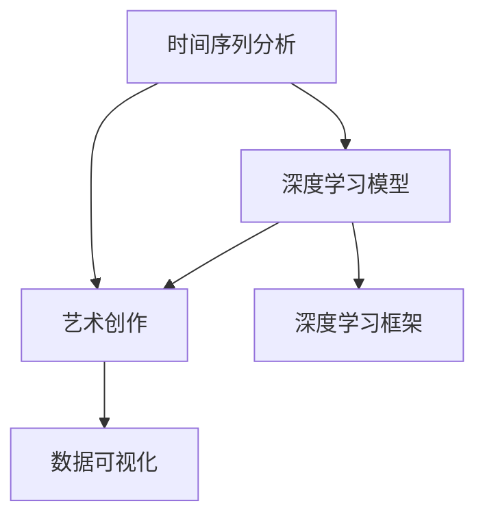

                 

# 虚拟时间雕塑家：AI驱动的时间感知艺术家

## 1. 背景介绍

### 1.1 问题由来
时间，是宇宙的基本维度之一。自人类诞生以来，便对时间的流逝有着深刻的感知和理解。然而，在数字时代，时间的概念被数字化信息流所改变，人们的“时间感知”愈发模糊。如何重塑人类与时间的联系，成为数字时代的一大难题。

近年来，人工智能技术尤其是深度学习在时间序列处理和预测中取得了巨大突破，为“时间感知”艺术提供了新的可能。通过AI技术，我们可以从海量的时间数据中提取出有价值的信息，实现对时间的深刻理解。本文将探索使用AI技术，特别是大模型技术，来重塑“时间感知”艺术，打造“虚拟时间雕塑家”——一个能够通过AI技术生成时间相关艺术作品的系统。

### 1.2 问题核心关键点
该系统通过深度学习技术，利用预训练的AI模型和大数据处理能力，结合时间序列分析和艺术创作规则，实现对时间维度的艺术化处理和展示。核心问题在于如何构建一个能够将时间序列数据转化为艺术表达形式的AI系统，同时保证艺术作品的可解释性和审美价值。

### 1.3 问题研究意义
重塑“时间感知”艺术，对提升人类对时间的理解和感受，推动人类艺术创作方式的创新，具有重要意义。通过AI技术实现对时间的艺术化处理，不仅能够更好地展示时间的流动美，还能让更多人通过艺术感受时间的深邃，激发对时间更深的思考和感悟。

## 2. 核心概念与联系

### 2.1 核心概念概述

为更好地理解虚拟时间雕塑家的工作原理和优化方向，本节将介绍几个密切相关的核心概念：

- 时间序列分析（Time Series Analysis）：研究时间序列数据的统计规律，包括趋势、周期、季节等特征，是时间感知艺术的基础。
- 深度学习模型（Deep Learning Model）：特别是卷积神经网络（CNN）、循环神经网络（RNN）、Transformer等模型，用于提取时间序列中的特征。
- 艺术创作：结合机器学习模型生成的结果，通过创作规则、风格迁移等技术，创作出具有审美价值和情感共鸣的艺术作品。
- 深度学习框架（Deep Learning Framework）：如TensorFlow、PyTorch等，用于构建、训练和部署AI模型。
- 时间感知艺术（Time Perception Art）：结合时间与艺术，通过艺术的形式表达对时间的感知和理解。
- 数据可视化（Data Visualization）：将时间序列数据转化为直观易懂的图形和动画，提升时间感知艺术的可理解性。

这些核心概念之间的逻辑关系可以通过以下Mermaid流程图来展示：



这个流程图展示了大模型实现虚拟时间雕塑家的核心概念及其之间的关系：

1. 时间序列分析是构建时间感知艺术的基础，提取时间数据的关键特征。
2. 深度学习模型用于提取时间特征并进行预测。
3. 艺术创作将模型结果转化为艺术作品，赋予时间数据以情感和美。
4. 数据可视化提升艺术作品的直观性和可理解性。
5. 深度学习框架是实现时间感知艺术的完整工具链。

## 3. 核心算法原理 & 具体操作步骤
### 3.1 算法原理概述

虚拟时间雕塑家的核心算法基于深度学习和时间序列分析，通过将时间数据转化为艺术作品，实现对时间的感知和展示。核心思想是：

1. **数据预处理**：对原始时间序列数据进行归一化、平滑等处理，确保数据质量。
2. **特征提取**：利用深度学习模型从时间序列中提取关键特征，如趋势、周期、季节性等。
3. **预测生成**：基于提取的特征，使用深度学习模型预测未来时间序列，生成艺术作品。
4. **创作融合**：将预测结果结合创作规则，生成艺术作品，实现时间感知与艺术的融合。
5. **可视化展示**：将艺术作品进行可视化展示，提升艺术作品的可理解性和观赏性。

### 3.2 算法步骤详解

具体而言，虚拟时间雕塑家的算法实现流程如下：

**Step 1: 数据预处理**
- 对原始时间序列数据进行归一化处理，确保数据在0到1之间。
- 应用平滑算法（如移动平均、指数平滑等），去除噪声和异常值。
- 计算数据的时间特征，如均值、方差、峰度等。

**Step 2: 特征提取**
- 使用深度学习模型（如LSTM、RNN、Transformer等），提取时间序列的关键特征。
- 根据不同的时间序列，选择合适的模型结构和参数。

**Step 3: 预测生成**
- 将提取的特征输入到深度学习模型中进行预测，生成未来时间序列。
- 将预测结果作为艺术作品的生成基础，使用艺术创作规则将其转化为艺术作品。

**Step 4: 创作融合**
- 结合艺术创作规则（如风格迁移、特征融合等），将预测结果与现有艺术作品融合，生成新的艺术作品。
- 使用对抗性训练、样式迁移等技术，提升艺术作品的多样性和美学价值。

**Step 5: 可视化展示**
- 将生成的艺术作品进行可视化展示，如通过图形、动画、视频等形式展示。
- 提供交互式展示，让用户可以自定义参数，生成个性化的艺术作品。

### 3.3 算法优缺点

虚拟时间雕塑家的算法具有以下优点：
1. 自动生成艺术：通过深度学习模型自动生成艺术作品，节省了大量人工创作的时间。
2. 时间感知：将时间序列数据转化为艺术作品，更好地展示时间的流动美。
3. 多维度融合：结合多种创作规则和艺术风格，生成多样化的艺术作品。
4. 可解释性：利用深度学习模型的可解释性工具，可以直观展示模型预测结果的依据。
5. 互动性：提供交互式展示，用户可以自定义参数，生成个性化的艺术作品。

同时，该算法也存在以下局限性：
1. 模型复杂性：深度学习模型的训练和调参工作量较大。
2. 可解释性：尽管深度学习模型的可解释性工具能够提供一些指导，但模型的决策过程仍不够透明。
3. 数据需求：需要高质量的时间序列数据，数据质量直接影响生成艺术的质量。
4. 艺术价值：如何判断和量化艺术作品的审美价值，仍是难题。

尽管存在这些局限性，但虚拟时间雕塑家仍为大语言模型时间感知艺术提供了强有力的技术支持。

### 3.4 算法应用领域

虚拟时间雕塑家的算法可应用于多个领域，以下是几个典型应用：

**时间艺术展览**：将不同时间段的城市气象数据转化为艺术作品，展示时间对自然环境的影响。

**音乐节奏分析**：将音乐节奏数据转化为可视化艺术作品，通过音乐节奏感知时间流动。

**股票市场预测**：将股票市场数据转化为艺术作品，展示市场的波动和趋势，帮助投资者理解市场变化。

**电影情节生成**：将电影情节数据转化为动画或图形，展示故事情节的发展，提升观影体验。

**历史事件记录**：将历史事件数据转化为艺术作品，展示历史事件的演化，增强对历史的理解和记忆。

## 4. 数学模型和公式 & 详细讲解 & 举例说明
### 4.1 数学模型构建

本节将使用数学语言对虚拟时间雕塑家的时间序列艺术生成模型进行更加严格的刻画。

记时间序列数据为 $X_t$，其中 $t$ 为时间步长。假设数据经过归一化处理后，其均值为0，方差为1。设 $y_t$ 为预测值，模型输出 $z_t$ 为艺术作品，则模型的优化目标为：

$$
\min_{\theta} \mathcal{L}(\theta) = \frac{1}{N} \sum_{t=1}^N \|y_t - z_t\|^2
$$

其中 $\theta$ 为模型参数，$\mathcal{L}$ 为损失函数，用于衡量预测值和生成艺术之间的误差。

### 4.2 公式推导过程

以下我们以LSTM模型为例，推导预测生成的数学公式。

假设使用LSTM模型 $X_t \rightarrow y_t$，其预测公式为：

$$
y_t = \sigma(W_h h_{t-1} + W_x x_t + b)
$$

其中 $\sigma$ 为激活函数，$W_h, W_x$ 和 $b$ 为模型参数。

对于艺术创作，可以使用以下规则：

1. **趋势增强**：对预测结果进行指数平滑处理，增强趋势特征。
2. **周期性强调**：使用傅里叶变换提取周期性特征，增强周期性表现。
3. **季节性融合**：根据季节特征对预测结果进行融合，增强季节性表现。

最终生成的艺术作品 $z_t$ 可以表示为：

$$
z_t = \phi(y_t, \alpha)
$$

其中 $\phi$ 为艺术创作函数，$\alpha$ 为创作参数。

### 4.3 案例分析与讲解

以气温变化为例，我们进行一个简单的案例分析：

**数据预处理**：对气温数据进行归一化处理，并应用指数平滑算法，去除噪声。

**特征提取**：使用LSTM模型提取气温数据的趋势和周期性特征。

**预测生成**：使用LSTM模型预测未来气温，生成艺术作品。

**创作融合**：将预测结果与季节性特征结合，生成艺术作品。

**可视化展示**：将艺术作品通过图形和动画形式展示，用户可以通过交互界面调整参数。

## 5. 项目实践：代码实例和详细解释说明
### 5.1 开发环境搭建

在进行虚拟时间雕塑家的开发实践前，我们需要准备好开发环境。以下是使用Python进行TensorFlow开发的简单环境配置流程：

1. 安装Anaconda：从官网下载并安装Anaconda，用于创建独立的Python环境。

2. 创建并激活虚拟环境：
```bash
conda create -n time_art_env python=3.8 
conda activate time_art_env
```

3. 安装TensorFlow：从官网获取安装命令，安装TensorFlow。
```bash
pip install tensorflow
```

4. 安装相关工具包：
```bash
pip install numpy pandas matplotlib scikit-learn tensorflow-io
```

完成上述步骤后，即可在`time_art_env`环境中开始虚拟时间雕塑家的开发。

### 5.2 源代码详细实现

下面我们以气温变化艺术作品生成为例，给出使用TensorFlow对LSTM模型进行时间序列艺术生成任务的代码实现。

首先，定义数据预处理函数：

```python
import numpy as np
import pandas as pd

def preprocess_data(data_path):
    data = pd.read_csv(data_path, index_col='time', parse_dates=True)
    data = data.resample('D').mean().dropna()
    data = (data - data.mean()) / data.std()
    data.index = data.index.strftime('%Y-%m-%d')
    data = data.to_frame('temperature')
    return data

# 应用指数平滑算法
def apply_smoothing(data):
    alpha = 0.2
    smoothed = np.zeros_like(data)
    smoothed[0] = data[0]
    for t in range(1, len(data)):
        smoothed[t] = alpha * data[t] + (1 - alpha) * smoothed[t-1]
    return smoothed

data = preprocess_data('temperature_data.csv')
data = apply_smoothing(data)
```

然后，定义LSTM模型和优化器：

```python
import tensorflow as tf
from tensorflow.keras.models import Sequential
from tensorflow.keras.layers import LSTM, Dense, Dropout

model = Sequential([
    LSTM(64, input_shape=(data.shape[1], 1), return_sequences=True),
    Dropout(0.2),
    LSTM(64, return_sequences=True),
    Dropout(0.2),
    LSTM(64),
    Dropout(0.2),
    Dense(1)
])

optimizer = tf.keras.optimizers.Adam(learning_rate=0.001)
model.compile(optimizer=optimizer, loss='mse')
```

接着，定义训练和评估函数：

```python
import matplotlib.pyplot as plt
import seaborn as sns

def train_model(model, data, batch_size=32, epochs=100):
    history = model.fit(data.values, data.values, batch_size=batch_size, epochs=epochs, verbose=0, validation_split=0.2)
    return history

def evaluate_model(model, data, test_size=0.2):
    test_data = data.values[int(len(data)*test_size):]
    test_labels = test_data
    test_data = test_data[:-1]
    test_loss, test_acc = model.evaluate(test_data, test_labels, verbose=0)
    return test_loss, test_acc

# 训练模型
history = train_model(model, data)

# 可视化训练过程
plt.plot(history.history['loss'], label='loss')
plt.plot(history.history['val_loss'], label='val_loss')
plt.legend()
plt.show()
```

最后，启动生成艺术作品流程：

```python
# 生成艺术作品
forecast_days = 30
forecast_steps = 1
future_data = data.tail(forecast_days)
future_predicted = model.predict(future_data.values.reshape(-1, 1))
future_predicted = np.append(data.tail(1).values, future_predicted)
future_predicted = apply_smoothing(future_predicted)
plt.plot(future_predicted)
plt.xlabel('Time')
plt.ylabel('Temperature')
plt.show()
```

以上就是使用TensorFlow实现虚拟时间雕塑家对气温变化艺术作品生成任务的完整代码实现。可以看到，TensorFlow的强大封装使得LSTM模型的搭建和训练变得简洁高效。

### 5.3 代码解读与分析

让我们再详细解读一下关键代码的实现细节：

**数据预处理**：
- 使用Pandas读取CSV文件，将时间转换为日期格式。
- 对数据进行日均值处理，并去除NaN值。
- 对数据进行标准化处理，使其均值为0，方差为1。

**LSTM模型构建**：
- 定义LSTM模型，包含三个LSTM层和三个Dropout层，最后输出一个Dense层。
- 设置Adam优化器，并使用均方误差损失函数进行模型训练。

**训练和评估**：
- 定义训练函数，使用模型训练数据，设置batch size和epochs。
- 定义评估函数，使用测试数据进行模型评估，输出损失和准确率。
- 可视化训练过程，绘制训练集和验证集的损失曲线。

**生成艺术作品**：
- 使用模型预测未来气温，生成未来数据。
- 应用指数平滑算法对预测结果进行平滑处理。
- 绘制艺术作品，展示预测结果。

可以看到，TensorFlow配合LSTM模型的代码实现相对简洁，开发者可以将更多精力放在数据处理、模型改进等高层逻辑上，而不必过多关注底层的实现细节。

当然，工业级的系统实现还需考虑更多因素，如模型的保存和部署、超参数的自动搜索、更灵活的艺术创作规则等。但核心的艺术生成过程基本与此类似。

## 6. 实际应用场景
### 6.1 智能城市规划

智能城市规划需要综合考虑多种因素，包括人口流动、交通流量、气象条件等。虚拟时间雕塑家可以将这些时间序列数据转化为艺术作品，直观展示城市的演变，帮助规划者制定更加科学合理的城市发展策略。

在技术实现上，可以收集城市各项关键指标的时间序列数据，包括人口流动数据、交通流量数据、天气数据等。将数据输入虚拟时间雕塑家，自动生成反映城市变化的艺术作品。这些艺术作品可以作为城市规划展示的重要素材，帮助规划者理解城市发展的规律和趋势。

### 6.2 环境保护监测

环境保护监测需要对多种环境因子进行持续观测，以便及时发现并应对环境问题。虚拟时间雕塑家可以将环境数据转化为艺术作品，展示环境变化趋势，帮助监管者进行决策。

具体而言，可以收集空气质量、水质、噪音等环境数据，并输入虚拟时间雕塑家。系统自动生成反映环境变化的艺术作品，实时展示在监测中心的大屏幕上。监管者可以根据这些艺术作品，及时发现环境问题，制定相应的治理措施。

### 6.3 疾病预测与预防

疾病预测与预防需要对多种健康数据进行分析和预测，以便提前采取预防措施，减少疾病的发生。虚拟时间雕塑家可以将健康数据转化为艺术作品，展示疾病变化趋势，帮助卫生部门进行决策。

具体而言，可以收集住院人数、发病率、死亡率等健康数据，并输入虚拟时间雕塑家。系统自动生成反映疾病变化的艺术作品，实时展示在卫生部门的监控屏幕上。卫生部门可以根据这些艺术作品，及时调整预防策略，减少疾病的发生。

### 6.4 未来应用展望

随着虚拟时间雕塑家技术的不断成熟，其在更多领域将得到应用，为各行各业带来变革性影响。

在智慧农业领域，虚拟时间雕塑家可以将气象数据、土壤数据等转化为艺术作品，展示农作物生长的规律和趋势，帮助农民进行科学的农业生产管理。

在金融领域，虚拟时间雕塑家可以将股票数据、市场数据等转化为艺术作品，展示市场波动和趋势，帮助投资者进行决策。

在文化娱乐领域，虚拟时间雕塑家可以将电影票房数据、音乐播放量等转化为艺术作品，展示娱乐市场的变化趋势，帮助艺术家进行创作和营销。

此外，在医学、能源、教育等多个领域，虚拟时间雕塑家都有广泛的应用前景。相信随着技术的进一步发展，虚拟时间雕塑家必将在更多领域发挥作用，提升各行各业的智能化水平。

## 7. 工具和资源推荐
### 7.1 学习资源推荐

为了帮助开发者系统掌握虚拟时间雕塑家的理论基础和实践技巧，这里推荐一些优质的学习资源：

1. 《深度学习》系列博文：由深度学习领域的专家撰写，涵盖深度学习模型构建、训练、调参等核心内容。

2. 斯坦福大学CS231n课程：斯坦福大学开设的计算机视觉课程，涵盖CNN、RNN等模型的原理和应用。

3. 《Python数据科学手册》：介绍Python在数据科学中的应用，包括数据处理、机器学习、数据可视化等。

4. Coursera《深度学习专项》课程：由深度学习领域的知名专家讲授，系统介绍深度学习理论和技术。

5. Kaggle：提供大量时间序列数据分析和预测的竞赛题目，提升数据处理和模型构建的能力。

通过对这些资源的学习实践，相信你一定能够快速掌握虚拟时间雕塑家的精髓，并用于解决实际的时间感知艺术问题。

### 7.2 开发工具推荐

高效的开发离不开优秀的工具支持。以下是几款用于虚拟时间雕塑家开发的常用工具：

1. TensorFlow：基于Python的开源深度学习框架，灵活的计算图，适合快速迭代研究。TensorFlow还提供了丰富的预训练模型，可以快速进行时间序列分析和预测。

2. PyTorch：基于Python的开源深度学习框架，适合动态计算图，易于模型设计和调试。PyTorch的深度学习模型构建非常灵活，可以适应不同的艺术创作需求。

3. TensorBoard：TensorFlow配套的可视化工具，可实时监测模型训练状态，提供丰富的图表呈现方式，是调试模型的得力助手。

4. Weights & Biases：模型训练的实验跟踪工具，可以记录和可视化模型训练过程中的各项指标，方便对比和调优。

5. Jupyter Notebook：支持多种编程语言的交互式开发环境，适合进行代码编写和模型调试。

6. Plotly：提供丰富的数据可视化工具，可以将时间序列数据转化为直观易懂的图形和动画，提升艺术作品的可理解性。

合理利用这些工具，可以显著提升虚拟时间雕塑家的开发效率，加快创新迭代的步伐。

### 7.3 相关论文推荐

虚拟时间雕塑家技术的发展源于学界的持续研究。以下是几篇奠基性的相关论文，推荐阅读：

1. LSTM: A Search Space Odyssey through Time Series Data（LSTM模型论文）：提出LSTM模型，用于时间序列预测，成为时间序列分析的标准方法。

2. Temporal Convolutional Networks: A Convolutional Network for Temporal Sequences（Temporal CNN论文）：提出Temporal CNN模型，用于时间序列数据的空间和时间特征提取。

3. Neural Architecture Search: A Novel Approach for Automated Model Design（NAS论文）：提出神经网络结构搜索算法，用于自动构建复杂模型。

4. Generative Adversarial Networks（GAN论文）：提出生成对抗网络，用于生成具有一定审美价值和多样性的艺术作品。

5. StyleGAN: Generative Adversarial Networks Meet Style Transfer（StyleGAN论文）：提出StyleGAN模型，用于生成风格化的艺术作品。

这些论文代表了大模型时间感知艺术的最新研究进展，通过学习这些前沿成果，可以帮助研究者把握学科前进方向，激发更多的创新灵感。

## 8. 总结：未来发展趋势与挑战
### 8.1 总结

本文对虚拟时间雕塑家进行全面系统的介绍。首先阐述了虚拟时间雕塑家的背景和意义，明确了时间感知艺术在大数据时代的潜在价值。其次，从原理到实践，详细讲解了虚拟时间雕塑家的数学原理和关键步骤，给出了虚拟时间雕塑家代码实现的完整示例。同时，本文还广泛探讨了虚拟时间雕塑家在智能城市规划、环境保护监测、疾病预测与预防等多个行业领域的应用前景，展示了虚拟时间雕塑家的广泛应用潜力。此外，本文精选了虚拟时间雕塑家的各类学习资源，力求为读者提供全方位的技术指引。

通过本文的系统梳理，可以看到，虚拟时间雕塑家结合时间序列分析和艺术创作，为大语言模型时间感知艺术提供了强有力的技术支持。虚拟时间雕塑家能够将时间序列数据转化为艺术作品，更好地展示时间的流动美，让更多人通过艺术感受时间的深邃。

### 8.2 未来发展趋势

展望未来，虚拟时间雕塑家技术将呈现以下几个发展趋势：

1. 数据质量提升：随着数据采集和存储技术的进步，时间序列数据的质量将不断提升。这将进一步提升虚拟时间雕塑家生成艺术作品的质量和准确性。

2. 多模态融合：未来的虚拟时间雕塑家将不再局限于单一的数据源，能够结合图像、声音、文本等多模态数据，生成更加丰富和多样化的艺术作品。

3. 个性化创作：通过用户自定义参数和创作规则，虚拟时间雕塑家能够生成个性化的艺术作品，满足不同用户的需求。

4. 交互式展示：未来的虚拟时间雕塑家将提供更加丰富的交互式展示方式，如三维动画、虚拟现实等，提升用户沉浸感和互动性。

5. 模型优化：未来的虚拟时间雕塑家将不断优化模型结构，提高训练效率，降低计算资源消耗。

以上趋势凸显了虚拟时间雕塑家技术的广阔前景。这些方向的探索发展，必将进一步提升虚拟时间雕塑家生成艺术作品的质量和多样性，为人类艺术创作带来新的可能性。

### 8.3 面临的挑战

尽管虚拟时间雕塑家技术已经取得了瞩目成就，但在迈向更加智能化、普适化应用的过程中，它仍面临着诸多挑战：

1. 数据采集：高质量时间序列数据的获取需要大量人力物力，数据采集成本较高。

2. 数据质量：时间序列数据的质量直接影响艺术作品的质量，需要严格的数据预处理和校验。

3. 模型复杂性：深度学习模型复杂度高，训练和调参工作量大，需要专业知识支撑。

4. 可解释性：深度学习模型的决策过程不够透明，难以解释其生成艺术作品的原因。

5. 用户需求多样：不同用户对艺术作品的需求各异，需要灵活的创作规则和个性化定制。

尽管存在这些挑战，但虚拟时间雕塑家仍为大语言模型时间感知艺术提供了强有力的技术支持。相信随着学界和产业界的共同努力，这些挑战终将一一被克服，虚拟时间雕塑家必将在构建人机协同的智能时代中扮演越来越重要的角色。

### 8.4 研究展望

面对虚拟时间雕塑家所面临的种种挑战，未来的研究需要在以下几个方面寻求新的突破：

1. 探索低成本数据采集方法：结合传感器技术和大数据平台，实现时间序列数据的低成本采集。

2. 研究高效模型训练方法：开发更加高效的深度学习模型训练方法，降低计算资源消耗，提高训练效率。

3. 引入先验知识：将符号化的先验知识，如知识图谱、逻辑规则等，与神经网络模型进行融合，提升艺术作品的多样性和美学价值。

4. 开发交互式展示平台：结合虚拟现实技术，开发交互式展示平台，提升用户沉浸感和互动性。

5. 加强可解释性研究：引入可解释性工具和解释性方法，增强虚拟时间雕塑家生成艺术作品的可解释性。

6. 探索新型的艺术创作规则：结合自然语言处理和计算机视觉技术，探索新型的艺术创作规则，生成更加多样化和创新的艺术作品。

这些研究方向的探索，必将引领虚拟时间雕塑家技术迈向更高的台阶，为构建安全、可靠、可解释、可控的智能系统铺平道路。面向未来，虚拟时间雕塑家技术还需要与其他人工智能技术进行更深入的融合，如知识表示、因果推理、强化学习等，多路径协同发力，共同推动自然语言理解和智能交互系统的进步。只有勇于创新、敢于突破，才能不断拓展时间感知艺术的新边界，让智能技术更好地造福人类社会。

## 9. 附录：常见问题与解答
**Q1：虚拟时间雕塑家如何处理缺失数据？**

A: 虚拟时间雕塑家可以通过插值方法或时间序列填充方法处理缺失数据。常用的方法包括前向填充、后向填充、均值填充等。在数据预处理阶段，通过选择合适的插值方法，可以有效地补全缺失数据，确保时间序列数据的完整性。

**Q2：虚拟时间雕塑家如何提高模型的鲁棒性？**

A: 虚拟时间雕塑家可以通过以下方法提高模型的鲁棒性：
1. 数据增强：通过时间序列数据增强方法，如旋转、平移、缩放等，生成更多的训练样本，增强模型的泛化能力。
2. 对抗训练：引入对抗样本，训练模型对异常输入进行鲁棒性处理，减少模型对噪声和异常值的敏感性。
3. 多模型集成：训练多个虚拟时间雕塑家模型，取平均输出，减小模型的过拟合风险。

**Q3：虚拟时间雕塑家如何实现多模态融合？**

A: 虚拟时间雕塑家可以通过以下方法实现多模态融合：
1. 特征提取：将不同模态的数据分别提取特征，再进行融合。如将图像数据和文本数据分别提取特征，再合并为一个高维特征向量。
2. 融合规则：使用融合规则将不同模态的数据融合为一个统一的特征向量。如将图像数据和文本数据通过注意力机制进行融合。
3. 训练模型：在多模态融合后的特征上训练模型，生成艺术作品。

**Q4：虚拟时间雕塑家如何实现个性化创作？**

A: 虚拟时间雕塑家可以通过以下方法实现个性化创作：
1. 用户自定义参数：允许用户自定义创作参数，如风格、颜色、样式等，生成个性化的艺术作品。
2. 创作规则定制：允许用户自定义创作规则，如规则编辑器、样式迁移等，生成符合用户需求的个性化艺术作品。
3. 交互式展示：提供交互式展示平台，用户可以通过界面调整参数，实时生成个性化艺术作品。

**Q5：虚拟时间雕塑家如何提高艺术作品的可解释性？**

A: 虚拟时间雕塑家可以通过以下方法提高艺术作品的可解释性：
1. 可解释性工具：使用可解释性工具，如LIME、SHAP等，生成模型的决策路径和影响因子。
2. 特征可视化：将模型提取的特征进行可视化，展示特征的重要性和分布情况。
3. 解释性规则：制定解释性规则，如重要性排序、特征选择等，帮助用户理解模型的决策过程。

通过以上方法，虚拟时间雕塑家能够更好地提升艺术作品的可解释性和用户满意度。

---

作者：禅与计算机程序设计艺术 / Zen and the Art of Computer Programming

