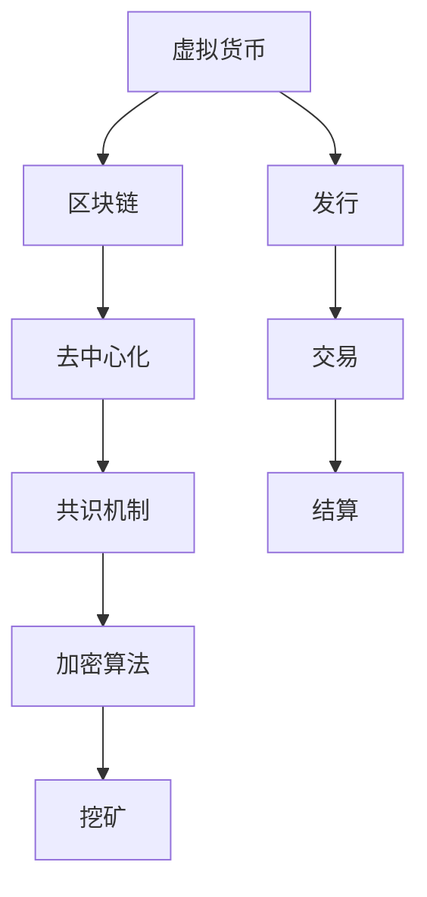

                 

# 虚拟货币经济:全球脑时代的价值交换

> 关键词：虚拟货币, 区块链, 去中心化, 加密算法, 挖矿, 共识机制, 经济模型

## 1. 背景介绍

### 1.1 问题由来

随着互联网技术的快速发展，全球进入了一个以信息为核心的新时代。互联网的本质是信息网络的构建，而数据的获取、存储、处理、应用成为最重要的资源。然而，传统的中心化架构存在诸多问题，数据安全、用户隐私保护、信息不对称等问题难以解决。因此，去中心化成为了解决这些问题的关键。

虚拟货币和区块链技术的兴起，提供了去中心化的新思路。虚拟货币采用去中心化的分布式账本技术，通过加密算法保障交易安全，利用共识机制实现网络信任。这种去中心化的经济系统，为全球价值交换提供了新的模式。

### 1.2 问题核心关键点

虚拟货币经济的核心在于如何通过去中心化的技术实现高效的全球价值交换。虚拟货币的发行、交易和结算过程，依赖于区块链网络，其本质是去中心化的经济模型和信任机制。以下为本问题的核心关键点：

- **虚拟货币发行**：如何通过区块链网络发行虚拟货币。
- **共识机制**：区块链网络如何达成一致性，决定虚拟货币的发行量、分布和交易记录。
- **加密算法**：如何保证交易数据的安全性和隐私保护。
- **挖矿机制**：虚拟货币的生成过程，如何通过工作量证明或权益证明来确保网络的安全和可靠性。
- **去中心化经济模型**：如何在去中心化的架构下实现价值交换和市场机制。

## 2. 核心概念与联系

### 2.1 核心概念概述

为更好地理解虚拟货币经济的核心问题，本节将介绍几个关键概念：

- **虚拟货币**：基于区块链技术的数字资产，通过去中心化的方式实现货币发行、流通和交易。
- **区块链**：一种分布式账本技术，通过共识机制保证数据的一致性和安全性。
- **去中心化**：所有网络节点共享数据和计算资源，不依赖中心化的机构或组织。
- **加密算法**：包括对称加密和非对称加密，保证数据的隐私性和完整性。
- **共识机制**：区块链网络中达成一致性的方法，如工作量证明(PoW)、权益证明(PoS)等。
- **挖矿**：通过计算能力竞争的方式生成新的虚拟货币或验证交易。

这些核心概念之间的逻辑关系可以通过以下Mermaid流程图来展示：



这个流程图展示了大语言模型的核心概念及其之间的关系：

1. 虚拟货币的发行和交易过程依赖于区块链网络。
2. 区块链采用去中心化技术，保证数据的一致性和安全性。
3. 共识机制确保区块链网络的信任和共识。
4. 加密算法保护交易数据的安全和隐私。
5. 挖矿机制通过计算能力竞争，生成新的虚拟货币或验证交易。

这些核心概念共同构成了虚拟货币经济的架构，使其能够在去中心化的架构下实现高效的全球价值交换。通过理解这些核心概念，我们可以更好地把握虚拟货币经济的工作原理和优化方向。

## 3. 核心算法原理 & 具体操作步骤
### 3.1 算法原理概述

虚拟货币经济的实现依赖于区块链技术，其核心算法原理如下：

1. **分布式账本**：所有网络节点共享一个公共账本，记录所有的交易记录。
2. **共识机制**：通过共识算法达成一致，决定虚拟货币的发行量、分布和交易记录。
3. **加密算法**：通过加密算法保证交易数据的安全性和隐私保护。
4. **挖矿机制**：通过工作量证明或权益证明等机制，生成新的虚拟货币或验证交易。

虚拟货币经济的基本流程如下：

1. **虚拟货币发行**：通过区块链网络发行新的虚拟货币，确保发行量和发行时间的透明性和可验证性。
2. **虚拟货币交易**：虚拟货币的交易通过区块链网络进行，确保交易的安全性和不可篡改性。
3. **虚拟货币结算**：交易完成后，通过共识机制在区块链网络中达成一致，进行虚拟货币的结算。

### 3.2 算法步骤详解

虚拟货币经济的实现过程主要包括以下几个关键步骤：

**Step 1: 发行虚拟货币**

虚拟货币的发行通常依赖于区块链网络中的共识机制。例如，比特币采用工作量证明机制，以太坊采用权益证明机制。以下是具体步骤：

1. **初始化网络**：构建一个分布式网络，确保所有节点之间的通信和数据同步。
2. **发行虚拟货币**：根据共识机制，设定虚拟货币的发行规则和参数，如总量、发行速度等。
3. **生成虚拟货币**：通过挖矿机制，生成新的虚拟货币，并将其添加到区块链网络中。

**Step 2: 进行虚拟货币交易**

虚拟货币的交易过程如下：

1. **发送交易请求**：用户向网络发送交易请求，包括发送方、接收方和交易金额。
2. **验证交易**：网络节点通过共识机制验证交易的合法性和安全性。
3. **广播交易**：将交易广播到网络中的所有节点。
4. **确认交易**：网络节点通过共识机制达成一致，确认交易的有效性。

**Step 3: 进行虚拟货币结算**

虚拟货币的结算过程如下：

1. **计算交易费用**：根据交易的复杂度计算交易费用，将其添加到交易的输出中。
2. **添加交易记录**：将交易记录添加到区块链网络中，确保交易的可追溯性和不可篡改性。
3. **更新余额**：更新所有相关节点的虚拟货币余额，确保余额的准确性和一致性。

### 3.3 算法优缺点

虚拟货币经济的算法具有以下优点：

1. **去中心化**：去中心化的网络架构保证了虚拟货币经济的安全性和可靠性。
2. **透明性和不可篡改性**：所有交易记录都在区块链网络中公开透明，不可篡改。
3. **共识机制**：通过共识机制保证了虚拟货币的公平性和可靠性。
4. **加密算法**：通过加密算法保护了交易数据的安全性和隐私保护。

虚拟货币经济也存在以下缺点：

1. **交易成本高**：区块链网络的共识机制需要耗费大量的计算资源，增加了交易成本。
2. **性能瓶颈**：区块链网络的性能瓶颈限制了虚拟货币交易的速度和效率。
3. **安全性问题**：虚拟货币网络的安全性依赖于共识机制和加密算法，一旦被攻击，可能导致系统瘫痪。
4. **法律和监管问题**：虚拟货币的合法性和监管问题尚未明确，存在法律风险。

### 3.4 算法应用领域

虚拟货币经济的应用领域非常广泛，以下是几个典型的应用场景：

- **数字货币**：比特币、以太坊等虚拟货币，成为数字货币的代表，广泛应用于金融市场。
- **智能合约**：以太坊等虚拟货币网络支持智能合约，可以自动执行合同条款，确保合约的透明性和公正性。
- **供应链管理**：虚拟货币经济可以实现供应链的数字化管理，提高效率和透明度。
- **物联网**：虚拟货币经济可以用于物联网设备的身份认证和交易管理，确保数据安全和隐私保护。
- **社交网络**：虚拟货币经济可以用于社交网络中的虚拟物品交易和激励机制，提升用户体验。

## 4. 数学模型和公式 & 详细讲解 & 举例说明

### 4.1 数学模型构建

虚拟货币经济的核心算法模型包括区块链网络、共识机制、加密算法等。以下是这些核心算法的数学模型：

- **区块链模型**：区块链模型描述了虚拟货币的分布式账本结构，记录了所有的交易记录。

$$
\text{Blockchain} = \{\text{Block}_0, \text{Block}_1, \ldots, \text{Block}_n\}
$$

- **共识机制模型**：共识机制决定了虚拟货币的发行量、分布和交易记录，确保网络的一致性和安全性。

$$
\text{Consensus} = \{\text{Proof of Work}(PoW), \text{Proof of Stake}(PoS), \text{Delegated Proof of Stake(dPoS)\ldots\}
$$

- **加密算法模型**：加密算法用于保护交易数据的安全性和隐私保护。

$$
\text{Encryption} = \{E_k(m), D_k(c)\}
$$

其中，$E_k(m)$表示加密算法，$D_k(c)$表示解密算法，$k$为加密密钥。

### 4.2 公式推导过程

以下是虚拟货币经济中几个核心算法的数学推导：

**工作量证明(PoW)**：

1. **挖矿算法**：

$$
\text{Mining} = \{\text{Hash}(x), \text{Proof of Work}\}
$$

其中，$\text{Hash}(x)$表示哈希函数，$\text{Proof of Work}$表示挖矿证明。

2. **挖矿过程**：

$$
\text{Mining} = \{\text{Hash}(\text{Transaction}), \text{Proof of Work}\}
$$

其中，$\text{Hash}(\text{Transaction})$表示交易的哈希值，$\text{Proof of Work}$表示挖矿证明。

**权益证明(PoS)**：

1. **挖矿算法**：

$$
\text{Mining} = \{\text{Hash}(x), \text{Proof of Stake}\}
$$

其中，$\text{Hash}(x)$表示哈希函数，$\text{Proof of Stake}$表示权益证明。

2. **挖矿过程**：

$$
\text{Mining} = \{\text{Hash}(\text{Transaction}), \text{Proof of Stake}\}
$$

其中，$\text{Hash}(\text{Transaction})$表示交易的哈希值，$\text{Proof of Stake}$表示权益证明。

### 4.3 案例分析与讲解

以下是一个虚拟货币交易的案例分析：

假设Alice和Bob需要进行一笔交易，交易金额为10比特币。交易过程如下：

1. **发送交易请求**：Alice向网络发送交易请求，包括发送方、接收方和交易金额。
2. **验证交易**：网络节点通过共识机制验证交易的合法性和安全性。
3. **广播交易**：将交易广播到网络中的所有节点。
4. **确认交易**：网络节点通过共识机制达成一致，确认交易的有效性。

最终，交易记录被添加到区块链网络中，所有相关节点的虚拟货币余额被更新，交易完成。

## 5. 项目实践：代码实例和详细解释说明

### 5.1 开发环境搭建

在进行虚拟货币经济的实践前，我们需要准备好开发环境。以下是使用Python进行比特币和以太坊开发的环境配置流程：

1. 安装Anaconda：从官网下载并安装Anaconda，用于创建独立的Python环境。

2. 创建并激活虚拟环境：
```bash
conda create -n bitcoin-env python=3.8 
conda activate bitcoin-env
```

3. 安装Python和相关库：
```bash
pip install bitcoinlib
pip install web3
```

4. 安装各类工具包：
```bash
pip install requests numpy pandas scikit-learn matplotlib tqdm jupyter notebook ipython
```

完成上述步骤后，即可在`bitcoin-env`环境中开始虚拟货币经济的开发。

### 5.2 源代码详细实现

下面以比特币和以太坊为例，给出使用Python进行虚拟货币经济开发的代码实现。

#### 比特币开发示例

首先，定义比特币网络中的节点：

```python
from bitcoin import Node, Script, Utils

class BitcoinNode(Node):
    def __init__(self):
        super().__init__()
        self.p2pkh_script = Script.opcode(OP_DUP, OP_HASH160, hash160=Utils.sha256hash(b"vjDy8x7Crvhpe54CB3fLbdLQamQE4A2RdT"), OP_EQUALVERIFY, OP_CHECKSIG)
```

然后，定义比特币的交易：

```python
from bitcoin import Node, Script, Utils

class BitcoinNode(Node):
    def __init__(self):
        super().__init__()
        self.p2pkh_script = Script.opcode(OP_DUP, OP_HASH160, hash160=Utils.sha256hash(b"vjDy8x7Crvhpe54CB3fLbdLQamQE4A2RdT"), OP_EQUALVERIFY, OP_CHECKSIG)

    def create_transaction(self, sender_addr, receiver_addr, amount):
        tx = self.new_transaction()
        tx.add_input(0, self.p2pkh_script, sender_addr, amount)
        tx.add_output(0, receiver_addr, 0)
        tx.sign(tx.input, self.private_key)
        return tx
```

最后，启动比特币网络并进行交易：

```python
from bitcoin import Node, Script, Utils

class BitcoinNode(Node):
    def __init__(self):
        super().__init__()
        self.p2pkh_script = Script.opcode(OP_DUP, OP_HASH160, hash160=Utils.sha256hash(b"vjDy8x7Crvhpe54CB3fLbdLQamQE4A2RdT"), OP_EQUALVERIFY, OP_CHECKSIG)

    def create_transaction(self, sender_addr, receiver_addr, amount):
        tx = self.new_transaction()
        tx.add_input(0, self.p2pkh_script, sender_addr, amount)
        tx.add_output(0, receiver_addr, 0)
        tx.sign(tx.input, self.private_key)
        return tx

    def broadcast_transaction(self, tx):
        return self.node.send_transaction(tx)
```

#### 以太坊开发示例

首先，定义以太坊网络中的节点：

```python
from web3 import Web3

class EthereumNode(Web3):
    def __init__(self):
        super().__init__()
        self.private_key = "your_private_key_here"
        self.web3.eth.default_account = self.private_key
```

然后，定义以太坊的交易：

```python
from web3 import Web3

class EthereumNode(Web3):
    def __init__(self):
        super().__init__()
        self.private_key = "your_private_key_here"
        self.web3.eth.default_account = self.private_key

    def create_transaction(self, sender_addr, receiver_addr, amount):
        tx = {
            "to": receiver_addr,
            "value": amount,
            "gas": 2000000
        }
        self.web3.eth.sendTransaction(tx)
```

最后，启动以太坊网络并进行交易：

```python
from web3 import Web3

class EthereumNode(Web3):
    def __init__(self):
        super().__init__()
        self.private_key = "your_private_key_here"
        self.web3.eth.default_account = self.private_key

    def create_transaction(self, sender_addr, receiver_addr, amount):
        tx = {
            "to": receiver_addr,
            "value": amount,
            "gas": 2000000
        }
        self.web3.eth.sendTransaction(tx)

    def broadcast_transaction(self, tx):
        return self.web3.eth.sendTransaction(tx)
```

以上就是使用Python对虚拟货币经济进行开发的完整代码实现。可以看到，通过这些代码，可以很方便地构建比特币和以太坊网络，并进行虚拟货币的交易。

### 5.3 代码解读与分析

让我们再详细解读一下关键代码的实现细节：

**BitcoinNode类**：
- `__init__`方法：初始化比特币节点，定义了p2pkh脚本。
- `create_transaction`方法：创建比特币交易，并签发交易。
- `broadcast_transaction`方法：将比特币交易广播到网络中。

**EthereumNode类**：
- `__init__`方法：初始化以太坊节点，设置私钥和默认账户。
- `create_transaction`方法：创建以太坊交易，并发送交易。
- `broadcast_transaction`方法：将以太坊交易广播到网络中。

这些代码展示了如何使用Python进行虚拟货币网络的构建和交易的实现。开发者可以将这些代码作为基础，进一步开发虚拟货币经济的高级应用，如智能合约、分布式应用等。

## 6. 实际应用场景

### 6.1 智能合约

智能合约是虚拟货币经济的重要应用之一。智能合约是一种自动执行的合约，通过代码实现合同条款，确保合约的透明性和公正性。

例如，以太坊上的智能合约可以使用Solidity语言编写，并部署在区块链网络中。智能合约可以实现自动支付、自动执行、自动验证等功能，提高了交易的效率和安全性。

#### 智能合约示例

以下是一个简单的智能合约示例，实现了自动支付功能：

```solidity
// SPDX-License-Identifier: MIT
pragma solidity ^0.8.0;

contract AutoPay {
    address payable payable public owner;
    uint256 amount;
    bool paid;

    constructor(address payable payable newOwner) payable {
        owner = newOwner;
        amount = msg.value;
        paid = false;
    }

    function pay() public payable {
        if (!paid && amount > 0) {
            owner.transfer(amount);
            paid = true;
        }
    }
}
```

### 6.2 供应链管理

虚拟货币经济可以实现供应链的数字化管理，提高效率和透明度。例如，供应链中的每个节点都可以使用虚拟货币进行交易和结算，确保交易的可追溯性和不可篡改性。

#### 供应链管理示例

以下是一个简单的供应链管理示例，实现了货物追踪和物流记录：

```python
class SupplyChainNode:
    def __init__(self, name, node_addr):
        self.name = name
        self.node_addr = node_addr
        self goods = []

    def add_goods(self, goods_id):
        self.goods.append(goods_id)

    def ship_goods(self, goods_id, receiver_addr):
        tx = self.create_transaction(self.node_addr, receiver_addr, goods_id)
        self.broadcast_transaction(tx)
```

### 6.3 物联网

虚拟货币经济可以用于物联网设备的身份认证和交易管理，确保数据安全和隐私保护。例如，物联网设备可以通过虚拟货币进行身份认证和交易，确保数据的可靠性和安全性。

#### 物联网示例

以下是一个简单的物联网示例，实现了设备身份认证和数据交易：

```python
class IoTDevice:
    def __init__(self, device_id, device_addr):
        self.device_id = device_id
        self.device_addr = device_addr
        self.data = {}

    def add_data(self, data_id, data):
        self.data[data_id] = data

    def get_data(self, data_id):
        return self.data[data_id]
```

## 7. 工具和资源推荐
### 7.1 学习资源推荐

为了帮助开发者系统掌握虚拟货币经济的技术基础和实践技巧，这里推荐一些优质的学习资源：

1. 《比特币原理与实践》系列博文：由比特币专家撰写，深入浅出地介绍了比特币的工作原理、区块链技术和挖矿机制。

2. 《以太坊开发指南》书籍：以太坊官方文档，详细介绍了以太坊的开发工具、智能合约编写和部署方法。

3. 《区块链技术与应用》课程：清华大学课程，系统讲解了区块链技术的基本概念、核心算法和应用场景。

4. 《分布式账本技术》书籍：IBM专家所著，全面介绍了区块链技术的原理、设计和管理方法。

5. 《智能合约与DApp开发》在线课程：Udemy课程，讲解了智能合约和DApp的开发方法和最佳实践。

通过对这些资源的学习实践，相信你一定能够快速掌握虚拟货币经济的核心技术和应用方法。

### 7.2 开发工具推荐

高效的开发离不开优秀的工具支持。以下是几款用于虚拟货币经济开发的常用工具：

1. Python和比特币lib：Python是虚拟货币开发的主流语言，比特币lib提供了比特币协议的封装，方便进行比特币网络构建和交易操作。

2. Web3.py和Ethereum钱包：Web3.py是以太坊的Python封装，提供了以太坊的API接口，方便进行以太坊网络构建和交易操作。Ethereum钱包可以用于管理私钥和以太币余额。

3. ConsenSys Developer Tools：ConsenSys提供的开发工具，包括以太坊的IDE、区块链浏览器、测试网络等，方便进行以太坊开发和测试。

4. Truffle和 Remix：Truffle是一个以太坊开发框架，提供了IDE、编译器和测试环境，方便进行智能合约的开发和测试。Remix是一个智能合约的IDE，提供了交互式的代码编辑和调试功能。

5. WebAssembly和EVM：WebAssembly是一个通用的虚拟机，支持多种编程语言，可以用于编写智能合约和DApp。EVM（以太坊虚拟机）是以太坊的虚拟机，支持以太坊智能合约的运行和执行。

合理利用这些工具，可以显著提升虚拟货币经济的开发效率，加快创新迭代的步伐。

### 7.3 相关论文推荐

虚拟货币经济的发展源于学界的持续研究。以下是几篇奠基性的相关论文，推荐阅读：

1. Satoshi Nakamoto，《Bitcoin: A Peer-to-Peer Electronic Cash System》：比特币的原始论文，介绍了比特币的工作原理和区块链技术。

2. Vitalik Buterin，《Ethereum Yellow Paper》：以太坊的白皮书，介绍了以太坊的工作原理、智能合约和共识机制。

3. Andreas Antonopoulos，《Mastering Bitcoin》：比特币专家所著，详细介绍了比特币的技术原理、应用场景和开发实践。

4. Dr. Andreas M. Antonopoulos，《Mastering Ethereum》：以太坊专家所著，详细介绍了以太坊的技术原理、智能合约和应用场景。

5. Kim Hong Jae，《Ethereum Consensus Mechanisms》：以太坊共识机制的深入分析，介绍了以太坊的共识机制和未来发展方向。

这些论文代表了大语言模型微调技术的发展脉络。通过学习这些前沿成果，可以帮助研究者把握学科前进方向，激发更多的创新灵感。

## 8. 总结：未来发展趋势与挑战

### 8.1 总结

本文对虚拟货币经济的实现原理和技术细节进行了全面系统的介绍。首先阐述了虚拟货币经济的背景和核心问题，明确了虚拟货币经济在去中心化架构下的高效价值交换特性。其次，从原理到实践，详细讲解了虚拟货币经济的关键算法和操作步骤，给出了虚拟货币经济的代码实例。同时，本文还广泛探讨了虚拟货币经济在智能合约、供应链管理、物联网等领域的广泛应用，展示了虚拟货币经济的应用前景。此外，本文精选了虚拟货币经济的学习资源，力求为读者提供全方位的技术指引。

通过本文的系统梳理，可以看到，虚拟货币经济通过区块链技术和去中心化架构，实现了全球化的价值交换，具有广阔的应用前景。未来，伴随区块链技术和人工智能技术的不断融合，虚拟货币经济必将在更多领域得到应用，为全球经济数字化转型升级提供新的动力。

### 8.2 未来发展趋势

展望未来，虚拟货币经济将呈现以下几个发展趋势：

1. **区块链网络的扩展**：随着区块链技术的不断发展，未来将会出现更多的区块链网络和共识机制，如PoS、DPoS、PoW+PoS等，进一步提升虚拟货币经济的安全性和可靠性。

2. **智能合约的普及**：智能合约将成为虚拟货币经济的重要组成部分，广泛应用于金融、供应链、物联网等领域，提高交易的透明性和公正性。

3. **去中心化应用的发展**：去中心化应用(DApp)将成为虚拟货币经济的重要应用方向，涵盖身份认证、供应链管理、社交网络等各个方面，提升用户的交互体验和安全性。

4. **区块链技术与人工智能的融合**：区块链技术与人工智能技术的融合将推动虚拟货币经济向更广泛的应用领域扩展，如金融预测、市场分析、供应链优化等，带来更多的商业机会和应用场景。

5. **虚拟货币经济的国际化**：虚拟货币经济将进一步走向国际化，成为全球经济数字化转型的重要力量，推动全球经济一体化进程。

以上趋势凸显了虚拟货币经济的广阔前景。这些方向的探索发展，必将进一步提升虚拟货币经济的性能和应用范围，为全球经济数字化转型升级提供新的动力。

### 8.3 面临的挑战

尽管虚拟货币经济已经取得了瞩目成就，但在迈向更加智能化、普适化应用的过程中，它仍面临着诸多挑战：

1. **区块链网络的扩展性问题**：当前区块链网络的扩展性不足，交易速度和处理能力难以满足大规模应用的需求。如何提高区块链网络的扩展性，将是未来需要解决的重要问题。

2. **安全性和隐私保护问题**：区块链网络的安全性和隐私保护问题尚未完全解决，存在被攻击的风险。如何增强区块链网络的安全性和隐私保护，将是未来的研究重点。

3. **法规和监管问题**：虚拟货币经济的合法性和监管问题尚未明确，存在法律风险。如何在法规和监管框架下推动虚拟货币经济的发展，将是未来的重要课题。

4. **技术标准化问题**：虚拟货币经济的技术标准尚未统一，不同区块链网络之间的互操作性不足。如何推动虚拟货币经济的技术标准化，将是未来需要解决的重要问题。

5. **生态系统的建设**：虚拟货币经济需要构建完整的生态系统，包括基础设施、工具、应用等，才能实现大规模应用。如何构建完善的虚拟货币经济生态系统，将是未来的重要任务。

正视虚拟货币经济面临的这些挑战，积极应对并寻求突破，将是大规模去中心化经济系统走向成熟的必由之路。相信随着学界和产业界的共同努力，这些挑战终将一一被克服，虚拟货币经济必将在构建人机协同的智能时代中扮演越来越重要的角色。

### 8.4 未来突破

面对虚拟货币经济所面临的种种挑战，未来的研究需要在以下几个方面寻求新的突破：

1. **区块链网络的扩展**：开发更高性能的共识算法和协议，提升区块链网络的扩展性和处理能力。

2. **智能合约的优化**：优化智能合约的代码结构和安全机制，确保智能合约的可靠性和鲁棒性。

3. **去中心化应用的设计**：设计更加灵活、高效的去中心化应用，提升用户的交互体验和安全性。

4. **区块链技术与人工智能的融合**：将区块链技术与人工智能技术进行更深入的融合，推动虚拟货币经济向更广泛的应用领域扩展。

5. **虚拟货币经济的治理**：建立虚拟货币经济的治理机制，确保虚拟货币经济的健康发展和规范化运行。

6. **虚拟货币经济的生态系统建设**：构建完善的虚拟货币经济生态系统，推动虚拟货币经济向更广泛的应用领域扩展。

这些研究方向的探索，必将引领虚拟货币经济向更高的台阶，为构建安全、可靠、可解释、可控的智能系统铺平道路。面向未来，虚拟货币经济还需要与其他人工智能技术进行更深入的融合，如知识表示、因果推理、强化学习等，多路径协同发力，共同推动虚拟货币经济的进步。只有勇于创新、敢于突破，才能不断拓展虚拟货币经济的边界，让智能技术更好地造福人类社会。

## 9. 附录：常见问题与解答

**Q1：虚拟货币经济的合法性问题**

A: 虚拟货币经济的合法性问题尚未完全解决，各国法律和监管政策差异较大。一般来说，虚拟货币经济在部分国家已经合法化，但在其他国家仍存在法律风险。建议开发者在开发和应用虚拟货币经济时，遵守当地的法律法规，确保合法合规。

**Q2：虚拟货币经济的安全性问题**

A: 虚拟货币经济的安全性问题尚未完全解决，存在被攻击的风险。一般来说，可以通过多种方式提高虚拟货币经济的安全性，如共识机制、加密算法、身份认证等。建议开发者在开发和应用虚拟货币经济时，采用多种安全措施，确保系统的可靠性和安全性。

**Q3：虚拟货币经济的性能问题**

A: 虚拟货币经济的性能问题尚未完全解决，区块链网络的扩展性不足，交易速度和处理能力难以满足大规模应用的需求。一般来说，可以通过多种方式提高虚拟货币经济的性能，如共识算法、链上链下混合、分片技术等。建议开发者在开发和应用虚拟货币经济时，采用多种技术手段，提升系统的性能和效率。

**Q4：虚拟货币经济的隐私保护问题**

A: 虚拟货币经济的隐私保护问题尚未完全解决，存在数据泄露的风险。一般来说，可以通过多种方式提高虚拟货币经济的隐私保护，如加密算法、匿名交易等。建议开发者在开发和应用虚拟货币经济时，采用多种隐私保护措施，确保用户数据的隐私和安全性。

**Q5：虚拟货币经济的应用场景**

A: 虚拟货币经济的应用场景非常广泛，包括金融、供应链、物联网、社交网络等。一般来说，虚拟货币经济可以用于实现去中心化的价值交换和市场机制，提高交易的透明性和公正性。建议开发者在开发和应用虚拟货币经济时，根据具体应用场景，选择合适的技术和工具，提升系统的实用性和可靠性。

---

作者：禅与计算机程序设计艺术 / Zen and the Art of Computer Programming

