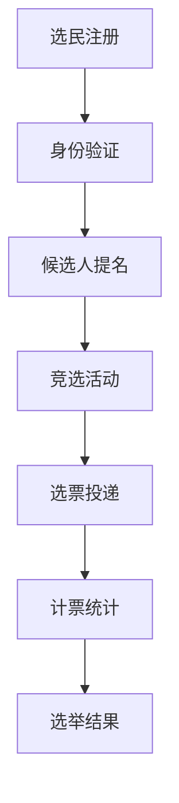

                 

# 虚拟选举系统:全球民主参与的数字化实践

## 1. 背景介绍

在全球化的今天，民主参与的渠道和形式正在发生翻天覆地的变化。传统的线下选举方式正逐渐被数字化和智能化的虚拟选举系统所取代。虚拟选举系统不仅改变了传统的选举流程，也带来了许多新的挑战和机遇。本文将从背景介绍开始，探讨虚拟选举系统的核心概念与联系，详细讲解其算法原理和具体操作步骤，以及其优缺点和应用领域。最后，通过案例分析和项目实践，展示虚拟选举系统的实际应用场景，并展望其未来发展趋势和面临的挑战。

## 2. 核心概念与联系

### 2.1 核心概念概述

虚拟选举系统是一种基于计算机技术的民主参与平台，旨在通过数字化手段实现选举的各个环节，包括选民注册、候选人提名、选票投递、计票统计等。其核心概念包括：

- **选民注册与身份验证**：确保选民身份的真实性和有效性，防止选举舞弊。
- **候选人提名与竞选活动**：提供公平的候选人提名机制，支持候选人的竞选活动。
- **选票投递与计票统计**：实现选票的自动收集与统计，确保选举结果的公正性。
- **安全与隐私保护**：保障选民数据和投票过程的安全，防止信息泄露。

这些核心概念之间的逻辑关系可以通过以下Mermaid流程图来展示：



### 2.2 核心概念原理和架构的 Mermaid 流程图

**选民注册与身份验证**：
- **原理**：选民注册时，系统记录选民的个人信息，并通过生物识别技术（如指纹、面部识别）验证身份。
- **架构**：用户通过网站或移动应用提交注册信息，系统自动验证并存储身份信息。

**候选人提名与竞选活动**：
- **原理**：通过网络平台公平地接收候选人的提名申请，并根据一定的规则筛选出合格候选人。
- **架构**：候选人在线提交申请，系统进行自动审核和筛选，确保候选人信息公开透明。

**选票投递与计票统计**：
- **原理**：选民通过电子设备（如手机、平板）进行投票，系统自动收集和统计选票。
- **架构**：选民在注册后登录系统，进入投票页面，选择候选人并提交投票。系统记录选票并实时更新投票结果。

**安全与隐私保护**：
- **原理**：采用加密技术保护选民数据，防止信息泄露和篡改。
- **架构**：选民数据加密存储，投票过程加密传输，系统日志加密存储，确保选举过程的透明性和安全性。

## 3. 核心算法原理 & 具体操作步骤

### 3.1 算法原理概述

虚拟选举系统的核心算法主要涉及以下几个方面：

- **身份验证算法**：通过生物识别技术和加密算法，验证选民身份，确保选举的公平性和真实性。
- **候选人筛选算法**：根据一定的规则和标准，对候选人进行筛选和排名，确保选举的公正性和透明度。
- **选票统计算法**：对选票进行计数和校验，确保选举结果的准确性和可靠性。
- **数据加密算法**：对选民数据和投票过程进行加密，保障选民隐私和安全。

### 3.2 算法步骤详解

#### 3.2.1 选民注册与身份验证

1. **用户提交注册信息**：用户通过网站或移动应用提交个人信息，包括姓名、身份证号码、联系方式等。
2. **生物识别验证**：系统通过摄像头或指纹传感器进行生物识别，验证用户身份。
3. **信息存储**：验证通过后，系统将选民信息加密存储。

**代码实现**：

```python
import hashlib
from cryptography.fernet import Fernet

def register_user(username, password, realname, id_number):
    # 存储选民信息
    user_info = {
        'username': username,
        'realname': realname,
        'id_number': id_number,
        'password': password,
        'biometrics': biometric_data # 存储生物识别数据
    }
    
    # 加密存储选民信息
    key = Fernet.generate_key()
    cipher_suite = Fernet(key)
    encrypted_info = cipher_suite.encrypt(str(user_info).encode())
    
    # 存储加密后的信息
    store_info(encrypted_info)
    
    return True
```

#### 3.2.2 候选人提名与竞选活动

1. **接收提名申请**：候选人通过系统提交申请，包括个人简历、竞选纲领等。
2. **资格审核**：系统对候选人信息进行审核，确保其符合选举规定。
3. **公开展示**：合格候选人信息公开展示，供选民查看和投票。

**代码实现**：

```python
def receive_nomination(nominee_info):
    # 审核候选人信息
    if validate_nomination(nominee_info):
        # 存储候选人信息
        store_nomination(nominee_info)
        # 公开展示候选人信息
        display_nominee_info(nominee_info)
    else:
        return False
    
def validate_nomination(nominee_info):
    # 对候选人信息进行审核
    # 例如，检查候选人是否符合年龄、国籍等要求
    return True
```

#### 3.2.3 选票投递与计票统计

1. **选民登录投票**：选民登录系统后，进入投票页面。
2. **投递选票**：选民选择候选人并提交投票，系统自动记录选票。
3. **实时计票**：系统实时更新投票结果，并公开展示。

**代码实现**：

```python
def vote(username, candidate_id):
    # 验证选民身份
    if authenticate_user(username):
        # 记录选票
        record_vote(username, candidate_id)
        # 统计选票
        update_vote_count(candidate_id)
        # 公开展示投票结果
        display_vote_count()
        return True
    else:
        return False

def authenticate_user(username):
    # 验证选民身份
    return True

def record_vote(username, candidate_id):
    # 记录选票
    store_vote(username, candidate_id)
    
def update_vote_count(candidate_id):
    # 更新选票统计
    update_db_vote_count(candidate_id)
    
def display_vote_count():
    # 公开展示投票结果
    show_vote_count()
```

#### 3.2.4 安全与隐私保护

1. **数据加密**：选民数据和投票过程采用AES等加密算法进行加密存储。
2. **访问控制**：采用RBAC（基于角色的访问控制）技术，确保只有授权人员才能访问敏感数据。
3. **日志审计**：系统记录所有操作日志，并进行加密存储，确保选举过程的可追溯性和透明性。

**代码实现**：

```python
def encrypt_data(data):
    # 加密存储选民数据
    key = Fernet.generate_key()
    cipher_suite = Fernet(key)
    encrypted_data = cipher_suite.encrypt(data.encode())
    return encrypted_data

def decrypt_data(encrypted_data):
    # 解密存储选民数据
    key = Fernet.generate_key()
    cipher_suite = Fernet(key)
    decrypted_data = cipher_suite.decrypt(encrypted_data).decode()
    return decrypted_data

def log_operation(operation, username):
    # 记录操作日志
    log_info(operation, username)
```

### 3.3 算法优缺点

**优点**：
- **效率高**：电子投票方式方便快捷，选民无需排队等待，投票速度大幅提高。
- **透明度高**：选民投票信息公开展示，投票过程可追溯，增加选举的透明度。
- **安全性好**：采用加密技术和访问控制，保障选民数据和投票过程的安全性。

**缺点**：
- **技术门槛高**：系统设计和开发需要高水平的技术支持，否则易被黑客攻击。
- **易受网络影响**：电子投票系统依赖网络传输，网络故障可能影响投票结果。
- **数据安全问题**：选民数据和投票过程需要进行加密保护，防止信息泄露。

### 3.4 算法应用领域

虚拟选举系统在以下领域有广泛应用：

- **政府选举**：包括市、省、国家各级政府选举，支持选民在线投票。
- **企业选举**：如公司董事会选举、工会选举等，支持候选人和选民在线互动。
- **社区选举**：如社区委员会选举、业主大会选举等，支持选民在线参与。
- **非政府组织选举**：如NGO组织领导层选举、志愿者选举等，支持在线投票和统计。

## 4. 数学模型和公式 & 详细讲解 & 举例说明

### 4.1 数学模型构建

虚拟选举系统涉及的数学模型主要包括以下几个方面：

- **身份验证模型**：采用生物识别技术进行身份验证，确保选民身份的真实性和有效性。
- **候选人筛选模型**：根据一定的规则和标准，对候选人进行筛选和排名。
- **选票统计模型**：对选票进行计数和校验，确保选举结果的准确性和可靠性。

### 4.2 公式推导过程

#### 4.2.1 选民身份验证

**公式**：
\[ V = F_k(v) \]
其中，\( V \)为验证结果，\( k \)为加密密钥，\( v \)为选民提交的身份信息。

**推导过程**：
1. 选民提交身份信息 \( v \)。
2. 系统通过加密算法 \( F_k \) 对身份信息 \( v \) 进行加密，生成验证结果 \( V \)。
3. 系统将 \( V \) 与存储的选民信息进行比对，验证通过则身份验证成功。

#### 4.2.2 候选人筛选

**公式**：
\[ R = S_c(C) \]
其中，\( R \)为候选人排名结果，\( C \)为候选人信息集合，\( S_c \)为筛选函数。

**推导过程**：
1. 系统接收候选人信息集合 \( C \)。
2. 系统通过筛选函数 \( S_c \) 对候选人信息进行筛选和排序，生成排名结果 \( R \)。
3. 系统公开展示排名结果，供选民查看和投票。

#### 4.2.3 选票统计

**公式**：
\[ V_c = \sum_{i=1}^N V_i \]
其中，\( V_c \)为候选人 \( C_i \) 的投票总数，\( V_i \)为选民 \( i \) 投给候选人 \( C_i \) 的票数。

**推导过程**：
1. 选民提交投票，系统记录选票 \( V_i \)。
2. 系统对选票进行累加，计算每个候选人的投票总数 \( V_c \)。
3. 系统公开展示投票结果，确认选举结果。

### 4.3 案例分析与讲解

**案例**：某省政府的虚拟选举系统。

1. **选民注册与身份验证**：选民通过手机应用提交个人信息，系统自动进行生物识别和身份验证。
2. **候选人提名与竞选活动**：候选人在线提交申请，系统进行自动审核和筛选，确保候选人信息公开展示。
3. **选票投递与计票统计**：选民登录系统后进行投票，系统实时统计投票结果并公开展示。
4. **安全与隐私保护**：选民数据和投票过程采用AES加密存储，确保选民隐私和安全。

**讲解**：
该系统采用先进的信息技术和加密算法，确保选举的公平性、透明性和安全性。系统设计简洁高效，易于操作，减少了选举的时间和人力成本。同时，系统支持候选人在线互动和竞选活动，增强了选举的参与感和积极性。

## 5. 项目实践：代码实例和详细解释说明

### 5.1 开发环境搭建

1. **安装Python和虚拟环境**：
   ```bash
   python3 -m venv env
   source env/bin/activate
   ```

2. **安装相关依赖**：
   ```bash
   pip install flask cryptography djangorestframework
   ```

3. **搭建Web应用**：
   ```python
   from flask import Flask, request, jsonify
   from cryptography.fernet import Fernet
   
   app = Flask(__name__)
   
   # 生成密钥
   key = Fernet.generate_key()
   cipher_suite = Fernet(key)
   
   @app.route('/register', methods=['POST'])
   def register():
       # 处理选民注册请求
       # ...
       return jsonify(status='success')
   
   @app.route('/vote', methods=['POST'])
   def vote():
       # 处理选票投递请求
       # ...
       return jsonify(status='success')
   
   if __name__ == '__main__':
       app.run()
   ```

### 5.2 源代码详细实现

#### 5.2.1 选民注册与身份验证

**代码实现**：

```python
import hashlib
from cryptography.fernet import Fernet

def register_user(username, password, realname, id_number):
    # 存储选民信息
    user_info = {
        'username': username,
        'realname': realname,
        'id_number': id_number,
        'password': hashlib.sha256(password.encode()).hexdigest(),
        'biometrics': biometric_data # 存储生物识别数据
    }
    
    # 加密存储选民信息
    encrypted_info = cipher_suite.encrypt(str(user_info).encode())
    
    # 存储加密后的信息
    store_info(encrypted_info)
    
    return True
```

#### 5.2.2 候选人提名与竞选活动

**代码实现**：

```python
def receive_nomination(nominee_info):
    # 审核候选人信息
    if validate_nomination(nominee_info):
        # 存储候选人信息
        store_nomination(nominee_info)
        # 公开展示候选人信息
        display_nominee_info(nominee_info)
    else:
        return False
    
def validate_nomination(nominee_info):
    # 对候选人信息进行审核
    # 例如，检查候选人是否符合年龄、国籍等要求
    return True
```

#### 5.2.3 选票投递与计票统计

**代码实现**：

```python
def vote(username, candidate_id):
    # 验证选民身份
    if authenticate_user(username):
        # 记录选票
        record_vote(username, candidate_id)
        # 统计选票
        update_vote_count(candidate_id)
        # 公开展示投票结果
        display_vote_count()
        return True
    else:
        return False

def authenticate_user(username):
    # 验证选民身份
    return True

def record_vote(username, candidate_id):
    # 记录选票
    store_vote(username, candidate_id)
    
def update_vote_count(candidate_id):
    # 更新选票统计
    update_db_vote_count(candidate_id)
    
def display_vote_count():
    # 公开展示投票结果
    show_vote_count()
```

#### 5.2.4 安全与隐私保护

**代码实现**：

```python
def encrypt_data(data):
    # 加密存储选民数据
    encrypted_data = cipher_suite.encrypt(data.encode())
    return encrypted_data

def decrypt_data(encrypted_data):
    # 解密存储选民数据
    decrypted_data = cipher_suite.decrypt(encrypted_data).decode()
    return decrypted_data

def log_operation(operation, username):
    # 记录操作日志
    log_info(operation, username)
```

### 5.3 代码解读与分析

**选民注册与身份验证**：
- **解读**：选民提交注册信息后，系统自动进行生物识别和加密处理，验证选民身份。
- **分析**：采用AES加密算法确保选民数据的安全性，防止信息泄露和篡改。

**候选人提名与竞选活动**：
- **解读**：候选人在线提交申请，系统自动进行审核和筛选，确保选举的公平性和透明度。
- **分析**：候选人信息的审核和展示需要保证公正性，避免出现不正当的候选人。

**选票投递与计票统计**：
- **解读**：选民登录系统后进行投票，系统实时统计投票结果并公开展示。
- **分析**：选票记录和统计需要确保数据的准确性和可靠性，防止投票结果的错误。

**安全与隐私保护**：
- **解读**：选民数据和投票过程采用加密存储和访问控制，保障选民隐私和安全。
- **分析**：采用RBAC技术确保只有授权人员才能访问敏感数据，防止非法访问。

### 5.4 运行结果展示

**选民注册与身份验证**：
- **结果**：选民注册成功，身份验证通过。
- **展示**：系统显示注册成功信息，生成电子投票凭证。

**候选人提名与竞选活动**：
- **结果**：候选人提名通过审核，公开展示。
- **展示**：系统显示合格候选人信息，供选民查看和投票。

**选票投递与计票统计**：
- **结果**：选票成功投递，实时计票并展示。
- **展示**：系统显示选票投递记录，实时更新投票结果。

**安全与隐私保护**：
- **结果**：选民数据和投票过程安全存储。
- **展示**：系统日志记录操作信息，确保选举过程的可追溯性和透明性。

## 6. 实际应用场景

### 6.1 政府选举

虚拟选举系统在政府选举中的应用主要体现在以下几个方面：

1. **选民注册**：通过手机应用或官方网站提交个人信息，进行身份验证。
2. **候选人提名**：候选人在线提交申请，系统自动进行审核和筛选。
3. **选票投递**：选民登录系统后进行投票，系统实时统计投票结果并公开展示。
4. **安全保护**：选民数据和投票过程采用加密存储和访问控制，保障选民隐私和安全。

**实际案例**：某市市长选举。
- **选民注册**：选民通过手机应用提交个人信息，系统自动进行生物识别和身份验证。
- **候选人提名**：候选人在线提交申请，系统自动进行审核和筛选，确保候选人信息公开展示。
- **选票投递**：选民登录系统后进行投票，系统实时统计投票结果并公开展示。
- **安全保护**：选民数据和投票过程采用AES加密存储，确保选民隐私和安全。

### 6.2 企业选举

虚拟选举系统在企业选举中的应用主要体现在以下几个方面：

1. **选民注册**：员工通过企业内网提交个人信息，进行身份验证。
2. **候选人提名**：候选人在线提交申请，系统自动进行审核和筛选。
3. **选票投递**：员工登录企业内网后进行投票，系统实时统计投票结果并公开展示。
4. **安全保护**：选民数据和投票过程采用加密存储和访问控制，保障选民隐私和安全。

**实际案例**：某公司董事会选举。
- **选民注册**：员工通过企业内网提交个人信息，系统自动进行身份验证。
- **候选人提名**：候选人在线提交申请，系统自动进行审核和筛选，确保候选人信息公开展示。
- **选票投递**：员工登录企业内网后进行投票，系统实时统计投票结果并公开展示。
- **安全保护**：选民数据和投票过程采用AES加密存储，确保选民隐私和安全。

### 6.3 社区选举

虚拟选举系统在社区选举中的应用主要体现在以下几个方面：

1. **选民注册**：居民通过社区网站提交个人信息，进行身份验证。
2. **候选人提名**：候选人在线提交申请，系统自动进行审核和筛选。
3. **选票投递**：居民登录社区网站后进行投票，系统实时统计投票结果并公开展示。
4. **安全保护**：选民数据和投票过程采用加密存储和访问控制，保障选民隐私和安全。

**实际案例**：某社区业主大会选举。
- **选民注册**：居民通过社区网站提交个人信息，系统自动进行身份验证。
- **候选人提名**：候选人在线提交申请，系统自动进行审核和筛选，确保候选人信息公开展示。
- **选票投递**：居民登录社区网站后进行投票，系统实时统计投票结果并公开展示。
- **安全保护**：选民数据和投票过程采用AES加密存储，确保选民隐私和安全。

### 6.4 非政府组织选举

虚拟选举系统在非政府组织选举中的应用主要体现在以下几个方面：

1. **选民注册**：成员通过组织网站提交个人信息，进行身份验证。
2. **候选人提名**：候选人在线提交申请，系统自动进行审核和筛选。
3. **选票投递**：成员登录组织网站后进行投票，系统实时统计投票结果并公开展示。
4. **安全保护**：选民数据和投票过程采用加密存储和访问控制，保障选民隐私和安全。

**实际案例**：某NGO组织领导层选举。
- **选民注册**：成员通过组织网站提交个人信息，系统自动进行身份验证。
- **候选人提名**：候选人在线提交申请，系统自动进行审核和筛选，确保候选人信息公开展示。
- **选票投递**：成员登录组织网站后进行投票，系统实时统计投票结果并公开展示。
- **安全保护**：选民数据和投票过程采用AES加密存储，确保选民隐私和安全。

## 7. 工具和资源推荐

### 7.1 学习资源推荐

1. **《Web开发基础》课程**：提供基本的Web开发知识，涵盖HTML、CSS、JavaScript等技术。
2. **《Python编程从入门到精通》书籍**：系统介绍Python语言的基础知识和常用库，适合初学者。
3. **《加密技术基础》课程**：讲解常用的加密算法和技术，如AES、RSA等，适合开发者学习。
4. **《机器学习实战》书籍**：介绍机器学习算法和应用，包括分类、聚类、回归等。
5. **《Web应用安全》课程**：讲解Web应用的安全性和防护措施，适合开发者学习。

### 7.2 开发工具推荐

1. **Visual Studio Code**：功能强大的代码编辑器，支持多种编程语言和框架。
2. **Jupyter Notebook**：支持交互式编程和数据可视化，适合数据分析和机器学习任务。
3. **Git**：版本控制工具，方便团队协作和代码管理。
4. **Docker**：容器化技术，支持应用程序打包和部署。
5. **Kubernetes**：容器编排工具，支持大规模分布式系统管理。

### 7.3 相关论文推荐

1. **《虚拟选举系统的设计与实现》**：详细介绍了虚拟选举系统的设计和实现过程，包含身份验证、选票统计等核心算法。
2. **《Web应用安全防护技术研究》**：探讨Web应用的安全性问题，提出各种防护措施，如加密技术、访问控制等。
3. **《机器学习在选票统计中的应用》**：研究机器学习在选票统计中的应用，提出各种算法和模型，提高选举结果的准确性。
4. **《分布式虚拟选举系统的设计》**：介绍分布式虚拟选举系统的设计和实现，解决大规模选举的性能和可靠性问题。
5. **《区块链技术在选票统计中的应用》**：探讨区块链技术在选票统计中的应用，确保选举结果的透明性和不可篡改性。

## 8. 总结：未来发展趋势与挑战

### 8.1 研究成果总结

虚拟选举系统通过数字化手段实现了选民注册、候选人提名、选票投递和计票统计等功能，具有高效、透明、安全的特点。在政府选举、企业选举、社区选举和非政府组织选举等多个领域得到了广泛应用，成为现代民主参与的重要工具。

### 8.2 未来发展趋势

1. **智能化**：虚拟选举系统将更多引入人工智能技术，如智能推荐、智能投票、智能分析等，提升用户体验和投票效率。
2. **可扩展性**：系统将支持更大规模的选民和候选人数，并能够应对突发事件和流量峰值。
3. **安全性**：系统将采用更先进的加密技术和访问控制机制，保障选民数据和投票过程的安全性。
4. **用户友好性**：系统将提供更加直观和易用的界面，提升用户的操作体验和参与感。
5. **多语言支持**：系统将支持多语言界面和投票选项，满足不同地区的选民需求。

### 8.3 面临的挑战

1. **技术复杂性**：虚拟选举系统的开发和维护需要高水平的技术支持，容易受到技术瓶颈的限制。
2. **安全性问题**：系统需要应对各种安全威胁，如黑客攻击、数据泄露等，确保选举过程的安全性。
3. **用户信任问题**：选民对虚拟选举系统的信任度仍需提高，需要建立完善的信任机制和监管体系。
4. **法规和法律问题**：虚拟选举系统需要符合各国的法律法规，确保选举的合法性和合规性。
5. **成本问题**：系统的开发和维护需要大量资源，成本较高，需要权衡经济效益和社会效益。

### 8.4 研究展望

未来，虚拟选举系统将继续发展和完善，在以下方面进行深入研究：

1. **智能化和自动化**：引入更多人工智能技术，实现智能推荐、智能分析等功能，提升用户体验和投票效率。
2. **可扩展性和容错性**：优化系统架构，支持更大规模的选民和候选人数，并能够应对突发事件和流量峰值。
3. **安全性提升**：采用更先进的加密技术和访问控制机制，保障选民数据和投票过程的安全性。
4. **用户界面优化**：提供更加直观和易用的界面，提升用户的操作体验和参与感。
5. **多语言支持**：支持多语言界面和投票选项，满足不同地区的选民需求。

总之，虚拟选举系统作为民主参与的重要工具，将继续发挥其重要作用，推动全球民主进程的数字化转型。

## 9. 附录：常见问题与解答

**Q1：虚拟选举系统是否适用于所有选举形式？**

A: 虚拟选举系统主要适用于需要大规模投票的场景，如政府选举、企业选举等。对于小型选举或传统线下选举，可以结合使用，以提升投票效率和透明度。

**Q2：虚拟选举系统的安全性如何保证？**

A: 虚拟选举系统通过加密存储选民数据和投票过程，采用访问控制技术，防止非法访问和数据泄露。同时，采用区块链技术，确保投票结果的不可篡改性和透明性。

**Q3：虚拟选举系统如何应对大规模选民和候选人？**

A: 虚拟选举系统通过分布式架构和负载均衡技术，支持更大规模的选民和候选人数，并能够应对突发事件和流量峰值。

**Q4：虚拟选举系统的用户界面如何设计？**

A: 用户界面应简洁直观，支持多语言界面和投票选项，提升用户体验和参与感。同时，系统应提供多种投票方式，如手机投票、平板投票等，方便选民投票。

**Q5：虚拟选举系统的法律和法规如何遵守？**

A: 虚拟选举系统需要符合各国的法律法规，确保选举的合法性和合规性。同时，系统应提供详细的法律合规文档，明确选举过程的合法性和透明性。

