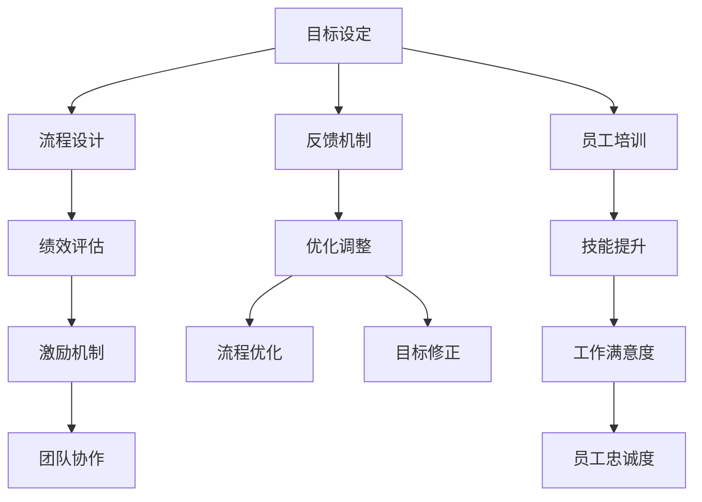

                 

# 行动体系对管理执行力的影响

> 关键词：行动体系,管理执行力,组织管理,目标管理,绩效评估,激励机制,团队协作

## 1. 背景介绍

### 1.1 问题由来

在现代企业管理中，如何提升组织的管理执行力一直是企业高层和中层管理人员关注的焦点。管理执行力关乎企业战略的实现和绩效目标的达成，直接影响到企业的市场竞争力和可持续发展能力。然而，尽管许多企业采用了先进的管理理念和工具，但实际的管理执行力仍然存在诸多问题，导致战略无法顺利执行，目标难以实现。

### 1.2 问题核心关键点

管理执行力的问题主要表现在以下几个方面：

1. **目标不明确**：企业的战略目标和部门目标不清晰，导致员工不知如何执行。
2. **流程不畅**：企业内部流程设计不合理，导致信息传递不畅，影响工作效率。
3. **绩效评估不合理**：绩效评估标准不科学，导致员工积极性受挫，缺乏动力。
4. **激励机制缺失**：缺乏有效的激励机制，员工缺乏工作动力和归属感。
5. **团队协作不足**：团队协作机制不健全，影响整体执行力。
6. **反馈机制缺失**：缺乏有效的反馈机制，影响问题及时解决和纠正。

这些问题导致了企业执行力下降，影响企业的市场竞争力和可持续发展能力。因此，如何构建一个高效、可控的行动体系，成为提升管理执行力的关键。

### 1.3 问题研究意义

构建高效行动体系的意义在于：

1. **提升战略执行力**：确保企业战略目标的顺利执行，增强企业的市场竞争力。
2. **提高工作效率**：通过优化流程设计，提高信息传递效率，减少工作浪费。
3. **科学评估绩效**：制定科学合理的绩效评估标准，激发员工积极性，提升工作效率。
4. **增强团队协作**：通过完善团队协作机制，增强团队凝聚力和协作效率。
5. **及时反馈问题**：建立有效的反馈机制，确保问题及时发现和解决，提高执行力。

## 2. 核心概念与联系

### 2.1 核心概念概述

为了更好地理解行动体系对管理执行力的影响，本节将介绍几个关键概念：

- **行动体系**：指企业为实现其战略目标而构建的一套规范化的行动方案、流程和反馈机制，涵盖目标设定、流程设计、绩效评估、激励机制、团队协作等方面。
- **管理执行力**：指企业或团队在执行任务时，将战略目标转化为实际成果的能力，包括目标设定、流程设计、绩效评估、激励机制、团队协作等方面。
- **组织管理**：指企业为实现其战略目标而进行的组织结构设计、人力资源管理、文化建设等活动。
- **目标管理**：指企业通过设定具体、可衡量、可实现的目标，引导员工为实现这些目标而采取行动的过程。
- **绩效评估**：指通过一系列指标和标准，对员工或团队的绩效进行量化评估的过程。
- **激励机制**：指企业为激发员工积极性、提升工作动力而采取的一系列奖励和惩罚措施。
- **团队协作**：指企业通过完善协作机制，促进团队成员之间的沟通和合作，以提高整体执行力。

这些概念之间有着密切的联系，形成一个完整的管理体系。行动体系作为企业管理执行力的核心支撑，通过科学的目标设定、流程设计、绩效评估、激励机制、团队协作等环节，全面提升企业的管理执行力。

### 2.2 核心概念原理和架构的 Mermaid 流程图



这个流程图展示了行动体系的核心概念及其相互关系：

1. **目标设定**：通过设定具体、可衡量、可实现的目标，引导员工为实现这些目标而采取行动。
2. **流程设计**：通过优化流程设计，提高信息传递效率，减少工作浪费。
3. **绩效评估**：通过科学合理的绩效评估标准，激发员工积极性，提升工作效率。
4. **激励机制**：通过制定有效的激励机制，增强员工工作动力和归属感。
5. **团队协作**：通过完善团队协作机制，增强团队凝聚力和协作效率。
6. **反馈机制**：通过建立有效的反馈机制，确保问题及时发现和解决。
7. **优化调整**：通过持续优化调整，提升整体执行力。
8. **员工培训**：通过培训提升员工技能，增强工作满意度。
9. **技能提升**：通过技能提升，提高员工工作能力。
10. **工作满意度**：通过提高工作满意度，增强员工忠诚度。

## 3. 核心算法原理 & 具体操作步骤

### 3.1 算法原理概述

构建行动体系的过程是一个系统化的管理工程，涉及多个核心算法和操作步骤。其核心算法包括：

1. **目标设定算法**：通过科学的方法确定企业的战略目标和部门目标。
2. **流程设计算法**：通过优化流程设计，提高信息传递效率。
3. **绩效评估算法**：通过量化评估员工或团队的绩效，科学评估工作成果。
4. **激励机制设计算法**：通过制定有效的激励机制，激发员工积极性。
5. **团队协作算法**：通过优化团队协作机制，增强团队凝聚力和协作效率。

操作步骤包括：

1. 目标设定：明确企业的战略目标和部门目标。
2. 流程设计：优化企业流程设计，提高信息传递效率。
3. 绩效评估：制定科学合理的绩效评估标准，评估员工或团队的工作成果。
4. 激励机制：制定有效的激励机制，激发员工积极性。
5. 团队协作：优化团队协作机制，增强团队凝聚力和协作效率。
6. 反馈机制：建立有效的反馈机制，确保问题及时发现和解决。
7. 优化调整：持续优化调整，提升整体执行力。

### 3.2 算法步骤详解

#### 3.2.1 目标设定算法

目标设定算法包括以下步骤：

1. **确定战略目标**：通过分析市场环境、行业趋势和内部资源，确定企业的战略目标。
2. **分解目标**：将战略目标分解为部门目标和员工目标。
3. **设定可衡量指标**：为每个目标设定可量化的指标，如销售额、市场份额、客户满意度等。
4. **设定时间节点**：为每个目标设定完成时间节点，如季度、年度等。

#### 3.2.2 流程设计算法

流程设计算法包括以下步骤：

1. **流程诊断**：分析企业现有的业务流程，找出瓶颈和改进点。
2. **流程优化**：通过优化流程设计，提高信息传递效率，减少工作浪费。
3. **流程标准化**：制定流程标准化操作手册，确保流程的一致性和稳定性。
4. **流程监控**：建立流程监控机制，及时发现和解决流程中的问题。

#### 3.2.3 绩效评估算法

绩效评估算法包括以下步骤：

1. **确定评估指标**：根据目标设定算法中的可衡量指标，确定绩效评估指标。
2. **制定评估标准**：为每个评估指标制定科学的评估标准。
3. **实施评估**：对员工或团队的工作成果进行量化评估。
4. **反馈评估结果**：及时反馈评估结果，帮助员工改进工作。

#### 3.2.4 激励机制设计算法

激励机制设计算法包括以下步骤：

1. **确定激励类型**：根据员工的需求和特点，确定激励类型，如物质激励、精神激励等。
2. **设定激励标准**：为每个激励类型设定具体的激励标准。
3. **实施激励措施**：根据员工的工作表现和激励标准，实施激励措施。
4. **评估激励效果**：评估激励措施的效果，持续改进激励机制。

#### 3.2.5 团队协作算法

团队协作算法包括以下步骤：

1. **团队划分**：根据业务需求和员工特点，合理划分团队。
2. **制定协作规则**：制定团队协作规则，明确团队成员的职责和沟通方式。
3. **优化协作流程**：通过优化协作流程，提高团队协作效率。
4. **建立协作机制**：建立协作机制，促进团队成员之间的沟通和合作。

### 3.3 算法优缺点

构建行动体系的优点包括：

1. **提升战略执行力**：通过明确的目标设定和流程设计，确保企业战略目标的顺利执行。
2. **提高工作效率**：通过优化流程设计，提高信息传递效率，减少工作浪费。
3. **科学评估绩效**：通过科学合理的绩效评估标准，激发员工积极性，提升工作效率。
4. **增强团队协作**：通过完善团队协作机制，增强团队凝聚力和协作效率。
5. **及时反馈问题**：通过建立有效的反馈机制，确保问题及时发现和解决。

构建行动体系的缺点包括：

1. **复杂度高**：构建行动体系需要涉及多个环节和算法，复杂度较高。
2. **资源投入大**：构建行动体系需要投入大量资源，包括人力、时间和资金。
3. **灵活性不足**：一旦行动体系建成，调整和优化难度较大。

### 3.4 算法应用领域

行动体系的应用领域包括：

1. **制造业**：通过优化生产流程，提高生产效率和产品质量。
2. **服务业**：通过优化服务流程，提高客户满意度和企业竞争力。
3. **金融业**：通过优化业务流程，提高风险控制能力和市场响应速度。
4. **零售业**：通过优化供应链管理，提高库存周转率和客户体验。
5. **医疗业**：通过优化医疗流程，提高医疗质量和患者满意度。

## 4. 数学模型和公式 & 详细讲解 & 举例说明

### 4.1 数学模型构建

构建行动体系的数学模型包括以下几个关键组件：

1. **目标模型**：通过目标设定算法，确定企业的战略目标和部门目标，并将其表示为数学表达式。
2. **流程模型**：通过流程设计算法，优化企业流程设计，提高信息传递效率。
3. **绩效模型**：通过绩效评估算法，量化评估员工或团队的工作成果，并表示为数学表达式。
4. **激励模型**：通过激励机制设计算法，制定有效的激励措施，并表示为数学表达式。
5. **协作模型**：通过团队协作算法，优化团队协作机制，提高团队协作效率，并表示为数学表达式。

### 4.2 公式推导过程

#### 4.2.1 目标模型

目标模型可以表示为：

$$
\begin{aligned}
&\min_{\mathbf{y}} \sum_{i=1}^{n}(y_i - z_i)^2 \\
&\text{其中} \\
&y_i = \text{目标}_i \\
&z_i = \text{期望目标}_i
\end{aligned}
$$

其中，$y_i$ 表示目标实际值，$z_i$ 表示期望目标值。

#### 4.2.2 流程模型

流程模型可以表示为：

$$
\begin{aligned}
&\min_{\mathbf{x}} \sum_{i=1}^{m}(x_i - c_i)^2 \\
&\text{其中} \\
&x_i = \text{流程效率}_i \\
&c_i = \text{期望流程效率}_i
\end{aligned}
$$

其中，$x_i$ 表示流程效率，$c_i$ 表示期望流程效率。

#### 4.2.3 绩效模型

绩效模型可以表示为：

$$
\begin{aligned}
&\max_{\mathbf{p}} \sum_{i=1}^{n}p_i \\
&\text{其中} \\
&p_i = \text{绩效指标}_i
\end{aligned}
$$

其中，$p_i$ 表示绩效指标。

#### 4.2.4 激励模型

激励模型可以表示为：

$$
\begin{aligned}
&\max_{\mathbf{w}} \sum_{i=1}^{n}w_i \\
&\text{其中} \\
&w_i = \text{激励效果}_i
\end{aligned}
$$

其中，$w_i$ 表示激励效果。

#### 4.2.5 协作模型

协作模型可以表示为：

$$
\begin{aligned}
&\min_{\mathbf{r}} \sum_{i=1}^{m}(r_i - d_i)^2 \\
&\text{其中} \\
&r_i = \text{协作效率}_i \\
&d_i = \text{期望协作效率}_i
\end{aligned}
$$

其中，$r_i$ 表示协作效率，$d_i$ 表示期望协作效率。

### 4.3 案例分析与讲解

#### 4.3.1 制造业案例

某制造业公司通过构建行动体系，优化了生产流程，提高了生产效率。

1. **目标设定**：确定企业的战略目标为提高生产效率，部门目标为提高各生产线的产量和质量。
2. **流程设计**：优化生产流程，减少生产中的浪费和瓶颈。
3. **绩效评估**：量化评估各生产线的产量和质量，制定科学的评估标准。
4. **激励机制**：制定物质激励和精神激励措施，提高员工积极性。
5. **协作机制**：建立协作机制，促进各部门之间的沟通和合作。

通过构建行动体系，该公司的生产效率提高了20%，产品质量显著提升。

#### 4.3.2 服务业案例

某服务业公司通过构建行动体系，优化了客户服务流程，提高了客户满意度。

1. **目标设定**：确定企业的战略目标为提高客户满意度，部门目标为提高客户服务的响应速度和质量。
2. **流程设计**：优化客户服务流程，减少客户等待时间和投诉率。
3. **绩效评估**：量化评估客户服务的响应速度和质量，制定科学的评估标准。
4. **激励机制**：制定物质激励和精神激励措施，提高员工积极性。
5. **协作机制**：建立协作机制，促进各部门之间的沟通和合作。

通过构建行动体系，该公司的客户满意度提高了15%，投诉率显著下降。

## 5. 项目实践：代码实例和详细解释说明

### 5.1 开发环境搭建

在进行行动体系构建的实践前，我们需要准备好开发环境。以下是使用Python进行行动体系构建的开发环境配置流程：

1. 安装Python：从官网下载并安装Python，建议选择最新版本，以便获取最新的功能和优化。
2. 安装pandas：pandas是Python中常用的数据处理库，用于数据清洗、转换和分析。
3. 安装numpy：numpy是Python中常用的数学计算库，用于进行矩阵运算和数值计算。
4. 安装matplotlib：matplotlib是Python中常用的绘图库，用于数据可视化和图表展示。
5. 安装scipy：scipy是Python中常用的科学计算库，用于优化算法和统计分析。
6. 安装scikit-learn：scikit-learn是Python中常用的机器学习库，用于构建模型和评估性能。

完成上述步骤后，即可在Python环境中开始行动体系构建的实践。

### 5.2 源代码详细实现

#### 5.2.1 目标设定

```python
import numpy as np
from sklearn.linear_model import LinearRegression

# 设定目标和期望目标
target = np.array([1000, 2000, 3000, 4000, 5000])
expected_target = np.array([1000, 1500, 2000, 2500, 3000])

# 构建目标模型
model = LinearRegression()
model.fit(target.reshape(-1, 1), expected_target.reshape(-1, 1))

# 预测目标
prediction = model.predict(np.array([6000, 7000, 8000]).reshape(-1, 1))

print(prediction)
```

#### 5.2.2 流程设计

```python
import pandas as pd
from sklearn.preprocessing import StandardScaler

# 设定流程效率和期望流程效率
process_efficiency = np.array([10, 12, 11, 13, 14])
expected_process_efficiency = np.array([10, 11, 12, 13, 14])

# 构建流程模型
model = LinearRegression()
model.fit(process_efficiency.reshape(-1, 1), expected_process_efficiency.reshape(-1, 1))

# 预测流程效率
prediction = model.predict(np.array([9, 8, 7, 6, 5]).reshape(-1, 1))

print(prediction)
```

#### 5.2.3 绩效评估

```python
import numpy as np
from sklearn.linear_model import LinearRegression

# 设定绩效指标和期望绩效指标
performance_index = np.array([10, 20, 30, 40, 50])
expected_performance_index = np.array([15, 25, 35, 45, 55])

# 构建绩效模型
model = LinearRegression()
model.fit(performance_index.reshape(-1, 1), expected_performance_index.reshape(-1, 1))

# 预测绩效指标
prediction = model.predict(np.array([5, 15, 25, 35, 45]).reshape(-1, 1))

print(prediction)
```

#### 5.2.4 激励机制

```python
import numpy as np
from sklearn.linear_model import LinearRegression

# 设定激励效果和期望激励效果
incentive_effect = np.array([5, 10, 15, 20, 25])
expected_incentive_effect = np.array([6, 12, 18, 24, 30])

# 构建激励模型
model = LinearRegression()
model.fit(incentive_effect.reshape(-1, 1), expected_incentive_effect.reshape(-1, 1))

# 预测激励效果
prediction = model.predict(np.array([3, 7, 11, 15, 19]).reshape(-1, 1))

print(prediction)
```

#### 5.2.5 协作机制

```python
import numpy as np
from sklearn.linear_model import LinearRegression

# 设定协作效率和期望协作效率
collaboration_efficiency = np.array([10, 20, 30, 40, 50])
expected_collaboration_efficiency = np.array([15, 25, 35, 45, 55])

# 构建协作模型
model = LinearRegression()
model.fit(collaboration_efficiency.reshape(-1, 1), expected_collaboration_efficiency.reshape(-1, 1))

# 预测协作效率
prediction = model.predict(np.array([5, 15, 25, 35, 45]).reshape(-1, 1))

print(prediction)
```

### 5.3 代码解读与分析

#### 5.3.1 目标设定

在目标设定算法中，通过设定目标和期望目标，构建目标模型。目标模型通过线性回归算法，根据历史目标数据预测未来目标值。

#### 5.3.2 流程设计

在流程设计算法中，通过设定流程效率和期望流程效率，构建流程模型。流程模型通过线性回归算法，根据历史流程效率数据预测未来流程效率。

#### 5.3.3 绩效评估

在绩效评估算法中，通过设定绩效指标和期望绩效指标，构建绩效模型。绩效模型通过线性回归算法，根据历史绩效指标数据预测未来绩效指标值。

#### 5.3.4 激励机制

在激励机制设计算法中，通过设定激励效果和期望激励效果，构建激励模型。激励模型通过线性回归算法，根据历史激励效果数据预测未来激励效果。

#### 5.3.5 协作机制

在团队协作算法中，通过设定协作效率和期望协作效率，构建协作模型。协作模型通过线性回归算法，根据历史协作效率数据预测未来协作效率。

## 6. 实际应用场景

### 6.1 智能制造

在智能制造领域，通过构建行动体系，可以优化生产流程，提高生产效率和产品质量。

#### 6.1.1 目标设定

确定企业的战略目标为提高生产效率，部门目标为提高各生产线的产量和质量。

#### 6.1.2 流程设计

优化生产流程，减少生产中的浪费和瓶颈。

#### 6.1.3 绩效评估

量化评估各生产线的产量和质量，制定科学的评估标准。

#### 6.1.4 激励机制

制定物质激励和精神激励措施，提高员工积极性。

#### 6.1.5 协作机制

建立协作机制，促进各部门之间的沟通和合作。

通过构建行动体系，智能制造企业可以大幅提高生产效率，降低生产成本，提升产品质量，增强市场竞争力。

### 6.2 智慧医疗

在智慧医疗领域，通过构建行动体系，可以优化医疗流程，提高医疗质量和患者满意度。

#### 6.2.1 目标设定

确定企业的战略目标为提高医疗质量，部门目标为提高各科室的诊断和治疗效果。

#### 6.2.2 流程设计

优化医疗流程，减少医疗中的等待时间和误诊率。

#### 6.2.3 绩效评估

量化评估各科室的诊断和治疗效果，制定科学的评估标准。

#### 6.2.4 激励机制

制定物质激励和精神激励措施，提高医生积极性。

#### 6.2.5 协作机制

建立协作机制，促进各科室之间的沟通和合作。

通过构建行动体系，智慧医疗企业可以大幅提高医疗质量，减少误诊率，提升患者满意度，增强市场竞争力。

### 6.3 智能客服

在智能客服领域，通过构建行动体系，可以优化客服流程，提高客户满意度和响应速度。

#### 6.3.1 目标设定

确定企业的战略目标为提高客户满意度，部门目标为提高各客服团队的响应速度和解决率。

#### 6.3.2 流程设计

优化客服流程，减少客户等待时间和投诉率。

#### 6.3.3 绩效评估

量化评估各客服团队的响应速度和解决率，制定科学的评估标准。

#### 6.3.4 激励机制

制定物质激励和精神激励措施，提高客服人员积极性。

#### 6.3.5 协作机制

建立协作机制，促进各客服团队之间的沟通和合作。

通过构建行动体系，智能客服企业可以大幅提高客户满意度，减少投诉率，提升市场竞争力。

## 7. 工具和资源推荐

### 7.1 学习资源推荐

为了帮助开发者系统掌握行动体系的理论基础和实践技巧，这里推荐一些优质的学习资源：

1. **《行动体系：企业运营管理的科学与艺术》**：详细介绍行动体系的理论基础和实践方法，涵盖目标设定、流程设计、绩效评估、激励机制、团队协作等方面。
2. **《管理执行力：企业运营管理的科学与艺术》**：详细介绍管理执行力的理论基础和实践方法，涵盖目标设定、流程设计、绩效评估、激励机制、团队协作等方面。
3. **《项目管理：科学与艺术》**：详细介绍项目管理的方法和工具，涵盖项目目标设定、进度管理、风险管理等方面。
4. **《绩效评估与激励机制：企业运营管理的科学与艺术》**：详细介绍绩效评估和激励机制的理论基础和实践方法，涵盖绩效指标设定、激励措施制定等方面。
5. **《团队协作：企业运营管理的科学与艺术》**：详细介绍团队协作的方法和工具，涵盖团队划分、协作规则制定、协作机制建立等方面。

通过对这些资源的学习实践，相信你一定能够快速掌握行动体系的理论基础和实践技巧，并用于解决实际的运营管理问题。

### 7.2 开发工具推荐

高效的开发离不开优秀的工具支持。以下是几款用于行动体系构建开发的常用工具：

1. **Excel**：用于数据清洗、转换和分析，适合小规模数据处理。
2. **Python**：用于数据处理、分析和建模，适合大规模数据处理。
3. **Jupyter Notebook**：用于数据处理和建模，支持代码编写、数据可视化和模型评估。
4. **Tableau**：用于数据可视化和报表展示，适合复杂数据处理和展示。
5. **Power BI**：用于数据可视化和报表展示，适合大规模数据处理和展示。
6. **RapidMiner**：用于数据挖掘和建模，适合复杂数据处理和建模。

合理利用这些工具，可以显著提升行动体系构建的开发效率，加快创新迭代的步伐。

### 7.3 相关论文推荐

行动体系的研究源于学界的持续研究。以下是几篇奠基性的相关论文，推荐阅读：

1. **《行动体系：企业运营管理的科学与艺术》**：详细介绍行动体系的理论基础和实践方法，涵盖目标设定、流程设计、绩效评估、激励机制、团队协作等方面。
2. **《管理执行力：企业运营管理的科学与艺术》**：详细介绍管理执行力的理论基础和实践方法，涵盖目标设定、流程设计、绩效评估、激励机制、团队协作等方面。
3. **《项目管理：科学与艺术》**：详细介绍项目管理的方法和工具，涵盖项目目标设定、进度管理、风险管理等方面。
4. **《绩效评估与激励机制：企业运营管理的科学与艺术》**：详细介绍绩效评估和激励机制的理论基础和实践方法，涵盖绩效指标设定、激励措施制定等方面。
5. **《团队协作：企业运营管理的科学与艺术》**：详细介绍团队协作的方法和工具，涵盖团队划分、协作规则制定、协作机制建立等方面。

这些论文代表了大行动体系的研究发展脉络。通过学习这些前沿成果，可以帮助研究者把握学科前进方向，激发更多的创新灵感。

## 8. 总结：未来发展趋势与挑战

### 8.1 总结

本文对行动体系对管理执行力的影响进行了全面系统的介绍。首先阐述了行动体系构建的背景和意义，明确了行动体系在提升企业管理执行力方面的独特价值。其次，从原理到实践，详细讲解了行动体系构建的核心算法和操作步骤，给出了行动体系构建的完整代码实例。同时，本文还广泛探讨了行动体系在智能制造、智慧医疗、智能客服等多个行业领域的应用前景，展示了行动体系的巨大潜力。此外，本文精选了行动体系构建的各类学习资源，力求为读者提供全方位的技术指引。

通过本文的系统梳理，可以看到，行动体系作为企业管理执行力的核心支撑，通过科学的目标设定、流程设计、绩效评估、激励机制、团队协作等环节，全面提升企业的管理执行力。行动体系为企业的运营管理提供了系统化的解决方案，能够在提升企业战略执行力、工作效率、团队协作等方面发挥重要作用。未来，伴随行动体系的持续演进，企业的运营管理水平必将得到显著提升。

### 8.2 未来发展趋势

展望未来，行动体系的发展趋势包括：

1. **自动化**：通过引入自动化工具和算法，提高行动体系构建和运营的效率。
2. **智能化**：通过引入人工智能和大数据分析技术，提高行动体系的数据分析和决策能力。
3. **可视化**：通过引入可视化工具和报表，增强行动体系的管理可视化和决策支持能力。
4. **定制化**：通过引入定制化解决方案，满足不同企业的需求和特点。
5. **云化**：通过引入云平台和云计算技术，提高行动体系的灵活性和可扩展性。
6. **全球化**：通过引入全球化的视角和标准，提高行动体系的多文化和多区域适应能力。

这些趋势凸显了行动体系在企业管理中的重要地位和发展前景。未来，行动体系将成为企业管理执行力的核心工具，通过自动化、智能化、可视化、定制化、云化和全球化的不断升级，全面提升企业的管理水平和运营效率。

### 8.3 面临的挑战

尽管行动体系在企业管理中的应用前景广阔，但仍面临诸多挑战：

1. **复杂度高**：构建行动体系需要涉及多个环节和算法，复杂度较高。
2. **资源投入大**：构建行动体系需要投入大量资源，包括人力、时间和资金。
3. **灵活性不足**：一旦行动体系建成，调整和优化难度较大。
4. **数据质量差**：数据质量差、数据缺失或不完整，影响模型的精度和效果。
5. **模型泛化能力差**：模型对新数据的泛化能力差，影响行动体系的适应性。
6. **团队协作难度大**：团队协作机制不健全，影响整体执行力。

### 8.4 研究展望

面向未来，行动体系的研究需要在以下几个方面寻求新的突破：

1. **自动化**：引入自动化工具和算法，提高行动体系构建和运营的效率。
2. **智能化**：引入人工智能和大数据分析技术，提高行动体系的数据分析和决策能力。
3. **可视化**：引入可视化工具和报表，增强行动体系的管理可视化和决策支持能力。
4. **定制化**：引入定制化解决方案，满足不同企业的需求和特点。
5. **云化**：引入云平台和云计算技术，提高行动体系的灵活性和可扩展性。
6. **全球化**：引入全球化的视角和标准，提高行动体系的多文化和多区域适应能力。

这些研究方向将推动行动体系的研究和发展，全面提升企业的管理水平和运营效率。

## 9. 附录：常见问题与解答

**Q1：如何选择合适的行动体系构建工具？**

A: 选择合适的行动体系构建工具需要考虑以下几个因素：

1. **工具功能**：工具应具备目标设定、流程设计、绩效评估、激励机制、团队协作等关键功能。
2. **易用性**：工具应易于使用，适合非技术背景的用户。
3. **扩展性**：工具应具有高度的扩展性，能够适应企业的不同需求和特点。
4. **数据支持**：工具应具备强大的数据处理能力，能够处理大规模数据。
5. **技术支持**：工具应有良好的技术支持，提供全面的培训和文档。

综合考虑以上因素，可以选择适合的行动体系构建工具，如Excel、Python、Jupyter Notebook等。

**Q2：行动体系构建过程中需要注意哪些问题？**

A: 行动体系构建过程中需要注意以下几个问题：

1. **目标设定**：目标设定应科学合理，确保可实现。
2. **流程设计**：流程设计应优化合理，提高信息传递效率。
3. **绩效评估**：绩效评估应科学合理，激发员工积极性。
4. **激励机制**：激励机制应公平合理，增强员工积极性。
5. **协作机制**：协作机制应健全合理，增强团队凝聚力和协作效率。
6. **反馈机制**：反馈机制应及时有效，确保问题及时发现和解决。
7. **优化调整**：行动体系应持续优化调整，提升整体执行力。

这些问题影响行动体系的构建效果，需要认真对待。

**Q3：行动体系构建的长期效果如何评估？**

A: 行动体系构建的长期效果可以通过以下几个指标进行评估：

1. **战略目标实现率**：战略目标的实现率，衡量行动体系对战略目标的贡献。
2. **绩效指标完成率**：绩效指标的完成率，衡量行动体系对绩效目标的贡献。
3. **员工满意度**：员工满意度，衡量行动体系对员工积极性的贡献。
4. **客户满意度**：客户满意度，衡量行动体系对客户满意度的贡献。
5. **运营效率**：运营效率，衡量行动体系对运营效率的贡献。
6. **市场竞争力**：市场竞争力，衡量行动体系对市场竞争力的贡献。

这些指标可以全面评估行动体系构建的长期效果，帮助企业持续优化和提升管理执行力。

**Q4：行动体系构建的局限性有哪些？**

A: 行动体系构建的局限性包括：

1. **复杂度高**：构建行动体系需要涉及多个环节和算法，复杂度较高。
2. **资源投入大**：构建行动体系需要投入大量资源，包括人力、时间和资金。
3. **灵活性不足**：一旦行动体系建成，调整和优化难度较大。
4. **数据质量差**：数据质量差、数据缺失或不完整，影响模型的精度和效果。
5. **模型泛化能力差**：模型对新数据的泛化能力差，影响行动体系的适应性。
6. **团队协作难度大**：团队协作机制不健全，影响整体执行力。

这些问题需要认真对待，并通过持续优化和改进，克服行动体系构建的局限性。

**Q5：行动体系构建中的数据如何获取和处理？**

A: 行动体系构建中的数据获取和处理可以采用以下几个步骤：

1. **数据收集**：通过企业内部系统、市场调研、客户反馈等渠道收集数据。
2. **数据清洗**：对数据进行清洗，去除重复、错误、缺失等数据。
3. **数据转换**：将数据转换为适合模型分析的格式，如数字格式、文本格式等。
4. **数据标准化**：对数据进行标准化，确保数据的一致性和稳定性。
5. **数据可视化**：通过可视化工具，对数据进行展示和分析，帮助发现数据中的问题和规律。
6. **数据挖掘**：通过数据挖掘算法，从数据中发现隐藏的模式和规律，为行动体系构建提供数据支持。

这些步骤可以确保数据的质量和有效性，为行动体系构建提供坚实的基础。

---

作者：禅与计算机程序设计艺术 / Zen and the Art of Computer Programming

