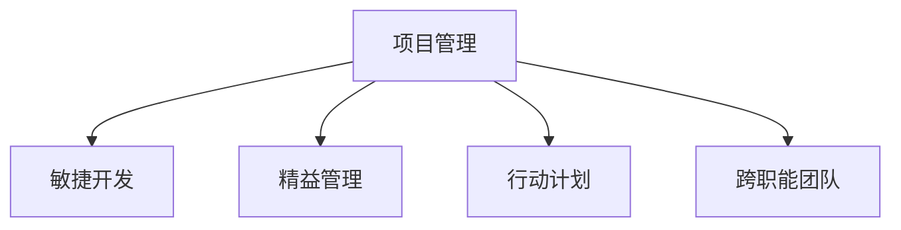

                 

# 行动导向：高效管理的基础

## 1. 背景介绍

### 1.1 问题由来
在当今高速发展的技术和管理环境中，无论是软件工程还是企业运营，都面临着复杂的任务和不确定性。如何高效管理项目，实现团队的协作和目标的达成，成为了每个组织都必须解决的重要课题。在这方面，行动导向（Action-Oriented）的管理方法显得尤为重要。

### 1.2 问题核心关键点
行动导向的管理方法强调将战略目标转化为具体的行动计划，强调过程管理和实时调整，注重通过实际行动来驱动项目进展和团队绩效。这种管理方法的核心在于识别和分解任务，制定明确的时间表和责任分配，持续监控进度和质量，确保项目按时、按质、按预算完成。

## 2. 核心概念与联系

### 2.1 核心概念概述

为了更好地理解行动导向的管理方法，本节将介绍几个密切相关的核心概念：

- **项目管理（Project Management）**：通过规划、执行、监控和收尾等过程，确保项目目标的实现。项目管理包括任务分解、时间管理、成本控制、质量管理等多个方面。
- **敏捷开发（Agile Development）**：一种迭代、增量和自组织的开发方法，强调通过频繁的交付和反馈，快速响应变化。敏捷开发包括Scrum、Kanban、XP等多种实践方法。
- **精益管理（Lean Management）**：源于丰田汽车的生产管理理念，通过消除浪费、持续改进，提升效率和质量。精益管理包括5S、看板、流程改进等实践方法。
- **行动计划（Action Plan）**：明确的目标、具体的任务和行动步骤，确保项目的每个阶段都有清晰的方向和操作指南。行动计划强调实施和跟进，确保任务按时完成。
- **跨职能团队（Cross-Functional Team）**：由不同职能背景的成员组成的团队，以协作的方式共同完成项目任务。跨职能团队能够带来多样化的视角和知识，提升团队的创新力和执行力。

这些核心概念之间的逻辑关系可以通过以下Mermaid流程图来展示：



这个流程图展示了一些核心概念以及它们之间的相互关系：

1. 项目管理是整体框架，包含敏捷开发、精益管理和行动计划等多个子过程。
2. 敏捷开发和精益管理通过持续改进和快速反馈，提升项目管理的效果。
3. 行动计划是项目管理的重要组成部分，通过具体的行动步骤，确保任务按时完成。
4. 跨职能团队是项目成功的关键，不同职能背景的成员能够提供多角度的思考和协作。

## 3. 核心算法原理 & 具体操作步骤

### 3.1 算法原理概述

行动导向的管理方法本质上是通过一系列的策略和技术，将大目标分解为具体的行动计划，并持续跟踪和调整这些计划的执行情况，从而实现项目目标。其核心思想是：

1. **目标分解**：将大目标分解为一系列小目标和具体任务。
2. **行动规划**：制定详细的行动计划，明确每个任务的执行步骤和时间表。
3. **实时监控**：持续监控任务执行情况，及时发现和解决问题。
4. **动态调整**：根据实际情况，动态调整行动计划，确保项目按时完成。

这种管理方法强调通过具体、可执行的行动计划，引导团队高效地完成任务，实现项目目标。

### 3.2 算法步骤详解

基于行动导向的管理方法，以下是一个典型的项目管理流程：

**Step 1: 项目启动与规划**
- 明确项目目标和关键成功因素。
- 制定项目时间表、资源分配和预算计划。
- 组建跨职能团队，分配任务和责任。

**Step 2: 任务分解与分配**
- 将大目标分解为具体的任务和子任务。
- 确定每个任务的关键依赖关系。
- 根据任务的复杂度，分配给相应的团队成员或子团队。

**Step 3: 行动规划与执行**
- 制定详细的行动计划，包括每个任务的具体步骤、时间表和质量标准。
- 实施行动计划，定期检查进展和完成情况。
- 根据检查结果，进行必要的调整和优化。

**Step 4: 监控与反馈**
- 持续监控任务执行情况，记录进展和问题。
- 定期召开会议，讨论进展、问题和解决方案。
- 根据实际情况，调整行动计划和时间表。

**Step 5: 项目收尾与总结**
- 完成所有任务和子任务，进行项目总结和验收。
- 收集反馈，总结经验和教训。
- 更新项目管理流程，为未来的项目提供参考。

### 3.3 算法优缺点

行动导向的管理方法具有以下优点：

1. **明确的目标导向**：通过明确的目标和具体的任务，使得每个团队成员都有清晰的方向和任务。
2. **高效的任务执行**：通过详细的行动计划和实时监控，确保每个任务按时、按质完成。
3. **持续的改进优化**：通过不断反馈和调整，提升项目的整体执行效果。
4. **灵活的适应性**：能够快速响应变化，调整行动计划，确保项目顺利进行。

同时，这种管理方法也存在一定的局限性：

1. **复杂度较高**：需要详细分解任务和制定行动计划，初期准备成本较高。
2. **依赖团队协作**：需要高效的跨职能团队合作，如果团队沟通不畅，效果可能大打折扣。
3. **过程繁琐**：需要持续监控和调整，过程较为繁琐，可能会增加管理成本。
4. **风险管理不足**：如果未能及时发现和解决问题，可能导致项目延期或质量问题。

尽管存在这些局限性，但行动导向的管理方法仍是大规模项目管理的有效工具，尤其适用于复杂、高风险的项目。

### 3.4 算法应用领域

行动导向的管理方法在多个领域都有广泛的应用，例如：

- **软件开发**：敏捷开发方法本身就是一种行动导向的管理方法，通过快速迭代和持续反馈，实现软件的快速交付和优化。
- **产品管理**：通过敏捷方法和精益管理实践，确保产品开发和市场推广的顺利进行。
- **运营管理**：通过精益管理和持续改进，提升生产效率和服务质量。
- **项目管理**：通过详细的项目规划和行动计划，确保项目按时、按预算完成。

除了这些经典领域，行动导向的管理方法还在各种规模的团队协作和项目管理中发挥重要作用。

## 4. 数学模型和公式 & 详细讲解 & 举例说明

### 4.1 数学模型构建

在数学上，行动导向的管理方法可以通过以下模型来描述：

设项目总目标为 $G$，分解为 $N$ 个子目标 $G_1, G_2, \ldots, G_N$。每个子目标 $G_i$ 又可分解为 $M_i$ 个具体任务 $T_{i1}, T_{i2}, \ldots, T_{iM_i}$。每个任务 $T_{ij}$ 在时间 $t_{ij}$ 完成，且具有质量 $Q_{ij}$。

目标函数为：

$$
\max \sum_{i=1}^N \sum_{j=1}^{M_i} Q_{ij}
$$

约束条件为：

$$
\begin{cases}
\sum_{j=1}^{M_i} t_{ij} \leq D_i, & \forall i \in \{1, 2, \ldots, N\} \\
Q_{ij} \geq 0, & \forall i \in \{1, 2, \ldots, N\}, j \in \{1, 2, \ldots, M_i\}
\end{cases}
$$

其中 $D_i$ 为子目标 $G_i$ 的截止日期。

### 4.2 公式推导过程

在求解上述优化问题时，可以使用线性规划算法。具体步骤如下：

1. **构建线性规划模型**：将目标函数和约束条件转化为标准形式。
2. **求解线性规划问题**：使用单纯形法、内点法等算法求解最优解。
3. **生成行动计划**：根据求解结果，生成具体的任务执行计划和时间表。

### 4.3 案例分析与讲解

假设某软件开发项目的目标是开发一款新的移动应用，时间为6个月。项目可以分解为以下子目标：

1. 需求分析：2个月
2. 设计：1个月
3. 开发：2个月
4. 测试：1个月
5. 发布：1个月

每个子目标进一步分解为多个任务，例如：

- 需求分析：市场调研、用户访谈、需求整理
- 设计：UI/UX设计、架构设计、数据库设计
- 开发：前端开发、后端开发、集成测试
- 测试：单元测试、集成测试、性能测试
- 发布：部署、配置、上线

假设每个任务的完成时间、质量要求已知，可以使用线性规划求解最优执行计划。例如，可以将每个任务分配给团队成员，优化资源配置和时间安排。

## 5. 项目实践：代码实例和详细解释说明

### 5.1 开发环境搭建

在进行项目管理实践前，我们需要准备好开发环境。以下是使用Python进行开发的环境配置流程：

1. 安装Anaconda：从官网下载并安装Anaconda，用于创建独立的Python环境。

2. 创建并激活虚拟环境：
```bash
conda create -n project-env python=3.8 
conda activate project-env
```

3. 安装相关工具包：
```bash
pip install pandas numpy matplotlib jupyter notebook pyproj pydantic
```

完成上述步骤后，即可在`project-env`环境中开始项目管理实践。

### 5.2 源代码详细实现

这里以一个简单的项目管理为例，演示如何使用Python进行任务分解和执行计划生成。

```python
from pyproj import Project
from pandas import DataFrame

# 任务列表
tasks = {
    'G1': {
        'T1': {'time': 2, 'quality': 1},
        'T2': {'time': 1, 'quality': 1},
        'T3': {'time': 1, 'quality': 1}
    },
    'G2': {
        'T4': {'time': 2, 'quality': 1},
        'T5': {'time': 1, 'quality': 1},
        'T6': {'time': 1, 'quality': 1}
    },
    'G3': {
        'T7': {'time': 1, 'quality': 1},
        'T8': {'time': 1, 'quality': 1},
        'T9': {'time': 1, 'quality': 1}
    }
}

# 创建项目计划
project_plan = Project()
project_plan.add_task('G1', start_date='2022-01-01')
project_plan.add_task('G2', start_date='2022-02-01')
project_plan.add_task('G3', start_date='2022-04-01')

# 添加子任务和资源
for g in project_plan.tasks:
    for t in tasks[g]:
        project_plan.add_subtask(t, parent=g, start_date=f'2022-{g[0]}-{t["time"]}', end_date=f'2022-{g[0]}-{t["time"]}', resource='team1')
        project_plan.add_resource('team1', resource_name='human')

# 生成项目执行计划
project_plan.generate_execution_plan()

# 输出项目计划
print(project_plan.to_dataframe())
```

在上述代码中，我们定义了三个子目标和相应的任务，使用`pyproj`库创建了一个简单的项目计划，并添加了子任务和资源。最后使用`generate_execution_plan`方法生成项目的执行计划，并输出为DataFrame格式。

### 5.3 代码解读与分析

让我们再详细解读一下关键代码的实现细节：

**PyProj库**：
- 使用`pyproj`库创建项目管理计划。
- `add_task`方法用于添加子目标和子任务。
- `add_subtask`方法用于添加具体的执行任务，并设置开始和结束时间。
- `add_resource`方法用于添加项目资源。
- `generate_execution_plan`方法用于生成项目执行计划。

**任务列表**：
- 定义了三个子目标，每个子目标包含多个具体任务。
- 每个任务有完成时间和质量要求。

**资源管理**：
- 使用`add_resource`方法添加资源，这里我们假设每个子目标都有相同的资源需求。

**执行计划生成**：
- 使用`generate_execution_plan`方法生成项目执行计划。
- 输出结果为DataFrame格式，方便后续分析。

可以看到，通过上述代码，我们实现了一个简单的项目管理系统的开发，通过任务分解和资源分配，生成了项目的执行计划。这种基于Python的项目管理方法，可以灵活处理各种项目需求，生成详细的执行计划，是行动导向管理方法的良好实践。

当然，工业级的系统实现还需考虑更多因素，如超时时间、任务依赖、资源平衡等，但核心的项目管理流程基本与此类似。

## 6. 实际应用场景

### 6.1 软件开发项目

在软件开发项目中，行动导向的管理方法尤为适用。通过敏捷开发、Scrum等实践方法，项目团队可以高效地进行迭代开发，快速响应需求变化。

例如，某个公司决定开发一款新的SaaS产品，项目可以分解为以下子目标：

1. 产品需求分析：1个月
2. 设计：2个月
3. 开发：5个月
4. 测试：2个月
5. 部署：1个月

每个子目标又可以进一步分解为多个具体的任务，例如：

- 需求分析：市场调研、用户访谈、需求整理
- 设计：UI/UX设计、架构设计、数据库设计
- 开发：前端开发、后端开发、集成测试
- 测试：单元测试、集成测试、性能测试
- 部署：部署、配置、上线

通过使用行动导向的管理方法，项目团队可以详细规划每个任务，并实时监控执行情况。例如，可以使用Jira等项目管理工具，记录每个任务的进展和问题，并根据实际情况进行调整。

### 6.2 产品管理项目

在产品管理项目中，行动导向的方法同样重要。通过敏捷方法和精益管理实践，产品团队可以高效地进行市场调研、产品设计和推广。

例如，某个公司决定推出一款新的智能家居产品，项目可以分解为以下子目标：

1. 市场调研：2个月
2. 产品设计：3个月
3. 原型开发：3个月
4. 用户测试：1个月
5. 市场推广：2个月

每个子目标又可以进一步分解为多个具体的任务，例如：

- 市场调研：竞争对手分析、市场趋势研究、用户需求调查
- 产品设计：产品原型设计、功能需求定义、交互设计
- 原型开发：UI设计、前端开发、后端开发
- 用户测试：用户访谈、可用性测试、数据分析
- 市场推广：渠道分析、广告投放、市场活动

通过使用行动导向的管理方法，产品团队可以详细规划每个任务，并实时监控执行情况。例如，可以使用Trello等项目管理工具，记录每个任务的进展和问题，并根据实际情况进行调整。

### 6.3 运营管理项目

在运营管理项目中，行动导向的方法同样重要。通过精益管理和持续改进实践，运营团队可以高效地进行流程优化和质量控制。

例如，某个公司决定优化其供应链管理流程，项目可以分解为以下子目标：

1. 流程调研：2个月
2. 流程设计：3个月
3. 流程实施：4个月
4. 流程测试：1个月
5. 流程优化：2个月

每个子目标又可以进一步分解为多个具体的任务，例如：

- 流程调研：流程调研、数据收集、问题分析
- 流程设计：流程定义、流程图绘制、性能指标设计
- 流程实施：流程培训、工具配置、数据导入
- 流程测试：测试计划制定、测试执行、问题反馈
- 流程优化：优化策略制定、方案实施、效果评估

通过使用行动导向的管理方法，运营团队可以详细规划每个任务，并实时监控执行情况。例如，可以使用Asana等项目管理工具，记录每个任务的进展和问题，并根据实际情况进行调整。

## 7. 工具和资源推荐

### 7.1 学习资源推荐

为了帮助开发者系统掌握行动导向的管理方法，这里推荐一些优质的学习资源：

1. 《敏捷项目管理》系列书籍：由敏捷项目管理专家撰写，深入浅出地介绍了敏捷开发、Scrum、Kanban等实践方法。

2. 《精益管理之道》：由精益管理专家撰写，全面介绍了精益管理的基本原则和实践方法，包括5S、看板、流程改进等。

3. 《项目管理实践》：由项目管理专家撰写，介绍了项目管理的各个环节，包括需求分析、任务分解、进度监控等。

4. Coursera《项目管理》课程：由美国宾夕法尼亚大学开设的项目管理课程，涵盖项目管理的基本概念和方法。

5. edX《敏捷开发》课程：由麻省理工学院开设的敏捷开发课程，讲解敏捷开发的理念和实践方法。

通过对这些资源的学习实践，相信你一定能够快速掌握行动导向的管理方法，并用于解决实际的项目管理问题。

### 7.2 开发工具推荐

高效的开发离不开优秀的工具支持。以下是几款用于项目管理开发的常用工具：

1. Jira：基于敏捷开发的方法，提供任务分解、进度跟踪和问题管理等功能，适合大团队协同工作。

2. Asana：简单易用的项目管理工具，支持任务分配、进度跟踪和团队协作，适合中小型团队使用。

3. Trello：基于看板管理的方法，提供任务卡片、列表和看板，适合视觉化的任务管理。

4. Miro：在线协作工具，支持实时编辑和讨论，适合远程团队的协同工作。

5. Slack：即时通讯工具，提供团队协作和任务分配的功能，适合快速的信息传递。

合理利用这些工具，可以显著提升项目管理任务的开发效率，加快创新迭代的步伐。

### 7.3 相关论文推荐

行动导向的管理方法源于学界的持续研究。以下是几篇奠基性的相关论文，推荐阅读：

1. "The Agile Manifesto"：介绍了敏捷开发的基本理念和实践方法，是敏捷开发的奠基性文档。

2. "The Lean Startup"：由精益管理专家Eric Ries撰写，介绍了精益管理的核心理念和实践方法。

3. "Project Management Body of Knowledge (PMBOK)"：项目管理领域的权威指南，涵盖项目管理的基本原则和方法。

4. "The Scrum Guide"：由Scrum.org发布，介绍了Scrum的基本规则和实践方法。

5. "Lean Change"：由精益管理专家Aaron Dignan撰写，介绍了如何通过精益方法应对组织变革。

这些论文代表了大规模项目管理的发展脉络。通过学习这些前沿成果，可以帮助研究者把握学科前进方向，激发更多的创新灵感。

## 8. 总结：未来发展趋势与挑战

### 8.1 总结

本文对行动导向的管理方法进行了全面系统的介绍。首先阐述了行动导向管理的背景和核心关键点，明确了其在大规模项目管理中的重要价值。其次，从原理到实践，详细讲解了行动导向的管理方法，给出了项目管理任务开发的完整代码实例。同时，本文还广泛探讨了行动导向方法在软件开发、产品管理、运营管理等多个领域的应用前景，展示了行动导向管理的广泛适用性。最后，本文精选了行动导向管理的各类学习资源，力求为读者提供全方位的技术指引。

通过本文的系统梳理，可以看到，行动导向的管理方法正在成为大规模项目管理的有效工具，极大地提升了大规模团队协作的效率和项目执行效果。未来，伴随行动导向方法和其他项目管理技术的不断演进，项目管理必将在更广阔的应用领域大放异彩。

### 8.2 未来发展趋势

展望未来，行动导向的管理方法将呈现以下几个发展趋势：

1. **更加智能化**：通过引入人工智能和大数据分析，提升项目管理的智能化水平，例如使用机器学习进行任务预测和优化。

2. **更高效的任务管理**：通过优化任务分解和资源配置，提升项目管理的效率和质量，例如使用AI算法进行任务优先级排序。

3. **更加灵活的调整机制**：通过实时监控和动态调整，提升项目管理的灵活性和应变能力，例如使用自动化工具进行任务重排和进度跟踪。

4. **更加人性化的管理**：通过引入人性化设计和管理理念，提升团队的工作满意度和合作效果，例如使用心理学家设计的激励机制和团队协作工具。

5. **更加跨领域的融合**：通过与其他管理方法（如质量管理、风险管理）的融合，提升项目管理的多维度和全面性，例如使用质量工具进行项目管理质量控制。

以上趋势凸显了行动导向管理方法的广阔前景。这些方向的探索发展，必将进一步提升项目管理的执行效果，为组织带来更大的价值。

### 8.3 面临的挑战

尽管行动导向的管理方法已经取得了瞩目成就，但在迈向更加智能化、普适化应用的过程中，它仍面临着诸多挑战：

1. **复杂度增加**：随着项目规模的扩大和复杂度的提升，行动导向方法需要更精细的任务分解和资源配置。如何简化管理流程，降低管理成本，将是重要课题。

2. **数据依赖**：行动导向方法需要大量的数据支持，如何获取和处理这些数据，保证数据的准确性和及时性，也将是一个挑战。

3. **团队协作**：行动导向方法依赖高效的团队协作，如何打破跨职能团队之间的壁垒，提升团队合作效率，还需要更多的管理策略和技术手段。

4. **技术支持**：行动导向方法需要现代化的工具和技术支持，如何选择合适的工具，实现数据和任务的高效管理，也将是一个重要问题。

5. **文化适配**：行动导向方法需要适应不同的组织文化和团队氛围，如何根据实际情况调整管理方法，保持管理效果，也需要更多的实践经验。

6. **风险管理**：行动导向方法依赖全面的风险管理，如何识别和应对项目风险，保证项目顺利进行，也将是一个重要的挑战。

只有不断解决这些问题，才能使行动导向管理方法在大规模项目中发挥更大的作用。

### 8.4 研究展望

面对行动导向管理方法所面临的种种挑战，未来的研究需要在以下几个方面寻求新的突破：

1. **技术驱动的智能管理**：引入人工智能和大数据分析技术，提升项目管理的数据分析和智能化水平。

2. **跨领域的融合**：与其他管理方法（如质量管理、风险管理）的深度融合，提升项目管理的全面性和多维度管理能力。

3. **任务管理的自动化**：使用自动化工具进行任务预测、优先级排序和进度跟踪，提升项目管理的效率和灵活性。

4. **人性化管理设计**：引入心理学和管理学知识，提升团队的工作满意度和合作效果。

5. **跨组织协作**：研究如何跨组织协作，提升大团队的协同效应和管理效率。

6. **模型与实践结合**：结合管理模型和实践经验，不断优化和改进行动导向管理方法。

这些研究方向的探索，必将引领行动导向管理方法走向更高的台阶，为组织带来更大的价值。面向未来，行动导向管理方法需要与其他管理方法和技术进行更深入的融合，共同推动项目管理技术的进步。只有勇于创新、敢于突破，才能不断拓展项目管理方法的边界，让项目管理技术更好地服务于组织的目标和需求。

## 9. 附录：常见问题与解答

**Q1：行动导向的管理方法是否适用于所有类型的项目？**

A: 行动导向的管理方法适用于大多数类型的大规模项目，特别是那些复杂、高风险的项目。然而，对于一些简单、低风险的项目，行动导向的方法可能显得繁琐和不必要。

**Q2：如何选择合适的任务分解粒度？**

A: 任务分解的粒度应该根据项目的复杂度和团队的工作方式来确定。一般建议将任务分解为1-3天可完成的子任务，既能够细化任务，又能够保持团队的灵活性。

**Q3：行动导向的管理方法是否适合快速变化的项目？**

A: 行动导向的管理方法通过快速迭代和持续反馈，能够适应快速变化的项目需求。然而，在变化极快的项目中，可能需要更灵活的调整机制和更高的敏捷性，例如通过极限编程（XP）等方法。

**Q4：如何处理项目中的意外情况？**

A: 行动导向的管理方法强调实时监控和动态调整，因此可以及时处理项目中的意外情况。如果出现意外情况，可以立即调整行动计划，并召开紧急会议进行讨论和决策。

**Q5：如何保持项目的透明度和可追踪性？**

A: 通过使用项目管理工具（如Jira、Asana等），可以保持项目的透明度和可追踪性。这些工具提供了任务分配、进度跟踪、问题管理等功能，帮助团队成员及时了解项目进展和问题。

总之，行动导向的管理方法是一种高效、灵活的项目管理方法，适用于大多数复杂、高风险的项目。通过不断实践和优化，可以进一步提升项目管理的效果和团队协作的效率。

