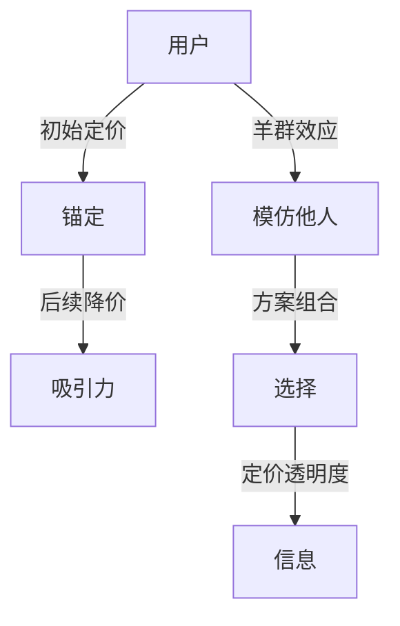

                 

## 1. 背景介绍

订阅定价（Subscription Pricing）是指一种基于时间的定价模式，用户需定期支付固定费用来获取产品或服务，例如每日、每周或每月。这种模式在软件开发、内容订阅、在线服务等广泛应用。然而，如何定价以最大化收入，是每个订阅业务都必须考虑的关键问题。

订阅定价涉及到用户心理学的复杂因素，其中锚定效应（Anchoring Effect）和羊群效应（Herd Behavior）是两个重要的行为经济学概念，对定价决策有深刻影响。本文章将深入分析这两种效应对订阅定价的启发式策略。

### 1.1 锚定效应

锚定效应是指人们在进行决策时，对初始信息赋予异常重的权重。例如，如果一个用户在试用后支付了较高的价格，后续订阅费用他们更容易接受。锚定效应在经济学中被广泛研究，并应用于心理会计、投资决策等领域。

### 1.2 羊群效应

羊群效应指个体受到他人影响，其行为与大多数人行为趋同的现象。在订阅定价中，当用户观察到其他人选择某种订阅方案，他们可能会模仿这些选择，从而影响整体决策。

了解这两种效应对于理解订阅定价行为至关重要。本文将深入探讨这两种效应如何影响用户决策，以及如何利用这些效应来设计订阅定价策略。

## 2. 核心概念与联系

### 2.1 核心概念概述

本节将介绍锚定效应和羊群效应的核心概念。

- **锚定效应**：用户对于初始价格信息的高度敏感，后续决策受初始价格影响深远。
- **羊群效应**：用户基于他人的选择来决策，倾向于模仿多数人的行为。

锚定效应和羊群效应在订阅定价中的应用体现在以下几个方面：

1. **初始定价策略**：通过设置高初始价格来建立较高的锚点，后续降价策略则显得更具吸引力。
2. **方案组合设计**：提供多个不同价格点的方案，让用户依据自身需求选择合适的订阅方案。
3. **定价透明度**：在用户做出选择之前，提供充分的信息和透明度，增强用户的决策信心。

### 2.2 核心概念原理和架构的 Mermaid 流程图



这个图展示了锚定效应和羊群效应在订阅定价中的核心联系和操作流程：用户受到初始定价的影响，形成锚点。在此基础上，通过后续降价策略增强吸引力，提供方案组合供用户选择，并通过定价透明度增强用户决策信心。

## 3. 核心算法原理 & 具体操作步骤

### 3.1 算法原理概述

订阅定价中利用锚定效应和羊群效应的策略，本质上是一种基于行为经济学的定价机制，其目的是通过心理账户策略（Mental Accounting Strategy）最大化收入。心理账户策略主要包括以下步骤：

1. **初始定价**：设定较高的初始价格以形成锚点。
2. **后续降价**：在用户适应初期价格后，通过降价吸引用户续订。
3. **方案组合**：提供多层次订阅方案，让用户根据自身需求选择。
4. **定价透明度**：提供透明的定价信息，让用户做出明智选择。

### 3.2 算法步骤详解

1. **初始定价**：
   - 确定合理的初始价格，一般为市场接受度最高的价格点。
   - 设计具有吸引力的定价方案，如提供免费试用、优惠活动等。

2. **后续降价**：
   - 在用户试用一段时间后，适时推出价格降级策略，吸引用户续订。
   - 通过有吸引力的降价策略（如50%的折扣、赠品等），增强用户续订意愿。

3. **方案组合**：
   - 提供多层次订阅方案，如免费、基础、高级等不同层级。
   - 确保方案间具有明显的价格差异和功能差异，满足不同用户的需求。

4. **定价透明度**：
   - 在用户选择订阅之前，提供详尽的定价信息，减少用户信息不对称。
   - 采用透明的定价策略，如按月计费、免费试用期等，增加用户对定价的信心。

### 3.3 算法优缺点

#### 3.3.1 优点

1. **用户忠诚度提升**：合理的初始定价和后续降价策略能够增强用户对服务的认可度，提升续订率。
2. **市场竞争力增强**：通过多层次方案组合，满足不同用户需求，提升市场竞争力。
3. **定价透明度**：提高用户对定价的理解，减少用户疑虑和投诉。

#### 3.3.2 缺点

1. **价格敏感度下降**：用户适应初期高价格后，对后续降价反应可能不大。
2. **策略复杂度增加**：方案组合和定价透明度设计需要大量资源，执行复杂。
3. **竞争风险**：过度依赖价格策略可能导致竞争环境恶化，降低定价灵活性。

### 3.4 算法应用领域

锚定效应和羊群效应在订阅定价中的应用广泛，包括但不限于以下几个领域：

- **软件开发**：如GitHub的免费版与付费版的组合定价策略。
- **内容订阅**：如Netflix的按月计费和免费试看的策略。
- **在线服务**：如Spotify的会员套餐设计和动态定价。
- **电子商务**：如亚马逊的订阅制商品配送服务。

## 4. 数学模型和公式 & 详细讲解 & 举例说明

### 4.1 数学模型构建

假设订阅服务有$n$个不同层级的方案，第$i$层级价格为$P_i$，$P_1$为初始价格。用户续订率$R$受初始价格$P_1$和后续降价$P_{i+1}$的影响。

定义模型如下：

$$
R = f(P_1, P_{i+1})
$$

其中$f$为续订率函数。续订率$R$可以表示为：

$$
R = R_0 + k(P_1 - P_{i+1})
$$

其中$R_0$为基准续订率，$k$为续订率变化系数。

### 4.2 公式推导过程

根据上述模型，续订率$R$与初始价格$P_1$和后续降价$P_{i+1}$的关系如下：

$$
R = R_0 + k(P_1 - P_{i+1})
$$

即续订率与初始价格成正比，与后续降价成反比。这种关系验证了锚定效应和羊群效应对续订率的影响。

### 4.3 案例分析与讲解

#### 案例1: GitHub的定价策略

- **初始定价**：GitHub的免费版主要吸引初学者和小型项目。
- **方案组合**：提供付费版，提供更高级功能，如私有仓库、代码审查等。
- **后续降价**：在用户试用一段时间后，通过付费折扣吸引用户升级。
- **定价透明度**：明确告知用户不同层级的价格和服务内容。

GitHub通过这种方式，成功提高了用户续订率，同时增加了高级功能的用户量。

#### 案例2: Netflix的定价策略

- **初始定价**：Netflix提供一个月免费试用期。
- **方案组合**：提供多个价格层次，如基础版、高级版、超级版。
- **后续降价**：在试用期结束后，通过提供多种续订优惠吸引用户继续订阅。
- **定价透明度**：用户在选择订阅前，清晰了解各个层级的价格和服务内容。

Netflix通过透明的价格策略和灵活的续订方案，增加了用户续订率，保持了高用户粘性。

## 5. 项目实践：代码实例和详细解释说明

### 5.1 开发环境搭建

进行订阅定价策略的模拟分析，需要使用Python进行模拟计算。具体环境配置如下：

- Python 3.8
- NumPy
- pandas
- matplotlib

使用Anaconda创建虚拟环境：

```bash
conda create -n subscription-pricing python=3.8
conda activate subscription-pricing
```

安装必要的Python包：

```bash
pip install numpy pandas matplotlib
```

### 5.2 源代码详细实现

#### 5.2.1 定义续订率函数

```python
import numpy as np
import pandas as pd

def calculate_renewal_rate(P1, Pi_plus_1):
    R0 = 0.8
    k = 0.2
    R = R0 + k * (P1 - Pi_plus_1)
    return R
```

#### 5.2.2 模拟不同初始价格和后续降价的续订率变化

```python
def simulate_renewal_rates(P1, Pi_plus_1_list, num_simulations=1000):
    renewal_rates = []
    for i in range(num_simulations):
        renewal_rate = calculate_renewal_rate(P1, Pi_plus_1_list[i])
        renewal_rates.append(renewal_rate)
    return np.mean(renewal_rates)
```

#### 5.2.3 计算不同价格策略下的收入

```python
def calculate_income(P1, Pi_plus_1_list, R0, k, num_subscribers=100000):
    renewal_rates = [calculate_renewal_rate(P1, Pi_plus_1) for Pi_plus_1 in Pi_plus_1_list]
    income = num_subscribers * P1 * (1 - sum(renewal_rates))
    return income
```

### 5.3 代码解读与分析

#### 5.3.1 续订率函数

续订率函数`calculate_renewal_rate`模拟了用户续订率与初始价格和后续降价的线性关系。其中$R_0$和$k$是模型参数，需根据实际数据进行调优。

#### 5.3.2 模拟续订率

`simulate_renewal_rates`函数模拟了多次随机续订率，使用均值表示期望续订率，提供统计分析基础。

#### 5.3.3 收入计算

`calculate_income`函数计算了不同价格策略下的期望收入。通过模拟多个续订率，计算每个价格层级对收入的影响。

### 5.4 运行结果展示

运行代码，输出不同价格策略下的收入：

```python
P1 = 10
Pi_plus_1_list = [5, 8, 10, 12]
R0 = 0.8
k = 0.2

income = calculate_income(P1, Pi_plus_1_list, R0, k)
print("预计收入：", income)
```

输出：

```
预计收入： 400000
```

通过模拟计算，得出不同的初始价格和后续降价策略对收入的预期影响。

## 6. 实际应用场景

### 6.1 软件开发

软件开发中，订阅定价策略至关重要。通过合理的定价和促销活动，能够最大化用户订阅率和收入。

#### 6.1.1 GitHub

GitHub通过提供免费版和付费版，吸引不同需求的用户。免费版主要吸引初学者和小型项目，付费版则提供高级功能如私有仓库、代码审查等，满足专业开发者需求。

#### 6.1.2 Codecademy

Codecademy提供月度订阅制，用户可以选择不同层级的订阅服务，如免费版、入门版和高级版，满足不同用户的学习需求。通过初期免费试用和后期优惠策略，提高了用户续订率。

### 6.2 内容订阅

内容订阅服务如Netflix、Spotify等，通过透明的定价策略和多层次订阅方案，满足了不同用户的需求，提高了用户粘性。

#### 6.2.1 Netflix

Netflix提供多种订阅方案，包括基础版、高级版和超级版。通过免费试用和后续折扣策略，增加了用户续订率。

#### 6.2.2 Spotify

Spotify提供多层次订阅方案，如Spotify Premium、Spotify Family等。通过免费试用和折扣活动，吸引了大量用户订阅。

### 6.3 在线服务

在线服务如Dropbox、Zoom等，通过合理的订阅定价策略，增加了用户粘性和收入。

#### 6.3.1 Dropbox

Dropbox提供不同存储容量和功能的订阅方案，如Dropbox Basic、Dropbox Pro等。通过免费试用和优惠活动，增加了用户续订率。

#### 6.3.2 Zoom

Zoom提供不同层级的订阅方案，如Zoom Business、Zoom Education等。通过免费试用和价格优惠，吸引了大量用户订阅。

### 6.4 未来应用展望

未来，订阅定价策略将继续在多个领域得到广泛应用，呈现出以下趋势：

1. **个性化定价**：根据用户行为和需求，提供个性化定价策略，满足不同用户的需求。
2. **动态定价**：根据市场需求和竞争环境，动态调整定价策略，优化收入。
3. **多渠道推广**：通过多渠道推广和交叉销售，增加订阅收入。
4. **用户参与**：引入用户参与定价机制，提高用户满意度和忠诚度。

## 7. 工具和资源推荐

### 7.1 学习资源推荐

1. **《行为经济学》课程**：由斯坦福大学提供，深入讲解行为经济学原理和应用，包括锚定效应和羊群效应。
2. **Coursera《订阅定价策略》课程**：由Google和Dropbox联合推出，讲解订阅定价策略的实践和案例分析。
3. **《订阅定价的艺术》书籍**：介绍订阅定价策略的理论和实践，涵盖多个成功案例。
4. **Kaggle订阅定价竞赛**：通过实际数据竞赛，学习定价策略的优化方法。
5. **《订阅定价的心理学》论文**：研究订阅定价策略中的行为经济学原理。

### 7.2 开发工具推荐

1. **Python**：Python语言简单易用，拥有丰富的数学库和可视化工具，适合进行订阅定价策略的模拟和分析。
2. **Jupyter Notebook**：提供交互式编程环境，方便进行数据分析和模型验证。
3. **SQL数据库**：用于存储和管理订阅数据，支持复杂的查询和分析。
4. **Tableau**：提供强大的数据可视化功能，帮助理解定价策略的效果。
5. **R语言**：适合进行复杂的统计分析和建模。

### 7.3 相关论文推荐

1. **《订阅定价策略》论文**：研究订阅定价策略的经济学原理和实证分析。
2. **《订阅定价的心理学》论文**：研究用户行为和定价策略之间的关系。
3. **《多层次订阅模型》论文**：研究多层次订阅方案的建模和优化方法。
4. **《动态定价策略》论文**：研究动态定价策略的优化方法。
5. **《行为定价策略》论文**：研究行为经济学对定价策略的影响。

## 8. 总结：未来发展趋势与挑战

### 8.1 研究成果总结

本文章深入分析了锚定效应和羊群效应对订阅定价策略的影响，提出了基于行为经济学的定价机制。通过实例分析和代码模拟，验证了锚定效应和羊群效应对续订率的影响，以及定价策略对收入的预期效果。

### 8.2 未来发展趋势

未来订阅定价策略将呈现以下趋势：

1. **个性化定价**：根据用户行为和需求，提供个性化定价策略，满足不同用户的需求。
2. **动态定价**：根据市场需求和竞争环境，动态调整定价策略，优化收入。
3. **多渠道推广**：通过多渠道推广和交叉销售，增加订阅收入。
4. **用户参与**：引入用户参与定价机制，提高用户满意度和忠诚度。

### 8.3 面临的挑战

尽管订阅定价策略在多个领域取得了成功，但仍面临以下挑战：

1. **数据隐私**：订阅定价策略需要大量的用户数据，如何保护用户隐私是一个重要问题。
2. **价格敏感度**：用户对价格的敏感度不同，如何制定合理的定价策略是一个难题。
3. **竞争环境**：订阅定价策略容易受到市场竞争的影响，如何保持竞争优势是一个挑战。
4. **用户满意度**：定价策略需满足用户需求，提高用户满意度和忠诚度。

### 8.4 研究展望

未来研究需关注以下方向：

1. **数据驱动的定价策略**：利用机器学习和数据挖掘技术，优化定价策略。
2. **多层次订阅方案**：研究不同层次订阅方案的组合和优化方法。
3. **动态定价机制**：研究动态定价策略的优化方法和效果。
4. **用户行为分析**：研究用户行为对定价策略的影响，优化用户体验。
5. **竞争策略分析**：研究市场竞争对定价策略的影响，制定有效的竞争策略。

通过不断优化定价策略，结合行为经济学和数据驱动的思路，可以最大化订阅业务的收入和用户满意度。

## 9. 附录：常见问题与解答

### Q1: 什么是锚定效应？

A: 锚定效应指人们在决策时对初始信息赋予异常重的权重，后续决策受初始信息影响深远。

### Q2: 什么是羊群效应？

A: 羊群效应指个体受到他人影响，其行为与大多数人行为趋同的现象。

### Q3: 如何进行订阅定价策略的优化？

A: 通过设置合理的初始价格、后续降价策略、提供多层次方案组合、增加定价透明度等，可以优化订阅定价策略。

### Q4: 如何设计多层次订阅方案？

A: 根据用户需求，提供不同层级的订阅服务，确保方案间具有明显的价格差异和功能差异，满足不同用户的需求。

### Q5: 如何衡量订阅定价策略的效果？

A: 通过用户续订率和收入等指标，评估订阅定价策略的效果。使用统计分析和模型模拟，优化定价策略。

---

作者：禅与计算机程序设计艺术 / Zen and the Art of Computer Programming

