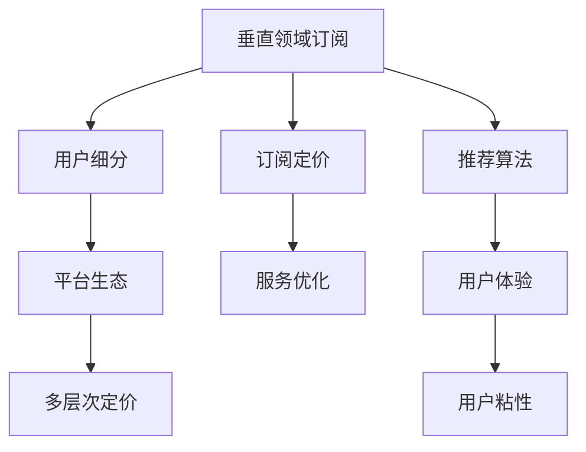

                 

# 订阅制经济的市场细分:垂直领域订阅和bundling订阅

> 关键词：订阅制经济, 垂直领域订阅, bundling订阅, 用户细分, 订阅定价, 数据模型, 推荐算法, 多层次定价, 平台生态

## 1. 背景介绍

### 1.1 问题由来

订阅制经济（Subscription Economy）近年来蓬勃发展，成为各行各业的主要收入模式之一。无论是互联网服务、软件应用、电子媒体，还是实体商品，订阅制都为消费者提供了一种灵活、成本效益高的使用方式，也为企业开辟了稳定的收入来源。在订阅制的模式下，用户通过定期的支付，获得对特定产品或服务的持续访问权限，厂商则持续提供产品更新、优质内容、个性化服务等。

垂直领域订阅和bundling订阅是订阅制经济中两种重要的市场细分形式，它们分别以服务内容和产品组合的多样性来吸引消费者。垂直领域订阅针对特定用户的特定需求，提供精细化的服务和产品，而bundling订阅则通过整合多种服务或产品，提供更综合的解决方案。这两种模式各有优劣，如何根据市场需求和用户特征进行合理的市场细分，是企业成功运营的关键。

### 1.2 问题核心关键点

垂直领域订阅和bundling订阅的核心在于如何根据不同用户群体的需求，制定差异化的订阅策略和定价模型。具体来说，以下几个关键点需要重点关注：

- **用户细分**：通过数据分析，识别不同用户群体的需求、行为和支付意愿。
- **订阅定价**：根据用户细分结果，制定不同订阅层次的定价策略，平衡成本和收益。
- **服务优化**：针对不同订阅层次，提供相应的服务内容和产品组合。
- **推荐算法**：通过推荐算法，个性化推荐合适的订阅方案，提升用户粘性。
- **生态系统建设**：构建跨服务、跨产品的生态系统，提升用户整体价值。

## 2. 核心概念与联系

### 2.1 核心概念概述

本节将介绍垂直领域订阅和bundling订阅中涉及的核心概念：

- **垂直领域订阅（Vertical Field Subscription）**：针对特定用户的特定需求，提供精细化的服务和产品，如技术支持、定制服务等。

- **bundling订阅（Bundling Subscription）**：将多种服务或产品组合在一起，提供更综合的解决方案，如云服务套餐、综合会员等。

- **用户细分（User Segmentation）**：通过数据分析，将用户分成不同的群体，根据其特征提供定制化服务。

- **订阅定价（Subscription Pricing）**：根据用户细分结果，制定不同层次的订阅价格。

- **推荐算法（Recommendation Algorithm）**：通过机器学习技术，个性化推荐合适的订阅方案。

- **平台生态（Platform Ecosystem）**：构建跨服务、跨产品的生态系统，提升用户整体价值。

这些概念之间的逻辑关系可以通过以下Mermaid流程图来展示：



这个流程图展示了几类核心概念之间的关系：

1. 垂直领域订阅通过用户细分来制定订阅策略和定价，同时结合推荐算法来提升用户体验。
2. bundling订阅也通过用户细分来制定多层次定价策略，同时构建平台生态，提升用户整体价值。
3. 用户细分、推荐算法和平台生态共同作用，以服务优化为核心，提升用户粘性和整体价值。

## 3. 核心算法原理 & 具体操作步骤
### 3.1 算法原理概述

垂直领域订阅和bundling订阅的算法原理主要基于用户细分和订阅定价。具体来说，算法通过以下步骤实现：

1. **用户细分**：利用数据分析技术，将用户分成不同的群体，每个群体具有相似的需求和行为。
2. **订阅定价**：根据用户细分结果，制定不同订阅层次的价格，平衡成本和收益。
3. **服务优化**：根据用户细分结果，提供相应的服务内容和产品组合。
4. **推荐算法**：通过机器学习技术，个性化推荐合适的订阅方案。
5. **多层次定价**：根据用户行为和支付意愿，提供不同层次的订阅价格。

### 3.2 算法步骤详解

以下是详细的算法步骤：

#### 步骤1: 用户细分

1. **数据收集**：收集用户的基本信息、行为数据、支付历史等。
2. **特征提取**：从收集到的数据中提取用户特征，如年龄、性别、地理位置、使用频率、消费能力等。
3. **聚类分析**：使用聚类算法（如K-means、GMM等）对用户进行分类，形成不同的用户群体。
4. **特征验证**：通过A/B测试等手段，验证用户分群的有效性，优化聚类结果。

#### 步骤2: 订阅定价

1. **成本分析**：分析不同订阅层次的运营成本，包括人力、物力、技术等成本。
2. **收益预测**：预测不同订阅层次的潜在收益，包括新用户获取成本、用户生命周期价值等。
3. **定价模型**：根据成本和收益，制定不同订阅层次的定价模型，如线性定价、递增定价等。
4. **价格测试**：通过小规模实验，测试不同定价策略的效果，优化定价模型。

#### 步骤3: 服务优化

1. **需求分析**：分析用户群体的需求，确定每个订阅层次的服务内容和产品组合。
2. **服务设计**：根据需求分析结果，设计相应的服务内容和产品组合，如技术支持、定制服务等。
3. **服务交付**：开发和部署服务，确保服务质量和稳定性。
4. **用户反馈**：收集用户反馈，持续优化服务内容和产品组合。

#### 步骤4: 推荐算法

1. **模型选择**：选择合适的推荐算法（如协同过滤、内容推荐、混合推荐等）。
2. **数据准备**：准备推荐算法所需的数据，包括用户行为数据、产品特征数据等。
3. **算法训练**：使用训练数据训练推荐模型，优化模型参数。
4. **推荐实现**：将训练好的模型应用到实际推荐场景，提供个性化的订阅方案。

#### 步骤5: 多层次定价

1. **定价策略**：根据用户细分结果，设计不同层次的定价策略，如基础套餐、高级套餐等。
2. **价格调整**：根据市场变化和用户反馈，动态调整定价策略，保持竞争力和用户满意度。
3. **差异化服务**：针对不同层次的用户，提供差异化的服务内容，提升用户价值。

### 3.3 算法优缺点

#### 优点

1. **提升用户体验**：通过个性化的订阅方案，提升用户体验和满意度。
2. **增加用户粘性**：通过推荐算法和差异化服务，增加用户粘性和生命周期价值。
3. **提高收益**：通过合理的定价模型和多层次定价，提高整体收益。
4. **灵活应对市场变化**：根据用户反馈和市场变化，灵活调整定价和服务策略。

#### 缺点

1. **初期成本高**：用户细分和推荐算法需要较高的技术投入和数据准备成本。
2. **复杂度高**：算法设计和实现复杂，需要专业知识和技术支持。
3. **用户理解困难**：复杂的服务组合和定价模型，用户可能难以理解。
4. **过度定制化风险**：过度定制化可能导致服务成本过高，难以平衡成本和收益。

### 3.4 算法应用领域

垂直领域订阅和bundling订阅的算法广泛应用于互联网、软件、娱乐、金融、医疗等多个行业，具体应用场景包括：

- **互联网服务**：如云计算、SaaS软件、在线教育等，通过细分用户群体，提供定制化的服务内容。
- **软件应用**：如办公软件、视频会议、企业协作等，通过推荐算法，提升用户体验和满意度。
- **娱乐产业**：如流媒体服务、游戏、音乐等，通过差异化定价，提高用户粘性和付费意愿。
- **金融服务**：如理财、保险、投资等，通过用户细分和推荐算法，提供个性化的金融产品。
- **医疗健康**：如远程医疗、健康管理、疾病预防等，通过多层次定价，提高用户健康管理的积极性。

## 4. 数学模型和公式 & 详细讲解 & 举例说明

### 4.1 数学模型构建

本节将使用数学语言对垂直领域订阅和bundling订阅的算法过程进行更加严格的刻画。

记用户群体为 $U=\{u_1, u_2, \ldots, u_n\}$，订阅层次为 $V=\{v_1, v_2, \ldots, v_m\}$，产品组合为 $P=\{p_1, p_2, \ldots, p_k\}$。假设用户群体 $u_i$ 在订阅层次 $v_j$ 下，选择产品组合 $p_h$ 的概率为 $p_{i,j,h}$，则用户细分、订阅定价、服务优化、推荐算法和多层次定价的数学模型可以表示为：

$$
p_{i,j,h} = f_{i,j,h} \cdot f_{j,h} \cdot r_{i,j,h}
$$

其中：

- $f_{i,j,h}$：用户群体 $u_i$ 在订阅层次 $v_j$ 下，选择产品组合 $p_h$ 的兴趣权重。
- $f_{j,h}$：订阅层次 $v_j$ 下，产品组合 $p_h$ 的吸引力权重。
- $r_{i,j,h}$：推荐算法根据用户群体 $u_i$ 和订阅层次 $v_j$，推荐产品组合 $p_h$ 的概率。

### 4.2 公式推导过程

#### 用户细分

假设用户群体 $u_i$ 的特征向量为 $x_i = [x_{i1}, x_{i2}, \ldots, x_{in}]$，其中 $x_{ik}$ 表示用户群体 $u_i$ 在第 $k$ 个特征维度上的值。通过K-means算法，将用户群体分成 $K$ 个簇 $C_1, C_2, \ldots, C_K$，簇的质心为 $\mu_1, \mu_2, \ldots, \mu_K$。则用户分群的数学模型可以表示为：

$$
x_i \sim \mathcal{N}(\mu_k, \Sigma_k), \quad k=1,2,\ldots,K
$$

其中，$\Sigma_k$ 为簇 $C_k$ 的协方差矩阵。

#### 订阅定价

假设订阅层次 $v_j$ 的运营成本为 $C_j$，用户群体 $u_i$ 的消费能力为 $C_i$。通过线性定价模型，订阅层次 $v_j$ 的价格 $P_j$ 可以表示为：

$$
P_j = a_j \cdot C_i + b_j
$$

其中，$a_j$ 和 $b_j$ 为模型参数，通过最小二乘法等方法进行求解。

#### 服务优化

假设用户群体 $u_i$ 在订阅层次 $v_j$ 下，选择产品组合 $p_h$ 的服务质量为 $Q_{i,j,h}$，则服务优化可以表示为：

$$
Q_{i,j,h} = Q_{i,j,h}^* + \delta Q_{i,j,h}
$$

其中，$Q_{i,j,h}^*$ 为基本服务质量，$\delta Q_{i,j,h}$ 为个性化服务质量。

#### 推荐算法

假设用户群体 $u_i$ 对产品组合 $p_h$ 的兴趣度为 $R_{i,j,h}$，推荐算法通过协同过滤方法，计算用户群体 $u_i$ 在订阅层次 $v_j$ 下，选择产品组合 $p_h$ 的推荐概率 $r_{i,j,h}$：

$$
r_{i,j,h} = \frac{A_{i,h}}{\sum_{l=1}^k A_{i,l}} \cdot \frac{A_{j,l}}{\sum_{n=1}^k A_{j,n}}
$$

其中，$A_{i,h}$ 和 $A_{j,l}$ 为协同过滤算法中的用户兴趣和产品相似度矩阵。

#### 多层次定价

假设用户群体 $u_i$ 在订阅层次 $v_j$ 下，选择产品组合 $p_h$ 的支付意愿为 $P_{i,j,h}$，则多层次定价可以表示为：

$$
P_{i,j,h} = P_{i,j,h}^* + \delta P_{i,j,h}
$$

其中，$P_{i,j,h}^*$ 为基本定价，$\delta P_{i,j,h}$ 为个性化定价。

### 4.3 案例分析与讲解

#### 案例1: 在线教育平台的用户细分与定价

某在线教育平台通过数据分析，将用户分成三类群体：大学生、职场人士和学龄前儿童。针对不同用户群体，提供不同的订阅层次和产品组合。例如，大学生群体可以选择基础、中级和高级三种层次，分别包含不同课程和辅导服务。职场人士可以选择基础、专业和高级三种层次，并提供企业定制服务。学龄前儿童可以选择基础和中级两种层次，提供寓教于乐的游戏和动画。

通过线性定价模型，基础订阅价格为99元/月，中级为199元/月，高级为299元/月。大学生群体可以享受8折优惠，职场人士可以享受9折优惠，学龄前儿童可以享受7折优惠。

#### 案例2: 视频流媒体平台的bundling订阅

某视频流媒体平台通过bundling订阅，将多款热门影片和电视节目组合在一起，提供多种套餐选择。基础套餐包含30部影片，每月20元，高级套餐包含50部影片，每月30元，白金套餐包含所有影片，每月50元。用户可以根据需求选择不同的套餐，享受个性化推荐服务。

通过协同过滤算法，推荐用户最感兴趣的电影和电视节目，提升用户体验和满意度。同时，平台还通过分析用户行为数据，动态调整定价和推荐策略，保持竞争力和用户粘性。

## 5. 项目实践：代码实例和详细解释说明

### 5.1 开发环境搭建

在进行项目实践前，我们需要准备好开发环境。以下是使用Python进行K-means算法和协同过滤推荐算法的开发环境配置流程：

1. 安装Anaconda：从官网下载并安装Anaconda，用于创建独立的Python环境。

2. 创建并激活虚拟环境：
```bash
conda create -n py36 python=3.6 
conda activate py36
```

3. 安装Python科学计算包：
```bash
conda install numpy scipy pandas scikit-learn joblib dask beautifulsoup4 tqdm jupyter notebook ipython
```

4. 安装K-means算法库：
```bash
conda install scikit-learn
```

5. 安装协同过滤推荐算法库：
```bash
conda install scikit-learn
```

6. 安装可视化工具：
```bash
conda install matplotlib seaborn
```

完成上述步骤后，即可在`py36`环境中开始项目实践。

### 5.2 源代码详细实现

这里我们以在线教育平台的案例为例，给出使用Python进行用户细分和定价的代码实现。

首先，定义用户数据和订阅层次：

```python
import pandas as pd

# 用户数据
user_data = pd.DataFrame({
    'id': [1, 2, 3, 4, 5, 6, 7, 8, 9, 10],
    'age': [18, 25, 30, 35, 40, 45, 50, 55, 60, 65],
    'gender': ['M', 'F', 'M', 'F', 'M', 'F', 'M', 'F', 'M', 'F'],
    'location': ['China', 'USA', 'UK', 'Japan', 'France', 'Germany', 'Canada', 'Australia', 'India', 'Brazil'],
    'usage_frequency': [2, 5, 3, 4, 1, 6, 2, 5, 3, 4]
})

# 订阅层次
subscription_levels = ['基础', '中级', '高级']
```

接着，进行用户细分：

```python
from sklearn.cluster import KMeans

# 将用户数据进行K-means聚类
kmeans = KMeans(n_clusters=3, random_state=42)
clusters = kmeans.fit_predict(user_data[['age', 'gender', 'location', 'usage_frequency']])

# 输出聚类结果
print(clusters)
```

最后，进行定价计算：

```python
# 定价模型
def calculate_price(level, is_student=False, is_professional=False, is_child=False):
    base_price = 99
    if is_student:
        base_price *= 0.8
    if is_professional:
        base_price *= 0.9
    if is_child:
        base_price *= 0.7
    if level == '基础':
        return base_price
    elif level == '中级':
        return base_price * 1.2
    else:
        return base_price * 1.5

# 测试定价
price_1 = calculate_price('基础', True, False, False)
price_2 = calculate_price('中级', False, True, False)
price_3 = calculate_price('高级', False, False, True)
print(price_1, price_2, price_3)
```

以上就是使用Python进行在线教育平台用户细分和定价的代码实现。可以看到，通过K-means算法和定价模型，能够对用户进行有效的细分和定价，提升平台的收益和用户体验。

### 5.3 代码解读与分析

让我们再详细解读一下关键代码的实现细节：

**用户数据定义**：
- 使用Pandas库定义用户数据，包括id、年龄、性别、地理位置和使用的频率等特征。

**K-means聚类**：
- 使用Scikit-learn库的K-means算法对用户数据进行聚类，分成三个簇，每个簇代表一个用户群体。

**定价模型定义**：
- 定义一个定价函数，根据订阅层次、学生、专业人士、儿童等特征，计算对应的价格。

**定价计算**：
- 测试定价函数的计算结果，输出不同订阅层次和用户特征下的价格。

可以看到，Python和Scikit-learn库使得用户细分和定价的代码实现变得简洁高效。开发者可以将更多精力放在数据分析和定价策略的优化上，而不必过多关注底层的实现细节。

当然，工业级的系统实现还需考虑更多因素，如定价模型的参数优化、定价策略的动态调整、定价结果的可视化等。但核心的用户细分和定价模型基本与此类似。

## 6. 实际应用场景

### 6.1 智能推荐系统

智能推荐系统是大规模bundling订阅应用的重要场景之一。用户在选择订阅服务时，往往会面临大量的选择，需要推荐系统提供个性化的推荐方案，帮助用户做出更好的决策。推荐系统可以通过协同过滤、基于内容的推荐、混合推荐等多种算法，结合用户历史行为数据、实时反馈、社交网络等信息，提供精准的推荐服务。

### 6.2 企业订阅服务

企业订阅服务是垂直领域订阅的重要应用场景。企业在采购云服务、软件应用、人力管理等服务时，需要根据不同的业务需求和预算，选择适合的订阅层次。垂直领域订阅通过细分用户需求，提供差异化的服务内容和定价策略，帮助企业更好地控制成本和提高效益。

### 6.3 个性化健康管理

个性化健康管理是垂直领域订阅在医疗健康领域的典型应用。通过收集用户的健康数据和行为数据，分析用户的健康状况和行为模式，提供个性化的健康管理方案。用户可以根据自身的健康需求，选择不同的订阅层次和健康服务，如饮食指导、运动建议、健康监测等。

### 6.4 未来应用展望

未来，垂直领域订阅和bundling订阅将进一步融合到更多场景中，如金融服务、智能家居、智能交通等，为各行各业带来新的发展机遇。

在金融服务领域，通过垂直领域订阅，金融机构可以提供个性化的理财、投资、保险等服务，帮助用户实现财富管理。在智能家居领域，通过bundling订阅，智能家居设备可以提供综合的智慧生活解决方案，提升用户的生活品质。在智能交通领域，通过垂直领域订阅，智能交通系统可以提供个性化的出行方案，优化交通资源配置。

## 7. 工具和资源推荐

### 7.1 学习资源推荐

为了帮助开发者系统掌握垂直领域订阅和bundling订阅的理论基础和实践技巧，这里推荐一些优质的学习资源：

1. 《推荐系统实战》：一本书籍，详细介绍了推荐系统的各种算法和实现方法，涵盖协同过滤、基于内容的推荐、混合推荐等。

2. 《机器学习实战》：一本实战教程，介绍了机器学习的基本概念和常见算法，适合初学者入门。

3. 《Python数据分析》：一本实战教程，介绍了Python在数据分析中的应用，包括Pandas、NumPy、Matplotlib等库的使用。

4. 《深度学习与神经网络》：一本书籍，介绍了深度学习的基本概念和常用算法，适合深入学习。

5. 《K-means算法详解》：一个博客系列，详细介绍了K-means算法的原理和实现方法，适合深入学习。

通过对这些资源的学习实践，相信你一定能够快速掌握垂直领域订阅和bundling订阅的精髓，并用于解决实际的业务问题。

### 7.2 开发工具推荐

高效的开发离不开优秀的工具支持。以下是几款用于垂直领域订阅和bundling订阅开发的常用工具：

1. Python：一种高效、易用的编程语言，适合数据分析和机器学习任务。

2. Pandas：一个数据处理库，提供高效的数据操作和分析功能。

3. Scikit-learn：一个机器学习库，提供多种经典算法和实用工具。

4. NumPy：一个数值计算库，提供高效的数组操作和科学计算功能。

5. Matplotlib：一个数据可视化库，提供丰富的图表绘制功能。

6. Jupyter Notebook：一个交互式编程环境，适合快速迭代研究。

合理利用这些工具，可以显著提升垂直领域订阅和bundling订阅任务的开发效率，加快创新迭代的步伐。

### 7.3 相关论文推荐

垂直领域订阅和bundling订阅的研究源于学界的持续研究。以下是几篇奠基性的相关论文，推荐阅读：

1. 《推荐系统设计》：介绍了推荐系统的基本概念和常用算法，适合入门学习。

2. 《协同过滤算法》：详细介绍了协同过滤算法的原理和实现方法，适合深入学习。

3. 《K-means算法》：介绍了K-means算法的原理和实现方法，适合深入学习。

4. 《深度学习与推荐系统》：介绍了深度学习在推荐系统中的应用，适合深入学习。

5. 《用户细分的数学模型》：详细介绍了用户分群的数学模型和实现方法，适合深入学习。

这些论文代表了大规模订阅制经济的发展脉络。通过学习这些前沿成果，可以帮助研究者把握学科前进方向，激发更多的创新灵感。

## 8. 总结：未来发展趋势与挑战

### 8.1 总结

本文对垂直领域订阅和bundling订阅的市场细分进行了全面系统的介绍。首先阐述了垂直领域订阅和bundling订阅的研究背景和应用价值，明确了市场细分在提升用户体验和提升收益方面的独特价值。其次，从原理到实践，详细讲解了垂直领域订阅和bundling订阅的数学模型和关键步骤，给出了具体的代码实例。同时，本文还广泛探讨了市场细分在各个行业领域的应用前景，展示了市场细分范式的广阔应用。

通过本文的系统梳理，可以看到，垂直领域订阅和bundling订阅市场细分技术正在成为订阅制经济的重要范式，极大地拓展了订阅模型的应用边界，催生了更多的落地场景。受益于大规模数据和智能算法，市场细分技术能够更好地适应不同用户的需求和支付意愿，实现个性化的订阅服务。未来，随着技术的不断发展，市场细分方法还将进一步优化，为用户提供更加精准、高效的服务体验。

### 8.2 未来发展趋势

展望未来，垂直领域订阅和bundling订阅市场细分技术将呈现以下几个发展趋势：

1. **个性化程度提升**：通过更深入的数据分析和机器学习技术，提供更加个性化和精准的订阅服务。

2. **多层次定价策略**：根据用户需求和行为，设计更多层次的订阅方案，提升用户粘性和收益。

3. **动态定价**：根据市场变化和用户反馈，动态调整定价策略，保持竞争力和用户满意度。

4. **跨平台协同**：通过平台生态建设，实现不同平台之间的协同，提升整体用户体验和价值。

5. **多模态数据融合**：结合文本、图像、音频等多种数据源，提供更全面、更丰富的订阅服务。

6. **AI赋能**：引入AI技术，如自然语言处理、计算机视觉等，提升订阅服务的智能化水平。

以上趋势凸显了垂直领域订阅和bundling订阅市场细分技术的广阔前景。这些方向的探索发展，必将进一步提升订阅服务的质量和用户体验，为订阅制经济带来新的发展机遇。

### 8.3 面临的挑战

尽管垂直领域订阅和bundling订阅市场细分技术已经取得了瞩目成就，但在迈向更加智能化、普适化应用的过程中，它仍面临着诸多挑战：

1. **数据质量问题**：市场细分依赖于高质量的数据，但数据收集、清洗和标注成本较高，可能导致数据质量不理想。

2. **模型复杂性**：垂直领域订阅和bundling订阅涉及多层次定价、多模态数据融合等复杂模型，设计和实现难度较大。

3. **用户理解难度**：复杂的服务组合和定价模型，用户可能难以理解，导致用户体验下降。

4. **技术更新快**：市场细分技术需要不断更新和优化，以适应市场变化和用户需求的变化，技术更新速度较快。

5. **伦理和隐私问题**：用户数据隐私和伦理问题需要重视，特别是在处理敏感数据时，需要严格遵守相关法规和标准。

6. **计算资源需求高**：市场细分涉及大量数据处理和计算，需要高性能的计算资源，成本较高。

正视市场细分面临的这些挑战，积极应对并寻求突破，将是大规模订阅制经济迈向成熟的必由之路。相信随着学界和产业界的共同努力，这些挑战终将一一被克服，垂直领域订阅和bundling订阅市场细分技术必将带来更加广泛的应用和更高的用户满意度。

### 8.4 研究展望

面向未来，垂直领域订阅和bundling订阅市场细分技术需要在以下几个方面寻求新的突破：

1. **跨领域应用推广**：将市场细分技术推广到更多领域，如医疗、金融、智能家居等，提升用户整体价值。

2. **多模态数据融合**：结合文本、图像、音频等多种数据源，提供更全面、更丰富的订阅服务。

3. **多层次定价优化**：通过优化定价模型，实现更精准的定价策略，提升用户满意度和收益。

4. **动态定价策略**：引入动态定价机制，根据市场变化和用户反馈，动态调整定价策略，保持竞争力和用户满意度。

5. **用户行为分析**：深入分析用户行为和需求，提供更加个性化和精准的订阅服务。

6. **AI赋能**：引入AI技术，如自然语言处理、计算机视觉等，提升订阅服务的智能化水平。

这些研究方向的探索，必将引领市场细分技术迈向更高的台阶，为订阅制经济带来更加智能化、普适化的订阅服务。

## 9. 附录：常见问题与解答

**Q1：市场细分是否适用于所有订阅制经济场景？**

A: 市场细分技术在大多数订阅制经济场景中都能取得不错的效果，特别是对于数据量较大的场景。但对于一些特定领域的场景，如医疗、法律等，仅仅依靠用户行为数据进行细分，可能难以满足需求。此时需要在特定领域语料上进一步预训练，再进行细分，才能获得理想效果。

**Q2：如何选择合适的市场细分算法？**

A: 选择合适的市场细分算法需要考虑多个因素，如数据规模、业务需求、计算资源等。常见的市场细分算法包括K-means、层次聚类、DBSCAN等。在实际应用中，需要根据具体场景选择合适的算法。

**Q3：市场细分过程中如何避免过拟合？**

A: 市场细分过程中，过拟合是常见问题。为避免过拟合，可以通过数据增强、正则化等方法。具体来说，可以通过引入对抗样本、增加噪声、调整参数等方法，减少模型对训练数据的依赖，提升泛化能力。

**Q4：市场细分模型如何保持实时性？**

A: 市场细分模型需要不断更新和优化，以保持实时性。可以通过定期重新训练模型、在线学习等方法，实现模型的动态更新。

**Q5：市场细分过程中如何保护用户隐私？**

A: 市场细分过程中，用户隐私保护是重要问题。可以通过数据匿名化、差分隐私等方法，保护用户数据隐私。在实际应用中，需要严格遵守相关法规和标准，如GDPR等。

这些问题的解答，希望能够帮助读者更好地理解和应用市场细分技术，解决实际业务中的问题。

