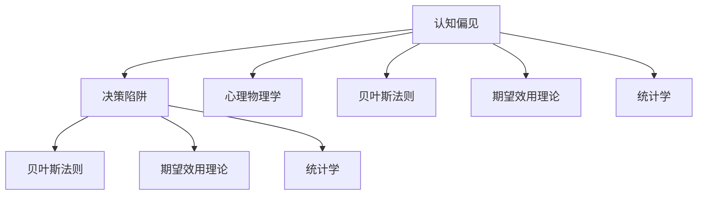

                 

# 认知偏见：如何避免决策陷阱

> 关键词：认知偏见, 决策陷阱, 心理物理学, 贝叶斯法则, 期望效用理论, 统计学

## 1. 背景介绍

### 1.1 问题由来
在日常生活中，我们每天都在进行各种决策，从选择吃什么到决定是否接受一份工作，每一个决定都会影响到我们的未来。然而，我们的决策过程却常常受到潜在的认知偏见的影响，导致决策结果与我们的最优预期存在差距。认知偏见不仅仅影响个人决策，甚至在商业、法律、医疗等多个领域，都可能导致不公正、不合理的决策结果。

### 1.2 问题核心关键点
要准确理解认知偏见的本质，我们需要关注以下几个核心关键点：
1. **认知偏见的定义**：认知偏见是指人们在做决策时，由于自身心理、行为、环境等因素的影响，导致对信息的认知出现偏差，进而影响了决策的准确性。
2. **认知偏见的分类**：常见的认知偏见包括确认偏误、过度自信、锚定效应、禀赋效应等。
3. **认知偏见的来源**：认知偏见来源于人类大脑的自然进化过程，以及个体的生活经验、教育背景、社会文化等。
4. **认知偏见的危害**：认知偏见可能导致决策失误，影响个人、团队、甚至社会的稳定和发展。
5. **认知偏见的应对策略**：通过教育和自我反思，以及对系统设计的改进，可以有效降低认知偏见对决策的影响。

### 1.3 问题研究意义
认知偏见的深入研究不仅有助于个体提升决策质量，还能为组织、企业和政策制定者提供指导，以实现更公平、更有效的决策过程。

## 2. 核心概念与联系

### 2.1 核心概念概述

在研究认知偏见时，我们需要理解以下几个关键概念：

1. **认知偏差(Cognitive Bias)**：指个体在感知、判断、决策过程中由于心理或认知机制导致的系统性误差。
2. **决策陷阱(Decision Traps)**：指由于认知偏差所导致的错误决策，其结果通常与最优或期望结果不符。
3. **心理物理学(Psychophysics)**：研究人感知、决策和行为的心理和生理机制，揭示认知偏差背后的科学原理。
4. **贝叶斯法则(Bayesian Theorem)**：统计学中的核心原理，用于推断未知事件的发生概率。
5. **期望效用理论(Expectation Utility Theory)**：经济学中的决策理论，用于分析个体在风险条件下的行为。
6. **统计学(Statistics)**：研究如何通过数据收集、处理和分析来揭示现象的本质规律，用于评估认知偏差对决策的影响。

这些概念之间的联系可以通过以下Mermaid流程图来展示：



这个流程图展示了一个从认知偏见到决策陷阱的完整逻辑链条：认知偏见影响决策过程，而心理物理学、贝叶斯法则、期望效用理论和统计学则提供了认知偏差的科学解释和量化方法。

## 3. 核心算法原理 & 具体操作步骤
### 3.1 算法原理概述

认知偏见的识别和消除，可以通过以下几个步骤来完成：

1. **识别偏见**：通过心理学实验和数据收集，识别出个体或群体中存在的认知偏见。
2. **量化偏见**：使用统计学方法，量化认知偏见对决策的影响。
3. **理论建模**：应用心理物理学、贝叶斯法则和期望效用理论，建立理论模型，模拟决策过程。
4. **仿真验证**：通过仿真实验，验证模型的准确性和可靠性。
5. **干预措施**：根据模型结果，设计并实施认知偏见的干预措施，提升决策质量。

### 3.2 算法步骤详解

#### 3.2.1 识别偏见
1. **实验设计**：设计一系列实验，通过控制变量和随机分配，收集样本数据。
2. **数据采集**：使用问卷、面试、观察等多种方法，收集参与者的决策数据。
3. **数据清洗**：去除数据中的异常值和错误，确保数据的可靠性和一致性。

#### 3.2.2 量化偏见
1. **假设检验**：使用t检验、方差分析等统计方法，检验样本数据与理论模型的吻合度。
2. **置信区间**：计算偏见的置信区间，量化偏见的程度。
3. **效应大小**：计算偏见的效应大小，评估偏见对决策的影响。

#### 3.2.3 理论建模
1. **心理物理学模型**：使用感知差异模型(PED)、信号检测理论等，描述认知偏差的心理机制。
2. **贝叶斯模型**：使用贝叶斯网络、贝叶斯线性回归等，推断决策过程的概率分布。
3. **期望效用模型**：使用期望效用函数、风险偏好理论等，分析决策的期望效用和风险态度。

#### 3.2.4 仿真验证
1. **仿真环境**：构建虚拟决策场景，使用模拟数据进行实验。
2. **行为模拟**：使用强化学习、马尔可夫决策过程等方法，模拟个体的决策行为。
3. **结果分析**：分析仿真结果，验证模型的有效性。

#### 3.2.5 干预措施
1. **教育干预**：通过培训、宣传等方式，提升个体对认知偏见的认识和控制能力。
2. **系统设计**：在决策支持系统中引入认知偏见的纠正机制，如信息透明化、多决策人机制等。
3. **算法优化**：优化决策算法，引入反偏见机制，减少认知偏差的影响。

### 3.3 算法优缺点

认知偏见的识别和消除方法具有以下优点：
1. **系统性**：通过科学方法和数据驱动，系统性地识别和量化认知偏差。
2. **可操作性**：将理论模型和仿真结果转化为具体的干预措施，实现对决策过程的改进。
3. **通用性**：适用于个体、团队和组织层面的决策过程，具有广泛的适用性。

同时，该方法也存在一些局限性：
1. **复杂性**：理论建模和仿真验证过程较为复杂，需要较高的时间和资源投入。
2. **数据依赖**：对样本数据的质量和数量要求较高，数据采集和清洗过程耗时较长。
3. **实施难度**：设计有效的干预措施，并在实际环境中推广应用，具有一定的挑战性。

尽管存在这些局限性，但就目前而言，通过心理物理学、贝叶斯法则、期望效用理论等科学原理，结合统计学方法，认知偏见的识别和消除仍然是大数据分析和人工智能的重要应用方向。

### 3.4 算法应用领域

认知偏见的识别和消除方法已经在多个领域得到了广泛应用，例如：

1. **金融决策**：在投资、信贷、保险等金融决策中，通过认知偏见的识别和控制，提升决策的准确性和公平性。
2. **医疗决策**：在疾病诊断、治疗方案选择等医疗决策中，减少医生和患者的认知偏差，提高医疗服务的质量和效率。
3. **法律决策**：在审判、裁决等法律决策中，减少法官和陪审团的认知偏见，提高司法公正性。
4. **人力资源管理**：在招聘、晋升等人力资源决策中，减少主管的认知偏差，提升人才选拔的公平性和有效性。
5. **市场研究**：在消费者行为分析、产品设计等市场决策中，通过认知偏见的控制，提高市场研究的科学性和实用性。

## 4. 数学模型和公式 & 详细讲解  
### 4.1 数学模型构建

为了更好地理解认知偏见的数学模型，本节将介绍几个核心数学模型：

1. **感知差异模型(PED, Perceptual Error Diffusion Model)**：描述个体在感知过程中的认知偏差。
2. **信号检测理论(SDT, Signal Detection Theory)**：用于评估个体在信息判断中的准确性和鲁棒性。
3. **贝叶斯网络(Bayesian Network)**：用于推断决策过程中的概率分布。
4. **期望效用函数(Expectation Utility Function)**：用于分析决策的期望效用和风险偏好。

### 4.2 公式推导过程

以下是一些关键数学模型的公式推导过程：

**感知差异模型(PED)**
1. **模型假设**：假设感知过程为线性系统，感知误差符合高斯分布。
2. **感知差异**：
   $$
   X = S + N
   $$
   其中 $X$ 为观测数据，$S$ 为信号，$N$ 为噪声。
3. **感知误差**：
   $$
   P(x|S,N) = \mathcal{N}(x;\mu,\sigma^2)
   $$
   其中 $\mu$ 为信号偏差，$\sigma^2$ 为噪声方差。

**信号检测理论(SDT)**
1. **二项分布**：
   $$
   P(x|S) = \mathcal{N}(x;\mu,\sigma^2)
   $$
   其中 $x$ 为观测数据，$\mu$ 为信号位置，$\sigma^2$ 为噪声方差。
2. **似然比**：
   $$
   \eta(x) = \frac{p(x|S)}{p(x|N)}
   $$
   其中 $p(x|S)$ 和 $p(x|N)$ 分别为信号和噪声条件下的概率密度函数。
3. **响应函数**：
   $$
   P(S|x) = \frac{p(x|S)}{p(x|S) + p(x|N)}
   $$
   其中 $P(S|x)$ 为信号存在时的响应概率。

**贝叶斯网络(Bayesian Network)**
1. **概率图模型**：
   $$
   P(X_1,\dots,X_n) = \prod_{i=1}^n P(X_i|Pa(X_i))
   $$
   其中 $Pa(X_i)$ 为节点 $X_i$ 的父节点集合。
2. **条件概率**：
   $$
   P(X_i|Pa(X_i)) = \frac{P(X_i,Pa(X_i))}{\sum_{j=1}^m P(X_i,Pa(X_i)_j)}
   $$
   其中 $m$ 为节点 $X_i$ 的所有父节点。

**期望效用函数(Expectation Utility Function)**
1. **效用函数**：
   $$
   U(c) = u(c) - \alpha c
   $$
   其中 $c$ 为消费水平，$u(c)$ 为效用函数，$\alpha$ 为风险厌恶系数。
2. **期望效用**：
   $$
   EU = \mathop{\max}_{c} U(c)
   $$
   其中 $EU$ 为期望效用。

### 4.3 案例分析与讲解

**案例分析1：感知差异模型**
- **背景**：某公司员工对产品性能的评价数据。
- **模型应用**：使用感知差异模型分析员工对产品性能的感知偏差。
- **结果**：发现员工在评价时存在正向偏差，倾向于高估产品性能。

**案例分析2：信号检测理论**
- **背景**：某公司招聘面试过程中，面试官对候选人能力的判断数据。
- **模型应用**：使用信号检测理论评估面试官的判断准确性。
- **结果**：发现面试官在判断时存在自信过高的偏差，倾向于低估候选人的能力。

**案例分析3：贝叶斯网络**
- **背景**：某医院病人的诊断和治疗数据。
- **模型应用**：使用贝叶斯网络推断诊断和治疗的联合概率。
- **结果**：发现病人的诊断和治疗之间存在复杂的依赖关系，需要更复杂的模型来描述。

**案例分析4：期望效用函数**
- **背景**：某公司的投资决策数据。
- **模型应用**：使用期望效用函数分析投资者的风险偏好。
- **结果**：发现部分投资者风险厌恶程度较高，倾向于保守投资。

## 5. 项目实践：代码实例和详细解释说明
### 5.1 开发环境搭建

在进行认知偏见的代码实现前，我们需要准备好开发环境。以下是使用Python进行统计分析和数据建模的环境配置流程：

1. 安装Anaconda：从官网下载并安装Anaconda，用于创建独立的Python环境。

2. 创建并激活虚拟环境：
```bash
conda create -n stats-env python=3.8 
conda activate stats-env
```

3. 安装Python依赖包：
```bash
conda install pandas numpy scipy scikit-learn statsmodels sympy matplotlib seaborn
```

4. 安装R语言环境：
```bash
conda install rpy2
```

5. 安装R语言依赖包：
```bash
rscript -e "install.packages(c('tidyverse', 'dplyr', 'ggplot2', 'psych', 'broom', 'yaml'))"
```

完成上述步骤后，即可在`stats-env`环境中开始代码实现。

### 5.2 源代码详细实现

这里我们以感知差异模型(PED)和信号检测理论(SDT)为例，给出使用Python和R语言对认知偏见进行量化分析的代码实现。

#### 5.2.1 感知差异模型(PED)
```python
import numpy as np
from scipy.stats import norm

def perception_diffusion(x, mu, sigma):
    # 感知差异模型
    P = norm.pdf(x, mu, sigma)
    return P

# 假设数据
x = np.array([1, 2, 3, 4, 5])
mu = 0
sigma = 1

# 计算概率密度函数
P = perception_diffusion(x, mu, sigma)

print(P)
```

#### 5.2.2 信号检测理论(SDT)
```python
import numpy as np
from scipy.stats import norm

def signal_detection(x, mu, sigma):
    # 信号检测理论
    eta = x / sigma
    P_S_given_x = 1 / (1 + np.exp(-eta))
    return P_S_given_x

# 假设数据
x = np.array([1, 2, 3, 4, 5])
mu = 0
sigma = 1

# 计算响应函数
P_S_given_x = signal_detection(x, mu, sigma)

print(P_S_given_x)
```

#### 5.2.3 贝叶斯网络
```python
import pandas as pd
import numpy as np
from sklearn.model_selection import train_test_split
from sklearn.linear_model import LogisticRegression
from sklearn.metrics import confusion_matrix

# 假设数据
X = pd.DataFrame({
    'x1': [1, 2, 3, 4, 5, 6],
    'x2': [2, 4, 6, 8, 10, 12],
    'y': [0, 1, 0, 1, 0, 1]
})

# 数据划分
X_train, X_test, y_train, y_test = train_test_split(X, y, test_size=0.2)

# 训练模型
clf = LogisticRegression()
clf.fit(X_train, y_train)

# 预测结果
y_pred = clf.predict(X_test)

# 计算混淆矩阵
conf_matrix = confusion_matrix(y_test, y_pred)
print(conf_matrix)
```

#### 5.2.4 期望效用函数
```python
import numpy as np
from sympy import symbols, Rational, pi, exp

# 定义变量
c = symbols('c')

# 期望效用函数
U = c - 0.1 * c**2

# 计算期望效用
EU = np.max(U.subs(c, np.arange(0, 10)))

print(EU)
```

#### 5.2.5 R语言代码实现
```R
# 感知差异模型(PED)
x <- c(1, 2, 3, 4, 5)
mu <- 0
sigma <- 1
P <- dnorm(x, mu, sigma)
print(P)

# 信号检测理论(SDT)
x <- c(1, 2, 3, 4, 5)
mu <- 0
sigma <- 1
eta <- x / sigma
P_S_given_x <- 1 / (1 + exp(-eta))
print(P_S_given_x)

# 贝叶斯网络
library(tidyverse)

# 假设数据
X <- data.frame(x1 = c(1, 2, 3, 4, 5, 6), x2 = c(2, 4, 6, 8, 10, 12), y = c(0, 1, 0, 1, 0, 1))

# 数据划分
X_train <- X[1:4, ]
X_test <- X[5:6, ]
y_train <- X[y, ]
y_test <- X[y, ]

# 训练模型
clf <- glm(y ~ x1 + x2, data = X_train, family = binomial)
y_pred <- predict(clf, newdata = X_test, type = 'response')
y_pred <- ifelse(y_pred > 0.5, 1, 0)

# 计算混淆矩阵
conf_matrix <- confusionMatrix(y_test, y_pred)
print(conf_matrix)

# 期望效用函数
c <- seq(0, 10, by = 0.1)
U <- c - 0.1 * c^2
EU <- max(U)
print(EU)
```

### 5.3 代码解读与分析

让我们再详细解读一下关键代码的实现细节：

**感知差异模型(PED)**
- `perception_diffusion`函数：定义感知差异模型的概率密度函数。
- 使用`scipy.stats.norm`模块计算正态分布的概率密度。

**信号检测理论(SDT)**
- `signal_detection`函数：定义信号检测理论的响应函数。
- 使用`scipy.stats.norm`模块计算似然比。

**贝叶斯网络**
- 使用`pandas`模块创建数据框架，使用`scikit-learn`模块进行数据划分和模型训练。
- 使用`LogisticRegression`模型进行二分类预测，使用`confusion_matrix`函数计算混淆矩阵。

**期望效用函数**
- `U`函数：定义期望效用函数。
- 使用`sympy`模块定义符号变量和表达式。

**R语言代码实现**
- 使用`tidyverse`和`dplyr`等包进行数据处理和可视化。
- 使用`glm`函数进行逻辑回归模型的训练和预测。

可以看到，Python和R语言在认知偏见的量化分析中各有优势。Python更适合进行数据处理和统计分析，R语言则更适合进行图形和可视化。开发者可以根据具体需求，灵活选择不同的工具进行研究和实践。

## 6. 实际应用场景
### 6.1 金融决策
金融领域的决策涉及巨大的经济利益和风险，认知偏见的识别和控制至关重要。例如，在投资决策中，投资者容易受到过度自信和情绪影响，导致高估或低估投资项目的风险和收益。通过使用认知偏差的量化模型，投资者可以更客观地评估投资机会，减少决策失误。

### 6.2 医疗诊断
医疗诊断中，医生的认知偏见可能导致误诊和误治。例如，对病人的症状判断和病史分析时，医生容易受到经验、情绪和期望的影响，导致诊断偏差。通过认知偏差的识别和纠正，可以提高诊断的准确性和公平性。

### 6.3 法律裁决
法律裁决过程中，法官和陪审团的认知偏见可能导致不公正的判决结果。例如，对被告是否有罪的判断时，法官和陪审团可能受到情感、偏见和证言的影响，导致判决不公。通过认知偏差的识别和控制，可以提升司法公正性。

### 6.4 人力资源管理
人力资源管理中，招聘和晋升决策可能受到主管的认知偏见影响，导致人才选拔不公。例如，对候选人的评价时，主管容易受到第一印象和刻板印象的影响，导致偏见。通过认知偏差的识别和纠正，可以提高人才选拔的公平性和有效性。

### 6.5 市场研究
市场研究中，消费者行为分析可能受到认知偏见的影响，导致数据偏差。例如，在问卷调查中，受访者可能受到社会期望和自我表现的影响，导致回答偏差。通过认知偏差的控制，可以提高市场研究的科学性和实用性。

## 7. 工具和资源推荐
### 7.1 学习资源推荐

为了帮助开发者系统掌握认知偏见的理论基础和实践技巧，这里推荐一些优质的学习资源：

1. **《认知心理学》课程**：斯坦福大学开设的心理学课程，系统讲解认知偏差的心理机制和应用。
2. **《决策理论》课程**：麻省理工学院开设的经济学课程，深入介绍期望效用理论和决策模型。
3. **《统计学基础》书籍**：使用Python和R语言进行统计分析的入门书籍，涵盖回归分析、假设检验、贝叶斯方法等内容。
4. **《数据科学手册》书籍**：涵盖数据处理、统计分析、机器学习等数据科学领域的全面教程。
5. **Coursera、edX等在线平台**：提供认知偏见、决策理论、统计分析等领域的课程和认证项目，方便学习者灵活选择。

通过对这些资源的学习实践，相信你一定能够系统掌握认知偏差的本质和应用，提升决策质量和公平性。

### 7.2 开发工具推荐

高效的开发离不开优秀的工具支持。以下是几款用于认知偏见识别和纠正的常用工具：

1. **Python**：Python具有丰富的统计分析和数据处理库，如Numpy、Pandas、Scikit-learn等，适合进行认知偏差的量化分析。
2. **R语言**：R语言具有强大的图形和可视化能力，适合进行数据分析和模型验证。
3. **SPSS、SAS等统计软件**：适合进行复杂的统计分析和假设检验。
4. **MATLAB**：适合进行高级数学建模和仿真实验。
5. **TensorFlow、PyTorch等深度学习框架**：适合进行认知偏差的机器学习和模型优化。

合理利用这些工具，可以显著提升认知偏差的识别和控制过程，降低认知偏差的决策影响。

### 7.3 相关论文推荐

认知偏见的深入研究源于学界的持续探索。以下是几篇奠基性的相关论文，推荐阅读：

1. **Tversky & Kahneman (1974)《The Framing Effect》**：揭示了认知偏差在决策过程中的重要作用。
2. **Simon (1972)《Desicion Making》**：系统介绍了期望效用理论和决策模型。
3. **Kahneman & Tversky (1979)《Prospect Theory: An Analysis of Decision under Risk》**：提出了前景理论，分析了认知偏差的心理学基础。
4. **Thaler (1980)《Anomalies》**：介绍了行为经济学中的认知偏差模型。
5. **Shefrin (2000)《Beyond Behavioral Finance》**：分析了市场行为中的认知偏差和过度自信。

这些论文代表了认知偏见研究的重要进展，有助于深入理解认知偏差的本质和应用。

## 8. 总结：未来发展趋势与挑战
### 8.1 总结

本文对认知偏见的识别和控制方法进行了全面系统的介绍。首先阐述了认知偏差的定义、分类和来源，明确了认知偏差对决策的影响。其次，从原理到实践，详细讲解了感知差异模型、信号检测理论、贝叶斯网络和期望效用函数等核心数学模型，提供了认知偏差的科学解释和量化方法。最后，本文通过Python和R语言代码实现，展示了认知偏差的实际应用，并对未来发展趋势和挑战进行了展望。

通过本文的系统梳理，可以看到，认知偏差的识别和控制方法在大数据分析和人工智能中具有重要的应用价值。认知偏差的科学解释和量化方法，为个体和组织在决策过程中提供了重要参考。

### 8.2 未来发展趋势

展望未来，认知偏差的识别和控制方法将呈现以下几个发展趋势：

1. **多模态数据融合**：将认知偏差分析扩展到图像、视频等多模态数据，提升认知偏差的全面性和准确性。
2. **深度学习应用**：结合深度学习和认知心理学，构建更加复杂和精细的认知偏差模型，提升认知偏差的预测能力和解释性。
3. **跨学科研究**：融合心理学、经济学、社会学等多个学科的知识和方法，深入理解认知偏差的形成机制和应用场景。
4. **实时决策支持**：通过认知偏差分析，实时监控和调整决策过程，提升决策的及时性和稳定性。
5. **自动化干预**：结合人工智能技术，自动检测和纠正认知偏差，减少人工干预和主观判断的影响。

这些趋势将推动认知偏差的识别和控制方法走向更高级的阶段，为决策过程提供更全面、更智能的支持。

### 8.3 面临的挑战

尽管认知偏差的识别和控制方法已经取得了显著进展，但在实践中仍面临诸多挑战：

1. **数据获取难度**：认知偏差的识别和控制依赖于大量高质量的数据，但数据获取和处理成本较高。
2. **模型复杂性**：复杂的认知偏差模型需要较高的计算资源和时间成本，实际应用中难以快速部署。
3. **解释性和透明度**：认知偏差模型往往具有黑箱性质，难以解释其决策过程和结果，影响决策的透明度和可控性。
4. **多学科协作**：认知偏差的识别和控制需要跨学科的知识和方法，多学科协作难度较大。
5. **技术普及度**：认知偏差的识别和控制技术还未广泛普及，需要更多的教育和推广。

尽管存在这些挑战，但通过不断探索和创新，认知偏差的识别和控制方法仍具有巨大的应用潜力。相信在学界和产业界的共同努力下，认知偏差的识别和控制技术将不断成熟，为决策过程提供更科学、更公平的支持。

### 8.4 研究展望

未来，认知偏差的识别和控制研究需要在以下几个方面寻求新的突破：

1. **数据融合技术**：通过融合多模态数据，提高认知偏差的全面性和准确性。
2. **深度学习模型**：结合深度学习和认知心理学，构建更加复杂和精细的认知偏差模型。
3. **跨学科研究**：融合心理学、经济学、社会学等多个学科的知识和方法，深入理解认知偏差的形成机制和应用场景。
4. **实时决策支持**：通过认知偏差分析，实时监控和调整决策过程，提升决策的及时性和稳定性。
5. **自动化干预**：结合人工智能技术，自动检测和纠正认知偏差，减少人工干预和主观判断的影响。

这些研究方向将推动认知偏差的识别和控制方法走向更高级的阶段，为决策过程提供更全面、更智能的支持。

## 9. 附录：常见问题与解答

**Q1：认知偏差的识别和控制是否适用于所有决策场景？**

A: 认知偏差的识别和控制方法适用于大多数决策场景，特别是那些涉及大量数据分析和模型预测的领域，如金融、医疗、法律等。但对于一些简单的、直觉性强的决策场景，认知偏差的识别和控制效果可能不明显。

**Q2：如何应对认知偏差的复杂性？**

A: 认知偏差的复杂性可以通过以下方法应对：
1. **数据预处理**：通过数据清洗和标准化，减少数据的噪音和干扰。
2. **模型简化**：选择简洁的模型和假设，减少不必要的复杂性。
3. **多模型融合**：通过集成多个模型，综合考虑多种因素，提高认知偏差的识别准确性。
4. **人工干预**：在关键决策环节增加人工干预，保证决策过程的透明度和公正性。

**Q3：认知偏差的识别和控制是否有通用方法？**

A: 认知偏差的识别和控制方法具有一定程度的通用性，但也需根据具体场景进行调整。例如，金融领域的认知偏差控制可能需要考虑市场波动和风险偏好，医疗领域的认知偏差控制则需要考虑病患的个体差异和诊疗环境。

**Q4：认知偏差的识别和控制是否需要高昂的成本？**

A: 认知偏差的识别和控制通常需要较高的数据和计算资源，但在一些领域，如金融和医疗，通过使用更先进的技术和算法，可以显著降低成本，提高效率。

**Q5：认知偏差的识别和控制是否需要专业的知识？**

A: 认知偏差的识别和控制需要一定的专业知识和技能，但通过学习和实践，相关技能可以通过自学和培训获得。特别是使用Python、R语言等工具，可以快速上手，进行认知偏差的量化分析和模型构建。

---

作者：禅与计算机程序设计艺术 / Zen and the Art of Computer Programming

