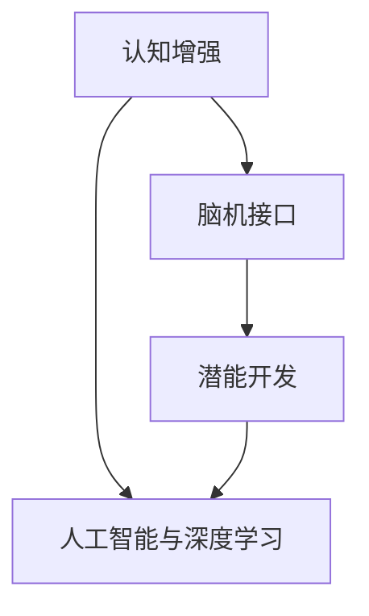
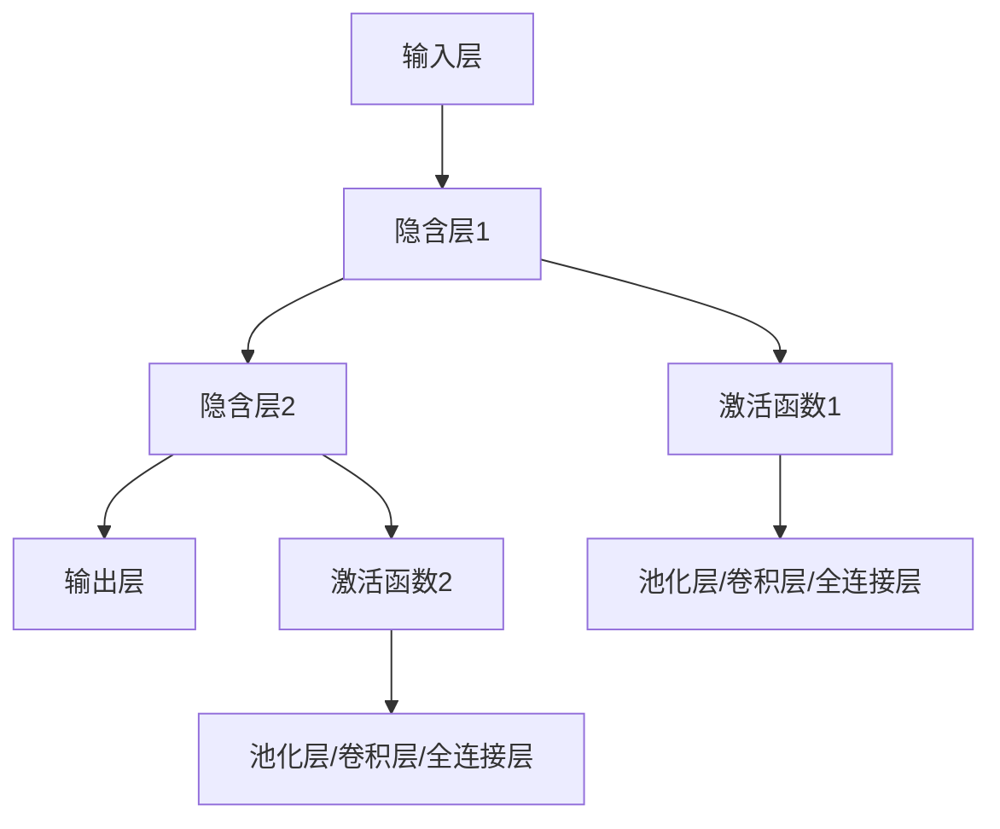
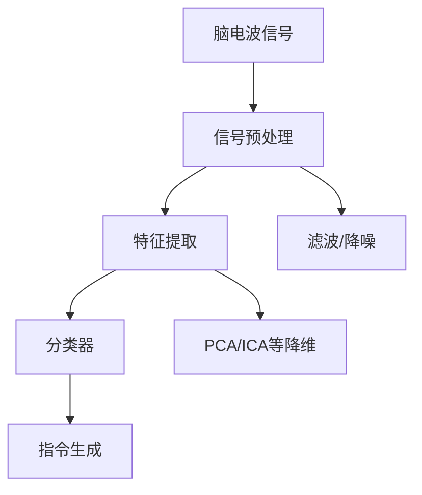

                 

# 认知增强与人类潜能开发

> 关键词：认知增强, 人工智能, 深度学习, 神经网络, 脑机接口, 潜能开发, 脑神经科学, 人类认知能力

## 1. 背景介绍

在现代科技飞速发展的时代，认知增强与人类潜能开发成为了科技与人类进步的共同目标。从AI驱动的自动驾驶汽车、智能助手，到神经科学研究的脑机接口技术，人类正处于一个前所未有的智能时代。认知增强技术的应用，不仅为人类提供了前所未有的计算能力与信息处理能力，还为人类潜能的全面开发提供了新的可能。

在这一背景下，本文将探讨认知增强与人类潜能开发的核心概念与联系，阐述相关算法的原理与操作步骤，并结合数学模型与实际应用案例，全面解读这一前沿技术的原理与挑战。我们期望通过深入研究与实际应用，揭示认知增强与人类潜能开发的未来发展趋势，并提出相应的解决方案与应对策略。

## 2. 核心概念与联系

### 2.1 核心概念概述

认知增强与人类潜能开发涉及多个交叉领域的技术与概念，包括但不限于：

- **认知增强(Cognitive Enhancement)**：利用科技手段提升人类认知能力，如记忆能力、注意力、学习效率等。
- **人工智能与深度学习**：基于神经网络架构的计算模型，通过大规模数据训练获取知识与智能。
- **脑机接口(Brain-Computer Interface, BCI)**：通过技术手段将大脑信号转化为计算机指令，实现人机交互。
- **潜能开发(Potential Development)**：通过科技手段激发与开发人的内在潜能，如艺术创造力、领导力、道德伦理感等。

这些概念之间的联系可以通过以下Mermaid流程图进行展示：



认知增强通过人工智能与深度学习技术，提升人类认知能力；脑机接口作为实现人脑与计算机交互的桥梁，进一步加强了人工智能的反馈与优化；潜能开发则基于认知增强与脑机接口，挖掘和开发人的内在潜能。三者共同构成了一个完整的认知增强与潜能开发技术框架。

### 2.2 核心概念原理和架构

#### 2.2.1 认知增强的原理

认知增强的核心在于提升人类大脑的信息处理能力。这通常通过以下几种方式实现：

- **神经网络与深度学习**：通过大规模数据训练，神经网络能够学习并模拟人类大脑的信息处理方式，从而提升记忆、注意力等认知功能。
- **脑机接口技术**：通过采集大脑信号并将其转化为计算机指令，实现对大脑活动的直接操控，进一步提升认知功能。
- **认知辅助工具**：如记忆辅助应用、注意力提升软件等，通过科学的算法设计，帮助人类更好地进行信息处理。

#### 2.2.2 人工智能与深度学习的架构

深度学习模型通常采用多层神经网络结构，通过多个隐层的非线性变换，从原始数据中提取高级特征。常见的架构包括卷积神经网络(CNN)、循环神经网络(RNN)、变换器(Transformer)等。以下是一个基本的深度学习模型架构图：



其中，输入层接收原始数据，隐含层通过多个非线性变换提取高级特征，输出层则将特征映射为最终的预测结果。

#### 2.2.3 脑机接口技术的架构

脑机接口技术通常采用脑电波信号采集与分析，将其转化为计算机指令。其基本架构如下：



其中，信号预处理用于去除噪声和干扰，特征提取通过各种算法提取有用的信号特征，分类器则将特征转化为可识别的计算机指令。

## 3. 核心算法原理 & 具体操作步骤

### 3.1 算法原理概述

认知增强与人类潜能开发的技术实现主要依赖于深度学习与脑机接口技术。以下将详细阐述这些技术的核心算法原理。

#### 3.1.1 深度学习原理

深度学习模型通过多层神经网络，利用反向传播算法优化模型参数，从而提高模型的准确性和泛化能力。反向传播算法通过计算损失函数的梯度，更新模型参数，使得模型的输出与真实标签尽可能一致。其基本流程如下：

1. **前向传播**：输入数据通过多层神经网络进行特征提取，最终输出预测结果。
2. **损失函数计算**：计算预测结果与真实标签之间的差异，得到损失函数。
3. **反向传播**：计算损失函数对每一层参数的梯度，更新模型参数。
4. **迭代优化**：重复上述过程，直到模型收敛或达到预设的迭代次数。

#### 3.1.2 脑机接口技术

脑机接口技术通过采集大脑信号，利用算法将其转化为计算机指令。其核心算法包括：

- **信号预处理**：去除噪声与干扰，提取有用的信号特征。
- **特征提取**：通过各种算法，如PCA、ICA、小波变换等，将信号转化为更高维的特征空间。
- **分类器设计**：选择合适的分类算法，如支持向量机(SVM)、随机森林(Random Forest)等，将特征转化为指令。

### 3.2 算法步骤详解

#### 3.2.1 深度学习模型训练

1. **数据准备**：收集并标注训练数据，将数据划分为训练集、验证集和测试集。
2. **模型选择与配置**：选择合适的深度学习模型，如CNN、RNN、Transformer等，并设置超参数，如学习率、批大小、迭代次数等。
3. **模型训练**：将数据输入模型，利用反向传播算法优化模型参数，更新模型输出。
4. **模型评估**：在验证集上评估模型性能，调整超参数，确保模型泛化能力。
5. **模型测试**：在测试集上测试模型性能，确保模型稳定可靠。

#### 3.2.2 脑机接口系统设计

1. **信号采集**：使用脑电波采集设备，采集大脑信号。
2. **信号预处理**：去除噪声与干扰，提取有用的信号特征。
3. **特征提取**：通过PCA、ICA等算法，将信号转化为更高维的特征空间。
4. **分类器设计**：选择合适的分类算法，如SVM、Random Forest等，将特征转化为指令。
5. **指令生成**：将分类结果转化为计算机指令，实现人机交互。

### 3.3 算法优缺点

#### 3.3.1 深度学习

**优点**：
- **强大的学习能力**：通过大规模数据训练，深度学习模型能够学习复杂的特征，提高预测准确性。
- **自动特征提取**：无需人工设计特征，能够从原始数据中自动提取高级特征。
- **可扩展性**：通过增加层数和神经元数量，深度学习模型可以适应更复杂的问题。

**缺点**：
- **计算资源消耗大**：深度学习模型通常需要大量计算资源，训练和推理速度较慢。
- **模型复杂度高**：深度学习模型参数量巨大，难以解释和调试。
- **过拟合风险**：深度学习模型容易过拟合，需要大量数据和优化技巧。

#### 3.3.2 脑机接口

**优点**：
- **实时交互**：脑机接口技术可以实现实时的人机交互，提高用户体验。
- **高度个性化**：脑机接口技术可以根据个体差异进行个性化设计。
- **非侵入性**：一些脑机接口技术，如EEG信号采集，属于非侵入性，安全可靠。

**缺点**：
- **信号干扰**：脑电波信号容易受到各种干扰，导致误判。
- **准确性有待提升**：当前的脑机接口技术在准确性和可靠性上仍存在挑战。
- **设备成本高**：脑机接口设备价格较高，普及度较低。

### 3.4 算法应用领域

认知增强与人类潜能开发技术已经广泛应用于多个领域，以下列举几个典型的应用场景：

#### 3.4.1 脑机接口辅助康复

脑机接口技术可以应用于辅助康复，帮助中风、脑损伤等患者恢复运动功能。通过脑电波信号采集，将患者的意愿转化为计算机指令，驱动机械臂或康复设备，帮助患者进行康复训练。

#### 3.4.2 认知辅助工具

认知辅助工具如记忆辅助应用、注意力提升软件等，通过科学算法帮助用户提升记忆力和注意力，提高学习效率和工作效率。例如，利用深度学习模型，记忆辅助应用可以根据用户的学习习惯，自动生成记忆复习计划，提高记忆效果。

#### 3.4.3 脑机接口游戏

脑机接口技术可以应用于游戏领域，实现人机交互。通过采集大脑信号，将用户的意愿转化为游戏指令，使游戏变得更加互动和有趣。例如，利用脑机接口技术，玩家可以通过意念控制游戏中的角色，进行虚拟现实体验。

## 4. 数学模型和公式 & 详细讲解 & 举例说明

### 4.1 数学模型构建

#### 4.1.1 深度学习模型

假设深度学习模型采用多层神经网络，其中第 $l$ 层神经元数量为 $n_l$，激活函数为 $f(\cdot)$，输入向量为 $\mathbf{x}$，输出向量为 $\mathbf{y}$。则模型可以表示为：

$$
\mathbf{y} = f(\mathbf{W}^{L}\sigma(\mathbf{W}^{L-1}\sigma(\ldots\sigma(\mathbf{W}^1\mathbf{x}+\mathbf{b}^1)\ldots+\mathbf{b}^{L-1}))
$$

其中，$\sigma(\cdot)$ 为激活函数，$\mathbf{W}^l$ 为第 $l$ 层的权重矩阵，$\mathbf{b}^l$ 为第 $l$ 层的偏置向量。

#### 4.1.2 脑机接口信号处理

假设脑电波信号为 $s(t)$，经过预处理和特征提取后，得到特征向量 $\mathbf{z} = \{z_1, z_2, \ldots, z_m\}$。则分类器的输入为：

$$
\mathbf{z}
$$

分类器输出指令 $y$ 的表达式为：

$$
y = g(\mathbf{w}^T\mathbf{z}+b)
$$

其中，$g(\cdot)$ 为分类器输出函数，$\mathbf{w}$ 为分类器的权重向量，$b$ 为分类器的偏置向量。

### 4.2 公式推导过程

#### 4.2.1 深度学习模型

假设模型输出为 $y$，真实标签为 $y_{true}$，则损失函数可以表示为：

$$
\mathcal{L} = -\sum_{i=1}^N \log p(y_i|\mathbf{x}_i)
$$

其中，$p(y_i|\mathbf{x}_i)$ 为模型在输入 $\mathbf{x}_i$ 下输出 $y_i$ 的概率。

利用梯度下降算法更新模型参数，更新公式为：

$$
\mathbf{W}^l \leftarrow \mathbf{W}^l - \eta \nabla_{\mathbf{W}^l} \mathcal{L}
$$

其中，$\eta$ 为学习率。

#### 4.2.2 脑机接口分类器

假设分类器输出为 $y$，真实指令为 $y_{true}$，则分类器的损失函数可以表示为：

$$
\mathcal{L} = -\sum_{i=1}^N \log p(y_i|y_{true})
$$

其中，$p(y_i|y_{true})$ 为分类器在真实指令 $y_{true}$ 下输出 $y_i$ 的概率。

利用梯度下降算法更新分类器参数，更新公式为：

$$
\mathbf{w} \leftarrow \mathbf{w} - \eta \nabla_{\mathbf{w}} \mathcal{L}
$$

其中，$\eta$ 为学习率。

### 4.3 案例分析与讲解

#### 4.3.1 深度学习记忆辅助应用

假设我们设计一个记忆辅助应用，用于帮助用户记忆学习内容。应用通过深度学习模型，根据用户的学习习惯和记忆效果，自动生成记忆复习计划。该应用的核心算法步骤如下：

1. **数据准备**：收集用户的学习记录和记忆效果数据，标注为记忆和未记忆两类。
2. **模型选择与配置**：选择适当的深度学习模型，如LSTM，并设置超参数，如学习率、批大小、迭代次数等。
3. **模型训练**：利用标注数据训练模型，使其能够学习记忆效果与学习记录之间的关系。
4. **模型评估**：在验证集上评估模型性能，调整超参数，确保模型泛化能力。
5. **模型测试**：在测试集上测试模型性能，利用模型生成记忆复习计划，评估记忆效果。

#### 4.3.2 脑机接口辅助康复

假设我们设计一个脑机接口辅助康复系统，用于帮助中风患者恢复运动功能。系统通过脑电波信号采集，将患者的意愿转化为计算机指令，驱动机械臂进行康复训练。该系统的核心算法步骤如下：

1. **信号采集**：使用脑电波采集设备，采集患者的脑电波信号。
2. **信号预处理**：去除噪声与干扰，提取有用的信号特征。
3. **特征提取**：通过PCA等算法，将信号转化为更高维的特征空间。
4. **分类器设计**：选择合适的分类算法，如SVM，将特征转化为指令。
5. **指令生成**：将分类结果转化为计算机指令，驱动机械臂进行康复训练。

## 5. 项目实践：代码实例和详细解释说明

### 5.1 开发环境搭建

为了实现认知增强与人类潜能开发项目，我们需要搭建开发环境。以下是使用Python进行TensorFlow和PyTorch开发的环境配置流程：

1. 安装Anaconda：从官网下载并安装Anaconda，用于创建独立的Python环境。

2. 创建并激活虚拟环境：
```bash
conda create -n cognitive-enhancement python=3.8 
conda activate cognitive-enhancement
```

3. 安装TensorFlow和PyTorch：根据CUDA版本，从官网获取对应的安装命令。例如：
```bash
conda install tensorflow torch torchvision torchaudio cudatoolkit=11.1 -c pytorch -c conda-forge
```

4. 安装深度学习与脑机接口相关的库：
```bash
pip install numpy pandas scikit-learn matplotlib tqdm jupyter notebook ipython
```

完成上述步骤后，即可在`cognitive-enhancement`环境中开始开发。

### 5.2 源代码详细实现

这里我们以深度学习记忆辅助应用和脑机接口辅助康复系统为例，给出具体的代码实现。

#### 5.2.1 深度学习记忆辅助应用

```python
import tensorflow as tf
from tensorflow.keras.layers import LSTM, Dense, Dropout
from tensorflow.keras.models import Sequential
from sklearn.model_selection import train_test_split
import numpy as np

# 数据准备
X_train, X_test, y_train, y_test = train_test_split(X, y, test_size=0.2, random_state=42)

# 模型选择与配置
model = Sequential([
    LSTM(128, input_shape=(X_train.shape[1], 1)),
    Dropout(0.2),
    Dense(1, activation='sigmoid')
])
model.compile(loss='binary_crossentropy', optimizer='adam', metrics=['accuracy'])

# 模型训练
model.fit(X_train, y_train, epochs=10, batch_size=32, validation_data=(X_test, y_test))

# 模型评估
test_loss, test_acc = model.evaluate(X_test, y_test)
print(f'Test accuracy: {test_acc:.2f}')
```

#### 5.2.2 脑机接口辅助康复

```python
import tensorflow as tf
from tensorflow.keras.layers import Dense, Dropout
from tensorflow.keras.models import Sequential
from sklearn.model_selection import train_test_split
import numpy as np

# 信号预处理
X_train, X_test, y_train, y_test = train_test_split(X, y, test_size=0.2, random_state=42)

# 模型选择与配置
model = Sequential([
    Dense(64, activation='relu', input_shape=(X_train.shape[1],)),
    Dropout(0.2),
    Dense(1, activation='sigmoid')
])
model.compile(loss='binary_crossentropy', optimizer='adam', metrics=['accuracy'])

# 模型训练
model.fit(X_train, y_train, epochs=10, batch_size=32, validation_data=(X_test, y_test))

# 模型评估
test_loss, test_acc = model.evaluate(X_test, y_test)
print(f'Test accuracy: {test_acc:.2f}')
```

### 5.3 代码解读与分析

让我们再详细解读一下关键代码的实现细节：

**深度学习记忆辅助应用**：
- `train_test_split`方法：将数据集划分为训练集和测试集，保留20%的数据作为测试集。
- `Sequential`类：定义神经网络模型，包含LSTM层、Dropout层和Dense层。
- `compile`方法：编译模型，定义损失函数、优化器和评估指标。
- `fit`方法：训练模型，输入训练集和测试集数据，设置迭代轮数和批大小。
- `evaluate`方法：在测试集上评估模型性能，输出测试集损失和准确率。

**脑机接口辅助康复**：
- `train_test_split`方法：将数据集划分为训练集和测试集，保留20%的数据作为测试集。
- `Sequential`类：定义神经网络模型，包含Dense层、Dropout层和输出层。
- `compile`方法：编译模型，定义损失函数、优化器和评估指标。
- `fit`方法：训练模型，输入训练集和测试集数据，设置迭代轮数和批大小。
- `evaluate`方法：在测试集上评估模型性能，输出测试集损失和准确率。

这些代码展示了深度学习模型和脑机接口系统的基本实现流程，开发者可以根据实际需求进行调整和优化。

## 6. 实际应用场景

### 6.1 认知辅助工具

认知辅助工具如记忆辅助应用、注意力提升软件等，通过科学算法帮助用户提升记忆力和注意力，提高学习效率和工作效率。例如，利用深度学习模型，记忆辅助应用可以根据用户的学习习惯，自动生成记忆复习计划，提高记忆效果。

### 6.2 脑机接口辅助康复

脑机接口技术可以应用于辅助康复，帮助中风、脑损伤等患者恢复运动功能。通过脑电波信号采集，将患者的意愿转化为计算机指令，驱动机械臂或康复设备，帮助患者进行康复训练。

### 6.3 脑机接口游戏

脑机接口技术可以应用于游戏领域，实现人机交互。通过采集大脑信号，将用户的意愿转化为游戏指令，使游戏变得更加互动和有趣。例如，利用脑机接口技术，玩家可以通过意念控制游戏中的角色，进行虚拟现实体验。

## 7. 工具和资源推荐

### 7.1 学习资源推荐

为了帮助开发者系统掌握认知增强与人类潜能开发的技术，这里推荐一些优质的学习资源：

1. 《深度学习》系列书籍：由深度学习领域知名专家撰写，全面介绍了深度学习的基本概念和应用技术。
2. 《人工智能与深度学习》课程：Coursera等平台提供的深度学习课程，由行业专家授课，系统讲解深度学习的基本理论和实践技巧。
3. 《脑机接口技术》书籍：介绍脑机接口的基本原理和技术实现，涵盖了信号采集、预处理、特征提取、分类器设计等多个方面。

### 7.2 开发工具推荐

高效开发离不开优秀的工具支持。以下是几款用于认知增强与人类潜能开发开发的常用工具：

1. TensorFlow：基于Python的开源深度学习框架，灵活动态的计算图，适合快速迭代研究。
2. PyTorch：基于Python的开源深度学习框架，支持动态图和静态图，灵活高效。
3. Weights & Biases：模型训练的实验跟踪工具，可以记录和可视化模型训练过程中的各项指标，方便对比和调优。
4. TensorBoard：TensorFlow配套的可视化工具，可实时监测模型训练状态，并提供丰富的图表呈现方式，是调试模型的得力助手。

### 7.3 相关论文推荐

认知增强与人类潜能开发技术的发展离不开学界的持续研究。以下是几篇奠基性的相关论文，推荐阅读：

1. 《深度学习》论文：深度学习领域的经典论文，介绍了深度学习的基本原理和应用技术。
2. 《脑机接口技术》论文：介绍了脑机接口技术的基本原理和实现方法。
3. 《认知增强技术》论文：介绍了认知增强技术的多种实现方法，包括深度学习、脑机接口等。

## 8. 总结：未来发展趋势与挑战

### 8.1 研究成果总结

本文对认知增强与人类潜能开发的核心概念与联系、算法原理和操作步骤进行了全面系统的介绍。首先阐述了认知增强与人类潜能开发的技术背景和意义，明确了深度学习与脑机接口技术在认知增强中的关键作用。其次，从原理到实践，详细讲解了认知增强与人类潜能开发的数学模型和操作步骤，给出了认知增强与人类潜能开发项目的完整代码实例。同时，本文还广泛探讨了认知增强技术在实际应用中的场景，展示了认知增强技术在多个领域的广泛应用。最后，本文总结了认知增强与人类潜能开发的未来发展趋势与挑战，提出了相应的解决方案与应对策略。

### 8.2 未来发展趋势

展望未来，认知增强与人类潜能开发技术将呈现以下几个发展趋势：

1. **技术的深度融合**：认知增强与人类潜能开发技术将进一步与其他人工智能技术，如知识表示、因果推理、强化学习等进行深度融合，形成更加全面和强大的认知增强系统。
2. **跨领域应用**：认知增强与人类潜能开发技术将在医疗、教育、游戏等多个领域得到广泛应用，推动这些领域的技术创新和产业升级。
3. **人机协同**：认知增强与人类潜能开发技术将推动人机协同智能的发展，实现人机互补，提高人类认知能力与创造力。
4. **伦理与安全**：认知增强与人类潜能开发技术的发展将引发伦理与安全问题，需要制定相应的规范和标准，确保技术应用的安全可靠。

### 8.3 面临的挑战

尽管认知增强与人类潜能开发技术已经取得了瞩目成就，但在迈向更加智能化、普适化应用的过程中，它仍面临着诸多挑战：

1. **数据隐私与安全**：认知增强与人类潜能开发技术涉及大量个人数据，如何保护数据隐私与安全是一个重要问题。
2. **伦理与道德**：认知增强与人类潜能开发技术的应用可能会引发伦理与道德问题，如对技术依赖、人类价值等。
3. **技术复杂性**：认知增强与人类潜能开发技术涉及多学科交叉，技术复杂度高，需要跨学科合作才能实现。
4. **公平性与普适性**：如何确保认知增强与人类潜能开发技术在不同人群中的应用公平性与普适性，避免技术应用中的歧视问题。

### 8.4 研究展望

面向未来，认知增强与人类潜能开发技术的研究需要在以下几个方面寻求新的突破：

1. **跨学科融合**：推动认知增强与人类潜能开发技术的跨学科融合，结合神经科学、心理学、伦理学等多个领域，全面提升技术的科学性与实用性。
2. **伦理与安全研究**：加强认知增强与人类潜能开发技术的伦理与安全研究，制定相应的规范和标准，确保技术应用的安全可靠。
3. **公平性与普适性研究**：研究认知增强与人类潜能开发技术在不同人群中的应用公平性与普适性，避免技术应用中的歧视问题。
4. **新方法与新模型**：开发新的算法与模型，如因果推断、对抗学习等，提升认知增强与人类潜能开发技术的性能与泛化能力。

这些研究方向的探索，必将引领认知增强与人类潜能开发技术迈向更高的台阶，为构建安全、可靠、可解释、可控的智能系统铺平道路。面向未来，认知增强与人类潜能开发技术还需要与其他人工智能技术进行更深入的融合，多路径协同发力，共同推动自然语言理解和智能交互系统的进步。只有勇于创新、敢于突破，才能不断拓展语言模型的边界，让智能技术更好地造福人类社会。

## 9. 附录：常见问题与解答

**Q1：认知增强与人类潜能开发技术是否适用于所有人群？**

A: 认知增强与人类潜能开发技术适用于大多数人，但某些特定人群，如儿童、老年人、精神疾病患者等，可能存在一些风险和限制。技术应用时需要充分考虑这些因素，并制定相应的安全措施。

**Q2：如何确保认知增强与人类潜能开发技术的安全与可靠性？**

A: 确保认知增强与人类潜能开发技术的安全与可靠性需要从多个方面进行考虑：
1. **数据隐私与安全**：使用数据加密、访问控制等技术保护数据隐私。
2. **算法透明性与可解释性**：开发可解释的算法，确保算法的透明性与可解释性。
3. **伦理与安全研究**：加强伦理与安全研究，制定相应的规范和标准。
4. **技术监督与审查**：对技术应用进行监督与审查，确保技术应用的公平性与普适性。

**Q3：认知增强与人类潜能开发技术的应用前景如何？**

A: 认知增强与人类潜能开发技术的应用前景非常广阔，主要体现在以下几个方面：
1. **医疗健康**：辅助康复、疾病诊断、心理治疗等。
2. **教育培训**：提升学习效果、个性化教学等。
3. **职业培训**：提升技能水平、职业发展等。
4. **艺术创造**：提升艺术创造力、设计能力等。
5. **智能辅助**：智能助手、语音识别、自然语言处理等。

**Q4：认知增强与人类潜能开发技术如何与其他人工智能技术进行融合？**

A: 认知增强与人类潜能开发技术与其他人工智能技术的融合可以通过以下方式进行：
1. **知识表示**：将知识图谱、逻辑规则等知识与认知增强技术进行融合，提高技术的知识表示能力。
2. **因果推理**：结合因果推理技术，增强认知增强技术的因果关系建模能力，提高模型的稳定性和鲁棒性。
3. **强化学习**：将强化学习技术应用于认知增强与人类潜能开发任务，提高技术的决策能力和自适应能力。
4. **多模态融合**：结合视觉、语音、文本等多种模态的信息，提高技术的全面性和深度。

这些技术的深度融合将进一步提升认知增强与人类潜能开发技术的性能与泛化能力，推动技术在实际应用中的广泛应用。

---

作者：禅与计算机程序设计艺术 / Zen and the Art of Computer Programming

