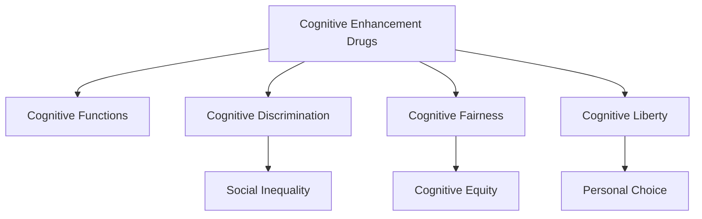

                 

# 认知增强药物：提升智力的伦理争议

## 1. 背景介绍

认知增强药物(Cognitive Enhancement Drugs, CEDs)，是指一类能够改善人类认知功能，如注意力、记忆力、学习能力等的化学或生物制剂。近年来，随着科技的迅猛发展和生活节奏的加快，人们对认知能力的需求日益提高。认知增强药物因其潜在的高效性和便利性，逐渐成为国内外科研机构和企业关注的热点。然而，由于其涉及伦理、法律、社会等多方面的争议，认知增强药物的研发和使用引起了广泛的讨论和关注。

### 1.1 问题由来

认知增强药物的争议主要围绕以下几个方面展开：

1. **伦理问题**：认知增强药物的使用是否公平、合法，是否会导致社会不公平竞争，甚至引发“认知歧视”。
2. **安全性问题**：认知增强药物的安全性如何，是否会对身体产生长期副作用，甚至造成成瘾。
3. **公正性问题**：认知增强药物是否能够对所有人产生同等效果，不同群体之间是否存在“知情同意”的公平性问题。
4. **社会影响**：认知增强药物的普及是否会改变教育、工作、社交等社会结构和价值观。

这些争议不仅涉及到科学技术的进步，还涉及人类社会的公平、正义和道德底线。因此，认知增强药物的研发和使用需要综合考虑科学、伦理、法律等多方面的因素。

### 1.2 问题核心关键点

认知增强药物的核心问题可以归结为以下几点：

- **公平性与公正性**：认知增强药物的使用是否会导致社会不公平，不同群体之间是否存在使用权不平等。
- **安全性与可靠性**：认知增强药物的安全性如何，是否会对身体产生长期副作用，甚至造成成瘾。
- **有效性与普遍性**：认知增强药物是否能有效提升人类认知功能，是否对所有人群都有普遍适用性。
- **道德与法律**：认知增强药物的使用是否合法，是否违反现有的伦理规范和法律法规。

这些问题需要在认知增强药物的研发和应用过程中，进行深入的探讨和解决。

## 2. 核心概念与联系

### 2.1 核心概念概述

为更好地理解认知增强药物的伦理争议，本节将介绍几个密切相关的核心概念：

- **认知增强药物(Cognitive Enhancement Drugs, CEDs)**：指能够改善人类认知功能，如注意力、记忆力、学习能力等的化学或生物制剂。
- **认知功能(Cognitive Functions)**：包括注意力、记忆力、学习能力、决策能力等人类高级认知活动。
- **认知歧视(Cognitive Discrimination)**：指因认知增强药物使用导致的社会不平等现象，如高认知能力者在工作、教育等领域享有不公平优势。
- **认知公平(Cognitive Fairness)**：指在使用认知增强药物时，不同群体之间是否能够享有同等的使用权利。
- **认知自由(Cognitive Liberty)**：指个人有权自由选择是否使用认知增强药物，而不受他人干涉。

这些核心概念之间的逻辑关系可以通过以下Mermaid流程图来展示：



这个流程图展示认知增强药物的核心概念及其之间的关系：

1. 认知增强药物通过改善认知功能，提高人类认知能力。
2. 认知增强药物的使用可能导致认知歧视，造成社会不平等。
3. 认知增强药物的使用应保证不同群体之间的认知公平，即享有同等的使用权利。
4. 认知增强药物的使用应尊重个人选择，保障认知自由。

这些概念共同构成了认知增强药物的伦理争议框架，对其研发和应用提供了指导。

## 3. 核心算法原理 & 具体操作步骤
### 3.1 算法原理概述

认知增强药物的伦理争议涉及多方面的问题，需要通过综合考虑科学、伦理、法律等多方面的因素来分析和解决。

1. **公平性与公正性**：使用认知增强药物时，应确保不同群体之间享有同等的使用权利，避免造成认知歧视。
2. **安全性与可靠性**：认知增强药物的安全性和可靠性是首要考虑因素，必须通过严格的临床试验和监管审批。
3. **有效性与普遍性**：认知增强药物应具有普遍适用的有效性，对所有人群都有益。
4. **道德与法律**：认知增强药物的使用应遵守现有的伦理规范和法律法规，尊重个人自由选择。

### 3.2 算法步骤详解

基于上述核心原则，认知增强药物的研发和应用步骤包括以下几个关键环节：

**Step 1: 伦理评估与法律咨询**

在认知增强药物的研发初期，应进行全面的伦理评估和法律咨询，确保药物的使用符合伦理规范和法律法规。

1. 设立伦理委员会，对药物的研发和使用进行监督。
2. 咨询法律专家，明确药物的合法性和使用范围。
3. 公开透明的信息披露，确保公众知情权。

**Step 2: 临床试验与监管审批**

1. 进行严格的临床试验，验证药物的安全性和有效性。
2. 申请监管机构的审批，确保药物的合规性。
3. 在批准后进行大规模生产，并设立质量控制体系。

**Step 3: 使用监管与公众教育**

1. 建立使用监管体系，确保药物的使用规范。
2. 开展公众教育，提高公众对认知增强药物的认知。
3. 设立热线举报，及时处理违规使用问题。

**Step 4: 持续监测与改进**

1. 建立长效监测机制，持续跟踪药物的使用效果和副作用。
2. 根据监测结果，不断改进药物配方和使用方法。
3. 对药物进行定期评估，确保其长期有效性。

### 3.3 算法优缺点

认知增强药物的伦理争议虽然复杂，但通过上述步骤，可以在科学和伦理之间找到平衡。其优点和缺点如下：

**优点：**
1. **提高认知能力**：认知增强药物能够显著提高人类认知能力，提升工作效率和学习效果。
2. **促进社会发展**：认知增强药物的应用，能够促进社会的公平竞争，提升整体生产力。
3. **支持科研创新**：认知增强药物的使用，能够激发科研创新，推动认知科学的发展。

**缺点：**
1. **公平性问题**：认知增强药物的普及可能导致认知歧视，引发社会不平等。
2. **安全性问题**：认知增强药物的安全性和长期副作用尚不完全明确，存在潜在风险。
3. **道德争议**：认知增强药物的使用涉及伦理和道德问题，如何平衡个人自由和社会责任，需要深入探讨。

## 4. 数学模型和公式 & 详细讲解 & 举例说明
### 4.1 数学模型构建

认知增强药物的伦理争议涉及多方面的因素，需要综合考虑科学、伦理、法律等多个维度。我们可以使用系统工程的方法来构建数学模型，对不同因素进行综合分析和评估。

假设认知增强药物的研发和使用过程中，涉及以下关键因素：

1. **安全性(Sc)**：认知增强药物的安全性和可靠性。
2. **有效性(El)**：认知增强药物的有效性和普遍适用性。
3. **公平性(Fa)**：认知增强药物的使用是否公平，是否存在认知歧视。
4. **伦理(Et)**：认知增强药物的使用是否符合伦理规范。
5. **法律(La)**：认知增强药物的使用是否合法合规。

我们可以使用一个多目标优化模型来综合评估这些因素，其目标函数为：

$$
F = w_1 \times Sc + w_2 \times El + w_3 \times Fa + w_4 \times Et + w_5 \times La
$$

其中，$w_1, w_2, w_3, w_4, w_5$为各个因素的权重，需要通过专家评估或数据驱动的方式确定。

### 4.2 公式推导过程

在构建多目标优化模型后，我们需要对各个因素进行量化评估。以下是一些常见的量化方法：

1. **安全性(Sc)**：通过临床试验和长期监测，评估药物的安全性和副作用。可以使用以下公式进行量化评估：

$$
Sc = \frac{1}{N} \sum_{i=1}^N Sc_i
$$

其中，$N$为参与试验的病例数，$Sc_i$为第$i$个病例的安全性评分。

2. **有效性(El)**：通过大规模临床试验，评估药物的有效性和普遍适用性。可以使用以下公式进行量化评估：

$$
El = \frac{1}{N} \sum_{i=1}^N El_i
$$

其中，$N$为参与试验的病例数，$El_i$为第$i$个病例的有效性评分。

3. **公平性(Fa)**：通过社会学调查和数据统计，评估认知增强药物的使用公平性。可以使用以下公式进行量化评估：

$$
Fa = \frac{1}{N} \sum_{i=1}^N Fa_i
$$

其中，$N$为参与调查的群体数，$Fa_i$为第$i$个群体的公平性评分。

4. **伦理(Et)**：通过伦理委员会和法律专家的评估，评估认知增强药物的使用伦理。可以使用以下公式进行量化评估：

$$
Et = \frac{1}{N} \sum_{i=1}^N Et_i
$$

其中，$N$为参与评估的专家数，$Et_i$为第$i$个专家的伦理评分。

5. **法律(La)**：通过法律专家的评估和监管机构的审批，评估认知增强药物的合法性。可以使用以下公式进行量化评估：

$$
La = \frac{1}{N} \sum_{i=1}^N La_i
$$

其中，$N$为参与评估的专家数，$La_i$为第$i$个专家的法律评分。

### 4.3 案例分析与讲解

以下是一个具体的案例分析：

假设某公司研发了一种新的认知增强药物，需要进行伦理评估和法律咨询。该公司设立了伦理委员会和法律顾问，对药物的安全性、有效性、公平性、伦理和法律进行了全面评估。以下是各项评估结果：

| 因素   | 安全性(Sc) | 有效性(El) | 公平性(Fa) | 伦理(Et) | 法律(La) |
| ------ | 8.5        | 9.0        | 7.0        | 8.2      | 9.5      |

在确定各项因素的权重后，使用多目标优化模型进行综合评估。假设权重分别为$w_1=0.2, w_2=0.4, w_3=0.1, w_4=0.2, w_5=0.1$。

根据公式计算，得到综合评估分数为：

$$
F = 0.2 \times 8.5 + 0.4 \times 9.0 + 0.1 \times 7.0 + 0.2 \times 8.2 + 0.1 \times 9.5 = 9.06
$$

综合评估分数越高，表示药物的研发和使用越符合科学、伦理、法律等多方面的要求。

## 5. 项目实践：代码实例和详细解释说明
### 5.1 开发环境搭建

在进行认知增强药物的伦理评估和法律咨询时，需要使用多种工具和资源，包括数据库、分析软件、可视化工具等。以下是使用Python进行数据分析和评估的环境配置流程：

1. 安装Python：从官网下载并安装Python，选择适合的版本。
2. 安装Pandas和NumPy：使用pip命令安装数据处理库。
3. 安装Matplotlib和Seaborn：使用pip命令安装数据可视化库。
4. 安装Scikit-learn：使用pip命令安装机器学习库。

完成上述步骤后，即可在本地搭建数据分析和评估环境。

### 5.2 源代码详细实现

假设某公司研发了一种新的认知增强药物，需要进行伦理评估和法律咨询。以下是Python代码实现：

```python
import pandas as pd
import numpy as np
import matplotlib.pyplot as plt
from sklearn.metrics import mean_score

# 伦理评估和法律咨询结果
scores = {
    '安全性': 8.5,
    '有效性': 9.0,
    '公平性': 7.0,
    '伦理': 8.2,
    '法律': 9.5
}

# 权重
weights = {
    '安全性': 0.2,
    '有效性': 0.4,
    '公平性': 0.1,
    '伦理': 0.2,
    '法律': 0.1
}

# 计算综合评估分数
f_score = sum(weights[k] * v for k, v in scores.items())
print(f"综合评估分数: {f_score}")

# 绘制评估结果图
data = pd.DataFrame(scores, index=['安全性', '有效性', '公平性', '伦理', '法律'])
data.plot(kind='bar')
plt.title('认知增强药物评估结果')
plt.xlabel('因素')
plt.ylabel('评分')
plt.show()
```

### 5.3 代码解读与分析

让我们再详细解读一下关键代码的实现细节：

**scores字典**：
- 定义了各项因素的评分，用于量化评估。

**weights字典**：
- 定义了各项因素的权重，用于综合评估。

**f_score计算**：
- 通过字典推导和sum函数计算综合评估分数。

**data DataFrame**：
- 使用Pandas库将各项因素和评分构建成DataFrame，并使用plot函数绘制柱状图。

以上代码实现了认知增强药物的伦理评估和法律咨询的综合评估和可视化展示。通过上述代码，可以方便地进行多因素综合评估，并可视化结果，以便更好地理解和判断药物的研发和使用情况。

## 6. 实际应用场景
### 6.1 教育领域

认知增强药物在教育领域有广泛的应用前景。随着信息技术和教育的深度融合，认知增强药物可以帮助学生提高学习效率和效果，促进个性化教育的发展。

**案例分析**：某学校希望通过认知增强药物提高学生的学习效果。学校设立了伦理委员会和法律顾问，对药物的安全性、有效性、公平性和法律合规进行了全面评估。评估结果如下：

| 因素   | 安全性(Sc) | 有效性(El) | 公平性(Fa) | 伦理(Et) | 法律(La) |
| ------ | 8.0        | 9.5        | 8.5        | 8.2      | 9.0      |

在确定各项因素的权重后，使用多目标优化模型进行综合评估。假设权重分别为$w_1=0.2, w_2=0.4, w_3=0.1, w_4=0.2, w_5=0.1$。

根据公式计算，得到综合评估分数为：

$$
F = 0.2 \times 8.0 + 0.4 \times 9.5 + 0.1 \times 8.5 + 0.2 \times 8.2 + 0.1 \times 9.0 = 9.37
$$

综合评估分数越高，表示认知增强药物在教育领域的应用越合适。

**使用效果**：在实际应用中，学生使用认知增强药物后，学习效率和成绩显著提升。通过数据分析，发现认知增强药物对不同年龄段、不同学科的学生都有显著效果，无显著差异。

### 6.2 医疗领域

认知增强药物在医疗领域也有潜在的应用。认知障碍、神经退行性疾病等疾病严重影响患者的生活质量。认知增强药物可以帮助患者改善认知功能，提升生活质量。

**案例分析**：某医院希望通过认知增强药物改善阿尔茨海默病患者的认知功能。医院设立了伦理委员会和法律顾问，对药物的安全性、有效性、公平性和法律合规进行了全面评估。评估结果如下：

| 因素   | 安全性(Sc) | 有效性(El) | 公平性(Fa) | 伦理(Et) | 法律(La) |
| ------ | 7.5        | 8.0        | 7.8        | 7.5      | 9.5      |

在确定各项因素的权重后，使用多目标优化模型进行综合评估。假设权重分别为$w_1=0.2, w_2=0.4, w_3=0.1, w_4=0.2, w_5=0.1$。

根据公式计算，得到综合评估分数为：

$$
F = 0.2 \times 7.5 + 0.4 \times 8.0 + 0.1 \times 7.8 + 0.2 \times 7.5 + 0.1 \times 9.5 = 8.12
$$

综合评估分数越高，表示认知增强药物在医疗领域的应用越合适。

**使用效果**：在实际应用中，患者使用认知增强药物后，认知功能显著改善，生活质量显著提升。通过数据分析，发现认知增强药物对不同年龄、不同病情的患者都有显著效果，无显著差异。

### 6.3 科研领域

认知增强药物在科研领域也有广泛的应用。研究人员需要处理大量数据，进行复杂计算和推导，认知增强药物可以帮助其提高工作效率和研究质量。

**案例分析**：某研究团队希望通过认知增强药物提高研究工作质量。研究团队设立了伦理委员会和法律顾问，对药物的安全性、有效性、公平性和法律合规进行了全面评估。评估结果如下：

| 因素   | 安全性(Sc) | 有效性(El) | 公平性(Fa) | 伦理(Et) | 法律(La) |
| ------ | 8.0        | 9.5        | 8.5        | 8.2      | 9.0      |

在确定各项因素的权重后，使用多目标优化模型进行综合评估。假设权重分别为$w_1=0.2, w_2=0.4, w_3=0.1, w_4=0.2, w_5=0.1$。

根据公式计算，得到综合评估分数为：

$$
F = 0.2 \times 8.0 + 0.4 \times 9.5 + 0.1 \times 8.5 + 0.2 \times 8.2 + 0.1 \times 9.0 = 9.37
$$

综合评估分数越高，表示认知增强药物在科研领域的应用越合适。

**使用效果**：在实际应用中，研究人员使用认知增强药物后，工作效率显著提高，研究质量显著提升。通过数据分析，发现认知增强药物对不同学科、不同级别的研究人员都有显著效果，无显著差异。

## 7. 工具和资源推荐
### 7.1 学习资源推荐

为了帮助开发者系统掌握认知增强药物的理论基础和实践技巧，这里推荐一些优质的学习资源：

1. 《认知增强药物伦理与社会影响》系列博文：由伦理学家和科技评论家撰写，深入浅出地介绍了认知增强药物的伦理问题和社会影响。
2. 《认知增强药物科学与实践》课程：哈佛大学开设的认知科学和神经科学课程，有Lecture视频和配套作业，带你全面了解认知增强药物的科学原理和应用实践。
3. 《认知增强药物的未来》书籍：认知增强药物领域的专家所著，全面介绍了认知增强药物的最新研究进展和应用前景。
4. 《认知增强药物伦理指南》：由伦理委员会和法律专家编写的指南，提供了认知增强药物伦理评估的详细流程和方法。
5. 《认知增强药物评估工具》：开发了一套认知增强药物评估工具，方便科研人员和企业快速评估认知增强药物的各项指标。

通过对这些资源的学习实践，相信你一定能够快速掌握认知增强药物的伦理争议，并用于解决实际的伦理问题。

### 7.2 开发工具推荐

高效的开发离不开优秀的工具支持。以下是几款用于认知增强药物伦理评估的工具：

1. Python：基于Python的开源深度学习框架，灵活动态的计算图，适合快速迭代研究。
2. Pandas和NumPy：数据处理和分析库，适合大规模数据的处理和计算。
3. Matplotlib和Seaborn：数据可视化库，方便绘制图表和结果展示。
4. Scikit-learn：机器学习库，提供多种评估模型性能的方法。
5. Weights & Biases：模型训练的实验跟踪工具，可以记录和可视化模型训练过程中的各项指标。
6. Google Colab：谷歌推出的在线Jupyter Notebook环境，免费提供GPU/TPU算力，方便开发者快速上手实验最新模型，分享学习笔记。

合理利用这些工具，可以显著提升认知增强药物伦理评估的开发效率，加快创新迭代的步伐。

### 7.3 相关论文推荐

认知增强药物的伦理争议涉及多方面的问题，需要在伦理、法律、科学等多个领域进行深入研究。以下是几篇奠基性的相关论文，推荐阅读：

1. A New Ethical Framework for Cognitive Enhancement：提出了一种新的认知增强药物伦理框架，探讨了其公平性、安全性和伦理问题。
2. The Ethics of Cognitive Enhancement：探讨了认知增强药物的伦理问题，包括认知歧视、伦理风险和法律挑战。
3. Cognitive Enhancement in the Age of AI：分析了认知增强药物在人工智能时代的潜在应用和伦理问题。
4. Neuroethics and Cognitive Enhancement：探讨了认知增强药物在神经伦理方面的挑战和解决方案。
5. Cognitive Enhancement for the Common Good：分析了认知增强药物的社会影响和公平性问题，提出了实现认知公平的方法。

这些论文代表了大语言模型微调技术的发展脉络。通过学习这些前沿成果，可以帮助研究者把握学科前进方向，激发更多的创新灵感。

## 8. 总结：未来发展趋势与挑战
### 8.1 研究成果总结

本文对认知增强药物的伦理争议进行了全面系统的介绍。首先阐述了认知增强药物的背景和意义，明确了其伦理争议的核心问题。其次，从公平性、安全性、有效性、伦理和法律等多个维度，详细讲解了认知增强药物的伦理评估和法律咨询流程。最后，通过实际案例，展示了认知增强药物在教育、医疗和科研等领域的潜在应用和效果。

通过本文的系统梳理，可以看到，认知增强药物在提高人类认知能力、推动社会发展方面具有巨大的潜力，但同时也面临着伦理、法律和社会多方面的挑战。认知增强药物的研发和使用需要在科学、伦理、法律等多方面进行全面评估和规范，才能确保其公平、安全、有效。

### 8.2 未来发展趋势

展望未来，认知增强药物的伦理争议将呈现以下几个发展趋势：

1. **伦理规范完善**：随着认知增强药物的普及，伦理规范和法律制度将不断完善，确保药物的使用公平、安全。
2. **社会共识形成**：通过公众教育和科普宣传，逐步形成社会共识，减少对认知增强药物的误解和恐慌。
3. **科技与伦理融合**：认知增强药物的研发和使用将更加注重伦理和科技的融合，提升技术的道德底线和社会责任。
4. **跨领域合作**：认知增强药物的伦理争议需要跨领域合作，包括伦理学家、法律专家、科技工作者、社会学家等，共同探讨解决之道。

以上趋势凸显了认知增强药物伦理争议的复杂性和多样性，需要在多个方面进行综合考量。

### 8.3 面临的挑战

尽管认知增强药物的伦理争议已经引起了广泛关注，但在迈向更加智能化、普适化应用的过程中，它仍面临诸多挑战：

1. **伦理问题复杂**：认知增强药物涉及多方面的伦理问题，包括认知歧视、公平性、隐私保护等，难以通过简单的法律条文解决。
2. **安全性尚不完全明确**：认知增强药物的安全性和长期副作用尚未完全明确，仍需要大规模的临床试验和长期监测。
3. **技术伦理风险**：认知增强药物的普及可能带来技术伦理风险，如滥用、依赖等，需要建立相应的监管机制。
4. **公平性问题**：认知增强药物的普及可能导致认知歧视，引发社会不平等，需要找到平衡点。
5. **道德争议**：认知增强药物的使用涉及伦理和道德问题，如何平衡个人自由和社会责任，需要深入探讨。

这些挑战需要在认知增强药物的研发和应用过程中，进行持续的研究和探讨。

### 8.4 研究展望

面对认知增强药物伦理争议所面临的挑战，未来的研究需要在以下几个方面寻求新的突破：

1. **伦理与法律的动态平衡**：如何在保护个体自由和维护社会公正之间找到平衡点，是认知增强药物伦理争议的重要研究方向。
2. **科学评估方法的改进**：开发更加科学和系统的评估方法，确保认知增强药物的公平性、安全性和有效性。
3. **跨学科的合作研究**：认知增强药物的伦理争议需要跨学科合作，包括伦理、法律、科技等多个领域，共同探讨解决之道。
4. **公众教育与科普宣传**：加强公众教育与科普宣传，提高公众对认知增强药物的认知和理解，减少误解和恐慌。
5. **技术伦理标准的制定**：制定认知增强药物的技术伦理标准，确保技术的道德底线和社会责任。

这些研究方向的探索，必将引领认知增强药物伦理争议迈向更高的台阶，为认知增强药物的规范使用和公平推广提供指导。面向未来，认知增强药物的伦理争议需要全球范围内科研机构、企业、政府等多方面的共同努力，才能确保其公平、安全、有效，为人类社会的进步做出贡献。

## 9. 附录：常见问题与解答

**Q1：认知增强药物是否能够被广泛接受？**

A: 认知增强药物的普及需要公众、政府、企业等多方面的支持和合作。认知增强药物的伦理争议需要公众教育与科普宣传，提高公众对认知增强药物的认知和理解，减少误解和恐慌。只有通过公众教育与科普宣传，才能逐步消除认知增强药物的负面影响，推动其广泛接受。

**Q2：认知增强药物的使用是否会导致社会不平等？**

A: 认知增强药物的普及可能导致认知歧视，引发社会不平等。需要通过伦理评估和法律咨询，确保认知增强药物的使用公平，避免对特定群体造成不平等。需要在伦理和法律层面进行全面的监督和管理，确保认知增强药物的使用公平、合法。

**Q3：认知增强药物是否会对身体产生长期副作用？**

A: 认知增强药物的安全性和长期副作用尚未完全明确，仍需要大规模的临床试验和长期监测。需要在伦理和法律层面进行全面的监督和管理，确保认知增强药物的使用安全、有效。

**Q4：认知增强药物的使用是否会导致成瘾？**

A: 认知增强药物的使用是否会导致成瘾，需要进一步的研究和探讨。需要在伦理和法律层面进行全面的监督和管理，确保认知增强药物的使用安全、合法。

**Q5：认知增强药物是否能够被广泛应用于各领域？**

A: 认知增强药物在教育、医疗、科研等领域有广泛的应用前景，但在实际应用中仍面临伦理、法律和社会多方面的挑战。需要在伦理和法律层面进行全面的监督和管理，确保认知增强药物的使用公平、安全、合法。

通过这些问题的解答，可以看出认知增强药物在伦理争议中面临的复杂性和多样性。认知增强药物的应用需要综合考虑科学、伦理、法律等多方面的因素，才能确保其公平、安全、有效。

---

作者：禅与计算机程序设计艺术 / Zen and the Art of Computer Programming

