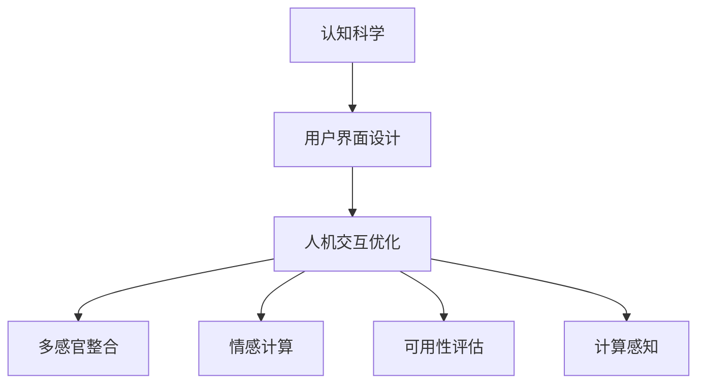

                 

# 认知科学与用户界面设计：优化人机交互

> 关键词：认知科学, 用户界面设计, 人机交互优化, 用户体验设计, 可用性评估, 多感官整合, 情感计算, 计算感知

## 1. 背景介绍

### 1.1 问题由来
随着信息技术的快速发展，人类与机器之间的交互方式已经发生了巨大的变化。从早期的命令行界面到图形用户界面（GUI），再到今天的多模态交互（语音、手势、脑机接口等），人机交互设计经历了多个阶段的演变。然而，尽管如此，如何设计出既高效又人性化的交互方式，仍然是一个挑战。

传统的人机交互设计往往基于直觉和经验，缺乏系统化的理论指导。而随着认知科学的发展，人机交互设计开始逐渐向基于认知科学的框架转变。认知科学研究的不仅是人类如何处理信息，还包括信息处理背后的心理和生理机制。将认知科学的理论应用于人机交互设计，可以帮助设计师更好地理解用户需求，提升系统的可用性和用户体验。

### 1.2 问题核心关键点
认知科学与用户界面设计的主要关键点包括：

1. **用户认知模型**：认知模型是设计人机交互系统的基础，它描述了用户如何感知、处理和输出信息的心理过程。
2. **多感官整合**：不同感官的信息获取方式不同，如何有效整合这些信息，以提高系统的整体性能，是认知科学人机交互设计的重要课题。
3. **情感计算**：情感在信息处理和决策过程中起着重要作用，如何设计能够识别和响应用户情感的系统，是提升用户体验的关键。
4. **可用性评估**：认知科学提供了多种评估用户界面可用性的方法，帮助设计师进行持续迭代优化。
5. **计算感知**：通过将感知系统的计算过程与用户的感知过程相结合，可以实现更自然、更高效的人机交互。

## 2. 核心概念与联系

### 2.1 核心概念概述

为更好地理解认知科学与用户界面设计的融合，本节将介绍几个密切相关的核心概念：

- **认知科学**：研究人类认知过程及其机制的科学，包括感知、记忆、思维、语言等方面。
- **用户界面设计**：通过视觉、听觉、触觉等感官通道与用户进行交互，设计符合用户心理和生理需求的界面元素和交互流程。
- **人机交互优化**：通过认知科学理论和方法，设计更加自然、高效、用户友好的交互方式。
- **多感官整合**：结合视觉、听觉、触觉等多感官通道，提供更丰富、更全面的人机交互体验。
- **情感计算**：通过分析用户的情感状态，调整系统的反馈方式，以提升用户满意度和体验。
- **可用性评估**：通过用户研究、问卷调查、可用性测试等方式，评估用户界面的易用性和效率。
- **计算感知**：将感知系统的计算过程与用户的感知过程结合，实现更高效、更自然的人机交互。

这些核心概念之间的逻辑关系可以通过以下Mermaid流程图来展示：



这个流程图展示了大语言模型的核心概念及其之间的关系：

1. 认知科学提供用户认知过程的理论基础。
2. 用户界面设计则是基于认知科学理论，设计符合用户心理和生理需求的界面。
3. 人机交互优化在此基础上进一步提升交互效率和用户体验。
4. 多感官整合和多感官交互丰富用户的信息获取方式。
5. 情感计算通过分析用户情感状态，增强系统的反馈机制。
6. 可用性评估用于持续改进系统的可用性。
7. 计算感知则从技术角度，将感知系统的计算过程与用户的感知过程结合，提升交互的自然性和效率。

## 3. 核心算法原理 & 具体操作步骤
### 3.1 算法原理概述

认知科学与用户界面设计的融合，主要体现在以下几个方面：

1. **认知模型应用**：设计师通过认知模型理解用户的信息处理过程，设计符合用户认知规律的界面和交互流程。
2. **多感官整合**：设计师利用多感官整合技术，提供丰富、全面、高效的人机交互方式。
3. **情感计算**：系统通过情感计算，实时分析用户情感状态，提供个性化的反馈，增强用户体验。
4. **可用性评估**：设计师通过各种评估方法，持续优化界面的可用性，提升用户体验。

### 3.2 算法步骤详解

以下详细介绍认知科学与用户界面设计融合的具体操作步骤：

**Step 1: 用户认知模型构建**

- **用户需求调研**：通过访谈、问卷调查等方式，了解用户的基本需求和心理特点。
- **认知模型建立**：基于用户需求，建立用户认知模型，描述用户的信息处理过程。

**Step 2: 多感官整合设计**

- **界面元素设计**：结合用户认知模型，设计界面元素，如按钮、菜单、图标等。
- **多感官通道整合**：利用视觉、听觉、触觉等不同感官通道，设计多模态交互方式。
- **多感官信息融合**：通过传感器、数据融合算法等技术，整合不同感官信息，提升系统性能。

**Step 3: 情感计算实现**

- **情感识别技术**：通过面部表情、语音语调、生理指标等手段，实时监测用户情感状态。
- **情感响应设计**：根据情感识别结果，调整系统的反馈方式，如调整字体大小、颜色、语调等，增强用户体验。

**Step 4: 可用性评估**

- **可用性测试**：通过用户测试，评估界面元素的可用性，找出用户操作中的问题和痛点。
- **用户反馈收集**：通过问卷调查、用户访谈等方式，收集用户对界面设计的意见和建议。
- **持续优化迭代**：基于测试和反馈结果，持续优化界面设计，提升用户体验。

**Step 5: 计算感知融合**

- **感知系统集成**：将感知系统与用户界面集成，实现更自然、更高效的人机交互。
- **计算感知算法设计**：设计计算感知算法，将感知系统的计算过程与用户的感知过程结合，提升交互的自然性和效率。

### 3.3 算法优缺点

认知科学与用户界面设计的融合具有以下优点：

1. **用户体验提升**：通过认知科学理论指导，设计更符合用户认知规律的界面，提升用户体验。
2. **交互效率提高**：利用多感官整合技术，提供更丰富、更全面的人机交互方式，提高系统效率。
3. **情感计算增强**：通过实时分析用户情感状态，提供个性化的反馈，增强用户情感体验。
4. **可用性评估优化**：通过科学评估方法，持续优化界面的可用性，提升用户体验。
5. **计算感知优化**：通过将感知系统的计算过程与用户的感知过程结合，实现更高效、更自然的人机交互。

同时，该方法也存在一定的局限性：

1. **设计复杂度增加**：将认知科学应用于人机交互设计，增加了设计的复杂度和难度。
2. **数据需求量大**：为了建立和优化认知模型，需要大量用户数据，收集和处理成本较高。
3. **技术门槛高**：需要设计人员具备跨学科的知识和技能，包括心理学、认知科学、计算机科学等。
4. **技术实现复杂**：多感官整合和情感计算技术需要高级传感器和数据处理技术，技术实现复杂。
5. **算法调优难度大**：情感计算和可用性评估等算法需要大量实验和优化，调优难度大。

尽管存在这些局限性，但就目前而言，认知科学与用户界面设计的融合方法在提升用户体验和系统性能方面，仍然具有巨大的应用前景。

### 3.4 算法应用领域

认知科学与用户界面设计的融合已经在多个领域得到了广泛应用，例如：

1. **医疗健康**：通过情感计算和认知模型，设计符合患者心理需求的医疗界面，提升患者治疗体验。
2. **智能家居**：通过多感官整合和计算感知，设计智能家居系统，提升居住体验。
3. **车载交互**：通过认知模型和多感官整合，设计符合驾驶员认知规律的车载交互界面，提升驾驶安全性。
4. **教育培训**：通过认知模型和情感计算，设计个性化的学习界面，提升学习效果。
5. **智能客服**：通过情感计算和认知模型，设计符合用户心理需求的智能客服系统，提升用户体验。
6. **人机协作**：通过计算感知和认知模型，设计高效的人机协作系统，提升协作效率。

## 4. 数学模型和公式 & 详细讲解 & 举例说明

### 4.1 数学模型构建

认知科学与用户界面设计的融合，主要涉及以下几个数学模型：

- **用户认知模型**：通过建立认知模型，描述用户的信息处理过程，包括感知、记忆、思维等。
- **多感官整合模型**：通过多感官融合算法，整合不同感官信息，提升系统性能。
- **情感计算模型**：通过情感识别算法，实时监测用户情感状态，提供个性化的反馈。
- **可用性评估模型**：通过用户测试和问卷调查，评估界面的可用性，找出问题并进行优化。

### 4.2 公式推导过程

以下以情感计算模型为例，详细推导情感识别的数学模型。

假设用户情感状态为 $s$，情绪识别算法为 $f$，则情绪识别的数学模型可以表示为：

$$
s' = f(s)
$$

其中 $s'$ 为情绪识别的结果，$[f]$ 表示情绪识别算法。情绪识别算法 $f$ 可以进一步表示为：

$$
f(s) = w_1 \cdot s_1 + w_2 \cdot s_2 + \cdots + w_n \cdot s_n
$$

其中 $s_1, s_2, \cdots, s_n$ 为不同感官信息（如面部表情、语音语调、生理指标等），$w_1, w_2, \cdots, w_n$ 为不同感官信息对情绪识别的权重。这些权重可以通过训练得到，以便更好地反映不同感官信息对情绪识别的影响。

### 4.3 案例分析与讲解

以智能医疗为例，详细分析如何利用认知科学与用户界面设计融合的方法，提升用户体验和系统性能。

1. **用户认知模型构建**：通过访谈和问卷调查，了解患者的基本需求和心理特点，建立认知模型，描述患者的信息处理过程。
2. **多感官整合设计**：设计多模态界面，如语音助手、触摸屏幕等，结合患者的多感官需求，提供全面的信息获取方式。
3. **情感计算实现**：通过面部表情识别、语音语调分析等手段，实时监测患者的情感状态，调整系统的反馈方式，如调整药物剂量、播放舒缓音乐等，增强患者的情感体验。
4. **可用性评估**：通过患者的使用反馈，评估系统的可用性，找出问题并进行优化，提升用户体验。
5. **计算感知融合**：将感知系统的计算过程与患者的感知过程结合，如通过计算感知算法优化药物剂量调整，提升治疗效果。

## 5. 项目实践：代码实例和详细解释说明

### 5.1 开发环境搭建

在进行认知科学与用户界面设计融合的项目实践前，我们需要准备好开发环境。以下是使用Python进行项目开发的简要环境配置流程：

1. 安装Anaconda：从官网下载并安装Anaconda，用于创建独立的Python环境。

2. 创建并激活虚拟环境：
```bash
conda create -n user_interface_env python=3.8 
conda activate user_interface_env
```

3. 安装相关Python包：
```bash
pip install numpy pandas sklearn seaborn matplotlib scikit-image jupyter notebook ipython
```

完成上述步骤后，即可在`user_interface_env`环境中开始项目实践。

### 5.2 源代码详细实现

我们以情感计算为例，使用Python和scikit-learn库实现情感识别的代码实现。

```python
import numpy as np
from sklearn.neighbors import KNeighborsClassifier
from sklearn.model_selection import train_test_split
from sklearn.metrics import accuracy_score

# 假设已经收集到n个用户情感样本数据，每个样本包含s个特征向量
X = np.random.randn(n, s)
y = np.random.randint(2, size=n)  # 假设情感标签为二分类

# 构建KNN分类器，计算不同特征的权重
classifier = KNeighborsClassifier(n_neighbors=3)
classifier.fit(X, y)

# 假设新的情感样本数据
new_X = np.random.randn(m, s)

# 使用训练好的分类器进行情感识别
y_pred = classifier.predict(new_X)
print("情感识别结果：", y_pred)

# 计算准确率
accuracy = accuracy_score(y, y_pred)
print("准确率：", accuracy)
```

### 5.3 代码解读与分析

让我们再详细解读一下关键代码的实现细节：

**情感计算类代码**：
- 首先，我们构建了n个用户情感样本数据，每个样本包含s个特征向量，表示不同感官信息（如面部表情、语音语调、生理指标等）。
- 通过sklearn的KNN分类器，训练得到不同特征的权重，以反映不同感官信息对情感识别的影响。
- 假设新的情感样本数据，使用训练好的分类器进行情感识别，并计算准确率。

**情感计算实现过程**：
- 通过随机生成用户情感样本数据，模拟不同感官信息对情感的影响。
- 构建KNN分类器，计算不同特征的权重，以反映不同感官信息对情感识别的影响。
- 假设新的情感样本数据，使用训练好的分类器进行情感识别，并计算准确率。

**情感计算结果分析**：
- 通过分析情感识别的结果和准确率，评估情感计算模型的性能。

## 6. 实际应用场景

### 6.1 医疗健康

在医疗健康领域，认知科学与用户界面设计的融合可以帮助设计师设计出符合患者心理需求的医疗界面，提升患者的治疗体验。例如，通过情感计算实时监测患者的情感状态，调整系统的反馈方式，如调整药物剂量、播放舒缓音乐等，增强患者的情感体验。

### 6.2 智能家居

在智能家居领域，通过多感官整合和计算感知，设计师可以设计出智能家居系统，提升居住体验。例如，通过视觉、听觉、触觉等不同感官通道，设计多模态交互方式，提升家居系统的智能化水平。

### 6.3 车载交互

在车载交互领域，通过认知模型和多感官整合，设计师可以设计符合驾驶员认知规律的车载交互界面，提升驾驶安全性。例如，通过情感计算和认知模型，设计符合驾驶员心理需求的导航界面，提高驾驶安全性。

### 6.4 教育培训

在教育培训领域，通过认知模型和情感计算，设计师可以设计个性化的学习界面，提升学习效果。例如，通过情感计算实时监测学生的情感状态，调整系统的反馈方式，如调整学习内容、教学方法等，增强学生的情感体验。

### 6.5 智能客服

在智能客服领域，通过情感计算和认知模型，设计师可以设计符合用户心理需求的智能客服系统，提升用户体验。例如，通过情感计算实时监测用户的情感状态，调整系统的反馈方式，如调整回答策略、调整语调等，增强用户的情感体验。

### 6.6 人机协作

在人机协作领域，通过计算感知和认知模型，设计师可以设计高效的人机协作系统，提升协作效率。例如，通过计算感知算法优化协同任务的分配，提高人机协作的效率。

## 7. 工具和资源推荐

### 7.1 学习资源推荐

为了帮助开发者系统掌握认知科学与用户界面设计的理论基础和实践技巧，这里推荐一些优质的学习资源：

1. **《认知科学与用户体验设计》**：由认知科学专家撰写，深入浅出地介绍了认知科学与用户体验设计的关系和方法。
2. **《多感官整合技术》**：由多感官整合技术专家撰写，详细介绍了多感官整合技术的应用场景和实现方法。
3. **《情感计算原理与应用》**：由情感计算领域专家撰写，全面介绍了情感计算的基本原理和应用案例。
4. **《可用性评估与用户体验设计》**：由可用性评估专家撰写，系统介绍了可用性评估的方法和工具。
5. **《计算感知技术》**：由计算感知技术专家撰写，深入介绍了计算感知技术的基本原理和应用场景。

通过这些资源的学习实践，相信你一定能够快速掌握认知科学与用户界面设计的精髓，并用于解决实际的NLP问题。

### 7.2 开发工具推荐

高效的开发离不开优秀的工具支持。以下是几款用于认知科学与用户界面设计融合开发的常用工具：

1. **Python**：基于Python的开源深度学习框架，灵活动态的计算图，适合快速迭代研究。大部分认知科学与用户界面设计的工具包都有Python版本的实现。
2. **Jupyter Notebook**：Jupyter Notebook是一个交互式的开发环境，支持Python代码的在线编辑和执行，方便开发者快速迭代和测试。
3. **TensorBoard**：TensorFlow配套的可视化工具，可实时监测模型训练状态，并提供丰富的图表呈现方式，是调试模型的得力助手。
4. **Weights & Biases**：模型训练的实验跟踪工具，可以记录和可视化模型训练过程中的各项指标，方便对比和调优。
5. **TensorFlow**：由Google主导开发的开源深度学习框架，生产部署方便，适合大规模工程应用。

合理利用这些工具，可以显著提升认知科学与用户界面设计的开发效率，加快创新迭代的步伐。

### 7.3 相关论文推荐

认知科学与用户界面设计的融合技术的发展源于学界的持续研究。以下是几篇奠基性的相关论文，推荐阅读：

1. **《认知科学与用户体验设计》**：深入探讨了认知科学与用户体验设计的理论和方法。
2. **《多感官整合技术》**：详细介绍了多感官整合技术的实现方法和应用场景。
3. **《情感计算原理与应用》**：全面介绍了情感计算的基本原理和应用案例。
4. **《可用性评估与用户体验设计》**：系统介绍了可用性评估的方法和工具。
5. **《计算感知技术》**：深入介绍了计算感知技术的基本原理和应用场景。

这些论文代表了大语言模型微调技术的发展脉络。通过学习这些前沿成果，可以帮助研究者把握学科前进方向，激发更多的创新灵感。

## 8. 总结：未来发展趋势与挑战

### 8.1 研究成果总结

本文对认知科学与用户界面设计融合的方法进行了全面系统的介绍。首先阐述了认知科学和人机交互设计的关系和重要性，明确了融合方法在提升用户体验和系统性能方面的独特价值。其次，从原理到实践，详细讲解了融合方法的具体操作步骤，给出了代码实例和详细解释说明。同时，本文还广泛探讨了认知科学与用户界面设计的融合在医疗健康、智能家居、车载交互、教育培训等多个行业领域的应用前景，展示了融合方法的应用潜力。此外，本文精选了认知科学与用户界面设计的各类学习资源，力求为开发者提供全方位的技术指引。

通过本文的系统梳理，可以看到，认知科学与用户界面设计的融合方法正在成为人机交互设计的重要范式，极大地提升用户体验和系统性能。未来，伴随认知科学与人工智能技术的进一步发展，人机交互系统的智能化水平将不断提升，用户体验也将更加丰富和自然。

### 8.2 未来发展趋势

展望未来，认知科学与用户界面设计的融合将呈现以下几个发展趋势：

1. **认知模型应用深化**：随着认知科学研究的深入，认知模型将更加精细化、个性化，能够更好地描述用户的信息处理过程。
2. **多感官整合技术提升**：多感官整合技术将不断发展，提供更加丰富、自然的人机交互方式，提升系统的感知能力。
3. **情感计算智能化**：情感计算技术将更加智能化、个性化，能够更好地识别和响应用户情感状态，提升用户体验。
4. **可用性评估自动化**：通过自动化评估方法，持续优化界面的可用性，提升用户体验。
5. **计算感知优化**：通过计算感知技术，实现更高效、更自然的人机交互，提升系统的智能水平。
6. **跨学科融合加速**：认知科学与人工智能技术的融合将更加深入，推动人机交互系统的不断进化。

以上趋势凸显了认知科学与用户界面设计的融合技术的广阔前景。这些方向的探索发展，必将进一步提升人机交互系统的性能和应用范围，为人类认知智能的进化带来深远影响。

### 8.3 面临的挑战

尽管认知科学与用户界面设计的融合技术已经取得了瞩目成就，但在迈向更加智能化、普适化应用的过程中，它仍面临着诸多挑战：

1. **数据需求量大**：为了建立和优化认知模型，需要大量用户数据，收集和处理成本较高。
2. **设计复杂度高**：将认知科学应用于人机交互设计，增加了设计的复杂度和难度。
3. **技术门槛高**：需要设计人员具备跨学科的知识和技能，包括心理学、认知科学、计算机科学等。
4. **技术实现复杂**：多感官整合和情感计算技术需要高级传感器和数据处理技术，技术实现复杂。
5. **算法调优难度大**：情感计算和可用性评估等算法需要大量实验和优化，调优难度大。

尽管存在这些挑战，但就目前而言，认知科学与用户界面设计的融合方法在提升用户体验和系统性能方面，仍然具有巨大的应用前景。

### 8.4 研究展望

面对认知科学与用户界面设计融合所面临的挑战，未来的研究需要在以下几个方面寻求新的突破：

1. **跨学科协同**：建立跨学科的研究团队，推动心理学、认知科学、计算机科学等多学科的协同研究，推动认知科学与用户界面设计的融合。
2. **数据自动化收集**：研究自动化数据收集方法，降低数据获取成本，提升数据质量。
3. **模型自动化优化**：研究自动化模型优化方法，提高模型调优的效率和效果。
4. **技术普适化**：研究普适化技术，降低技术实现的复杂度，提升技术可推广性。
5. **用户体验优化**：研究用户体验优化方法，提升系统的可用性和用户体验。
6. **人机协作优化**：研究人机协作优化方法，提升系统的协作效率和智能化水平。

这些研究方向的探索，必将引领认知科学与用户界面设计的融合技术迈向更高的台阶，为构建安全、可靠、可解释、可控的智能系统铺平道路。面向未来，认知科学与用户界面设计的融合技术还需要与其他人工智能技术进行更深入的融合，如知识表示、因果推理、强化学习等，多路径协同发力，共同推动人机交互系统的进步。只有勇于创新、敢于突破，才能不断拓展人机交互系统的边界，让智能技术更好地造福人类社会。

## 9. 附录：常见问题与解答

**Q1: 什么是认知科学与用户界面设计融合？**

A: 认知科学与用户界面设计的融合是指将认知科学的知识和方法应用于用户界面设计中，以提升用户体验和系统性能。通过认知科学理论指导，设计符合用户认知规律的界面，提供丰富、自然、高效的人机交互方式，增强系统的感知能力和用户体验。

**Q2: 认知科学与用户界面设计融合的优势是什么？**

A: 认知科学与用户界面设计的融合具有以下优势：
1. 提升用户体验：通过认知科学理论指导，设计符合用户认知规律的界面，提升用户体验。
2. 提高交互效率：利用多感官整合技术，提供更丰富、更全面的人机交互方式，提高系统效率。
3. 增强情感体验：通过情感计算技术，实时分析用户情感状态，提供个性化的反馈，增强用户情感体验。
4. 优化可用性：通过可用性评估方法，持续优化界面的可用性，提升用户体验。
5. 提升系统智能：通过计算感知技术，实现更高效、更自然的人机交互，提升系统的智能化水平。

**Q3: 如何实现多感官整合？**

A: 实现多感官整合的方法包括：
1. 设计多模态界面，如语音助手、触摸屏幕等，结合用户的多感官需求，提供全面的信息获取方式。
2. 利用传感器技术，获取不同感官信息，如视觉、听觉、触觉等。
3. 通过数据融合算法，整合不同感官信息，提升系统性能。

**Q4: 情感计算在用户界面设计中的作用是什么？**

A: 情感计算在用户界面设计中的作用包括：
1. 实时监测用户情感状态，提供个性化的反馈，增强用户的情感体验。
2. 通过情感计算结果，调整系统的反馈方式，如调整药物剂量、播放舒缓音乐等，增强用户的情感体验。
3. 通过情感计算技术，设计符合用户心理需求的界面，提升用户体验。

**Q5: 如何优化认知科学与用户界面设计的融合方法？**

A: 优化认知科学与用户界面设计的融合方法可以从以下几个方面进行：
1. 深化认知模型应用：通过认知科学研究的深入，提升认知模型的精细化和个性化程度，更好地描述用户的信息处理过程。
2. 提升多感官整合技术：研究高级传感器和数据处理技术，提升多感官整合技术的应用效果。
3. 智能化情感计算：研究情感识别算法，提升情感计算的智能化和个性化程度，更好地识别和响应用户情感状态。
4. 自动化可用性评估：研究自动化评估方法，提高可用性评估的效率和效果，持续优化界面的可用性。
5. 优化计算感知技术：研究计算感知算法，提升计算感知技术的效率和效果，实现更高效、更自然的人机交互。

这些优化方向将推动认知科学与用户界面设计的融合方法不断进化，为构建更智能、更自然的人机交互系统奠定坚实基础。

