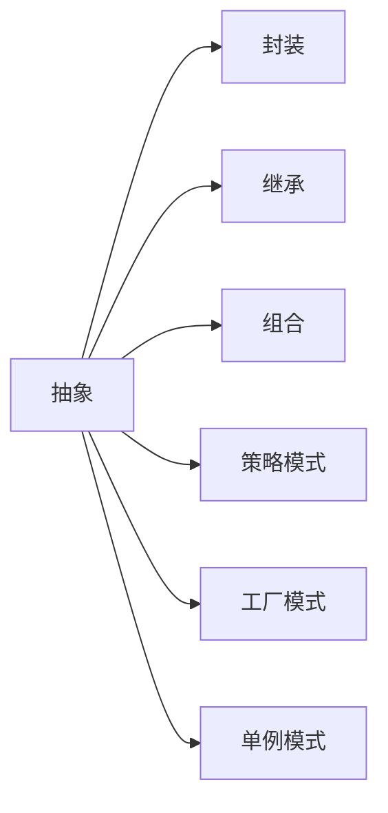

                 

# 设计模式的分类与应用场景

## 1. 背景介绍

### 1.1 问题由来

在设计软件的架构和实现时，我们常常会遇到重复的、相似的、复杂的问题。如何设计出易于维护、扩展的代码，如何使得代码更加优雅、简洁，一直是软件开发者的挑战。设计模式正是为了解决这些问题而提出的设计理念和解决方案。

设计模式（Design Pattern）是经过实践验证的、被广泛应用的成功代码设计策略，它们在复杂的软件系统中尤为适用。通过设计模式，我们可以复用已有经验，减少重复工作，提升开发效率，同时提升系统的可读性和可维护性。

### 1.2 问题核心关键点

设计模式的核心在于如何通过抽象、封装、复用等原则，解决软件设计中的一些常见问题。在应用设计模式时，我们需要关注以下几个关键点：

- 问题抽象：将问题进行抽象，定义其核心特征和行为。
- 解决方案：设计出符合问题的解决方案，定义其接口和实现。
- 适用场景：明确设计模式的适用场景和局限。
- 优缺点：分析设计模式的优点和缺点，选择合适的应用场景。

## 2. 核心概念与联系

### 2.1 核心概念概述

在设计模式中，我们常用以下几个核心概念：

- 抽象（Abstraction）：隐藏实现细节，只暴露必要接口。
- 封装（Encapsulation）：将数据和行为封装在一个单元中，隐藏内部实现，只暴露接口。
- 继承（Inheritance）：通过继承，复用已有类和代码。
- 组合（Composition）：通过组合，将松散耦合的对象组合起来，形成一个功能更强大的组件。
- 策略模式（Strategy）：通过策略模式，根据具体场景选择不同的策略。
- 工厂模式（Factory）：通过工厂模式，动态创建对象。
- 单例模式（Singleton）：通过单例模式，确保一个类只有一个实例。

这些核心概念相互关联，通过合理运用设计模式，可以构建出优雅、可维护、可扩展的软件系统。

### 2.2 核心概念原理和架构的 Mermaid 流程图



## 3. 核心算法原理 & 具体操作步骤

### 3.1 算法原理概述

设计模式是基于已有的经验总结出的解决特定问题的通用解决方案。它们通常包含以下几个步骤：

- 问题定义：明确问题，定义其核心特征和行为。
- 抽象解决方案：设计解决方案，定义其接口和实现。
- 实例化解决方案：根据具体场景实例化解决方案，形成设计模式。
- 应用场景：明确设计模式的适用场景和局限。

### 3.2 算法步骤详解

以单例模式（Singleton Pattern）为例，详细讲解其设计步骤：

**步骤1: 定义接口**
- 定义一个接口，用于创建单例对象。

```java
public interface Singleton {
    void operate();
}
```

**步骤2: 实现单例类**
- 实现单例类，包含私有构造函数和静态私有实例变量。

```java
public class SingletonImpl implements Singleton {
    private static SingletonImpl instance = null;
    private SingletonImpl() {}
    public static Singleton getInstance() {
        if (instance == null) {
            instance = new SingletonImpl();
        }
        return instance;
    }
    public void operate() {
        System.out.println("Hello, singleton!");
    }
}
```

**步骤3: 使用单例类**
- 在需要使用单例对象的地方，通过接口获取单例实例。

```java
Singleton singleton = SingletonImpl.getInstance();
singleton.operate();
```

### 3.3 算法优缺点

**优点**：

- 单例模式确保了类只有一个实例，简化了全局状态的管理。
- 单例模式提供了线程安全的访问方式，避免了多个线程同时访问造成的数据冲突。

**缺点**：

- 单例模式可能会导致类与类之间的耦合性过高，不利于系统的扩展和维护。
- 单例模式不适用于多线程环境，可能会影响系统性能。

### 3.4 算法应用领域

单例模式在各种场景中都有广泛应用，例如：

- 配置类：全局配置信息管理。
- 日志类：记录系统运行日志。
- 线程池：创建和管理线程池。

## 4. 数学模型和公式 & 详细讲解

### 4.1 数学模型构建

设计模式的核心在于设计合适的抽象接口和实现，其数学模型可以简单概括为：

- 接口定义：定义接口 `I`，包含方法集合 `M`。
- 实现类：实现类 `C`，继承接口 `I`，实现方法集合 `M`。
- 实例化：根据需求，实例化 `C` 类对象 `o`。

### 4.2 公式推导过程

以工厂模式（Factory Pattern）为例，推导其数学模型和公式。

假设我们需要生产不同类型的汽车（Cars），定义一个工厂类 `CarFactory`，负责创建不同类型的汽车：

```java
public abstract class Car {
    public abstract void operate();
}
public class Sedan extends Car {
    public void operate() {
        System.out.println("This is a sedan!");
    }
}
public class SUV extends Car {
    public void operate() {
        System.out.println("This is a SUV!");
    }
}
```

定义工厂类 `CarFactory`，包含创建汽车的方法：

```java
public class CarFactory {
    public static Car createCar(String type) {
        if (type.equals("sedan")) {
            return new Sedan();
        } else if (type.equals("suv")) {
            return new SUV();
        } else {
            return null;
        }
    }
}
```

### 4.3 案例分析与讲解

在实际应用中，工厂模式可以用于创建各种类型的对象，而不需要关心其具体实现。例如，一个电商网站，需要根据用户选择的配送方式创建不同的配送对象。通过工厂模式，可以简单地实现：

```java
enum Delivery {
    EXPRESS, STANDARD, FREE;
}
public class DeliveryFactory {
    public static Delivery createDelivery(DeliveryType type) {
        if (type == DeliveryType.EXPRESS) {
            return new ExpressDelivery();
        } else if (type == DeliveryType.STANDARD) {
            return new StandardDelivery();
        } else if (type == DeliveryType.FREE) {
            return new FreeDelivery();
        } else {
            return null;
        }
    }
}
```

在工厂模式中，我们通过定义一个抽象的 `DeliveryFactory` 接口，隐藏了具体创建配送对象的实现细节，从而实现了代码的复用和扩展。

## 5. 项目实践：代码实例和详细解释说明

### 5.1 开发环境搭建

在进行设计模式实践时，我们通常使用 Java 或 C# 等面向对象的语言。下面以 Java 为例，介绍开发环境的搭建。

1. 安装 JDK：从官网下载并安装 Java Development Kit（JDK）。
2. 安装 IDE：安装 IntelliJ IDEA 或 Eclipse 等 IDE。
3. 配置环境变量：配置 JAVA_HOME、PATH 等环境变量。
4. 编写示例代码：在 IDE 中创建一个新项目，编写设计模式示例代码。

### 5.2 源代码详细实现

以观察者模式（Observer Pattern）为例，展示其详细实现。

```java
public abstract class Subject {
    private List<Observer> observers = new ArrayList<>();
    public void attach(Observer observer) {
        observers.add(observer);
    }
    public void detach(Observer observer) {
        observers.remove(observer);
    }
    public void notifyObservers() {
        for (Observer observer : observers) {
            observer.update();
        }
    }
    public void setInfo(String info) {
        this.info = info;
        notifyObservers();
    }
    private String info;
}
public abstract class Observer {
    public abstract void update();
}
public class ConcreteSubject extends Subject {
    public void setInfo(String info) {
        super.setInfo(info);
        System.out.println("Subject info: " + info);
    }
}
public class ConcreteObserver extends Observer {
    private Subject subject;
    public ConcreteObserver(Subject subject) {
        this.subject = subject;
        subject.attach(this);
    }
    public void update() {
        System.out.println("Observer info: " + subject.getInfo());
    }
}
```

### 5.3 代码解读与分析

**Subject**：抽象主题类，定义了添加、删除、通知观察者的方法。
**ConcreteSubject**：具体主题类，实现了 `setInfo` 方法，并在方法中通知观察者。
**Observer**：抽象观察者类，定义了更新方法。
**ConcreteObserver**：具体观察者类，实现了 `update` 方法，并在方法中获取主题信息。

在实际使用中，可以创建一个主题对象，添加多个观察者，并通过 `setInfo` 方法通知观察者。例如：

```java
Subject subject = new ConcreteSubject();
Observer observer1 = new ConcreteObserver(subject);
Observer observer2 = new ConcreteObserver(subject);
subject.setInfo("Hello, observer1!");
subject.setInfo("Hello, observer2!");
```

## 6. 实际应用场景

### 6.1 观察者模式

观察者模式在各种场景中都有广泛应用，例如：

- 事件通知：事件处理器的订阅和触发。
- 状态更新：系统状态的变化通知。
- 日志记录：系统日志的记录和输出。

### 6.2 策略模式

策略模式可以用于动态选择不同的算法，例如：

- 算法选择：根据用户需求选择不同的排序算法。
- 规则引擎：根据用户需求选择不同的业务规则。
- 计算器：根据用户需求选择不同的计算方式。

### 6.3 工厂模式

工厂模式可以用于创建各种类型的对象，例如：

- 数据库连接：根据连接类型创建不同的数据库连接对象。
- 任务调度：根据任务类型创建不同的任务对象。
- 视图渲染：根据视图类型创建不同的视图对象。

## 7. 工具和资源推荐

### 7.1 学习资源推荐

1. 《设计模式：可复用面向对象软件的基础》：GoF 的经典之作，详细介绍设计模式的原理和应用。
2. 《Effective Java》：Effective 系列的经典之作，涵盖 Java 开发中的各种最佳实践。
3. Udemy 设计模式课程：Udemy 上高质量的设计模式教学视频，涵盖各种设计模式的详细讲解和示例。
4. GitHub 设计模式项目：GitHub 上开源的设计模式示例项目，供学习和参考。
5. Pattern Matching with Java 8：Java 8 中如何使用设计模式，适合 Java 开发者参考。

### 7.2 开发工具推荐

1. IntelliJ IDEA：强大的 Java IDE，支持设计模式的自动代码生成和重构。
2. Eclipse：另一个流行的 Java IDE，支持设计模式的重构和调试。
3. Visual Studio：支持 C# 开发的设计模式工具，可以自动生成代码和重构。

### 7.3 相关论文推荐

1. "Design Patterns: Elements of Reusable Object-Oriented Software"：GoF 的权威著作，详细介绍设计模式的原理和应用。
2. "Pattern-Oriented Software Architecture"：Erich Gamma 的著作，系统介绍了各种设计模式的原理和实现。
3. "Refactoring: Improving the Design of Existing Code"：Martin Fowler 的经典之作，介绍代码重构的各种策略。

## 8. 总结：未来发展趋势与挑战

### 8.1 总结

设计模式是基于经验的成功代码设计策略，是软件开发中不可或缺的工具。通过设计模式，我们可以复用已有经验，提升开发效率，同时提升系统的可读性和可维护性。

本文详细介绍了设计模式的原理、步骤和应用场景，通过具体的 Java 示例展示了如何实现设计模式。通过本文的系统梳理，可以看到，设计模式在各种场景中都有广泛应用，能够帮助开发者更好地解决复杂的软件设计问题。

### 8.2 未来发展趋势

未来设计模式的发展趋势包括：

- 面向全栈的设计模式：未来的设计模式将更加关注全栈开发，涵盖前后端、数据库、云服务等各个环节。
- 结合机器学习的设计模式：设计模式将更多地结合机器学习、人工智能等技术，提升系统的智能化水平。
- 基于微服务的设计模式：设计模式将更多地应用于微服务架构中，提升系统的模块化和可扩展性。

### 8.3 面临的挑战

设计模式在应用过程中仍面临诸多挑战：

- 适用性问题：设计模式在实际应用中需要考虑适用性问题，不同场景下可能存在不同的设计模式。
- 过度使用：设计模式可能被过度使用，导致代码复杂度和维护难度增加。
- 理解难度：设计模式需要理解其原理和接口，对于一些复杂的设计模式，理解难度较大。

### 8.4 研究展望

未来的研究需要进一步探索设计模式的适用性、可扩展性和可理解性。通过不断优化设计模式，提升其适用性和易用性，使得设计模式更好地服务于软件开发实践。

## 9. 附录：常见问题与解答

**Q1: 设计模式有哪些分类？**

A: 设计模式可以分为创建型模式、结构型模式和行为型模式三大类。其中，创建型模式关注对象的创建方式，结构型模式关注对象之间的组织关系，行为型模式关注对象之间的交互方式。

**Q2: 如何选择合适的设计模式？**

A: 选择合适的设计模式需要考虑以下几个因素：
1. 问题特性：明确问题的核心特性和行为，选择合适的设计模式。
2. 代码复用：考虑代码的复用性，避免重复编写代码。
3. 扩展性：考虑系统的扩展性，方便未来功能的添加和修改。
4. 性能需求：考虑系统的性能需求，选择合适的设计模式。

**Q3: 设计模式和编码规范有何不同？**

A: 设计模式和编码规范都是软件开发中常用的工具，但侧重点不同。设计模式关注问题的抽象和解决策略，编码规范关注代码的规范化和标准化，两者相辅相成，共同提升软件质量。

**Q4: 设计模式是否适用于所有场景？**

A: 设计模式并不是万能的，需要根据具体场景选择合适的设计模式。在应用设计模式时，需要考虑设计模式的核心特性和适用场景，避免过度使用。

**Q5: 如何学习和应用设计模式？**

A: 学习和应用设计模式需要从理论到实践两个方面入手：
1. 理论学习：阅读相关的设计模式书籍和文章，理解设计模式的核心思想和应用场景。
2. 实践应用：在实际项目中，根据具体问题选择合适的设计模式，实现其原理和接口。

---

作者：禅与计算机程序设计艺术 / Zen and the Art of Computer Programming

