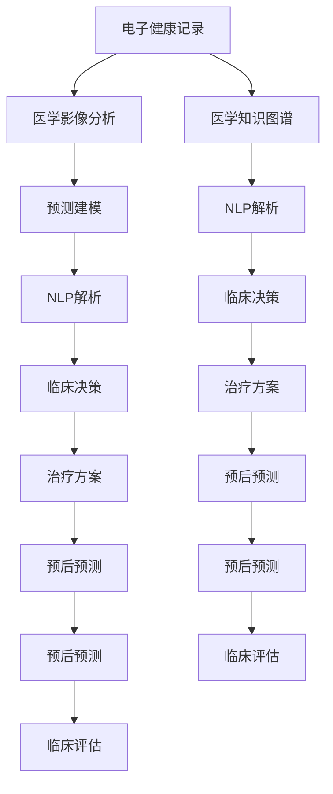

                 

# 诊断和治疗：人类计算如何改善医疗保健

> 关键词：医疗保健,诊断,治疗,人类计算,人工智能,机器学习,深度学习,医疗图像分析,电子健康记录,预测建模,医学影像处理,临床决策支持,病理学分析,生物信息学

## 1. 背景介绍

### 1.1 问题由来
随着科技进步，医疗保健领域面临着诸多挑战。人口老龄化、慢性病高发、医疗资源紧张等问题日益凸显。然而，传统医疗模式往往依赖经验判断和手工操作，效率低下、误诊率高，且难以应对复杂病例。如何借助新兴技术，提升医疗决策的科学性和精准性，已成为迫在眉睫的重要课题。

### 1.2 问题核心关键点
为应对上述挑战，人类计算在医疗保健中的应用显得尤为重要。通过结合人工智能（AI）、机器学习（ML）、深度学习（DL）等技术，可以将复杂的医学数据转化为可分析的信息，辅助医生做出更准确、更快速的诊断和治疗决策。

人类计算的核心关键点包括：
1. **数据处理与分析**：高效处理和分析海量的医学数据，包括电子健康记录、医学影像、基因组数据等。
2. **模式识别与诊断**：利用机器学习算法，自动识别医学图像中的病灶、异常、异常数据中的模式，辅助医生诊断。
3. **治疗方案优化**：结合患者病情、基因信息、病历记录等，通过优化算法推荐个性化的治疗方案。
4. **预后预测与评估**：通过建立预测模型，评估患者治疗效果和疾病风险，辅助医生制定长期治疗计划。

### 1.3 问题研究意义
医疗保健领域的精度和效率直接关系到患者的生命健康。利用人类计算技术，可以为医生提供强有力的决策辅助，降低误诊率，提高诊疗效率。同时，还能在应对突发疫情、提高公共卫生管理等方面发挥重要作用，推动医疗保健系统的整体升级。

通过研究和应用人类计算技术，可以实现以下目标：
- 提高诊疗精度和效率，提升患者满意度和医疗机构的运营效率。
- 减轻医生的工作负担，使其专注于高复杂度病例的诊治。
- 优化资源配置，合理调配医疗资源，减少医疗成本。
- 提升公共卫生管理能力，及时应对突发公共卫生事件。

## 2. 核心概念与联系

### 2.1 核心概念概述

为了更好地理解人类计算在医疗保健中的应用，本节将介绍几个核心概念及其联系：

- **电子健康记录 (Electronic Health Records, EHRs)**：记录患者从出生到死亡的全生命周期健康数据，包括病历、检验报告、影像、基因信息等。EHRs 是医疗信息化的重要组成部分，为临床决策提供数据支持。

- **医学影像分析 (Medical Image Analysis)**：利用计算机视觉和深度学习技术，对医学影像（如X光片、CT、MRI等）进行处理和分析，识别病灶、肿瘤等异常，辅助医生进行诊断。

- **医学知识图谱 (Medical Knowledge Graph)**：构建医学领域的知识图谱，整合海量的医学文献、临床指南、患者记录等，为医疗决策提供知识支撑。

- **预测建模 (Predictive Modeling)**：通过建立统计或机器学习模型，预测患者疾病风险和治疗效果，为医生制定个性化的治疗方案提供依据。

- **自然语言处理 (Natural Language Processing, NLP)**：利用NLP技术，解析和处理医学文献、病历记录等文本数据，提取有用的信息，辅助医生的诊疗决策。

这些核心概念之间存在紧密的联系，共同构成了人类计算在医疗保健中的技术框架。

### 2.2 核心概念原理和架构的 Mermaid 流程图



此流程图展示了电子健康记录、医学影像分析、医学知识图谱、预测建模和自然语言处理等核心概念之间的联系。这些技术相互协作，共同提升医疗保健的精度和效率。

## 3. 核心算法原理 & 具体操作步骤

### 3.1 算法原理概述

人类计算在医疗保健中的应用主要依赖于以下几个核心算法原理：

- **深度学习**：利用深度神经网络处理医学影像、基因数据等高维数据，通过多层次的特征提取和模式识别，实现自动化的诊断和治疗方案推荐。
- **预测建模**：通过建立统计或机器学习模型，预测患者疾病风险和治疗效果，为医生制定个性化的治疗方案提供依据。
- **自然语言处理**：利用NLP技术解析和处理医学文献、病历记录等文本数据，提取有用的信息，辅助医生的诊疗决策。

### 3.2 算法步骤详解

基于深度学习、预测建模和NLP技术的医疗计算框架，通常包括以下几个关键步骤：

**Step 1: 数据预处理与清洗**
- 收集和整理患者电子健康记录、医学影像、基因数据等，确保数据的质量和完整性。
- 对数据进行标准化、去噪、填充缺失值等预处理，确保数据一致性。

**Step 2: 特征提取与表示**
- 利用深度学习模型提取医学影像中的特征，如卷积神经网络（CNN）、循环神经网络（RNN）等。
- 通过自然语言处理技术，将病历记录、医学文献等文本数据转化为结构化特征，如词向量、句法树等。
- 利用医学知识图谱，将领域知识与数据结合，生成更有意义的表示。

**Step 3: 模型训练与优化**
- 选择合适的深度学习模型，如卷积神经网络、递归神经网络、注意力机制等，用于图像处理和序列分析。
- 通过交叉验证等技术，选择最佳模型参数和超参数，进行模型训练和优化。
- 应用正则化、dropout等技术，避免过拟合，提高模型泛化能力。

**Step 4: 诊断和治疗方案推荐**
- 使用训练好的深度学习模型，对医学影像、基因数据等进行特征提取和模式识别，辅助医生进行诊断。
- 结合预测建模和医学知识图谱，制定个性化的治疗方案，并评估治疗效果。

**Step 5: 评估与迭代**
- 在实际应用中，持续收集反馈数据，对模型进行评估和优化。
- 结合临床经验和最新医学研究成果，不断迭代模型，提升其准确性和实用性。

### 3.3 算法优缺点

基于深度学习、预测建模和NLP技术的医疗计算方法，具有以下优点：
- 处理高维数据能力强，能够自动提取复杂特征，提升诊断和治疗的精度。
- 模型泛化能力强，适用于不同医疗机构和患者群体。
- 可扩展性强，能够处理日益增长的数据和不断变化的医学知识。

同时，这些方法也存在一些局限性：
- 需要大量的高质量标注数据，标注成本高，数据获取难度大。
- 对算力和计算资源要求高，训练和推理过程耗时较长。
- 模型复杂度大，难以解释，缺乏可解释性。

### 3.4 算法应用领域

基于深度学习、预测建模和NLP技术的医疗计算方法，在医疗保健领域得到了广泛应用，涵盖以下关键领域：

- **医学影像分析**：利用深度学习技术，对X光片、CT、MRI等医学影像进行分析，自动检测病灶、肿瘤等异常，辅助医生进行诊断。
- **电子健康记录分析**：通过自然语言处理技术，解析和处理病历记录、医学文献等文本数据，提取有用的信息，辅助医生的诊疗决策。
- **基因数据分析**：利用深度学习模型，分析基因数据，预测遗传疾病的风险，指导个性化治疗。
- **预后预测与评估**：通过建立预测模型，评估患者疾病风险和治疗效果，为医生制定个性化的治疗方案提供依据。
- **临床决策支持系统**：结合医学知识图谱，为医生提供全面的临床决策支持，辅助其制定诊断和治疗方案。

此外，这些技术还被广泛应用于个性化治疗、药物研发、公共卫生管理等领域，推动了医疗保健技术的全面升级。

## 4. 数学模型和公式 & 详细讲解 & 举例说明

### 4.1 数学模型构建

医疗计算中的数学模型通常包括以下几个关键部分：

- **卷积神经网络 (CNN)**：用于医学影像的特征提取和分类。数学模型为：
$$
\text{CNN}(x)=W(x)*b
$$
其中，$x$为输入图像，$W$为卷积核权重，$b$为偏置项。

- **循环神经网络 (RNN)**：用于处理序列数据，如病历记录的文本分析。数学模型为：
$$
\text{RNN}(x)=W(x)*b
$$
其中，$x$为输入序列，$W$为循环权重矩阵，$b$为偏置项。

- **注意力机制 (Attention Mechanism)**：用于增强模型对重要信息的关注，如医学知识图谱的节点权重计算。数学模型为：
$$
\text{Attention}(q, K, V)=\text{softmax}(Q(q)K^T)/\sqrt{d_k}
$$
其中，$q$为查询向量，$K$和$V$分别为键向量和值向量，$d_k$为缩放因子。

### 4.2 公式推导过程

以医学影像分类为例，推导CNN模型的数学公式。

设输入图像$x=[x_1, x_2, ..., x_m]$，卷积核权重矩阵$W=[w_1, w_2, ..., w_m]$，偏置项$b=[b_1, b_2, ..., b_m]$，卷积操作定义为：
$$
\text{Conv}(x, W, b) = \max_{i=1..m}(\sum_j w_{ij} x_j + b_i)
$$
将上述公式推广至二维卷积，得到：
$$
\text{Conv}(x, W, b) = \max_{i=1..m}(\sum_j w_{ij} x_{ij} + b_i)
$$
其中，$x_{ij}$为图像的像素值，$w_{ij}$为卷积核的权重。

### 4.3 案例分析与讲解

以医学影像分类为例，展示CNN模型在实际应用中的效果。

- **数据准备**：收集一定量的医学影像数据，标注为正常和异常类别。
- **模型构建**：选择适当的卷积神经网络架构，如LeNet、AlexNet、VGG等，进行特征提取和分类。
- **模型训练**：使用交叉验证等技术，选择最佳模型参数和超参数，进行模型训练和优化。
- **模型评估**：在测试集上评估模型的准确率、召回率和F1分数，验证模型的泛化能力。
- **实际应用**：将训练好的模型应用于临床实践中，辅助医生进行影像分类和诊断。

## 5. 项目实践：代码实例和详细解释说明

### 5.1 开发环境搭建

在进行医疗计算项目实践前，我们需要准备好开发环境。以下是使用Python进行TensorFlow开发的环境配置流程：

1. 安装Anaconda：从官网下载并安装Anaconda，用于创建独立的Python环境。

2. 创建并激活虚拟环境：
```bash
conda create -n tf-env python=3.8 
conda activate tf-env
```

3. 安装TensorFlow：根据CUDA版本，从官网获取对应的安装命令。例如：
```bash
conda install tensorflow==2.8 tensorflow-gpu==2.8
```

4. 安装TensorFlow Addons：用于增强TensorFlow的功能，包括分布式训练、模型优化等。
```bash
conda install tensorflow-addons==0.18.0
```

5. 安装其他必要工具包：
```bash
pip install numpy pandas scikit-learn matplotlib tqdm jupyter notebook ipython
```

完成上述步骤后，即可在`tf-env`环境中开始医疗计算项目的开发。

### 5.2 源代码详细实现

这里我们以医学影像分类项目为例，展示TensorFlow实现的步骤。

首先，定义数据处理函数：

```python
import tensorflow as tf
import numpy as np

def load_and_preprocess_data(file_path):
    # 加载医学影像数据
    image = tf.io.read_file(file_path)
    image = tf.image.decode_jpeg(image)
    image = tf.image.resize(image, [224, 224])
    image = tf.image.per_image_standardization(image)
    
    # 加载标签数据
    label = tf.io.read_file(label_path)
    label = tf.string_to_number(label, tf.int32)
    
    return image, label
```

然后，定义模型和优化器：

```python
from tensorflow.keras.applications.resnet import ResNet50
from tensorflow.keras.layers import Dense, Dropout, Flatten
from tensorflow.keras.models import Model

# 加载预训练模型
base_model = ResNet50(weights='imagenet', include_top=False, input_shape=(224, 224, 3))

# 添加分类器
x = base_model.output
x = Flatten()(x)
x = Dense(512, activation='relu')(x)
x = Dropout(0.5)(x)
output = Dense(1, activation='sigmoid')(x)

model = Model(inputs=base_model.input, outputs=output)

# 配置优化器
optimizer = tf.keras.optimizers.Adam(learning_rate=0.001)
```

接着，定义训练和评估函数：

```python
from tensorflow.keras.callbacks import EarlyStopping

def train_model(model, train_dataset, validation_dataset, batch_size, epochs, callbacks):
    model.compile(optimizer=optimizer, loss='binary_crossentropy', metrics=['accuracy'])
    model.fit(train_dataset, validation_data=validation_dataset, batch_size=batch_size, epochs=epochs, callbacks=callbacks)
    return model

def evaluate_model(model, test_dataset, batch_size):
    model.evaluate(test_dataset, batch_size=batch_size)
```

最后，启动训练流程并在测试集上评估：

```python
# 加载数据集
train_dataset = tf.data.Dataset.from_tensor_slices((load_and_preprocess_data('train_image.jpg'), load_and_preprocess_data('train_label.jpg')))
train_dataset = train_dataset.shuffle(1000).batch(32)

validation_dataset = tf.data.Dataset.from_tensor_slices((load_and_preprocess_data('validation_image.jpg'), load_and_preprocess_data('validation_label.jpg')))
validation_dataset = validation_dataset.shuffle(1000).batch(32)

test_dataset = tf.data.Dataset.from_tensor_slices((load_and_preprocess_data('test_image.jpg'), load_and_preprocess_data('test_label.jpg')))
test_dataset = test_dataset.batch(32)

# 定义早停回调
early_stopping = EarlyStopping(monitor='val_loss', patience=3, restore_best_weights=True)

# 训练模型
model = train_model(model, train_dataset, validation_dataset, batch_size=32, epochs=10, callbacks=[early_stopping])

# 评估模型
evaluate_model(model, test_dataset, batch_size=32)
```

以上就是使用TensorFlow实现医学影像分类的完整代码实现。可以看到，TensorFlow提供了丰富的API和工具，使得模型构建和训练变得简单高效。

### 5.3 代码解读与分析

让我们再详细解读一下关键代码的实现细节：

**数据处理函数**：
- `load_and_preprocess_data`函数用于加载和预处理医学影像数据，包括解码、归一化等操作。

**模型构建**：
- 使用预训练的ResNet50模型作为特征提取器，添加全连接层和sigmoid激活函数，用于二分类任务。
- 通过`Model`类定义完整的模型结构，包括输入和输出。

**训练函数**：
- 使用`compile`方法配置模型和优化器。
- 通过`fit`方法进行模型训练，指定训练数据集、验证数据集、批次大小和训练轮数等参数。
- 使用`EarlyStopping`回调机制，当验证集损失不再提升时停止训练。

**评估函数**：
- 使用`evaluate`方法在测试集上评估模型的性能，输出准确率和损失值。

可以看到，TensorFlow提供的API使得模型构建和训练过程简单直观，可以大大提高开发效率。

## 6. 实际应用场景

### 6.1 智能诊断系统

基于深度学习和自然语言处理技术，智能诊断系统可以快速准确地分析患者的病情，辅助医生进行诊断和治疗决策。

具体而言，智能诊断系统可以从电子健康记录中提取病史、体检数据、影像结果等信息，通过自然语言处理技术进行文本分析，提取关键信息。结合深度学习模型，对医学影像进行自动分析和分类，识别异常和病灶。最后将提取的信息和分析结果反馈给医生，辅助其制定诊断和治疗方案。

### 6.2 个性化治疗方案

结合基因数据分析，智能系统可以提供个性化的治疗方案，优化治疗效果，减少副作用。

在基因数据分析中，深度学习模型可以分析基因组数据，预测遗传疾病的风险，找出可能的治疗靶点。智能系统结合患者的病情和基因信息，推荐最合适的治疗方案。通过持续跟踪患者的治疗效果和基因表达，智能系统可以及时调整治疗方案，优化治疗效果。

### 6.3 公共卫生管理

基于预测建模技术，智能系统可以预测和监控疾病的传播和爆发，提高公共卫生管理的效率。

在公共卫生管理中，智能系统可以通过分析历史数据和实时数据，建立疾病传播的预测模型。通过监测社交媒体、新闻报道等数据，预测疾病传播趋势和风险。一旦发现异常，智能系统可以及时发出预警，协助政府采取防控措施，遏制疾病的蔓延。

## 7. 工具和资源推荐

### 7.1 学习资源推荐

为了帮助开发者系统掌握医疗计算的理论基础和实践技巧，这里推荐一些优质的学习资源：

1. 《深度学习在医疗中的应用》系列博文：由大模型技术专家撰写，深入浅出地介绍了深度学习在医疗影像、基因数据分析等领域的实际应用。

2. CS231n《卷积神经网络》课程：斯坦福大学开设的计算机视觉课程，有Lecture视频和配套作业，涵盖深度学习在医学影像处理中的应用。

3. Coursera《机器学习在医疗保健中的应用》课程：由斯坦福大学和Google Health联合开设，涵盖机器学习在医疗影像、病历记录分析等方面的应用。

4. 《医学知识图谱构建与应用》书籍：介绍如何构建医学知识图谱，并将其应用于医疗决策支持。

5. UCI医疗数据集：提供海量的医疗数据集，包括电子健康记录、医学影像、基因数据等，供研究者进行数据探索和模型训练。

通过对这些资源的学习实践，相信你一定能够快速掌握医疗计算的精髓，并用于解决实际的医疗问题。

### 7.2 开发工具推荐

高效的开发离不开优秀的工具支持。以下是几款用于医疗计算开发的常用工具：

1. TensorFlow：基于Python的开源深度学习框架，支持分布式训练和模型优化，适用于大规模医疗数据处理。

2. PyTorch：基于Python的开源深度学习框架，灵活高效，适用于快速迭代研究和实际应用。

3. TensorFlow Addons：增强TensorFlow的功能，支持分布式训练、模型优化等，适用于高复杂度的医疗计算任务。

4. TensorBoard：TensorFlow配套的可视化工具，实时监测模型训练状态，提供丰富的图表呈现方式，有助于调试模型。

5. Weights & Biases：模型训练的实验跟踪工具，记录和可视化模型训练过程中的各项指标，方便对比和调优。

6. Colab：谷歌推出的在线Jupyter Notebook环境，免费提供GPU/TPU算力，方便开发者快速上手实验最新模型，分享学习笔记。

合理利用这些工具，可以显著提升医疗计算任务的开发效率，加快创新迭代的步伐。

### 7.3 相关论文推荐

医疗计算领域的研究源于学界的持续探索。以下是几篇奠基性的相关论文，推荐阅读：

1. AlexNet：介绍卷积神经网络在医学影像分类中的应用。

2. RNN在医学知识图谱中的应用：展示如何使用循环神经网络处理序列数据，构建知识图谱。

3. Transformer在电子健康记录分析中的应用：介绍如何使用Transformer处理文本数据，提取有用的信息。

4. 深度学习在基因数据分析中的应用：展示如何使用深度学习模型分析基因数据，预测疾病风险。

5. 基于预测建模的疾病传播预测：展示如何使用预测模型预测疾病传播趋势和风险。

这些论文代表了大规模计算在医疗领域的发展脉络。通过学习这些前沿成果，可以帮助研究者把握学科前进方向，激发更多的创新灵感。

## 8. 总结：未来发展趋势与挑战

### 8.1 总结

本文对基于深度学习、预测建模和自然语言处理技术的医疗计算方法进行了全面系统的介绍。首先阐述了医疗计算在医疗保健中的重要性，明确了其对提高诊断和治疗精度的独特价值。其次，从原理到实践，详细讲解了医疗计算的数学模型和关键步骤，给出了医疗计算任务开发的完整代码实例。同时，本文还广泛探讨了医疗计算在智能诊断、个性化治疗、公共卫生管理等多个行业领域的应用前景，展示了其巨大的潜力。此外，本文精选了医疗计算的学习资源，力求为读者提供全方位的技术指引。

通过本文的系统梳理，可以看到，基于深度学习、预测建模和自然语言处理技术的医疗计算方法正在成为医疗保健领域的重要范式，极大地提升了诊断和治疗的科学性和精准性。未来，伴随技术的不断演进和应用场景的拓展，医疗计算必将在提升医疗保健水平、推动公共卫生管理等方面发挥越来越重要的作用。

### 8.2 未来发展趋势

展望未来，医疗计算领域将呈现以下几个发展趋势：

1. **模型泛化能力提升**：深度学习模型的泛化能力将不断提升，能够更好地适应不同医疗机构和患者群体，提高诊断和治疗的普适性。

2. **知识图谱的广泛应用**：医学知识图谱的应用将更加广泛，辅助医生进行全面的临床决策支持，提升诊疗精度。

3. **实时数据分析和预测**：通过实时数据分析和预测模型，医疗计算系统将能够及时监控疾病传播和风险，提高公共卫生管理能力。

4. **个性化治疗的普及**：结合基因数据分析和深度学习，医疗计算系统将能够提供更精准、个性化的治疗方案，优化治疗效果。

5. **多模态数据的融合**：结合医学影像、基因数据、电子健康记录等多种数据类型，医疗计算系统将能够更全面、准确地理解患者病情。

6. **可解释性和透明性增强**：通过可解释性模型和透明性机制，医疗计算系统将能够提供更可靠、可信任的诊疗建议。

以上趋势凸显了医疗计算技术的广阔前景，这些方向的探索发展，必将进一步提升医疗保健的精度和效率，为患者和医疗机构的福祉提供有力保障。

### 8.3 面临的挑战

尽管医疗计算技术取得了显著进展，但在迈向更加智能化、普适化应用的过程中，仍面临诸多挑战：

1. **数据质量和标注成本**：高质量医疗数据的获取和标注成本高，是制约医疗计算发展的瓶颈。如何降低标注成本，提高数据质量，是未来研究的重点。

2. **模型复杂性和可解释性**：深度学习模型的复杂性高，缺乏可解释性，难以满足临床需求。如何设计更可解释的模型，增强临床医生对模型的信任，是亟待解决的问题。

3. **计算资源和计算效率**：大规模医疗数据处理和深度学习模型的训练需要大量的计算资源，如何提高计算效率，降低计算成本，是实际应用中的关键问题。

4. **伦理和隐私保护**：医疗数据涉及患者隐私，如何保障数据安全，防止数据滥用，是应用推广中的重要挑战。

5. **跨学科合作和标准化**：医疗计算涉及医学、数据科学、工程等多个学科，如何加强跨学科合作，建立统一的标准和规范，是未来发展的方向。

### 8.4 研究展望

面对医疗计算面临的挑战，未来的研究需要在以下几个方面寻求新的突破：

1. **无监督学习和半监督学习**：探索无监督学习和半监督学习方法，减少对大量标注数据的依赖，提高数据获取和处理效率。

2. **可解释性和透明性**：设计更可解释的模型，增强模型的透明性，满足临床需求，提高医生对模型的信任。

3. **多模态数据融合**：结合医学影像、基因数据、电子健康记录等多种数据类型，建立多模态融合模型，提高诊断和治疗的精度。

4. **分布式计算和边缘计算**：利用分布式计算和边缘计算技术，降低计算成本，提高计算效率，适用于资源受限的医疗机构。

5. **跨学科合作和标准化**：加强跨学科合作，建立统一的标准和规范，推动医疗计算技术的标准化和规范化。

6. **伦理和隐私保护**：建立数据隐私保护机制，确保数据安全和隐私保护，提高医疗计算系统的可信度和可靠性。

这些研究方向将推动医疗计算技术的不断进步，为医疗保健系统的全面升级提供有力支持。

## 9. 附录：常见问题与解答

**Q1：医疗计算是否适用于所有医疗机构？**

A: 医疗计算适用于各类医疗机构，包括医院、诊所、社区卫生服务中心等。通过优化计算模型和数据获取流程，可以适应不同规模和类型的医疗机构。

**Q2：医疗计算需要哪些硬件支持？**

A: 医疗计算通常需要高性能计算资源，如GPU/TPU等，以支持大规模数据处理和深度学习模型的训练。此外，还需要高速网络、存储设备等支持数据的传输和存储。

**Q3：医疗计算在临床应用中需要注意哪些问题？**

A: 医疗计算在临床应用中需要注意以下问题：
1. 数据质量和标注成本：确保数据质量和标注数据的质量，降低标注成本。
2. 模型复杂性和可解释性：设计更可解释的模型，增强模型的透明性，满足临床需求。
3. 计算资源和计算效率：优化计算资源和计算效率，降低计算成本，提高计算效率。
4. 伦理和隐私保护：建立数据隐私保护机制，确保数据安全和隐私保护。

这些问题的解决将使医疗计算技术在临床应用中更加可靠和高效。

**Q4：医疗计算如何与其他AI技术结合？**

A: 医疗计算可以与其他AI技术结合，如自然语言处理、机器视觉、语音识别等，实现多模态融合和协同工作。例如，结合医学影像和自然语言处理技术，可以实现更全面、准确的疾病诊断。

**Q5：医疗计算的未来发展方向是什么？**

A: 医疗计算的未来发展方向包括：
1. 模型泛化能力提升：提升模型的泛化能力，提高诊断和治疗的普适性。
2. 知识图谱的广泛应用：建立更全面的医学知识图谱，辅助医生进行全面的临床决策支持。
3. 实时数据分析和预测：通过实时数据分析和预测模型，提高公共卫生管理能力。
4. 个性化治疗的普及：结合基因数据分析和深度学习，提供更精准、个性化的治疗方案。
5. 多模态数据的融合：结合医学影像、基因数据、电子健康记录等多种数据类型，实现多模态融合。
6. 可解释性和透明性增强：设计更可解释的模型，增强临床医生对模型的信任。

这些方向将推动医疗计算技术的不断进步，为医疗保健系统的全面升级提供有力支持。

---

作者：禅与计算机程序设计艺术 / Zen and the Art of Computer Programming

