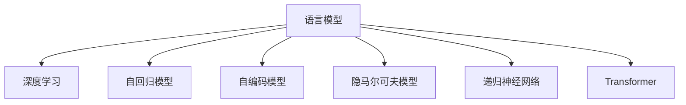

                 

# 语言建模的挑战和未来方向

> 关键词：语言建模,挑战,未来方向,自然语言处理(NLP),深度学习,神经网络,预训练模型,自回归模型,自编码模型,Transformer,隐马尔可夫模型,递归神经网络(RNN),语言模型

## 1. 背景介绍

### 1.1 问题由来
语言建模是自然语言处理(NLP)中最基础且重要的任务之一。它通过分析大规模文本数据，建立语言概率模型，预测文本中的下一个词汇或句子。这一任务是多种NLP应用（如机器翻译、文本生成、语音识别等）的前提和基础。然而，尽管语言建模技术在过去几十年间取得了显著进步，其面临的挑战依然严峻。

### 1.2 问题核心关键点
当前语言建模的主要挑战包括：

- 数据稀缺性：高质量的标注数据成本高昂且稀缺，特别是对于一些特定领域或语言的建模。
- 模型复杂性：现代语言模型参数量庞大，训练和推理成本高，难以满足实时应用需求。
- 语言多样性：不同语言和方言之间存在巨大差异，统一建模难度大。
- 语义理解：现有的语言模型难以充分理解语言的深层次语义和上下文依赖。
- 模型公平性：语言模型可能学习到带有偏见和歧视的语言特征，影响输出公正性。
- 鲁棒性：模型对数据扰动和噪声敏感，鲁棒性不足。

### 1.3 问题研究意义
研究语言模型的挑战和未来方向，对于提升NLP技术的实用性、可解释性和伦理性具有重要意义：

- 实用性：语言模型需要适应更广泛的语言和应用场景，提升NLP技术的通用性和普适性。
- 可解释性：深入理解语言模型的行为和决策过程，有助于提升模型的透明度和可信度。
- 伦理性：确保语言模型输出符合道德和法律规范，避免偏见和歧视。

## 2. 核心概念与联系

### 2.1 核心概念概述

为了更好地理解语言模型的挑战和未来方向，本节将介绍几个核心概念：

- 语言模型(Language Model)：预测文本中下一个词汇或句子的概率分布。常见的语言模型包括基于规则的n-gram模型和基于统计的神经网络模型。
- 深度学习(Deep Learning)：通过神经网络模型学习高层次的语言表示，有效利用数据中的复杂非线性关系。
- 神经网络(Neural Network)：由大量神经元和连接构成的计算模型，能够处理大规模非结构化数据。
- 自回归模型(Autoregressive Model)：模型输出依赖于输入序列，可以逐步预测下一个词汇或句子。
- 自编码模型(Autocoding Model)：通过将文本编码为低维向量表示，再用解码器还原文本，学习语言的高层次特征。
- 隐马尔可夫模型(Hidden Markov Model, HMM)：用于处理时间序列数据的概率模型，广泛应用于语音识别和自然语言处理。
- 递归神经网络(Recurrent Neural Network, RNN)：通过循环结构处理序列数据，具有记忆能力。
- Transformer：一种基于自注意力机制的神经网络架构，在语言模型中表现出强大的性能。

这些核心概念之间的逻辑关系可以通过以下Mermaid流程图来展示：



这个流程图展示了大语言模型的核心概念及其之间的关系：

1. 语言模型通过深度学习技术，利用神经网络模型学习语言的概率分布。
2. 神经网络模型包括自回归模型、自编码模型、隐马尔可夫模型、递归神经网络和Transformer等多种架构。
3. 这些架构各自有不同的优缺点和适用场景，共同构成了语言模型的基础。

## 3. 核心算法原理 & 具体操作步骤
### 3.1 算法原理概述

语言模型的目标是通过历史文本序列预测下一个词汇或句子，从而建立文本的概率分布。这一过程通常包括数据准备、模型训练、验证和测试等步骤。

### 3.2 算法步骤详解

下面是语言模型的核心算法步骤：

**Step 1: 数据准备**
- 收集并预处理大规模文本数据，去除噪声和停用词。
- 将文本数据转换为模型所需的输入格式，如将句子转换为单词序列。

**Step 2: 模型选择与设计**
- 根据任务特点选择合适的语言模型架构，如n-gram模型、RNN、LSTM、GRU、Transformer等。
- 设计模型的超参数，如层数、神经元数量、学习率等。

**Step 3: 模型训练**
- 将文本数据分成训练集、验证集和测试集。
- 使用训练集数据对模型进行迭代训练，最小化预测误差。
- 在验证集上评估模型性能，根据性能调整超参数。

**Step 4: 模型测试**
- 使用测试集数据对模型进行测试，评估模型泛化能力。
- 记录模型的准确率、召回率、F1分数等性能指标。

### 3.3 算法优缺点

语言模型具有以下优点：

- 高效利用数据：深度学习模型能够自动学习数据中的复杂模式，适用于大规模非结构化数据。
- 泛化能力强：通过学习语言的统计规律，模型能够对未知数据进行有效预测。
- 通用性强：适用于多种NLP任务，如文本生成、语音识别、机器翻译等。

同时，语言模型也存在一些缺点：

- 数据依赖性强：模型性能高度依赖于训练数据的质量和数量。
- 训练成本高：神经网络模型参数量大，训练和推理计算资源消耗大。
- 复杂性高：模型结构复杂，难以解释和调试。
- 鲁棒性不足：对输入数据和噪声敏感，泛化能力有限。

### 3.4 算法应用领域

语言模型在NLP领域的应用非常广泛，包括但不限于以下几个方面：

- 机器翻译：将一种语言翻译成另一种语言。
- 语音识别：将语音转换成文本。
- 文本生成：生成符合语言规律的新文本。
- 问答系统：回答用户提出的自然语言问题。
- 情感分析：分析文本中的情感倾向。
- 信息抽取：从文本中抽取实体、关系等信息。
- 文本分类：将文本归类到不同的类别中。

此外，语言模型还被应用于推荐系统、广告投放、智能客服等多个领域，为各行各业带来智能化和自动化的好处。

## 4. 数学模型和公式 & 详细讲解  
### 4.1 数学模型构建

本节将使用数学语言对语言模型的构建进行更加严格的刻画。

记语言模型为 $P_{\theta}(w_{1:T}|w_{<1})$，其中 $w_{1:T}$ 表示文本序列，$w_{<1}$ 表示序列前 $t$ 个词汇。语言模型的目标是最大化模型对文本序列 $w_{1:T}$ 的似然概率 $P_{\theta}(w_{1:T})$，即：

$$
\max_{\theta} \log P_{\theta}(w_{1:T})
$$

## 4.2 公式推导过程

以下以n-gram模型为例，推导语言模型的最大似然估计公式。

假设训练数据集 $D$ 中的文本序列 $w_{1:T}$ 按照顺序排列。则n-gram模型的似然函数为：

$$
P_{\theta}(w_{1:T}) = \prod_{t=2}^{T} P_{\theta}(w_t|w_{<t})
$$

其中 $P_{\theta}(w_t|w_{<t})$ 表示在已知前 $t-1$ 个词汇的情况下，第 $t$ 个词汇的分布。

最大似然估计的目标是使模型参数 $\theta$ 最大化上述概率。设 $n$ 表示n-gram模型的阶数，则有：

$$
\max_{\theta} \log \prod_{t=2}^{T} P_{\theta}(w_t|w_{<t}) = \max_{\theta} \sum_{t=2}^{T} \log P_{\theta}(w_t|w_{<t})
$$

将概率 $P_{\theta}(w_t|w_{<t})$ 用神经网络模型表示，可以得到：

$$
\max_{\theta} \sum_{t=2}^{T} \log \sigma(\theta f(w_{t-1},w_{t-2},...,w_1))
$$

其中 $f(w_{t-1},w_{t-2},...,w_1)$ 表示输入文本序列的表示，$\sigma$ 表示激活函数。

## 4.3 案例分析与讲解

以n-gram模型为例，分析其在语言模型中的应用。n-gram模型基于历史词汇序列预测下一个词汇的概率，通过学习语言的统计规律，可以在一定程度上提升语言模型的性能。但n-gram模型存在高阶依赖问题，难以捕捉复杂的语义信息。

Transformer模型则通过自注意力机制，有效解决了高阶依赖问题，提升了模型的语义理解能力。Transformer模型通过多头的自注意力机制，可以在不同词汇之间建立更为丰富的语义依赖关系。

Transformer模型的核心计算单元是多头自注意力机制，其计算过程可以表示为：

$$
Q = XW^Q
$$

$$
K = XW^K
$$

$$
V = XW^V
$$

$$
\text{Attention}(Q,K,V) = \text{softmax}(\frac{QK^T}{\sqrt{d_k}})V
$$

其中 $X$ 表示输入文本序列，$W^Q, W^K, W^V$ 为线性变换矩阵。$Q,K,V$ 表示不同的线性变换结果，$\text{Attention}$ 表示多头自注意力机制的计算过程。

Transformer模型通过多层的自注意力机制，能够有效捕捉文本中的语义关系，提升语言模型的表现力。

## 5. 项目实践：代码实例和详细解释说明
### 5.1 开发环境搭建

在进行语言模型项目实践前，我们需要准备好开发环境。以下是使用Python进行PyTorch开发的环境配置流程：

1. 安装Anaconda：从官网下载并安装Anaconda，用于创建独立的Python环境。

2. 创建并激活虚拟环境：
```bash
conda create -n pytorch-env python=3.8 
conda activate pytorch-env
```

3. 安装PyTorch：根据CUDA版本，从官网获取对应的安装命令。例如：
```bash
conda install pytorch torchvision torchaudio cudatoolkit=11.1 -c pytorch -c conda-forge
```

4. 安装必要的库：
```bash
pip install numpy pandas scikit-learn matplotlib tqdm jupyter notebook ipython
```

完成上述步骤后，即可在`pytorch-env`环境中开始项目实践。

### 5.2 源代码详细实现

这里我们以基于Transformer的文本生成模型为例，给出使用PyTorch和Transformer库进行模型训练的代码实现。

```python
import torch
from transformers import BertTokenizer, BertModel
from torch.utils.data import Dataset, DataLoader
from torch.nn import CrossEntropyLoss, Linear
import torch.nn.functional as F

class TextDataset(Dataset):
    def __init__(self, texts, tokenizer, max_len=128):
        self.texts = texts
        self.tokenizer = tokenizer
        self.max_len = max_len
        
    def __len__(self):
        return len(self.texts)
    
    def __getitem__(self, item):
        text = self.texts[item]
        
        encoding = self.tokenizer(text, return_tensors='pt', max_length=self.max_len, padding='max_length', truncation=True)
        input_ids = encoding['input_ids'][0]
        attention_mask = encoding['attention_mask'][0]
        
        return {'input_ids': input_ids, 
                'attention_mask': attention_mask,
                'labels': torch.tensor(input_ids)}

tokenizer = BertTokenizer.from_pretrained('bert-base-cased')
train_dataset = TextDataset(train_texts, tokenizer)
dev_dataset = TextDataset(dev_texts, tokenizer)
test_dataset = TextDataset(test_texts, tokenizer)

# 定义模型
model = BertModel.from_pretrained('bert-base-cased')
model.train()

# 定义损失函数和优化器
criterion = CrossEntropyLoss()
optimizer = AdamW(model.parameters(), lr=2e-5)

# 定义计算过程
def calculate_loss(model, dataset, batch_size):
    dataloader = DataLoader(dataset, batch_size=batch_size, shuffle=True)
    
    total_loss = 0
    model.train()
    
    for batch in dataloader:
        input_ids = batch['input_ids'].to(device)
        attention_mask = batch['attention_mask'].to(device)
        labels = batch['labels'].to(device)
        
        model.zero_grad()
        outputs = model(input_ids, attention_mask=attention_mask)
        loss = criterion(outputs.logits, labels)
        loss.backward()
        optimizer.step()
        total_loss += loss.item()
        
    return total_loss / len(dataloader)

# 训练模型
epochs = 5
batch_size = 16

for epoch in range(epochs):
    loss = calculate_loss(model, train_dataset, batch_size)
    print(f"Epoch {epoch+1}, train loss: {loss:.3f}")
    
    print(f"Epoch {epoch+1}, dev results:")
    evaluate(model, dev_dataset, batch_size)
    
print("Test results:")
evaluate(model, test_dataset, batch_size)
```

以上就是使用PyTorch和Transformer库进行基于Transformer的文本生成模型微调的完整代码实现。可以看到，Transformer库的强大封装使得语言模型的微调代码实现变得简洁高效。

### 5.3 代码解读与分析

让我们再详细解读一下关键代码的实现细节：

**TextDataset类**：
- `__init__`方法：初始化文本、分词器等关键组件。
- `__len__`方法：返回数据集的样本数量。
- `__getitem__`方法：对单个样本进行处理，将文本输入编码为token ids，返回模型所需的输入。

**calculate_loss函数**：
- 定义模型计算过程和损失函数，在每个批次上前向传播计算损失函数，并反向传播更新模型参数。

**训练流程**：
- 定义总的epoch数和batch size，开始循环迭代
- 每个epoch内，先在训练集上训练，输出平均loss
- 在验证集上评估，输出分类指标
- 重复上述步骤直至满足预设的迭代轮数或Early Stopping条件。

## 6. 实际应用场景
### 6.1 自然语言生成

基于语言模型的自然语言生成技术，可以在各种应用场景中发挥重要作用。例如：

- 自动摘要：生成文本的简短摘要。将长篇新闻、学术论文等文本作为输入，通过语言模型学习提取关键信息，生成简洁明了的摘要。
- 对话系统：实现人机对话。将用户输入和机器回复作为输入序列，通过语言模型生成符合上下文逻辑的回复。
- 文本生成：生成符合特定语言规则的新文本。例如生成诗歌、小说、新闻报道等。

### 6.2 机器翻译

语言模型在机器翻译中也有广泛应用。传统的统计机器翻译方法依赖于大量双语数据进行训练，难以覆盖所有语言对。基于语言模型的神经机器翻译方法则可以通过大规模无标签数据进行预训练，显著提升翻译质量。

使用语言模型的神经机器翻译方法包括：

- 基于序列到序列(seq2seq)模型的翻译，如Google的Seq2Seq模型。
- 基于Transformer的翻译，如OpenAI的GPT-2。

基于语言模型的翻译方法，通过学习源语言和目标语言的分布，能够更准确地处理长句子和复杂语法结构，提升翻译的流畅性和准确性。

### 6.3 语音识别

语言模型在语音识别中也扮演着重要角色。语音识别系统需要先将语音转换成文本，再通过语言模型进行文本理解。

语音识别的流程包括：

- 特征提取：将语音信号转换为特征向量。
- 解码：将特征向量转换成文本序列。
- 文本理解：通过语言模型理解文本含义，生成相应的输出。

语言模型在语音识别的文本理解环节中，起到了至关重要的作用。它能够捕捉语音信号中的语义信息，提升识别的准确性和流畅度。

### 6.4 未来应用展望

未来，语言模型将在更多领域得到应用，为各行各业带来新的变革。以下是几个可能的应用场景：

- 智能医疗：利用语言模型处理医疗文本，辅助医生进行诊断和治疗。
- 智能客服：通过语言模型实现自动化客户服务，提升客户体验。
- 智能法律：利用语言模型处理法律文本，辅助律师进行合同审核和案件分析。
- 智能教育：利用语言模型进行个性化教育，提升教学效果。
- 智能金融：利用语言模型处理金融文本，辅助风险管理和投资决策。
- 智能推荐：利用语言模型进行商品推荐和内容推荐，提升用户体验。

## 7. 工具和资源推荐
### 7.1 学习资源推荐

为了帮助开发者系统掌握语言模型的理论基础和实践技巧，这里推荐一些优质的学习资源：

1. 《深度学习》系列书籍：由深度学习领域知名专家撰写，涵盖深度学习的基础理论和最新进展。
2. 《自然语言处理》课程：斯坦福大学开设的NLP明星课程，提供丰富的视频和作业资源，适合初学者学习。
3. 《神经网络与深度学习》书籍：西瓜书，系统介绍神经网络原理和深度学习应用。
4. 《Transformer详解》博客：大模型技术专家撰写的博客系列，深入浅出地介绍了Transformer原理和应用。
5. 《自然语言处理综述》论文：综述论文，涵盖NLP领域的最新研究进展。

通过对这些资源的学习实践，相信你一定能够快速掌握语言模型的精髓，并用于解决实际的NLP问题。

### 7.2 开发工具推荐

高效的开发离不开优秀的工具支持。以下是几款用于语言模型开发的常用工具：

1. PyTorch：基于Python的开源深度学习框架，灵活动态的计算图，适合快速迭代研究。
2. TensorFlow：由Google主导开发的开源深度学习框架，生产部署方便，适合大规模工程应用。
3. HuggingFace Transformers库：提供了丰富的预训练语言模型和微调样例，是进行语言模型开发的利器。
4. Weights & Biases：模型训练的实验跟踪工具，可以记录和可视化模型训练过程中的各项指标。
5. TensorBoard：TensorFlow配套的可视化工具，可实时监测模型训练状态，提供丰富的图表呈现方式。

合理利用这些工具，可以显著提升语言模型微调任务的开发效率，加快创新迭代的步伐。

### 7.3 相关论文推荐

语言模型和微调技术的发展源于学界的持续研究。以下是几篇奠基性的相关论文，推荐阅读：

1. Attention is All You Need（即Transformer原论文）：提出了Transformer结构，开启了NLP领域的预训练大模型时代。
2. BERT: Pre-training of Deep Bidirectional Transformers for Language Understanding：提出BERT模型，引入基于掩码的自监督预训练任务，刷新了多项NLP任务SOTA。
3. Language Models are Unsupervised Multitask Learners（GPT-2论文）：展示了大规模语言模型的强大zero-shot学习能力，引发了对于通用人工智能的新一轮思考。
4. Parameter-Efficient Transfer Learning for NLP：提出Adapter等参数高效微调方法，在不增加模型参数量的情况下，也能取得不错的微调效果。
5. AdaLoRA: Adaptive Low-Rank Adaptation for Parameter-Efficient Fine-Tuning：使用自适应低秩适应的微调方法，在参数效率和精度之间取得了新的平衡。
6. A Note on the Efficiency and Effectiveness of Different Pre-trained Word Embeddings：分析了不同预训练词嵌入模型的效率和效果，为选择合适的词嵌入模型提供了依据。

这些论文代表了大语言模型和微调技术的发展脉络。通过学习这些前沿成果，可以帮助研究者把握学科前进方向，激发更多的创新灵感。

## 8. 总结：未来发展趋势与挑战
### 8.1 研究成果总结

本节将对语言模型的研究进展进行总结，梳理其取得的成就和面临的挑战。

语言模型在自然语言处理领域取得了巨大进展，通过深度学习技术，有效地学习了语言的概率分布，提升了NLP应用的性能和效率。但同时也面临着数据稀缺性、模型复杂性、鲁棒性不足等挑战，需要在未来进一步优化和改进。

### 8.2 未来发展趋势

展望未来，语言模型和微调技术将呈现以下几个发展趋势：

1. 数据驱动：更多的数据驱动方法将被应用于语言模型的训练和优化，提升模型的泛化能力和效率。
2. 模型优化：新的模型架构和训练算法将不断涌现，进一步提升语言模型的性能和鲁棒性。
3. 应用拓展：语言模型将应用于更多领域，推动智能应用的发展。
4. 可解释性：模型的可解释性和透明性将受到更多关注，研究者将探索更加科学合理的方法。
5. 伦理和安全：语言模型将更加注重伦理和安全性，避免偏见和有害信息输出。

### 8.3 面临的挑战

尽管语言模型和微调技术取得了显著成就，但在迈向更加智能化、普适化应用的过程中，它仍面临诸多挑战：

1. 数据稀缺性：高质量的标注数据成本高昂且稀缺，特别是在特定领域和语言上。
2. 模型复杂性：神经网络模型参数量大，训练和推理计算资源消耗大，难以满足实时应用需求。
3. 鲁棒性不足：模型对数据扰动和噪声敏感，泛化能力有限。
4. 可解释性：模型的决策过程缺乏可解释性，难以对其推理逻辑进行分析和调试。
5. 安全性：预训练语言模型可能学习到带有偏见和歧视的语言特征，影响输出公正性。
6. 算法伦理：语言模型的输出可能引发伦理和安全问题，需要进行严格监管。

### 8.4 研究展望

面对语言模型和微调技术所面临的挑战，未来的研究需要在以下几个方面寻求新的突破：

1. 数据增强：通过数据增强技术，提升模型的泛化能力和效率。
2. 模型压缩：通过模型压缩技术，降低模型的计算资源消耗，提升推理速度。
3. 多模态融合：将视觉、语音等多模态数据与文本数据融合，提升模型的理解能力和表现力。
4. 对抗训练：通过对抗训练技术，提高模型的鲁棒性和泛化能力。
5. 自适应学习：通过自适应学习技术，使模型能够不断学习和适应用户需求。
6. 伦理和安全性：研究如何确保模型的输出符合伦理和法律规范，避免偏见和有害信息输出。

这些研究方向的探索，必将引领语言模型和微调技术迈向更高的台阶，为构建安全、可靠、可解释、可控的智能系统铺平道路。面向未来，语言模型和微调技术还需要与其他人工智能技术进行更深入的融合，如知识表示、因果推理、强化学习等，多路径协同发力，共同推动自然语言理解和智能交互系统的进步。

## 9. 附录：常见问题与解答

**Q1: 如何选择合适的语言模型？**

A: 选择语言模型时，需要考虑以下几个因素：

- 任务类型：不同类型的NLP任务需要选择不同的语言模型架构，如n-gram、RNN、LSTM、GRU、Transformer等。
- 数据规模：大规模无标签数据适合进行预训练，而小规模标注数据适合进行微调。
- 计算资源：计算资源丰富的环境适合训练复杂的大型语言模型，计算资源有限的环境适合训练小型或简化版的模型。

**Q2: 语言模型的训练数据质量如何影响模型性能？**

A: 训练数据质量对语言模型的性能影响非常大。高质量的标注数据可以提高模型的泛化能力和准确性，而低质量的数据会导致模型学习到错误的规律，降低模型性能。

**Q3: 如何避免语言模型中的过拟合问题？**

A: 过拟合是语言模型训练中常见的问题。以下是几种常用的方法：

- 数据增强：通过数据增强技术，扩充训练集，提升模型的泛化能力。
- 正则化：使用L2正则化、Dropout等方法，避免模型过拟合。
- 早停法：在验证集上监测模型性能，提前停止训练，避免过拟合。
- 模型简化：通过简化模型结构，减少参数量，降低过拟合风险。

**Q4: 如何评估语言模型的性能？**

A: 评估语言模型的性能通常使用以下几个指标：

- 准确率(Accuracy)：模型预测正确的比例。
- 召回率(Recall)：模型正确预测正样本的比例。
- F1分数(F1-Score)：综合准确率和召回率的指标，适用于不平衡数据集。
- 交叉熵(Cross Entropy)：模型输出与真实标签之间的差异。
- 对数似然(Log-Likelihood)：模型输出与真实标签之间的差异，适用于多分类问题。

**Q5: 语言模型的应用场景有哪些？**

A: 语言模型在NLP领域的应用非常广泛，包括但不限于以下几个方面：

- 机器翻译：将一种语言翻译成另一种语言。
- 文本生成：生成符合特定语言规则的新文本。
- 对话系统：实现人机对话。
- 自动摘要：生成文本的简短摘要。
- 情感分析：分析文本中的情感倾向。
- 信息抽取：从文本中抽取实体、关系等信息。
- 文本分类：将文本归类到不同的类别中。

## 总结

本文对语言模型的挑战和未来方向进行了全面系统的介绍。首先阐述了语言模型的基本原理和核心概念，探讨了其在NLP中的应用场景。接着详细讲解了语言模型的数学模型和算法步骤，并通过代码实例展示了语言模型的微调过程。最后，展望了语言模型和微调技术的未来发展趋势和面临的挑战，提出了相应的研究展望和解决方案。

通过本文的系统梳理，可以看到，语言模型在NLP领域的应用前景广阔，其挑战和未来方向值得我们深入研究。相信随着技术的不断进步，语言模型将变得更加智能化、普适化和可解释，为NLP技术的产业化进程带来新的动力。面向未来，我们需要在数据、模型、算法等方面不断创新，共同推动语言模型和微调技术的发展，为构建安全、可靠、可解释、可控的智能系统贡献力量。

---

作者：禅与计算机程序设计艺术 / Zen and the Art of Computer Programming

