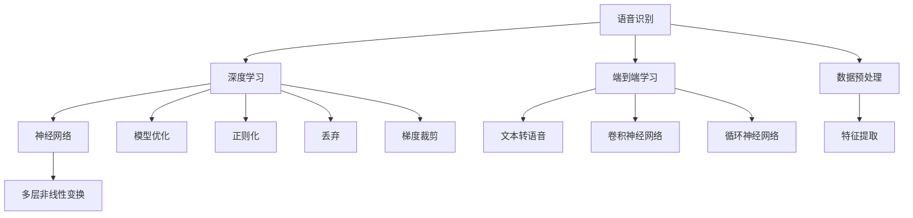

                 

# 语音识别与合成：深度学习方法

> 关键词：语音识别, 深度学习, 神经网络, 端到端学习, 语音合成, 生成对抗网络

## 1. 背景介绍

### 1.1 问题由来

语音识别和合成技术在过去几十年中取得了显著进展，从基于隐马尔可夫模型（HMM）的浅层学习方法，到端到端深度学习技术的崛起。深度学习方法通过引入多层神经网络，极大提升了语音信号处理和语音分析的精度与效率。在实际应用中，语音识别技术广泛应用于语音助手、智能客服、自动字幕生成、语音翻译等领域，而语音合成技术则广泛应用于人机交互、语音驱动动画、娱乐等领域，极大地丰富了人与计算机的交互方式。

### 1.2 问题核心关键点

语音识别和合成技术的核心在于将语音信号转换为文本或从文本生成语音。其核心关键点包括：
- 深度学习架构：如何设计有效的深度学习网络结构，以提高语音信号处理的精度和鲁棒性。
- 端到端学习：是否采用端到端学习范式，可以直接从语音信号生成文本或从文本生成语音，减少了中间步骤的误差积累。
- 数据预处理：如何有效地处理和增强语音数据，提升训练效率和模型效果。
- 模型优化：如何通过正则化、丢弃、梯度裁剪等手段优化模型，避免过拟合。
- 实时性：如何在保持高精度的同时，实现实时处理语音信号。
- 应用场景适配：如何针对不同的应用场景进行模型适配，如远场语音识别、异构语音信号处理等。

这些关键点决定了语音识别和合成技术的发展方向和应用效果。

### 1.3 问题研究意义

语音识别和合成技术的快速发展，使得语音信号处理不再仅限于学术研究领域，而是逐渐应用于实际生产生活中，为人们的交流和互动提供了新的方式。语音识别技术使计算机能够理解人类的语言，从而使计算机和人类之间的交互更加自然和高效。语音合成技术则让计算机能够以人类的语音方式与人类沟通，大大提升了人机交互的体验。

## 2. 核心概念与联系

### 2.1 核心概念概述

为更好地理解语音识别和合成技术的深度学习方法，本节将介绍几个密切相关的核心概念：

- **语音识别**：将语音信号转换为文本的过程，是深度学习在自然语言处理领域的重要应用之一。常见的语音识别方法包括隐马尔可夫模型（HMM）、卷积神经网络（CNN）、循环神经网络（RNN）、长短期记忆网络（LSTM）、端到端模型等。
- **语音合成**：将文本转换为语音信号的过程，旨在使机器能够模仿人类的发音和语调，生成自然流畅的语音输出。常见的语音合成方法包括传统文本到语音（TTS）技术、基于深度学习的方法如WaveNet、Tacotron、VITS等。
- **深度学习**：一类基于人工神经网络的机器学习方法，通过多层非线性变换实现数据建模和特征提取，适合于语音信号的非线性处理。
- **神经网络**：深度学习的核心，由多层神经元组成的计算图，通过反向传播算法进行训练和优化。
- **端到端学习**：一种将输入（语音信号或文本）直接映射到输出（文本或语音信号）的深度学习方法，减少了中间步骤，提高了精度。
- **生成对抗网络（GANs）**：一种用于生成逼真图像、音频等内容的深度学习技术，可以应用于语音合成中。

这些核心概念之间的逻辑关系可以通过以下Mermaid流程图来展示：



这个流程图展示语音识别和合成技术的核心概念及其之间的关系：

1. 语音识别通过深度学习进行处理，涉及到神经网络的多层非线性变换。
2. 端到端学习是语音识别和合成中常用的深度学习方法。
3. 数据预处理和特征提取是提高模型效果的关键步骤。
4. 模型优化通过正则化、丢弃、梯度裁剪等手段，减少过拟合。
5. 生成对抗网络可以应用于语音合成，生成逼真的语音输出。

## 3. 核心算法原理 & 具体操作步骤

### 3.1 算法原理概述

语音识别和合成技术的深度学习方法主要基于以下原理：

- **语音识别**：将语音信号转换为文本，通常分为语音特征提取、声学模型训练和语言模型训练三步。其中，声学模型通常采用深度神经网络，语言模型则采用传统机器学习方法或深度学习模型。
- **语音合成**：将文本转换为语音，分为文本分析、声学模型生成和波形生成三步。文本分析使用深度学习模型处理文本，声学模型生成通常使用卷积神经网络或循环神经网络，波形生成使用生成对抗网络或变分自编码器等。

### 3.2 算法步骤详解

语音识别和合成技术的深度学习方法一般包括以下关键步骤：

**Step 1: 数据准备**
- 收集大量语音信号和相应的文本标注数据，分为训练集、验证集和测试集。
- 对语音信号进行预处理，如分帧、加窗、MFCC提取等，转化为模型输入。

**Step 2: 模型选择与训练**
- 选择适合的深度学习模型，如卷积神经网络（CNN）、循环神经网络（RNN）、长短期记忆网络（LSTM）等。
- 设计损失函数，如交叉熵、CTC损失等，评估模型在训练集和验证集上的性能。
- 采用反向传播算法，使用梯度下降等优化算法更新模型参数，最小化损失函数。

**Step 3: 后处理与评估**
- 对测试集进行语音信号识别或语音合成，输出文本或语音波形。
- 评估模型在测试集上的性能指标，如识别准确率、语音质量、自然度等。
- 对模型进行后处理，如去除噪声、改善发音等，提高模型输出质量。

### 3.3 算法优缺点

语音识别和合成技术的深度学习方法具有以下优点：
- 精度高：深度学习模型能够学习到语音信号的复杂特征，提高识别和合成的精度。
- 泛化能力强：端到端学习减少了中间步骤，减少了误差积累，提升了模型的泛化能力。
- 鲁棒性好：深度学习模型能够自动学习到语音信号的鲁棒特征，对于噪声、口音等具有较好的鲁棒性。

但这些方法也存在一些缺点：
- 计算量大：深度学习模型参数量较大，训练和推理需要大量计算资源。
- 模型复杂：深度学习模型的结构复杂，调试和优化难度较大。
- 数据需求高：深度学习模型需要大量标注数据进行训练，数据获取成本高。

### 3.4 算法应用领域

语音识别和合成技术的深度学习方法在多个领域得到了广泛应用，例如：

- **智能客服**：语音识别技术可以自动识别用户的语音，进行智能客服处理。
- **语音助手**：语音合成技术可以生成自然流畅的语音，为用户提供交互式的语音助手服务。
- **自动字幕生成**：语音识别技术可以将语音信号转换为文本，用于自动字幕生成。
- **语音翻译**：语音识别技术可以将语音转换为文本，再通过翻译模型进行语音翻译。
- **娱乐**：语音合成技术可以用于虚拟角色的语音驱动，增强娱乐体验。

这些应用场景展示了深度学习技术在语音信号处理中的强大能力，为人类与计算机的交互带来了新的可能。

## 4. 数学模型和公式 & 详细讲解 & 举例说明

### 4.1 数学模型构建

本节将使用数学语言对语音识别和合成技术的深度学习方法进行更加严格的刻画。

**语音识别数学模型**：
- **输入**：语音信号 $x_t$，经过MFCC提取后的特征向量 $f_t$。
- **目标**：文本序列 $y_t$。
- **声学模型**：使用深度神经网络，定义 $p(y_t|f_t)$。
- **语言模型**：使用RNN或Transformer模型，定义 $p(y_{t+1}|y_t)$。

**语音合成数学模型**：
- **输入**：文本序列 $y_t$。
- **目标**：语音信号 $x_t$。
- **声学模型**：使用深度神经网络，定义 $p(x_t|y_t)$。
- **波形生成模型**：使用生成对抗网络（GANs）或变分自编码器（VAEs），定义 $p(x_t|y_t)$。

### 4.2 公式推导过程

**语音识别公式推导**：
- **交叉熵损失函数**：对于文本序列 $y_t$ 和特征向量 $f_t$，定义交叉熵损失函数 $L = -\sum_t \log p(y_t|f_t)$。
- **CTC损失函数**：对于文本序列 $y_t$ 和特征向量 $f_t$，定义CTC损失函数 $L = -\log p(y_t|f_t)$。

**语音合成公式推导**：
- **GANs生成语音**：假设生成器 $G$ 和判别器 $D$，定义损失函数 $L_G = \mathbb{E}_{f_t}[\log D(G(f_t))] + \mathbb{E}_{f_t}[log(1-D(G(f_t))]$，$L_D = \mathbb{E}_{f_t}[\log D(G(f_t))] + \mathbb{E}_{y_t}[\log(1-D(f_t))]$。
- **VAEs生成语音**：假设编码器 $E$ 和解码器 $G$，定义损失函数 $L_E = -\mathbb{E}_{f_t}[\log p(f_t|y_t)]$，$L_G = -\mathbb{E}_{f_t}[\log p(f_t|y_t)]$。

### 4.3 案例分析与讲解

**语音识别案例**：使用LSTM神经网络进行语音识别。输入语音信号 $x_t$ 经过MFCC提取后得到特征向量 $f_t$，输出文本序列 $y_t$。定义声学模型 $p(y_t|f_t)$ 为 $f_t$ 的深度神经网络，语言模型 $p(y_{t+1}|y_t)$ 为RNN模型。定义交叉熵损失函数 $L$ 为 $\sum_t -\log p(y_t|f_t)$，最小化损失函数进行模型训练。

**语音合成案例**：使用Tacotron模型进行语音合成。输入文本序列 $y_t$，定义声学模型 $p(x_t|y_t)$ 为深度神经网络，波形生成模型 $p(x_t|y_t)$ 为生成对抗网络（GANs）。定义GANs损失函数 $L_G$ 和 $L_D$ 为 $\log D(G(f_t))$ 和 $\log(1-D(G(f_t)))$，最小化损失函数进行模型训练。

## 5. 项目实践：代码实例和详细解释说明

### 5.1 开发环境搭建

在进行语音识别和合成项目实践前，我们需要准备好开发环境。以下是使用Python进行Kaldi开发的环路配置流程：

1. 安装Kaldi库：从官网下载并安装Kaldi库。
2. 安装相关工具包：安装必要的工具包，如NLTK、Numpy、Scipy、Pandas、Matplotlib等。
3. 配置Kaldi环境：修改Kaldi配置文件，设置编译器和优化选项。
4. 准备数据集：收集和整理语音信号和文本标注数据。

完成上述步骤后，即可在Kaldi环境中开始语音识别和合成的实践。

### 5.2 源代码详细实现

下面我们以使用Kaldi库进行语音识别和合成的代码实现为例。

**语音识别实现**：
```python
import kaldi

# 准备数据集
train_data = kaldi.read_data(train)
dev_data = kaldi.read_data(dev)
test_data = kaldi.read_data(test)

# 定义声学模型
acoustic_model = kaldi.SequentialAcousticModel()

# 训练声学模型
acoustic_model.train(train_data)

# 定义语言模型
language_model = kaldi.RnnLanguageModel()

# 训练语言模型
language_model.train(train_data)

# 进行语音识别
result = kaldi.recognize(dev_data, acoustic_model, language_model)

# 输出识别结果
print(result)
```

**语音合成实现**：
```python
import kaldi

# 准备数据集
train_data = kaldi.read_data(train)
dev_data = kaldi.read_data(dev)
test_data = kaldi.read_data(test)

# 定义声学模型
acoustic_model = kaldi.SequentialAcousticModel()

# 训练声学模型
acoustic_model.train(train_data)

# 定义波形生成模型
wav_model = kaldi.GeneratorWaveform()

# 训练波形生成模型
wav_model.train(train_data)

# 进行语音合成
wav = kaldi.synthesize(dev_data, acoustic_model, wav_model)

# 输出合成语音
print(wav)
```

可以看到，通过Kaldi库，我们可以用相对简洁的代码实现语音识别和合成的完整过程。开发者可以将更多精力放在数据处理、模型改进等高层逻辑上，而不必过多关注底层的实现细节。

### 5.3 代码解读与分析

让我们再详细解读一下关键代码的实现细节：

**Kaldi库**：
- `kaldi`：Kaldi库的Python接口，提供了一系列语音信号处理的函数和类。
- `read_data`：读取语音数据和文本标注数据。
- `SequentialAcousticModel`：声学模型类，可以定义多层神经网络。
- `train`：训练声学模型。
- `RnnLanguageModel`：语言模型类，可以定义RNN模型。
- `train`：训练语言模型。
- `recognize`：进行语音识别。
- `synthesize`：进行语音合成。

**代码实现**：
- **语音识别**：通过Kaldi库的`SequentialAcousticModel`类定义声学模型，通过`train`方法进行训练。定义`RnnLanguageModel`类为语言模型，同样通过`train`方法进行训练。最后通过`recognize`方法进行语音识别，输出识别结果。
- **语音合成**：同样使用`SequentialAcousticModel`类定义声学模型，通过`train`方法进行训练。定义`GeneratorWaveform`类为波形生成模型，通过`train`方法进行训练。最后通过`synthesize`方法进行语音合成，输出合成语音。

## 6. 实际应用场景

### 6.1 智能客服系统

语音识别和合成技术在智能客服系统中得到了广泛应用。传统客服往往需要配备大量人力，高峰期响应缓慢，且一致性和专业性难以保证。使用语音识别和合成技术，可以7x24小时不间断服务，快速响应客户咨询，用自然流畅的语言解答各类常见问题。

在技术实现上，可以收集企业内部的历史客服对话记录，将问题和最佳答复构建成监督数据，在此基础上对深度学习模型进行微调。微调后的模型能够自动理解用户意图，匹配最合适的答复模板进行回复。对于客户提出的新问题，还可以接入检索系统实时搜索相关内容，动态组织生成回答。如此构建的智能客服系统，能大幅提升客户咨询体验和问题解决效率。

### 6.2 车载导航系统

车载导航系统通过语音识别技术，可以自动识别驾驶员的语音指令，如“前往XXX”、“搜索路线”等，从而实现实时导航。使用语音合成技术，可以实时生成导航提示，如“前方路口左转”、“请注意前方限速”等，提高驾驶体验。

在技术实现上，车载导航系统通常会集成语音识别和合成模块，对驾驶员的语音指令进行识别和合成。系统会根据识别结果，动态更新导航路线和提示信息，确保驾驶员的实时需求得到满足。车载导航系统通过语音识别和合成技术，极大提升了用户交互的便捷性和安全性。

### 6.3 人机交互界面

语音识别和合成技术在人机交互界面中的应用广泛。通过语音识别技术，用户可以通过语音指令控制智能家居设备、车载设备等。通过语音合成技术，设备可以生成自然流畅的语音反馈，提升用户体验。

在技术实现上，设备通常会集成语音识别和合成模块，对用户的语音指令进行识别和合成。系统会根据识别结果，动态生成反馈信息，如“您需要开灯吗？”、“您要播放音乐吗？”等。用户可以通过语音指令，直接控制设备，极大提升了人机交互的便捷性。语音识别和合成技术在智能家居、车载设备、智能助理等领域，极大地改善了用户的使用体验。

## 7. 工具和资源推荐

### 7.1 学习资源推荐

为了帮助开发者系统掌握语音识别和合成技术的深度学习方法，这里推荐一些优质的学习资源：

1. **《深度学习：入门与实践》**：吴恩达教授的课程，详细介绍了深度学习的基础知识和技术实现。
2. **Kaldi官方文档**：Kaldi库的官方文档，提供了详细的语音信号处理教程和代码示例。
3. **DeepSpeech项目**：谷歌的语音识别开源项目，提供了丰富的深度学习模型和代码实现。
4. **Tacotron项目**：谷歌的语音合成开源项目，提供了Tacotron模型的代码实现和文档。
5. **pyAudioAnalysis项目**：Python语音信号处理的库，提供了语音识别和合成的基本功能。

通过对这些资源的学习实践，相信你一定能够快速掌握语音识别和合成技术的精髓，并用于解决实际的语音信号处理问题。

### 7.2 开发工具推荐

高效的开发离不开优秀的工具支持。以下是几款用于语音识别和合成开发的常用工具：

1. **Kaldi**：一个开源的语音信号处理工具包，提供了丰富的语音信号处理函数和类。
2. **DeepSpeech**：谷歌的语音识别开源项目，提供了深度学习模型的代码实现和文档。
3. **pyAudioAnalysis**：Python语音信号处理的库，提供了语音识别和合成的基本功能。
4. **TensorFlow**：谷歌的开源深度学习框架，提供了丰富的语音信号处理工具和库。
5. **Keras**：一个高层深度学习框架，提供了简单易用的接口，适合快速开发和实验。

合理利用这些工具，可以显著提升语音识别和合成任务的开发效率，加快创新迭代的步伐。

### 7.3 相关论文推荐

语音识别和合成技术的深度学习方法的发展源于学界的持续研究。以下是几篇奠基性的相关论文，推荐阅读：

1. **Speech and Language Processing**：丹尼尔·多迪克（Daniel Jurafsky）和詹姆斯·海布雷曼（James H. Martin）的经典教材，全面介绍了语音识别和合成的基础理论和应用实践。
2. **Deep Speech 1: Acoustic Modeling using Recurrent Neural Networks**：谷歌的研究论文，展示了基于RNN的语音识别模型Deep Speech 1。
3. **Tacotron 2: Towards End-to-End Speech Synthesis**：谷歌的研究论文，展示了基于Transformer的语音合成模型Tacotron 2。
4. **Wav2Letter: An End-to-End Deep Learning Architecture for Automatic Speech Recognition**：Facebook的研究论文，展示了基于CNN和LSTM的语音识别模型Wav2Letter。
5. **TTS-GAN: Full-End-to-End Text-to-Speech Synthesis with a Conditional GAN Model**：谷歌的研究论文，展示了基于GAN的语音合成模型TTS-GAN。

这些论文代表了大语言模型微调技术的发展脉络。通过学习这些前沿成果，可以帮助研究者把握学科前进方向，激发更多的创新灵感。

## 8. 总结：未来发展趋势与挑战

### 8.1 总结

本文对语音识别和合成技术的深度学习方法进行了全面系统的介绍。首先阐述了语音识别和合成技术的研究背景和意义，明确了深度学习在语音信号处理中的应用价值。其次，从原理到实践，详细讲解了深度学习在语音识别和合成中的数学模型和算法步骤，给出了语音识别和合成任务的完整代码实例。同时，本文还广泛探讨了语音识别和合成技术在智能客服、车载导航、人机交互等多个领域的应用前景，展示了深度学习技术在语音信号处理中的强大能力。

通过本文的系统梳理，可以看到，深度学习技术在语音信号处理中的广泛应用，为人类与计算机的交互带来了新的可能。未来，伴随深度学习技术的不断进步，语音识别和合成技术将在更广阔的应用领域得到进一步提升和完善。

### 8.2 未来发展趋势

展望未来，语音识别和合成技术的深度学习方法将呈现以下几个发展趋势：

1. **端到端学习的普及**：端到端学习能够减少中间步骤，提升模型精度和鲁棒性，未来将得到更广泛的应用。
2. **多模态融合**：语音信号处理将与其他模态（如视觉、文本等）结合，形成多模态信息融合技术，提升系统的感知能力和智能化水平。
3. **实时性提升**：通过模型压缩、硬件加速等技术，提升语音识别和合成的实时性，满足实时应用的需求。
4. **个性化定制**：针对不同用户、不同场景，设计个性化定制的语音识别和合成模型，提高系统的适应性和用户体验。
5. **低资源优化**：针对资源受限设备（如嵌入式设备、低功耗设备等），设计轻量级、低功耗的语音识别和合成模型，提升系统的应用范围。
6. **交互式语音理解**：结合自然语言处理技术，提升语音识别和合成的交互式理解能力，如语音指令识别、对话系统等。

以上趋势凸显了深度学习技术在语音信号处理中的广阔前景。这些方向的探索发展，必将进一步提升语音识别和合成技术的精度、鲁棒性和实时性，为人类与计算机的交互带来新的突破。

### 8.3 面临的挑战

尽管深度学习技术在语音识别和合成领域取得了显著进展，但在迈向更加智能化、普适化应用的过程中，它仍面临着诸多挑战：

1. **数据依赖**：深度学习模型需要大量标注数据进行训练，数据获取成本高、周期长。
2. **鲁棒性不足**：深度学习模型面对噪声、口音等具有较高的鲁棒性，但面对特殊语音情况（如方言、口音、背景噪声等）的泛化能力较弱。
3. **计算资源消耗大**：深度学习模型参数量较大，训练和推理需要大量计算资源，难以应用于资源受限设备。
4. **模型复杂度高**：深度学习模型结构复杂，调试和优化难度较大，增加了系统的开发和维护成本。
5. **实时性挑战**：在资源受限和网络延迟等环境下，如何保证语音识别和合成的实时性是重要的研究方向。
6. **伦理和安全问题**：语音识别和合成模型可能学习到有害信息，给用户带来安全隐患，如何确保模型的伦理和安全性和数据隐私保护，是亟待解决的问题。

正视这些挑战，积极应对并寻求突破，将是大语言模型微调技术走向成熟的必由之路。相信随着学界和产业界的共同努力，这些挑战终将一一被克服，深度学习技术在语音信号处理中的应用将更加广泛和深入。

### 8.4 研究展望

面对深度学习在语音识别和合成领域面临的挑战，未来的研究需要在以下几个方面寻求新的突破：

1. **多模态融合技术**：将视觉、文本等模态信息与语音信号结合，提升系统的感知能力和智能化水平。
2. **轻量级模型设计**：针对资源受限设备，设计轻量级、低功耗的语音识别和合成模型。
3. **实时性优化**：结合硬件加速、模型压缩等技术，提升语音识别和合成的实时性。
4. **个性化定制**：针对不同用户、不同场景，设计个性化定制的语音识别和合成模型，提高系统的适应性和用户体验。
5. **伦理和安全研究**：建立伦理导向的评估指标，过滤和惩罚有害信息，确保模型的伦理和安全性和数据隐私保护。
6. **交互式语音理解**：结合自然语言处理技术，提升语音识别和合成的交互式理解能力。

这些研究方向的探索，必将引领深度学习技术在语音信号处理中迈向更高的台阶，为人类与计算机的交互带来新的突破。面向未来，深度学习技术在语音识别和合成领域还需要与其他人工智能技术进行更深入的融合，如知识表示、因果推理、强化学习等，多路径协同发力，共同推动语音信号处理技术的进步。只有勇于创新、敢于突破，才能不断拓展深度学习技术在语音信号处理中的边界，让语音识别和合成技术更好地服务于人类社会。

## 9. 附录：常见问题与解答

**Q1：语音识别和合成技术有哪些常见的挑战？**

A: 语音识别和合成技术面临的主要挑战包括：
1. 数据依赖：深度学习模型需要大量标注数据进行训练，数据获取成本高、周期长。
2. 鲁棒性不足：深度学习模型面对噪声、口音等具有较高的鲁棒性，但面对特殊语音情况（如方言、口音、背景噪声等）的泛化能力较弱。
3. 计算资源消耗大：深度学习模型参数量较大，训练和推理需要大量计算资源，难以应用于资源受限设备。
4. 模型复杂度高：深度学习模型结构复杂，调试和优化难度较大，增加了系统的开发和维护成本。
5. 实时性挑战：在资源受限和网络延迟等环境下，如何保证语音识别和合成的实时性是重要的研究方向。
6. 伦理和安全问题：语音识别和合成模型可能学习到有害信息，给用户带来安全隐患，如何确保模型的伦理和安全性和数据隐私保护，是亟待解决的问题。

**Q2：如何提高语音识别和合成模型的鲁棒性？**

A: 提高语音识别和合成模型的鲁棒性，可以考虑以下策略：
1. 数据增强：通过回译、噪声注入、语音变调等方法，扩充训练数据，增强模型的泛化能力。
2. 多任务学习：将语音识别和合成任务与情感识别、语音情感分析等任务结合，提高模型的鲁棒性。
3. 对抗训练：引入对抗样本，提升模型的鲁棒性和泛化能力。
4. 集成学习：将多个模型进行集成，提高模型的鲁棒性和准确性。
5. 先验知识融合：将符号化的先验知识，如知识图谱、逻辑规则等，与神经网络模型进行融合，提高模型的鲁棒性。

**Q3：语音识别和合成模型的计算资源消耗大，有哪些优化方法？**

A: 语音识别和合成模型的计算资源消耗大，可以考虑以下优化方法：
1. 模型压缩：通过剪枝、量化等技术，减小模型参数量，提升模型推理效率。
2. 硬件加速：利用GPU、TPU等高性能设备，加速模型的训练和推理过程。
3. 模型并行：采用分布式训练、模型并行等技术，优化模型的计算资源分配。
4. 混合精度训练：使用混合精度（如16位和32位混合）进行模型训练，减少内存占用和计算时间。
5. 算法优化：优化反向传播算法，采用高效的优化器（如Adam、Adagrad等），提升模型训练效率。

**Q4：语音识别和合成技术有哪些典型的应用场景？**

A: 语音识别和合成技术在多个领域得到了广泛应用，例如：
1. 智能客服系统：语音识别技术可以自动识别用户的语音，进行智能客服处理。
2. 车载导航系统：通过语音识别技术，可以自动识别驾驶员的语音指令，进行实时导航。
3. 人机交互界面：通过语音识别技术，用户可以通过语音指令控制智能家居设备、车载设备等。
4. 语音助手：语音合成技术可以生成自然流畅的语音，为用户提供交互式的语音助手服务。
5. 自动字幕生成：语音识别技术可以将语音信号转换为文本，用于自动字幕生成。
6. 语音翻译：语音识别技术可以将语音转换为文本，再通过翻译模型进行语音翻译。
7. 娱乐：语音合成技术可以用于虚拟角色的语音驱动，增强娱乐体验。

这些应用场景展示了深度学习技术在语音信号处理中的强大能力，为人类与计算机的交互带来了新的可能。

**Q5：如何设计高效的语音识别和合成模型？**

A: 设计高效的语音识别和合成模型，可以考虑以下策略：
1. 模型选择：选择适合的深度学习模型，如卷积神经网络（CNN）、循环神经网络（RNN）、长短期记忆网络（LSTM）等。
2. 损失函数设计：选择适合的损失函数，如交叉熵损失、CTC损失等。
3. 数据预处理：对语音信号进行预处理，如分帧、加窗、MFCC提取等，转化为模型输入。
4. 正则化：使用L2正则、Dropout、 Early Stopping等避免过拟合。
5. 模型优化：通过正则化、丢弃、梯度裁剪等手段优化模型，避免过拟合。
6. 硬件加速：利用GPU、TPU等高性能设备，加速模型的训练和推理过程。
7. 算法优化：优化反向传播算法，采用高效的优化器（如Adam、Adagrad等），提升模型训练效率。

通过这些策略，可以设计出高效、鲁棒、实时性的语音识别和合成模型。

