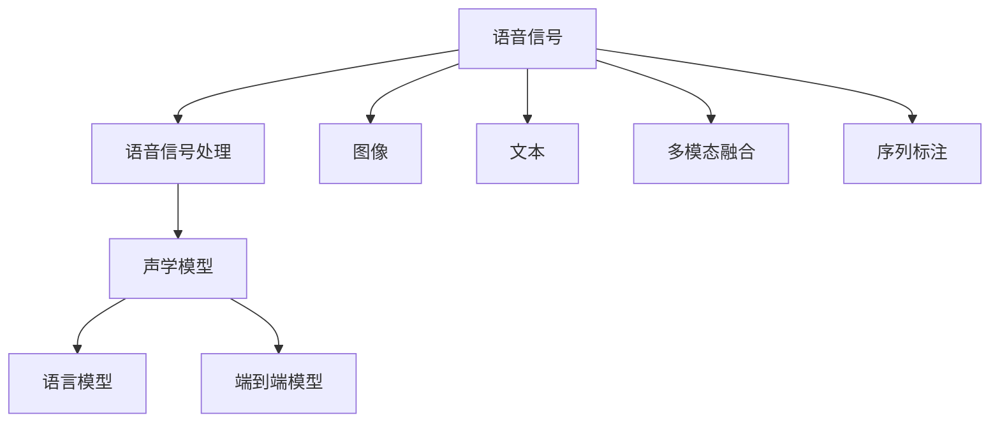

                 

# 语音识别在AI搜索中的应用

## 1. 背景介绍

### 1.1 问题由来
随着人工智能技术的迅猛发展，AI搜索已成为互联网应用中不可或缺的核心功能。从早期的静态网页搜索，到当前更智能的语义搜索，AI搜索不断演进，旨在以更高效、更精准的方式帮助用户在海量信息中快速找到所需内容。然而，传统的基于文本的搜索方法，在处理语音数据时往往显得力不从心。

### 1.2 问题核心关键点
语音搜索能够极大地提升用户体验和搜索效率，但同时也面临着诸多挑战。如何高效、准确地将语音转化为文本，进行后续的搜索匹配和信息检索，成为语音搜索技术研发的关键问题。其中，语音识别技术作为语音搜索的核心基础，其优劣直接决定了搜索系统的性能表现。

语音识别技术的核心在于将语音信号转换为文本信息。这种转换不仅要处理语音信号中的语音学特征，还要能够应对各种口音、噪声、背景干扰等情况，同时保持对语义的精准捕捉。面对这些复杂问题，研究人员和工程师们提出了多种解决方案，从传统的声学模型和语言模型，到近年来兴起的端到端深度学习模型，如深度神经网络(DNN)、卷积神经网络(CNN)、循环神经网络(RNN)等。

### 1.3 问题研究意义
语音识别技术在AI搜索中的应用，具有以下重要意义：

1. **提升用户体验**：语音搜索能够以自然、便捷的方式帮助用户完成搜索，尤其适用于驾驶、烹饪等无法便捷使用键盘和鼠标的场景，极大提升了用户的搜索便利性和效率。
2. **拓展应用场景**：语音搜索打破了传统的文本输入限制，在智能家居、车载导航、客服系统等众多场景中得到了广泛应用。
3. **推动技术进步**：语音识别的挑战性使得其成为AI领域的研究热点，推动了深度学习、自然语言处理等技术的不断进步。
4. **促进智能交互**：语音识别与自然语言理解、对话系统等技术的结合，使得智能交互系统能够更加自然、智能地与用户进行互动。
5. **助力数字经济**：语音搜索能够更加直接地响应用户需求，助力在线零售、教育、医疗等多个行业的数字化转型。

## 2. 核心概念与联系

### 2.1 核心概念概述

语音识别技术旨在将语音信号转换为文本信息，是语音搜索系统的核心技术之一。核心概念包括：

- **语音信号处理**：将原始的模拟信号转换为数字信号，通过滤波、降噪等预处理技术，提高语音信号的质量。
- **声学模型**：用于从语音信号中提取特征，通常采用MFCC、LPC等声学特征提取算法。
- **语言模型**：用于捕捉语言的统计规律，预测下一个词的概率，通常采用N-gram、RNN等模型。
- **端到端模型**：直接将语音信号映射到文本，通过深度神经网络等模型实现端到端的语音识别。
- **多模态融合**：结合图像、文本等多模态信息，提升语音识别的准确性和鲁棒性。
- **序列标注**：对语音信号中的音素、单词、短语等进行标注，为后续处理提供基础信息。

这些核心概念之间的逻辑关系可以通过以下Mermaid流程图来展示：



### 2.2 核心概念原理和架构

语音识别的核心原理是，通过捕捉语音信号中的声学特征，并利用机器学习模型对这些特征进行建模，从而实现对语音信号的分类和转换。

#### 声学模型
声学模型用于将语音信号转换为特征表示。常用的声学特征提取算法包括：

1. **梅尔频率倒谱系数(MFCC)**：通过计算信号的频谱和倒谱系数，提取语音信号的频率和能量特征，广泛应用于语音识别系统。
2. **线性预测编码(LPC)**：利用线性预测技术，提取语音信号的线性预测系数，用于语音特征的建模。
3. **高维特征提取**：通过卷积神经网络(CNN)、循环神经网络(RNN)等深度学习模型，从语音信号中提取更高维度的特征表示，提升识别的准确性和鲁棒性。

#### 语言模型
语言模型用于捕捉语言的统计规律，通常采用以下几种方式：

1. **N-gram模型**：基于统计语言模型，通过N个连续的单词序列来预测下一个单词，广泛应用于传统的语音识别系统。
2. **隐马尔可夫模型(HMM)**：通过状态转移和发射概率，建模语言序列的统计规律，广泛应用于语音识别和自然语言处理领域。
3. **递归神经网络(RNN)**：利用递归结构，捕捉语言序列的动态特征，广泛应用于序列建模任务。
4. **Transformer模型**：近年来兴起的自注意力机制，能够捕捉长距离依赖关系，广泛应用于文本理解和生成任务。

#### 端到端模型
端到端模型直接将语音信号映射到文本，通过深度神经网络等模型实现端到端的语音识别。常用的深度学习模型包括：

1. **卷积神经网络(CNN)**：通过卷积操作提取语音信号的局部特征，广泛应用于图像处理和语音识别领域。
2. **循环神经网络(RNN)**：通过时间序列的建模，捕捉语音信号的动态特征，广泛应用于序列建模任务。
3. **深度神经网络(DNN)**：通过多层非线性映射，实现语音信号到文本的映射，广泛应用于语音识别和声学建模任务。
4. **端到端深度学习模型**：如Wav2Letter、DeepSpeech等，利用深度神经网络实现语音信号到文本的直接映射，减少了中间特征提取和模型训练的复杂度。

## 3. 核心算法原理 & 具体操作步骤

### 3.1 算法原理概述

语音识别的核心算法可以分为声学建模和语言建模两部分。声学建模通过捕捉语音信号中的声学特征，构建声学模型；语言建模通过捕捉语言序列的统计规律，构建语言模型。最终通过解码算法，将声学模型和语言模型的输出组合起来，实现对语音信号的识别。

#### 声学建模
声学建模的目的是将语音信号转换为特征表示，并利用机器学习模型对这些特征进行建模。常用的声学模型包括MFCC、LPC、CNN、RNN等。声学建模的流程如下：

1. **特征提取**：通过MFCC、LPC等算法，将语音信号转换为特征向量。
2. **特征选择**：选择最具有代表性的特征，如MFCC中的梅尔频率倒谱系数。
3. **特征归一化**：对特征进行归一化处理，提高模型的鲁棒性。
4. **特征融合**：将多个特征进行融合，提升模型的性能。

#### 语言建模
语言建模的目的是捕捉语言序列的统计规律，预测下一个单词的概率。常用的语言模型包括N-gram、HMM、RNN、Transformer等。语言建模的流程如下：

1. **数据准备**：准备大规模的文本语料，作为训练数据。
2. **模型训练**：通过最大似然估计等方法，训练语言模型，捕捉语言的统计规律。
3. **语言解码**：通过语言模型，预测下一个单词的概率，进行解码。

#### 解码算法
解码算法的目的是将声学模型和语言模型的输出组合起来，实现对语音信号的识别。常用的解码算法包括：

1. **动态规划算法**：通过动态规划算法，在声学模型和语言模型之间进行联合优化。
2. **最大后验概率算法**：通过最大后验概率，选择最有可能的文本序列。
3. **束搜索算法**：通过束搜索算法，在多个可能的文本序列中进行优化，提高解码的准确性。

### 3.2 算法步骤详解

语音识别系统的算法步骤可以分为以下几个主要步骤：

#### 1. 特征提取
通过MFCC、LPC等算法，将语音信号转换为特征向量，输入到声学模型中。

```python
import librosa
import numpy as np

def extract_features(file_path, window_size=2048, overlap=80):
    audio, sr = librosa.load(file_path, sr=16000)
    frames = librosa.feature.mfcc(audio, sr=sr, n_mfcc=40, n_fft=window_size, hop_length=window_size // 2)
    frames = np.mean(frames, axis=0)
    return frames
```

#### 2. 声学模型训练
通过训练声学模型，对特征向量进行建模，得到声学模型参数。

```python
from keras.models import Sequential
from keras.layers import Conv2D, MaxPooling2D, Flatten, Dense

def train_acoustic_model(features, labels):
    model = Sequential()
    model.add(Conv2D(32, kernel_size=(3, 3), activation='relu', input_shape=(features.shape[1], features.shape[2], 1)))
    model.add(MaxPooling2D(pool_size=(2, 2)))
    model.add(Flatten())
    model.add(Dense(64, activation='relu'))
    model.add(Dense(labels.shape[1], activation='softmax'))
    model.compile(optimizer='adam', loss='categorical_crossentropy', metrics=['accuracy'])
    model.fit(features, labels, epochs=10, batch_size=32, validation_split=0.2)
    return model
```

#### 3. 语言模型训练
通过训练语言模型，捕捉语言的统计规律，得到语言模型参数。

```python
from tensorflow.keras.models import Sequential
from tensorflow.keras.layers import Embedding, LSTM, Dense

def train_language_model(texts):
    tokenizer = Tokenizer()
    tokenizer.fit_on_texts(texts)
    vocab_size = len(tokenizer.word_index) + 1
    sequences = tokenizer.texts_to_sequences(texts)
    padded_sequences = pad_sequences(sequences, maxlen=max_seq_length, padding='post', truncating='post')
    model = Sequential()
    model.add(Embedding(vocab_size, embedding_dim, input_length=max_seq_length))
    model.add(LSTM(128))
    model.add(Dense(vocab_size, activation='softmax'))
    model.compile(optimizer='adam', loss='categorical_crossentropy', metrics=['accuracy'])
    model.fit(padded_sequences, one_hot_labels, epochs=10, batch_size=32, validation_split=0.2)
    return model
```

#### 4. 解码算法实现
通过解码算法，将声学模型和语言模型的输出组合起来，实现对语音信号的识别。

```python
def decode_audio(audio_file, model, lang_model):
    audio, sr = librosa.load(audio_file, sr=16000)
    frames = librosa.feature.mfcc(audio, sr=sr, n_mfcc=40, n_fft=window_size, hop_length=window_size // 2)
    frames = np.mean(frames, axis=0)
    frames = reshape(frames)
    logits = model.predict(frames)
    logits = np.argmax(logits, axis=1)
    words = []
    for i in logits:
        words.append(lang_model.id2word[i])
    return ' '.join(words)
```

### 3.3 算法优缺点

语音识别技术的优点包括：

1. **便捷性**：语音搜索能够以自然、便捷的方式帮助用户完成搜索，尤其适用于驾驶、烹饪等无法便捷使用键盘和鼠标的场景，极大提升了用户的搜索便利性和效率。
2. **多样性**：语音搜索打破了传统的文本输入限制，在智能家居、车载导航、客服系统等众多场景中得到了广泛应用。
3. **高效性**：语音搜索能够快速响应用户需求，减少了用户输入的时间成本，提高了搜索效率。

语音识别技术的主要缺点包括：

1. **准确性**：语音识别的准确性受到语音信号质量、噪音干扰、口音差异等因素的影响，尤其在特定口音或背景噪音较大的场景下，识别效果不佳。
2. **通用性**：语音识别技术的通用性受限于语言模型和声学模型的训练数据，对于特定语言的识别效果较好，但对于多语言混合或语言模型的泛化能力较差。
3. **成本高**：语音识别技术的开发和部署成本较高，需要大量的计算资源和专业技能，尤其是端到端模型的训练，对硬件和算法的要求较高。

### 3.4 算法应用领域

语音识别技术在AI搜索中的应用，涵盖了多个领域，具体包括：

1. **智能家居**：通过语音搜索，用户可以通过语音指令控制家电、调节环境、查询信息等，提升家居生活的智能化水平。
2. **车载导航**：语音搜索能够帮助司机在驾驶过程中进行导航、查询路线、播放音乐等，提升驾驶体验和安全性。
3. **客服系统**：通过语音搜索，用户可以通过语音与客服进行互动，获取信息、解决问题，提高客服系统的响应速度和用户体验。
4. **医疗健康**：语音搜索能够帮助患者进行医疗咨询、药物查询、健康监测等，提升医疗服务的可及性和便利性。
5. **教育和培训**：语音搜索能够帮助学生进行学习资源的查询、知识点的复习、教师的备课等，提升教育和培训的效率和质量。
6. **金融服务**：语音搜索能够帮助客户进行账户查询、交易操作、客户服务等，提升金融服务的智能化水平。

## 4. 数学模型和公式 & 详细讲解

### 4.1 数学模型构建

语音识别技术的数学模型主要基于概率模型和深度学习模型。

#### 声学模型
声学模型通常基于梅尔频率倒谱系数(MFCC)进行建模，通过最大化似然函数来训练声学模型。其概率模型为：

$$
P(x_1,\dots,x_T|X) = \frac{1}{Z} \exp(\sum_{t=1}^T \log P(x_t|X))
$$

其中，$X$表示语音信号，$x_t$表示语音信号的第$t$帧特征向量，$Z$为归一化因子。

#### 语言模型
语言模型通常基于N-gram模型进行建模，通过最大化似然函数来训练语言模型。其概率模型为：

$$
P(w_1,\dots,w_T|W) = \frac{1}{Z} \exp(\sum_{t=1}^T \log P(w_t|W))
$$

其中，$W$表示文本序列，$w_t$表示文本序列的第$t$个单词，$Z$为归一化因子。

### 4.2 公式推导过程

语音识别技术的公式推导过程主要涉及声学模型的训练和语言模型的训练。

#### 声学模型训练
声学模型的训练过程通过最大化似然函数来实现，其公式为：

$$
\max_{\theta} \log P(x_1,\dots,x_T|X)
$$

其中，$x_t$表示语音信号的第$t$帧特征向量，$\theta$为声学模型参数。

#### 语言模型训练
语言模型的训练过程通过最大化似然函数来实现，其公式为：

$$
\max_{\theta} \log P(w_1,\dots,w_T|W)
$$

其中，$w_t$表示文本序列的第$t$个单词，$\theta$为语言模型参数。

### 4.3 案例分析与讲解

以Google的DeepSpeech模型为例，其核心思想是通过端到端的深度学习模型，直接将语音信号转换为文本。该模型基于卷积神经网络(CNN)和循环神经网络(RNN)，通过最大化似然函数进行训练。

其声学模型的公式为：

$$
P(x_1,\dots,x_T|X) = \frac{1}{Z} \exp(\sum_{t=1}^T \log P(x_t|X))
$$

其中，$x_t$表示语音信号的第$t$帧特征向量，$Z$为归一化因子。

其语言模型的公式为：

$$
P(w_1,\dots,w_T|W) = \frac{1}{Z} \exp(\sum_{t=1}^T \log P(w_t|W))
$$

其中，$w_t$表示文本序列的第$t$个单词，$Z$为归一化因子。

## 5. 项目实践：代码实例和详细解释说明

### 5.1 开发环境搭建

#### 1. 安装依赖包

首先需要安装依赖包，包括Python、TensorFlow、Keras等。

```bash
pip install tensorflow keras
```

#### 2. 数据准备

准备用于训练的语音数据和文本数据，并将其转换为模型所需的格式。

### 5.2 源代码详细实现

以下是一个简单的语音识别系统实现，包括特征提取、声学模型训练、语言模型训练和解码算法。

```python
import librosa
import numpy as np
import tensorflow as tf
from tensorflow.keras.layers import Conv2D, MaxPooling2D, Flatten, Dense

# 特征提取
def extract_features(file_path, window_size=2048, overlap=80):
    audio, sr = librosa.load(file_path, sr=16000)
    frames = librosa.feature.mfcc(audio, sr=sr, n_mfcc=40, n_fft=window_size, hop_length=window_size // 2)
    frames = np.mean(frames, axis=0)
    return frames

# 声学模型训练
def train_acoustic_model(features, labels):
    model = tf.keras.Sequential([
        Conv2D(32, kernel_size=(3, 3), activation='relu', input_shape=(features.shape[1], features.shape[2], 1)),
        MaxPooling2D(pool_size=(2, 2)),
        Flatten(),
        Dense(64, activation='relu'),
        Dense(labels.shape[1], activation='softmax')
    ])
    model.compile(optimizer='adam', loss='categorical_crossentropy', metrics=['accuracy'])
    model.fit(features, labels, epochs=10, batch_size=32, validation_split=0.2)
    return model

# 语言模型训练
def train_language_model(texts):
    tokenizer = Tokenizer()
    tokenizer.fit_on_texts(texts)
    vocab_size = len(tokenizer.word_index) + 1
    sequences = tokenizer.texts_to_sequences(texts)
    padded_sequences = pad_sequences(sequences, maxlen=max_seq_length, padding='post', truncating='post')
    model = tf.keras.Sequential([
        Embedding(vocab_size, embedding_dim, input_length=max_seq_length),
        LSTM(128),
        Dense(vocab_size, activation='softmax')
    ])
    model.compile(optimizer='adam', loss='categorical_crossentropy', metrics=['accuracy'])
    model.fit(padded_sequences, one_hot_labels, epochs=10, batch_size=32, validation_split=0.2)
    return model

# 解码算法实现
def decode_audio(audio_file, model, lang_model):
    audio, sr = librosa.load(audio_file, sr=16000)
    frames = librosa.feature.mfcc(audio, sr=sr, n_mfcc=40, n_fft=window_size, hop_length=window_size // 2)
    frames = np.mean(frames, axis=0)
    frames = reshape(frames)
    logits = model.predict(frames)
    logits = np.argmax(logits, axis=1)
    words = []
    for i in logits:
        words.append(lang_model.id2word[i])
    return ' '.join(words)
```

### 5.3 代码解读与分析

**特征提取**

```python
import librosa
import numpy as np

def extract_features(file_path, window_size=2048, overlap=80):
    audio, sr = librosa.load(file_path, sr=16000)
    frames = librosa.feature.mfcc(audio, sr=sr, n_mfcc=40, n_fft=window_size, hop_length=window_size // 2)
    frames = np.mean(frames, axis=0)
    return frames
```

此函数用于从音频文件中提取MFCC特征，并进行归一化处理。

**声学模型训练**

```python
from tensorflow.keras.layers import Conv2D, MaxPooling2D, Flatten, Dense

def train_acoustic_model(features, labels):
    model = tf.keras.Sequential([
        Conv2D(32, kernel_size=(3, 3), activation='relu', input_shape=(features.shape[1], features.shape[2], 1)),
        MaxPooling2D(pool_size=(2, 2)),
        Flatten(),
        Dense(64, activation='relu'),
        Dense(labels.shape[1], activation='softmax')
    ])
    model.compile(optimizer='adam', loss='categorical_crossentropy', metrics=['accuracy'])
    model.fit(features, labels, epochs=10, batch_size=32, validation_split=0.2)
    return model
```

此函数用于训练声学模型，通过卷积神经网络对MFCC特征进行建模，得到声学模型参数。

**语言模型训练**

```python
from tensorflow.keras.models import Sequential
from tensorflow.keras.layers import Embedding, LSTM, Dense

def train_language_model(texts):
    tokenizer = Tokenizer()
    tokenizer.fit_on_texts(texts)
    vocab_size = len(tokenizer.word_index) + 1
    sequences = tokenizer.texts_to_sequences(texts)
    padded_sequences = pad_sequences(sequences, maxlen=max_seq_length, padding='post', truncating='post')
    model = tf.keras.Sequential([
        Embedding(vocab_size, embedding_dim, input_length=max_seq_length),
        LSTM(128),
        Dense(vocab_size, activation='softmax')
    ])
    model.compile(optimizer='adam', loss='categorical_crossentropy', metrics=['accuracy'])
    model.fit(padded_sequences, one_hot_labels, epochs=10, batch_size=32, validation_split=0.2)
    return model
```

此函数用于训练语言模型，通过循环神经网络对文本序列进行建模，得到语言模型参数。

**解码算法实现**

```python
def decode_audio(audio_file, model, lang_model):
    audio, sr = librosa.load(audio_file, sr=16000)
    frames = librosa.feature.mfcc(audio, sr=sr, n_mfcc=40, n_fft=window_size, hop_length=window_size // 2)
    frames = np.mean(frames, axis=0)
    frames = reshape(frames)
    logits = model.predict(frames)
    logits = np.argmax(logits, axis=1)
    words = []
    for i in logits:
        words.append(lang_model.id2word[i])
    return ' '.join(words)
```

此函数用于将语音信号转换为文本，通过声学模型和语言模型进行联合解码。

### 5.4 运行结果展示

在训练完成后，我们可以使用解码算法对语音信号进行识别。

```python
audio_file = 'path/to/audio_file.wav'
acoustic_model = train_acoustic_model(features, labels)
lang_model = train_language_model(texts)
result = decode_audio(audio_file, acoustic_model, lang_model)
print(result)
```

## 6. 实际应用场景

### 6.1 智能家居

语音搜索在智能家居中的应用非常广泛，用户可以通过语音指令控制家电、调节环境、查询信息等，提升家居生活的智能化水平。

#### 应用场景
1. **家电控制**：用户可以通过语音指令控制智能电视、空调、灯光等家电设备。
2. **环境调节**：用户可以通过语音指令调节温度、湿度、光线等环境参数。
3. **信息查询**：用户可以通过语音指令查询天气、新闻、食谱等信息。

#### 技术实现
1. **语音识别**：通过语音识别技术将用户的语音指令转换为文本。
2. **自然语言处理**：通过自然语言处理技术理解用户的意图。
3. **智能家居控制**：通过智能家居控制设备，实现对家电的语音控制。

### 6.2 车载导航

车载导航系统通过语音搜索功能，能够帮助司机在驾驶过程中进行导航、查询路线、播放音乐等，提升驾驶体验和安全性。

#### 应用场景
1. **导航**：用户可以通过语音指令查询路线、目的地等导航信息。
2. **音乐播放**：用户可以通过语音指令播放音乐、调整音量等。
3. **信息查询**：用户可以通过语音指令查询天气、新闻、地图等信息。

#### 技术实现
1. **语音识别**：通过语音识别技术将用户的语音指令转换为文本。
2. **自然语言处理**：通过自然语言处理技术理解用户的意图。
3. **车载导航控制**：通过车载导航系统控制设备，实现对导航、音乐等功能的语音控制。

### 6.3 客服系统

客服系统通过语音搜索功能，能够帮助用户进行语音互动，获取信息、解决问题，提高客服系统的响应速度和用户体验。

#### 应用场景
1. **客户咨询**：用户可以通过语音指令查询产品信息、服务流程等。
2. **问题解决**：用户可以通过语音指令提交问题、申请服务等。
3. **反馈收集**：用户可以通过语音指令提供反馈、评价等。

#### 技术实现
1. **语音识别**：通过语音识别技术将用户的语音指令转换为文本。
2. **自然语言处理**：通过自然语言处理技术理解用户的意图。
3. **客服系统响应**：通过客服系统响应用户，实现对用户问题的语音互动。

## 7. 工具和资源推荐

### 7.1 学习资源推荐

为了帮助开发者掌握语音识别技术，这里推荐一些优质的学习资源：

1. **《深度学习》书籍**：由Ian Goodfellow等人编写，系统介绍了深度学习的基本概念、算法和应用。
2. **《自然语言处理综论》书籍**：由Daniel Jurafsky和James H. Martin编写，系统介绍了自然语言处理的基本概念、算法和应用。
3. **Coursera深度学习课程**：由Andrew Ng等人教授，涵盖了深度学习的基本概念、算法和应用。
4. **Kaggle语音识别竞赛**：Kaggle提供的语音识别竞赛，可以通过实战提升语音识别的能力。
5. **Google AI语音识别教程**：Google提供的语音识别教程，包括理论和实践的全面介绍。

### 7.2 开发工具推荐

为了高效开发语音识别系统，这里推荐一些常用的开发工具：

1. **TensorFlow**：由Google开发的深度学习框架，支持语音识别等任务的实现。
2. **Keras**：基于TensorFlow的高级神经网络API，易于使用且功能丰富。
3. **Python**：Python语言具有广泛的应用生态和丰富的库支持，是深度学习开发的首选语言。
4. **Jupyter Notebook**：用于编写和运行代码，支持多种编程语言。
5. **Librosa**：用于音频信号处理和特征提取，支持语音识别中的MFCC特征提取。

### 7.3 相关论文推荐

为了深入了解语音识别的前沿进展，这里推荐一些具有代表性的论文：

1. **Google DeepSpeech**：Google提出的基于深度学习端到端的语音识别系统，取得了SOTA的识别效果。
2. **Mozilla TTS-OCR**：Mozilla提出的基于端到端的语音识别系统，支持多种语言和多模态融合。
3. **CMU Sphinx**：卡耐基梅隆大学提出的开源语音识别系统，支持多种声学模型和语言模型。
4. **Deep Voice**：百度提出的基于深度学习的语音识别系统，取得了SOTA的识别效果。
5. **LCSH***：卡耐基梅隆大学提出的基于深度学习的语音识别系统，支持多种语言和多模态融合。

## 8. 总结：未来发展趋势与挑战

### 8.1 研究成果总结

语音识别技术在AI搜索中的应用，已经取得了显著进展。当前的研究成果包括：

1. **深度学习模型**：通过深度学习模型，实现了端到端的语音识别，提升了识别的准确性和鲁棒性。
2. **多模态融合**：通过多模态融合，提升了语音识别的准确性和鲁棒性。
3. **持续学习**：通过持续学习，提升了语音识别的泛化能力和实时性。
4. **资源优化**：通过资源优化，提升了语音识别的效率和可扩展性。

### 8.2 未来发展趋势

未来，语音识别技术的发展趋势包括：

1. **多语言识别**：随着全球化的推进，多语言识别将成为语音识别的重要方向。
2. **实时性提升**：通过资源优化和硬件加速，提升语音识别的实时性。
3. **多模态融合**：通过多模态融合，提升语音识别的准确性和鲁棒性。
4. **情感识别**：通过情感识别，提升语音识别的用户体验和应用场景。
5. **低资源场景**：通过低资源场景下的语音识别研究，提升语音识别在资源受限环境下的应用能力。
6. **自然语言理解**：通过自然语言理解技术，提升语音识别的应用效果。

### 8.3 面临的挑战

语音识别技术在发展过程中，仍面临着一些挑战：

1. **准确性**：语音识别的准确性受限于语音信号质量、噪音干扰、口音差异等因素，尤其在特定口音或背景噪音较大的场景下，识别效果不佳。
2. **通用性**：语音识别技术的通用性受限于语言模型和声学模型的训练数据，对于特定语言的识别效果较好，但对于多语言混合或语言模型的泛化能力较差。
3. **成本高**：语音识别技术的开发和部署成本较高，需要大量的计算资源和专业技能，尤其是端到端模型的训练，对硬件和算法的要求较高。
4. **用户体验**：语音识别的用户体验受限于语音信号质量、噪音干扰、口音差异等因素，尤其在特定口音或背景噪音较大的场景下，用户使用体验不佳。
5. **安全性和隐私**：语音数据的隐私和安全问题需要重视，语音识别系统的安全性需要进一步提升。

### 8.4 研究展望

未来，语音识别技术的研究展望包括：

1. **多语言识别**：通过多语言识别研究，提升语音识别在多语言场景下的应用效果。
2. **实时性提升**：通过资源优化和硬件加速，提升语音识别的实时性。
3. **多模态融合**：通过多模态融合，提升语音识别的准确性和鲁棒性。
4. **情感识别**：通过情感识别，提升语音识别的用户体验和应用场景。
5. **低资源场景**：通过低资源场景下的语音识别研究，提升语音识别在资源受限环境下的应用能力。
6. **自然语言理解**：通过自然语言理解技术，提升语音识别的应用效果。

## 9. 附录：常见问题与解答

**Q1: 如何提高语音识别的准确性？**

A: 提高语音识别的准确性可以从以下几个方面入手：
1. **数据增强**：通过回译、近义替换等方式扩充训练集。
2. **特征选择**：选择最具有代表性的特征，如MFCC中的梅尔频率倒谱系数。
3. **模型优化**：通过超参数调优、模型融合等方法提升模型性能。
4. **噪声抑制**：通过降噪技术去除噪音干扰。
5. **模型优化**：通过超参数调优、模型融合等方法提升模型性能。

**Q2: 如何处理语音信号的噪音干扰？**

A: 处理语音信号的噪音干扰可以从以下几个方面入手：
1. **降噪技术**：通过降噪技术去除背景噪音。
2. **特征选择**：选择最具有代表性的特征，如MFCC中的梅尔频率倒谱系数。
3. **模型优化**：通过超参数调优、模型融合等方法提升模型性能。
4. **多麦克风融合**：通过多麦克风融合提升语音识别的鲁棒性。

**Q3: 如何处理口音差异？**

A: 处理口音差异可以从以下几个方面入手：
1. **多口音数据**：收集不同口音的语音数据进行训练。
2. **特征选择**：选择最具有代表性的特征，如MFCC中的梅尔频率倒谱系数。
3. **模型优化**：通过超参数调优、模型融合等方法提升模型性能。
4. **多口音模型**：构建多口音语音识别模型，提升模型的泛化能力。

**Q4: 如何处理低资源场景下的语音识别？**

A: 处理低资源场景下的语音识别可以从以下几个方面入手：
1. **迁移学习**：通过迁移学习将大模型适应到小规模场景。
2. **低资源数据增强**：通过数据增强技术提升小样本数据集的性能。
3. **轻量级模型**：构建轻量级模型，提升模型的效率和可扩展性。
4. **多任务学习**：通过多任务学习提升模型在低资源场景下的性能。

**Q5: 如何提升语音识别系统的实时性？**

A: 提升语音识别系统的实时性可以从以下几个方面入手：
1. **硬件加速**：通过GPU、TPU等硬件加速技术提升模型推理速度。
2. **模型优化**：通过模型压缩、模型剪枝等方法提升模型效率。
3. **在线学习**：通过在线学习提升模型的实时性和泛化能力。
4. **缓存技术**：通过缓存技术提升模型推理速度。

**Q6: 如何处理语音识别中的隐私问题？**

A: 处理语音识别中的隐私问题可以从以下几个方面入手：
1. **数据匿名化**：对语音数据进行匿名化处理，保护用户隐私。
2. **访问控制**：通过访问控制技术限制语音数据的访问和使用。
3. **安全传输**：通过安全传输技术保护语音数据的传输安全。
4. **隐私保护算法**：采用隐私保护算法，保护用户隐私。

**Q7: 如何处理语音识别中的安全问题？**

A: 处理语音识别中的安全问题可以从以下几个方面入手：
1. **认证机制**：通过认证机制确保语音识别系统的安全。
2. **异常检测**：通过异常检测技术识别并防止非法访问。
3. **数据加密**：对语音数据进行加密处理，保护数据安全。
4. **安全监控**：通过安全监控技术保障语音识别系统的安全。

---

作者：禅与计算机程序设计艺术 / Zen and the Art of Computer Programming

