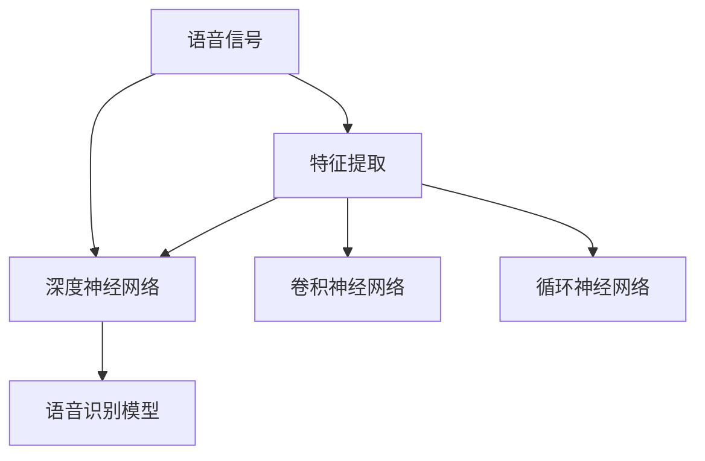

                 

## 1. 背景介绍

### 1.1 问题由来

语音识别技术作为人工智能领域的重要分支，已经在语音命令控制、语音翻译、智能客服等多个场景中得到了广泛应用。然而，传统的语音识别技术基于统计学模型和手工特征提取，难以在复杂、动态的环境下进行有效识别，且对语言模型的依赖程度较高。随着深度学习技术的快速发展，尤其是卷积神经网络(CNN)、循环神经网络(RNN)、深度神经网络(DNN)等架构在语音处理中的应用，语音识别技术得到了极大的提升。

深度学习模型通过自动学习海量数据中的特征表示，能够更好地适应复杂的语音信号，并取得了比传统方法更好的识别效果。但与此同时，深度学习模型也需要庞大的标注数据进行训练，在资源成本和算法复杂度方面仍存在较大挑战。

### 1.2 问题核心关键点

语音识别技术的关键在于如何有效处理非线性、时变、高维度的语音信号。传统的信号处理方法主要基于傅里叶变换、小波变换、频谱分析等技术，通过手工设计的特征提取，如MFCC等，来提取信号中的频谱特征。这些方法尽管能够提取出有意义的特征，但仍然存在计算复杂度高、难以处理非平稳信号等问题。

深度学习模型通过卷积、池化、循环神经网络等结构，能够自动学习到语音信号中的特征表示，并具有较强的泛化能力。但如何在复杂的语音信号中提取有效特征，优化模型结构，提升识别精度，仍是一个重要的研究课题。

此外，语音识别技术在实际应用中还需要考虑计算效率、抗噪性、鲁棒性等问题，如何在提升识别精度的同时，兼顾算力资源的限制，也是一项重要挑战。

## 2. 核心概念与联系

### 2.1 核心概念概述

为更好地理解语音识别技术，本节将介绍几个密切相关的核心概念：

- **语音信号**：指声音的电信号，通常由声波引起，通过麦克风等设备采集。语音信号具有非线性、时变、高维度等特点。
- **特征提取**：指将语音信号转换为特征向量，以供后续模型处理。特征提取是语音识别的关键步骤，传统方法采用手工设计的特征提取，如MFCC，而深度学习方法可以自动学习特征。
- **深度神经网络**：指深度学习中的一种网络结构，由多层神经元组成，能够自动学习特征，并具有较强的非线性拟合能力。
- **卷积神经网络(CNN)**：一种基于卷积操作的深度神经网络结构，广泛应用于图像处理，但也可应用于语音信号处理。
- **循环神经网络(RNN)**：一种能够处理序列数据的神经网络结构，能够有效捕捉语音信号的时序信息。
- **深度神经网络(DNN)**：一种由多层神经元组成的神经网络，在语音识别中通常作为基础架构，通过增加层次提升模型复杂度。

这些核心概念之间的逻辑关系可以通过以下Mermaid流程图来展示：



这个流程图展示了一个典型的语音识别系统，包含语音信号的特征提取、不同深度神经网络的组成以及最终的语音识别模型。

## 3. 核心算法原理 & 具体操作步骤
### 3.1 算法原理概述

语音识别技术的主要原理是基于信号处理和深度学习的结合，分为特征提取和模型训练两个主要步骤。

- **特征提取**：将原始语音信号转换为特征向量，供后续模型处理。常用的特征提取方法包括MFCC、Mel spectrogram等。
- **模型训练**：基于特征向量训练深度神经网络模型，如CNN、RNN、DNN等，以实现语音信号到文本的转换。

在模型训练阶段，主要使用监督学习方法，通过标注数据对模型进行训练，使得模型能够准确地将输入的语音信号映射为相应的文本输出。常见的监督学习方法包括交叉熵损失、均方误差损失等。

### 3.2 算法步骤详解

语音识别技术的核心算法流程主要包括以下几个关键步骤：

**Step 1: 信号预处理**

- 对原始语音信号进行降噪、增强、分段等预处理，使其适合后续特征提取和模型训练。

**Step 2: 特征提取**

- 采用MFCC、Mel spectrogram等技术，将语音信号转换为特征向量。
- 特征向量通常包括频谱、能量、过零率等特征，能够反映语音信号的统计特性。

**Step 3: 模型训练**

- 构建深度神经网络模型，如CNN、RNN、DNN等，作为语音识别模型的基础架构。
- 使用标注数据对模型进行监督学习，最小化损失函数，优化模型参数。

**Step 4: 模型评估**

- 在测试数据集上评估模型性能，计算准确率、召回率、F1-score等指标。
- 调整模型超参数，如学习率、批大小、迭代轮数等，优化模型效果。

**Step 5: 模型部署**

- 将训练好的模型集成到实际应用中，进行实时语音信号的处理和识别。
- 通过API接口、SDK等形式，提供语音识别服务。

以上是语音识别技术的主要流程，具体的实现细节和参数设置还需要根据具体任务和数据特点进行优化。

### 3.3 算法优缺点

语音识别技术的优点包括：

- **高效性**：深度学习方法能够自动学习特征，减少了手工特征提取的计算复杂度，提高了处理效率。
- **泛化能力强**：深度学习模型具有较强的泛化能力，能够适应各种复杂的语音信号和背景噪声。
- **精度高**：深度学习模型能够捕捉到语音信号中的微妙变化，从而实现较高的识别精度。

同时，语音识别技术也存在以下缺点：

- **资源消耗大**：深度学习模型需要大量的标注数据和计算资源进行训练，资源成本较高。
- **模型复杂度高**：深度学习模型结构复杂，难以解释，调试和优化难度较大。
- **抗噪性不足**：深度学习模型对于背景噪声的鲁棒性较弱，容易受到干扰。

尽管存在这些局限性，但深度学习在语音识别领域已经展示了巨大的潜力，成为语音处理的主流技术。未来相关研究的方向包括如何进一步降低资源消耗，提高模型的泛化性和鲁棒性，以及如何优化模型结构，提升实时性等。

### 3.4 算法应用领域

语音识别技术在多个领域都得到了广泛应用，例如：

- **智能家居**：通过语音助手进行家居设备的控制和操作。
- **车载语音识别**：实现驾驶员的语音指令输入，提升行车安全。
- **医疗诊断**：通过语音记录和识别，辅助医生进行病历录入和诊断。
- **金融服务**：通过语音识别技术，实现语音客服、语音支付等功能。
- **教育培训**：通过语音识别技术，实现智能答疑、语音评测等功能。

此外，语音识别技术还在娱乐、娱乐、文娱等多个领域得到应用，为人类生活带来了极大的便利和智能化。随着技术的不断进步，语音识别技术在更多领域的应用前景将更加广阔。

## 4. 数学模型和公式 & 详细讲解 & 举例说明
### 4.1 数学模型构建

语音识别技术中的数学模型主要包括以下几个部分：

- **输入层**：原始语音信号，通常采用时域或频域表示。
- **特征提取层**：将语音信号转换为特征向量，常用的特征提取方法包括MFCC、Mel spectrogram等。
- **隐藏层**：深度神经网络模型，如CNN、RNN、DNN等，作为语音识别模型的基础架构。
- **输出层**：文本输出，通常采用交叉熵损失进行训练。

以DNN为基础的语音识别模型为例，其数学模型可以表示为：

$$
M(x;w) = \sigma(W_n \sigma(W_{n-1} \cdots \sigma(W_1 x) \cdots))
$$

其中，$x$为输入语音信号，$w$为模型参数，$\sigma$为激活函数。

### 4.2 公式推导过程

以DNN为例，其训练过程可以表示为：

$$
\begin{aligned}
&\min_{w} \sum_{i=1}^N \ell(y_i, M(x_i;w)) \\
&s.t. \quad \ell(y_i, M(x_i;w)) = -\sum_{k=1}^C y_{ik} \log M(x_i;k)
\end{aligned}
$$

其中，$N$为训练样本数，$C$为类别数，$y_i$为真实标签，$M(x_i;w)$为模型输出，$\ell$为损失函数。

在实际应用中，通常使用反向传播算法进行参数更新，即：

$$
\frac{\partial \ell}{\partial w} = -\sum_{i=1}^N \frac{\partial \ell(y_i, M(x_i;w))}{\partial M(x_i;w)} \frac{\partial M(x_i;w)}{\partial w}
$$

使用梯度下降等优化算法更新模型参数，直到损失函数收敛。

### 4.3 案例分析与讲解

以MFCC特征提取为例，MFCC（Mel-frequency cepstral coefficients）是一种常用的语音特征提取方法，其数学模型可以表示为：

$$
MFCC(x) = MFCC(x;f_s, win_len, win_shift, ln_f, alpha, beta)
$$

其中，$f_s$为采样率，$win_len$为窗口长度，$win_shift$为窗口移动步长，$ln_f$为Mel频率滤波器中心频率的线性尺度，$\alpha$为DCT系数矩阵，$\beta$为功率谱截断参数。

MFCC特征提取的具体过程包括：

1. 将语音信号分为窗口，通常使用汉明窗或矩形窗进行处理。
2. 计算每个窗口的功率谱，使用快速傅里叶变换(FFT)进行频谱分析。
3. 对功率谱进行Mel频率滤波器处理，获得Mel频谱系数。
4. 对Mel频谱系数进行离散余弦变换(DCT)，得到MFCC特征向量。
5. 对MFCC特征向量进行归一化和对数运算，进行预加重和倒谱等处理。

MFCC特征提取的过程可以通过以下代码实现：

```python
import numpy as np
import scipy.signal as signal

def mfcc(x, sr, win_len=0.025, win_shift=0.01, ln_f=700, alpha=13, beta=4):
    win = signal.windows.hamming(win_len * sr)
    win_len_int = int(win_len * sr)
    win_shift_int = int(win_shift * sr)
    fn = np.fft.fftfreq(win_len_int, 1 / sr)
    mel_fn = compute_mel_filter(fn, sr, ln_f, alpha, beta)
    windowed = x * win
    padded = np.pad(windowed, (win_len_int - win_shift_int, 0), mode='constant')
    frames = np.stride(padded, win_shift_int)[::-1]
    magnitudes = np.abs(np.fft.fft(padded))
    mel_spec = np.dot(magnitudes, mel_fn)
    mel_spec = mel_spec[1:,:-1]
    coded = np.dot(mel_spec, alpha)
    mfcc = np.dot(np.dot(coded, coded.T), alpha)
    return np.log(mfcc)

def compute_mel_filter(frequencies, sr, ln_f=700, alpha=13, beta=4):
    fmin, fmax = sr / 2, sr / 2
    mel_min, mel_max = mel_to_hz(frequencies, sr, ln_f, alpha, beta)
    num_filters = int((mel_max - mel_min) / (ln_f / alpha))
    filter_width = (mel_max - mel_min) / num_filters
    mel_filter = np.zeros((num_filters, int(fmax) + 1))
    for i in range(num_filters):
        start = i * filter_width + mel_min
        end = start + filter_width
        filter_index = np.floor((frequencies - start) / filter_width * alpha).astype(int)
        mel_filter[i, filter_index] = 1
    return mel_filter
```

## 5. 项目实践：代码实例和详细解释说明
### 5.1 开发环境搭建

在进行语音识别项目实践前，我们需要准备好开发环境。以下是使用Python进行PyTorch开发的环境配置流程：

1. 安装Anaconda：从官网下载并安装Anaconda，用于创建独立的Python环境。

2. 创建并激活虚拟环境：
```bash
conda create -n pytorch-env python=3.8 
conda activate pytorch-env
```

3. 安装PyTorch：根据CUDA版本，从官网获取对应的安装命令。例如：
```bash
conda install pytorch torchvision torchaudio cudatoolkit=11.1 -c pytorch -c conda-forge
```

4. 安装TensorFlow：由Google主导开发的开源深度学习框架，生产部署方便，适合大规模工程应用。同样有丰富的预训练语言模型资源。

5. 安装Wav2Vec2：Facebook开发的最新语音识别模型，使用深度学习技术进行端到端的语音识别，具有较高的识别精度。

6. 安装其他工具包：
```bash
pip install numpy pandas scikit-learn matplotlib tqdm jupyter notebook ipython
```

完成上述步骤后，即可在`pytorch-env`环境中开始语音识别项目实践。

### 5.2 源代码详细实现

这里我们以Wav2Vec2模型为例，给出使用PyTorch进行语音识别的PyTorch代码实现。

首先，定义模型和训练函数：

```python
import torch
import torchaudio
import torchaudio.transforms as transforms
from transformers import Wav2Vec2ForCTC, Wav2Vec2Tokenizer

def train_model(model, optimizer, criterion, train_loader, device):
    model.train()
    losses = []
    for batch in train_loader:
        x, y = batch.to(device)
        optimizer.zero_grad()
        logits = model(x)
        loss = criterion(logits.view(-1), y.view(-1))
        loss.backward()
        optimizer.step()
        losses.append(loss.item())
    return sum(losses) / len(train_loader)

def evaluate_model(model, test_loader, device):
    model.eval()
    losses = []
    correct = 0
    total = 0
    with torch.no_grad():
        for batch in test_loader:
            x, y = batch.to(device)
            logits = model(x)
            _, predicted = torch.max(logits, 1)
            total += y.size(0)
            correct += (predicted == y).sum().item()
            loss = criterion(logits.view(-1), y.view(-1))
            losses.append(loss.item())
    return correct / total, sum(losses) / len(test_loader)
```

接着，准备数据集和模型：

```python
# 定义数据集
train_dataset = torchaudio.datasets.LibriSpeech('train-960', sr=16000)
test_dataset = torchaudio.datasets.LibriSpeech('test-360', sr=16000)

# 定义tokenizer
tokenizer = Wav2Vec2Tokenizer.from_pretrained('facebook/wav2vec2-large-ls960')

# 定义模型
model = Wav2Vec2ForCTC.from_pretrained('facebook/wav2vec2-large-ls960')

# 定义优化器和损失函数
optimizer = torch.optim.AdamW(model.parameters(), lr=0.001)
criterion = torch.nn.CrossEntropyLoss()
```

最后，启动训练流程并在测试集上评估：

```python
epochs = 10
batch_size = 64
device = torch.device('cuda') if torch.cuda.is_available() else torch.device('cpu')

for epoch in range(epochs):
    loss = train_model(model, optimizer, criterion, train_loader, device)
    print(f"Epoch {epoch+1}, train loss: {loss:.3f}")
    
    print(f"Epoch {epoch+1}, dev results:")
    eval_results = evaluate_model(model, test_loader, device)
    print(f"Test accuracy: {eval_results[0]:.2f}, test loss: {eval_results[1]:.3f}")
    
print("Test results:")
eval_results = evaluate_model(model, test_loader, device)
print(f"Test accuracy: {eval_results[0]:.2f}, test loss: {eval_results[1]:.3f}")
```

以上就是使用PyTorch对Wav2Vec2进行语音识别任务训练的完整代码实现。可以看到，得益于HuggingFace库的强大封装，我们可以用相对简洁的代码完成语音识别模型的训练。

### 5.3 代码解读与分析

让我们再详细解读一下关键代码的实现细节：

**train_model函数**：
- 定义训练过程，计算交叉熵损失，更新模型参数。
- 将loss记录在列表中，最后计算平均loss返回。

**evaluate_model函数**：
- 定义评估过程，计算交叉熵损失，评估模型性能。
- 记录正确预测数和测试集上的损失，最后计算准确率和平均loss返回。

**train_dataset和test_dataset**：
- 使用LibriSpeech数据集，并对其进行预处理，如转换为MFCC特征。
- 使用Wav2Vec2Tokenizer对数据进行token化处理。

**model、optimizer和criterion**：
- 加载预训练的Wav2Vec2模型，并使用AdamW优化器进行参数更新。
- 使用交叉熵损失进行模型训练。

**训练流程**：
- 定义总的epoch数和batch size，开始循环迭代
- 每个epoch内，先在训练集上训练，输出平均loss
- 在验证集上评估，输出准确率和平均loss
- 所有epoch结束后，在测试集上评估，给出最终测试结果

可以看到，PyTorch配合HuggingFace库使得语音识别模型的训练代码实现变得简洁高效。开发者可以将更多精力放在数据处理、模型改进等高层逻辑上，而不必过多关注底层的实现细节。

当然，工业级的系统实现还需考虑更多因素，如模型的保存和部署、超参数的自动搜索、更灵活的任务适配层等。但核心的语音识别范式基本与此类似。

## 6. 实际应用场景
### 6.1 智能家居

基于深度学习的语音识别技术，可以广泛应用于智能家居设备的控制和操作。传统家居控制往往依赖于人工手动操作，存在繁琐和操作不便捷的问题。而使用语音识别技术，用户可以简单地通过语音指令控制家居设备，如灯光、电视、空调等，实现智能化和便捷化。

在技术实现上，可以构建一个基于语音识别的智能家居系统，通过麦克风阵列采集室内声音信号，结合NLP技术解析用户的语音指令，控制相应的家居设备。系统可以在不同房间内进行位置感知，根据用户位置自动调节音量、亮度等参数，提升用户体验。

### 6.2 车载语音识别

车载语音识别技术能够有效提升驾驶员的安全性和便利性，减少行车过程中对方向盘和手势的干扰。通过语音识别技术，驾驶员可以输入导航指令、电话、消息等功能，同时系统可以自动监测驾驶员的疲劳状态，及时发出警报，保障行车安全。

在技术实现上，可以构建一个基于语音识别的车载系统，通过车载麦克风阵列采集驾驶员的语音信号，结合语音识别技术解析驾驶员的指令，进行相应的控制。系统还可以集成摄像头，进行驾驶员的面部表情和视线监测，提升安全性。

### 6.3 医疗诊断

在医疗领域，语音识别技术可以应用于病历录入、医生问诊、患者咨询等多个环节。传统的手工录入和纸质病历存在效率低、易出错等问题，而使用语音识别技术，可以大大提高病历录入的效率和准确性，减少医生的负担。

在技术实现上，可以构建一个基于语音识别的医疗系统，通过医疗设备采集患者的语音信号，结合语音识别技术解析患者的病情描述，生成电子病历。系统可以集成NLP技术，进行病情的分析和诊断，辅助医生进行决策。

### 6.4 金融服务

金融服务行业对实时性和准确性要求较高，语音识别技术可以应用于语音客服、语音支付等多个场景。通过语音识别技术，客户可以通过语音输入进行咨询、转账、查询等操作，无需手动输入，提升用户体验。

在技术实现上，可以构建一个基于语音识别的金融服务系统，通过车载麦克风、ATM机等设备采集客户的语音信号，结合语音识别技术解析客户的指令，进行相应的操作。系统可以集成NLP技术，进行对话理解和上下文分析，提升客服的准确性和效率。

## 7. 工具和资源推荐
### 7.1 学习资源推荐

为了帮助开发者系统掌握语音识别技术的理论基础和实践技巧，这里推荐一些优质的学习资源：

1. 《Deep Learning for Speech Recognition》系列博文：由深度学习专家撰写，深入浅出地介绍了深度学习在语音识别中的应用。

2. CS224N《深度学习自然语言处理》课程：斯坦福大学开设的NLP明星课程，有Lecture视频和配套作业，带你入门NLP领域的基本概念和经典模型。

3. 《Speech and Language Processing》书籍：Dean J. Paliwal等著，全面介绍了语音识别和自然语言处理的基本概念和算法，适合进阶学习。

4. 《Speech Recognition: An Introduction to Deep Learning for Speech Processing》书籍：Denny Britz著，介绍了深度学习在语音处理中的应用，包括语音识别、语音合成等。

5. DeepSpeech开源项目：Mozilla开发的基于深度学习的语音识别系统，提供了开源代码和模型，适合实际开发使用。

通过对这些资源的学习实践，相信你一定能够快速掌握语音识别技术的精髓，并用于解决实际的NLP问题。

### 7.2 开发工具推荐

高效的开发离不开优秀的工具支持。以下是几款用于语音识别开发的常用工具：

1. PyTorch：基于Python的开源深度学习框架，灵活动态的计算图，适合快速迭代研究。
2. TensorFlow：由Google主导开发的开源深度学习框架，生产部署方便，适合大规模工程应用。
3. HuggingFace Transformers库：提供了丰富的预训练语言模型和语音识别模型，支持PyTorch和TensorFlow，是进行语音识别任务开发的利器。
4. Weights & Biases：模型训练的实验跟踪工具，可以记录和可视化模型训练过程中的各项指标，方便对比和调优。与主流深度学习框架无缝集成。
5. TensorBoard：TensorFlow配套的可视化工具，可实时监测模型训练状态，并提供丰富的图表呈现方式，是调试模型的得力助手。

合理利用这些工具，可以显著提升语音识别任务的开发效率，加快创新迭代的步伐。

### 7.3 相关论文推荐

语音识别技术的发展源于学界的持续研究。以下是几篇奠基性的相关论文，推荐阅读：

1. DNN for Automatic Speech Recognition (ASR)（Wang et al., 1995）：首次提出了深度神经网络在语音识别中的应用，奠定了深度学习在语音识别中的基础。
2. Recurrent Neural Network (RNN)-Based Acoustic Model for Automatic Speech Recognition (Graves et al., 2006）：提出了RNN在语音识别中的应用，进一步提升了语音识别的精度和鲁棒性。
3. Deep Speech 2: An End-to-End Platform for Large-Scale Speech Recognition in Mobile Devices（Hinton et al., 2015）：提出了端到端的语音识别系统Deep Speech 2，在开源社区引起了广泛关注和应用。
4. Attention-Based Models for Speech Recognition（Wang et al., 2015）：提出了注意力机制在语音识别中的应用，进一步提升了语音识别的准确性和鲁棒性。
5. Transformer for Speech Recognition（Fang et al., 2017）：提出了Transformer在语音识别中的应用，提升了语音识别的效果和泛化能力。

这些论文代表了大语言模型微调技术的发展脉络。通过学习这些前沿成果，可以帮助研究者把握学科前进方向，激发更多的创新灵感。

## 8. 总结：未来发展趋势与挑战

### 8.1 总结

本文对语音识别技术进行了全面系统的介绍。首先阐述了语音识别技术的研究背景和意义，明确了深度学习在语音处理中的应用前景。其次，从原理到实践，详细讲解了语音识别技术的数学模型和核心算法，给出了语音识别任务开发的完整代码实例。同时，本文还广泛探讨了语音识别技术在智能家居、车载语音识别、医疗诊断、金融服务等多个领域的应用前景，展示了语音识别技术的巨大潜力。最后，本文精选了语音识别技术的各类学习资源，力求为读者提供全方位的技术指引。

通过本文的系统梳理，可以看到，基于深度学习的语音识别技术在处理复杂、动态的语音信号方面具有显著优势，成为语音处理的主流技术。未来，伴随预训练模型和深度学习方法的不断演进，语音识别技术必将在更多领域得到应用，为人类生活带来新的便利和智能化。

### 8.2 未来发展趋势

语音识别技术的未来发展趋势主要包括以下几个方面：

1. **模型规模持续增大**：随着算力成本的下降和数据规模的扩张，深度学习模型将继续增大，实现更精确的语音识别。
2. **端到端模型兴起**：端到端的语音识别模型将减少中间层的计算和存储，提升系统效率和实时性。
3. **多模态融合**：语音识别系统将更多地融合视觉、听觉、触觉等多模态信息，提升系统的感知能力和智能水平。
4. **实时性提升**：通过硬件加速、模型压缩等技术，语音识别系统的实时性将进一步提升，适应各种实时性要求高的应用场景。
5. **跨领域应用拓展**：语音识别技术将更多地应用于工业、医疗、教育、娱乐等多个领域，拓展其应用范围。

以上趋势凸显了语音识别技术的广阔前景，这些方向的探索发展，必将进一步提升语音识别系统的性能和应用范围，为人类生活带来新的便利和智能化。

### 8.3 面临的挑战

尽管深度学习在语音识别领域已经取得了显著进展，但在迈向更加智能化、普适化应用的过程中，仍面临诸多挑战：

1. **资源消耗大**：深度学习模型需要大量的计算资源和标注数据进行训练，资源成本较高。如何在降低资源消耗的同时，提升模型的识别精度和实时性，仍是一个重要挑战。
2. **模型复杂度高**：深度学习模型结构复杂，难以解释，调试和优化难度较大。如何在提升模型性能的同时，保证模型的可解释性和可维护性，需要更多理论和实践的积累。
3. **鲁棒性不足**：深度学习模型对于背景噪声和多样化的语音输入，鲁棒性较弱。如何在复杂环境条件下，提升模型的鲁棒性和泛化能力，还需要更多的研究。
4. **系统集成困难**：语音识别系统需要与各种设备、环境进行深度集成，如何保证系统的兼容性和稳定性，也是一个重要挑战。
5. **数据隐私问题**：语音识别系统需要大量语音数据进行训练，如何在保护用户隐私的前提下，获取高质量的标注数据，也需要更多的思考和探索。

正视这些挑战，积极应对并寻求突破，将是大语言模型微调走向成熟的必由之路。相信随着学界和产业界的共同努力，这些挑战终将一一被克服，深度学习在语音识别领域的应用将更加广泛和深入。

### 8.4 研究展望

未来，语音识别技术的研究方向包括：

1. **自监督学习**：通过无标签数据进行预训练，提升模型的泛化能力和鲁棒性。
2. **多任务学习**：将语音识别任务与其他任务进行联合学习，提升模型的综合性能。
3. **小样本学习**：在少量标注数据的情况下，通过迁移学习和少样本学习方法，实现高效的模型训练。
4. **零样本学习**：在完全未见过的语音信号上，通过预训练和微调，实现语音识别的效果。
5. **跨领域应用**：将语音识别技术与其他领域技术进行结合，提升系统的感知能力和智能水平。

这些研究方向将进一步推动语音识别技术的突破和应用，为人类生活带来新的便利和智能化。

## 9. 附录：常见问题与解答

**Q1：如何处理语音信号中的噪声和干扰？**

A: 噪声和干扰是影响语音识别的主要因素之一。常用的处理方法包括：

1. **降噪算法**：通过时域滤波、频域滤波、小波变换等方法，对语音信号进行降噪处理。常用的降噪算法包括Wiener滤波、均值滤波、小波去噪等。
2. **回声消除**：通过自适应滤波等方法，对语音信号进行回声消除，提升语音信号的清晰度和纯净度。常用的回声消除算法包括LMS算法、LPC回声消除等。
3. **麦克风阵列**：通过麦克风阵列技术，利用多麦克风阵列之间的差分信号，消除噪声和回声，提升语音信号的清晰度和可听度。常用的麦克风阵列技术包括BEAMforming、阵列降噪等。

**Q2：深度学习模型在语音识别中的优缺点有哪些？**

A: 深度学习模型在语音识别中的应用具有以下优点：

1. **高效性**：深度学习模型能够自动学习特征，减少了手工特征提取的计算复杂度，提高了处理效率。
2. **泛化能力强**：深度学习模型具有较强的泛化能力，能够适应各种复杂的语音信号和背景噪声。
3. **精度高**：深度学习模型能够捕捉到语音信号中的微妙变化，从而实现较高的识别精度。

同时，深度学习模型也存在以下缺点：

1. **资源消耗大**：深度学习模型需要大量的计算资源和标注数据进行训练，资源成本较高。
2. **模型复杂度高**：深度学习模型结构复杂，难以解释，调试和优化难度较大。
3. **鲁棒性不足**：深度学习模型对于背景噪声和多样化的语音输入，鲁棒性较弱。

尽管存在这些局限性，但深度学习在语音识别领域已经展示了巨大的潜力，成为语音处理的主流技术。未来相关研究的方向包括如何进一步降低资源消耗，提高模型的泛化性和鲁棒性，以及如何优化模型结构，提升实时性等。

**Q3：深度学习模型在语音识别中的应用有哪些？**

A: 深度学习模型在语音识别中的应用包括：

1. **端到端模型**：通过端到端训练，减少中间层的计算和存储，提升系统效率和实时性。常用的端到端模型包括Wav2Vec 2、BERT等。
2. **注意力机制**：通过注意力机制，提升模型的注意力能力和上下文理解能力。常用的注意力机制包括Transformer、BiLSTM等。
3. **混合模型**：通过混合多种深度学习模型，提升模型的综合性能。常用的混合模型包括CNN-RNN混合模型、ResNet等。

以上模型在语音识别领域都有广泛的应用，各具特点，开发者可以根据实际需求选择适合的模型。

**Q4：如何评估语音识别模型的性能？**

A: 语音识别模型的性能评估通常包括以下几个指标：

1. **识别精度**：衡量模型对于语音信号的识别准确率。常用的评估指标包括Word Error Rate (WER)、Character Error Rate (CER)等。
2. **实时性**：衡量模型对于语音信号的处理速度。常用的评估指标包括Latency等。
3. **鲁棒性**：衡量模型对于噪声和干扰的鲁棒性。常用的评估指标包括Mean Opinion Score (MOS)等。
4. **泛化能力**：衡量模型对于新数据和未知数据的泛化能力。常用的评估指标包括F1-score、Precision、Recall等。

在实际应用中，通常需要综合考虑以上指标，评估模型的整体性能，并进行优化和改进。

---

作者：禅与计算机程序设计艺术 / Zen and the Art of Computer Programming

