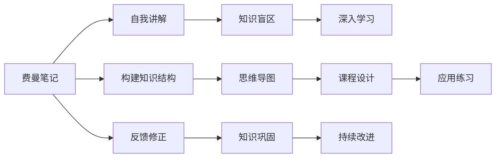

                 

# 费曼提问法:开启管理者思维升级

> 关键词：费曼学习法,知识传授,深度思考,管理者,思维升级,学习理论

## 1. 背景介绍

### 1.1 问题由来
在当今信息爆炸的时代，知识更新迭代的速度之快令人目不暇接。管理者们在繁忙的工作中，往往面临着复杂的决策问题，需要快速理解和掌握各类专业知识。然而，繁重的工作任务和有限的学习时间之间存在尖锐的矛盾，管理者们往往难以找到有效的学习途径。

针对这一问题，物理学家理查德·费曼(Richard Feynman)提出的“费曼学习法”(The Feynman Technique)提供了一种以教为学的新型学习方式。费曼学习法强调通过教别人来加深自己的理解，从而达到高效学习的目标。

### 1.2 问题核心关键点
费曼学习法旨在通过知识的传授，实现深度的自我理解和知识掌握。其核心在于：
- 深入理解并能够讲解所学知识，从而夯实基础。
- 通过讲解过程中的反哺和反馈，揭示知识盲区，深化理解。
- 建立系统化的知识结构，提升决策和管理的综合能力。

费曼学习法对管理者思维升级的意义在于：
1. 促进深度思考。通过自我讲解，管理者可以系统梳理知识，从细节中发现问题，不断深入思考。
2. 提高沟通效率。讲解可以帮助管理者更好地与团队成员交流，明确决策意图和思路。
3. 增强问题解决能力。讲解过程中遇到的问题，可以促使管理者寻求多种解决方案，锻炼综合能力。
4. 强化认知提升。讲解不仅能巩固知识，还能激发创新的思维火花，推动知识和技能的不断迭代。

### 1.3 问题研究意义
费曼学习法为管理者提供了一种高效的知识获取和思维升级方法。通过学习和运用费曼学习法，管理者可以：

1. 掌握复杂知识。在快速变化的市场环境中，管理者需要不断更新自身的知识储备，费曼学习法帮助他们以高效的方式获取新知。
2. 提升决策水平。通过系统化、结构化的知识结构，管理者可以更全面地理解问题，制定科学合理的决策方案。
3. 增强团队协作。讲解是团队知识共享的重要方式，管理者通过费曼学习法可以加强与团队的沟通与协作。
4. 推动自我超越。持续的自我讲解和反馈机制，使管理者不断发现自身不足，促进自身能力的不断提升。

## 2. 核心概念与联系

### 2.1 核心概念概述

费曼学习法的核心概念包括：
- 费曼笔记(Feynman Notes)：详细记录所学知识的结构、关键点和疑问。
- 自我讲解(Self-Explanation)：以第三方的视角，系统讲解所学内容，达到深度理解的目的。
- 知识盲区(Knowledge Gaps)：通过讲解过程中发现的知识盲点和误区，进一步学习和修正。

### 2.2 核心概念原理和架构的 Mermaid 流程图



### 2.3 核心概念原理与架构

费曼学习法的核心原理在于通过“教”和“学”的循环迭代，达到深度理解的目的。其主要架构分为以下几个部分：

1. **费曼笔记**：将所学知识通过文字、图片、思维导图等形式，系统化地记录下来。费曼笔记不仅是学习过程的记录，也是后续讲解的辅助工具。
2. **自我讲解**：以第三方的视角，用通俗易懂的语言将所学内容讲解出来。自我讲解要求讲解者将知识条理化、逻辑化，力求清晰准确。
3. **知识盲区**：通过自我讲解，反馈讲解过程中遇到的知识盲点，从而发现问题并解决。这一步骤是学习的关键，是发现知识盲区并加以弥补的过程。
4. **深入学习**：针对知识盲区，进行深入学习和补充，确保知识体系的无缝连接。
5. **知识巩固**：通过反复练习和应用，将所学知识牢固掌握。这一步骤是巩固知识、提升应用能力的关键。

## 3. 核心算法原理 & 具体操作步骤

### 3.1 算法原理概述

费曼学习法本质上是一种以教为学的学习方式，通过讲解的过程实现知识的深层次理解和掌握。其核心思想是：
- 通过详细记录费曼笔记，系统化地梳理知识。
- 通过自我讲解，用通俗易懂的语言将知识传授给他人。
- 通过讲解过程中的反馈，发现和弥补知识盲区，深化理解。
- 通过反复练习和应用，巩固知识，提升综合能力。

### 3.2 算法步骤详解

费曼学习法的具体操作步骤如下：

**Step 1: 准备学习材料**
- 选择学习主题，收集相关资料，构建费曼笔记。
- 记录笔记的同时，明确核心知识点和逻辑结构。

**Step 2: 构建知识结构**
- 使用思维导图等工具，系统化地梳理知识，构建清晰的逻辑框架。
- 将知识按照不同的模块和层次进行分类，形成一个完整的知识体系。

**Step 3: 自我讲解**
- 选择知识点，用通俗易懂的语言进行讲解。
- 注意语言简洁明了，避免使用过于专业的术语，让听众能理解。
- 记录讲解过程中的疑惑和问题，作为后续深入学习的方向。

**Step 4: 反馈和修正**
- 针对讲解中的疑惑和问题，进行深入学习和补充。
- 可以寻找领域内的专家进行交流，或参考相关书籍和资料，进一步掌握知识。
- 将修正后的知识重新记录到费曼笔记中，形成更完善的知识体系。

**Step 5: 知识巩固**
- 通过实际问题应用，巩固所学知识。
- 设计练习题或模拟场景，将知识应用到具体情境中，加深理解。
- 反复练习，直到完全掌握，然后可以将其教授给他人，验证掌握程度。

### 3.3 算法优缺点

费曼学习法的优点：
1. 促进深度理解。通过讲解过程，管理者可以全面梳理知识，发现盲点，深化理解。
2. 提升沟通效率。讲解可以帮助管理者更好地与团队成员交流，明确决策意图和思路。
3. 强化认知提升。讲解不仅能巩固知识，还能激发创新的思维火花，推动知识和技能的不断迭代。

费曼学习法的缺点：
1. 需要投入大量时间和精力。讲解和修正过程耗时较长，对管理者的时间安排要求较高。
2. 对讲解者的能力要求较高。讲解者需要具备较强的语言表达能力和逻辑思维能力，才能讲解清楚。
3. 可能会遇到知识盲点。讲解过程中发现的知识盲区需要额外时间和精力进行补充和修正。

### 3.4 算法应用领域

费曼学习法在多个领域中均有广泛应用，特别是在知识管理、决策制定、团队协作等方面：

- **知识管理**：通过系统化梳理和讲解，提升知识管理和应用能力，构建企业知识库。
- **决策制定**：通过讲解和反馈机制，深入分析问题，制定科学合理的决策方案。
- **团队协作**：通过讲解和知识共享，增强团队内部的沟通与协作，提升团队整体能力。
- **人才培养**：将费曼学习法应用于人才培训和知识传承，培养高素质的管理人才。

## 4. 数学模型和公式 & 详细讲解 & 举例说明

### 4.1 数学模型构建

费曼学习法并不涉及复杂的数学模型，其主要通过知识的讲解和反馈机制，实现深度的自我理解和掌握。但为了更好地解释这一过程，我们可以将其转化为一个简化模型：

**知识图谱模型**：将所学知识表示为一个有向图，图中的节点表示知识点，边表示知识点之间的关系。通过构建知识图谱，可以清晰地理解知识的层次结构和内在联系。

**反馈与修正模型**：将讲解和反馈过程视为一个反馈循环，管理者通过讲解传授知识，团队成员提供反馈，管理者根据反馈进行修正，从而形成一个持续改进的过程。

### 4.2 公式推导过程

**知识图谱公式**：
设所学知识为 $K$，知识图谱为 $G=(N,E)$，其中 $N$ 为知识点集合，$E$ 为边集合。则知识图谱的构建过程可以表示为：
$$
G = \text{构建}(K)
$$

**反馈与修正公式**：
设讲解后的知识为 $K_1$，反馈信息为 $F$，修正后的知识为 $K_2$，则反馈与修正的过程可以表示为：
$$
K_2 = K_1 + \text{修正}(K_1, F)
$$

### 4.3 案例分析与讲解

**案例：如何进行费曼学习法应用**

假设我们正在学习一门新的决策分析方法，步骤如下：

1. **准备学习材料**：
   - 收集相关资料，构建费曼笔记。例如，关于决策树、敏感性分析、蒙特卡洛模拟等内容。
   - 记录笔记的同时，明确核心知识点和逻辑结构。例如，决策树的基本原理、优势、局限性等。

2. **构建知识结构**：
   - 使用思维导图工具，系统化地梳理知识，构建清晰的逻辑框架。例如，决策树的分类、分裂、剪枝等步骤。
   - 将知识按照不同的模块和层次进行分类，形成一个完整的知识体系。例如，决策树的具体应用场景、优缺点等。

3. **自我讲解**：
   - 选择知识点，用通俗易懂的语言进行讲解。例如，解释决策树的分类过程，使用日常生活中的例子进行类比。
   - 记录讲解过程中的疑惑和问题，作为后续深入学习的方向。例如，为什么决策树容易过拟合？

4. **反馈和修正**：
   - 针对讲解中的疑惑和问题，进行深入学习和补充。例如，查阅相关书籍和资料，了解决策树过拟合的解决办法。
   - 将修正后的知识重新记录到费曼笔记中，形成更完善的知识体系。例如，决策树的剪枝策略、交叉验证等。

5. **知识巩固**：
   - 通过实际问题应用，巩固所学知识。例如，使用决策树对公司销售数据进行预测和分析。
   - 设计练习题或模拟场景，将知识应用到具体情境中，加深理解。例如，使用决策树优化供应链管理策略。
   - 反复练习，直到完全掌握，然后可以将其教授给他人，验证掌握程度。例如，组织团队成员讨论决策树的应用案例。

## 5. 项目实践：代码实例和详细解释说明

### 5.1 开发环境搭建

在进行费曼学习法实践前，我们需要准备好开发环境。以下是使用Python进行Notebook开发的开发环境配置流程：

1. 安装Anaconda：从官网下载并安装Anaconda，用于创建独立的Python环境。

2. 创建并激活虚拟环境：
```bash
conda create -n feynman-env python=3.8 
conda activate feynman-env
```

3. 安装Jupyter Notebook：
```bash
pip install jupyter notebook
```

4. 安装相关Python库：
```bash
pip install pandas numpy matplotlib
```

完成上述步骤后，即可在`feynman-env`环境中开始费曼学习法的实践。

### 5.2 源代码详细实现

下面我们以学习一门新的决策分析方法为例，给出使用Notebook实现费曼学习法的代码实现。

首先，定义知识图谱：

```python
from IPython.display import display
from sympy import symbols, Eq, solve

# 定义知识点和关系
decision_tree = {
    'decision_tree': {
        'sub_points': [
            {'classification': '基本原理', 'description': '决策树的分类过程'},
            {'classification': '应用场景', 'description': '决策树的具体应用场景'},
            {'classification': '优缺点', 'description': '决策树的优缺点'}
        ],
        'relationships': [
            {'from': '基本原理', 'to': '应用场景', 'description': '分类过程的解释'},
            {'from': '基本原理', 'to': '优缺点', 'description': '决策树的局限性'},
            {'from': '应用场景', 'to': '优缺点', 'description': '具体应用中的问题'}
        ]
    }
}

# 显示知识图谱
display(decision_tree)
```

然后，进行自我讲解：

```python
# 定义讲解函数
def explain知识点(知识点):
    # 简单讲解示例
    if 知识点 == '基本原理':
        return '决策树的分类过程：1. 选择特征；2. 分割数据；3. 递归划分。'
    elif 知识点 == '应用场景':
        return '决策树可用于分类、回归和预测。'
    elif 知识点 == '优缺点':
        return '决策树的优点包括可解释性强，缺点包括容易过拟合。'
    else:
        return '无法解释的知识点'

# 对某个知识点进行讲解
explanation = explain知识点('基本原理')
display(explanation)
```

接下来，记录知识盲区并修正：

```python
# 定义反馈函数
def feedback知识点(知识点, 反馈信息):
    # 简单反馈示例
    if 知识点 == '基本原理':
        if 反馈信息 == '为什么决策树容易过拟合':
            return '决策树容易过拟合的原因是分裂策略不当。'
        elif 反馈信息 == '如何减少过拟合':
            return '可以通过剪枝和交叉验证来减少过拟合。'
    elif 知识点 == '应用场景':
        if 反馈信息 == '决策树在哪些场景下表现好':
            return '决策树在分类和回归问题上表现较好。'
        elif 反馈信息 == '决策树在回归问题上的局限性':
            return '决策树在回归问题上的精度可能不如线性回归。'
    elif 知识点 == '优缺点':
        if 反馈信息 == '决策树的优点':
            return '决策树的优点包括可解释性强、易于理解。'
        elif 反馈信息 == '决策树的缺点':
            return '决策树的缺点包括容易过拟合、处理噪声数据能力差。'
    else:
        return '无法解释的反馈信息'

# 对某个知识点进行反馈和修正
feedback_info = feedback知识点('基本原理', '为什么决策树容易过拟合')
display(feedback_info)

# 修正后的知识点
corrected知识点 = explain知识点('基本原理') + '\n' + feedback_info
display(corrected知识点)
```

最后，进行知识巩固：

```python
# 定义练习函数
def practice知识点(知识点):
    # 简单练习示例
    if 知识点 == '基本原理':
        return '决策树的分类过程：1. 选择特征；2. 分割数据；3. 递归划分。'
    elif 知识点 == '应用场景':
        return '决策树可用于分类、回归和预测。'
    elif 知识点 == '优缺点':
        return '决策树的优点包括可解释性强，缺点包括容易过拟合。'
    else:
        return '无法解释的知识点'

# 对某个知识点进行练习
practice_info = practice知识点('基本原理')
display(practice_info)

# 反复练习巩固知识
for _ in range(3):
    display(practice知识点('基本原理'))
```

以上就是使用Notebook实现费曼学习法的完整代码实现。可以看到，通过代码示例，管理者可以系统化地应用费曼学习法，将复杂的决策分析方法深入掌握。

### 5.3 代码解读与分析

让我们再详细解读一下关键代码的实现细节：

**知识图谱定义**：
- 使用Python字典结构定义知识点和关系，通过键值对表示知识点和边。
- 将知识点和关系以结构化的方式显示出来，便于理解和管理。

**自我讲解**：
- 定义讲解函数，根据知识点返回讲解内容。讲解内容可以是简单的文本描述，也可以包含示例代码和图形等。
- 通过调用讲解函数，生成具体的讲解内容，并通过Notebook显示。

**反馈和修正**：
- 定义反馈函数，根据知识点和反馈信息返回修正后的内容。反馈信息可以是具体的疑问或问题。
- 通过调用反馈函数，生成修正后的知识点，并通过Notebook显示。

**知识巩固**：
- 定义练习函数，根据知识点返回练习内容。练习内容可以是简单的文本描述，也可以包含示例代码和图形等。
- 通过调用练习函数，生成具体的练习内容，并通过Notebook显示。

以上代码展示了如何使用Notebook实现费曼学习法的各个步骤，从知识图谱的构建，到自我讲解、反馈和修正、知识巩固，各个环节都得到了详尽的解释和演示。

## 6. 实际应用场景

### 6.1 智能客服系统

费曼学习法在智能客服系统的构建中有着广泛的应用。传统的客服系统依赖人工客服，成本高且效率低。通过费曼学习法，智能客服系统可以自动学习和理解用户的意图和问题，提供精准的解答。

在实际应用中，可以将客户的历史对话记录作为学习材料，构建费曼笔记，进行自我讲解。讲解过程中，系统可以根据客户的反馈，识别知识盲区并进行修正。通过反复练习和巩固，智能客服系统可以逐步提高理解和回答的准确性，提升客户满意度。

### 6.2 金融舆情监测

费曼学习法在金融舆情监测中的应用同样显著。金融机构需要实时监测市场舆情，以规避潜在的风险。通过费曼学习法，金融分析师可以系统性地学习市场数据，构建知识图谱，并进行自我讲解和反馈。

在实际应用中，可以收集金融领域的新闻、报道、评论等文本数据，构建费曼笔记。讲解过程中，系统可以根据分析师的反馈，识别知识盲区并进行修正。通过反复练习和巩固，分析师可以逐步提高对市场舆情的理解能力，准确预测市场趋势，制定科学的投资策略。

### 6.3 个性化推荐系统

费曼学习法在个性化推荐系统中的应用同样广泛。当前的推荐系统往往只依赖用户的历史行为数据进行物品推荐，难以深入理解用户的兴趣和偏好。通过费曼学习法，推荐系统可以更好地挖掘用户行为背后的语义信息，从而提供更个性化的推荐内容。

在实际应用中，可以收集用户浏览、点击、评论、分享等行为数据，构建费曼笔记。讲解过程中，系统可以根据用户的反馈，识别知识盲区并进行修正。通过反复练习和巩固，推荐系统可以逐步提高对用户兴趣的理解能力，提供更加精准和多样化的推荐结果。

## 7. 工具和资源推荐

### 7.1 学习资源推荐

为了帮助管理者系统掌握费曼学习法的理论基础和实践技巧，这里推荐一些优质的学习资源：

1. 《费曼学习法》书籍：由费曼学习法的创始人理查德·费曼本人所著，深入浅出地介绍了费曼学习法的原理和应用。
2. 《如何学习》视频课程：由凯文·霍根(Kevin Hogan)讲解，介绍了费曼学习法的核心思想和操作步骤，适合初学者入门。
3. 《深度学习入门》书籍：介绍了深度学习的原理和实践，特别强调了知识的讲解和反馈机制，适合对深度学习感兴趣的管理者。
4. 《数据科学导论》课程：介绍了数据科学的核心方法和工具，包括数据处理、特征工程、模型训练等，适合数据驱动的管理者。

通过对这些资源的学习实践，相信管理者一定能够快速掌握费曼学习法的精髓，并用于解决实际的决策和管理问题。

### 7.2 开发工具推荐

高效的开发离不开优秀的工具支持。以下是几款用于费曼学习法开发的常用工具：

1. Jupyter Notebook：基于Python的开源笔记本环境，支持代码、文本、图像等多种形式的内容展示，适合系统化的学习和讲解。
2. Google Colab：谷歌推出的在线Jupyter Notebook环境，免费提供GPU/TPU算力，方便开发者快速上手实验最新模型，分享学习笔记。
3. MindMap：思维导图工具，帮助构建知识图谱和逻辑框架，适合系统化梳理和讲解知识点。
4. Draw.io：在线绘图工具，支持绘制流程图示例和讲解过程中的图示，增强讲解的可视化和互动性。

合理利用这些工具，可以显著提升费曼学习法的开发效率，加快创新迭代的步伐。

### 7.3 相关论文推荐

费曼学习法的研究源自学界的持续探索。以下是几篇奠基性的相关论文，推荐阅读：

1. The Feynman Technique: A Model for Knowledge Mastery by Optimal Exploration of Language by Richard Feynman（费曼学习法：通过语言最优探索掌握知识的模型）：介绍了费曼学习法的核心思想和操作步骤，给出了实际应用的案例。
2. Learn by Explaining: Knowledge Explanation as a Practical Tool for Learning and Teaching by Michael P. Marshall（通过解释学习：知识解释作为学习和教学的实用工具）：详细介绍了知识解释在学习过程中的作用，强调了费曼学习法的重要性。
3. Spaced repetition and Beyond: The Learning Of Skilled Complex Tasks by David C. Altmann（间隔重复与超越：复杂技能学习的学习）：探讨了间隔重复学习法与费曼学习法的结合，提升学习效率。

这些论文代表了大费曼学习法研究的发展脉络。通过学习这些前沿成果，可以帮助管理者更好地掌握费曼学习法，提升决策和管理能力。

## 8. 总结：未来发展趋势与挑战

### 8.1 总结

本文对费曼学习法进行了全面系统的介绍。首先阐述了费曼学习法的背景和意义，明确了费曼学习法在提升管理者思维能力方面的独特价值。其次，从原理到实践，详细讲解了费曼学习法的核心步骤和操作步骤，给出了具体的代码实现示例。同时，本文还广泛探讨了费曼学习法在多个行业领域的应用前景，展示了其在智能客服、金融舆情、个性化推荐等方面的应用潜力。此外，本文精选了费曼学习法的各类学习资源，力求为管理者提供全方位的技术指引。

通过本文的系统梳理，可以看到，费曼学习法为管理者提供了一种高效的知识获取和思维升级方法。通过学习和运用费曼学习法，管理者可以：

1. 掌握复杂知识。在快速变化的市场环境中，管理者需要不断更新自身的知识储备，费曼学习法帮助他们以高效的方式获取新知。
2. 提升决策水平。通过系统化、结构化的知识结构，管理者可以更全面地理解问题，制定科学合理的决策方案。
3. 增强团队协作。讲解是团队知识共享的重要方式，管理者通过费曼学习法可以加强与团队的沟通与协作。
4. 推动自我超越。持续的自我讲解和反馈机制，使管理者不断发现自身不足，促进自身能力的不断提升。

### 8.2 未来发展趋势

展望未来，费曼学习法将呈现以下几个发展趋势：

1. **知识图谱的广泛应用**：随着知识图谱技术的不断发展，费曼学习法将更加注重知识图谱的构建和应用，帮助管理者系统化地梳理和理解知识。
2. **多模态学习方式的引入**：未来的学习法将更加注重多模态信息的学习，结合图像、视频等多模态数据，提升学习效果。
3. **人工智能与学习法的结合**：随着人工智能技术的发展，费曼学习法将更多地融入人工智能工具和平台，实现自动化学习和反馈。
4. **实时反馈与修正机制**：未来的学习法将更加注重实时反馈和修正，通过在线工具和平台，及时发现和弥补知识盲区。
5. **跨领域知识迁移**：费曼学习法将更多地应用于跨领域知识的学习和迁移，提升管理者的综合能力。

以上趋势凸显了费曼学习法的广阔前景。这些方向的探索发展，将进一步提升学习效率和效果，为管理者提供更加全面、系统的知识获取和思维提升途径。

### 8.3 面临的挑战

尽管费曼学习法已经取得了显著成效，但在迈向更加智能化、普适化应用的过程中，它仍面临着诸多挑战：

1. **时间成本高**：费曼学习法需要投入大量时间和精力，讲解和反馈过程耗时较长，对管理者的时间安排要求较高。
2. **对讲解者的要求高**：讲解者需要具备较强的语言表达能力和逻辑思维能力，才能讲解清楚，这对讲解者的能力提出了较高的要求。
3. **知识盲区的识别和补充难度大**：讲解过程中发现的知识盲区需要额外时间和精力进行补充和修正，难度较大。
4. **缺乏系统化的工具支持**：尽管已有一些工具支持费曼学习法的实践，但系统化的工具支持仍有待完善，缺乏统一的平台。

### 8.4 研究展望

面对费曼学习法所面临的挑战，未来的研究需要在以下几个方面寻求新的突破：

1. **自动化工具的开发**：开发更加智能化的学习工具，帮助管理者自动完成费曼学习法的部分步骤，如知识图谱的构建和讲解过程的优化。
2. **多模态学习方式的引入**：结合图像、视频等多模态数据，丰富学习内容，提升学习效果。
3. **实时反馈与修正机制**：开发实时反馈和修正系统，帮助管理者及时发现和弥补知识盲区，提升学习效率。
4. **跨领域知识迁移**：研究跨领域知识的学习和迁移，提升管理者的综合能力。
5. **知识图谱的构建与优化**：研究知识图谱的构建和优化方法，提升知识图谱的质量和可扩展性。

这些研究方向的探索，将引领费曼学习法迈向更高的台阶，为管理者提供更加全面、系统的知识获取和思维提升途径。面向未来，费曼学习法还需要与其他人工智能技术进行更深入的融合，如知识表示、因果推理、强化学习等，多路径协同发力，共同推动智能系统的进步。只有勇于创新、敢于突破，才能不断拓展学习法的边界，让智能技术更好地造福人类社会。

## 9. 附录：常见问题与解答

**Q1: 费曼学习法是否适用于所有主题的学习？**

A: 费曼学习法适用于大多数主题的学习，但对于一些较为复杂的数学、物理等学科，讲解过程可能需要额外的专业知识和语言能力。对于这些学科，可以通过与专家合作的方式，共同完成讲解和反馈。

**Q2: 费曼学习法的讲解过程是否需要长时间准备？**

A: 费曼学习法的讲解过程确实需要较长时间准备，但通过系统的步骤和工具支持，可以大大提升效率。例如，使用知识图谱和自动提示功能，可以帮助讲解者快速构建和组织讲解内容。

**Q3: 费曼学习法是否需要借助外界资源？**

A: 费曼学习法可以完全独立使用，但借助外界资源可以更快地掌握新知识。例如，利用在线课程、书籍、视频等资源，可以加速学习过程，提升讲解质量和效果。

**Q4: 费曼学习法在团队协作中的应用效果如何？**

A: 费曼学习法在团队协作中效果显著。通过讲解和反馈机制，团队成员可以共同学习新知识，明确任务和意图，增强团队协作和凝聚力。

**Q5: 费曼学习法在技术迭代中的应用效果如何？**

A: 费曼学习法在技术迭代中同样有效。通过持续的讲解和反馈，团队可以不断发现和解决技术难题，提升技术水平和创新能力。

总之，费曼学习法作为一种高效的学习方式，为管理者提供了一种系统化、结构化的知识获取和思维升级方法。通过学习和运用费曼学习法，管理者可以掌握复杂知识，提升决策水平，增强团队协作，推动自我超越，实现持续的学习和成长。

---

作者：禅与计算机程序设计艺术 / Zen and the Art of Computer Programming

