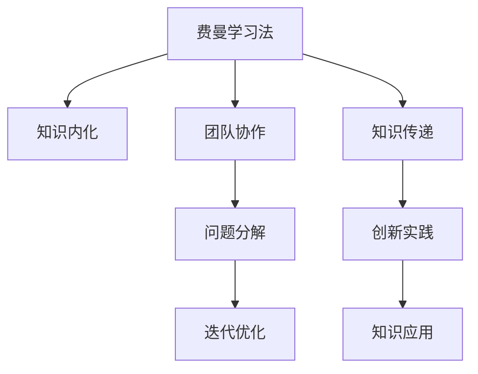

                 

# 费曼提问法提升团队创新能力

费曼提问法（The Feynman Technique）源自诺贝尔奖得主理查德·费曼(Richard Feynman)，是一种通过自我提问的方式，提升理解和记忆能力的科学学习方法。在科技和创新领域，费曼提问法也被广泛应用于团队协作和产品研发中，帮助团队成员快速掌握复杂知识，激发创新思维，提升整体效率。本文将从背景介绍、核心概念与联系、核心算法原理及操作步骤、数学模型和公式、项目实践、实际应用场景、工具和资源推荐、总结等多个方面，系统解析费曼提问法如何提升团队创新能力。

## 1. 背景介绍

### 1.1 问题由来

当今社会，技术更新迭代速度极快，对企业和团队提出了更高的要求。不仅需要具备快速掌握新技术的能力，更需要在海量信息中迅速找到创新点，以保持竞争优势。传统的教学和学习方法已无法满足这一需求。费曼提问法作为科学学习的经典方法，被越来越多的科技团队采纳，用于提升学习效率和创新能力。

费曼提问法的基本思想是通过不断自我提问，将复杂知识拆解成易于理解的小问题，逐一解答，形成完整的知识体系。在团队协作和产品研发中，通过个体提问、团队讨论、集体解决问题，加速知识传递和创新实践，提升团队的敏捷性和创新能力。

### 1.2 问题核心关键点

费曼提问法主要涉及以下几个关键点：
- 自我提问：通过对知识点的不断自我提问，激发思考和记忆。
- 团队讨论：通过与团队成员的讨论，获得多样化的视角和解决方案。
- 知识输出：通过向他人解释所学知识，巩固理解和记忆。
- 持续改进：对已有问题和解决方案进行持续改进，不断迭代。

这些关键点紧密联系，形成一个系统化的学习和创新流程。通过科学合理地运用费曼提问法，团队能够更高效地获取知识，激发创造力，提升整体竞争力。

## 2. 核心概念与联系

### 2.1 核心概念概述

为了更好地理解费曼提问法的核心思想和应用场景，本节将介绍几个密切相关的核心概念：

- 费曼学习法（Feynman Technique）：通过自我提问的方式，将复杂知识拆解成易于理解的小问题，逐一解答，形成完整的知识体系。
- 知识内化（Knowledge Internalization）：将外部知识转化为内在的思维习惯和行为准则。
- 团队协作（Team Collaboration）：通过团队成员的相互合作和交流，加速知识传递和创新实践。
- 问题分解（Problem Decomposition）：将复杂问题拆解成可管理的小模块，逐步解决。
- 迭代优化（Iterative Optimization）：对已有解决方案进行持续改进，不断优化。

这些核心概念之间的逻辑关系可以通过以下Mermaid流程图来展示：



这个流程图展示了一些关键概念及其之间的关系：

1. 费曼学习法通过自我提问，促进知识的拆解和内化。
2. 团队协作加快知识传递和创新实践。
3. 问题分解将复杂问题简化，提升问题解决效率。
4. 迭代优化持续改进，提升解决方案质量。

## 3. 核心算法原理 & 具体操作步骤

### 3.1 算法原理概述

费曼提问法是一种基于心理学和教育学的学习法，其核心原理包括自我提问、知识输出、团队讨论和迭代优化等步骤。通过这些步骤，团队成员可以系统化地掌握复杂知识，激发创新思维，提升整体效率。

### 3.2 算法步骤详解

费曼提问法的具体操作步骤包括以下几个步骤：

**Step 1: 设定学习目标**
- 确定需要掌握的知识或技能。
- 将目标拆解成若干小问题，逐一解决。

**Step 2: 自我提问**
- 针对每个小问题，提出尽可能多的问题。
- 使用简洁明了的语言，表达问题的本质。

**Step 3: 知识输出**
- 尝试向他人解释所学知识，包括问题的定义、问题的解法。
- 若解释不清，则回顾和补充所学内容，直至清晰表达。

**Step 4: 团队讨论**
- 将自我提问和知识输出的过程分享给团队成员，听取他们的看法和建议。
- 讨论过程中，提出新的问题，寻找更好的解法。

**Step 5: 迭代优化**
- 根据团队讨论的结果，调整和优化所学知识和解法。
- 不断重复以上步骤，直至问题得到彻底解决。

### 3.3 算法优缺点

费曼提问法的主要优点包括：
- 高效性：通过不断提问和输出，快速掌握知识。
- 系统性：将复杂知识拆解成易于管理的小问题，提升学习效率。
- 创新性：通过团队讨论和集体智慧，激发新思路和新方案。
- 互动性：强调团队协作和知识分享，提升团队凝聚力。

同时，该方法也存在一定的局限性：
- 依赖自我提问能力：初学者需要一定的自我思考能力，才能高效运用。
- 时间消耗较大：自我提问和知识输出的过程可能耗时较长，特别是在问题复杂时。
- 需要良好沟通能力：团队讨论需要成员之间的良好沟通和理解能力。
- 适用范围有限：适用于知识传播和创新性任务，但在部分技术性任务上效果有限。

尽管存在这些局限性，但费曼提问法作为一种经典的学习方法，在知识传递和团队协作中仍具有不可替代的价值。通过科学合理地运用费曼提问法，团队成员可以更高效地掌握复杂知识，激发创新思维，提升整体效率。

### 3.4 算法应用领域

费曼提问法主要应用于以下领域：

- 产品研发：通过自我提问和团队讨论，迅速找到产品设计和技术实现的创新点。
- 项目管理：将项目目标拆解成可管理的小任务，提升项目执行效率。
- 技术培训：加速团队成员的技术学习，提升整体技术水平。
- 知识传播：通过知识输出和团队讨论，促进知识共享和团队文化建设。
- 问题解决：将复杂问题拆解成可操作的小模块，逐步解决。

## 4. 数学模型和公式 & 详细讲解 & 举例说明

### 4.1 数学模型构建

费曼提问法主要依赖于心理学和教育学的原理，其数学模型较为简单，核心思想是通过自我提问和知识输出的过程，提升知识理解和记忆。

### 4.2 公式推导过程

费曼提问法不涉及复杂的数学公式，主要关注自我提问和知识输出的技巧。

### 4.3 案例分析与讲解

以下以产品研发为例，介绍费曼提问法在团队协作中的应用。

假设团队需要开发一款新的移动应用，团队成员需要掌握以下核心技术：
- 移动端开发（iOS/Android）
- 后端开发（Node.js/Python）
- 数据库设计（MySQL/PostgreSQL）

1. **设定学习目标**：开发一款功能完备、性能稳定的移动应用。

2. **自我提问**：
   - 移动端开发：如何将前端页面与后端API连接？
   - 后端开发：如何设计一个高效的数据库模型？
   - 数据库设计：如何在保证数据安全的前提下，提高查询效率？

3. **知识输出**：
   - 向团队成员解释移动端开发的基本原理和技术栈。
   - 分享后端开发中数据库设计的重要性和优化策略。
   - 讨论数据库安全与性能之间的平衡问题。

4. **团队讨论**：
   - 讨论移动端开发中的跨平台方案，并收集团队成员的意见。
   - 探讨后端开发中的数据缓存和请求优化策略。
   - 分析数据库设计中的数据冗余和数据一致性问题。

5. **迭代优化**：
   - 根据团队讨论的结果，调整和优化开发方案。
   - 不断重复以上步骤，直至问题得到彻底解决。

通过上述步骤，团队成员可以系统化地掌握核心技术，提升整体研发效率，激发创新思维。

## 5. 项目实践：代码实例和详细解释说明

### 5.1 开发环境搭建

在进行费曼提问法实践前，我们需要准备好开发环境。以下是使用Python进行实践的环境配置流程：

1. 安装Anaconda：从官网下载并安装Anaconda，用于创建独立的Python环境。

2. 创建并激活虚拟环境：
```bash
conda create -n feynman-env python=3.8 
conda activate feynman-env
```

3. 安装PyTorch：根据CUDA版本，从官网获取对应的安装命令。例如：
```bash
conda install pytorch torchvision torchaudio cudatoolkit=11.1 -c pytorch -c conda-forge
```

4. 安装TensorFlow：
```bash
pip install tensorflow
```

5. 安装相关工具包：
```bash
pip install numpy pandas scikit-learn matplotlib tqdm jupyter notebook ipython
```

完成上述步骤后，即可在`feynman-env`环境中开始实践。

### 5.2 源代码详细实现

这里我们以知识分享平台为例，展示费曼提问法在团队协作中的应用。

首先，定义知识分享的数据结构：

```python
class Knowledge:
    def __init__(self, title, content, created_by):
        self.title = title
        self.content = content
        self.created_by = created_by
```

然后，定义知识输出的函数：

```python
def share_knowledge(knowledge):
    title = knowledge.title
    content = knowledge.content
    created_by = knowledge.created_by
    
    # 向团队成员解释知识内容
    print(f"正在向团队分享知识：{title}")
    print(f"{created_by} 分享的内容如下：\n{content}\n")
    print(f"请问您对{title}的内容有何疑问？")
```

最后，定义一个简单的团队讨论模块：

```python
def team_discussion(knowledge):
    title = knowledge.title
    content = knowledge.content
    created_by = knowledge.created_by
    
    # 收集团队成员的问题
    print(f"{created_by} 分享了关于{title}的知识：\n{content}\n")
    print(f"请问您对{title}的内容有何疑问？")
    question = input("请输入您的问题：")
    
    # 在团队中讨论问题
    print(f"{created_by} 分享了关于{title}的知识：\n{content}\n")
    print(f"正在讨论问题：{question}\n")
    
    # 如果讨论结束，进行总结
    if question == "":
        print(f"讨论结束，感谢{created_by}的分享和贡献！")
    else:
        print(f"讨论继续，让我们深入探讨：{question}")
```

### 5.3 代码解读与分析

让我们再详细解读一下关键代码的实现细节：

**Knowledge类**：
- `__init__`方法：初始化知识对象，包含标题、内容、创建者信息。

**share_knowledge函数**：
- 接收知识对象，打印出知识的基本信息，邀请团队成员提出问题。
- 输出者通过简短描述和问题，帮助团队成员理解知识，并激发讨论。

**team_discussion函数**：
- 接收知识对象，打印出知识的基本信息，邀请团队成员提出问题。
- 根据问题，讨论知识的具体细节，鼓励团队成员发表见解。
- 讨论结束后，对知识进行总结和反馈。

**知识分享流程**：
- 通过知识分享函数，将知识传递给团队成员。
- 团队成员提出问题，并通过讨论函数进行讨论。
- 讨论结束后，通过总结函数进行知识反馈，形成知识闭环。

可以看到，费曼提问法的核心在于通过自我提问和团队讨论，加速知识的传递和创新实践。通过代码实现的简化，便于团队成员理解和实践费曼提问法，提升团队协作效率。

## 6. 实际应用场景

### 6.1 产品研发

费曼提问法在产品研发中的应用场景十分广泛。通过自我提问和团队讨论，可以快速找到产品设计的创新点，提升研发效率。

例如，在开发一款新的社交应用时，团队成员可以通过费曼提问法，系统化地掌握产品需求、技术架构、用户体验等核心知识。通过自我提问，明确设计目标和难点，通过团队讨论，提出多样化的解决方案，最终实现创新的产品设计。

### 6.2 项目管理

项目管理是费曼提问法的另一个重要应用场景。通过将项目目标拆解成可管理的小任务，团队成员可以更高效地执行项目，提升整体项目管理效率。

例如，在敏捷开发项目中，团队成员可以通过费曼提问法，将项目目标拆解成多个小任务，通过自我提问，明确任务细节和难点，通过团队讨论，协调任务分配和优先级，最终高效完成项目。

### 6.3 技术培训

技术培训是费曼提问法的典型应用场景之一。通过自我提问和知识输出，团队成员可以快速掌握新技术，提升整体技术水平。

例如，在新的AI框架和技术栈上线的培训中，团队成员可以通过费曼提问法，系统化地掌握新框架的核心技术，通过自我提问，明确技术难点和应用场景，通过团队讨论，深入理解技术实现和应用策略，最终实现快速学习和新技术的有效应用。

### 6.4 知识传播

知识传播是费曼提问法的另一个重要应用场景。通过知识输出和团队讨论，团队成员可以快速共享知识，提升团队凝聚力。

例如，在知识分享会上，团队成员可以通过费曼提问法，将自身的技术积累和经验分享出来，通过自我提问和团队讨论，深入探讨知识的应用场景和技术细节，最终实现知识共享和团队文化建设。

## 7. 工具和资源推荐

### 7.1 学习资源推荐

为了帮助开发者系统掌握费曼提问法的理论基础和实践技巧，这里推荐一些优质的学习资源：

1. 《深度思考：费曼学习法》系列博文：由费曼学习法专家撰写，深入浅出地介绍了费曼提问法的原理和应用。

2. 《费曼技巧：如何用一种方法教会任何人任何事情》书籍：由费曼学习法的创始人所著，全面介绍了费曼提问法的核心思想和实践方法。

3. 《敏捷思维：费曼技巧》在线课程：通过视频和互动，帮助你掌握费曼提问法的核心技巧和实践应用。

4. Feynman Technique官方网站：提供大量关于费曼提问法的学习和实践资源，适合深入学习。

5. Kaggle上的费曼提问法竞赛：通过实际案例，展示费曼提问法的应用效果，适合实战练习。

通过对这些资源的学习实践，相信你一定能够快速掌握费曼提问法的精髓，并用于解决实际的团队协作问题。

### 7.2 开发工具推荐

高效的开发离不开优秀的工具支持。以下是几款用于费曼提问法实践开发的常用工具：

1. Jupyter Notebook：开源的交互式笔记本，支持Python和其他编程语言，适合实时编写和测试代码。

2. Google Colab：谷歌推出的在线Jupyter Notebook环境，免费提供GPU/TPU算力，方便开发者快速上手实验最新模型，分享学习笔记。

3. GitHub：全球最大的代码托管平台，适合团队协作和版本控制，支持代码分享和版本管理。

4. Slack：即时通讯工具，支持多团队协作和消息管理，适合团队内部沟通和知识共享。

5. Trello：项目管理工具，支持任务拆分和进度跟踪，适合敏捷开发和项目管理。

合理利用这些工具，可以显著提升费曼提问法实践的开发效率，加快创新迭代的步伐。

### 7.3 相关论文推荐

费曼提问法作为经典的学习方法，近年来也得到了诸多学者的关注。以下是几篇代表性的相关论文，推荐阅读：

1. "Feynman Technique: A New Approach to Learning"：提出了费曼提问法的核心思想和应用方法，展示其有效性。

2. "Feynman Technique for Teaching and Learning"：探讨了费曼提问法在教学和学习中的具体应用，详细介绍了其实施步骤和效果。

3. "The Power of Feynman Technique in Software Development"：介绍了费曼提问法在软件开发中的应用，展示了其提高研发效率和创新能力的效果。

4. "Feynman Technique in Knowledge Management"：探讨了费曼提问法在知识管理中的应用，展示了其促进知识共享和创新的效果。

这些论文展示了费曼提问法在不同领域的应用效果，为进一步的研究提供了理论支持。

## 8. 总结：未来发展趋势与挑战

### 8.1 总结

本文对费曼提问法的背景介绍、核心概念与联系、核心算法原理及操作步骤、数学模型和公式、项目实践、实际应用场景、工具和资源推荐等多个方面进行了详细解析。通过系统化的介绍，展示了费曼提问法在团队协作和创新实践中的强大应用效果，帮助团队成员快速掌握复杂知识，激发创新思维，提升整体效率。

### 8.2 未来发展趋势

展望未来，费曼提问法将在以下几个方面呈现新的发展趋势：

1. 技术融合：费曼提问法将与人工智能、大数据等技术进行更深入的融合，提升知识传递和创新的效率和效果。

2. 平台化应用：费曼提问法将通过更多平台和工具进行应用推广，如在线学习平台、企业内部管理系统等，实现普及化应用。

3. 国际化推广：费曼提问法将跨越文化和语言障碍，在国际上推广应用，促进全球团队协作和知识共享。

4. 多领域应用：费曼提问法将在更多领域得到广泛应用，如医疗、教育、金融等，助力不同行业的知识创新和效率提升。

5. 智能化升级：通过引入AI和机器学习技术，费曼提问法将进一步智能化，提高知识获取和创新的效率和准确性。

这些趋势凸显了费曼提问法的广阔前景和应用潜力，其核心思想和方法将继续引导团队协作和知识创新，推动各行各业的持续进步。

### 8.3 面临的挑战

尽管费曼提问法在知识传递和团队协作中具有显著优势，但在实际应用中也面临一些挑战：

1. 学习成本较高：初学者需要一定的自我思考能力，才能高效运用。
2. 时间消耗较大：自我提问和知识输出的过程可能耗时较长，特别是在问题复杂时。
3. 需要良好沟通能力：团队讨论需要成员之间的良好沟通和理解能力。
4. 适用范围有限：适用于知识传播和创新性任务，但在部分技术性任务上效果有限。

尽管存在这些局限性，但通过科学合理地运用费曼提问法，团队成员可以更高效地掌握复杂知识，激发创新思维，提升整体效率。未来的研究和应用将不断克服这些挑战，拓展费曼提问法的应用边界，提升其应用效果。

### 8.4 研究展望

费曼提问法的未来研究需要在以下几个方面进行探索：

1. 知识结构优化：通过对知识结构进行优化，提升知识传递和创新的效率和效果。

2. 技术工具提升：开发更多技术工具和平台，支持费曼提问法的应用推广和普及化。

3. 多语言支持：通过引入多语言技术，提升费曼提问法在国际上的应用效果。

4. 智能化应用：引入AI和机器学习技术，提升费曼提问法的智能化水平，提高知识获取和创新的效率和准确性。

5. 跨领域应用：将费曼提问法应用于更多领域，如医疗、教育、金融等，促进不同行业的知识创新和效率提升。

这些研究方向将进一步拓展费曼提问法的应用边界，推动其技术发展，为团队协作和知识创新提供更加高效和智能的支持。

## 9. 附录：常见问题与解答

**Q1：费曼提问法是否适用于所有团队？**

A: 费曼提问法主要适用于知识密集型和创新型团队，如研发团队、咨询团队等。对于需要快速执行任务和操作的团队，如生产线和物流团队，可能需要结合其他方法进行改进。

**Q2：如何提高自我提问的质量？**

A: 提高自我提问的质量需要一定的思考和总结能力。可以通过以下几点进行提升：
- 阅读相关文献和书籍，拓宽知识面。
- 进行深入思考，明确问题的本质和目标。
- 与团队成员讨论，听取他们的看法和建议。
- 不断反思和总结，不断优化提问的方式。

**Q3：团队讨论中的问题如何管理？**

A: 团队讨论中的问题管理需要系统化的流程和工具支持。可以通过以下几点进行管理：
- 使用项目管理工具，如Trello，将讨论的问题进行分类和优先级排序。
- 设定讨论的时间和频率，确保讨论的效率和质量。
- 记录讨论的结果和决策，形成知识库和文档。
- 定期回顾和总结讨论的效果，不断改进。

**Q4：如何衡量费曼提问法的效果？**

A: 衡量费曼提问法的效果可以从多个方面进行评估：
- 知识掌握情况：通过测试和评估，衡量团队成员对知识的掌握程度。
- 创新成果：通过项目成果和创新产出，衡量费曼提问法的实际应用效果。
- 团队协作：通过团队讨论和知识分享，衡量团队协作的效果和质量。
- 问题解决效率：通过项目进展和任务完成情况，衡量费曼提问法对问题解决效率的提升效果。

**Q5：费曼提问法是否适用于线上团队？**

A: 费曼提问法适用于线上团队，通过在线工具和平台，可以实现高效的远程协作和知识分享。但需要团队成员具备良好的沟通能力和自我管理能力，以确保讨论的有效性和成果的落地。

---

作者：禅与计算机程序设计艺术 / Zen and the Art of Computer Programming

