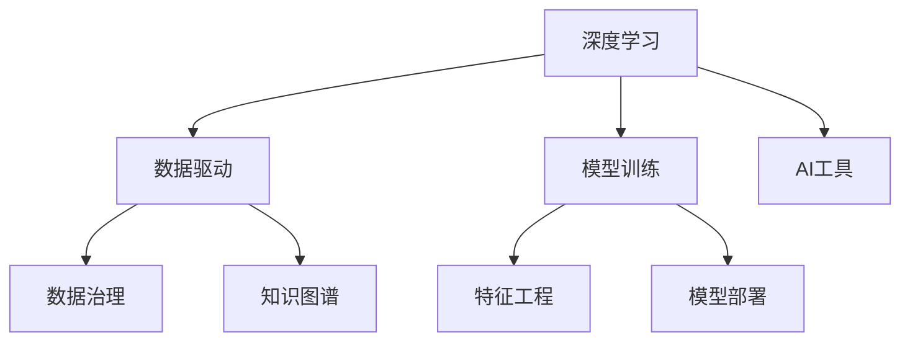

                 

# 贾扬清建议：培养团队AI理解力，应用AI于业务

> 关键词：AI理解力, 团队培养, 业务应用, 深度学习, 数据驱动

## 1. 背景介绍

### 1.1 问题由来
随着人工智能(AI)技术的快速发展，企业越来越重视AI在业务中的应用，尤其是在大数据、金融、零售、医疗等领域，AI已经成为推动企业创新和效率提升的关键驱动力。然而，AI技术的深度和复杂性使得许多企业难以跨过入门门槛，面临诸多挑战。如何培养团队AI理解力，有效应用AI于业务，成为当前亟需解决的问题。

### 1.2 问题核心关键点
AI理解力指的是团队对AI技术的深度理解和应用能力。具体而言，主要包括：
- 对深度学习模型的基本原理和应用场景的掌握。
- 对数据处理、特征工程、模型训练等AI工作流程的熟练操作。
- 对AI在实际业务中的价值和应用场景的洞察和挖掘。
- 对AI算法、架构和工具的熟练使用和集成。

培养团队AI理解力的核心在于：
- 系统化地学习AI知识体系，从基础到高级逐步推进。
- 实践导向的动手训练，通过项目实战提升实战能力。
- 跨部门协作，促进AI技术与业务需求的深度融合。
- 持续学习，紧跟AI技术的发展前沿。

## 2. 核心概念与联系

### 2.1 核心概念概述

为更好地理解如何培养团队AI理解力并应用AI于业务，本节将介绍几个密切相关的核心概念：

- **深度学习(Deep Learning)**：一种基于神经网络结构的机器学习方法，通过多层次的非线性变换学习数据的复杂表示。
- **数据驱动(Data-Driven)**：强调以数据为基础，通过数据挖掘、数据分析等手段驱动决策和行动的方法。
- **模型训练(Model Training)**：通过迭代优化模型参数，使模型在给定的训练数据上获得最优的预测性能。
- **特征工程(Feature Engineering)**：根据业务需求和数据特点，设计和提取对模型预测有帮助的特征。
- **模型部署(Model Deployment)**：将训练好的模型部署到实际应用环境中，供业务系统调用。
- **数据治理(Data Governance)**：制定数据标准、规范和流程，确保数据的质量和一致性。
- **知识图谱(Knowledge Graph)**：用图的形式表示实体和关系，支持复杂的知识推理和应用。
- **AI工具(AI Tools)**：包括深度学习框架(如TensorFlow、PyTorch等)、数据分析工具(如Pandas、NumPy等)、可视化工具(如Matplotlib、Seaborn等)等。

这些核心概念之间的逻辑关系可以通过以下Mermaid流程图来展示：



这个流程图展示了大语言模型微调的关键概念及其之间的关系：

1. 深度学习通过复杂的网络结构学习数据表示，是AI应用的基础。
2. 数据驱动强调以数据为核心，数据质量和一致性是模型性能的关键。
3. 模型训练通过迭代优化，提升模型预测能力。
4. 特征工程设计合适的特征，提高模型泛化能力。
5. 模型部署将训练好的模型应用于实际业务场景。
6. 数据治理制定数据规范，确保数据质量。
7. 知识图谱用于表示复杂知识结构，支持智能推理。
8. AI工具提供了丰富的技术实现和工程支持。

这些概念共同构成了AI技术和应用的框架，使得企业能够系统地掌握AI知识，有效应用AI技术。

## 3. 核心算法原理 & 具体操作步骤
### 3.1 算法原理概述

AI理解力的培养和AI应用的实践，离不开对深度学习算法的深入理解。深度学习算法主要包括：

- **前馈神经网络(Feedforward Neural Network, FNN)**：单向传递信息的神经网络，结构简单但功能有限。
- **卷积神经网络(Convolutional Neural Network, CNN)**：通过卷积和池化操作提取局部特征，广泛应用于图像处理。
- **循环神经网络(Recurrent Neural Network, RNN)**：通过循环连接处理序列数据，适用于自然语言处理。
- **长短期记忆网络(Long Short-Term Memory, LSTM)**：一种特殊的RNN，用于解决序列数据中的长期依赖问题。
- **自编码器(Autencoder)**：通过编码和解码过程实现数据压缩和重构，常用于特征提取和降维。
- **生成对抗网络(Generative Adversarial Network, GAN)**：通过两个神经网络相互对抗生成高质量的合成数据。
- **Transformer**：一种自注意力机制的神经网络，在NLP领域取得了突破性成果。

这些算法通过不同方式学习数据的表示，共同构建了AI技术的基石。培养团队AI理解力，需对这些算法原理和应用场景有深入的掌握。

### 3.2 算法步骤详解

AI理解力的培养和AI应用的实践，通常包括以下几个关键步骤：

**Step 1: 数据预处理**
- 收集和清洗数据，确保数据质量。
- 进行特征工程，设计合适的特征表示。
- 划分训练集、验证集和测试集，确保模型评估的可靠性。

**Step 2: 模型选择和训练**
- 选择合适的深度学习模型，根据任务需求和数据特点进行调整。
- 设计损失函数，确定优化器和学习率。
- 进行模型训练，使用反向传播算法更新模型参数。

**Step 3: 模型评估和调优**
- 在验证集上评估模型性能，检查过拟合和欠拟合问题。
- 调整超参数，如学习率、正则化强度等，优化模型性能。
- 在测试集上再次评估模型，确保模型泛化能力。

**Step 4: 模型部署和应用**
- 将训练好的模型部署到实际应用环境中，确保性能稳定。
- 进行模型监控和调优，及时处理异常和故障。
- 与业务系统集成，实现AI功能的商业化应用。

**Step 5: 持续学习和改进**
- 定期收集新数据，更新模型以应对数据分布的变化。
- 关注AI技术前沿，引入新方法和算法，提升AI应用效果。
- 定期进行团队培训，提升团队AI理解力。

### 3.3 算法优缺点

深度学习算法在培养AI理解力和应用AI于业务方面，具有以下优点：
1. **强大的表示学习能力**：通过多层次的非线性变换，能够学习到数据的复杂表示。
2. **丰富的应用场景**：广泛应用于图像、语音、自然语言处理等领域，具有广泛的适用性。
3. **高效的特征提取**：通过自动化的特征学习，大大减少了手动设计特征的工作量。
4. **可解释性**：深度学习的内部机制虽然复杂，但通过可视化工具可以解释模型的关键特征和决策过程。

同时，这些算法也存在一些缺点：
1. **资源消耗大**：大规模深度学习模型的训练和推理需要高性能的硬件设备，如GPU/TPU。
2. **过拟合风险高**：特别是小规模数据集上，容易发生过拟合，影响模型泛化能力。
3. **黑箱问题**：深度学习模型往往难以解释内部工作机制，对可解释性需求高的业务场景不适用。
4. **训练时间长**：深度学习模型的训练过程耗时较长，需要耐心和资源投入。

尽管存在这些局限性，但就目前而言，深度学习算法仍是大数据时代最具前景的AI技术之一。未来相关研究的重点在于如何进一步降低深度学习的资源消耗，提高模型的泛化能力和可解释性。

### 3.4 算法应用领域

深度学习算法在诸多领域中得到了广泛的应用，具体包括：

- **计算机视觉**：如图像识别、目标检测、图像生成等。通过卷积神经网络(CNN)和生成对抗网络(GAN)，计算机视觉技术已经广泛应用于自动驾驶、智能监控、医学影像分析等领域。

- **自然语言处理**：如文本分类、情感分析、机器翻译等。Transformer模型在NLP领域取得了突破性成果，广泛应用于智能客服、智能问答、智能写作等领域。

- **语音识别**：如语音转文本、语音合成等。通过循环神经网络(RNN)和长短期记忆网络(LSTM)，语音识别技术已经广泛应用于智能助手、语音搜索、智能家居等领域。

- **机器人控制**：如机器人路径规划、运动控制等。通过强化学习和深度学习，机器人控制技术已经广泛应用于工业自动化、家庭服务、医疗辅助等领域。

- **金融风控**：如信用评分、风险预测等。通过深度学习，金融风控技术已经广泛应用于银行信贷、保险评估、投资分析等领域。

- **医疗诊断**：如影像分析、病理学分析等。通过深度学习，医疗诊断技术已经广泛应用于肿瘤检测、疾病预测、个性化治疗等领域。

除了上述这些经典应用外，深度学习算法还在更多场景中得到了创新性的应用，如可控文本生成、常识推理、代码生成、数据增强等，为AI技术带来了全新的突破。随着深度学习算法的不断演进，相信AI技术将在更广阔的应用领域大放异彩。

## 4. 数学模型和公式 & 详细讲解  
### 4.1 数学模型构建

本节将使用数学语言对深度学习算法的模型构建进行更加严格的刻画。

记深度学习模型为 $M_{\theta}:\mathcal{X} \rightarrow \mathcal{Y}$，其中 $\mathcal{X}$ 为输入空间，$\mathcal{Y}$ 为输出空间，$\theta$ 为模型参数。假设训练集为 $D=\{(x_i,y_i)\}_{i=1}^N$，其中 $x_i$ 为输入样本，$y_i$ 为标签。

定义模型 $M_{\theta}$ 在输入 $x$ 上的损失函数为 $\ell(M_{\theta}(x),y)$，则在数据集 $D$ 上的经验风险为：

$$
\mathcal{L}(\theta) = \frac{1}{N} \sum_{i=1}^N \ell(M_{\theta}(x_i),y_i)
$$

模型的目标是最小化经验风险，即找到最优参数：

$$
\theta^* = \mathop{\arg\min}_{\theta} \mathcal{L}(\theta)
$$

在实践中，我们通常使用基于梯度的优化算法（如SGD、Adam等）来近似求解上述最优化问题。设 $\eta$ 为学习率，$\lambda$ 为正则化系数，则参数的更新公式为：

$$
\theta \leftarrow \theta - \eta \nabla_{\theta}\mathcal{L}(\theta) - \eta\lambda\theta
$$

其中 $\nabla_{\theta}\mathcal{L}(\theta)$ 为损失函数对参数 $\theta$ 的梯度，可通过反向传播算法高效计算。

### 4.2 公式推导过程

以下我们以二分类任务为例，推导交叉熵损失函数及其梯度的计算公式。

假设模型 $M_{\theta}$ 在输入 $x$ 上的输出为 $\hat{y}=M_{\theta}(x) \in [0,1]$，表示样本属于正类的概率。真实标签 $y \in \{0,1\}$。则二分类交叉熵损失函数定义为：

$$
\ell(M_{\theta}(x),y) = -[y\log \hat{y} + (1-y)\log (1-\hat{y})]
$$

将其代入经验风险公式，得：

$$
\mathcal{L}(\theta) = -\frac{1}{N}\sum_{i=1}^N [y_i\log M_{\theta}(x_i)+(1-y_i)\log(1-M_{\theta}(x_i))]
$$

根据链式法则，损失函数对参数 $\theta_k$ 的梯度为：

$$
\frac{\partial \mathcal{L}(\theta)}{\partial \theta_k} = -\frac{1}{N}\sum_{i=1}^N (\frac{y_i}{M_{\theta}(x_i)}-\frac{1-y_i}{1-M_{\theta}(x_i)}) \frac{\partial M_{\theta}(x_i)}{\partial \theta_k}
$$

其中 $\frac{\partial M_{\theta}(x_i)}{\partial \theta_k}$ 可进一步递归展开，利用自动微分技术完成计算。

在得到损失函数的梯度后，即可带入参数更新公式，完成模型的迭代优化。重复上述过程直至收敛，最终得到适应下游任务的最优模型参数 $\theta^*$。

## 5. 项目实践：代码实例和详细解释说明
### 5.1 开发环境搭建

在进行AI应用实践前，我们需要准备好开发环境。以下是使用Python进行TensorFlow开发的环境配置流程：

1. 安装Anaconda：从官网下载并安装Anaconda，用于创建独立的Python环境。

2. 创建并激活虚拟环境：
```bash
conda create -n tf-env python=3.8 
conda activate tf-env
```

3. 安装TensorFlow：根据CUDA版本，从官网获取对应的安装命令。例如：
```bash
conda install tensorflow tensorflow-gpu=2.7 -c conda-forge
```

4. 安装Pandas、NumPy等数据处理库：
```bash
pip install pandas numpy
```

5. 安装Matplotlib、Seaborn等可视化库：
```bash
pip install matplotlib seaborn
```

完成上述步骤后，即可在`tf-env`环境中开始AI应用实践。

### 5.2 源代码详细实现

这里我们以图像分类任务为例，给出使用TensorFlow实现卷积神经网络(CNN)的PyTorch代码实现。

首先，定义CNN模型和损失函数：

```python
import tensorflow as tf
from tensorflow.keras import layers, models

def build_cnn_model():
    model = models.Sequential([
        layers.Conv2D(32, (3, 3), activation='relu', input_shape=(28, 28, 1)),
        layers.MaxPooling2D((2, 2)),
        layers.Flatten(),
        layers.Dense(64, activation='relu'),
        layers.Dense(10, activation='softmax')
    ])
    model.compile(optimizer='adam',
                  loss='sparse_categorical_crossentropy',
                  metrics=['accuracy'])
    return model

# 加载数据集
mnist = tf.keras.datasets.mnist
(train_images, train_labels), (test_images, test_labels) = mnist.load_data()

# 数据预处理
train_images = train_images.reshape((60000, 28, 28, 1))
train_images = train_images / 255.0
test_images = test_images.reshape((10000, 28, 28, 1))
test_images = test_images / 255.0

# 训练模型
model = build_cnn_model()
model.fit(train_images, train_labels, epochs=5, batch_size=64)
```

然后，评估模型性能：

```python
# 评估模型
test_loss, test_acc = model.evaluate(test_images, test_labels, verbose=2)
print('Test accuracy:', test_acc)
```

以上就是使用TensorFlow实现CNN模型的完整代码实现。可以看到，TensorFlow提供了丰富的API和模型，使得构建和训练深度学习模型变得非常简单。

### 5.3 代码解读与分析

让我们再详细解读一下关键代码的实现细节：

**build_cnn_model函数**：
- 定义了一个简单的卷积神经网络模型，包含卷积层、池化层、全连接层和softmax输出层。
- 使用adam优化器和交叉熵损失函数进行模型编译。

**数据预处理**：
- 将MNIST数据集加载并重塑成模型所需的输入形状。
- 对数据进行归一化处理，将像素值缩放到0-1之间。

**模型训练**：
- 使用fit函数对模型进行训练，设置epoch和batch_size参数。

**模型评估**：
- 使用evaluate函数对模型在测试集上的性能进行评估，输出测试集上的损失和准确率。

可以看到，TensorFlow提供了丰富的工具和API，使得深度学习模型的构建和训练变得非常简单。开发者可以将更多精力放在数据预处理、模型改进等高层逻辑上，而不必过多关注底层的实现细节。

当然，工业级的系统实现还需考虑更多因素，如模型的保存和部署、超参数的自动搜索、更灵活的任务适配层等。但核心的AI应用过程基本与此类似。

## 6. 实际应用场景
### 6.1 智能客服系统

基于深度学习算法的智能客服系统，可以广泛应用于企业客服部门，提升客户咨询体验和问题解决效率。传统客服往往依赖大量人工，高峰期响应缓慢，且一致性和专业性难以保证。而使用深度学习算法构建的智能客服系统，可以24小时不间断服务，快速响应客户咨询，用自然流畅的语言解答各类常见问题。

在技术实现上，可以收集企业内部的历史客服对话记录，将问题和最佳答复构建成监督数据，在此基础上对深度学习模型进行训练。训练后的模型能够自动理解用户意图，匹配最合适的答案模板进行回复。对于客户提出的新问题，还可以接入检索系统实时搜索相关内容，动态组织生成回答。如此构建的智能客服系统，能大幅提升客户咨询体验和问题解决效率。

### 6.2 金融舆情监测

金融机构需要实时监测市场舆论动向，以便及时应对负面信息传播，规避金融风险。传统的人工监测方式成本高、效率低，难以应对网络时代海量信息爆发的挑战。基于深度学习算法的文本分类和情感分析技术，为金融舆情监测提供了新的解决方案。

具体而言，可以收集金融领域相关的新闻、报道、评论等文本数据，并对其进行主题标注和情感标注。在此基础上对深度学习模型进行训练，使其能够自动判断文本属于何种主题，情感倾向是正面、中性还是负面。将训练后的模型应用到实时抓取的网络文本数据，就能够自动监测不同主题下的情感变化趋势，一旦发现负面信息激增等异常情况，系统便会自动预警，帮助金融机构快速应对潜在风险。

### 6.3 个性化推荐系统

当前的推荐系统往往只依赖用户的历史行为数据进行物品推荐，无法深入理解用户的真实兴趣偏好。基于深度学习算法的推荐系统可以更好地挖掘用户行为背后的语义信息，从而提供更精准、多样的推荐内容。

在实践中，可以收集用户浏览、点击、评论、分享等行为数据，提取和用户交互的物品标题、描述、标签等文本内容。将文本内容作为模型输入，用户的后续行为（如是否点击、购买等）作为监督信号，在此基础上训练深度学习模型。训练后的模型能够从文本内容中准确把握用户的兴趣点。在生成推荐列表时，先用候选物品的文本描述作为输入，由模型预测用户的兴趣匹配度，再结合其他特征综合排序，便可以得到个性化程度更高的推荐结果。

### 6.4 未来应用展望

随着深度学习算法的不断发展，基于AI的应用场景将越来越广泛，为各行各业带来变革性影响。

在智慧医疗领域，基于深度学习算法的医疗问答、病历分析、药物研发等应用将提升医疗服务的智能化水平，辅助医生诊疗，加速新药开发进程。

在智能教育领域，深度学习算法可应用于作业批改、学情分析、知识推荐等方面，因材施教，促进教育公平，提高教学质量。

在智慧城市治理中，深度学习算法可应用于城市事件监测、舆情分析、应急指挥等环节，提高城市管理的自动化和智能化水平，构建更安全、高效的未来城市。

此外，在企业生产、社会治理、文娱传媒等众多领域，基于深度学习算法的AI应用也将不断涌现，为经济社会发展注入新的动力。相信随着技术的日益成熟，深度学习算法将成为AI落地应用的重要范式，推动人工智能技术在垂直行业的规模化落地。

## 7. 工具和资源推荐
### 7.1 学习资源推荐

为了帮助开发者系统掌握深度学习算法和AI应用的理论基础和实践技巧，这里推荐一些优质的学习资源：

1. 《深度学习》课程（Coursera）：由斯坦福大学Andrew Ng教授主讲的经典课程，涵盖深度学习的基础理论和实践技能。

2. TensorFlow官方文档：TensorFlow的详细文档，包含丰富的API介绍和示例代码，适合深入学习。

3. PyTorch官方文档：PyTorch的详细文档，提供丰富的教程和示例代码，易于上手。

4. Fast.ai深度学习课程：Fast.ai提供的深度学习课程，注重动手实践，适合快速入门。

5. CS229《机器学习》课程：斯坦福大学提供的机器学习课程，涵盖深度学习、强化学习等前沿内容。

通过学习这些资源，相信你一定能够快速掌握深度学习算法和AI应用的核心知识，并应用于实际业务场景。

### 7.2 开发工具推荐

高效的开发离不开优秀的工具支持。以下是几款用于深度学习算法开发和应用的常用工具：

1. TensorFlow：由Google主导开发的开源深度学习框架，功能强大，适用于大规模工程应用。

2. PyTorch：由Facebook开发的开源深度学习框架，易于使用，适合研究性实验。

3. Keras：基于TensorFlow和Theano的高层API，提供简单易用的API接口，适合快速原型开发。

4. Jupyter Notebook：支持Python编程和数据分析的交互式开发环境，适合快速实验和代码调试。

5. Matplotlib：用于数据可视化，支持绘制多种图表类型。

6. Seaborn：基于Matplotlib的高级可视化库，提供更美观的图表样式。

合理利用这些工具，可以显著提升深度学习算法和AI应用的开发效率，加快创新迭代的步伐。

### 7.3 相关论文推荐

深度学习算法和AI应用的研究始于学术界，以下是几篇奠基性的相关论文，推荐阅读：

1. AlexNet：ImageNet大规模视觉识别竞赛冠军模型，奠定了卷积神经网络在计算机视觉领域的基础。

2. RNN和LSTM：循环神经网络和长短期记忆网络，解决了序列数据中的长期依赖问题，广泛应用于自然语言处理。

3. ResNet：残差网络，通过残差连接解决了深度神经网络的退化问题，提升了模型的深度和性能。

4. GAN：生成对抗网络，通过两个网络相互对抗生成高质量的合成数据，广泛应用于图像生成和数据增强。

5. AlphaGo：基于深度学习和蒙特卡罗树搜索的围棋算法，证明了AI在复杂游戏领域的能力。

6. GPT系列：大语言模型，通过预训练和微调技术，大幅提升了自然语言处理的效果。

这些论文代表了大深度学习算法和AI应用的发展脉络。通过学习这些前沿成果，可以帮助研究者把握学科前进方向，激发更多的创新灵感。

## 8. 总结：未来发展趋势与挑战
### 8.1 总结

本文对深度学习算法在培养AI理解力和应用AI于业务方面的系统介绍。首先阐述了深度学习算法的基本原理和应用场景，明确了AI应用的关键要素。其次，从原理到实践，详细讲解了深度学习算法的数学模型和关键步骤，给出了AI应用的完整代码实例。同时，本文还广泛探讨了深度学习算法在实际业务中的应用前景，展示了AI技术的巨大潜力。

通过本文的系统梳理，可以看到，深度学习算法在AI理解力培养和AI应用实践中的核心作用，以及其对各行各业带来的深远影响。未来，伴随深度学习算法的不断演进，AI技术将在更广阔的应用领域大放异彩，深刻影响人类的生产生活方式。

### 8.2 未来发展趋势

深度学习算法在培养AI理解力和应用AI于业务方面，将呈现以下几个发展趋势：

1. **模型规模持续增大**：随着算力成本的下降和数据规模的扩张，深度学习模型的参数量还将持续增长。超大规模模型蕴含的丰富语言知识，有望支撑更加复杂多变的下游任务。

2. **模型性能不断提升**：通过更加复杂的模型结构、更多的数据输入、更高效的优化算法，深度学习模型的性能将不断提升，实现更加精准、高效的预测和推理。

3. **跨领域应用拓展**：深度学习算法不仅在图像、语音、自然语言处理等领域取得突破，还将应用于医疗、金融、教育等多个领域，推动更多行业数字化转型。

4. **计算硬件优化**：为支持更大规模模型的训练和推理，高性能计算硬件如GPU/TPU等将得到更广泛应用，推动深度学习算法在企业内部的落地和普及。

5. **模型解释性和透明性增强**：为应对业务场景对可解释性的需求，深度学习模型将引入更多解释性方法，如可解释性技术、可视化工具等。

6. **多模态数据融合**：深度学习算法将融合视觉、语音、文本等多模态数据，提升模型的全面性和鲁棒性。

以上趋势凸显了深度学习算法在AI应用中的核心作用，预示着其将发挥越来越重要的作用，为各行各业带来革命性影响。

### 8.3 面临的挑战

尽管深度学习算法在AI应用中取得了显著成果，但在迈向更加智能化、普适化应用的过程中，它仍面临诸多挑战：

1. **标注数据需求高**：深度学习模型通常需要大量标注数据进行训练，而高质量标注数据的获取成本较高。如何降低标注数据需求，提升模型泛化能力，将是一大难题。

2. **计算资源消耗大**：超大规模深度学习模型的训练和推理需要高性能的硬件设备，如GPU/TPU，这将带来较高的资源消耗。如何降低资源消耗，提升计算效率，将是重要的优化方向。

3. **模型泛化能力有限**：深度学习模型在特定数据集上训练效果良好，但在新数据集上泛化性能往往不佳。如何提高模型的泛化能力，提升对新数据的适应性，仍需进一步研究。

4. **模型可解释性不足**：深度学习模型通常难以解释其内部工作机制和决策逻辑，对可解释性需求高的业务场景不适用。如何赋予模型更强的可解释性，将是亟待攻克的难题。

5. **模型偏见和伦理问题**：深度学习模型可能学习到有偏见、有害的信息，通过训练数据和模型参数传递到下游任务，产生误导性、歧视性的输出。如何消除模型偏见，确保输出符合伦理道德，也将是重要的研究课题。

6. **技术壁垒高**：深度学习算法涉及复杂的数学模型和工程实践，对开发者技术水平要求较高。如何降低技术壁垒，提升开发者能力，将是重要的教育培训任务。

这些挑战凸显了深度学习算法在AI应用中的复杂性和不确定性，但通过技术进步和跨学科合作，这些挑战终将一一被克服，深度学习算法必将在构建人机协同的智能时代中扮演越来越重要的角色。

### 8.4 研究展望

面对深度学习算法在AI应用中面临的挑战，未来的研究需要在以下几个方面寻求新的突破：

1. **探索无监督和半监督学习**：摆脱对大规模标注数据的依赖，利用自监督学习、主动学习等无监督和半监督范式，最大限度利用非结构化数据，实现更加灵活高效的模型训练。

2. **研究模型压缩和加速**：开发更加参数高效的模型结构，如 Adapter、LoRA等，在固定大部分预训练参数的同时，只更新极少量的任务相关参数。同时优化模型计算图，减少前向传播和反向传播的资源消耗，实现更加轻量级、实时性的部署。

3. **引入因果分析和博弈论工具**：通过引入因果分析方法，增强模型建立稳定因果关系的能力，学习更加普适、鲁棒的语言表征。借助博弈论工具刻画人机交互过程，主动探索并规避模型的脆弱点，提高系统稳定性。

4. **融合更多先验知识**：将符号化的先验知识，如知识图谱、逻辑规则等，与神经网络模型进行巧妙融合，引导模型学习更准确、合理的语言模型。同时加强不同模态数据的整合，实现视觉、语音等多模态信息与文本信息的协同建模。

5. **结合可解释性和伦理道德**：在模型训练目标中引入伦理导向的评估指标，过滤和惩罚有偏见、有害的输出倾向。同时加强人工干预和审核，建立模型行为的监管机制，确保输出符合人类价值观和伦理道德。

这些研究方向的探索，必将引领深度学习算法在AI应用中的新一轮突破，为构建安全、可靠、可解释、可控的智能系统铺平道路。面向未来，深度学习算法还需要与其他人工智能技术进行更深入的融合，如知识表示、因果推理、强化学习等，多路径协同发力，共同推动自然语言理解和智能交互系统的进步。只有勇于创新、敢于突破，才能不断拓展深度学习算法的边界，让智能技术更好地造福人类社会。

## 9. 附录：常见问题与解答

**Q1：如何选择合适的深度学习模型？**

A: 选择合适的深度学习模型需要考虑以下几个因素：
1. 任务类型：不同类型的任务适合不同的模型，如图像分类适合卷积神经网络，自然语言处理适合循环神经网络和Transformer等。
2. 数据特点：数据的结构、大小、分布等特征会影响模型的选择和设计。
3. 资源条件：模型的计算资源、存储空间等条件限制了模型的大小和复杂度。
4. 性能需求：模型的预测准确性、训练速度、推理速度等性能需求决定了模型的选择。

通常情况下，可以先尝试经典模型如卷积神经网络、循环神经网络、Transformer等，根据实际任务和数据特点进行调整和优化，以达到最佳的模型效果。

**Q2：深度学习模型训练过程中如何解决过拟合问题？**

A: 深度学习模型训练过程中过拟合是常见的问题，以下是一些解决过拟合的方法：
1. 数据增强：通过扩充训练集，增加数据的多样性和丰富度，减少模型的过拟合风险。
2. 正则化：使用L2正则、Dropout等正则化技术，防止模型过度适应训练集。
3. 早停机制：在验证集上监控模型性能，一旦性能不再提升，立即停止训练，防止过拟合。
4. 模型集成：通过集成多个模型的输出，提升模型的泛化能力，降低过拟合风险。
5. 迁移学习：在预训练模型的基础上进行微调，利用预训练知识减少模型的过拟合风险。

这些方法需要根据具体任务和数据特点进行灵活组合，以达到最佳的模型效果。

**Q3：如何评估深度学习模型的性能？**

A: 评估深度学习模型性能的关键在于选择合适的评估指标。以下是几种常用的评估指标：
1. 准确率(Accuracy)：模型预测结果与真实标签一致的比例。
2. 精确率(Precision)：模型预测为正类且真实为正类的比例。
3. 召回率(Recall)：模型预测为正类且真实为正类的比例。
4. F1-score：精确率和召回率的调和平均，综合衡量模型的性能。
5. AUC-ROC曲线：ROC曲线下的面积，衡量模型在不同阈值下的性能表现。

在评估深度学习模型时，需要根据具体任务和需求选择适当的评估指标，同时结合业务场景进行综合分析，评估模型的实用性。

**Q4：深度学习模型在实际应用中面临哪些资源瓶颈？**

A: 深度学习模型在实际应用中面临以下资源瓶颈：
1. 计算资源消耗大：超大规模深度学习模型的训练和推理需要高性能的硬件设备，如GPU/TPU，这将带来较高的资源消耗。
2. 存储资源需求高：深度学习模型通常需要大量的存储空间进行数据存储和模型保存。
3. 模型计算复杂度高：深度学习模型通常需要复杂的计算过程，对计算速度和效率要求较高。

为了解决这些资源瓶颈，可以采用以下方法：
1. 模型压缩：通过剪枝、量化等方法减少模型的参数量，降低计算复杂度。
2. 分布式训练：将模型分布式训练，利用多台设备并行计算，提高训练速度和效率。
3. 动态图优化：使用动态图技术优化模型计算图，减少计算资源消耗。
4. 数据缓存：使用缓存技术减少数据的读写频率，提升数据处理速度。

这些方法可以显著提升深度学习模型在实际应用中的资源利用效率，实现更高效的模型部署和应用。

**Q5：如何提升深度学习模型的泛化能力？**

A: 提升深度学习模型的泛化能力可以从以下几个方面入手：
1. 增加数据多样性：通过数据增强、合成数据生成等方法增加训练集的多样性，提升模型的泛化能力。
2. 使用正则化技术：使用L2正则、Dropout等正则化技术，防止模型过度适应训练集，提升模型的泛化能力。
3. 迁移学习：在预训练模型的基础上进行微调，利用预训练知识减少模型的过拟合风险。
4. 模型集成：通过集成多个模型的输出，提升模型的泛化能力，降低过拟合风险。
5. 对抗训练：引入对抗样本，提高模型鲁棒性，增强模型的泛化能力。

这些方法需要根据具体任务和数据特点进行灵活组合，以达到最佳的模型效果。

---

作者：禅与计算机程序设计艺术 / Zen and the Art of Computer Programming

