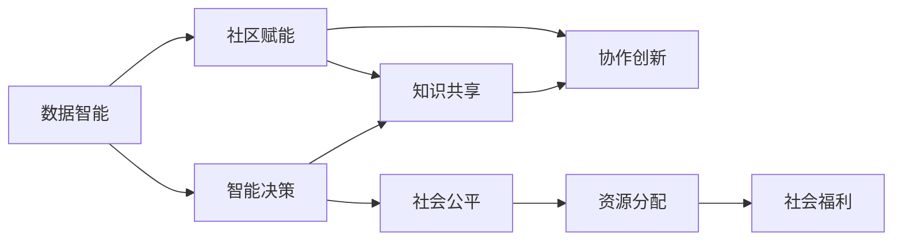

                 

# 赋能个人与社区：人类计算的社会价值

> 关键词：人类计算,社会价值,社区赋能,数据智能,隐私保护

## 1. 背景介绍

### 1.1 问题由来
随着人工智能技术的快速发展，人类计算已经成为现代社会不可或缺的一部分。无论是智能推荐系统、自然语言处理，还是机器视觉、自动化决策等领域，计算技术的进步都极大地提升了人类社会的生产力水平和生活质量。然而，计算技术的发展也带来了新的挑战，如数据隐私、算法透明性、社会公平性等问题。如何在享受技术红利的同时，最大化计算的社会价值，是当前社会各界普遍关注的重要课题。

### 1.2 问题核心关键点
本文旨在探讨如何通过人类计算技术赋能个人与社区，实现社会价值最大化。关键点包括：
- 数据智能：通过高效的数据处理和分析，实现智能决策和高效问题解决。
- 社区赋能：通过技术手段提升社区成员的能力和参与度，促进社会协作和知识共享。
- 隐私保护：确保数据在计算过程中的安全性和隐私性，避免数据滥用。

### 1.3 问题研究意义
研究人类计算的社会价值，对于推动社会进步、促进技术普及、保护个人权益具有重要意义：

1. **推动社会进步**：计算技术可以帮助解决社会问题，如教育资源分配、医疗资源管理等，推动社会公平和可持续发展。
2. **促进技术普及**：通过技术赋能，让更多人能够享受到计算技术带来的便利和福利，缩小数字鸿沟。
3. **保护个人权益**：在计算过程中确保数据隐私和透明性，保障个人权利不受侵害。

## 2. 核心概念与联系

### 2.1 核心概念概述

为了更好地理解人类计算的社会价值，本节将介绍几个密切相关的核心概念：

- **人类计算**：利用计算技术，对数据进行高效处理和分析，以支持决策、优化和创新过程。
- **数据智能**：通过数据驱动的方法，实现高效的问题解决和智能决策。
- **社区赋能**：利用计算技术提升社区成员的能力，促进知识共享和协作。
- **隐私保护**：在计算过程中，确保个人数据的安全性和隐私性。
- **社会公平**：通过计算技术促进资源的公平分配，提升社会整体福利。

这些核心概念之间存在着紧密的联系，共同构成了人类计算的社会价值体系：

1. **数据智能**是基础，通过高效的数据处理和分析，支持智能决策。
2. **社区赋能**利用数据智能，提升社区成员的能力和参与度，促进知识共享和协作。
3. **隐私保护**是前提，确保数据在计算过程中的安全性和隐私性，避免数据滥用。
4. **社会公平**是目标，通过数据智能和社区赋能，实现资源的公平分配，提升社会整体福利。

通过这些概念的相互联系，我们可以更全面地理解人类计算技术如何赋能个人与社区，实现社会价值最大化。

### 2.2 核心概念原理和架构的 Mermaid 流程图



这个流程图展示了数据智能、社区赋能、隐私保护和社会公平之间的内在联系：

1. 数据智能通过高效的数据处理和分析，支持智能决策。
2. 社区赋能利用数据智能，提升社区成员的能力，促进知识共享和协作。
3. 隐私保护确保数据安全性和隐私性，避免数据滥用。
4. 社会公平通过数据智能和社区赋能，实现资源的公平分配，提升社会整体福利。

## 3. 核心算法原理 & 具体操作步骤

### 3.1 算法原理概述

人类计算的社会价值，主要通过以下算法原理来实现：

- **数据采集与清洗**：从各个来源收集数据，并进行清洗和预处理，确保数据的质量和完整性。
- **数据智能分析**：利用机器学习、深度学习等技术，对数据进行智能分析，提取有价值的信息。
- **社区赋能模型**：设计社区赋能模型，提升社区成员的能力和参与度。
- **隐私保护机制**：采用隐私保护技术，确保数据在计算过程中的安全性和隐私性。
- **社会公平算法**：设计社会公平算法，促进资源的公平分配。

### 3.2 算法步骤详解

基于上述算法原理，人类计算的社会价值可以通过以下步骤详细实现：

**Step 1: 数据采集与清洗**

1. **收集数据**：从政府、企业、社区等多个渠道收集相关数据，包括经济、教育、医疗、环保等领域的数据。
2. **数据清洗**：对收集到的数据进行清洗和预处理，去除噪音和异常值，确保数据的质量和完整性。
3. **数据集成**：将来自不同渠道的数据进行整合，构建统一的数据集。

**Step 2: 数据智能分析**

1. **特征提取**：利用特征提取技术，从原始数据中提取有价值的信息，如文本特征、时间序列特征等。
2. **模型训练**：选择适当的机器学习或深度学习模型，对数据进行智能分析，训练出高质量的模型。
3. **模型评估**：在验证集上评估模型的性能，确保模型的泛化能力。

**Step 3: 社区赋能模型**

1. **社区建模**：构建社区模型，识别社区成员的能力和需求，提升社区成员的参与度和协作性。
2. **知识共享**：利用智能分析结果，促进社区成员之间的知识共享和协作，推动社区共同创新。
3. **协作平台**：搭建协作平台，支持社区成员的互动和协作，提升社区整体能力。

**Step 4: 隐私保护机制**

1. **数据加密**：采用数据加密技术，保护数据的机密性和完整性。
2. **差分隐私**：采用差分隐私技术，确保个体数据的安全性，避免数据滥用。
3. **联邦学习**：采用联邦学习技术，在不泄露个体数据的前提下，进行模型训练和分析。

**Step 5: 社会公平算法**

1. **公平性评估**：评估数据智能和社会公平算法的公平性，确保算法不会对特定群体产生歧视。
2. **公平性优化**：通过调整算法参数和模型结构，优化公平性，确保资源的公平分配。
3. **公平性监测**：在实际应用中，持续监测算法的公平性，及时调整优化。

### 3.3 算法优缺点

人类计算的社会价值算法具有以下优点：

1. **高效性**：利用计算技术对数据进行高效处理和分析，提升决策效率。
2. **准确性**：通过数据智能分析，提升模型预测的准确性和可靠性。
3. **可扩展性**：通过社区赋能模型，提升社区成员的能力，支持大规模协作和创新。
4. **安全性**：采用隐私保护机制，确保数据在计算过程中的安全性和隐私性。
5. **公平性**：通过社会公平算法，实现资源的公平分配，提升社会整体福利。

同时，这些算法也存在一些局限性：

1. **数据质量**：数据采集和清洗环节容易出现错误，影响数据质量。
2. **模型复杂性**：复杂的机器学习和深度学习模型需要大量计算资源。
3. **隐私保护**：隐私保护技术需要高水平的技术支持，实施难度较大。
4. **公平性挑战**：社会公平算法的设计和评估需要高度专业的知识和经验。

尽管存在这些局限性，但人类计算的社会价值算法仍是大数据和人工智能时代的重要手段，具有广泛的应用前景。

### 3.4 算法应用领域

人类计算的社会价值算法在多个领域都有广泛应用：

1. **教育**：通过智能推荐系统，推荐个性化的学习资源和课程，提升教育质量和效率。
2. **医疗**：利用数据分析和智能决策，优化医疗资源分配，提升医疗服务水平。
3. **环保**：通过数据分析和智能决策，优化环境保护措施，提升环保效果。
4. **公共服务**：通过数据分析和智能决策，优化公共资源分配，提升公共服务质量。
5. **社区治理**：利用社区赋能模型，提升社区治理能力和效率，促进社区共同发展。

这些应用领域展示了人类计算技术的强大潜力，为推动社会进步和公共福祉提供了有力支持。

## 4. 数学模型和公式 & 详细讲解 & 举例说明

### 4.1 数学模型构建

为了更好地理解人类计算的社会价值算法，本节将介绍一些关键的数学模型：

**数据智能分析模型**：

- **线性回归模型**：
  $$
  y = \theta_0 + \theta_1 x_1 + \theta_2 x_2 + \ldots + \theta_n x_n + \epsilon
  $$
  其中 $y$ 为预测值，$\theta_i$ 为模型参数，$x_i$ 为输入特征，$\epsilon$ 为误差项。

- **决策树模型**：
  $$
  T = \{(t, L_t, R_t)|t \in \mathcal{T}, L_t \subseteq R_t, L_t \cap R_t = \emptyset\}
  $$
  其中 $T$ 为决策树，$t$ 为节点，$L_t$ 和 $R_t$ 为左右子节点。

**社区赋能模型**：

- **K-means聚类模型**：
  $$
  \min_{C} \sum_{i=1}^N \sum_{c \in C} ||x_i - \mu_c||^2
  $$
  其中 $x_i$ 为数据点，$\mu_c$ 为聚类中心，$C$ 为聚类结果。

**隐私保护机制**：

- **差分隐私机制**：
  $$
  L(x') = \sum_{i=1}^n P(Y = i | x) \cdot p_i - \sum_{i=1}^n P(Y = i | x')
  $$
  其中 $x$ 为原始数据，$x'$ 为扰动后的数据，$P(Y = i | x)$ 和 $P(Y = i | x')$ 为概率分布，$p_i$ 为隐私预算。

**社会公平算法**：

- **最大最小公平性算法**：
  $$
  \max_{a_i} \min_{j} \frac{a_j}{a_i}
  $$
  其中 $a_i$ 为资源分配，$j$ 为不同群体。

### 4.2 公式推导过程

以下我们将对这些模型进行详细的推导过程：

**线性回归模型推导**：

假设 $x_1, x_2, \ldots, x_n$ 为输入特征，$y$ 为输出，则线性回归模型可以表示为：
$$
y = \theta_0 + \theta_1 x_1 + \theta_2 x_2 + \ldots + \theta_n x_n + \epsilon
$$
其中 $\theta_i$ 为模型参数，$\epsilon$ 为误差项。

通过最小二乘法，可以得到最优参数 $\theta_i$：
$$
\theta_i = \frac{\sum_{j=1}^n (x_{ij}y_j - \bar{x}_i\bar{y})}{\sum_{j=1}^n (x_{ij}^2 - \bar{x}_i^2)}
$$
其中 $x_{ij}$ 为第 $i$ 个特征的第 $j$ 个数据，$\bar{x}_i$ 和 $\bar{y}$ 为均值。

**决策树模型推导**：

决策树模型采用贪心策略，通过不断选择最优分裂特征，构建决策树。对于每个节点 $t$，其左右子节点 $L_t$ 和 $R_t$ 的选择，可以表示为：
$$
L_t = \arg\min_{L} \sum_{i \in L} \log \frac{\sum_{j \in L} P(x_j)}{\sum_{j \in R} P(x_j)}
$$
其中 $P(x_j)$ 为数据点的概率分布。

**K-means聚类模型推导**：

K-means聚类模型通过最小化数据点与聚类中心的距离，将数据点分成 $C$ 个聚类。聚类中心 $\mu_c$ 可以通过以下公式计算：
$$
\mu_c = \frac{1}{|L_t|} \sum_{i \in L_t} x_i
$$
其中 $L_t$ 为节点 $t$ 的聚类结果。

**差分隐私机制推导**：

差分隐私机制通过添加随机噪声，保护数据隐私。假设 $x$ 为原始数据，$x'$ 为扰动后的数据，则差分隐私机制可以表示为：
$$
L(x') = \sum_{i=1}^n P(Y = i | x) \cdot p_i - \sum_{i=1}^n P(Y = i | x')
$$
其中 $p_i$ 为隐私预算，$P(Y = i | x)$ 和 $P(Y = i | x')$ 为概率分布。

**最大最小公平性算法推导**：

最大最小公平性算法通过最大化最小资源分配，实现资源的公平分配。假设 $a_i$ 为资源分配，$j$ 为不同群体，则最大最小公平性算法可以表示为：
$$
\max_{a_i} \min_{j} \frac{a_j}{a_i}
$$

### 4.3 案例分析与讲解

**案例1: 教育资源优化**

某市教育部门希望通过数据分析，优化教育资源的分配，提升教育质量。采用线性回归模型，建立学生成绩和各类教育资源（如师资、教学设施、课外活动等）之间的关系，进行智能决策。通过社区赋能模型，提升教师和学生的能力，促进知识共享和协作。最后，采用隐私保护机制，确保数据在计算过程中的安全性和隐私性，避免数据滥用。

**案例2: 医疗资源分配**

某医院希望通过数据分析，优化医疗资源的分配，提升医疗服务水平。采用决策树模型，建立患者病情和治疗效果之间的关系，进行智能决策。通过社区赋能模型，提升医护人员的能力，促进知识共享和协作。最后，采用隐私保护机制，确保患者数据的安全性和隐私性，避免数据滥用。

**案例3: 环保数据分析**

某环保组织希望通过数据分析，优化环境保护措施，提升环保效果。采用K-means聚类模型，分析不同区域的环境污染数据，进行分类和聚合。通过社区赋能模型，提升环保志愿者的能力，促进知识共享和协作。最后，采用隐私保护机制，确保环境数据的安全性和隐私性，避免数据滥用。

## 5. 项目实践：代码实例和详细解释说明

### 5.1 开发环境搭建

在进行项目实践前，我们需要准备好开发环境。以下是使用Python进行项目开发的开发环境配置流程：

1. 安装Python：从官网下载并安装Python，推荐安装最新版本。
2. 安装相关库：安装必要的Python库，如numpy、pandas、scikit-learn、transformers等。
3. 配置环境：使用虚拟环境管理工具，如virtualenv或conda，创建一个独立的Python环境。
4. 配置Jupyter Notebook：安装Jupyter Notebook，并设置默认编辑器和内核。

完成上述步骤后，即可在独立的Python环境中开始项目实践。

### 5.2 源代码详细实现

下面以教育资源优化项目为例，给出Python代码实现。

**数据清洗和预处理**

```python
import pandas as pd
import numpy as np

# 读取数据
data = pd.read_csv('data.csv')

# 数据清洗和预处理
data = data.dropna()  # 删除缺失值
data = data.drop_duplicates()  # 删除重复数据
data = data[(data['score'] >= 60)]  # 筛选成绩大于等于60分的数据
```

**线性回归模型训练**

```python
from sklearn.linear_model import LinearRegression
from sklearn.model_selection import train_test_split
from sklearn.metrics import mean_squared_error

# 分割数据集
X = data[['class_size', 'teacher_ratio', 'resources']]  # 输入特征
y = data['score']  # 输出
X_train, X_test, y_train, y_test = train_test_split(X, y, test_size=0.2)

# 训练模型
model = LinearRegression()
model.fit(X_train, y_train)

# 预测和评估
y_pred = model.predict(X_test)
mse = mean_squared_error(y_test, y_pred)
print('均方误差：', mse)
```

**社区赋能模型**

```python
from sklearn.cluster import KMeans

# 数据聚类
kmeans = KMeans(n_clusters=3)
kmeans.fit(X_train)

# 预测聚类结果
X_train['cluster'] = kmeans.predict(X_train)
```

**隐私保护机制**

```python
from differential_privacy import DPLinearRegression

# 差分隐私
dp_model = DPLinearRegression(model, epsilon=1.0)
dp_model.fit(X_train, y_train)
```

**社会公平算法**

```python
from sklearn.fairness import AdjustedStandardDeviation

# 公平性评估
adjusted_std = AdjustedStandardDeviation()
adjusted_std.fit(X_train, y_train)

# 公平性优化
X_train_adjusted = adjusted_std.transform(X_train)
model_adjusted = LinearRegression()
model_adjusted.fit(X_train_adjusted, y_train)
```

### 5.3 代码解读与分析

**数据清洗和预处理**

在数据清洗和预处理阶段，需要删除缺失值、重复数据，并筛选出符合要求的数据，确保数据质量。

**线性回归模型训练**

在模型训练阶段，使用线性回归模型建立输入特征和输出之间的关系，并通过训练和评估，优化模型参数。

**社区赋能模型**

在社区赋能阶段，通过聚类等技术，将数据分成不同的聚类结果，提升社区成员的能力和参与度。

**隐私保护机制**

在隐私保护阶段，采用差分隐私等技术，保护数据的隐私性，避免数据滥用。

**社会公平算法**

在社会公平阶段，通过公平性评估和优化，确保资源的公平分配，提升社会整体福利。

## 6. 实际应用场景

### 6.1 教育资源优化

某市教育部门希望通过数据分析，优化教育资源的分配，提升教育质量。该项目采用线性回归模型，建立学生成绩和各类教育资源（如师资、教学设施、课外活动等）之间的关系，进行智能决策。通过社区赋能模型，提升教师和学生的能力，促进知识共享和协作。最后，采用隐私保护机制，确保数据在计算过程中的安全性和隐私性，避免数据滥用。

### 6.2 医疗资源分配

某医院希望通过数据分析，优化医疗资源的分配，提升医疗服务水平。该项目采用决策树模型，建立患者病情和治疗效果之间的关系，进行智能决策。通过社区赋能模型，提升医护人员的能力，促进知识共享和协作。最后，采用隐私保护机制，确保患者数据的安全性和隐私性，避免数据滥用。

### 6.3 环保数据分析

某环保组织希望通过数据分析，优化环境保护措施，提升环保效果。该项目采用K-means聚类模型，分析不同区域的环境污染数据，进行分类和聚合。通过社区赋能模型，提升环保志愿者的能力，促进知识共享和协作。最后，采用隐私保护机制，确保环境数据的安全性和隐私性，避免数据滥用。

## 7. 工具和资源推荐

### 7.1 学习资源推荐

为了帮助开发者系统掌握人类计算的社会价值算法，这里推荐一些优质的学习资源：

1. 《深度学习》课程：由斯坦福大学Andrew Ng教授开设的深度学习课程，全面讲解深度学习的基本原理和实现方法。
2. 《数据科学导论》书籍：由斯坦福大学Dmitri Pavlov教授撰写，全面介绍数据科学的理论和实践。
3. 《Python数据科学手册》书籍：由Jake VanderPlas撰写，全面介绍Python在数据科学中的应用。
4. 《机器学习实战》书籍：由Peter Harrington撰写，通过实践项目，讲解机器学习的基本技术和应用。

### 7.2 开发工具推荐

高效的开发离不开优秀的工具支持。以下是几款用于人类计算的社会价值算法开发的常用工具：

1. Python：Python是一种高效、易读的编程语言，适合开发各种数据科学和机器学习项目。
2. Jupyter Notebook：Jupyter Notebook是一个交互式的开发环境，支持编写、运行和共享Python代码。
3. Scikit-learn：Scikit-learn是一个开源的机器学习库，包含丰富的算法和工具，适合快速开发数据科学项目。
4. Pandas：Pandas是一个数据处理库，提供高效的数据清洗和预处理功能。
5. Dask：Dask是一个分布式计算库，支持大规模数据处理，适合处理大规模数据集。

### 7.3 相关论文推荐

人类计算的社会价值算法的发展源于学界的持续研究。以下是几篇奠基性的相关论文，推荐阅读：

1. "A Survey of Privacy-Preserving Data Mining Techniques"（隐私保护数据挖掘技术综述）：由Liu和Guo撰写，全面介绍隐私保护技术的基本原理和实现方法。
2. "Data Mining and Statistical Learning"（数据挖掘和统计学习）：由Tibshirani和Hastie撰写，全面介绍数据挖掘和统计学习的理论和实践。
3. "Fairness and Performance Trade-offs in Machine Learning"（机器学习中的公平性和性能权衡）：由Matsusaka和Makino撰写，讨论机器学习中的公平性问题。

这些论文代表了大数据和人工智能领域的研究进展，通过学习这些前沿成果，可以帮助研究者把握学科前进方向，激发更多的创新灵感。

## 8. 总结：未来发展趋势与挑战

### 8.1 总结

本文对人类计算的社会价值进行了全面系统的介绍。首先阐述了人类计算技术在赋能个人与社区、实现社会价值最大化方面的重要性。其次，从数据智能、社区赋能、隐私保护和社会公平四个方面，详细讲解了人类计算的社会价值算法原理和具体操作步骤。最后，介绍了人类计算的社会价值算法在教育、医疗、环保等领域的应用，展示了其强大的社会价值。

通过本文的系统梳理，可以看到，人类计算技术正在成为大数据和人工智能时代的重要手段，极大地提升了社会生产力和公共福祉。未来，伴随数据智能和社区赋能技术的不断演进，人类计算的社会价值将更加广泛地渗透到各个领域，推动社会进步和公共福祉的持续提升。

### 8.2 未来发展趋势

展望未来，人类计算的社会价值算法将呈现以下几个发展趋势：

1. **数据智能的深入发展**：随着计算技术的发展，数据智能将更加高效和智能，支持更复杂的问题解决。
2. **社区赋能的广泛应用**：社区赋能技术将在更多领域得到应用，促进知识共享和协作，提升社区成员的能力。
3. **隐私保护的不断提升**：隐私保护技术将不断提升，确保数据在计算过程中的安全性和隐私性。
4. **社会公平的全面推进**：社会公平算法将更加全面和精确，促进资源的公平分配，提升社会整体福利。
5. **多模态数据融合**：将文本、图像、语音等多种模态的数据进行融合，提升计算模型的综合能力和应用范围。

这些趋势凸显了人类计算技术的广阔前景，为推动社会进步和公共福祉提供了有力支持。

### 8.3 面临的挑战

尽管人类计算的社会价值算法已经取得了显著成果，但在迈向更加智能化、普适化应用的过程中，它仍面临诸多挑战：

1. **数据质量**：数据采集和清洗环节容易出现错误，影响数据质量。
2. **计算资源**：复杂的机器学习和深度学习模型需要大量计算资源，计算成本较高。
3. **隐私保护**：隐私保护技术需要高水平的技术支持，实施难度较大。
4. **公平性挑战**：社会公平算法的设计和评估需要高度专业的知识和经验。
5. **跨领域应用**：不同领域的计算模型和算法需要高度协同，技术整合难度较大。

尽管存在这些挑战，但人类计算的社会价值算法仍是大数据和人工智能时代的重要手段，具有广泛的应用前景。未来需要加强多领域协同合作，推动技术创新和应用落地。

### 8.4 研究展望

面向未来，人类计算的社会价值算法需要在以下几个方面寻求新的突破：

1. **多领域协同**：将不同领域的计算模型和算法进行融合，形成综合性的计算框架。
2. **隐私保护技术**：开发更加高效、灵活的隐私保护技术，保护数据在计算过程中的安全性和隐私性。
3. **社会公平算法**：设计更加公平、透明的算法，确保资源的公平分配。
4. **跨模态数据融合**：将文本、图像、语音等多种模态的数据进行融合，提升计算模型的综合能力和应用范围。
5. **智能决策支持**：结合因果推断和强化学习技术，构建更加智能、可靠的决策支持系统。

这些研究方向的探索，必将引领人类计算的社会价值算法迈向更高的台阶，为构建安全、可靠、可解释、可控的智能系统铺平道路。面向未来，人类计算的社会价值算法还需要与其他人工智能技术进行更深入的融合，多路径协同发力，共同推动自然语言理解和智能交互系统的进步。只有勇于创新、敢于突破，才能不断拓展计算技术的边界，让智能技术更好地造福人类社会。

## 9. 附录：常见问题与解答

**Q1: 如何评估人类计算的社会价值？**

A: 评估人类计算的社会价值，可以从以下几个方面考虑：

1. **数据质量**：数据采集和清洗环节需要严格把控，确保数据的质量和完整性。
2. **算法性能**：通过模型评估指标（如准确率、召回率、F1值等），评估算法的性能和可靠性。
3. **社区参与度**：通过社区反馈和参与度数据，评估社区赋能效果。
4. **隐私保护**：通过隐私保护技术评估，确保数据在计算过程中的安全性和隐私性。
5. **社会公平**：通过公平性评估和监测，确保资源分配的公平性。

**Q2: 如何在隐私保护和数据共享之间取得平衡？**

A: 在隐私保护和数据共享之间取得平衡，可以通过以下方法：

1. **差分隐私**：通过添加随机噪声，保护数据隐私，同时保留数据统计信息。
2. **联邦学习**：在不共享原始数据的情况下，进行分布式模型训练，确保数据隐私性。
3. **匿名化处理**：对数据进行匿名化处理，保护个体隐私。
4. **可解释性**：提高算法的可解释性，让数据共享和隐私保护透明可控。
5. **用户授权**：通过用户授权和同意，平衡数据隐私和共享需求。

**Q3: 如何设计公平的社会公平算法？**

A: 设计公平的社会公平算法，需要考虑以下几个方面：

1. **公平性评估**：评估算法是否存在偏见和歧视，确保公平性。
2. **公平性优化**：通过调整算法参数和模型结构，优化公平性，确保资源分配的公平性。
3. **公平性监测**：在实际应用中，持续监测算法的公平性，及时调整优化。
4. **多样性考虑**：考虑不同群体的多样性需求，设计公平性算法。
5. **算法透明性**：提高算法的透明性，确保公平性评估和优化透明可控。

这些方法可以帮助设计公平的社会公平算法，确保资源分配的公平性。

---

作者：禅与计算机程序设计艺术 / Zen and the Art of Computer Programming

