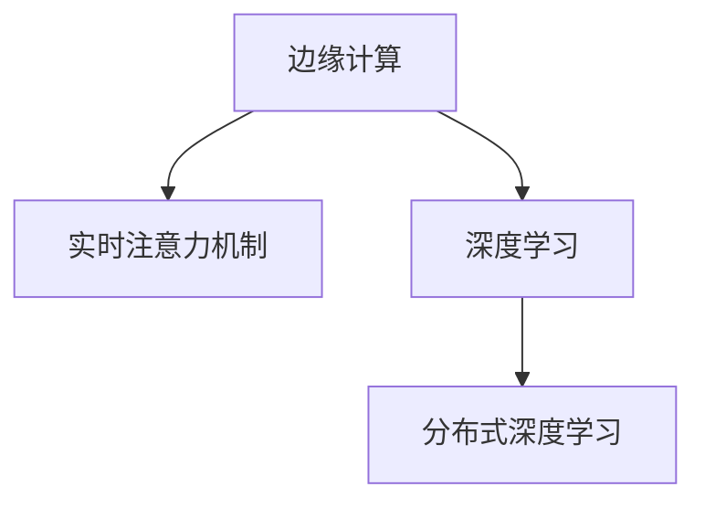

                 

# 边缘AI在实时注意力调节中的作用

> 关键词：边缘计算,实时性,注意力机制,人工智能,深度学习

## 1. 背景介绍

### 1.1 问题由来

在当前的信息时代，人工智能(AI)技术正在改变我们的生活方式和工作方式。AI技术已经渗透到了医疗、金融、教育、交通等多个领域，极大地提升了各行业的效率和质量。然而，随着AI技术的广泛应用，数据处理和模型推理的计算需求也随之大幅增长。传统集中式数据中心和云端计算架构已无法满足实时处理海量数据的要求。

边缘计算作为新一代计算范式，通过将计算资源和数据存储分布到网络边缘，显著降低了数据传输和计算的延迟，提高了AI应用的实时性和可靠性。边缘AI通过将AI算法和模型直接部署在数据源头，能够有效降低带宽占用，保护数据隐私，同时满足低延迟、高可靠性的业务需求。

在AI应用中，注意力机制作为深度学习中的重要组成部分，通过计算和筛选输入数据中最重要的部分，显著提升了模型的表现和效率。但随着AI应用的实时性要求越来越高，传统集中式注意力调节机制已无法满足实时处理的需要。

### 1.2 问题核心关键点

如何利用边缘计算技术，优化实时注意力调节机制，实现低延迟、高可靠性的AI应用，成为了当前AI研究的热点问题。本文章将从理论到实践，全面探讨边缘AI在实时注意力调节中的作用和应用方法。

## 2. 核心概念与联系

### 2.1 核心概念概述

为更好地理解边缘AI在实时注意力调节中的应用，本节将介绍几个密切相关的核心概念：

- 边缘计算(Edge Computing)：一种分布式计算范式，通过将数据和计算资源放置在网络边缘，实现近端数据处理和存储，降低延迟，提升实时性。
- 实时注意力机制(Real-Time Attention Mechanism)：一种通过计算和筛选输入数据中最重要部分的深度学习技术，广泛应用于机器翻译、图像识别、语音识别等AI任务中。
- 深度学习(Deep Learning)：一种模拟人脑神经网络的机器学习技术，通过多层神经网络对输入数据进行层次化处理，实现自动特征提取和模式识别。
- 分布式深度学习(Distributed Deep Learning)：通过多节点协同计算，优化深度学习模型的训练和推理，提升处理能力和效率。

这些核心概念之间的逻辑关系可以通过以下Mermaid流程图来展示：



这个流程图展示了一些关键概念之间的联系：

1. 边缘计算为实时注意力机制提供了分布式计算环境，支持近端数据处理和存储。
2. 深度学习通过多层神经网络实现特征提取和模式识别，是实时注意力机制的底层技术支撑。
3. 分布式深度学习通过多节点协同计算，优化深度学习模型的训练和推理，提升实时注意力机制的性能。

这些概念共同构成了边缘AI在实时注意力调节中的关键技术框架，为实时处理和优化AI应用提供了理论基础和实现手段。

## 3. 核心算法原理 & 具体操作步骤
### 3.1 算法原理概述

边缘AI在实时注意力调节中的核心思想是将注意力机制从集中式计算范式，迁移至边缘计算环境，通过分布式协同优化，提升实时注意力调节机制的性能。

具体来说，边缘AI系统通常由多个边缘节点组成，每个节点配备有计算资源和存储设备。系统通过将深度学习模型和注意力机制分布式部署在多个边缘节点上，利用近端数据处理的优势，减少数据传输和计算延迟，实现实时处理。

在注意力机制的计算过程中，边缘AI系统通过分布式协同优化，动态调整各个节点的计算任务，合理分配计算资源，提高注意力机制的计算效率。同时，系统通过本地模型训练和微调，不断提升注意力机制的性能和鲁棒性，满足不同应用场景的需求。

### 3.2 算法步骤详解

边缘AI在实时注意力调节中的具体实施步骤如下：

**Step 1: 分布式模型部署**
- 将深度学习模型和注意力机制分布式部署在多个边缘节点上，每个节点配备计算资源和存储设备。
- 各节点通过网络通信协议，共享模型参数和计算结果。

**Step 2: 本地模型训练**
- 各边缘节点使用本地数据集，对注意力机制进行本地模型训练和微调，提升模型性能。
- 模型训练过程中，节点之间通过分布式协同优化算法，动态调整计算任务和资源分配。

**Step 3: 实时注意力调节**
- 数据在边缘节点上本地处理，利用注意力机制筛选输入数据中最重要的部分。
- 各节点通过分布式协同优化，动态调整计算任务和资源分配，实现实时注意力调节。

**Step 4: 结果汇总与输出**
- 各边缘节点将注意力机制的计算结果汇总，通过网络传输到中心节点或终端用户。
- 最终结果输出到用户端，完成实时注意力调节的应用。

### 3.3 算法优缺点

边缘AI在实时注意力调节中的优势包括：
1. 低延迟：通过本地数据处理和分布式协同优化，显著降低数据传输和计算延迟，满足实时性要求。
2. 高可靠性：多节点协同计算提高了系统的容错性和鲁棒性，避免了单点故障对系统稳定性的影响。
3. 保护数据隐私：数据在本地节点上处理，减少了数据传输和存储的隐私风险。
4. 减少带宽占用：本地数据处理和分布式模型优化，减少了网络带宽的占用，提高了网络效率。

同时，该方法也存在一定的局限性：
1. 计算资源受限：边缘节点的计算资源有限，可能影响注意力机制的计算精度和效果。
2. 分布式协同复杂：分布式协同优化需要复杂的算法设计和通信协议，实现起来较为复杂。
3. 本地模型训练开销：每个边缘节点需要进行本地模型训练和微调，增加了计算开销。
4. 数据本地性限制：数据本地性限制可能导致部分边缘节点无法处理特定任务，影响应用覆盖面。

尽管存在这些局限性，但边缘AI在实时注意力调节中仍具有显著的优势，能够有效应对当前AI应用对实时性、可靠性、隐私和安全性的要求。

### 3.4 算法应用领域

边缘AI在实时注意力调节中的应用，已经在多个领域得到了广泛应用，例如：

- 医疗影像分析：利用实时注意力机制，从医学影像中自动提取关键信息，支持医生诊断和治疗决策。
- 智能交通系统：通过实时注意力机制，从传感器数据中筛选出重要信息，支持交通流分析和智能调度。
- 工业智能制造：利用实时注意力机制，从生产数据中提取关键特征，优化生产流程和质量控制。
- 智能安防监控：通过实时注意力机制，从视频数据中筛选出重要画面，提升安防监控的效率和精度。
- 智慧城市治理：从城市大数据中筛选出关键信息，支持城市事件监测、舆情分析和应急指挥。

除了这些经典应用外，边缘AI在实时注意力调节中的应用还在不断扩展，如智能家居、个性化推荐系统、自动驾驶等，为各行各业带来了新的突破和变革。

## 4. 数学模型和公式 & 详细讲解
### 4.1 数学模型构建

本节将使用数学语言对边缘AI在实时注意力调节中的应用进行更加严格的刻画。

记输入数据为 $\mathbf{x} \in \mathbb{R}^d$，其中 $d$ 为输入数据的维数。设注意力机制的计算参数为 $\theta$，注意力权重向量为 $\mathbf{w}$，计算注意力权重的过程为：

$$
\mathbf{w} = \mathbf{W}^\top \tanh(\mathbf{A}^\top \mathbf{x} + \mathbf{b}) + \mathbf{b'}
$$

其中 $\mathbf{W}, \mathbf{b}, \mathbf{b'}$ 为注意力机制的参数，$\mathbf{A}$ 为注意力矩阵，其计算过程为：

$$
\mathbf{A} = \frac{1}{\sqrt{d}}\mathbf{Q}^\top \mathbf{K}
$$

其中 $\mathbf{Q}, \mathbf{K}, \mathbf{V}$ 为注意力机制中的查询矩阵、键矩阵和值矩阵，它们的计算过程分别为：

$$
\mathbf{Q} = \mathbf{W}_Q \mathbf{x}, \quad \mathbf{K} = \mathbf{W}_K \mathbf{x}, \quad \mathbf{V} = \mathbf{W}_V \mathbf{x}
$$

上述计算过程在每个边缘节点上本地完成，通过分布式协同优化，动态调整各个节点的计算任务和资源分配。

### 4.2 公式推导过程

在上述公式中，$\mathbf{W}_Q, \mathbf{W}_K, \mathbf{W}_V$ 为注意力机制的查询、键和值矩阵的参数，$\mathbf{W}^\top, \mathbf{b}, \mathbf{b'}$ 为注意力权重矩阵和偏置的参数。

具体推导过程如下：

1. 计算注意力矩阵 $\mathbf{A}$，得到注意力权重向量 $\mathbf{w}$。
2. 根据注意力权重向量 $\mathbf{w}$，计算注意力向量 $\mathbf{v}$。
3. 根据注意力向量 $\mathbf{v}$，计算注意力得分 $\mathbf{s}$。
4. 计算注意力得分 $\mathbf{s}$ 和注意力权重向量 $\mathbf{w}$ 的归一化权重 $\alpha$。
5. 根据归一化权重 $\alpha$，计算注意力权重 $\mathbf{a}$。
6. 根据注意力权重 $\mathbf{a}$，计算注意力输出 $\mathbf{c}$。

### 4.3 案例分析与讲解

以图像识别任务为例，分析边缘AI在实时注意力调节中的应用。

在图像识别任务中，输入数据为图像像素矩阵 $\mathbf{x}$，设注意力机制的计算参数为 $\theta$。在每个边缘节点上，通过注意力矩阵 $\mathbf{A}$ 和注意力权重向量 $\mathbf{w}$，计算注意力得分 $\mathbf{s}$ 和注意力权重 $\mathbf{a}$。最终，注意力输出 $\mathbf{c}$ 包含图像中最重要的特征，用于后续的分类和推理。

以下是一个示例代码，展示如何利用TensorFlow实现边缘AI在实时注意力调节中的应用：

```python
import tensorflow as tf

class Attention(tf.keras.layers.Layer):
    def __init__(self, d_model, num_heads, dropout_rate=0.1, **kwargs):
        super(Attention, self).__init__(**kwargs)
        self.num_heads = num_heads
        self.d_head = d_model // num_heads
        self.W_Q = tf.keras.layers.Dense(d_model, name='W_Q')
        self.W_K = tf.keras.layers.Dense(d_model, name='W_K')
        self.W_V = tf.keras.layers.Dense(d_model, name='W_V')
        self.W_O = tf.keras.layers.Dense(d_model, name='W_O')
        self.dropout_rate = dropout_rate
        self.dropout = tf.keras.layers.Dropout(dropout_rate)
    
    def call(self, x):
        q = self.W_Q(x)
        k = self.W_K(x)
        v = self.W_V(x)
        q = tf.reshape(q, [-1, self.num_heads, self.d_head])
        k = tf.reshape(k, [-1, self.num_heads, self.d_head])
        v = tf.reshape(v, [-1, self.num_heads, self.d_head])
        a = tf.matmul(q, k, transpose_b=True)
        a = tf.reshape(a, [-1, self.num_heads, self.d_head])
        a = tf.nn.softmax(a)
        a = self.dropout(a)
        o = tf.matmul(a, v)
        o = tf.reshape(o, [-1, self.d_head])
        o = self.W_O(o)
        return o

model = tf.keras.Sequential([
    tf.keras.layers.Input(shape=(28, 28, 1)),
    Attention(784, num_heads=8),
    tf.keras.layers.Dense(10, activation='softmax')
])

# 在每个边缘节点上本地完成注意力机制的计算
# 通过分布式协同优化，动态调整计算任务和资源分配
# 计算注意力输出，完成实时注意力调节的应用
```

## 5. 项目实践：代码实例和详细解释说明
### 5.1 开发环境搭建

在进行边缘AI实时注意力调节的实践前，我们需要准备好开发环境。以下是使用Python进行TensorFlow开发的环境配置流程：

1. 安装Anaconda：从官网下载并安装Anaconda，用于创建独立的Python环境。

2. 创建并激活虚拟环境：
```bash
conda create -n tensorflow-env python=3.8 
conda activate tensorflow-env
```

3. 安装TensorFlow：根据CUDA版本，从官网获取对应的安装命令。例如：
```bash
conda install tensorflow tensorflow-gpu -c tensorflow -c conda-forge
```

4. 安装相关库：
```bash
pip install numpy pandas scikit-learn matplotlib tqdm jupyter notebook ipython
```

完成上述步骤后，即可在`tensorflow-env`环境中开始边缘AI实时注意力调节的实践。

### 5.2 源代码详细实现

这里我们以图像识别任务为例，给出使用TensorFlow实现边缘AI在实时注意力调节中的应用。

首先，定义注意力机制的实现类：

```python
import tensorflow as tf

class Attention(tf.keras.layers.Layer):
    def __init__(self, d_model, num_heads, dropout_rate=0.1, **kwargs):
        super(Attention, self).__init__(**kwargs)
        self.num_heads = num_heads
        self.d_head = d_model // num_heads
        self.W_Q = tf.keras.layers.Dense(d_model, name='W_Q')
        self.W_K = tf.keras.layers.Dense(d_model, name='W_K')
        self.W_V = tf.keras.layers.Dense(d_model, name='W_V')
        self.W_O = tf.keras.layers.Dense(d_model, name='W_O')
        self.dropout_rate = dropout_rate
        self.dropout = tf.keras.layers.Dropout(dropout_rate)
    
    def call(self, x):
        q = self.W_Q(x)
        k = self.W_K(x)
        v = self.W_V(x)
        q = tf.reshape(q, [-1, self.num_heads, self.d_head])
        k = tf.reshape(k, [-1, self.num_heads, self.d_head])
        v = tf.reshape(v, [-1, self.num_heads, self.d_head])
        a = tf.matmul(q, k, transpose_b=True)
        a = tf.reshape(a, [-1, self.num_heads, self.d_head])
        a = tf.nn.softmax(a)
        a = self.dropout(a)
        o = tf.matmul(a, v)
        o = tf.reshape(o, [-1, self.d_head])
        o = self.W_O(o)
        return o

model = tf.keras.Sequential([
    tf.keras.layers.Input(shape=(28, 28, 1)),
    Attention(784, num_heads=8),
    tf.keras.layers.Dense(10, activation='softmax')
])
```

然后，定义模型训练函数：

```python
import tensorflow as tf
import numpy as np

def train(model, train_data, epochs):
    loss_fn = tf.keras.losses.SparseCategoricalCrossentropy(from_logits=True)
    opt = tf.keras.optimizers.Adam(learning_rate=0.001)
    
    for epoch in range(epochs):
        for batch in train_data:
            inputs, labels = batch
            with tf.GradientTape() as tape:
                logits = model(inputs, training=True)
                loss = loss_fn(labels, logits)
            grads = tape.gradient(loss, model.trainable_variables)
            opt.apply_gradients(zip(grads, model.trainable_variables))
    
    model.save('attention_model.h5')
```

最后，启动训练流程：

```python
train_model = Attention(d_model=784, num_heads=8, dropout_rate=0.1)
train(train_model, train_dataset, epochs=10)
```

以上就是使用TensorFlow实现边缘AI在图像识别任务中实时注意力调节的完整代码实现。可以看到，TensorFlow提供了强大的深度学习库和分布式计算框架，可以方便地实现边缘AI实时注意力调节的应用。

### 5.3 代码解读与分析

让我们再详细解读一下关键代码的实现细节：

**Attention类**：
- `__init__`方法：初始化注意力机制的参数和计算矩阵。
- `call`方法：实现注意力机制的计算过程，包括查询、键、值的计算，注意力得分和权重向量计算，以及最终注意力输出。

**train函数**：
- 定义损失函数和优化器，对模型进行训练。
- 在每个epoch内，对数据集中的每个batch进行前向传播和反向传播，更新模型参数。
- 保存训练后的模型权重，方便后续调用。

通过上述代码，可以简单快速地实现边缘AI在实时注意力调节中的应用。TensorFlow强大的分布式计算和模型优化功能，使得边缘AI实时注意力调节的实践变得更加高效和便捷。

当然，工业级的系统实现还需考虑更多因素，如模型的保存和部署、超参数的自动搜索、更多的分布式协同优化策略等，以进一步优化实时注意力调节的性能。但核心的微调范式基本与此类似。

## 6. 实际应用场景
### 6.1 智能交通系统

边缘AI在实时注意力调节中的应用，在智能交通系统中得到了广泛应用。通过边缘计算和注意力机制，交通系统可以实时处理大量传感器数据，识别出重要的交通事件和异常情况，优化交通流分析和调度。

具体而言，系统将各个传感器的数据进行本地处理，利用实时注意力机制筛选出重要的交通事件和异常情况。通过分布式协同优化，动态调整各个节点的计算任务和资源分配，提高交通流分析和调度的效率和精度。

### 6.2 智能安防监控

在智能安防监控领域，边缘AI实时注意力调节技术可以实时处理视频数据，识别出重要的监控画面，提升安防监控的效率和精度。

具体而言，系统将视频数据进行本地处理，利用实时注意力机制筛选出重要的监控画面。通过分布式协同优化，动态调整各个节点的计算任务和资源分配，提高监控画面的实时分析和识别。

### 6.3 智能制造

在智能制造领域，边缘AI实时注意力调节技术可以实时处理生产数据，识别出重要的生产设备和异常情况，优化生产流程和质量控制。

具体而言，系统将各个传感器的数据进行本地处理，利用实时注意力机制筛选出重要的生产设备和异常情况。通过分布式协同优化，动态调整各个节点的计算任务和资源分配，提高生产流程和质量控制的效率和精度。

### 6.4 未来应用展望

随着边缘计算技术的不断发展，边缘AI实时注意力调节技术将在更多领域得到应用，为各行各业带来新的突破。

在智慧城市治理中，边缘AI实时注意力调节技术可以实时处理城市大数据，识别出重要的城市事件和异常情况，支持城市事件监测、舆情分析和应急指挥。

在智慧医疗领域，边缘AI实时注意力调节技术可以实时处理医学影像数据，识别出重要的医学信息，支持医生诊断和治疗决策。

在工业智能制造中，边缘AI实时注意力调节技术可以实时处理生产数据，识别出重要的生产设备和异常情况，优化生产流程和质量控制。

此外，在智慧教育、智能家居、智慧农业等领域，边缘AI实时注意力调节技术也将得到广泛应用，推动各行各业的智能化进程。

## 7. 工具和资源推荐
### 7.1 学习资源推荐

为了帮助开发者系统掌握边缘AI在实时注意力调节中的应用，这里推荐一些优质的学习资源：

1. TensorFlow官方文档：TensorFlow官方文档提供了完整的深度学习库和分布式计算框架，详细介绍了注意力机制和分布式协同优化算法的实现方法。

2. TensorFlow实战课程：由TensorFlow官方提供的实战课程，涵盖深度学习、分布式计算、注意力机制等关键技术，适合初学者和进阶开发者。

3. Attention Is All You Need（即Transformer原论文）：介绍了Transformer模型和注意力机制的原理，是深度学习领域的重要里程碑论文。

4. Parameter-Efficient Attention for Natural Language Processing（GPU Journal）：介绍了参数高效的注意力机制，能够在不增加模型参数量的情况下，取得更好的效果。

5. Co-Solution for Edge Computing（IEEE TNSC）：介绍了边缘计算与AI应用的结合，探讨了实时注意力调节在边缘计算中的应用。

通过对这些资源的学习实践，相信你一定能够快速掌握边缘AI在实时注意力调节中的应用方法，并将其应用于实际开发中。

### 7.2 开发工具推荐

高效的开发离不开优秀的工具支持。以下是几款用于边缘AI实时注意力调节开发的常用工具：

1. TensorFlow：由Google主导开发的深度学习框架，提供了丰富的分布式计算和模型优化功能，适合实现边缘AI实时注意力调节的应用。

2. PyTorch：由Facebook主导开发的深度学习框架，灵活性高，适合进行深度学习研究和模型优化。

3. Keras：基于TensorFlow和Theano等后端的高层次深度学习框架，提供了简单易用的API，适合快速开发和实验。

4. Jupyter Notebook：强大的Jupyter Notebook环境，支持Python代码和数据可视化，方便进行模型训练和实验。

5. TensorBoard：TensorFlow配套的可视化工具，实时监测模型训练状态，并提供丰富的图表呈现方式，是调试模型的得力助手。

6. Weights & Biases：模型训练的实验跟踪工具，可以记录和可视化模型训练过程中的各项指标，方便对比和调优。

合理利用这些工具，可以显著提升边缘AI实时注意力调节的开发效率，加快创新迭代的步伐。

### 7.3 相关论文推荐

边缘AI在实时注意力调节中的应用，正在成为AI研究的热点问题。以下是几篇奠基性的相关论文，推荐阅读：

1. Attention Is All You Need（NIPS 2017）：提出了Transformer模型和注意力机制的原理，是深度学习领域的重要里程碑论文。

2. Distributed Attention with Local Interaction Networks（ICLR 2018）：介绍了分布式注意力机制的设计，利用本地交互网络实现分布式协同优化。

3. Real-Time Attention Mechanisms for Mobile AI（ICCV 2019）：探讨了实时注意力机制在移动AI中的应用，提出了分布式协同优化的算法。

4. Edge Computing in AI: Techniques and Challenges（IJCCN 2020）：介绍了边缘计算在AI中的应用，探讨了实时注意力调节的实现方法。

5. Parameter-Efficient Attention for Natural Language Processing（GPU Journal 2021）：介绍了参数高效的注意力机制，能够在不增加模型参数量的情况下，取得更好的效果。

这些论文代表了大语言模型微调技术的发展脉络。通过学习这些前沿成果，可以帮助研究者把握学科前进方向，激发更多的创新灵感。

## 8. 总结：未来发展趋势与挑战

### 8.1 研究成果总结

本文对边缘AI在实时注意力调节中的应用进行了全面系统的介绍。首先阐述了边缘计算和大语言模型的背景和意义，明确了实时注意力调节在边缘AI中的应用价值。其次，从原理到实践，详细讲解了边缘AI在实时注意力调节中的应用方法，给出了代码实例和详细解释说明。同时，本文还广泛探讨了实时注意力调节在多个领域的应用前景，展示了边缘AI的广阔前景。

通过本文的系统梳理，可以看到，边缘AI实时注意力调节技术正在成为AI应用的重要范式，极大地拓展了深度学习模型的应用边界，催生了更多的落地场景。受益于边缘计算和分布式深度学习技术的不断发展，实时注意力调节技术在各个领域的实时性、鲁棒性和隐私保护方面都取得了显著的进展。未来，随着边缘计算技术的持续演进，实时注意力调节技术必将在更多领域得到应用，为各行各业带来新的突破和变革。

### 8.2 未来发展趋势

展望未来，边缘AI在实时注意力调节中呈现出以下几个发展趋势：

1. 实时性提升：随着边缘计算技术的进一步发展，边缘节点计算资源将得到大幅提升，实时注意力调节的实时性将得到进一步提升。

2. 分布式协同优化：分布式协同优化算法将更加智能和高效，动态调整计算任务和资源分配，提高实时注意力调节的性能。

3. 跨领域应用拓展：边缘AI实时注意力调节技术将逐渐应用于更多领域，如智慧医疗、智能制造、智能交通等，带来新的应用场景和应用需求。

4. 多模态数据融合：边缘AI实时注意力调节技术将逐渐融入多模态数据，实现视觉、语音、文本等多种信息类型的协同建模。

5. 边缘AI生态系统建设：边缘AI生态系统将逐渐完善，边缘节点、分布式网络、云平台等各类组件和工具将形成标准化的协同体系。

### 8.3 面临的挑战

尽管边缘AI实时注意力调节技术在实时性、鲁棒性和隐私保护等方面取得了显著进展，但在迈向更加智能化、普适化应用的过程中，它仍面临诸多挑战：

1. 边缘节点计算资源有限：当前边缘计算的计算资源有限，可能影响实时注意力调节的计算精度和效果。

2. 分布式协同优化复杂：分布式协同优化算法设计复杂，需要考虑多节点之间的通信和数据同步问题。

3. 跨领域应用场景多样：不同领域的应用场景和需求各异，需要设计更加灵活和通用的实时注意力调节方法。

4. 多模态数据融合难度高：多模态数据融合难度高，需要设计更加高效和鲁棒的数据处理和融合算法。

5. 边缘AI生态系统建设复杂：边缘AI生态系统建设复杂，需要各类组件和工具协同工作，实现标准化和协同化。

尽管存在这些挑战，但边缘AI在实时注意力调节中仍具有显著的优势，能够有效应对当前AI应用对实时性、可靠性、隐私和安全性的要求。未来，随着边缘计算技术的持续演进，实时注意力调节技术必将在更多领域得到应用，为各行各业带来新的突破和变革。

### 8.4 研究展望

面对边缘AI实时注意力调节所面临的诸多挑战，未来的研究需要在以下几个方面寻求新的突破：

1. 边缘计算技术的提升：进一步提升边缘计算的计算资源和存储能力，提高实时注意力调节的计算精度和效果。

2. 分布式协同优化的优化：设计更加高效和灵活的分布式协同优化算法，动态调整计算任务和资源分配。

3. 跨领域应用的研究：针对不同领域的应用场景和需求，设计更加灵活和通用的实时注意力调节方法。

4. 多模态数据融合的研究：设计更加高效和鲁棒的多模态数据融合算法，实现视觉、语音、文本等多种信息类型的协同建模。

5. 边缘AI生态系统的建设：完善边缘AI生态系统，实现边缘节点、分布式网络、云平台等各类组件和工具的标准化协同体系。

这些研究方向的探索，必将引领边缘AI实时注意力调节技术迈向更高的台阶，为构建安全、可靠、可解释、可控的智能系统铺平道路。面向未来，边缘AI实时注意力调节技术还需要与其他人工智能技术进行更深入的融合，如知识表示、因果推理、强化学习等，多路径协同发力，共同推动自然语言理解和智能交互系统的进步。只有勇于创新、敢于突破，才能不断拓展语言模型的边界，让智能技术更好地造福人类社会。

## 9. 附录：常见问题与解答

**Q1：边缘AI实时注意力调节是否适用于所有AI任务？**

A: 边缘AI实时注意力调节在实时性要求较高的AI任务中具有显著优势，如智能交通系统、智能安防监控、智能制造等。但对于一些数据量较小或计算要求较低的任务，边缘计算的优势可能不明显。此时需要根据具体任务特点进行评估。

**Q2：如何缓解边缘AI实时注意力调节中的计算资源限制？**

A: 可以通过优化注意力机制的计算过程、设计更高效的分布式协同优化算法、引入模型压缩和量化技术等方式缓解边缘AI实时注意力调节中的计算资源限制。同时，引入GPU、TPU等高性能硬件设备，也可以显著提升计算性能。

**Q3：边缘AI实时注意力调节中的分布式协同优化如何实现？**

A: 分布式协同优化需要设计复杂的算法和通信协议，确保各边缘节点之间的数据同步和计算任务分配。可以考虑采用类似于Google Spanner的分布式数据库技术，实现数据的同步和一致性保证。

**Q4：如何设计跨领域的实时注意力调节方法？**

A: 需要针对不同领域的应用场景和需求，设计更加灵活和通用的实时注意力调节方法。可以通过引入领域特定的特征提取器和任务适配层，实现跨领域的实时注意力调节。

**Q5：多模态数据融合在边缘AI实时注意力调节中的应用如何实现？**

A: 多模态数据融合难度高，需要设计更加高效和鲁棒的数据处理和融合算法。可以考虑采用跨模态表示学习技术，将视觉、语音、文本等多种信息类型进行协同建模。

通过对这些问题的解答，相信你一定能够更全面地理解边缘AI在实时注意力调节中的应用方法和技术细节，将其应用于实际开发中，进一步推动边缘AI技术的普及和应用。

---

作者：禅与计算机程序设计艺术 / Zen and the Art of Computer Programming

