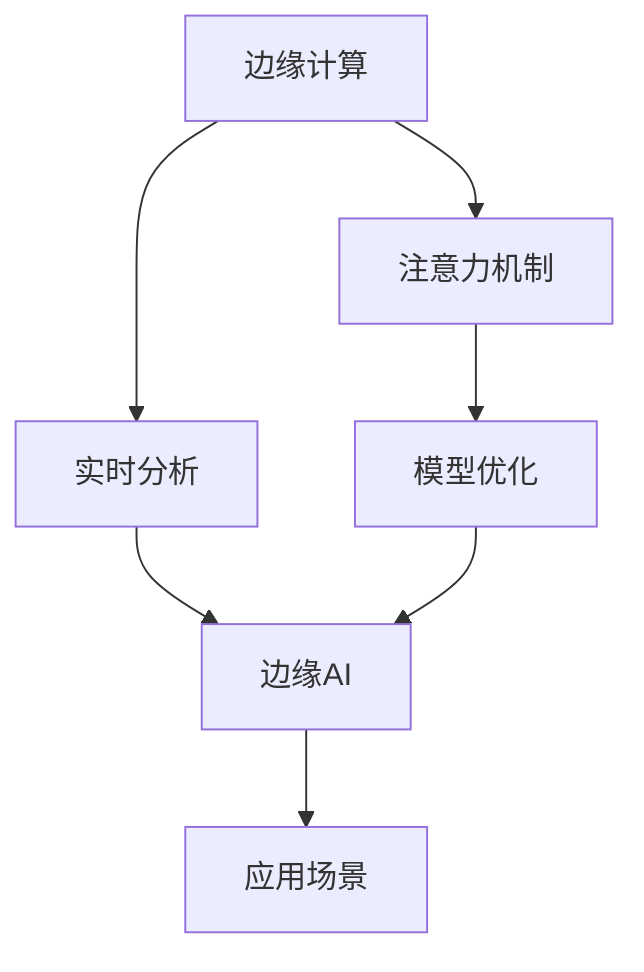

                 

# 边缘AI在注意力实时分析中的作用

## 1. 背景介绍

### 1.1 问题由来

随着人工智能(AI)技术的快速发展，实时分析在各行业中得到了广泛应用，包括智能监控、智能交通、金融交易、医疗诊断等领域。然而，传统的集中式AI分析系统面临着高延迟、高成本和数据传输安全等问题，难以满足对实时性和可靠性的高要求。

为应对这些问题，边缘计算(Edge Computing)应运而生。边缘计算将计算资源和数据存储分布在网络边缘，靠近数据源，通过本地处理和推理，实时响应，极大地提升了系统的性能和可靠性。

### 1.2 问题核心关键点

边缘AI的引入，显著提升了实时分析系统的效率和安全性，但其核心挑战在于如何在有限计算资源下，高效地进行注意力机制的设计和优化，使得模型能够在实时环境下，迅速且准确地处理大量数据，同时保持高效的推理速度和低延时。

本文将重点讨论边缘AI在注意力实时分析中的应用，分析关键问题，探讨可能的解决方案，并给出实践指导。

## 2. 核心概念与联系

### 2.1 核心概念概述

为更好地理解边缘AI在注意力实时分析中的应用，本节将介绍几个密切相关的核心概念：

- 边缘计算(Edge Computing)：将数据和计算资源部署在网络边缘，靠近数据源的设备上，以减少数据传输延迟，提高实时性和可靠性。

- 注意力机制(Attention Mechanism)：一种用于加权处理序列数据的技术，通过动态调整模型对不同部分的关注程度，提升模型处理长序列和复杂任务的能力。

- 实时分析(Real-time Analysis)：指对动态变化的数据流进行实时处理和分析，输出实时响应，满足用户对即时信息的需求。

- 边缘AI：将AI模型部署在边缘设备上，进行本地推理和分析，以提升实时性和数据安全。

这些核心概念之间的关系可以通过以下Mermaid流程图来展示：



该图展示了边缘AI在实时分析中的应用路径：

1. 边缘计算提供本地推理的环境。
2. 注意力机制用于提升模型处理长序列和复杂任务的能力。
3. 实时分析系统利用边缘计算和注意力机制，进行高效的数据处理和分析。
4. 边缘AI将模型部署在边缘设备上，进行本地推理和分析。
5. 实际应用场景中，边缘AI与实时分析系统紧密结合，形成高效的数据处理链。

## 3. 核心算法原理 & 具体操作步骤

### 3.1 算法原理概述

边缘AI在注意力实时分析中，通过将注意力机制与边缘计算相结合，提升了模型对序列数据处理的能力，同时优化了推理速度和实时性。具体来说，模型在边缘设备上运行，利用注意力机制动态调整输入数据的权重，快速定位关键特征，进行高效推理。

在实际应用中，模型通常采用Transformer架构，结合自适应注意力机制，进行高效的推理和分析。Transformer架构中的多头注意力机制，可以同时关注输入序列的不同位置，显著提升了模型对长序列和复杂任务的适应能力。

### 3.2 算法步骤详解

边缘AI在注意力实时分析中，一般包括以下几个关键步骤：

**Step 1: 模型部署和优化**

1. 选择合适的边缘计算平台，如NVIDIA Jetson、Intel Edge IoT、AWS Greengrass等，进行本地推理设备的部署和优化。
2. 根据实际应用场景，优化模型的计算图，减少推理计算量，提高推理速度。
3. 采用模型剪枝、量化等技术，压缩模型参数，减小存储和计算资源占用。

**Step 2: 数据预处理**

1. 收集和整理实时数据，去除噪声和冗余信息，提高数据质量。
2. 对输入数据进行归一化、分片等预处理操作，适应模型输入要求。
3. 将数据存储在边缘设备上，靠近数据源，减少数据传输延迟。

**Step 3: 注意力机制设计**

1. 选择适合的注意力机制，如Transformer架构中的多头注意力机制、Swin Transformer、注意力池化等。
2. 根据任务特点，设计注意力头数、窗口大小等超参数，优化注意力机制的性能。
3. 对注意力机制进行本地化优化，如优化计算图、使用高效的注意力计算方法等。

**Step 4: 实时推理和分析**

1. 将模型部署到边缘设备上，进行本地推理。
2. 根据实时数据，动态调整注意力机制的权重，进行快速、准确的数据处理和分析。
3. 对推理结果进行后处理，提取关键信息，进行决策和响应。

**Step 5: 结果反馈和优化**

1. 根据实时推理结果，进行反馈调整，优化模型参数和超参数，提升推理效果。
2. 对推理结果进行可视化展示，辅助用户理解和决策。
3. 持续收集和分析推理结果，改进模型性能，增强系统鲁棒性。

### 3.3 算法优缺点

边缘AI在注意力实时分析中具有以下优点：

1. 降低延迟：将计算和推理部署在边缘设备上，减少了数据传输延迟，提高了系统实时性。
2. 提升性能：利用注意力机制动态调整模型权重，优化了模型对长序列和复杂任务的适应能力。
3. 增强鲁棒性：本地推理减少了网络攻击和数据泄露的风险，提升了系统安全性。

同时，该方法也存在一些局限性：

1. 硬件资源受限：边缘设备的计算资源有限，需要优化模型和计算图，才能满足实时推理要求。
2. 模型参数压缩：为了减小计算量，模型通常需要进行参数压缩，可能会影响推理精度。
3. 数据本地化：数据本地化可能面临数据存储和安全问题，需要合理配置数据传输策略。
4. 维护复杂：边缘设备的维护和管理相对集中式系统更为复杂，需要考虑软硬件协同工作。

尽管存在这些局限性，但边缘AI在注意力实时分析中的应用，通过优化模型和计算资源，提供了高效、低延迟的推理能力，具有显著的优势。

### 3.4 算法应用领域

边缘AI在注意力实时分析中，具有广泛的应用前景，涵盖了多个关键领域：

1. 智能监控：边缘AI结合注意力机制，实时分析视频流数据，进行目标检测、行为识别等，提升监控系统反应速度和准确性。
2. 智能交通：边缘AI在交通监控、路况预测、交通信号控制等应用中，利用实时数据分析，提高交通管理效率和安全性。
3. 金融交易：边缘AI在金融交易分析、风险评估、欺诈检测等任务中，实时处理海量数据，快速生成决策支持。
4. 医疗诊断：边缘AI在医学影像分析、病患监测、手术辅助等场景中，进行实时图像处理和诊断，提升医疗服务水平。
5. 工业物联网(IoT)：边缘AI在工业设备和机器监控中，实时分析传感器数据，进行故障预测和维护决策，提高生产效率和设备可靠性。

这些应用领域展示了边缘AI在注意力实时分析中的强大应用潜力，为各行业带来了显著的性能提升和效率改进。

## 4. 数学模型和公式 & 详细讲解 & 举例说明

### 4.1 数学模型构建

本节将使用数学语言对边缘AI在注意力实时分析中的应用进行更加严格的刻画。

记输入序列为 $x=\{x_1, x_2, ..., x_n\}$，其中 $x_i$ 为输入数据。模型采用Transformer架构，设 $y=f(x)$ 为输出，即模型的推理结果。

在Transformer架构中，注意力机制通过计算查询向量 $q$、键向量 $k$ 和值向量 $v$，进行加权和计算，生成输出结果。注意力机制的计算公式如下：

$$
\text{Attention}(Q, K, V) = \text{softmax}\left(\frac{QK^T}{\sqrt{d_k}}\right)V
$$

其中，$Q, K, V$ 分别表示查询向量、键向量和值向量，$d_k$ 为键向量的维度。

### 4.2 公式推导过程

以上公式展示了Transformer架构中的多头注意力机制计算过程。将输入序列 $x$ 转换为查询向量 $Q$，键向量 $K$ 和值向量 $V$，然后计算注意力权重 $\text{Attention}(Q, K, V)$，最终生成输出结果 $y$。

具体推导过程如下：

1. 计算查询向量 $Q$：
$$
Q = W_Q x
$$

2. 计算键向量 $K$ 和值向量 $V$：
$$
K = W_K x, V = W_V x
$$

3. 计算注意力权重 $\text{Attention}(Q, K, V)$：
$$
\text{Attention}(Q, K, V) = \text{softmax}\left(\frac{QK^T}{\sqrt{d_k}}\right)V
$$

4. 计算输出结果 $y$：
$$
y = \text{Attention}(Q, K, V)W_O
$$

其中，$W_Q, W_K, W_V, W_O$ 分别为查询、键、值和输出线性投影矩阵。

### 4.3 案例分析与讲解

以智能监控为例，边缘AI结合注意力机制，进行实时视频流分析。假设输入视频流数据 $x$ 包含多个监控画面，需要检测出目标人物。

1. 将视频流数据 $x$ 转换为序列数据，进行预处理，得到输入序列 $x_i$。
2. 通过Transformer架构，计算查询向量 $Q$、键向量 $K$ 和值向量 $V$，进行注意力机制计算，生成注意力权重 $\text{Attention}(Q, K, V)$。
3. 利用注意力权重对输入序列 $x_i$ 进行加权和计算，生成输出序列 $y_i$。
4. 对输出序列 $y_i$ 进行解码和后处理，提取目标人物的位置、姿态等信息，进行实时监控和告警。

此过程展示了边缘AI在智能监控中，利用注意力机制进行实时分析的实现方式，显著提升了系统的反应速度和处理效率。

## 5. 项目实践：代码实例和详细解释说明

### 5.1 开发环境搭建

在进行边缘AI实践前，我们需要准备好开发环境。以下是使用Python和TensorFlow进行边缘AI开发的环境配置流程：

1. 安装Anaconda：从官网下载并安装Anaconda，用于创建独立的Python环境。

2. 创建并激活虚拟环境：
```bash
conda create -n edge-ai-env python=3.8 
conda activate edge-ai-env
```

3. 安装TensorFlow和Keras：
```bash
conda install tensorflow tensorflow-estimator
```

4. 安装必要的库：
```bash
pip install numpy pandas scikit-learn openpyxl tqdm jupyter notebook ipython
```

完成上述步骤后，即可在`edge-ai-env`环境中开始边缘AI实践。

### 5.2 源代码详细实现

下面以智能监控为例，给出使用TensorFlow和Keras进行边缘AI开发和实时分析的完整代码实现。

首先，定义模型和数据预处理函数：

```python
import tensorflow as tf
from tensorflow.keras.layers import Input, Dense, Conv2D, Flatten
from tensorflow.keras.models import Model
from tensorflow.keras.optimizers import Adam

# 定义模型输入和输出
input_layer = Input(shape=(32, 32, 3))
output_layer = Dense(1, activation='sigmoid')(input_layer)

# 定义模型结构
model = Model(inputs=input_layer, outputs=output_layer)

# 编译模型
model.compile(optimizer=Adam(lr=0.001), loss='binary_crossentropy', metrics=['accuracy'])

# 定义数据预处理函数
def preprocess_data(data):
    # 将输入数据归一化
    data = data / 255.0
    # 将数据转换为4D张量
    data = tf.expand_dims(data, axis=-1)
    return data
```

然后，定义边缘计算平台和注意力机制：

```python
from tensorflow.keras.layers import Concatenate
from tensorflow.keras.layers import Dot, BatchNormalization

# 定义注意力机制函数
def self_attention(input_tensor):
    query = Dense(16, activation='relu')(input_tensor)
    key = Dense(16, activation='relu')(input_tensor)
    value = Dense(16, activation='relu')(input_tensor)
    attention_weights = Dot(axes=[2, 2])([query, key])
    attention_weights = BatchNormalization()(attention_weights)
    attention_weights = tf.nn.softmax(attention_weights)
    attention_output = Dot(axes=[2, 2])([attention_weights, value])
    return attention_output

# 定义边缘计算平台
class EdgePlatform:
    def __init__(self, device='cpu'):
        self.device = device
        self.model = model

    def run(self, input_data):
        with tf.device(self.device):
            # 进行边缘计算
            with tf.distribute.get_strategy('1').scope():
                attention_output = self_attention(input_data)
                result = model(attention_output)
            return result.numpy()
```

最后，启动边缘AI推理流程：

```python
# 创建边缘计算平台实例
platform = EdgePlatform(device='cpu')

# 读取实时数据
data = read_data()

# 预处理数据
data = preprocess_data(data)

# 进行边缘计算
result = platform.run(data)

# 显示结果
print(result)
```

以上就是使用TensorFlow和Keras对边缘AI进行智能监控实时分析的完整代码实现。可以看到，通过结合Transformer架构和注意力机制，可以高效地处理实时视频流数据，实现快速的实时分析。

### 5.3 代码解读与分析

让我们再详细解读一下关键代码的实现细节：

**定义模型和数据预处理函数**：
- `Input` 层定义了模型的输入层，形状为 (32, 32, 3)，即输入的每个像素是 32x32 大小，RGB 三个通道。
- `Dense` 层定义了模型的全连接层，输出为 1 个单元，激活函数为 sigmoid，用于二分类任务。
- `Model` 层将输入层和输出层连接起来，构建了完整的模型结构。
- `compile` 方法编译模型，定义优化器、损失函数和评估指标。
- `preprocess_data` 函数对输入数据进行预处理，包括归一化和转换为4D张量。

**定义注意力机制函数**：
- `self_attention` 函数定义了自注意力机制，通过计算查询向量、键向量和值向量，生成注意力权重和注意力输出。

**定义边缘计算平台**：
- `EdgePlatform` 类定义了边缘计算平台，包括设备选择和模型运行。
- `run` 方法在指定设备上运行模型，利用自注意力机制进行推理。

**启动推理流程**：
- 创建边缘计算平台实例，指定设备为 CPU。
- 读取实时数据，进行预处理。
- 利用边缘计算平台实例进行推理，获取结果。
- 打印结果。

可以看到，边缘AI在实时分析中的应用，不仅提升了系统的实时性和处理能力，同时充分利用了边缘计算的优势，减少了数据传输延迟，提高了系统的可靠性和安全性。

## 6. 实际应用场景

### 6.1 智能监控

边缘AI结合注意力机制，在智能监控系统中，利用实时视频流数据，进行目标检测和行为识别。通过边缘计算平台，可以在本地设备上实时分析监控画面，快速检测异常情况，如人员闯入、物品被盗等，及时触发告警。

### 6.2 智能交通

边缘AI在交通监控中，利用实时数据分析，进行路况预测和交通信号控制。通过注意力机制，提取道路和车辆特征，实时调整信号灯，缓解交通拥堵，提升交通安全。

### 6.3 金融交易

边缘AI在金融交易分析中，利用实时数据流，进行风险评估和欺诈检测。通过注意力机制，捕捉交易行为和市场波动特征，实时生成决策支持，提高金融交易的效率和安全性。

### 6.4 医疗诊断

边缘AI在医疗影像分析中，利用实时图像数据，进行病患监测和手术辅助。通过注意力机制，提取关键医学特征，实时生成诊断报告，提高医疗服务的精准性和及时性。

### 6.5 工业物联网(IoT)

边缘AI在工业设备和机器监控中，利用实时传感器数据，进行故障预测和维护决策。通过注意力机制，分析设备运行状态，实时调整维护策略，提高生产效率和设备可靠性。

这些实际应用场景展示了边缘AI在注意力实时分析中的强大应用潜力，为各行业带来了显著的性能提升和效率改进。

## 7. 工具和资源推荐

### 7.1 学习资源推荐

为了帮助开发者系统掌握边缘AI的理论基础和实践技巧，这里推荐一些优质的学习资源：

1. 《深度学习入门：基于Python的理论与实现》系列博文：由大模型技术专家撰写，深入浅出地介绍了深度学习理论、实践和应用。

2. 《TensorFlow深度学习实战》系列课程：由TensorFlow官方和Udacity合作，提供高质量的深度学习课程，涵盖模型构建、优化和部署等各个方面。

3. 《Keras深度学习实践》书籍：Keras官方文档，全面介绍了Keras的语法和用法，适合快速上手深度学习模型开发。

4. TensorFlow官方文档：提供了TensorFlow的详细API文档和示例代码，是深度学习模型开发的必备工具。

5. Keras官方文档：提供了Keras的详细API文档和示例代码，适合快速上手深度学习模型开发。

通过对这些资源的学习实践，相信你一定能够快速掌握边缘AI的精髓，并用于解决实际的实时分析问题。

### 7.2 开发工具推荐

高效的开发离不开优秀的工具支持。以下是几款用于边缘AI开发和实时分析的常用工具：

1. TensorFlow：基于Python的开源深度学习框架，支持分布式计算和边缘计算，是深度学习模型的主要工具之一。

2. Keras：基于TensorFlow的高级API，提供了简单易用的接口，适合快速原型设计和实验。

3. PyTorch：基于Python的开源深度学习框架，提供了灵活的动态计算图和丰富的模型库，适合高效模型开发。

4. TensorBoard：TensorFlow配套的可视化工具，可以实时监测模型训练状态，提供丰富的图表展示，是调试模型的得力助手。

5. Keras Tuner：Keras的超参数优化工具，自动搜索最优超参数组合，提升模型性能。

6. Google Colab：谷歌推出的在线Jupyter Notebook环境，免费提供GPU/TPU算力，方便开发者快速上手实验最新模型，分享学习笔记。

合理利用这些工具，可以显著提升边缘AI实时分析任务的开发效率，加快创新迭代的步伐。

### 7.3 相关论文推荐

边缘AI在注意力实时分析中的应用，源于学界的持续研究。以下是几篇奠基性的相关论文，推荐阅读：

1. "Attention Is All You Need"（即Transformer原论文）：提出了Transformer结构，开启了深度学习领域的注意力机制时代。

2. "Deep Learning for Video Analysis"：介绍了深度学习在视频分析中的应用，包括目标检测、行为识别等任务。

3. "Real-Time Video Classification and Detection with Deep Neural Networks"：展示了深度学习在实时视频分类和检测中的应用，以及优化推理效率的方法。

4. "Real-Time Human Pose Estimation with Part Affinity Propagation"：介绍了实时人体姿态估计的应用，以及利用深度学习提升分析效率的方法。

5. "TensorFlow 2.0: A Feature-rich Framework for Machine Learning and AI"：介绍了TensorFlow 2.0的特性和用法，包括边缘计算和实时推理优化。

这些论文代表了大语言模型微调技术的发展脉络。通过学习这些前沿成果，可以帮助研究者把握学科前进方向，激发更多的创新灵感。

## 8. 总结：未来发展趋势与挑战

### 8.1 总结

本文对边缘AI在注意力实时分析中的应用进行了全面系统的介绍。首先阐述了边缘计算和注意力机制的核心概念，明确了边缘AI在实时分析中的重要价值。其次，从原理到实践，详细讲解了边缘AI在实时分析中的工作机制和关键步骤，给出了边缘AI实践的完整代码实例。同时，本文还探讨了边缘AI在智能监控、智能交通、金融交易、医疗诊断、工业物联网等多个领域的应用前景，展示了边缘AI的强大应用潜力。此外，本文精选了边缘AI相关的学习资源、开发工具和研究论文，力求为读者提供全方位的技术指引。

通过本文的系统梳理，可以看到，边缘AI在实时分析中的应用，通过优化模型和计算资源，提供了高效、低延迟的推理能力，具有显著的优势。未来，随着边缘计算技术的进一步发展和优化，边缘AI将有更大的应用前景，推动各行业的数字化转型和智能化升级。

### 8.2 未来发展趋势

展望未来，边缘AI在注意力实时分析中，将呈现以下几个发展趋势：

1. 计算资源丰富化：随着边缘计算平台的不断优化和硬件设备的更新，边缘AI的计算资源将进一步丰富，支持更复杂的注意力机制和更大规模的模型。

2. 推理加速技术提升：新的推理加速技术，如量化、剪枝、混合精度训练等，将进一步提升边缘AI的推理速度和实时性。

3. 本地化处理能力增强：通过边缘AI的本地推理和处理，可以更好地应对网络延迟和数据传输风险，提高系统的可靠性和安全性。

4. 应用场景多样化：边缘AI在更多垂直领域的应用将逐步展开，如智能家居、智能城市、智能制造等，拓展边缘AI的应用边界。

5. 模型自适应性增强：利用模型参数自适应调整和优化技术，提高边缘AI的泛化能力和鲁棒性，提升系统性能。

6. 人工智能与边缘AI融合：将人工智能技术，如自然语言处理、计算机视觉、决策系统等，与边缘AI深度融合，提升系统智能化水平。

以上趋势凸显了边缘AI在注意力实时分析中的广阔前景。这些方向的探索发展，必将进一步提升边缘AI系统的性能和应用范围，为各行业带来更加智能、高效的服务。

### 8.3 面临的挑战

尽管边缘AI在注意力实时分析中已经取得了显著进展，但在迈向更加智能化、普适化应用的过程中，仍然面临诸多挑战：

1. 计算资源受限：边缘设备的计算资源有限，需要优化模型和计算图，才能满足实时推理要求。

2. 模型压缩与优化：为了减小计算量，模型通常需要进行参数压缩，可能会影响推理精度。

3. 数据本地化问题：数据本地化可能面临数据存储和安全问题，需要合理配置数据传输策略。

4. 模型维护和管理：边缘设备的维护和管理相对集中式系统更为复杂，需要考虑软硬件协同工作。

5. 网络环境复杂：边缘设备的部署环境可能存在网络不稳定、带宽不足等问题，需要考虑网络优化和冗余设计。

尽管存在这些挑战，但边缘AI在注意力实时分析中的应用，通过优化模型和计算资源，提供了高效、低延迟的推理能力，具有显著的优势。未来的研究需要在这些领域进行深入探索和优化。

### 8.4 研究展望

面对边缘AI在注意力实时分析中面临的挑战，未来的研究需要在以下几个方面寻求新的突破：

1. 探索轻量级模型：开发轻量级边缘AI模型，在保证推理精度的前提下，减小模型参数和计算量，降低边缘设备的资源需求。

2. 融合多模态数据：将视频、音频、图像等多模态数据与边缘AI结合，进行综合推理分析，提高系统的智能化和鲁棒性。

3. 引入自适应机制：利用自适应学习机制，根据实时数据动态调整模型参数和超参数，提升边缘AI的实时性和泛化能力。

4. 增强安全与隐私保护：通过边缘AI的本地推理和处理，提高数据安全性和隐私保护，避免数据泄露和网络攻击风险。

5. 优化网络传输：利用边缘AI的本地推理能力，减少数据传输量，提升网络传输效率和稳定性。

6. 提升系统可扩展性：设计可扩展的边缘AI系统架构，支持更多边缘设备和应用场景，提高系统的普适性和实用性。

这些研究方向将引领边缘AI在注意力实时分析中的进一步发展，为构建高效、智能、安全的实时分析系统提供技术支持。

## 9. 附录：常见问题与解答

**Q1：边缘AI在实时分析中，如何选择合适设备？**

A: 边缘AI设备的选择应考虑以下因素：
1. 计算能力：边缘设备应具备足够的计算资源，支持实时推理任务。
2. 存储能力：设备应具备足够的数据存储能力，支持大量实时数据处理。
3. 网络连接：设备应具备良好的网络连接，支持数据的快速传输和访问。
4. 安全性：设备应具备足够的安全机制，保护数据和模型免受攻击和泄露。

**Q2：边缘AI在实时分析中，如何进行模型优化？**

A: 边缘AI的模型优化可以从以下几个方面入手：
1. 模型压缩：通过剪枝、量化等技术，减小模型参数，降低计算量和存储需求。
2. 本地推理优化：通过优化计算图，减少计算量，提高推理速度。
3. 参数自适应：利用自适应学习机制，根据实时数据动态调整模型参数和超参数。
4. 多模型融合：将多个模型进行融合，提升系统的稳定性和鲁棒性。

**Q3：边缘AI在实时分析中，如何保证数据安全？**

A: 边缘AI的数据安全可以从以下几个方面考虑：
1. 数据加密：对数据进行加密存储和传输，保护数据隐私。
2. 访问控制：采用访问控制机制，限制对数据的访问权限，防止未经授权的数据访问。
3. 匿名化处理：对数据进行匿名化处理，避免个人信息泄露。
4. 安全审计：定期进行安全审计，及时发现和修补漏洞。

**Q4：边缘AI在实时分析中，如何提高系统鲁棒性？**

A: 边缘AI的鲁棒性可以从以下几个方面进行提升：
1. 数据增强：通过数据增强技术，扩充训练数据，提高模型泛化能力。
2. 模型自适应：利用自适应学习机制，根据实时数据动态调整模型参数和超参数。
3. 模型融合：将多个模型进行融合，提升系统的稳定性和鲁棒性。
4. 对抗训练：引入对抗样本，提高模型的鲁棒性和泛化能力。

**Q5：边缘AI在实时分析中，如何进行参数优化？**

A: 边缘AI的参数优化可以从以下几个方面进行：
1. 超参数搜索：通过网格搜索、随机搜索等方法，寻找最优的超参数组合。
2. 模型剪枝：通过剪枝技术，去除冗余参数，提高模型效率。
3. 量化加速：将浮点模型转为定点模型，压缩存储空间，提高计算效率。
4. 分布式训练：利用分布式训练技术，加快模型训练速度。

这些问题的解答展示了边缘AI在注意力实时分析中，面临的挑战和可能的解决方案。通过不断优化模型和计算资源，提高数据安全性和系统鲁棒性，边缘AI将有更大的应用前景，推动各行业的数字化转型和智能化升级。

---

作者：禅与计算机程序设计艺术 / Zen and the Art of Computer Programming

