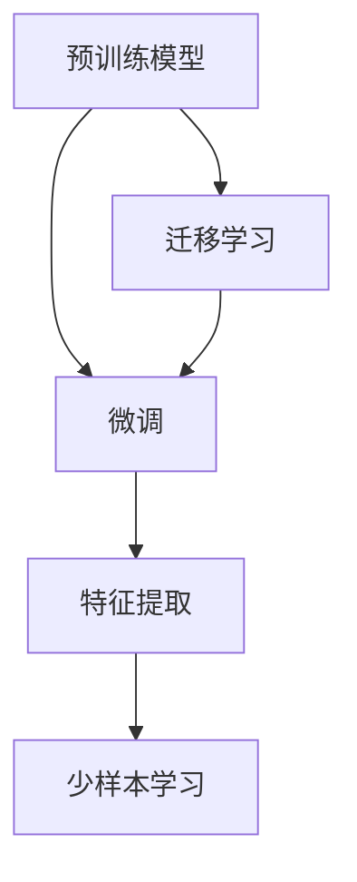

                 

# 迁移学习：如何利用预训练模型提高效率

> 关键词：迁移学习, 预训练模型, 特征提取, 少样本学习, 知识迁移, 模型微调, 自监督学习

## 1. 背景介绍

### 1.1 问题由来
近年来，人工智能（AI）技术在深度学习（DL）的推动下取得了飞速进展。其中，深度神经网络（DNN）因其卓越的表达能力和泛化能力，在计算机视觉、自然语言处理（NLP）、语音识别等领域取得了突破性的成果。然而，深度学习模型往往需要海量的标注数据进行训练，对数据需求量极大，这在大规模数据难以获取或标注成本极高的场景下，显然不现实。

预训练模型（Pre-trained Models）的出现，为深度学习模型在数据稀缺的领域中应用提供了新的解决方案。预训练模型通常在大规模无标签数据上进行自监督学习，学习到丰富的领域知识，然后再通过微调（Fine-tuning）以适应特定任务，从而在数据量有限的情况下，也能取得不错的表现。

迁移学习（Transfer Learning）作为预训练-微调（Pre-training-Fine-tuning）的重要组成部分，旨在将领域外的通用知识迁移到特定的任务中，提升模型在新任务的性能。本文将深入探讨迁移学习的基本原理和操作步骤，分析其优缺点，并结合实际应用场景，提供详细的代码实例和操作指南，帮助开发者在特定任务上高效利用预训练模型。

### 1.2 问题核心关键点
预训练模型和迁移学习在AI模型训练和应用中扮演着关键角色，其核心在于：
- 通过在大规模无标签数据上自监督学习，模型能够自动发现和提取通用特征，降低数据标注成本。
- 在特定任务上微调，能够将预训练模型学到的知识应用于新任务，提升模型在新任务上的表现。
- 迁移学习通过知识迁移，使模型在不同领域间共享知识，提高模型的泛化能力。

本文将聚焦于迁移学习的核心概念和操作步骤，通过丰富的案例分析和代码实践，帮助读者全面掌握迁移学习的原理和应用方法。

## 2. 核心概念与联系

### 2.1 核心概念概述

为更好地理解迁移学习，我们首先介绍几个关键概念：

- **预训练模型**：在大规模无标签数据上自监督学习，学习到领域知识的模型。
- **微调**：在预训练模型的基础上，通过有监督学习优化模型在特定任务上的性能。
- **迁移学习**：将领域外的通用知识迁移到特定任务中，提升模型在新任务上的表现。
- **特征提取**：利用预训练模型提取输入数据的关键特征，降低模型对数据的依赖。
- **少样本学习**：在数据量非常有限的情况下，通过迁移学习提升模型性能。

这些概念之间存在紧密的联系，通过预训练模型提取通用特征，再通过微调将这些特征应用于特定任务，从而实现迁移学习。以下Mermaid流程图展示了这些概念之间的逻辑关系：



通过这个流程图，我们可以看出迁移学习的基本流程：预训练模型学习通用特征，微调模型将这些特征应用于特定任务，从而实现知识迁移和少样本学习。

## 3. 核心算法原理 & 具体操作步骤

### 3.1 算法原理概述
迁移学习的基本原理是通过在预训练模型上提取通用特征，然后在特定任务上进行微调，以利用预训练模型学习到的知识。迁移学习可以分为两类：
- **特征提取**：利用预训练模型提取特征，然后用这些特征在新任务上进行有监督学习。
- **模型微调**：在预训练模型的基础上进行微调，适应特定任务。

这两种方法的关键在于如何选择合适的预训练模型和任务适配层，以及如何设计有效的优化策略，以提高模型的泛化能力和性能。

### 3.2 算法步骤详解

迁移学习的步骤通常包括以下几个关键环节：

**Step 1: 准备预训练模型和数据集**
- 选择合适的预训练模型，如VGG、ResNet、BERT等。
- 准备新任务的标注数据集，划分为训练集、验证集和测试集。

**Step 2: 添加任务适配层**
- 根据新任务类型，在预训练模型顶层设计合适的输出层和损失函数。
- 对于分类任务，通常在顶层添加线性分类器和交叉熵损失函数。
- 对于生成任务，通常使用语言模型的解码器输出概率分布，并以负对数似然为损失函数。

**Step 3: 设置微调超参数**
- 选择合适的优化算法及其参数，如Adam、SGD等，设置学习率、批大小、迭代轮数等。
- 设置正则化技术及强度，包括权重衰减、Dropout、Early Stopping等。
- 确定冻结预训练参数的策略，如仅微调顶层，或全部参数都参与微调。

**Step 4: 执行梯度训练**
- 将训练集数据分批次输入模型，前向传播计算损失函数。
- 反向传播计算参数梯度，根据设定的优化算法和学习率更新模型参数。
- 周期性在验证集上评估模型性能，根据性能指标决定是否触发Early Stopping。
- 重复上述步骤直到满足预设的迭代轮数或Early Stopping条件。

**Step 5: 测试和部署**
- 在测试集上评估微调后模型，对比微调前后的精度提升。
- 使用微调后的模型对新样本进行推理预测，集成到实际的应用系统中。
- 持续收集新的数据，定期重新微调模型，以适应数据分布的变化。

### 3.3 算法优缺点

迁移学习具有以下优点：
1. 有效降低数据标注成本。通过预训练模型提取通用特征，再在新任务上进行微调，可以大大减少对标注数据的需求。
2. 提升模型泛化能力。预训练模型在大规模数据上学习到的通用特征，可以更好地泛化到新任务中。
3. 提高模型效率。利用预训练模型提取特征，可以显著减少模型的训练时间，提升模型效率。

但迁移学习也存在一定的局限性：
1. 对标注数据依赖。虽然降低了数据标注成本，但在特定任务上仍需一定数量的标注数据进行微调。
2. 过拟合风险。如果微调数据量不足，模型可能会过拟合训练集，泛化能力下降。
3. 模型复杂性。预训练模型和微调过程相对复杂，增加了模型训练和调试的难度。

尽管存在这些局限性，但迁移学习仍是当前深度学习应用的重要方法，能够显著提升模型的泛化能力和效率。

### 3.4 算法应用领域

迁移学习在多个领域中得到了广泛应用，如计算机视觉、自然语言处理、语音识别等。以下是几个典型的应用场景：

- **计算机视觉**：利用在大规模图像数据上预训练的VGG、ResNet等模型，在特定任务上进行微调，如目标检测、图像分类、语义分割等。
- **自然语言处理**：使用在大规模文本数据上预训练的BERT、GPT等模型，在特定NLP任务上进行微调，如文本分类、情感分析、命名实体识别等。
- **语音识别**：通过在大规模语音数据上预训练的模型，在特定语音识别任务上进行微调，提升识别准确率。
- **医疗诊断**：利用在大规模医疗数据上预训练的模型，在特定疾病诊断任务上进行微调，提升诊断精度。

除了这些经典任务外，迁移学习还在诸多新兴领域中得到应用，如自动驾驶、智能推荐、智能客服等，为AI技术在更广泛的场景中落地提供了有力支持。

## 4. 数学模型和公式 & 详细讲解

### 4.1 数学模型构建

预训练模型和迁移学习的数学模型构建通常包括以下步骤：

**Step 1: 准备预训练模型**
- 假设预训练模型为 $M_{\theta}$，其中 $\theta$ 为预训练得到的模型参数。

**Step 2: 定义新任务的目标函数**
- 假设新任务为分类任务，输入样本为 $x_i$，标签为 $y_i$，输出为 $M_{\theta}(x_i)$。
- 定义损失函数 $\mathcal{L}$，用于衡量模型预测输出与真实标签之间的差异。

**Step 3: 定义优化算法**
- 选择优化算法及其参数，如Adam、SGD等。
- 定义学习率 $\eta$，批大小 $b$，迭代轮数 $T$ 等超参数。

**Step 4: 微调过程**
- 对训练集数据 $D$ 进行迭代训练，更新模型参数。
- 在验证集上评估模型性能，选择最优参数。
- 在测试集上测试最终模型性能。

### 4.2 公式推导过程

以下以分类任务为例，推导迁移学习的数学公式。

假设预训练模型为 $M_{\theta}$，在新任务上进行微调，定义目标函数 $\mathcal{L}(y_i, M_{\theta}(x_i))$。

假设新任务的标注数据为 $D=\{(x_i, y_i)\}_{i=1}^N$，目标函数为交叉熵损失函数：

$$
\mathcal{L} = \frac{1}{N}\sum_{i=1}^N \mathcal{L}(y_i, M_{\theta}(x_i)) = \frac{1}{N}\sum_{i=1}^N -y_i\log M_{\theta}(x_i) - (1-y_i)\log (1-M_{\theta}(x_i))
$$

其中 $y_i$ 为样本的标签，$M_{\theta}(x_i)$ 为模型预测的输出。

梯度下降算法用于最小化损失函数，更新模型参数 $\theta$：

$$
\theta \leftarrow \theta - \eta \nabla_{\theta}\mathcal{L}
$$

其中 $\nabla_{\theta}\mathcal{L}$ 为损失函数对模型参数的梯度，通过反向传播算法计算。

通过迭代训练，最终得到微调后的模型 $M_{\hat{\theta}}$，在测试集上评估性能：

$$
\mathcal{L}_{test} = \frac{1}{N_{test}}\sum_{i=1}^{N_{test}} \mathcal{L}(y_i, M_{\hat{\theta}}(x_i))
$$

### 4.3 案例分析与讲解

以图像分类任务为例，展示迁移学习的基本流程和数学公式。

假设使用在大规模图像数据上预训练的VGG模型，在新任务上进行微调。

**Step 1: 准备预训练模型和数据集**
- 选择VGG模型作为预训练模型。
- 准备新任务的图像数据集，划分为训练集、验证集和测试集。

**Step 2: 添加任务适配层**
- 在VGG模型顶层添加线性分类器，输出类别概率。
- 定义交叉熵损失函数作为目标函数。

**Step 3: 设置微调超参数**
- 选择Adam优化器，设置学习率为0.001，批大小为32。
- 冻结VGG模型的卷积层，仅微调线性分类器。

**Step 4: 执行梯度训练**
- 使用训练集数据进行迭代训练，每轮更新模型参数。
- 在验证集上评估模型性能，选择最优模型。
- 在测试集上测试最终模型性能。

**Step 5: 测试和部署**
- 使用微调后的模型进行图像分类预测。
- 集成到实际应用系统中。

## 5. 项目实践：代码实例和详细解释说明

### 5.1 开发环境搭建

在进行迁移学习实践前，我们需要准备好开发环境。以下是使用Python进行TensorFlow开发的环境配置流程：

1. 安装Anaconda：从官网下载并安装Anaconda，用于创建独立的Python环境。

2. 创建并激活虚拟环境：
```bash
conda create -n tf-env python=3.8 
conda activate tf-env
```

3. 安装TensorFlow：根据CUDA版本，从官网获取对应的安装命令。例如：
```bash
conda install tensorflow tensorflow-gpu -c conda-forge
```

4. 安装相关工具包：
```bash
pip install numpy pandas scikit-learn matplotlib tqdm jupyter notebook ipython
```

完成上述步骤后，即可在`tf-env`环境中开始迁移学习实践。

### 5.2 源代码详细实现

这里我们以迁移学习图像分类任务为例，给出使用TensorFlow和Keras进行迁移学习的PyTorch代码实现。

首先，定义迁移学习的数据处理函数：

```python
import tensorflow as tf
from tensorflow.keras.preprocessing.image import ImageDataGenerator
from tensorflow.keras.applications import VGG16

def load_data():
    train_dir = '/path/to/train/data'
    val_dir = '/path/to/val/data'
    test_dir = '/path/to/test/data'
    
    train_datagen = ImageDataGenerator(rescale=1./255, shear_range=0.2, zoom_range=0.2, horizontal_flip=True)
    val_datagen = ImageDataGenerator(rescale=1./255)
    test_datagen = ImageDataGenerator(rescale=1./255)

    train_generator = train_datagen.flow_from_directory(train_dir, target_size=(224, 224), batch_size=32, class_mode='categorical')
    val_generator = val_datagen.flow_from_directory(val_dir, target_size=(224, 224), batch_size=32, class_mode='categorical')
    test_generator = test_datagen.flow_from_directory(test_dir, target_size=(224, 224), batch_size=32, class_mode='categorical')

    return train_generator, val_generator, test_generator

# 加载数据
train_generator, val_generator, test_generator = load_data()
```

然后，定义迁移学习模型：

```python
from tensorflow.keras.models import Model
from tensorflow.keras.layers import Dense, GlobalAveragePooling2D
from tensorflow.keras.applications import VGG16

def build_model(input_shape):
    base_model = VGG16(weights='imagenet', include_top=False, input_shape=input_shape)
    for layer in base_model.layers:
        layer.trainable = False

    x = base_model.output
    x = GlobalAveragePooling2D()(x)
    x = Dense(256, activation='relu')(x)
    predictions = Dense(num_classes, activation='softmax')(x)

    model = Model(inputs=base_model.input, outputs=predictions)

    return model

# 构建模型
model = build_model(input_shape=(224, 224, 3))
```

接着，定义迁移学习过程：

```python
from tensorflow.keras.optimizers import Adam
from tensorflow.keras.metrics import Accuracy

# 定义模型和优化器
model.compile(optimizer=Adam(lr=0.001), loss='categorical_crossentropy', metrics=[Accuracy()])

# 训练过程
epochs = 10
batch_size = 32

model.fit(train_generator, validation_data=val_generator, epochs=epochs, batch_size=batch_size)

# 测试过程
test_loss, test_acc = model.evaluate(test_generator)
print('Test Accuracy:', test_acc)
```

以上就是使用TensorFlow和Keras进行迁移学习图像分类任务的基本代码实现。可以看到，通过TensorFlow和Keras，迁移学习的实现变得非常简单高效。

### 5.3 代码解读与分析

让我们再详细解读一下关键代码的实现细节：

**load_data函数**：
- 定义了数据加载函数，将训练集、验证集和测试集转化为ImageDataGenerator对象。
- 对训练集进行数据增强，包括随机剪切、缩放、水平翻转等，增加数据多样性。

**build_model函数**：
- 定义了迁移学习模型结构，基于VGG16模型，添加全局平均池化层、全连接层和softmax输出层。
- 通过设置层级的`trainable`属性，将预训练模型的卷积层冻结，只训练新添加的分类器。

**模型训练过程**：
- 定义优化器、损失函数和评估指标，构建模型。
- 使用训练集数据进行迭代训练，每轮更新模型参数。
- 在验证集上评估模型性能，选择最优模型。
- 在测试集上测试最终模型性能。

**测试过程**：
- 使用测试集数据评估模型性能。

通过上述代码，我们可以看到迁移学习的基本流程和实现方法。利用预训练模型提取特征，在特定任务上进行微调，可以在数据量有限的情况下，显著提升模型性能。

## 6. 实际应用场景

### 6.1 智能推荐系统

智能推荐系统是迁移学习的重要应用场景之一。通过预训练模型提取用户行为数据的关键特征，再在新任务上进行微调，推荐系统可以更好地理解用户兴趣和行为，提高推荐准确率。

在实践中，可以收集用户浏览、点击、评分等行为数据，提取和用户交互的物品特征。利用预训练模型提取特征，再在新任务上进行微调，训练推荐模型，预测用户对新物品的兴趣，从而提供个性化推荐。

### 6.2 医疗影像诊断

医疗影像诊断任务通常需要处理海量的医学影像数据，标注成本极高。通过迁移学习，利用在大规模医学影像数据上预训练的模型，在新任务上进行微调，可以显著降低标注成本，提升诊断精度。

在实践中，可以收集医疗影像数据和标注信息，利用预训练模型提取特征，再在新任务上进行微调，训练医疗影像诊断模型，自动识别疾病图像，提高诊断效率和准确率。

### 6.3 自然语言处理

自然语言处理（NLP）任务如文本分类、情感分析、命名实体识别等，通常需要大量标注数据进行训练。通过迁移学习，利用在大规模文本数据上预训练的模型，在新任务上进行微调，可以显著减少标注数据需求，提高模型性能。

在实践中，可以收集标注数据集，利用预训练模型提取特征，再在新任务上进行微调，训练NLP模型，实现文本分类、情感分析、命名实体识别等任务。

### 6.4 未来应用展望

随着预训练模型的不断进步和迁移学习技术的不断发展，迁移学习将在更多领域得到应用，为AI技术带来新的突破。

在智慧医疗领域，迁移学习可应用于医疗影像诊断、疾病预测、药物研发等任务，提升医疗服务的智能化水平，辅助医生诊疗，加速新药开发进程。

在智能教育领域，迁移学习可应用于作业批改、学情分析、知识推荐等方面，因材施教，促进教育公平，提高教学质量。

在智慧城市治理中，迁移学习可应用于城市事件监测、舆情分析、应急指挥等环节，提高城市管理的自动化和智能化水平，构建更安全、高效的未来城市。

此外，在企业生产、社会治理、文娱传媒等众多领域，迁移学习也将不断涌现，为传统行业数字化转型升级提供新的技术路径。

## 7. 工具和资源推荐

### 7.1 学习资源推荐

为了帮助开发者系统掌握迁移学习的理论基础和实践技巧，这里推荐一些优质的学习资源：

1. 《深度学习》书籍：Ian Goodfellow等著作，详细介绍了深度学习的基本概念和算法原理，是深度学习领域的经典教材。
2. CS231n《深度学习计算机视觉》课程：斯坦福大学开设的深度学习计算机视觉课程，系统讲解计算机视觉的基本理论和算法。
3. CS224n《深度学习自然语言处理》课程：斯坦福大学开设的深度学习自然语言处理课程，涵盖自然语言处理的基本理论和算法。
4. 《迁移学习》书籍：Andrew Ng等著作，详细介绍了迁移学习的基本概念、算法原理和应用案例。
5. Weights & Biases：模型训练的实验跟踪工具，可以记录和可视化模型训练过程中的各项指标，方便对比和调优。

通过对这些资源的学习实践，相信你一定能够快速掌握迁移学习的精髓，并用于解决实际的AI问题。

### 7.2 开发工具推荐

高效的开发离不开优秀的工具支持。以下是几款用于迁移学习开发的常用工具：

1. TensorFlow：由Google主导开发的深度学习框架，生产部署方便，适合大规模工程应用。
2. Keras：基于TensorFlow的高级API，易于上手，适合快速迭代研究。
3. PyTorch：基于Python的开源深度学习框架，灵活动态的计算图，适合快速迭代研究。
4. PyImageSearch：计算机视觉领域的优秀博客，提供丰富的深度学习资源和代码实现。
5. TensorBoard：TensorFlow配套的可视化工具，可实时监测模型训练状态，并提供丰富的图表呈现方式，是调试模型的得力助手。

合理利用这些工具，可以显著提升迁移学习任务的开发效率，加快创新迭代的步伐。

### 7.3 相关论文推荐

迁移学习作为预训练模型和微调的重要组成部分，其研究领域已经覆盖了诸多前沿方向。以下是几篇奠基性的相关论文，推荐阅读：

1. AlexNet: ImageNet Classification with Deep Convolutional Neural Networks：提出了卷积神经网络（CNN）结构，开创了深度学习在计算机视觉领域的应用。
2. VGGNet: Very Deep Convolutional Networks for Large-Scale Image Recognition：提出了VGG网络结构，深度学习在图像分类任务上的突破。
3. ResNet: Deep Residual Learning for Image Recognition：提出了残差网络结构，解决了深度网络中的梯度消失问题，提高了深度学习的训练效率和效果。
4. InceptionNet: Going Deeper with Convolutions：提出了Inception网络结构，提升了深度神经网络的多样性和表达能力。
5. Transfer Learning：通过在大规模数据上预训练模型，在特定任务上进行微调，显著提升模型性能。
6. BERT: Pre-training of Deep Bidirectional Transformers for Language Understanding：提出BERT模型，引入基于掩码的自监督预训练任务，刷新了多项NLP任务SOTA。

这些论文代表了大规模迁移学习的研究脉络，通过学习这些前沿成果，可以帮助研究者把握学科前进方向，激发更多的创新灵感。

## 8. 总结：未来发展趋势与挑战

### 8.1 总结

本文对迁移学习的基本原理和操作步骤进行了全面系统的介绍。首先阐述了迁移学习在深度学习模型训练和应用中的重要地位，明确了迁移学习在降低数据标注成本、提升模型泛化能力等方面的独特价值。其次，从原理到实践，详细讲解了迁移学习的数学模型和关键步骤，给出了迁移学习任务开发的完整代码实例。同时，本文还广泛探讨了迁移学习在智能推荐、医疗诊断、自然语言处理等多个行业领域的应用前景，展示了迁移学习范式的巨大潜力。此外，本文精选了迁移学习的各类学习资源，力求为读者提供全方位的技术指引。

通过本文的系统梳理，可以看到，迁移学习作为一种高效的模型训练方法，正在深度学习领域发挥重要作用，显著降低了模型训练的难度和成本，提升了模型的泛化能力和性能。未来，伴随迁移学习技术的不断演进，相信AI技术将在更多领域得到广泛应用，为经济社会发展带来新的动力。

### 8.2 未来发展趋势

展望未来，迁移学习技术将呈现以下几个发展趋势：

1. 模型规模持续增大。随着算力成本的下降和数据规模的扩张，预训练模型和迁移学习模型的参数量还将持续增长。超大模型蕴含的丰富知识，将为迁移学习提供更强大的基础。
2. 迁移学习方法日趋多样。除了传统的迁移学习方法，未来会涌现更多参数高效和计算高效的迁移学习方法，如LoRA、Prompt-based Learning等，提高迁移学习的效率和灵活性。
3. 少样本学习成为常态。未来的迁移学习模型将更好地利用大模型的语言理解能力，通过更巧妙的任务描述，在更少的标注样本上也能实现理想的迁移效果。
4. 跨领域迁移能力提升。未来的迁移学习模型将具备更强的跨领域迁移能力，能够在不同领域之间进行知识迁移，提升模型的泛化性和通用性。
5. 自监督学习与迁移学习结合。未来的迁移学习将更多地结合自监督学习，通过无监督学习方法提取特征，再在新任务上进行微调，进一步降低迁移学习对标注数据的依赖。

这些趋势凸显了迁移学习技术的广阔前景。这些方向的探索发展，必将进一步提升AI模型的泛化能力和效率，推动AI技术在更广泛的领域中落地应用。

### 8.3 面临的挑战

尽管迁移学习技术已经取得了显著成果，但在迈向更加智能化、普适化应用的过程中，它仍面临诸多挑战：

1. 数据标注成本。尽管迁移学习降低了数据标注需求，但在特定任务上仍需一定数量的标注数据进行微调，标注成本仍然是一个瓶颈。如何进一步降低迁移学习对标注数据的依赖，将是未来的重要研究方向。
2. 模型泛化能力。迁移学习模型在不同领域和任务上的泛化能力仍需进一步提升，以应对数据分布的变化和新任务的挑战。
3. 模型鲁棒性。迁移学习模型面对新任务和新数据时，泛化能力可能下降，鲁棒性不足。如何提高迁移学习模型的鲁棒性，避免过拟合和灾难性遗忘，是未来的研究重点。
4. 模型复杂性。迁移学习模型的设计和实现相对复杂，增加了模型训练和调试的难度。如何简化模型结构和优化训练过程，提高迁移学习的效率和效果，是未来的重要课题。
5. 数据隐私和安全。迁移学习模型涉及大量敏感数据，如何保护数据隐私和安全，避免数据泄露和滥用，是未来的重要研究方向。

尽管存在这些挑战，但通过不断的技术创新和实践探索，迁移学习技术将在未来的深度学习应用中发挥重要作用，推动AI技术向更广阔的领域迈进。

### 8.4 研究展望

面向未来，迁移学习技术需要在以下几个方面寻求新的突破：

1. 探索更高效的自监督学习算法。通过无监督学习方法提取特征，再在新任务上进行微调，进一步降低迁移学习对标注数据的依赖。
2. 研究更灵活的迁移学习策略。开发更加参数高效和计算高效的迁移学习策略，提高迁移学习的效率和灵活性。
3. 融合更多先验知识。将符号化的先验知识与神经网络模型进行融合，引导迁移学习过程学习更准确、合理的特征表示。
4. 研究更鲁棒的迁移学习模型。提高迁移学习模型在不同领域和任务上的泛化能力和鲁棒性，避免过拟合和灾难性遗忘。
5. 结合因果分析和博弈论工具。通过因果分析和博弈论工具，增强迁移学习模型的决策能力和稳定性，提高系统的可靠性。

这些研究方向的探索，必将引领迁移学习技术迈向更高的台阶，为构建安全、可靠、可解释、可控的智能系统铺平道路。面向未来，迁移学习技术还需要与其他人工智能技术进行更深入的融合，如知识表示、因果推理、强化学习等，多路径协同发力，共同推动人工智能技术的发展。

## 9. 附录：常见问题与解答

**Q1：什么是迁移学习？**

A: 迁移学习是指将领域外的通用知识迁移到特定任务中，以提升模型在新任务上的表现。预训练模型是迁移学习的重要组成部分，通过在大规模无标签数据上自监督学习，学习到通用的领域知识，再在新任务上进行微调，以利用预训练模型学习到的知识。

**Q2：迁移学习和微调有什么区别？**

A: 迁移学习和微调是深度学习模型的两个重要概念，有紧密的联系。微调是在预训练模型上提取特征，在新任务上进行有监督学习，以提升模型在新任务上的性能。而迁移学习则是一个更广泛的概念，通过知识迁移，使模型在不同领域之间共享知识，提高模型的泛化能力。

**Q3：迁移学习的主要应用场景有哪些？**

A: 迁移学习在计算机视觉、自然语言处理、语音识别等多个领域中得到了广泛应用。如在图像分类、目标检测、文本分类、情感分析、命名实体识别等任务中，通过迁移学习，利用预训练模型提取特征，再在新任务上进行微调，提升模型性能。

**Q4：如何进行迁移学习的模型训练？**

A: 迁移学习的模型训练通常包括以下步骤：
1. 准备预训练模型和数据集。
2. 添加任务适配层，定义目标函数。
3. 设置微调超参数，选择优化算法。
4. 执行梯度训练，周期性评估模型性能。
5. 测试和部署，评估模型在新任务上的表现。

通过以上步骤，可以高效地进行迁移学习模型的训练和优化，提升模型在新任务上的性能。

**Q5：迁移学习的未来发展趋势有哪些？**

A: 迁移学习的未来发展趋势包括：
1. 模型规模持续增大，预训练模型和迁移学习模型的参数量还将持续增长。
2. 迁移学习方法日趋多样，将涌现更多参数高效和计算高效的迁移学习方法。
3. 少样本学习成为常态，未来的迁移学习模型将更好地利用大模型的语言理解能力，在更少的标注样本上也能实现理想的迁移效果。
4. 跨领域迁移能力提升，未来的迁移学习模型将具备更强的跨领域迁移能力，能够在不同领域之间进行知识迁移。
5. 自监督学习与迁移学习结合，通过无监督学习方法提取特征，再在新任务上进行微调，进一步降低迁移学习对标注数据的依赖。

这些趋势凸显了迁移学习技术的广阔前景，未来将进一步提升AI模型的泛化能力和效率，推动AI技术在更广泛的领域中落地应用。

---

作者：禅与计算机程序设计艺术 / Zen and the Art of Computer Programming

