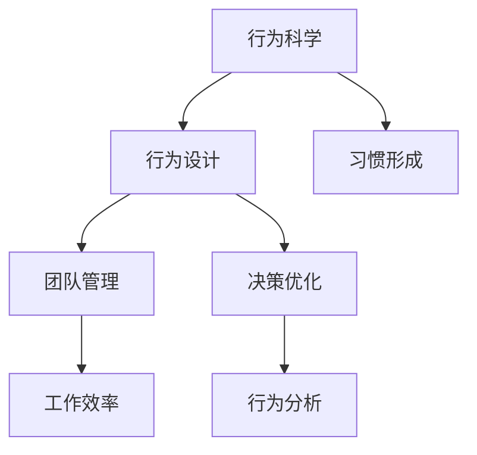

                 

# 运用福格模型培养团队良习惯

> 关键词：行为科学, 行为设计, 习惯形成, 团队管理, 工作效率, 决策优化, 行为分析

## 1. 背景介绍

### 1.1 问题由来
在现代科技发展的大背景下，越来越多的企业意识到，技术只是手段，人的价值才是最重要的。如何培养团队高效、健康的工作习惯，从而提升整体工作效率和产出，是每一个管理者必须面对的问题。

特别是近年来，远程办公的普及和跨部门协作的增多，对团队的协同、沟通、知识共享等能力提出了更高的要求。但同时，由于地理位置、文化背景、工作节奏等多方面的差异，团队管理也面临着更大的挑战。

本文将介绍一种基于行为科学的模型，福格模型（Fogg's Model），并结合具体案例，讲解如何在团队中运用这一模型，培养出高效、协作的良习惯，从而提升整个团队的战斗力。

### 1.2 问题核心关键点
福格模型由斯坦福大学的心理学家B.J.福格教授提出，旨在解决“为什么人们不愿意做出改变”这一经典问题。其核心思想是：改变习惯的难度可以用三要素（Cue、Action、Reward）来描述，只要能够合理设计这三个要素，人们自然就会产生行为改变。

具体来说，通过设计合适的“提示（Cue）”、“行动（Action）”和“奖励（Reward）”，可以帮助团队成员建立和保持高效的工作习惯，提升团队的工作效率和产出。

## 2. 核心概念与联系

### 2.1 核心概念概述

为更好地理解福格模型的应用，本节将介绍几个密切相关的核心概念：

- 行为科学（Behavioral Science）：研究人们行为背后的心理机制，通过改变行为环境来影响行为。
- 行为设计（Behavioral Design）：利用行为科学理论，有针对性地设计行为改变方案。
- 习惯形成（Habit Formation）：通过设计合理的行为，培养人们长期坚持的行为模式。
- 团队管理（Team Management）：在团队层面上，通过行为设计提升团队协作、沟通和知识共享。
- 工作效率（Work Efficiency）：通过行为设计优化工作流程，提升团队产出。
- 决策优化（Decision Optimization）：通过行为设计，优化团队决策过程，减少决策偏差。
- 行为分析（Behavior Analysis）：通过分析行为数据，评估行为改变方案的效果，并进一步优化。

这些概念之间的逻辑关系可以通过以下Mermaid流程图来展示：



这个流程图展示了一系列概念之间的联系：

1. 行为科学提供了理论基础，通过了解人的行为心理，为行为设计提供指导。
2. 行为设计利用行为科学理论，具体设计出行为改变方案。
3. 习惯形成通过设计合理的行为，培养人们的长期行为模式。
4. 团队管理通过行为设计，提升团队的协作和沟通能力。
5. 工作效率通过行为设计优化工作流程，提升团队产出。
6. 决策优化通过行为设计，优化团队决策过程，减少决策偏差。
7. 行为分析通过分析行为数据，评估行为改变方案的效果，并进一步优化。

这些概念共同构成了福格模型应用的系统框架，帮助管理者在团队中设计出高效、健康的行为模式。

## 3. 核心算法原理 & 具体操作步骤
### 3.1 算法原理概述

福格模型的核心思想是，行为可以通过三个要素（Cue、Action、Reward）进行设计，具体过程如下：

- **提示（Cue）**：触发行为的信号，可以通过视觉、听觉、触觉等多种方式设计，例如：设置闹钟提醒、放置待办事项清单等。
- **行动（Action）**：需要执行的具体行为，需要设计成尽可能简单、明确的动作，例如：打开应用、填写邮件、提交代码等。
- **奖励（Reward）**：完成任务后的即时反馈，可以是正面的情感反馈（如成就感、满足感），也可以是负面的反馈（如惩罚、责任）。

通过合理设计这三个要素，可以有效地触发和维持行为，从而改变人们的习惯，提升工作效率。

### 3.2 算法步骤详解

以下是基于福格模型的团队习惯培养步骤：

**Step 1: 行为诊断**

- 评估现有工作习惯：通过问卷调查、面谈等方式，了解团队成员的工作习惯、痛点和挑战。
- 识别关键行为点：找出对团队绩效影响最大的行为，如代码提交频率、会议参与度、项目进度跟踪等。
- 确定行为改变目标：基于现有习惯和目标绩效，制定具体、可量化的行为改变目标，如每日代码提交量、每周会议次数、项目进度汇报频率等。

**Step 2: 设计行为触发器**

- 设计可见的、触手可及的提示（Cue）：例如在会议室的墙上贴出任务清单、在电脑桌面上放置待办事项提醒等。
- 设计简单明确、低成本的行动（Action）：例如设置自动提醒、利用快捷键快速执行任务等。
- 设计正面的、即时可感知的奖励（Reward）：例如完成代码提交后，立即得到同事的认可和表扬，或在完成某个项目后，给予小奖励或公共表彰。

**Step 3: 持续监测与优化**

- 实时监控行为数据：利用行为分析工具（如Gartner、Trello、Slack等），实时监控团队成员的行为，评估行为改变的执行情况。
- 定期评估与反馈：定期召开评估会议，收集团队成员的反馈，分析行为改变的效果，并根据反馈进行优化。
- 动态调整策略：根据评估结果，调整行为触发器，不断优化行为设计，确保团队成员能够长期坚持行为改变。

### 3.3 算法优缺点

福格模型的优点包括：

- 系统性：通过系统的行为设计，全面提升团队效率和产出。
- 可视化：行为触发器的设计可以通过视觉手段直观展示，便于团队成员理解和执行。
- 可量化：行为改变目标和执行效果可以通过数据进行评估和优化。

同时，该模型也存在一些局限性：

- 复杂性：对于复杂的行为改变，需要深入分析和设计，难度较大。
- 依赖环境：行为触发器需要根据团队实际情况设计，不适用于所有团队和场景。
- 依赖执行者：行为改变需要团队成员积极参与，若执行者缺乏动机或能力，难以有效执行。

尽管存在这些局限性，福格模型仍然是团队习惯培养的一种高效、系统的方法，适用于大多数团队和场景。

### 3.4 算法应用领域

福格模型在多个领域中都得到了广泛应用，例如：

- 项目管理：设计任务清单、自动提醒等，帮助团队成员按时完成任务。
- 团队协作：通过可视化的看板、即时反馈等方式，提升团队沟通和协作效率。
- 知识管理：设计知识库、工作文档共享等，促进团队知识共享和积累。
- 员工培训：通过行为设计，引导新员工快速融入团队，掌握工作流程。
- 工作部署：设计部署清单、自动测试等，帮助团队快速部署新功能，减少错误。
- 个人效率：帮助团队成员设计个人工作习惯，提升个人工作效率和产出。

除了这些领域外，福格模型还被创新性地应用到更多场景中，如可控习惯培养、自我激励机制、文化塑造等，为团队管理带来了全新的思路。

## 4. 数学模型和公式 & 详细讲解 & 举例说明

### 4.1 数学模型构建

福格模型虽然是行为科学范式，但并不涉及复杂的数学模型。其核心思想是通过行为设计的三个要素（Cue、Action、Reward）来触发和维持行为，提升工作效率。

### 4.2 公式推导过程

由于福格模型不涉及复杂的数学推导，我们直接结合具体案例，讲解如何设计行为触发器。

**案例分析：每日代码提交**

- **提示（Cue）**：每天早上9点，打开GitHub项目页面。
- **行动（Action）**：点击“提交代码”按钮，将代码提交到远程仓库。
- **奖励（Reward）**：完成提交后，立即在Slack频道获得同事的认可和表扬。

通过这一设计，能够有效地触发和维持每日代码提交的习惯，提升代码质量和项目进度。

### 4.3 案例分析与讲解

**案例分析：每周会议**

- **提示（Cue）**：每周一早上9点，收到会议提醒邮件。
- **行动（Action）**：打开Zoom会议软件，进入指定会议室。
- **奖励（Reward）**：完成会议后，领取小礼品或咖啡券作为奖励。

这一设计能够确保团队成员按时参与每周的会议，促进知识共享和团队协作。

## 5. 项目实践：代码实例和详细解释说明

### 5.1 开发环境搭建

在福格模型的实践中，我们不需要编写代码，而是通过行为设计来优化团队行为。但为了展示如何结合工具进行行为分析，这里我们提供一个简化的行为分析工具搭建流程。

**Step 1: 安装工具**

- **Gartner**：安装Gartner行为分析工具，使用Trello、Slack等接口，实时监控团队行为。
- **Excel**：安装Excel，用于统计和分析行为数据。

**Step 2: 设计行为触发器**

- **提示（Cue）**：设计可见的、触手可及的提示，例如在会议室的墙上贴出任务清单、在电脑桌面上放置待办事项提醒等。
- **行动（Action）**：设计简单明确、低成本的行动，例如设置自动提醒、利用快捷键快速执行任务等。
- **奖励（Reward）**：设计正面的、即时可感知的奖励，例如完成代码提交后，立即得到同事的认可和表扬，或在完成某个项目后，给予小奖励或公共表彰。

**Step 3: 持续监测与优化**

- **实时监控**：利用Gartner行为分析工具，实时监控团队成员的行为，评估行为改变的执行情况。
- **定期评估**：定期召开评估会议，收集团队成员的反馈，分析行为改变的效果，并根据反馈进行优化。
- **动态调整**：根据评估结果，调整行为触发器，不断优化行为设计，确保团队成员能够长期坚持行为改变。

### 5.2 源代码详细实现

虽然福格模型不涉及复杂的代码实现，但为了展示如何使用工具进行行为分析，这里提供一个简单的Python代码示例，使用Trello API实时监控任务状态：

```python
import trello
import time

# 初始化Trello API
api_key = 'your_api_key'
trello_api = trello.Trello(api_key=api_key)

# 获取任务列表
list_id = 'your_list_id'
list = trello_api.get('lists/' + list_id)

# 循环检查任务状态
while True:
    # 获取任务列表中的任务
    cards = trello_api.get('lists/' + list_id + '/cards')

    # 统计未完成的任务数
    uncompleted_cards = sum(1 for card in cards if card['state'] == 'open')

    # 输出未完成的任务数
    print('Uncompleted cards:', uncompleted_cards)

    # 等待一段时间，再次检查
    time.sleep(60)
```

### 5.3 代码解读与分析

这段代码使用了Trello的Python API，实时监控指定任务列表中的任务状态，并统计未完成的任务数。通过这一简单的示例，展示了如何利用工具进行行为数据的实时采集和分析。

在实际应用中，可以结合更多工具和数据来源，设计更加复杂和全面的行为触发器，如使用GitHub API监控代码提交情况，使用Slack API获取即时反馈等。

### 5.4 运行结果展示

运行上述代码，可以在控制台实时输出未完成的任务数。根据这些数据，管理者可以及时调整行为触发器，确保团队成员按时完成任务。

例如，如果每天未完成的任务数较多，说明提示（Cue）不够明显或行动（Action）过于复杂，需要进一步优化。如果一周未完成的任务数较多，说明奖励（Reward）吸引力不足，需要增加正面的反馈和激励。

## 6. 实际应用场景

### 6.1 项目管理

在项目管理中，福格模型可以帮助团队设计任务清单、自动提醒等，提升项目管理效率。例如：

**案例分析：项目进度跟踪**

- **提示（Cue）**：每天早上9点，打开项目管理工具（如Trello），查看今日待办事项。
- **行动（Action）**：在任务卡片中填写任务进展，上传相关文件。
- **奖励（Reward）**：每日任务完成时，在Slack频道获得团队认可和表扬。

这一设计能够确保团队成员按时完成任务，实时更新项目进度，提升项目管理和协作效率。

### 6.2 团队协作

在团队协作中，福格模型可以通过可视化的看板、即时反馈等方式，提升团队沟通和协作效率。例如：

**案例分析：即时反馈**

- **提示（Cue）**：每次完成代码提交后，立即收到提示邮件。
- **行动（Action）**：打开邮件，查看同事的反馈和建议。
- **奖励（Reward）**：收到积极的反馈后，获得额外的休息时间或奖励。

这一设计能够确保团队成员及时沟通和反馈，提升协作效率，减少沟通成本。

### 6.3 知识管理

在知识管理中，福格模型可以帮助团队设计知识库、工作文档共享等，促进团队知识共享和积累。例如：

**案例分析：知识库管理**

- **提示（Cue）**：每次完成项目报告时，立即将报告上传到知识库。
- **行动（Action）**：点击上传按钮，选择本地文件并完成上传。
- **奖励（Reward）**：上传完成后，获得团队认可和奖励。

这一设计能够确保团队成员及时共享知识，促进团队知识和经验的积累和传承。

### 6.4 未来应用展望

福格模型作为一种行为设计工具，其应用场景和效果将会越来越广泛。未来，随着技术的发展和工具的创新，福格模型将会有更多新的应用方向：

- 智能提醒：利用AI技术，自动根据任务优先级和时间段设计合理的提示（Cue）。
- 个性化激励：根据团队成员的工作习惯和偏好，设计个性化的奖励（Reward），提高激励效果。
- 实时分析：利用大数据分析技术，实时评估行为改变的效果，并进行优化。
- 跨团队协作：在多团队协作中，设计统一的、跨团队的奖励（Reward）和提示（Cue），提升协作效率。
- 混合办公：在混合办公模式下，设计合理的远程办公和现场办公提示（Cue），确保团队成员高效协作。
- 自动化执行：利用机器人和自动化工具，自动执行行为设计方案，提升执行效率。

总之，福格模型作为一种行为设计工具，将在未来的团队管理和协作中发挥越来越重要的作用，带来更多创新和突破。

## 7. 工具和资源推荐

### 7.1 学习资源推荐

为了帮助团队管理者系统掌握福格模型的应用，这里推荐一些优质的学习资源：

1. **《行为设计》书籍**：行为设计领域的经典著作，详细介绍了福格模型的原理和应用方法。
2. **Gartner行为分析工具**：提供全面的行为数据分析和可视化工具，帮助管理者实时监控团队行为。
3. **行为设计课程**：斯坦福大学和Coursera等在线平台提供的课程，帮助管理者系统学习行为科学和设计方法。
4. **行为设计咨询**：咨询公司提供的专业咨询服务，帮助团队设计行为改变方案。
5. **行为设计工具包**：包含行为设计模板和工具，帮助管理者快速设计和优化行为触发器。

通过对这些资源的学习实践，相信管理者能够更好地掌握福格模型的应用方法，提升团队的工作效率和产出。

### 7.2 开发工具推荐

在福格模型的实践中，我们不需要编写复杂的代码，但可以通过一些工具来辅助设计和优化行为触发器。以下是几款推荐的工具：

1. **Trello**：任务管理工具，支持看板式任务管理，便于设计任务清单和自动提醒。
2. **Slack**：即时通讯工具，支持多种协作和沟通方式，便于即时反馈和奖励。
3. **GitHub**：代码托管平台，支持自动提交和代码审查，便于代码管理。
4. **Gartner**：行为分析工具，提供实时监控和数据统计功能，便于评估行为改变效果。
5. **Excel**：数据分析工具，支持数据统计和可视化，便于分析和优化行为触发器。

合理利用这些工具，可以显著提升福格模型在团队中的应用效果，帮助管理者优化行为设计，提升团队绩效。

### 7.3 相关论文推荐

福格模型的应用和发展离不开行为科学领域的持续研究。以下是几篇奠基性的相关论文，推荐阅读：

1. **《行为科学导论》**：介绍了行为科学的理论基础和应用方法，为福格模型的应用提供指导。
2. **《行为设计的力量》**：介绍了行为设计的核心思想和应用案例，展示了行为设计在实际应用中的效果。
3. **《习惯的力量》**：介绍了习惯形成的原理和机制，为行为设计提供了理论基础。
4. **《习惯的暗面》**：探讨了习惯形成背后的心理机制，为行为设计提供了深入的心理学视角。
5. **《行为经济学》**：介绍了行为经济学的理论和方法，为行为设计提供了经济学的视角。

这些论文代表了大规模语言模型微调技术的发展脉络。通过学习这些前沿成果，可以帮助管理者把握学科前进方向，激发更多的创新灵感。

## 8. 总结：未来发展趋势与挑战

### 8.1 研究成果总结

福格模型作为一种行为设计工具，已经在团队管理和协作中得到了广泛应用，并取得了显著的效果。其核心思想是利用行为科学理论，设计合理的行为触发器，帮助团队成员建立和保持高效的工作习惯，提升团队整体绩效。

### 8.2 未来发展趋势

展望未来，福格模型将在更多领域和场景中得到应用，其发展趋势包括：

1. 更加智能：结合AI和大数据分析技术，自动生成行为触发器，提高行为设计的效率和效果。
2. 更加个性化：根据团队成员的工作习惯和偏好，设计个性化的奖励（Reward）和提示（Cue），提升激励效果。
3. 更加实时：利用实时数据和反馈，动态调整行为触发器，确保团队成员能够长期坚持行为改变。
4. 更加跨团队：在多团队协作中，设计统一的、跨团队的奖励（Reward）和提示（Cue），提升协作效率。
5. 更加自动化：利用机器人和自动化工具，自动执行行为设计方案，提升执行效率。

### 8.3 面临的挑战

尽管福格模型在团队管理中取得了显著效果，但也面临着一些挑战：

1. 复杂度增加：随着团队规模和复杂度的增加，行为设计的难度也会增加，需要更多的时间和资源。
2. 执行者动机不足：如果团队成员缺乏动机或能力，行为设计的执行效果可能会大打折扣。
3. 行为冲突：不同团队成员的行为设计可能会发生冲突，需要进行协调和优化。
4. 行为偏差：行为设计的参数和策略设计不当，可能会导致行为偏差，影响效果。

### 8.4 研究展望

面对福格模型面临的挑战，未来的研究需要在以下几个方面寻求新的突破：

1. 行为科学和心理学的结合：深入研究行为科学和心理学的理论基础，为行为设计提供更科学的支持。
2. 数据驱动的设计：利用大数据分析技术，设计更加智能和个性化的行为触发器。
3. 跨团队协作：研究多团队协作的行为设计方法，提升跨团队的协作效率。
4. 自动化执行：研究机器人和自动化工具在行为设计中的应用，提高执行效率。
5. 长期激励机制：研究如何设计长期的激励机制，确保团队成员能够长期坚持行为改变。

总之，福格模型作为一种行为设计工具，将在未来的团队管理和协作中发挥越来越重要的作用，带来更多创新和突破。研究者和管理者需要不断探索和优化，才能更好地应用这一模型，提升团队绩效和产出。

## 9. 附录：常见问题与解答

**Q1：福格模型如何适用于团队管理？**

A: 福格模型适用于团队管理，通过设计合理的行为触发器（Cue）、行动（Action）和奖励（Reward），帮助团队成员建立和保持高效的工作习惯，提升团队整体绩效。具体来说，可以设计任务清单、自动提醒等行为触发器，引导团队成员按时完成任务；设计简洁明确的行动，减少执行难度；设计正面的奖励，提高团队成员的积极性和动力。

**Q2：如何设计合理的行为触发器（Cue）？**

A: 设计合理的行为触发器需要考虑团队成员的实际情况和工作习惯。一般可以从以下几个方面入手：
1. 可见性：设计可见的、触手可及的提示，例如在会议室的墙上贴出任务清单、在电脑桌面上放置待办事项提醒等。
2. 触手可及：设计触手可及的提示，例如在办公桌上放置便签、在电脑桌面上使用快捷键等。
3. 定时提醒：设计定时提醒的提示，例如设置闹钟提醒、使用日历提醒等。

**Q3：如何设计简洁明确的行动（Action）？**

A: 设计简洁明确的行动需要考虑行动的可行性和成本。一般可以从以下几个方面入手：
1. 简单明了：将行动设计成简单明了的步骤，例如点击按钮、输入指令等。
2. 低成本：将行动设计成低成本的行动，例如利用快捷键、使用模板等。
3. 自动化：将行动设计成自动化的流程，例如设置自动提醒、利用脚本自动执行任务等。

**Q4：如何设计正面的奖励（Reward）？**

A: 设计正面的奖励需要考虑奖励的即时性和吸引力。一般可以从以下几个方面入手：
1. 即时反馈：设计即时反馈的奖励，例如完成任务后立即获得同事的认可和表扬，或在完成某个项目后获得小礼品或公共表彰。
2. 多样性：设计多样化的奖励，例如发放奖金、提供带薪休假、给予晋升机会等。
3. 个性化：根据团队成员的偏好和需求，设计个性化的奖励，例如针对不同团队成员设计不同的奖励方案。

**Q5：如何评估行为改变的效果？**

A: 评估行为改变的效果需要收集和分析行为数据。一般可以从以下几个方面入手：
1. 数据收集：利用行为分析工具（如Trello、Slack、Excel等），实时监控团队成员的行为，记录行为触发器和行动的执行情况。
2. 数据分析：定期统计行为数据，分析行为改变的效果，例如未完成的任务数、任务完成时间等。
3. 行为反馈：收集团队成员的反馈，评估行为触发器和奖励的设计效果，并进行优化。

**Q6：如何动态调整行为触发器？**

A: 动态调整行为触发器需要根据行为改变的效果和反馈进行优化。一般可以从以下几个方面入手：
1. 行为反馈：定期收集团队成员的反馈，评估行为触发器的设计效果，找出需要优化的地方。
2. 数据分析：利用行为数据，分析行为触发器和行动的执行效果，找出需要改进的地方。
3. 调整策略：根据行为反馈和数据分析结果，调整行为触发器的设计策略，优化行为触发器和奖励的设计。

---

作者：禅与计算机程序设计艺术 / Zen and the Art of Computer Programming

