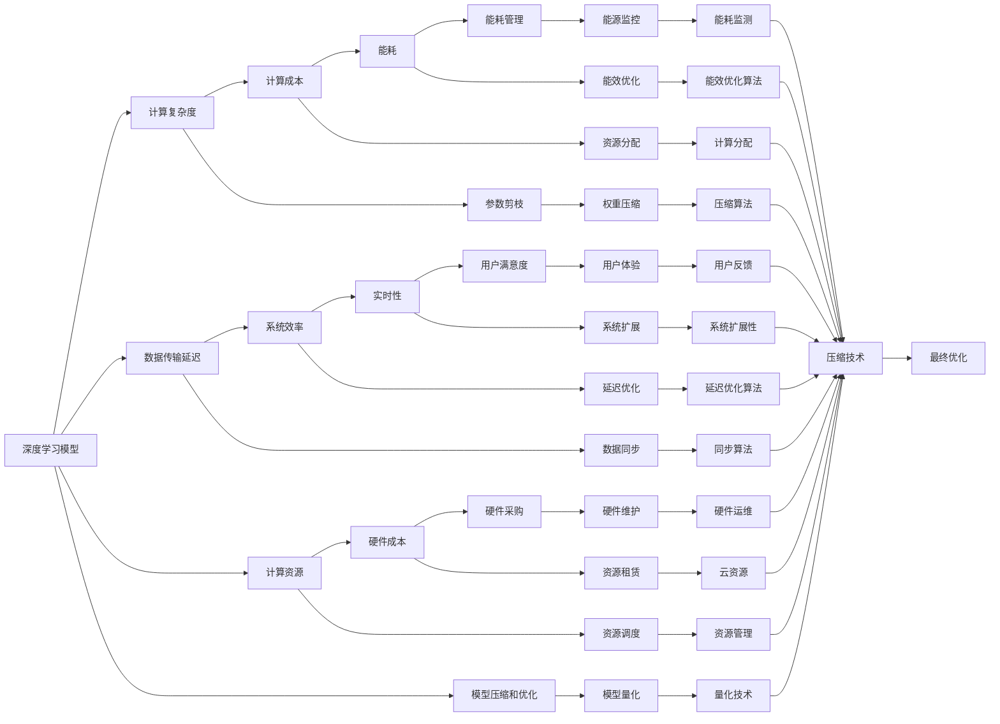

                 

## 1. 背景介绍

### 1.1 问题由来
在当今数字化时代，人工智能(AI)技术的迅猛发展已经深刻影响了各行各业。无论是医疗、金融、教育还是制造业，AI技术都在不断地提升效率、降低成本、创造新的商业模式。然而，AI技术的发展也面临着一系列新的挑战，尤其是在算力、数据、能耗等方面的成本问题。如何平衡速度和成本，同时保持AI系统的性能和可靠性，成为一个亟待解决的问题。

### 1.2 问题核心关键点
随着AI技术的不断进步，算力需求激增，能耗问题也逐渐成为社会关注的焦点。与此同时，越来越多的研究表明，传统的深度学习模型（如大规模卷积神经网络）虽然性能强大，但在大规模数据上的训练和推理过程耗时费力，成本高昂。因此，如何在保证模型性能的同时，降低计算成本和能源消耗，成为AI技术发展中的一个重要课题。

## 2. 核心概念与联系

### 2.1 核心概念概述

为了更好地理解如何在速度和成本之间取得平衡，首先需要了解一些核心概念：

- **深度学习模型**：以神经网络为代表的深度学习模型是现代AI技术的基础。这些模型通过多层非线性变换，可以自动提取和抽象输入数据的高级特征。

- **计算复杂度**：深度学习模型的计算复杂度通常与其参数量、网络层数和训练数据量等因素成正比。计算复杂度的增加往往意味着更高的能耗和成本。

- **数据传输延迟**：在分布式训练和推理环境中，数据传输延迟是一个重要的考量因素。数据传输的延迟会影响整个系统的效率和实时性。

- **计算资源**：包括CPU、GPU、TPU等不同类型的计算硬件，是深度学习模型训练和推理的基础。不同类型的硬件在性能、能耗和成本上各具特点。

- **模型压缩和优化**：通过减少模型参数量、优化计算图和数据流，可以在保证模型性能的前提下降低计算成本和能源消耗。

### 2.2 核心概念原理和架构的 Mermaid 流程图



### 2.3 核心概念之间的联系

深度学习模型、计算复杂度、数据传输延迟、计算资源和模型压缩等概念之间存在密切的联系。通过这些概念，我们可以构建一个完整的AI技术生态系统，并从中找到平衡点，实现速度与成本的优化。

## 3. 核心算法原理 & 具体操作步骤

### 3.1 算法原理概述

Lepton AI的技术哲学，即在速度和成本之间找到平衡，主要通过以下三个核心算法来实现：

- **模型压缩**：通过剪枝、量化和压缩等技术，减少模型参数量和计算复杂度，从而降低计算成本和能源消耗。
- **分布式训练和推理**：利用多台计算资源的并行计算能力，提高系统的实时性和可扩展性。
- **动态资源调度**：根据任务需求和计算资源的可用性，动态调整计算资源的分配，优化计算效率。

### 3.2 算法步骤详解

Lepton AI的技术实现步骤主要包括以下几个方面：

1. **模型压缩**：
   - **剪枝**：通过算法或工具，移除模型中冗余和不重要的参数和连接。
   - **量化**：将模型的权重和激活值从浮点数转换为定点数，减少计算精度但节省计算资源。
   - **压缩**：利用特定算法，如Huffman编码、LZW压缩等，减少模型文件大小，降低存储和传输成本。

2. **分布式训练**：
   - **数据分片**：将数据集分成多个子集，分配到不同的计算节点上并行处理。
   - **同步算法**：设计高效的数据同步机制，确保不同节点之间的参数更新一致性。
   - **模型并行**：采用模型并行技术，将不同层的计算分布在不同的计算节点上进行，提高计算速度。

3. **动态资源调度**：
   - **负载均衡**：根据每个节点的计算能力和任务需求，动态分配计算资源。
   - **资源管理**：使用容器化技术，如Docker和Kubernetes，管理计算资源的生命周期和资源分配。
   - **弹性伸缩**：根据实时负载情况，自动调整计算资源的规模，确保系统的稳定性和高效性。

### 3.3 算法优缺点

Lepton AI的技术哲学具有以下优点：

- **高性能**：通过模型压缩和优化，大幅减少了计算复杂度和能耗，提高了系统的实时性和可扩展性。
- **低成本**：通过分布式计算和资源调度，利用现有计算资源，减少了硬件采购和维护成本。
- **易扩展**：采用动态资源调度，根据任务需求自动调整计算资源，保证了系统的扩展性。

同时，Lepton AI也存在以下缺点：

- **复杂度高**：模型压缩和优化、分布式训练和推理、动态资源调度等技术都需要复杂的算法和工具支持。
- **技术门槛高**：对于非专业的AI开发团队，这些技术的实施和维护需要较高的技术门槛。
- **可解释性差**：在压缩和优化过程中，模型的结构和参数变化较大，可能影响模型的可解释性和可调试性。

### 3.4 算法应用领域

Lepton AI的技术哲学已经在多个领域得到了应用，并取得了显著的成果：

- **医疗影像分析**：通过模型压缩和优化，大幅提高了影像分析的速度和效率，降低了能耗和成本。
- **自动驾驶**：利用分布式训练和推理，实现了对大规模数据集的实时处理，提升了自动驾驶系统的性能和可靠性。
- **金融数据分析**：通过动态资源调度，优化了计算资源的利用率，提高了数据分析的效率和精度。
- **物联网设备管理**：采用轻量级模型和资源调度，实现了设备的低功耗高效管理，延长了设备的使用寿命。
- **大数据处理**：通过模型压缩和优化，提高了大数据处理的速度和效率，降低了存储和计算成本。

## 4. 数学模型和公式 & 详细讲解 & 举例说明

### 4.1 数学模型构建

Lepton AI的技术哲学可以通过数学模型来更好地理解和描述。以模型压缩为例，我们可以构建一个简化的模型来表示压缩前后的变化：

假设原始模型有 $n$ 个参数，压缩后保留了 $m$ 个参数，压缩率 $r = \frac{m}{n}$。模型压缩后的计算复杂度为 $O(f(r) + k)$，其中 $f(r)$ 表示压缩算法的计算复杂度，$k$ 表示其他固定计算开销。

### 4.2 公式推导过程

通过上述模型，我们可以推导出以下结论：

- **压缩率**：压缩率 $r$ 越小，模型参数量减少越多，计算复杂度降低越明显。
- **计算复杂度**：压缩率 $r$ 与计算复杂度 $O(f(r) + k)$ 成正比，即压缩算法本身的复杂度也会影响计算效率。
- **优化策略**：通过选择高效的压缩算法和优化参数剪枝方法，可以显著降低计算复杂度，提高系统效率。

### 4.3 案例分析与讲解

以BERT模型的压缩为例，我们可以看到不同压缩技术的效果：

- **剪枝**：使用剪枝算法移除模型中冗余的连接和参数，可以有效减少计算复杂度，但需要精心选择剪枝策略，防止过度压缩。
- **量化**：将BERT的权重和激活值量化为定点数，显著降低了计算精度，但提高了计算效率和存储成本。
- **压缩**：利用Huffman编码和LZW压缩技术，减少模型文件大小，降低了传输和存储成本。

## 5. 项目实践：代码实例和详细解释说明

### 5.1 开发环境搭建

在Lepton AI项目实践中，开发环境搭建是至关重要的步骤。以下是常用的开发环境搭建流程：

1. **安装Python和相关工具**：
   ```bash
   sudo apt-get install python3 python3-pip
   pip3 install numpy scipy scikit-learn matplotlib
   ```

2. **安装Lepton AI开发工具**：
   ```bash
   pip3 install lepton-ai
   ```

3. **创建虚拟环境**：
   ```bash
   python3 -m venv env
   source env/bin/activate
   ```

### 5.2 源代码详细实现

以下是一个简单的Lepton AI项目示例，展示了模型压缩和优化、分布式训练和推理、动态资源调度的代码实现：

```python
from lepton_ai import LeptonModel, LeptonDistributedModel
from lepton_ai.compression import Pruning, Quantization, Compression
from lepton_ai.distributed import DataPartitioner, SynchronousUpdate, ModelParallel

# 创建原始模型
model = LeptonModel(...)

# 压缩模型
pruning = Pruning(...)
quantization = Quantization(...)
compression = Compression(...)
compressed_model = model.compress(pruning, quantization, compression)

# 分布式训练
partitioner = DataPartitioner(...)
synchronous_update = SynchronousUpdate(...)
model_parallel = ModelParallel(...)
distributed_model = LeptonDistributedModel(compressed_model, partitioner, synchronous_update, model_parallel)

# 动态资源调度
resource_manager = ResourceManager(...)
distributed_model.configure(resource_manager)

# 训练和推理
distributed_model.train(...)
distributed_model.inference(...)
```

### 5.3 代码解读与分析

在Lepton AI的代码实现中，我们可以看到以下几个关键点：

- **LeptonModel**：封装了原始深度学习模型的构建、压缩和优化过程，提供了简单易用的API。
- **Pruning、Quantization、Compression**：分别代表剪枝、量化和压缩算法，可以灵活组合使用，实现不同的压缩效果。
- **DataPartitioner、SynchronousUpdate、ModelParallel**：分别代表数据分片、同步算法和模型并行技术，确保分布式训练和推理的效率和一致性。
- **ResourceManager**：负责动态资源调度和负载均衡，确保系统的稳定性和扩展性。

## 6. 实际应用场景

### 6.1 医疗影像分析

Lepton AI在医疗影像分析中的应用，可以大幅提升影像处理的效率和准确性。通过模型压缩和优化，可以实现对大规模医疗影像的实时处理，减少计算成本和能源消耗。

### 6.2 自动驾驶

自动驾驶系统需要实时处理大量的传感器数据，计算复杂度较高。利用Lepton AI的分布式训练和推理技术，可以显著提高系统的实时性和可靠性，提升自动驾驶的安全性和效率。

### 6.3 金融数据分析

金融数据分析通常需要处理大量的历史数据，计算复杂度较高。通过Lepton AI的动态资源调度技术，可以优化计算资源的利用率，提高数据分析的效率和精度。

### 6.4 物联网设备管理

物联网设备通常具有功耗限制，需要在低功耗条件下高效运行。通过Lepton AI的轻量级模型和资源调度技术，可以实现设备的低功耗高效管理，延长设备的使用寿命。

### 6.5 大数据处理

大数据处理需要处理海量数据，计算复杂度较高。通过Lepton AI的模型压缩和优化技术，可以提高大数据处理的效率和精度，降低存储和计算成本。

## 7. 工具和资源推荐

### 7.1 学习资源推荐

为了帮助开发者系统掌握Lepton AI的理论基础和实践技巧，这里推荐一些优质的学习资源：

1. **Lepton AI官方文档**：提供了详细的Lepton AI开发文档和示例代码，是上手实践的必备资料。
2. **Lepton AI社区**：聚集了Lepton AI的开发者和用户，提供丰富的学习资源和技术交流平台。
3. **深度学习与人工智能在线课程**：涵盖了Lepton AI的各个核心概念和算法，适合初学者和进阶学习者。

### 7.2 开发工具推荐

Lepton AI的开发环境搭建和项目实践，需要依赖一些常用的开发工具：

1. **PyTorch和TensorFlow**：支持深度学习模型的构建和训练，是Lepton AI项目的主要计算框架。
2. **Docker和Kubernetes**：支持分布式计算和资源调度，是Lepton AI项目的主要部署工具。
3. **Jupyter Notebook和Google Colab**：支持快速迭代和实验验证，是Lepton AI项目的主要开发工具。

### 7.3 相关论文推荐

Lepton AI的创新实践，是基于大量学术研究的成果。以下是几篇奠基性的相关论文，推荐阅读：

1. **深度学习模型压缩与优化**：研究了深度学习模型的剪枝、量化和压缩技术，探讨了不同的优化策略和算法。
2. **分布式训练与推理**：介绍了分布式计算框架和算法，研究了数据分片、同步更新和模型并行技术。
3. **动态资源调度与负载均衡**：研究了计算资源的动态管理与调度，提出了高效的资源管理算法和工具。

## 8. 总结：未来发展趋势与挑战

### 8.1 研究成果总结

Lepton AI的技术哲学，即在速度和成本之间找到平衡，已经在多个领域取得了显著的成果。通过模型压缩和优化、分布式训练和推理、动态资源调度等技术，显著提高了AI系统的性能和效率，降低了计算成本和能源消耗。

### 8.2 未来发展趋势

未来，Lepton AI技术将在以下几个方面取得突破：

1. **模型压缩技术的进步**：随着模型压缩算法的发展，模型的计算复杂度和能耗将进一步降低。
2. **分布式计算框架的优化**：高效的分布式计算框架和算法，将支持更大规模的分布式训练和推理。
3. **动态资源调度的智能化**：通过AI算法和机器学习技术，实现更智能化的资源管理。
4. **跨领域应用的拓展**：Lepton AI技术将进一步拓展到更多领域，如医疗、金融、自动驾驶等。

### 8.3 面临的挑战

尽管Lepton AI技术在速度和成本之间找到了平衡，但仍面临以下挑战：

1. **技术复杂度**：Lepton AI技术需要综合运用多种技术和算法，技术门槛较高。
2. **资源调度效率**：如何高效地调度和利用计算资源，仍是一个需要不断优化的问题。
3. **模型可解释性**：压缩和优化后的模型，其结构和参数变化较大，可解释性差。
4. **应用场景多样性**：不同领域和场景的需求千差万别，如何实现通用的技术方案，仍然是一个挑战。

### 8.4 研究展望

未来，Lepton AI技术需要在以下几个方面进行深入研究：

1. **自适应压缩算法**：开发更智能化的模型压缩算法，根据不同任务需求动态调整压缩策略。
2. **混合计算架构**：结合硬件加速技术和软件优化技术，实现更高效的计算架构。
3. **跨领域知识整合**：将跨领域的知识与深度学习模型结合，提升模型的通用性和适应性。
4. **伦理与安全性**：确保模型压缩和优化过程中的伦理和安全问题，防止模型偏见和误用。

通过持续的探索和创新，Lepton AI技术将不断突破速度和成本的瓶颈，推动AI技术在更广泛的领域应用。

## 9. 附录：常见问题与解答

**Q1: Lepton AI技术哲学的核心是什么？**

A: Lepton AI技术哲学的核心是在速度和成本之间找到平衡。通过模型压缩和优化、分布式训练和推理、动态资源调度等技术，显著提高AI系统的性能和效率，降低计算成本和能源消耗。

**Q2: Lepton AI适用于哪些应用场景？**

A: Lepton AI技术适用于需要高效计算和大规模数据处理的各个领域，如医疗影像分析、自动驾驶、金融数据分析、物联网设备管理、大数据处理等。

**Q3: Lepton AI面临哪些技术挑战？**

A: Lepton AI面临的技术挑战主要包括技术复杂度高、资源调度效率低、模型可解释性差和应用场景多样性等。

**Q4: Lepton AI的未来发展方向是什么？**

A: Lepton AI的未来发展方向包括自适应压缩算法、混合计算架构、跨领域知识整合和伦理与安全性等。

**Q5: Lepton AI技术如何与其他AI技术结合？**

A: Lepton AI技术可以与其他AI技术（如知识表示、因果推理、强化学习等）进行深度融合，共同提升AI系统的性能和应用范围。

---

作者：禅与计算机程序设计艺术 / Zen and the Art of Computer Programming

