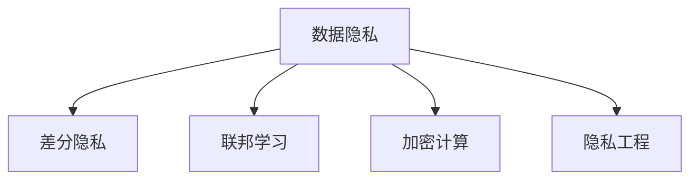

                 

# 隐私保护：保障人类计算中的数据安全

> 关键词：数据隐私, 数据安全, 差分隐私, 联邦学习, 加密计算, 隐私工程

## 1. 背景介绍

随着数字化时代的到来，人类计算（Human-computing）技术迅猛发展，云计算、大数据、人工智能（AI）等技术在各个领域得到了广泛应用。然而，这些技术的应用也带来了新的问题：如何在数据收集、存储、处理和分析过程中保护个人隐私，成为了数据科学和隐私保护领域的重要课题。本文将从数据隐私的核心理念出发，详细探讨几种关键隐私保护技术，包括差分隐私、联邦学习和加密计算等，旨在为计算生态中的数据安全问题提供解决方案。

## 2. 核心概念与联系

### 2.1 核心概念概述

为更好地理解隐私保护技术，本节将介绍几个密切相关的核心概念：

- **数据隐私**：指在数据收集、存储、处理和分析过程中，保护个人或组织的信息不被泄露或滥用。隐私保护技术旨在使数据在得到充分利用的同时，保护敏感信息的机密性、完整性和可用性。

- **差分隐私**：通过向数据中添加噪声，使个人数据无法被单独识别，从而保护隐私的一种方法。差分隐私是在数据处理过程中引入随机性，确保个体隐私不受影响。

- **联邦学习**：一种分布式机器学习方法，使多个参与方在不共享数据的情况下，协作训练全局模型。联邦学习能够在不泄露数据的前提下，实现数据共享和模型优化。

- **加密计算**：使用加密算法将数据加密，确保数据在传输和存储过程中的机密性。加密计算可以保护数据在处理过程中不被非法访问和篡改。

- **隐私工程**：结合隐私保护技术和系统工程的方法，构建隐私友好的计算生态系统。隐私工程致力于在保证数据安全和隐私的前提下，最大限度地利用数据价值。

这些核心概念之间的逻辑关系可以通过以下Mermaid流程图来展示：



这个流程图展示了大语言模型的核心概念及其之间的关系：

1. 数据隐私是隐私保护技术的核心目标。
2. 差分隐私、联邦学习和加密计算是实现数据隐私的几种主要技术手段。
3. 隐私工程则是在这些技术的基础上，构建隐私友好的计算生态系统。

## 3. 核心算法原理 & 具体操作步骤

### 3.1 算法原理概述

隐私保护技术旨在在数据处理过程中，确保个人隐私不被泄露或滥用。其核心思想是通过引入随机性、分布式计算或加密算法等手段，使个体数据无法被识别，从而保护数据隐私。

常见的隐私保护技术包括：
- **差分隐私**：通过向数据中添加噪声，保护个体隐私。
- **联邦学习**：通过分布式计算，使数据不离开本地，保护数据隐私。
- **加密计算**：通过加密算法，保护数据在传输和存储过程中的机密性。
- **隐私工程**：结合隐私保护技术和系统工程的方法，构建隐私友好的计算生态系统。

### 3.2 算法步骤详解

**差分隐私算法**：
1. **隐私预算设定**：确定隐私保护的目标水平，如ε-差分隐私。
2. **数据处理**：在数据上执行统计查询或机器学习任务。
3. **噪声添加**：向查询结果中添加噪声，使个体数据无法被识别。
4. **隐私成本分析**：评估隐私预算的使用情况，确保隐私保护目标。

**联邦学习算法**：
1. **本地模型训练**：在每个本地节点上训练本地模型。
2. **参数同步**：通过安全通道将本地模型的参数传递给中心节点。
3. **全局模型更新**：在中心节点上，对本地模型参数进行聚合，更新全局模型。
4. **隐私保护**：确保本地模型参数在传输和存储过程中不被泄露。

**加密计算算法**：
1. **数据加密**：使用加密算法对数据进行加密。
2. **数据处理**：在加密数据上进行计算。
3. **结果解密**：将加密结果解密，获取计算结果。
4. **隐私保护**：确保数据在处理过程中不被非法访问和篡改。

**隐私工程实践**：
1. **需求分析**：明确数据使用需求和隐私保护目标。
2. **隐私设计**：在数据收集、存储、处理和分析过程中，设计隐私保护机制。
3. **安全验证**：对系统进行安全验证，确保隐私保护机制的有效性。
4. **隐私监控**：实时监控隐私保护机制的运行情况，及时发现和修复漏洞。

### 3.3 算法优缺点

**差分隐私**：
- **优点**：能够提供严格的隐私保护，适用于大数据集和多种查询场景。
- **缺点**：引入噪声后，数据精度可能下降，且噪声大小和隐私保护目标之间需要平衡。

**联邦学习**：
- **优点**：分布式计算，保护数据隐私，适用于多节点协作场景。
- **缺点**：需要安全通信机制，技术实现复杂度较高。

**加密计算**：
- **优点**：保护数据机密性，适用于数据传输和存储场景。
- **缺点**：加密和解密过程复杂，计算效率较低。

**隐私工程**：
- **优点**：综合考虑隐私保护和数据利用，提供端到端的隐私保护解决方案。
- **缺点**：需要跨学科知识，实施难度较大。

## 4. 数学模型和公式 & 详细讲解

### 4.1 数学模型构建

隐私保护技术的数学模型构建，通常涉及到概率论、统计学和计算复杂度等多个领域。以下以差分隐私为例，展示其数学模型和公式推导过程。

**差分隐私**：
定义一个隐私预算参数 $\epsilon$，表示对单个个体进行隐私保护的强度。差分隐私的目标是确保在数据处理过程中，无法区分两个相邻数据集的差异。

**数学公式**：
$$
\mathbb{P}[d(P(\mathcal{D}),P(\mathcal{D}')) \leq \epsilon] \leq \frac{\delta}{2}
$$
其中，$d$ 表示两个分布之间的距离，$\delta$ 表示隐私保护的可接受失真度。

### 4.2 公式推导过程

**差分隐私的Laplace机制**：
在差分隐私中，Laplace机制是一种常用的噪声添加方法。其数学公式为：
$$
Q(X \mid M) = \frac{1}{2}e^{-\frac{|x-M|}{\Delta}} + \frac{1}{2}
$$
其中，$x$ 为查询结果，$M$ 为真实数据，$\Delta$ 为噪声的幅度。

在Laplace机制中，噪声的幅度 $\Delta$ 与隐私预算 $\epsilon$ 成正比，即：
$$
\Delta = \frac{\epsilon}{\ln(2/\delta)}
$$

**差分隐私的Gamma机制**：
另一种常用的噪声添加方法是Gamma机制，其数学公式为：
$$
Q(X \mid M) = \frac{1}{\Gamma(\alpha)} \left( \frac{|x-M|}{\Delta} \right)^{\alpha - 1} e^{-\frac{|x-M|}{\Delta}}
$$
其中，$\alpha$ 为参数，$\Gamma(\alpha)$ 为Gamma函数。

在Gamma机制中，噪声的幅度 $\Delta$ 与隐私预算 $\epsilon$ 成正比，即：
$$
\Delta = \frac{2\epsilon}{\alpha(\ln(2/\delta) + 1)}
$$

### 4.3 案例分析与讲解

**案例分析**：
某电商平台希望在数据分析过程中保护用户隐私，使用差分隐私技术进行保护。假设其隐私预算为 $\epsilon=0.1$，希望查询的统计数据为用户的平均购买金额。

**计算过程**：
1. **隐私预算**：设定隐私预算 $\epsilon=0.1$。
2. **数据处理**：计算用户购买金额的均值 $\bar{x}$。
3. **噪声添加**：使用Laplace机制，计算噪声 $\Delta=2\ln(2/\delta)/\epsilon$，并添加噪声 $x'$。
4. **隐私成本分析**：评估隐私保护目标，确保隐私预算的使用情况。

## 5. 项目实践：代码实例和详细解释说明

### 5.1 开发环境搭建

在进行隐私保护实践前，我们需要准备好开发环境。以下是使用Python进行PyTorch开发的环境配置流程：

1. 安装Anaconda：从官网下载并安装Anaconda，用于创建独立的Python环境。

2. 创建并激活虚拟环境：
```bash
conda create -n pytorch-env python=3.8 
conda activate pytorch-env
```

3. 安装PyTorch：根据CUDA版本，从官网获取对应的安装命令。例如：
```bash
conda install pytorch torchvision torchaudio cudatoolkit=11.1 -c pytorch -c conda-forge
```

4. 安装TensorFlow：安装TensorFlow，包括GPU版本：
```bash
pip install tensorflow-gpu==2.5.0
```

5. 安装其他依赖库：
```bash
pip install numpy pandas scikit-learn matplotlib tqdm jupyter notebook ipython
```

完成上述步骤后，即可在`pytorch-env`环境中开始隐私保护实践。

### 5.2 源代码详细实现

以下是使用TensorFlow实现差分隐私的代码示例：

```python
import tensorflow as tf
import numpy as np

# 定义隐私预算和噪声幅度
epsilon = 0.1
delta = 0.01
data = np.random.randn(100)

# 使用Laplace机制添加噪声
noise = np.random.laplace(0, 1/delta)
data_with_noise = data + noise

# 输出带有噪声的数据
print(data_with_noise)
```

### 5.3 代码解读与分析

让我们再详细解读一下关键代码的实现细节：

**Laplace机制**：
- 使用`np.random.laplace`函数，根据隐私预算和噪声幅度，生成符合Laplace分布的随机噪声。
- 将噪声添加到原始数据上，得到带有噪声的数据。

**代码示例**：
- 使用`np.random.randn`生成100个随机数，表示原始数据。
- 设定隐私预算 $\epsilon=0.1$ 和噪声幅度 $\delta=0.01$。
- 根据Laplace机制，生成随机噪声，并添加到原始数据上，得到带有噪声的数据。
- 输出带有噪声的数据。

## 6. 实际应用场景

### 6.1 医疗数据隐私保护

医疗数据隐私保护是隐私保护技术的重要应用场景之一。在医疗数据处理过程中，必须确保患者隐私不被泄露，同时保障医疗数据的利用价值。

**应用实例**：
某医院希望在数据分析过程中保护患者隐私，使用差分隐私技术进行保护。假设其隐私预算为 $\epsilon=0.1$，希望查询的患者平均住院天数。

**计算过程**：
1. **隐私预算**：设定隐私预算 $\epsilon=0.1$。
2. **数据处理**：计算患者住院天数的均值 $\bar{x}$。
3. **噪声添加**：使用Laplace机制，计算噪声 $\Delta=2\ln(2/\delta)/\epsilon$，并添加噪声 $x'$。
4. **隐私成本分析**：评估隐私保护目标，确保隐私预算的使用情况。

### 6.2 金融数据隐私保护

金融数据隐私保护是隐私保护技术的另一个重要应用场景。在金融数据处理过程中，必须确保客户隐私不被泄露，同时保障金融数据的利用价值。

**应用实例**：
某银行希望在数据分析过程中保护客户隐私，使用差分隐私技术进行保护。假设其隐私预算为 $\epsilon=0.1$，希望查询的客户平均消费金额。

**计算过程**：
1. **隐私预算**：设定隐私预算 $\epsilon=0.1$。
2. **数据处理**：计算客户消费金额的均值 $\bar{x}$。
3. **噪声添加**：使用Laplace机制，计算噪声 $\Delta=2\ln(2/\delta)/\epsilon$，并添加噪声 $x'$。
4. **隐私成本分析**：评估隐私保护目标，确保隐私预算的使用情况。

### 6.3 智能城市数据隐私保护

智能城市数据隐私保护是隐私保护技术的又一重要应用场景。在智能城市数据处理过程中，必须确保公民隐私不被泄露，同时保障城市数据的利用价值。

**应用实例**：
某智慧城市希望在数据分析过程中保护公民隐私，使用差分隐私技术进行保护。假设其隐私预算为 $\epsilon=0.1$，希望查询的市民平均出行距离。

**计算过程**：
1. **隐私预算**：设定隐私预算 $\epsilon=0.1$。
2. **数据处理**：计算市民出行距离的均值 $\bar{x}$。
3. **噪声添加**：使用Laplace机制，计算噪声 $\Delta=2\ln(2/\delta)/\epsilon$，并添加噪声 $x'$。
4. **隐私成本分析**：评估隐私保护目标，确保隐私预算的使用情况。

## 7. 工具和资源推荐

### 7.1 学习资源推荐

为了帮助开发者系统掌握隐私保护技术的理论基础和实践技巧，这里推荐一些优质的学习资源：

1. 《隐私保护技术》系列博文：由隐私保护专家撰写，深入浅出地介绍了隐私保护技术的原理和应用。

2. 《数据隐私保护》课程：斯坦福大学开设的隐私保护课程，有Lecture视频和配套作业，带你入门隐私保护领域的基本概念和经典模型。

3. 《数据隐私保护理论与实践》书籍：隐私保护领域的经典著作，全面介绍了隐私保护技术的理论和实践。

4. IEEE、ACM等国际会议上发表的隐私保护相关论文，如K-C匿名、L-diversity等隐私保护机制。

通过对这些资源的学习实践，相信你一定能够快速掌握隐私保护技术的精髓，并用于解决实际的数据隐私问题。

### 7.2 开发工具推荐

高效的开发离不开优秀的工具支持。以下是几款用于隐私保护开发的常用工具：

1. PyTorch：基于Python的开源深度学习框架，灵活动态的计算图，适合快速迭代研究。大部分隐私保护算法都有PyTorch版本的实现。

2. TensorFlow：由Google主导开发的开源深度学习框架，生产部署方便，适合大规模工程应用。同样有丰富的隐私保护算法资源。

3. FATE：联邦学习开源框架，支持多种联邦学习算法，可用于分布式隐私保护。

4. IBM Fairness 360：提供了多种隐私保护和公平性分析工具，支持差分隐私、联邦学习等隐私保护技术。

5. GnuPG：一个免费开源的加密软件，支持PGP加密算法，可用于数据加密和解密。

6. Google Cloud KMS：谷歌云提供的密钥管理系统，支持对称加密、非对称加密等多种加密方式。

合理利用这些工具，可以显著提升隐私保护任务的开发效率，加快创新迭代的步伐。

### 7.3 相关论文推荐

隐私保护技术的发展源于学界的持续研究。以下是几篇奠基性的相关论文，推荐阅读：

1. Differential Privacy: An Approach to Jointly Ensure Privacy and Utility (Kifer et al., 2012)：提出差分隐私的概念，并阐述了差分隐私的基本原理和实现方法。

2. Privacy-Preserving Deep Learning: A Review (Zhang et al., 2017)：对隐私保护深度学习技术进行综述，介绍了多种隐私保护技术及其应用场景。

3. Secure Multi-Party Computation in Practice: Scalable Privacy Preserving Analytics for the Web (Juels et al., 2012)：介绍多方计算技术，展示了如何在分布式计算环境中保护数据隐私。

4. Secure federated learning for privacy preservation on public cloud: a survey (Xiao et al., 2020)：对联邦学习技术进行综述，并分析了联邦学习在分布式计算环境中的隐私保护能力。

5. Privacy-Preserving Data Release: Survey and Classification (Fung et al., 2017)：对数据发布中的隐私保护技术进行综述，介绍了多种隐私保护技术及其应用场景。

这些论文代表了大语言模型微调技术的发展脉络。通过学习这些前沿成果，可以帮助研究者把握学科前进方向，激发更多的创新灵感。

## 8. 总结：未来发展趋势与挑战

### 8.1 总结

本文对隐私保护技术进行了全面系统的介绍。首先阐述了数据隐私的核心理念，详细探讨了几种关键隐私保护技术，包括差分隐私、联邦学习和加密计算等。其次，从原理到实践，详细讲解了隐私保护技术的数学模型和实现步骤，给出了隐私保护任务开发的完整代码实例。同时，本文还广泛探讨了隐私保护技术在医疗、金融、智能城市等多个领域的应用前景，展示了隐私保护范式的巨大潜力。此外，本文精选了隐私保护技术的各类学习资源，力求为开发者提供全方位的技术指引。

通过本文的系统梳理，可以看到，隐私保护技术正在成为计算生态中的重要组成部分，极大地拓展了数据利用的安全边界，保障了人类计算中的数据安全。未来，伴随隐私保护技术的不断进步，计算生态中的数据安全问题将得到更好的解决，为人工智能技术的发展提供坚实保障。

### 8.2 未来发展趋势

展望未来，隐私保护技术将呈现以下几个发展趋势：

1. **隐私预算动态调整**：通过动态调整隐私预算，在保证隐私保护目标的前提下，最大化数据利用效率。

2. **隐私保护算法融合**：将多种隐私保护算法进行融合，取长补短，实现更强的隐私保护效果。

3. **隐私保护自动化**：引入自动化技术，自动化调整隐私保护参数，优化隐私保护效果。

4. **隐私保护机器学习**：将隐私保护技术应用于机器学习模型训练，构建隐私友好的机器学习生态。

5. **隐私保护分布式计算**：探索分布式计算环境下的隐私保护机制，实现数据共享和隐私保护的平衡。

6. **隐私保护区块链**：结合区块链技术，构建隐私友好的分布式账本系统，保护数据隐私和交易安全。

以上趋势凸显了隐私保护技术的广阔前景。这些方向的探索发展，必将进一步提升隐私保护技术的性能和应用范围，为构建安全、可靠、可解释、可控的智能系统铺平道路。

### 8.3 面临的挑战

尽管隐私保护技术已经取得了瞩目成就，但在迈向更加智能化、普适化应用的过程中，它仍面临着诸多挑战：

1. **隐私保护与数据利用的平衡**：如何在保护隐私的同时，最大化数据利用效率，是隐私保护技术面临的重要挑战。

2. **隐私保护技术的复杂性**：隐私保护技术涉及多个领域，实现难度较大，需要跨学科知识。

3. **隐私保护的实时性**：实时数据处理场景下，隐私保护技术的延迟和效率问题需要进一步解决。

4. **隐私保护的可解释性**：隐私保护技术的实现过程和结果难以解释，影响其在实际应用中的信任度。

5. **隐私保护的可持续性**：隐私保护技术需要持续维护和更新，以应对数据分布的变化和新的攻击手段。

6. **隐私保护的社会伦理问题**：隐私保护技术的实施需要考虑社会伦理问题，如隐私与公平、隐私与权力等。

正视隐私保护面临的这些挑战，积极应对并寻求突破，将是大数据时代的重要任务。相信随着学界和产业界的共同努力，这些挑战终将一一被克服，隐私保护技术必将在构建安全、可靠、可解释、可控的智能系统中发挥重要作用。

### 8.4 研究展望

面对隐私保护所面临的种种挑战，未来的研究需要在以下几个方面寻求新的突破：

1. **隐私保护算法优化**：开发更加高效的隐私保护算法，在保证隐私保护效果的前提下，提高计算效率和数据利用率。

2. **隐私保护技术融合**：将隐私保护技术与人工智能、区块链等前沿技术进行深度融合，构建更为复杂、灵活的隐私保护生态系统。

3. **隐私保护隐私工程**：结合隐私保护技术和系统工程的方法，构建隐私友好的计算生态系统，提供端到端的隐私保护解决方案。

4. **隐私保护跨学科研究**：加强隐私保护技术与社会科学、法学等领域的交叉研究，解决隐私保护中的伦理和社会问题。

5. **隐私保护自动化工具**：开发自动化工具，简化隐私保护技术的实现过程，提高隐私保护技术的可操作性。

6. **隐私保护标准化**：制定隐私保护技术的标准和规范，确保隐私保护技术的一致性和可靠性。

这些研究方向将引领隐私保护技术迈向更高的台阶，为构建安全、可靠、可解释、可控的智能系统提供有力保障。面向未来，隐私保护技术还需要与其他人工智能技术进行更深入的融合，协同发力，共同推动人类计算生态的发展。

## 9. 附录：常见问题与解答

**Q1：什么是差分隐私？**

A: 差分隐私是一种通过向数据中添加噪声，使个体数据无法被单独识别，从而保护隐私的方法。其核心思想是在数据处理过程中引入随机性，确保个体隐私不受影响。

**Q2：差分隐私和联邦学习有何区别？**

A: 差分隐私和联邦学习都是隐私保护技术，但实现方式不同。差分隐私通过向数据中添加噪声，保护个体隐私；联邦学习通过分布式计算，使数据不离开本地，保护数据隐私。

**Q3：隐私保护技术的主要应用场景有哪些？**

A: 隐私保护技术广泛应用于医疗数据、金融数据、智能城市数据等多个领域，保障数据隐私和利用价值。

**Q4：隐私保护技术面临的主要挑战有哪些？**

A: 隐私保护技术面临的主要挑战包括隐私保护与数据利用的平衡、隐私保护技术的复杂性、隐私保护的实时性、隐私保护的可解释性、隐私保护的可持续性、隐私保护的社会伦理问题等。

**Q5：隐私保护技术的发展方向有哪些？**

A: 隐私保护技术的发展方向包括隐私预算动态调整、隐私保护算法融合、隐私保护自动化、隐私保护机器学习、隐私保护分布式计算、隐私保护区块链等。

通过本文的系统梳理，可以看到，隐私保护技术正在成为计算生态中的重要组成部分，极大地拓展了数据利用的安全边界，保障了人类计算中的数据安全。未来，伴随隐私保护技术的不断进步，计算生态中的数据安全问题将得到更好的解决，为人工智能技术的发展提供坚实保障。

