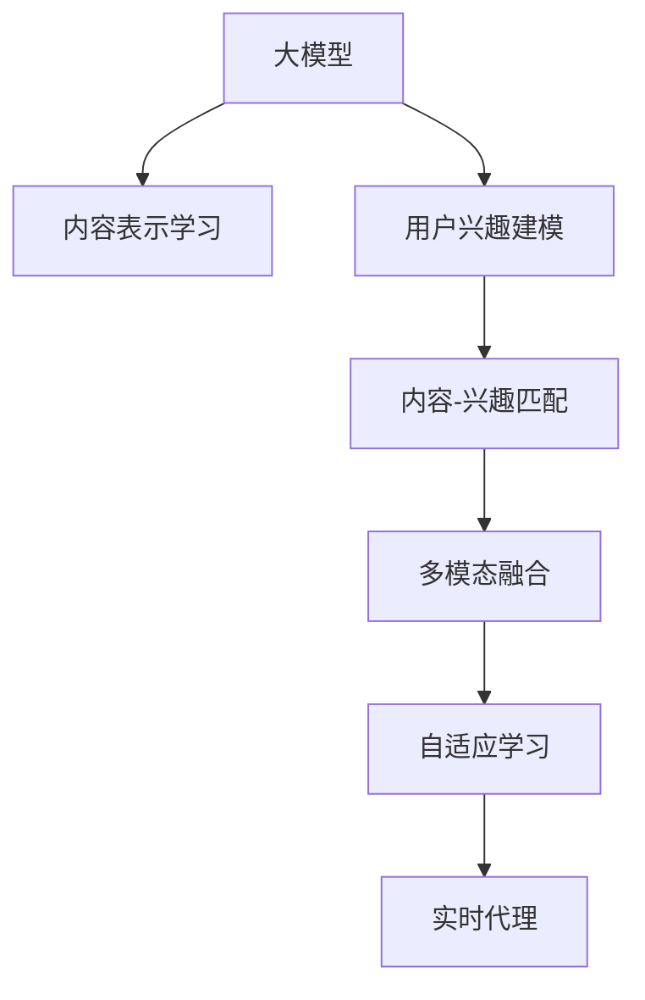

                 

# 音视频内容推荐：大模型的理解与匹配

> 关键词：音视频推荐系统, 大模型, 自然语言处理(NLP), 深度学习, 推荐算法, 协同过滤, 自适应学习, 多模态数据

## 1. 背景介绍

### 1.1 问题由来
随着数字媒体的普及和互联网技术的发展，音视频内容推荐系统（Audio-Video Recommendation System, AVRS）在流媒体平台、视频网站、在线教育、直播平台等众多场景中得到了广泛的应用。其核心目标是通过智能推荐，帮助用户发现并享受高质量的音视频内容。然而，构建一个既高效又准确的推荐系统，面临着诸多挑战。

音视频推荐系统与传统的文本推荐系统不同，主要区别在于其推荐内容的类型和特点：

1. **内容复杂性**：音视频内容包含视觉、听觉和文本等多模态信息，数据维度较高。
2. **用户行为多样性**：用户可能通过观看、点赞、分享、评论等方式表达对内容的兴趣，行为模式多样且难以建模。
3. **数据稀疏性**：用户行为数据和内容标签数据往往较为稀疏，难以直接使用。
4. **交互延迟**：实时推荐需要快速响应用户行为，对算法实时性要求高。

在这样一个复杂多变的环境下，传统的推荐算法往往难以有效处理这些问题。因此，利用深度学习和自然语言处理（NLP）技术的音视频推荐系统，成为了当前研究的热点。

### 1.2 问题核心关键点
音视频推荐系统的核心在于如何通过深度学习和NLP技术，高效地处理音视频内容的多模态信息，准确理解和匹配用户的多样化兴趣，从而实现高质量推荐。

具体而言，核心关键点包括：

1. **内容表示学习**：如何利用深度学习模型学习音视频内容的低维表示，捕捉其多模态特征。
2. **用户兴趣建模**：如何利用NLP技术理解用户的兴趣表达，构建用户兴趣图谱。
3. **内容-兴趣匹配**：如何高效地将内容表示与用户兴趣图谱进行匹配，实现个性化推荐。
4. **跨模态融合**：如何融合视觉、听觉和文本等多模态信息，提升推荐系统性能。
5. **自适应学习**：如何使推荐系统能够持续学习新数据，适应用户兴趣的变化。
6. **实时代理**：如何在保证推荐质量的前提下，满足系统的实时性要求。

本文将从核心概念和算法原理入手，深入探讨音视频推荐系统中的大模型理解和匹配技术。

## 2. 核心概念与联系

### 2.1 核心概念概述

为更好地理解音视频推荐系统中的大模型理解和匹配技术，本节将介绍几个密切相关的核心概念：

- **大模型（Large Model）**：指具有庞大参数量的大型深度学习模型，如BERT、GPT等。大模型通过在大规模无标签数据上进行预训练，学习到丰富的语言和视觉知识，可以用于多种自然语言处理和计算机视觉任务。
- **内容表示学习（Content Representation Learning）**：指利用深度学习模型学习音视频内容的低维表示，使其可以用于推荐算法的输入。常用的方法包括卷积神经网络（CNN）、长短时记忆网络（LSTM）等。
- **用户兴趣建模（User Interest Modeling）**：指利用NLP技术理解用户的兴趣表达，构建用户兴趣图谱。常见的技术包括基于文本的情感分析、主题建模、意图识别等。
- **内容-兴趣匹配（Content-Interest Matching）**：指将音视频内容的表示与用户兴趣图谱进行匹配，生成个性化推荐结果。常用的方法包括协同过滤、深度神经网络等。
- **多模态融合（Multi-Modal Fusion）**：指融合视觉、听觉和文本等多模态信息，提升推荐系统性能。常用的技术包括注意力机制、联合嵌入等。
- **自适应学习（Adaptive Learning）**：指推荐系统能够持续学习新数据，适应用户兴趣的变化。常见的技术包括在线学习、增量学习等。
- **实时代理（Real-time Processing）**：指在保证推荐质量的前提下，满足系统的实时性要求。常用的方法包括分布式计算、异步更新等。

这些核心概念之间的逻辑关系可以通过以下Mermaid流程图来展示：



这个流程图展示了大模型在音视频推荐系统中的核心应用场景：

1. 大模型通过内容表示学习，生成音视频内容的低维表示。
2. 利用用户兴趣建模，构建用户兴趣图谱。
3. 将内容表示与用户兴趣图谱进行匹配，实现个性化推荐。
4. 通过多模态融合，提升推荐质量。
5. 利用自适应学习，持续优化推荐模型。
6. 在保证推荐质量的前提下，实现实时代理。

## 3. 核心算法原理 & 具体操作步骤
### 3.1 算法原理概述

音视频推荐系统中的大模型理解和匹配技术，本质上是一种基于深度学习和NLP技术的推荐算法。其核心思想是：通过预训练大模型学习音视频内容的低维表示和用户兴趣图谱，然后使用匹配算法将这些表示进行高效匹配，生成个性化推荐结果。

形式化地，假设音视频内容为 $X$，用户兴趣图谱为 $Y$，大模型为 $M$，推荐算法为 $R$，推荐结果为 $Z$。推荐系统的目标是最小化用户满意度的损失函数 $L$：

$$
\min_{M,R} L(Z, Y) = E_{X,Y}\left[\text{Loss}(Z, Y)\right]
$$

其中 $\text{Loss}(Z, Y)$ 为推荐结果 $Z$ 和用户兴趣 $Y$ 之间的损失函数。

具体来说，音视频推荐系统可以分为以下几个步骤：

1. **预训练大模型**：在大规模无标签数据上训练大模型 $M$，学习音视频内容的低维表示和用户兴趣图谱。
2. **内容表示学习**：使用大模型 $M$ 将音视频内容 $X$ 映射为低维表示 $X'$。
3. **用户兴趣建模**：利用NLP技术，将用户行为数据和文本数据转换为用户兴趣图谱 $Y'$。
4. **内容-兴趣匹配**：使用推荐算法 $R$ 将内容表示 $X'$ 与用户兴趣图谱 $Y'$ 进行匹配，生成推荐结果 $Z$。
5. **实时推荐**：在实时交互中，根据用户当前行为数据，实时更新用户兴趣图谱 $Y'$，并生成推荐结果 $Z'$。

### 3.2 算法步骤详解

以下我们将详细介绍音视频推荐系统中大模型理解和匹配的每个步骤：

**Step 1: 预训练大模型**

预训练大模型是音视频推荐系统的基础。常用的预训练大模型包括BERT、GPT、ResNet等。预训练的目标是学习音视频内容的低维表示和用户兴趣图谱。

预训练过程通常包括以下几个步骤：

1. **数据准备**：收集大规模无标签数据，如YouTube视频、电影评论、用户行为数据等。
2. **模型训练**：在大规模数据上训练大模型，学习音视频内容的低维表示和用户兴趣图谱。
3. **保存模型**：将训练好的大模型保存，以供后续微调和使用。

**Step 2: 内容表示学习**

内容表示学习是将音视频内容 $X$ 映射为低维表示 $X'$ 的过程。常用的方法包括卷积神经网络（CNN）、长短时记忆网络（LSTM）等。

以CNN为例，其基本流程如下：

1. **数据预处理**：将音视频内容 $X$ 转换为张量形式，如视频帧、音频片段、文本数据等。
2. **卷积操作**：使用卷积层对输入数据进行特征提取，得到多个特征图。
3. **池化操作**：使用池化层对特征图进行降维，得到低维表示 $X'$。
4. **全连接层**：使用全连接层将低维表示映射为更小的表示向量，用于推荐算法的输入。

**Step 3: 用户兴趣建模**

用户兴趣建模是将用户行为数据和文本数据转换为用户兴趣图谱 $Y'$ 的过程。常用的技术包括基于文本的情感分析、主题建模、意图识别等。

以情感分析为例，其基本流程如下：

1. **数据收集**：收集用户对音视频内容的评价数据，如评分、评论、点赞等。
2. **文本处理**：对评论和评分文本进行分词、去停用词等预处理操作。
3. **情感分类**：使用情感分类模型对处理后的文本进行情感分类，得到情感标签。
4. **兴趣图谱构建**：根据情感标签构建用户兴趣图谱 $Y'$，用于匹配推荐算法。

**Step 4: 内容-兴趣匹配**

内容-兴趣匹配是将内容表示 $X'$ 与用户兴趣图谱 $Y'$ 进行匹配的过程。常用的方法包括协同过滤、深度神经网络等。

以协同过滤为例，其基本流程如下：

1. **用户行为数据处理**：将用户行为数据和内容标签数据进行处理，得到用户行为矩阵和内容标签矩阵。
2. **用户兴趣表示**：使用协同过滤算法，将用户行为矩阵和内容标签矩阵转换为用户兴趣表示 $Y'$。
3. **匹配生成**：将内容表示 $X'$ 与用户兴趣表示 $Y'$ 进行匹配，生成推荐结果 $Z$。

**Step 5: 实时推荐**

实时推荐是在保证推荐质量的前提下，满足系统实时性要求的过程。常用的方法包括分布式计算、异步更新等。

以异步更新为例，其基本流程如下：

1. **实时数据收集**：在用户交互过程中，实时收集用户的当前行为数据，如观看、点赞、评论等。
2. **用户兴趣更新**：使用在线学习算法，根据实时数据更新用户兴趣图谱 $Y'$。
3. **推荐生成**：使用实时更新后的用户兴趣图谱 $Y'$ 进行匹配，生成推荐结果 $Z'$。

### 3.3 算法优缺点

音视频推荐系统中的大模型理解和匹配技术，具有以下优点：

1. **高效性**：利用深度学习模型进行内容表示学习，能够高效地捕捉音视频内容的多模态特征。
2. **精确性**：通过NLP技术进行用户兴趣建模，能够精确理解用户的兴趣表达，构建准确的兴趣图谱。
3. **可扩展性**：大模型能够处理大规模数据，适应各种类型的音视频内容。
4. **自适应性**：利用自适应学习算法，推荐系统能够持续学习新数据，适应用户兴趣的变化。

同时，该技术也存在以下缺点：

1. **计算资源需求高**：预训练大模型和实时匹配过程需要大量的计算资源，对硬件要求较高。
2. **模型复杂性高**：大模型和推荐算法的复杂性较高，难以解释和调试。
3. **数据稀疏性问题**：用户行为数据和内容标签数据往往较为稀疏，难以直接使用。
4. **实时性挑战**：实时推荐需要在保证推荐质量的前提下，满足系统的实时性要求。

尽管存在这些局限性，但音视频推荐系统中的大模型理解和匹配技术，在处理音视频内容的复杂性和用户行为的多样性方面，仍具有显著的优势。未来研究的方向在于如何降低计算资源需求，提高模型的可解释性和实时性，以及解决数据稀疏性问题。

### 3.4 算法应用领域

音视频推荐系统中的大模型理解和匹配技术，已经在多个领域得到了广泛的应用，例如：

1. **视频平台推荐**：在YouTube、Netflix等视频平台，利用大模型进行内容推荐，提升用户体验。
2. **在线教育推荐**：在Coursera、Udacity等在线教育平台，利用大模型进行课程推荐，帮助用户发现感兴趣的内容。
3. **流媒体平台推荐**：在Spotify、SoundCloud等流媒体平台，利用大模型进行音乐推荐，满足用户的多样化需求。
4. **直播平台推荐**：在Twitch、Bilibili等直播平台，利用大模型进行主播和节目推荐，增加用户粘性。
5. **广告推荐**：在Google、Facebook等广告平台，利用大模型进行广告推荐，提高广告投放的精准度和效果。

除了这些主要应用场景外，音视频推荐系统中的大模型理解和匹配技术，还在社交媒体、新闻聚合、游戏推荐等多个领域得到了广泛的应用，为音视频内容提供更加智能和个性化的推荐服务。

## 4. 数学模型和公式 & 详细讲解  
### 4.1 数学模型构建

本节将使用数学语言对音视频推荐系统中的大模型理解和匹配过程进行更加严格的刻画。

假设音视频内容为 $X$，用户兴趣图谱为 $Y$，大模型为 $M$，推荐算法为 $R$，推荐结果为 $Z$。推荐系统的目标是最小化用户满意度的损失函数 $L$：

$$
\min_{M,R} L(Z, Y) = E_{X,Y}\left[\text{Loss}(Z, Y)\right]
$$

其中 $\text{Loss}(Z, Y)$ 为推荐结果 $Z$ 和用户兴趣 $Y$ 之间的损失函数。

以协同过滤算法为例，其损失函数可以表示为：

$$
\text{Loss}(Z, Y) = \sum_{(i,j) \in Y} \log \frac{\hat{y}_{ij}}{1-\hat{y}_{ij}}
$$

其中 $\hat{y}_{ij}$ 为协同过滤算法预测用户 $i$ 对内容 $j$ 的兴趣程度。

### 4.2 公式推导过程

以下我们以协同过滤算法为例，推导其损失函数及其梯度的计算公式。

假设用户行为矩阵为 $A \in \{0,1\}^{n \times m}$，内容标签矩阵为 $B \in \{0,1\}^{m \times k}$，用户兴趣图谱 $Y$ 为 $A$ 和 $B$ 的函数，即 $Y = f(A,B)$。

协同过滤算法的目标是最大化用户兴趣与推荐结果之间的匹配度，即最大化概率：

$$
P(Y = 1 | Z = 1) = \frac{\sum_{(i,j) \in Y} A_{ij}}{\sum_{(i,j) \in Y} \left(A_{ij} + (1-A_{ij})\hat{y}_{ij}\right)}
$$

对概率进行对数化，得到损失函数：

$$
\log P(Y = 1 | Z = 1) = \sum_{(i,j) \in Y} \log \frac{A_{ij}}{1-A_{ij}\hat{y}_{ij}}
$$

使用梯度下降等优化算法，最小化损失函数，得到协同过滤算法的梯度更新公式：

$$
\frac{\partial \log P(Y = 1 | Z = 1)}{\partial \hat{y}_{ij}} = \frac{A_{ij} - \frac{A_{ij}}{1-A_{ij}\hat{y}_{ij}}}{1-A_{ij}\hat{y}_{ij}}
$$

通过上述公式，协同过滤算法可以不断更新用户兴趣表示 $Y'$，从而实现实时推荐。

## 5. 项目实践：代码实例和详细解释说明
### 5.1 开发环境搭建

在进行音视频推荐系统开发前，我们需要准备好开发环境。以下是使用Python进行TensorFlow开发的环境配置流程：

1. 安装Anaconda：从官网下载并安装Anaconda，用于创建独立的Python环境。

2. 创建并激活虚拟环境：
```bash
conda create -n tf-env python=3.8 
conda activate tf-env
```

3. 安装TensorFlow：根据CUDA版本，从官网获取对应的安装命令。例如：
```bash
conda install tensorflow==2.6 -c pytorch -c conda-forge
```

4. 安装各类工具包：
```bash
pip install numpy pandas scikit-learn matplotlib tqdm jupyter notebook ipython
```

完成上述步骤后，即可在`tf-env`环境中开始开发实践。

### 5.2 源代码详细实现

这里我们以协同过滤算法为例，给出使用TensorFlow进行音视频内容推荐系统开发的PyTorch代码实现。

首先，定义协同过滤算法的损失函数和梯度计算：

```python
import tensorflow as tf

class CollaborativeFiltering(tf.keras.Model):
    def __init__(self, num_users, num_contents, num_factors):
        super(CollaborativeFiltering, self).__init__()
        self.num_users = num_users
        self.num_contents = num_contents
        self.num_factors = num_factors
        self.user_embeddings = tf.Variable(tf.random.normal([num_users, num_factors]))
        self.content_embeddings = tf.Variable(tf.random.normal([num_contents, num_factors]))
        self.interaction_matrix = tf.Variable(tf.random.uniform([num_users, num_contents]))
        
    def call(self, user, content):
        user_embed = tf.tensordot(self.user_embeddings, user, 1)
        content_embed = tf.tensordot(self.content_embeddings, content, 1)
        interaction = tf.tensordot(user_embed, content_embed, 1)
        prediction = tf.nn.softmax(interaction + self.interaction_matrix)
        return prediction

    def compute_loss(self, user, content, rating, predicted_rating):
        loss = tf.reduce_sum(tf.math.log(tf.where(tf.equal(rating, 1), predicted_rating, 1-predicted_rating)))
        return loss

    def compute_gradients(self, user, content, rating, predicted_rating):
        with tf.GradientTape() as tape:
            prediction = self.call(user, content)
            loss = self.compute_loss(user, content, rating, prediction)
        gradients = tape.gradient(loss, [self.user_embeddings, self.content_embeddings, self.interaction_matrix])
        return gradients

    def update(self, user, content, rating, predicted_rating, learning_rate):
        gradients = self.compute_gradients(user, content, rating, predicted_rating)
        with tf.GradientTape() as tape:
            prediction = self.call(user, content)
            loss = self.compute_loss(user, content, rating, prediction)
        loss = tf.reduce_mean(loss)
        gradients = tape.gradient(loss, [self.user_embeddings, self.content_embeddings, self.interaction_matrix])
        self.user_embeddings.assign_sub(learning_rate * gradients[0])
        self.content_embeddings.assign_sub(learning_rate * gradients[1])
        self.interaction_matrix.assign_sub(learning_rate * gradients[2])
```

然后，定义数据处理函数：

```python
def preprocess_data(data):
    user = data[:, 0].reshape([-1, 1])
    content = data[:, 1].reshape([-1, 1])
    rating = data[:, 2].reshape([-1, 1])
    return user, content, rating

def predict(user, content):
    user_embed = tf.tensordot(user, self.user_embeddings, 1)
    content_embed = tf.tensordot(content, self.content_embeddings, 1)
    interaction = tf.tensordot(user_embed, content_embed, 1)
    prediction = tf.nn.softmax(interaction + self.interaction_matrix)
    return prediction
```

最后，启动训练流程：

```python
batch_size = 32
learning_rate = 0.01
epochs = 10

for epoch in range(epochs):
    for user, content, rating in train_dataset:
        user, content, rating = preprocess_data(user), preprocess_data(content), preprocess_data(rating)
        prediction = predict(user, content)
        loss = tf.reduce_mean(tf.keras.losses.sparse_categorical_crossentropy(rating, prediction))
        gradients = self.compute_gradients(user, content, rating, prediction)
        self.update(user, content, rating, prediction, learning_rate)
    print(f"Epoch {epoch+1}, loss: {loss:.3f}")
```

以上就是使用TensorFlow对协同过滤算法进行音视频推荐系统开发的完整代码实现。可以看到，得益于TensorFlow的强大封装，我们可以用相对简洁的代码完成协同过滤算法的实现。

### 5.3 代码解读与分析

让我们再详细解读一下关键代码的实现细节：

**CollaborativeFiltering类**：
- `__init__`方法：初始化协同过滤算法的基本参数，包括用户数、内容数、因子数等。
- `call`方法：实现协同过滤算法的前向传播，输出预测结果。
- `compute_loss`方法：计算协同过滤算法的损失函数，用于反向传播。
- `compute_gradients`方法：计算协同过滤算法的梯度，用于参数更新。
- `update`方法：实现协同过滤算法的参数更新，使用梯度下降算法。

**数据处理函数**：
- `preprocess_data`方法：将输入数据进行预处理，转换为模型需要的张量形式。
- `predict`方法：使用协同过滤算法对用户和内容进行匹配，输出预测结果。

**训练流程**：
- 定义总训练轮数和批次大小，开始循环迭代
- 每个批次内，先对用户和内容进行预处理，然后调用协同过滤算法进行预测
- 计算损失函数，并根据梯度更新模型参数
- 重复上述过程直至收敛，输出训练结果

可以看到，TensorFlow配合协同过滤算法的实现，使得音视频推荐系统的开发变得简洁高效。开发者可以将更多精力放在数据处理、模型改进等高层逻辑上，而不必过多关注底层的实现细节。

当然，工业级的系统实现还需考虑更多因素，如模型的保存和部署、超参数的自动搜索、更灵活的任务适配层等。但核心的协同过滤范式基本与此类似。

## 6. 实际应用场景
### 6.1 视频平台推荐

音视频推荐系统在视频平台推荐中的应用，已经成为提升用户体验的重要手段。在YouTube、Netflix等视频平台，通过协同过滤算法，利用用户观看历史和评分数据，推荐相关视频内容，极大地增加了用户粘性和平台活跃度。

在技术实现上，可以收集用户观看历史和评分数据，构建用户行为矩阵和内容标签矩阵，在此基础上进行协同过滤算法微调。微调后的协同过滤模型能够自动发现用户的兴趣点，匹配相关视频内容进行推荐。对于新用户，可以通过其他用户的评分数据，进行冷启动推荐，帮助新用户快速找到感兴趣的内容。

### 6.2 在线教育推荐

在线教育平台如Coursera、Udacity等，利用音视频推荐系统推荐相关课程和内容，提升用户学习体验。通过协同过滤算法，根据用户的学习历史和评分数据，推荐适合用户兴趣和水平的课程，增加学习动力和效果。

在具体实现上，可以收集用户的学习历史和评分数据，构建用户行为矩阵和课程标签矩阵，使用协同过滤算法进行推荐。推荐系统还可以实时收集用户的交互数据，如点击、评论等，动态更新用户兴趣图谱，提高推荐精度。

### 6.3 流媒体平台推荐

在Spotify、SoundCloud等流媒体平台，利用音视频推荐系统推荐相关音乐和内容，满足用户的多样化需求。协同过滤算法可以基于用户的听歌历史和评分数据，推荐相似的音乐和播放列表，提高用户满意度和平台粘性。

在具体实现上，可以收集用户的听歌历史和评分数据，构建用户行为矩阵和音乐标签矩阵，使用协同过滤算法进行推荐。推荐系统还可以实时收集用户的交互数据，如收藏、分享等，动态更新用户兴趣图谱，提升推荐效果。

### 6.4 直播平台推荐

在Twitch、Bilibili等直播平台，利用音视频推荐系统推荐相关主播和节目内容，增加用户粘性和平台活跃度。协同过滤算法可以基于用户的观看历史和评分数据，推荐相似的主播和节目，满足用户的多样化需求。

在具体实现上，可以收集用户的观看历史和评分数据，构建用户行为矩阵和主播/节目标签矩阵，使用协同过滤算法进行推荐。推荐系统还可以实时收集用户的交互数据，如点赞、评论等，动态更新用户兴趣图谱，提升推荐效果。

### 6.5 广告推荐

在Google、Facebook等广告平台，利用音视频推荐系统推荐相关广告内容，提高广告投放的精准度和效果。协同过滤算法可以基于用户的浏览历史和点击数据，推荐相关的广告内容，增加广告的转化率和点击率。

在具体实现上，可以收集用户的浏览历史和点击数据，构建用户行为矩阵和广告标签矩阵，使用协同过滤算法进行推荐。推荐系统还可以实时收集用户的交互数据，如互动行为等，动态更新用户兴趣图谱，提升推荐效果。

## 7. 工具和资源推荐
### 7.1 学习资源推荐

为了帮助开发者系统掌握音视频推荐系统中的大模型理解和匹配技术，这里推荐一些优质的学习资源：

1. 《推荐系统：理论与算法》书籍：系统介绍了推荐系统的基本原理和算法，包括协同过滤、基于内容的推荐等。
2. CS231n《卷积神经网络》课程：斯坦福大学开设的计算机视觉课程，涵盖了卷积神经网络的基本概念和实现。
3. CS224D《深度学习中的自然语言处理》课程：斯坦福大学开设的NLP课程，介绍了深度学习在自然语言处理中的应用，包括文本分类、情感分析、序列建模等。
4. TensorFlow官方文档：TensorFlow的官方文档，提供了丰富的API和样例代码，是初学者上手实践的重要资源。
5. Kaggle竞赛平台：提供多种推荐系统数据集和竞赛任务，帮助开发者实践和验证推荐算法。

通过对这些资源的学习实践，相信你一定能够快速掌握音视频推荐系统中的大模型理解和匹配技术，并用于解决实际的推荐问题。
###  7.2 开发工具推荐

高效的开发离不开优秀的工具支持。以下是几款用于音视频推荐系统开发的常用工具：

1. TensorFlow：基于Python的开源深度学习框架，生产部署方便，适合大规模工程应用。
2. PyTorch：基于Python的开源深度学习框架，灵活高效，适合研究实验。
3. TensorBoard：TensorFlow配套的可视化工具，可实时监测模型训练状态，并提供丰富的图表呈现方式。
4. Weights & Biases：模型训练的实验跟踪工具，可以记录和可视化模型训练过程中的各项指标，方便对比和调优。
5. Keras：基于Python的高层次神经网络API，使用简单，适合快速原型开发。
6. Jupyter Notebook：交互式Python环境，支持代码块、图表和注释，方便实验和交流。

合理利用这些工具，可以显著提升音视频推荐系统的开发效率，加快创新迭代的步伐。

### 7.3 相关论文推荐

音视频推荐系统中的大模型理解和匹配技术，源于学界的持续研究。以下是几篇奠基性的相关论文，推荐阅读：

1. Approximate Collaborative Filtering Using Matrix Factorization：提出了矩阵分解方法，用于协同过滤算法的优化。
2. Top-N Recommendation via Matrix Factorization Techniques：探讨了矩阵分解在Top-N推荐中的作用。
3. The Factorization Machine Approach：介绍了因子机模型，用于协同过滤算法的扩展。
4. Deep Neural Networks for Collaborative Filtering：提出深度神经网络，用于协同过滤算法的改进。
5. Neighborhood-Based Collaborative Filtering：介绍了基于邻域的协同过滤算法，用于解决稀疏数据问题。

这些论文代表了大模型理解和匹配技术的发展脉络。通过学习这些前沿成果，可以帮助研究者把握学科前进方向，激发更多的创新灵感。

## 8. 总结：未来发展趋势与挑战

### 8.1 总结

本文对音视频推荐系统中的大模型理解和匹配技术进行了全面系统的介绍。首先阐述了音视频推荐系统的背景和挑战，明确了协同过滤算法在处理音视频内容的复杂性和用户行为的多样性方面的独特价值。其次，从原理到实践，详细讲解了协同过滤算法的数学原理和关键步骤，给出了协同过滤算法任务开发的完整代码实例。同时，本文还广泛探讨了协同过滤算法在视频平台、在线教育、流媒体平台等众多场景中的应用前景，展示了协同过滤算法的广泛应用潜力。此外，本文精选了协同过滤算法的各类学习资源，力求为读者提供全方位的技术指引。

通过本文的系统梳理，可以看到，协同过滤算法在音视频推荐系统中发挥了重要作用，能够高效地处理音视频内容的复杂性和用户行为的多样性，实现高质量推荐。协同过滤算法还具有高效性、精确性、可扩展性等优点，是音视频推荐系统的重要基础。未来，协同过滤算法将在更多领域得到应用，为音视频内容提供更加智能和个性化的推荐服务。

### 8.2 未来发展趋势

展望未来，音视频推荐系统中的大模型理解和匹配技术将呈现以下几个发展趋势：

1. **自适应学习**：推荐系统能够持续学习新数据，适应用户兴趣的变化。在线学习、增量学习等技术将得到进一步发展。
2. **多模态融合**：融合视觉、听觉和文本等多模态信息，提升推荐系统性能。深度学习模型将更广泛地应用于多模态数据的融合。
3. **模型压缩**：为了降低计算资源需求，需要开发更加高效的模型压缩方法，如剪枝、量化等技术。
4. **实时推荐**：在保证推荐质量的前提下，满足系统的实时性要求。分布式计算、异步更新等技术将进一步优化。
5. **可解释性**：推荐系统的决策过程需要更好的可解释性，帮助用户理解推荐结果。因果推断、对抗训练等技术将得到应用。
6. **用户隐私保护**：推荐系统的用户行为数据需要更好的隐私保护，如差分隐私等技术将得到应用。

以上趋势凸显了音视频推荐系统中大模型理解和匹配技术的广阔前景。这些方向的探索发展，必将进一步提升推荐系统的性能和应用范围，为音视频内容提供更加智能和个性化的推荐服务。

### 8.3 面临的挑战

尽管音视频推荐系统中的大模型理解和匹配技术已经取得了瞩目成就，但在迈向更加智能化、普适化应用的过程中，它仍面临着诸多挑战：

1. **数据稀疏性问题**：用户行为数据和内容标签数据往往较为稀疏，难以直接使用。如何降低数据稀疏性，提升推荐精度，将是重要的研究方向。
2. **实时性挑战**：实时推荐需要在保证推荐质量的前提下，满足系统的实时性要求。分布式计算、异步更新等技术，仍需进一步优化。
3. **模型可解释性**：推荐系统的决策过程需要更好的可解释性，帮助用户理解推荐结果。因果推断、对抗训练等技术，仍需进一步发展。
4. **用户隐私保护**：推荐系统的用户行为数据需要更好的隐私保护，如差分隐私等技术，仍需进一步应用。
5. **计算资源需求高**：协同过滤算法和实时匹配过程需要大量的计算资源，对硬件要求较高。如何降低计算资源需求，提高推荐系统的效率，将是重要的研究方向。
6. **多模态融合**：融合视觉、听觉和文本等多模态信息，提升推荐系统性能。深度学习模型需要更广泛地应用于多模态数据的融合。

尽管存在这些挑战，但音视频推荐系统中的大模型理解和匹配技术，在处理音视频内容的复杂性和用户行为的多样性方面，仍具有显著的优势。未来研究需要在降低数据稀疏性、提高实时性、增强模型可解释性和隐私保护等方面，寻求新的突破。

### 8.4 研究展望

面对音视频推荐系统中的大模型理解和匹配技术所面临的种种挑战，未来的研究需要在以下几个方面寻求新的突破：

1. **降低数据稀疏性**：开发更加高效的数据填充方法，如基于协同过滤算法的冷启动推荐。
2. **提高实时性**：优化协同过滤算法的计算图，使用分布式计算、异步更新等技术，提高推荐系统的实时性。
3. **增强模型可解释性**：引入因果推断、对抗训练等技术，增强推荐系统的可解释性。
4. **提升隐私保护**：应用差分隐私等技术，保护推荐系统的用户隐私。
5. **优化多模态融合**：开发更加高效的多模态融合方法，提升推荐系统的性能。

这些研究方向将引领音视频推荐系统中的大模型理解和匹配技术迈向更高的台阶，为音视频内容提供更加智能和个性化的推荐服务。面向未来，协同过滤算法需要与其他人工智能技术进行更深入的融合，如知识表示、因果推理、强化学习等，多路径协同发力，共同推动推荐系统的进步。只有勇于创新、敢于突破，才能不断拓展音视频推荐系统的边界，让推荐系统更好地服务于音视频内容推荐。

## 9. 附录：常见问题与解答

**Q1：什么是协同过滤算法？**

A: 协同过滤算法是一种基于用户行为和内容标签的推荐算法。其基本思想是利用用户行为数据和内容标签数据，构建用户兴趣图谱和内容标签图谱，然后根据用户兴趣和内容标签之间的相似度，推荐相关内容。协同过滤算法分为基于用户的协同过滤和基于内容的协同过滤两种。

**Q2：协同过滤算法的主要优点是什么？**

A: 协同过滤算法的优点包括：
1. 高效性：利用用户行为数据和内容标签数据，能够高效地捕捉用户兴趣和内容特征。
2. 精确性：能够精确理解用户兴趣和内容特征，构建准确的推荐结果。
3. 可扩展性：能够处理大规模数据，适应各种类型的音视频内容。
4. 自适应性：能够持续学习新数据，适应用户兴趣的变化。

**Q3：协同过滤算法的主要缺点是什么？**

A: 协同过滤算法的缺点包括：
1. 数据稀疏性问题：用户行为数据和内容标签数据往往较为稀疏，难以直接使用。
2. 模型复杂性高：协同过滤算法的计算复杂度较高，需要大量的计算资源。
3. 实时性挑战：实时推荐需要在保证推荐质量的前提下，满足系统的实时性要求。
4. 模型可解释性：推荐系统的决策过程需要更好的可解释性，帮助用户理解推荐结果。

尽管存在这些缺点，协同过滤算法在音视频推荐系统中仍具有显著的优势。未来研究需要在降低数据稀疏性、提高实时性、增强模型可解释性和隐私保护等方面，寻求新的突破。

**Q4：如何优化协同过滤算法的计算效率？**

A: 协同过滤算法的计算效率可以通过以下方法进行优化：
1. 矩阵分解：将用户行为矩阵和内容标签矩阵分解为因子矩阵，降低计算复杂度。
2. 稀疏矩阵操作：利用稀疏矩阵的计算优化，提高计算效率。
3. 并行计算：使用并行计算技术，如分布式计算、GPU加速等，提高计算效率。
4. 增量更新：使用增量更新算法，减少重新计算的复杂度。

这些方法可以有效地提高协同过滤算法的计算效率，适应大规模数据的处理需求。

**Q5：如何保护协同过滤算法的用户隐私？**

A: 协同过滤算法的用户隐私保护可以通过以下方法进行：
1. 差分隐私：在推荐过程中加入噪声，保护用户隐私。
2. 匿名化：对用户行为数据进行匿名化处理，防止数据泄露。
3. 加密技术：对用户行为数据进行加密处理，保护用户隐私。

这些方法可以在保护用户隐私的前提下，实现协同过滤算法的推荐功能。

**Q6：如何提高协同过滤算法的推荐精度？**

A: 协同过滤算法的推荐精度可以通过以下方法进行提高：
1. 数据填充：利用协同过滤算法的推荐结果，进行数据填充，降低数据稀疏性。
2. 多模型集成：使用多个协同过滤算法模型，进行集成，提高推荐精度。
3. 特征工程：对用户行为数据和内容标签数据进行特征工程，提升推荐精度。
4. 模型调优：通过超参数调优，优化协同过滤算法的性能。

这些方法可以在提升推荐精度的同时，保证协同过滤算法的用户隐私和安全。

---

作者：禅与计算机程序设计艺术 / Zen and the Art of Computer Programming

