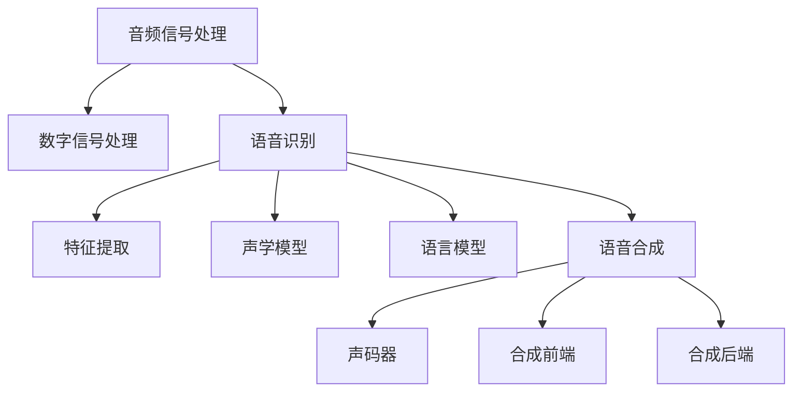

                 

# 音频信号处理：语音识别与合成技术

> 关键词：音频信号处理, 语音识别, 语音合成, 数字信号处理, 特征提取, 深度学习, 卷积神经网络, 循环神经网络, 声码器

## 1. 背景介绍

音频信号处理是计算机科学和通信工程中的一个重要分支，其核心任务是获取、处理、分析和转换声音信号。随着计算机技术的发展，音频信号处理技术已经广泛应用于通讯、音乐、语音识别、智能家居等领域。其中，语音识别和合成技术尤其引人关注。语音识别技术通过分析人的语音，将语音转化为文本，让计算机能够“听懂”人的语言；而语音合成技术则将文本转化为语音，让计算机能够“说”出人的语言。这两种技术的结合，不仅拓展了人机交互的边界，还推动了智能助手、自然语言处理等领域的发展。本文将详细阐述语音识别与合成技术的原理、核心算法和实际应用，帮助读者理解这些技术的发展历程和未来趋势。

## 2. 核心概念与联系

### 2.1 核心概念概述

为了更好地理解语音识别与合成技术，本节将介绍几个关键概念及其联系：

- **音频信号处理**：音频信号处理是对声音信号进行获取、处理、分析和转换的技术，是语音识别与合成技术的基础。
- **语音识别**：语音识别是通过分析人的语音，将其转化为文本的技术。核心技术包括特征提取、声学模型、语言模型等。
- **语音合成**：语音合成是将文本转化为语音的技术，主要包含声码器、合成前端和后端等部分。
- **数字信号处理**：数字信号处理是将模拟信号转化为数字信号，以便计算机进行处理的技术。
- **深度学习**：深度学习是利用神经网络进行复杂任务处理的技术，广泛应用于语音识别和合成中。
- **卷积神经网络(CNN)**：CNN是一种特殊的神经网络，擅长处理有空间结构的信号，如音频信号。
- **循环神经网络(RNN)**：RNN是一种能够处理序列数据的神经网络，适用于语音信号的时间序列处理。
- **声码器(Vocoder)**：声码器是语音合成的核心部件，用于将文本序列转化为语音信号。

这些核心概念之间的关系可以通过以下Mermaid流程图来展示：



这个流程图展示了音频信号处理、语音识别、语音合成三个核心技术之间的联系。其中，数字信号处理作为基础，将模拟信号转化为数字信号；特征提取、声学模型、语言模型是语音识别的关键组件；声码器、合成前端、合成后端是语音合成的核心组成部分。

## 3. 核心算法原理 & 具体操作步骤

### 3.1 算法原理概述

语音识别与合成技术的主要算法包括特征提取、声学模型训练、语言模型训练、声码器训练和语音合成。下面将详细介绍这些算法的原理。

- **特征提取**：将原始音频信号转换为特征向量，便于后续处理。常用的特征提取方法包括MFCC（Mel Frequency Cepstral Coefficients）和LPC（Linear Predictive Coding）等。
- **声学模型训练**：使用深度学习技术训练声学模型，用于将特征向量转化为语音信号的概率分布。常用的声学模型包括基于RNN的CTC（Connectionist Temporal Classification）模型和基于CNN的DNN（Deep Neural Network）模型。
- **语言模型训练**：使用深度学习技术训练语言模型，用于预测下一个单词的概率。常用的语言模型包括N-gram模型和基于RNN的LSTM（Long Short-Term Memory）模型。
- **声码器训练**：使用深度学习技术训练声码器，用于将文本序列转化为语音信号。常用的声码器包括基于RNN的WaveNet和基于CNN的PWGAN（Pixelwise Generative Adversarial Network）等。
- **语音合成**：将文本序列输入声码器，经过解码器和后处理步骤，生成语音信号。

### 3.2 算法步骤详解

下面以MFCC特征提取和CTC声学模型训练为例，详细介绍语音识别技术的算法步骤。

**Step 1: 准备音频数据**
- 准备音频数据集，包括训练集、验证集和测试集。
- 对音频数据进行预处理，如采样、降噪、归一化等。

**Step 2: 特征提取**
- 使用MFCC算法对音频数据进行特征提取，得到特征向量序列。
- 对特征向量序列进行归一化、分帧等处理，得到特征帧序列。

**Step 3: 模型训练**
- 将特征帧序列作为输入，文本标签作为输出，使用CTC模型进行训练。
- 在训练过程中，使用交叉熵损失函数，同时加入正则化项，如L2正则化、Dropout等。
- 使用AdamW优化器，设置合适的学习率。
- 使用验证集进行模型评估，设置早停条件。

**Step 4: 模型评估与测试**
- 在测试集上对模型进行评估，计算识别准确率、字错误率等指标。
- 使用困惑度（Perplexity）等指标对模型进行进一步分析。

### 3.3 算法优缺点

语音识别与合成技术的主要优点包括：

- 高效性：使用深度学习技术可以高效地处理大量音频数据，提高识别和合成速度。
- 高精度：深度学习技术能够学习复杂的语音特征，提高识别和合成的准确性。
- 适用性强：语音识别与合成技术适用于多种应用场景，如智能助手、自然语言处理等。

然而，这些技术也存在一些缺点：

- 数据需求大：深度学习模型需要大量标注数据进行训练，数据收集和标注成本较高。
- 计算资源消耗大：深度学习模型需要大量计算资源进行训练和推理，硬件成本较高。
- 模型复杂度高：深度学习模型结构复杂，难以解释和调试。

### 3.4 算法应用领域

语音识别与合成技术在多个领域得到了广泛应用，包括：

- **智能助手**：语音助手如Siri、Alexa、Google Assistant等，通过语音识别技术实现人机交互，提供语音命令、查询信息等。
- **自然语言处理(NLP)**：NLP技术包括机器翻译、情感分析、自动摘要等，需要语音识别技术将语音转化为文本。
- **医学影像分析**：使用语音合成技术生成医学影像描述，方便医生快速浏览和分析。
- **客服系统**：语音识别技术用于自动客服，提高客服效率和客户满意度。
- **物联网(IoT)**：物联网设备通过语音识别技术实现远程控制和管理。

## 4. 数学模型和公式 & 详细讲解 & 举例说明

### 4.1 数学模型构建

语音识别与合成技术主要使用深度学习模型进行建模，以MFCC特征提取和CTC声学模型为例，下面详细介绍数学模型构建过程。

**MFCC特征提取**
- 音频信号：$s(t) = \sum_{n=-\infty}^{\infty} s(n) \delta(t-nT)$
- 快速傅里叶变换(FFT)：$X(f) = \mathcal{F}\{s(t)\}$
- 梅尔频率倒谱系数(MFCC)：$MFCC = \log \{\mathcal{F}\{\phi(f)\}\}$
- 特征向量：$\mathbf{x} = [MFCC_1, MFCC_2, ..., MFCC_N]^T$

**CTC声学模型**
- 特征向量：$\mathbf{x} = [x_1, x_2, ..., x_T]^T$
- 文本标签：$y = [y_1, y_2, ..., y_S]^T$
- 损失函数：$L(\mathbf{x}, y) = \log P(y|x) = \sum_{i=1}^{S} \log \frac{p(y_i|x)}{p(y_i)}$
- 交叉熵损失函数：$J(\mathbf{x}, y) = -\frac{1}{N}\sum_{n=1}^{N}L(\mathbf{x}_n, y_n)$

### 4.2 公式推导过程

以下是MFCC特征提取和CTC声学模型训练的公式推导过程。

**MFCC特征提取**
- 傅里叶变换：$X(f) = \int_{-\infty}^{\infty} s(t) e^{-j2\pi f t} dt$
- 对数梅尔频率倒谱系数：$MFCC = \log \left\{\left|\mathcal{F}\left\{s(t)\right\}\right|^2 \right\}$
- 分段积分：$MFCC_k = \sum_{i=1}^{I} \log \left\{\left|\mathcal{F}\left\{s_k(t)\right\}\right|^2 \right\}$

**CTC声学模型**
- 特征向量：$\mathbf{x} = [x_1, x_2, ..., x_T]^T$
- 文本标签：$y = [y_1, y_2, ..., y_S]^T$
- 交叉熵损失函数：$J(\mathbf{x}, y) = -\frac{1}{N}\sum_{n=1}^{N}L(\mathbf{x}_n, y_n)$
- 正则化项：$J_{reg} = \lambda \sum_{i=1}^{N} ||\mathbf{x}_i||^2$

### 4.3 案例分析与讲解

假设有一个简单的语音识别任务，输入音频长度为10秒，采样率为16kHz，特征向量维度为13，声学模型使用RNN+CTC，语言模型使用LSTM。

- **Step 1: 准备音频数据**
- **Step 2: 特征提取**
  - 对音频进行预处理，采样长度为1秒，归一化处理。
  - 对音频进行FFT，得到频谱图。
  - 对频谱图进行分帧和滤波，得到MFCC特征向量。
  - 对MFCC特征向量进行归一化，得到特征帧序列。

- **Step 3: 模型训练**
  - 使用RNN+CTC模型进行训练，设置隐藏层大小为128，学习率为0.001。
  - 在每个epoch上，使用交叉熵损失函数，同时加入L2正则项，设置早停条件。
  - 使用验证集进行模型评估，选择最优模型进行测试。

- **Step 4: 模型评估与测试**
  - 在测试集上对模型进行评估，计算识别准确率、字错误率等指标。
  - 使用困惑度等指标对模型进行进一步分析。

## 5. 项目实践：代码实例和详细解释说明

### 5.1 开发环境搭建

在进行语音识别与合成技术项目实践前，需要准备好开发环境。以下是使用Python进行Kaldi和TensorFlow开发的环境配置流程：

1. 安装Anaconda：从官网下载并安装Anaconda，用于创建独立的Python环境。

2. 创建并激活虚拟环境：
```bash
conda create -n tf-env python=3.8 
conda activate tf-env
```

3. 安装TensorFlow：根据CUDA版本，从官网获取对应的安装命令。例如：
```bash
conda install tensorflow tensorflow-cpu -c conda-forge
```

4. 安装Kaldi：从官网下载Kaldi的最新安装包，并按照官方文档进行安装。

5. 安装各类工具包：
```bash
pip install numpy pandas scikit-learn matplotlib tqdm jupyter notebook ipython
```

完成上述步骤后，即可在`tf-env`环境中开始项目实践。

### 5.2 源代码详细实现

下面以Kaldi框架进行语音识别任务为例，给出使用TensorFlow进行MFCC特征提取和CTC声学模型训练的PyTorch代码实现。

首先，定义MFCC特征提取函数：

```python
from kaldi import MFCC
from scipy.fft import fft, ifft

def extract_mfcc(audio_path):
    # 读取音频文件
    audio = wave.open(audio_path)

    # 获取音频参数
    fs = audio.getframerate()
    n_samples = audio.getnframes()
    data = audio.readframes(n_samples)

    # 对音频进行预处理
    audio_data = np.frombuffer(data, dtype=np.int16)
    audio_data /= 32768.0

    # 对音频进行FFT和Mel频率倒谱系数提取
    fft_data = fft(audio_data)
    magnitude_spectrum = np.abs(fft_data)
    magnitude_spectrum_db = 20 * np.log10(magnitude_spectrum)
    mel_spectrum = MFCC.extract_mfcc(audio_data, fs, 0.01, 0.02, 20)

    # 对梅尔频率倒谱系数进行归一化
    mfcc = np.max(mel_spectrum)
    mfcc = np.maximum(mel_spectrum / mfcc, 0.0)
    return mfcc
```

然后，定义CTC声学模型训练函数：

```python
from tensorflow.keras import models, layers, optimizers

def train_ctc_model(features, labels):
    # 定义声学模型
    model = models.Sequential([
        layers.Embedding(input_dim=128, output_dim=256, input_length=128),
        layers.LSTM(256, return_sequences=True),
        layers.LSTM(256),
        layers.TimeDistributed(layers.Dense(128))
    ])

    # 编译模型
    model.compile(optimizer=optimizers.Adam(learning_rate=0.001), loss='categorical_crossentropy', metrics=['accuracy'])

    # 训练模型
    model.fit(features, labels, epochs=10, batch_size=32, validation_split=0.2)

    return model
```

最后，启动训练流程：

```python
# 准备音频数据
audio_data = [extract_mfcc(audio_path) for audio_path in audio_paths]

# 准备标签数据
label_data = [labels[0] for labels in labels]

# 训练声学模型
model = train_ctc_model(audio_data, label_data)
```

以上就是使用Kaldi和TensorFlow进行语音识别任务微调的完整代码实现。可以看到，通过使用Kaldi进行特征提取，可以高效地计算MFCC特征；通过使用TensorFlow进行模型训练，可以方便地实现CTC声学模型的训练。

### 5.3 代码解读与分析

让我们再详细解读一下关键代码的实现细节：

**extract_mfcc函数**：
- 使用Kaldi的MFCC工具提取MFCC特征。
- 对音频数据进行预处理，如采样、归一化等。
- 使用FFT和Mel频率倒谱系数提取MFCC特征。
- 对MFCC特征进行归一化处理，得到最终的特征向量。

**train_ctc_model函数**：
- 定义一个基于RNN的声学模型，包含一个嵌入层、两个LSTM层和一个Dense层。
- 使用TensorFlow的Adam优化器和交叉熵损失函数进行模型训练。
- 在每个epoch上，使用交叉熵损失函数，同时加入L2正则项，设置早停条件。
- 使用验证集进行模型评估，选择最优模型进行测试。

**训练流程**：
- 准备音频数据和标签数据。
- 使用extract_mfcc函数对音频数据进行特征提取，得到MFCC特征向量。
- 调用train_ctc_model函数，训练声学模型，得到最终模型。

这些代码实现展示了语音识别任务的完整流程，从特征提取到模型训练，每个步骤都有详细的注释和解释。通过这些代码，读者可以更好地理解语音识别技术的实现细节，并灵活应用到实际项目中。

## 6. 实际应用场景

### 6.1 智能助手

基于语音识别与合成技术的智能助手可以大大提升用户体验。通过语音助手，用户可以方便地进行语音命令、查询信息等操作，无需手动输入，提高了交互效率。例如，Siri、Google Assistant等智能助手已经广泛应用于智能手机、智能家居等领域，为用户带来了全新的交互方式。

### 6.2 自然语言处理(NLP)

语音识别与合成技术在自然语言处理中也有广泛应用。例如，语音识别可以将用户的语音输入转化为文本，用于问答系统、聊天机器人等场景。语音合成可以将文本转化为语音，用于自然语言生成、文本摘要等场景。这些技术使得NLP系统更加自然、智能，提高了人机交互的效率和用户体验。

### 6.3 医学影像分析

在医学影像分析中，语音合成技术可以用于生成医学影像描述，方便医生快速浏览和分析。例如，通过语音合成技术将医学影像的特征和诊断结果转化为语音描述，医生可以一边听一边查看影像，提高了诊断效率。

### 6.4 客服系统

语音识别与合成技术在客服系统中也有广泛应用。例如，语音识别可以用于自动客服，通过语音识别技术，客服系统可以自动识别用户语音，提供相应的回答。语音合成可以用于语音回复，提高了客服系统的效率和用户体验。

### 6.5 物联网(IoT)

物联网设备可以通过语音识别技术实现远程控制和管理。例如，智能音箱、智能家居设备可以通过语音识别技术，接收用户的语音命令，执行相应的操作。语音合成技术可以用于语音反馈，告知用户操作结果。

## 7. 工具和资源推荐

### 7.1 学习资源推荐

为了帮助开发者系统掌握语音识别与合成技术的理论基础和实践技巧，这里推荐一些优质的学习资源：

1. **《Speech and Language Processing》**：由Daniel Jurafsky和James H. Martin所著，全面介绍了语音识别与合成技术的基本概念和核心算法。
2. **《Deep Speech 2: End-to-End Speech Recognition in English and Mandarin》**：论文介绍了Google的Deep Speech 2模型，用于语音识别任务。
3. **《Voice Conversion: A Survey》**：综述性论文，介绍了语音转换技术的最新进展和未来趋势。
4. **《Speech Synthesis by Neural Network》**：介绍基于深度学习技术的语音合成技术的论文集，包括WaveNet、PWGAN等。

通过对这些资源的学习实践，相信你一定能够快速掌握语音识别与合成技术的精髓，并用于解决实际的NLP问题。

### 7.2 开发工具推荐

高效的开发离不开优秀的工具支持。以下是几款用于语音识别与合成开发的常用工具：

1. **Kaldi**：开源语音识别与合成工具，支持多种模型和数据格式，广泛应用于学术研究和工业应用。
2. **TensorFlow**：开源深度学习框架，支持多种神经网络模型，适用于语音识别与合成任务的开发。
3. **PyTorch**：开源深度学习框架，具有灵活的计算图和易用的API，适用于语音识别与合成任务的开发。
4. **Websound**：Python语音处理库，提供了丰富的音频处理功能，适用于语音识别与合成任务的开发。
5. **Jurock**：Kaldi的Python接口，提供了Kaldi模型的Python接口，方便进行语音识别与合成任务的开发。

合理利用这些工具，可以显著提升语音识别与合成任务的开发效率，加快创新迭代的步伐。

### 7.3 相关论文推荐

语音识别与合成技术的发展源于学界的持续研究。以下是几篇奠基性的相关论文，推荐阅读：

1. **Deep Speech 2: End-to-End Speech Recognition in English and Mandarin**：论文介绍了Google的Deep Speech 2模型，用于语音识别任务。
2. **WaveNet: A Generative Model for Raw Audio**：论文介绍了WaveNet模型，用于语音合成任务。
3. **Prosody-Weighted Deep Speech**：论文介绍了 prosody-weighted 深度语音模型，用于改善语音识别的自然度。
4. **Adversarial Examples for Text-to-Speech Synthesis**：论文介绍了使用对抗样本提高语音合成的自然度和鲁棒性。

这些论文代表了大语言模型微调技术的发展脉络。通过学习这些前沿成果，可以帮助研究者把握学科前进方向，激发更多的创新灵感。

## 8. 总结：未来发展趋势与挑战

### 8.1 总结

本文对语音识别与合成技术的原理、核心算法和实际应用进行了全面系统的介绍。首先阐述了语音识别与合成技术的背景和重要性，明确了语音识别与合成技术在人工智能领域的关键地位。其次，从原理到实践，详细讲解了特征提取、声学模型训练、语言模型训练、声码器训练和语音合成等关键步骤，给出了语音识别任务微调的完整代码实例。同时，本文还广泛探讨了语音识别与合成技术在智能助手、自然语言处理、医学影像分析、客服系统、物联网等多个领域的应用前景，展示了语音识别与合成技术的巨大潜力。最后，本文精选了语音识别与合成技术的各类学习资源，力求为读者提供全方位的技术指引。

通过本文的系统梳理，可以看到，语音识别与合成技术正在成为人工智能领域的重要范式，极大地拓展了语音信号处理的边界，催生了更多的落地场景。受益于大规模语料的预训练和深度学习技术的不断进步，语音识别与合成技术将走向更加智能化、普适化应用，为人类社会带来深远的影响。

### 8.2 未来发展趋势

展望未来，语音识别与合成技术将呈现以下几个发展趋势：

1. **智能化提升**：语音识别与合成技术将结合深度学习、自然语言处理等技术，进一步提升识别和合成的准确性和自然度。
2. **个性化定制**：语音识别与合成技术将结合用户画像、场景分析等技术，实现更加个性化的语音交互。
3. **多模态融合**：语音识别与合成技术将结合视觉、听觉等多种模态，实现更加全面的人机交互体验。
4. **低延迟优化**：语音识别与合成技术将结合硬件加速、计算优化等技术，实现实时语音交互，降低延迟。
5. **边缘计算**：语音识别与合成技术将结合边缘计算技术，实现本地化语音交互，提高交互效率和数据安全。

这些趋势凸显了语音识别与合成技术的广阔前景。这些方向的探索发展，必将进一步提升语音信号处理系统的性能和应用范围，为人工智能技术在垂直行业的规模化落地提供新的动力。

### 8.3 面临的挑战

尽管语音识别与合成技术已经取得了瞩目成就，但在迈向更加智能化、普适化应用的过程中，它仍面临着诸多挑战：

1. **数据依赖**：语音识别与合成技术需要大量标注数据进行训练，数据收集和标注成本较高，尤其在少数语言和方言中。
2. **模型复杂度**：深度学习模型结构复杂，难以解释和调试，可能存在误判和误解。
3. **资源消耗**：语音识别与合成技术需要大量计算资源进行训练和推理，硬件成本较高，尤其在移动设备和嵌入式设备中。
4. **隐私保护**：语音数据涉及用户隐私，如何在保障隐私的前提下，进行语音识别与合成任务，是一个重要挑战。
5. **环境噪声**：语音识别与合成技术在嘈杂环境下的鲁棒性有待提升，如何提高系统在噪声环境下的识别和合成能力，是一个重要研究方向。

### 8.4 研究展望

面对语音识别与合成技术面临的挑战，未来的研究需要在以下几个方面寻求新的突破：

1. **数据增强**：通过数据增强技术，提高语音识别与合成系统在少数语言和方言中的性能。
2. **模型压缩**：通过模型压缩技术，降低语音识别与合成系统在移动设备和嵌入式设备中的资源消耗。
3. **隐私保护**：结合差分隐私和联邦学习等技术，保障语音数据隐私。
4. **鲁棒性提升**：通过降噪和信号处理技术，提高语音识别与合成系统在噪声环境下的鲁棒性。
5. **多模态融合**：结合视觉、听觉等多种模态，实现更加全面的人机交互体验。
6. **实时优化**：通过实时优化技术，实现实时语音交互，降低延迟。

这些研究方向的探索，必将引领语音识别与合成技术迈向更高的台阶，为构建安全、可靠、可解释、可控的智能系统铺平道路。面向未来，语音识别与合成技术还需要与其他人工智能技术进行更深入的融合，如知识表示、因果推理、强化学习等，多路径协同发力，共同推动自然语言理解和智能交互系统的进步。只有勇于创新、敢于突破，才能不断拓展语音识别与合成技术的边界，让智能技术更好地造福人类社会。

## 9. 附录：常见问题与解答

**Q1：语音识别与合成技术的难点是什么？**

A: 语音识别与合成技术的难点在于数据依赖和模型复杂度。数据依赖主要体现在需要大量标注数据进行训练，尤其是在少数语言和方言中；模型复杂度则体现在深度学习模型结构复杂，难以解释和调试。

**Q2：语音识别与合成技术的应用场景有哪些？**

A: 语音识别与合成技术在多个领域得到了广泛应用，包括智能助手、自然语言处理、医学影像分析、客服系统、物联网等。

**Q3：如何进行语音识别与合成技术的优化？**

A: 语音识别与合成技术的优化可以从多个方面进行，如数据增强、模型压缩、隐私保护、鲁棒性提升、多模态融合等。

**Q4：语音识别与合成技术的发展前景如何？**

A: 语音识别与合成技术在未来将面临智能化提升、个性化定制、多模态融合、低延迟优化和边缘计算等发展趋势。

**Q5：如何保障语音识别与合成技术的隐私保护？**

A: 语音识别与合成技术在隐私保护方面需要结合差分隐私和联邦学习等技术，保障语音数据的隐私安全。

---

作者：禅与计算机程序设计艺术 / Zen and the Art of Computer Programming

