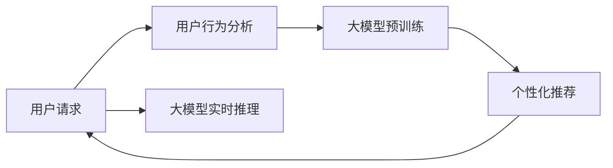

                 

## 1. 背景介绍

随着电子商务市场的迅速发展，商品种类繁多，用户需求复杂，如何为用户提供精准、实时的推荐，成为了电商平台运营的关键。传统的推荐系统基于用户的浏览历史、点击行为等静态数据，难以捕捉用户的瞬时需求与行为偏好。近年来，基于大规模预训练语言模型（如GPT、BERT等）的实时推荐系统（Real-time Recommendation System, RRS）逐步兴起，为电商平台的推荐算法注入了新活力。

本文将详细探讨基于大模型的实时推荐策略，深入理解其核心算法原理、具体操作步骤、优缺点及应用领域，并结合具体案例分析与讲解，以期为电商平台的推荐系统开发提供指导。

## 2. 核心概念与联系

### 2.1 核心概念概述

在深入讨论实时推荐策略之前，首先需要理解几个关键概念：

- **实时推荐系统 (Real-time Recommendation System, RRS)**：指能够实时响应用户行为，动态调整推荐结果的系统。相比于离线推荐系统，RRS 能够捕捉用户瞬时需求，提升用户体验和转化率。

- **大模型 (Large Model)**：指具有亿级参数规模的预训练语言模型，如 GPT、BERT 等。这些模型通过在海量文本数据上进行预训练，学习到丰富的语言知识，具备强大的理解能力和生成能力。

- **用户行为分析 (User Behavior Analysis)**：指对用户的浏览、点击、购买等行为数据进行分析和挖掘，以发现用户的兴趣和需求。

- **个性化推荐 (Personalized Recommendation)**：指根据用户的兴趣和行为，为其推荐可能感兴趣的商品，提高推荐的相关性和用户体验。

- **实时计算 (Real-time Computation)**：指在极短的时间内完成数据处理和计算，快速响应用户请求。

这些概念之间的联系体现在实时推荐系统通过大模型和用户行为分析，捕捉用户瞬时需求和行为偏好，动态调整推荐结果。其核心在于实时计算，以保持推荐的时效性和个性化。

### 2.2 核心概念原理和架构的 Mermaid 流程图



这个流程图展示了实时推荐系统的基本架构：

1. 用户请求：用户通过电商平台进行查询或浏览。
2. 用户行为分析：通过用户的实时行为数据，如搜索关键词、浏览轨迹等，分析用户当前的兴趣和需求。
3. 大模型预训练：预训练语言模型通过海量的文本数据学习语言知识。
4. 实时推理：将用户行为数据输入大模型，进行实时推理，生成推荐结果。
5. 个性化推荐：根据推理结果，推荐符合用户需求的商品。
6. 循环反馈：用户对推荐结果的反馈数据再次输入模型，进行迭代优化。

## 3. 核心算法原理 & 具体操作步骤

### 3.1 算法原理概述

基于大模型的实时推荐系统，主要通过以下步骤实现：

1. **用户行为抽取 (User Behavior Extraction)**：从用户行为数据中提取关键特征，如搜索关键词、浏览历史、点击行为等。
2. **大模型嵌入 (Model Embedding)**：将用户行为特征输入大模型，通过预训练学习到的语言知识生成向量表示。
3. **相似性计算 (Similarity Calculation)**：通过余弦相似度、欧氏距离等方法，计算推荐商品与用户行为向量之间的相似性。
4. **推荐排序 (Recommendation Ranking)**：基于相似性计算结果，对推荐商品进行排序，优先推荐与用户行为更匹配的商品。
5. **实时响应 (Real-time Response)**：在用户请求到达时，实时计算并返回推荐结果。

### 3.2 算法步骤详解

#### 3.2.1 用户行为抽取

用户行为抽取的目的是将用户的浏览、搜索、点击等行为转化为模型能够处理的特征向量。具体步骤如下：

1. **数据预处理**：清洗、归一化用户行为数据，去除无效或噪声信息。
2. **特征提取**：将清洗后的数据转换为向量形式，常用的方法包括词袋模型、TF-IDF、词嵌入等。
3. **特征融合**：将不同来源的用户行为数据进行融合，构建更加综合的特征向量。

#### 3.2.2 大模型嵌入

大模型嵌入是将用户行为特征输入预训练语言模型，生成向量表示的过程。具体步骤如下：

1. **选择模型**：选择适合任务的大模型，如 GPT-2、BERT、T5 等。
2. **特征编码**：将用户行为特征转化为模型可接受的格式，如词向量、句子向量等。
3. **模型推理**：将编码后的特征输入模型，进行前向传播计算，生成用户行为向量。

#### 3.2.3 相似性计算

相似性计算是评估推荐商品与用户行为之间的相似程度。常用的方法包括：

1. **余弦相似度 (Cosine Similarity)**：衡量两个向量之间的夹角余弦值，计算公式为 $\cos(\theta) = \frac{\mathbf{a} \cdot \mathbf{b}}{\|\mathbf{a}\| \cdot \|\mathbf{b}\|}$。
2. **欧氏距离 (Euclidean Distance)**：衡量两个向量在欧式空间中的距离，计算公式为 $\|\mathbf{a} - \mathbf{b}\|$。
3. **余弦损失 (Cosine Loss)**：用于衡量向量之间的余弦相似度，适用于二分类任务。

#### 3.2.4 推荐排序

推荐排序是将相似性计算结果转化为具体的推荐结果。常用的排序方法包括：

1. **基于排序的推荐 (Rank-based Recommendation)**：根据相似性计算结果，对推荐商品进行排序，优先推荐与用户行为更匹配的商品。
2. **基于加权的推荐 (Weight-based Recommendation)**：为不同特征设置权重，计算加权相似度，优化推荐结果。
3. **多模态推荐 (Multi-modal Recommendation)**：结合多种数据源，如用户行为、商品属性、社交网络等，构建更加全面的推荐模型。

#### 3.2.5 实时响应

实时响应是保证推荐系统快速响应用户请求的过程。具体步骤如下：

1. **系统架构设计**：设计高可扩展、高性能的系统架构，支持每秒数万次实时计算。
2. **高效计算引擎**：使用分布式计算、异步计算等技术，加速计算过程。
3. **缓存技术**：使用缓存技术，减少重复计算，提高响应速度。

### 3.3 算法优缺点

#### 3.3.1 优点

1. **高效实时**：能够快速响应用户请求，捕捉用户瞬时需求。
2. **个性化强**：通过大模型嵌入和相似性计算，生成个性化的推荐结果。
3. **可扩展性强**：支持高并发请求，具备良好扩展性。
4. **准确性高**：结合大模型的语言知识和用户行为分析，推荐结果准确性高。

#### 3.3.2 缺点

1. **计算资源需求高**：大模型的嵌入和相似性计算需要大量计算资源。
2. **数据质量依赖高**：推荐结果的质量依赖于用户行为数据的完整性和准确性。
3. **用户隐私问题**：用户行为数据的采集和存储可能涉及隐私问题，需要严格处理。
4. **动态变化适应性差**：难以适应用户需求和行为的变化，推荐结果可能出现偏差。

### 3.4 算法应用领域

基于大模型的实时推荐系统主要应用于以下领域：

- **电子商务**：为电商平台提供个性化推荐，提升用户购物体验和转化率。
- **内容推荐**：为内容平台（如视频、音乐等）推荐符合用户兴趣的内容。
- **广告投放**：为广告主推荐目标受众，提高广告点击率和转化率。
- **金融推荐**：为金融机构推荐理财产品和投资策略，优化用户投资体验。

## 4. 数学模型和公式 & 详细讲解 & 举例说明

### 4.1 数学模型构建

基于大模型的实时推荐系统可以通过以下数学模型构建：

1. **用户行为向量 (User Behavior Vector, \(\mathbf{u}\))**：表示用户的历史行为特征，如搜索关键词、浏览轨迹等。
2. **商品向量 (Item Vector, \(\mathbf{v}\))**：表示商品的属性特征，如商品名称、描述等。
3. **相似度矩阵 (Similarity Matrix, \(S\))**：表示用户行为向量与商品向量之间的相似度。

### 4.2 公式推导过程

#### 4.2.1 余弦相似度公式

余弦相似度公式如下：

$$
\cos(\theta) = \frac{\mathbf{u} \cdot \mathbf{v}}{\|\mathbf{u}\| \cdot \|\mathbf{v}\|}
$$

其中 $\mathbf{u}$ 和 $\mathbf{v}$ 分别表示用户行为向量和商品向量，$\cdot$ 表示向量点积，$\|\cdot\|$ 表示向量范数。

#### 4.2.2 欧氏距离公式

欧氏距离公式如下：

$$
\|\mathbf{u} - \mathbf{v}\| = \sqrt{\sum_{i=1}^n (u_i - v_i)^2}
$$

其中 $n$ 表示向量的维度，$u_i$ 和 $v_i$ 分别表示用户行为向量和商品向量在第 $i$ 维的值。

#### 4.2.3 余弦损失函数

余弦损失函数如下：

$$
L = -\log\sigma(\mathbf{u} \cdot \mathbf{v})
$$

其中 $\sigma$ 为sigmoid函数，$\cdot$ 表示向量点积。

### 4.3 案例分析与讲解

#### 4.3.1 案例背景

某电商平台希望提升用户的购物体验，通过实时推荐系统为用户推荐相关商品。平台选择了预训练模型GPT-2作为大模型嵌入的基础，使用余弦相似度计算用户行为与商品之间的相似度，进行实时推荐。

#### 4.3.2 数据准备

1. **用户行为数据**：从用户登录记录、搜索历史、浏览轨迹中提取特征，如搜索关键词、浏览时间、点击行为等。
2. **商品数据**：从商品库中提取商品的属性特征，如商品名称、描述、分类等。
3. **模型嵌入**：将用户行为特征和商品属性特征输入GPT-2模型，生成向量表示。

#### 4.3.3 相似度计算

使用余弦相似度计算用户行为向量与商品向量之间的相似度，生成相似度矩阵。

#### 4.3.4 推荐排序

基于相似度矩阵进行推荐排序，优先推荐与用户行为向量相似度高的商品。

#### 4.3.5 实时响应

使用缓存技术，将推荐结果缓存到内存中，快速响应用户请求。

## 5. 项目实践：代码实例和详细解释说明

### 5.1 开发环境搭建

1. **安装 Python 环境**：安装 Python 3.8 或更高版本，并创建虚拟环境。
2. **安装依赖库**：安装 TensorFlow、PyTorch、Pandas、Numpy 等库。
3. **搭建分布式计算环境**：使用 Kubernetes、Docker 等工具搭建分布式计算环境。

### 5.2 源代码详细实现

#### 5.2.1 用户行为数据预处理

```python
import pandas as pd

# 读取用户行为数据
user_data = pd.read_csv('user_behavior_data.csv')

# 清洗数据
user_data = user_data.dropna()

# 特征提取
user_data['search_keywords'] = user_data['search_keywords'].apply(lambda x: x.lower())

# 保存处理后的数据
user_data.to_csv('processed_user_data.csv', index=False)
```

#### 5.2.2 商品数据处理

```python
import pandas as pd

# 读取商品数据
item_data = pd.read_csv('item_data.csv')

# 特征提取
item_data['category'] = item_data['category'].apply(lambda x: x.lower())

# 保存处理后的数据
item_data.to_csv('processed_item_data.csv', index=False)
```

#### 5.2.3 模型嵌入

```python
import tensorflow as tf
from transformers import TFGPT2Tokenizer, TFGPT2Model

# 加载大模型
tokenizer = TFGPT2Tokenizer.from_pretrained('gpt2')
model = TFGPT2Model.from_pretrained('gpt2')

# 用户行为数据嵌入
user_data = pd.read_csv('processed_user_data.csv')
user_vectors = []
for index, row in user_data.iterrows():
    sequence = [tokenizer.encode(row['search_keywords'])]
    vector = model(input_ids=sequence, output_hidden_states=True).last_hidden_state[:, 0, :]
    user_vectors.append(vector)
user_vectors = tf.convert_to_tensor(user_vectors)

# 商品数据嵌入
item_data = pd.read_csv('processed_item_data.csv')
item_vectors = []
for index, row in item_data.iterrows():
    sequence = [tokenizer.encode(row['category'])]
    vector = model(input_ids=sequence, output_hidden_states=True).last_hidden_state[:, 0, :]
    item_vectors.append(vector)
item_vectors = tf.convert_to_tensor(item_vectors)
```

#### 5.2.4 相似度计算

```python
import numpy as np

# 计算相似度矩阵
similarity_matrix = np.dot(user_vectors, item_vectors.T)
similarity_matrix = similarity_matrix.numpy()
```

#### 5.2.5 推荐排序

```python
# 推荐排序
recommendations = np.argsort(similarity_matrix)[::-1]
```

### 5.3 代码解读与分析

- **用户行为数据预处理**：清洗、归一化用户行为数据，提取关键特征，如搜索关键词、浏览时间等。
- **商品数据处理**：清洗、归一化商品数据，提取关键特征，如商品名称、分类等。
- **模型嵌入**：使用GPT-2模型将用户行为特征和商品属性特征转换为向量表示。
- **相似度计算**：使用余弦相似度计算用户行为向量与商品向量之间的相似度。
- **推荐排序**：基于相似度计算结果，生成推荐排序列表。

### 5.4 运行结果展示

- **用户行为向量**：将用户搜索关键词转换为向量表示。
- **商品向量**：将商品分类转换为向量表示。
- **相似度矩阵**：生成用户行为向量与商品向量之间的相似度矩阵。
- **推荐结果**：基于相似度矩阵生成推荐排序列表。

## 6. 实际应用场景

### 6.1 智能客服

电商平台使用实时推荐系统，能够为用户推荐符合其浏览兴趣的商品，提高购物体验。智能客服系统结合实时推荐，能够快速响应用户查询，提供个性化建议，提升客户满意度。

### 6.2 商品推荐

实时推荐系统能够根据用户的浏览和搜索行为，动态调整推荐结果，提升商品推荐的相关性和用户体验。通过个性化推荐，提高用户转化率和平台收益。

### 6.3 个性化广告

广告主可以通过实时推荐系统，精准投放广告，提升广告点击率和转化率。实时推荐系统能够根据用户行为特征，生成个性化的广告推荐，提升广告效果。

## 7. 工具和资源推荐

### 7.1 学习资源推荐

1. **《深度学习理论与实践》系列课程**：详细讲解深度学习的基本概念和应用，包括推荐系统的设计与实现。
2. **《自然语言处理入门》在线课程**：介绍NLP的基本概念和常用技术，包括预训练语言模型和实时推荐系统的构建。
3. **《推荐系统》书籍**：系统讲解推荐系统的发展历程和实现方法，包括离线推荐和实时推荐系统的设计。
4. **《TensorFlow实战》书籍**：介绍TensorFlow的架构和应用，包括分布式计算和实时推荐系统的实现。
5. **HuggingFace官方文档**：提供Transformer等模型的详细使用方法，包括预训练和微调过程。

### 7.2 开发工具推荐

1. **TensorFlow**：强大的深度学习框架，支持分布式计算和实时推理。
2. **PyTorch**：灵活的深度学习框架，支持GPU加速和自动微分。
3. **TFGPT2Tokenizer和TFGPT2Model**：TensorFlow版本的GPT-2模型和分词器，支持大模型的嵌入和计算。
4. **TensorBoard**：用于监控和可视化模型训练过程，帮助开发者调试和优化模型。
5. **Kubernetes和Docker**：支持分布式计算和容器化部署，确保系统的高可用性和可扩展性。

### 7.3 相关论文推荐

1. **《Scalable Distributed Deep Learning》论文**：介绍分布式计算在深度学习中的应用，包括实时推荐系统的实现。
2. **《BigQuery and Big Data: When and Why》论文**：介绍大数据在推荐系统中的应用，包括实时推荐系统的设计。
3. **《Deep Reinforcement Learning for Personalized Recommendation》论文**：介绍强化学习在个性化推荐中的应用，包括实时推荐系统的优化。
4. **《An Overview of the Big Data Technologies for Recommendation Systems》论文**：介绍大数据技术在推荐系统中的应用，包括实时推荐系统的实现。

## 8. 总结：未来发展趋势与挑战

### 8.1 研究成果总结

基于大模型的实时推荐系统在电商推荐、智能客服、个性化广告等领域已取得显著成果，提升了用户体验和平台收益。

### 8.2 未来发展趋势

1. **多模态推荐**：结合多种数据源，如用户行为、商品属性、社交网络等，构建更加全面的推荐模型。
2. **实时计算优化**：优化分布式计算和缓存技术，提高实时推荐系统的响应速度和性能。
3. **用户行为分析改进**：通过机器学习和深度学习，提升用户行为分析和预测的准确性。
4. **隐私保护技术**：引入隐私保护技术，确保用户数据的安全和隐私保护。

### 8.3 面临的挑战

1. **计算资源需求高**：大模型的嵌入和相似性计算需要大量计算资源，如何优化计算过程是挑战之一。
2. **数据质量依赖高**：推荐结果的质量依赖于用户行为数据的完整性和准确性，数据处理和清洗是关键。
3. **动态变化适应性差**：难以适应用户需求和行为的变化，推荐结果可能出现偏差。

### 8.4 研究展望

未来的研究将聚焦于以下几个方向：

1. **多模态推荐技术**：结合多种数据源，提升推荐结果的全面性和准确性。
2. **实时计算优化技术**：优化计算引擎和缓存技术，提高推荐系统的响应速度和性能。
3. **用户行为分析技术**：引入机器学习和深度学习，提升用户行为分析和预测的准确性。
4. **隐私保护技术**：引入隐私保护技术，确保用户数据的安全和隐私保护。

综上所述，基于大模型的实时推荐系统在电商搜索推荐中具有广泛的应用前景，但同时也面临诸多挑战。未来的研究将通过多模态推荐、实时计算优化、用户行为分析和隐私保护等技术手段，提升推荐系统的性能和用户体验，实现个性化推荐系统的可持续发展。

## 9. 附录：常见问题与解答

**Q1：实时推荐系统如何捕捉用户瞬时需求？**

A: 实时推荐系统通过分析用户当前的浏览、搜索、点击等行为数据，捕捉用户的瞬时需求。例如，用户搜索关键词的变化可以反映其即时兴趣的变化。

**Q2：大模型嵌入和相似度计算是否需要高计算资源？**

A: 大模型嵌入和相似度计算确实需要高计算资源，但可以通过分布式计算和优化算法进行优化。例如，使用GPU加速、异步计算等技术可以显著提高计算效率。

**Q3：实时推荐系统如何处理用户隐私问题？**

A: 实时推荐系统需要严格处理用户隐私问题。通过匿名化、去标识化等技术，确保用户数据的安全和隐私保护。同时，需要遵守相关法律法规，如GDPR等。

**Q4：实时推荐系统如何优化计算过程？**

A: 实时推荐系统可以优化计算过程，通过分布式计算和缓存技术提高性能。例如，使用Kubernetes和Docker进行容器化部署，使用TensorBoard进行性能监控和优化。

**Q5：实时推荐系统如何提升推荐准确性？**

A: 实时推荐系统可以通过优化用户行为分析和相似度计算方法，提升推荐准确性。例如，使用深度学习模型预测用户行为，引入多模态数据融合技术。

---

作者：禅与计算机程序设计艺术 / Zen and the Art of Computer Programming

