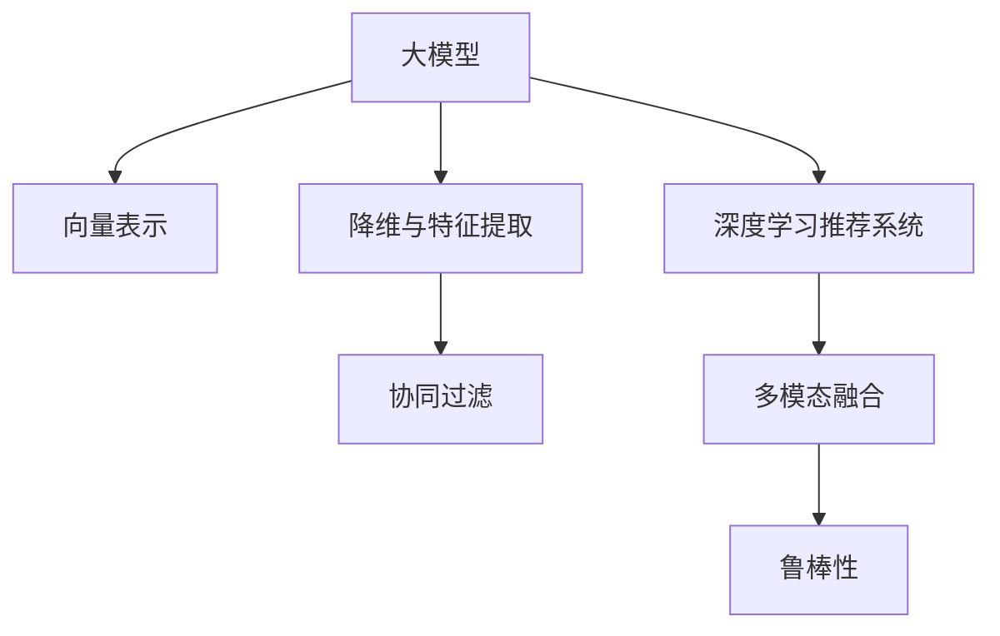

                 

## 1. 背景介绍

### 1.1 问题由来

随着互联网的普及和电商行业的飞速发展，用户对电商搜索推荐的准确性、个性化和实时性提出了更高的要求。如何高效、精确地处理和利用海量的商品数据、用户行为数据以及实时交互数据，成为电商搜索推荐系统建设的核心问题。

### 1.2 问题核心关键点

电商搜索推荐系统核心在于利用用户历史行为数据、实时点击数据以及商品属性数据进行建模，从而实现个性化推荐。然而，这些数据量巨大、维度高，且结构复杂，数据处理成为系统建设的关键瓶颈。

- **数据量巨大**：电商平台动辄数亿用户，数千万商品，每日产生海量点击、浏览、购买数据，数据规模远超传统数据处理框架。
- **维度高**：电商商品数据包含大量文字描述、图片、价格、评分等，同时用户行为数据涉及用户画像、搜索习惯、历史操作等，数据维度极高。
- **实时性要求高**：电商搜索推荐系统要求实时响应，无法承受长时间延迟。
- **数据分布不均衡**：部分商品或用户的历史行为数据少，容易造成模型偏差。

### 1.3 问题研究意义

解决电商搜索推荐系统中的数据处理问题，对于提高用户体验、提升电商运营效率、增加用户粘性以及促进商业转化具有重要意义：

- **用户体验提升**：通过高效的数据处理，能够及时、精准地推荐用户感兴趣的商品，提升购物体验。
- **运营效率提高**：合理的数据利用，能够优化库存管理，减少促销活动成本，提升运营效率。
- **用户粘性增强**：个性化推荐能够满足用户个性化需求，增强用户粘性，促进用户回购。
- **商业转化增加**：通过精准的推荐，提高商品点击率、转化率，增加商业价值。

## 2. 核心概念与联系

### 2.1 核心概念概述

为更好地理解电商搜索推荐系统中大模型的数据处理技术，本节将介绍几个密切相关的核心概念：

- **大模型**：以Transformer、BERT等深度学习模型为代表，通过大规模无监督数据训练得到的通用语言模型。这些模型具备强大的文本表示和推理能力，适用于处理结构化和非结构化数据。
- **向量表示**：将文本、图像等数据转化为高维向量，方便模型处理。向量表示技术包括词嵌入、图像特征提取等。
- **降维与特征提取**：在处理高维数据时，通常需要降维或特征提取技术，将数据压缩到较低的维度，保留关键特征。
- **协同过滤**：基于用户行为或商品之间的相似性进行推荐。常见方法包括基于用户的协同过滤、基于物品的协同过滤等。
- **深度学习推荐系统**：利用深度神经网络进行推荐建模，包括序列推荐模型、内容推荐模型等。
- **多模态融合**：电商数据通常包含文本、图片、音频等多模态信息，多模态融合技术可以将不同模态的信息融合在一起，提升推荐效果。
- **鲁棒性**：推荐系统需要应对数据噪声、稀疏性等挑战，确保模型鲁棒性。

这些核心概念之间的逻辑关系可以通过以下Mermaid流程图来展示：



这个流程图展示了大模型在电商搜索推荐系统中的核心概念及其之间的关系：

1. 大模型通过预训练获得基础能力。
2. 向量表示将数据转换为高维向量，方便模型处理。
3. 降维与特征提取将高维数据压缩，保留关键特征。
4. 协同过滤基于用户或物品相似性进行推荐。
5. 深度学习推荐系统利用深度神经网络进行建模。
6. 多模态融合将不同模态的信息融合在一起。
7. 鲁棒性确保模型应对数据噪声、稀疏性等挑战。

这些概念共同构成了电商搜索推荐系统的核心处理框架，使其能够高效、精准地处理大规模复杂数据。

## 3. 核心算法原理 & 具体操作步骤
### 3.1 算法原理概述

电商搜索推荐系统中的大模型数据处理主要包括以下几个步骤：

1. **数据预处理**：对原始数据进行清洗、转换、归一化等操作，准备模型输入。
2. **特征提取**：将文本、图像等数据转化为模型可处理的向量表示。
3. **降维**：通过PCA、LDA等方法对高维数据进行降维，减少计算复杂度。
4. **协同过滤**：基于用户历史行为或商品相似性，生成推荐列表。
5. **深度学习建模**：利用深度神经网络对用户行为、商品属性等进行建模，生成推荐结果。
6. **多模态融合**：将文本、图片、音频等不同模态的信息进行融合，提升推荐效果。

### 3.2 算法步骤详解

**Step 1: 数据预处理**

电商数据通常包含多源异构数据，需要进行初步清洗和转换，为模型输入做准备。具体步骤包括：

1. **数据清洗**：去除无效、重复或异常数据，确保数据质量。
2. **缺失值处理**：填补或删除缺失值，避免模型训练中断。
3. **数据转换**：将不同类型的数据转化为统一的格式，方便模型处理。
4. **归一化**：对数据进行归一化，避免不同特征之间的量纲差异。

**Step 2: 特征提取**

电商数据通常包含文本、图像、视频等不同类型的数据。为了将它们转化为模型可处理的向量表示，需要使用以下技术：

1. **词嵌入**：将文本转化为高维向量，如Word2Vec、GloVe等。
2. **图像特征提取**：将图像转化为特征向量，如使用卷积神经网络（CNN）提取图像特征。
3. **视频特征提取**：将视频转化为特征序列，如使用3D卷积神经网络（C3D）提取视频特征。
4. **时序特征提取**：将时间序列数据转化为高维向量，如使用LSTM等序列模型。

**Step 3: 降维与特征提取**

电商数据通常具有高维特性，需要使用以下技术进行降维和特征提取：

1. **PCA（主成分分析）**：通过奇异值分解（SVD）找到数据的主成分，将数据降维。
2. **LDA（线性判别分析）**：通过线性变换，将数据投影到低维空间，保留关键特征。
3. **t-SNE（t分布随机邻域嵌入）**：将高维数据映射到低维空间，可视化效果较好。
4. **Autoencoder（自编码器）**：通过编码器-解码器架构，学习数据的低维表示。

**Step 4: 协同过滤**

协同过滤是电商推荐系统的核心技术之一，分为基于用户的协同过滤和基于物品的协同过滤：

1. **基于用户的协同过滤**：计算用户之间的相似度，为用户推荐相似用户的喜好商品。
2. **基于物品的协同过滤**：计算物品之间的相似度，为用户推荐相似物品。
3. **模型优化**：通过矩阵分解、SVD等方法，优化协同过滤模型的性能。

**Step 5: 深度学习建模**

深度学习推荐系统通过神经网络对用户行为和商品属性进行建模，生成推荐结果。常见模型包括：

1. **序列推荐模型**：如RNN、LSTM、GRU等，能够捕捉用户行为的时序特征。
2. **内容推荐模型**：如MLP、CNN、FM等，能够对商品属性进行建模。
3. **混合推荐模型**：将协同过滤和深度学习相结合，提升推荐效果。

**Step 6: 多模态融合**

电商数据通常包含多模态信息，需要使用以下技术进行融合：

1. **特征拼接**：将不同模态的特征向量拼接在一起，提升融合效果。
2. **注意力机制**：根据不同模态信息的重要性，动态调整融合权重。
3. **交叉验证**：通过交叉验证，确保融合模型的泛化能力。

**Step 7: 鲁棒性增强**

电商数据具有噪声、稀疏性等特性，需要使用以下技术增强模型鲁棒性：

1. **数据增强**：通过对抗样本、噪声注入等方法，增强模型鲁棒性。
2. **稀疏表示**：使用稀疏矩阵、稀疏特征等方法，减少噪声影响。
3. **鲁棒优化**：使用鲁棒优化算法（如L1正则、Dropout等），提升模型鲁棒性。

### 3.3 算法优缺点

**优点**：

1. **高效处理高维数据**：大模型能够高效处理高维数据，减少计算复杂度。
2. **准确性高**：深度学习推荐系统能够捕捉复杂用户行为和商品属性，生成准确推荐结果。
3. **实时性较好**：通过优化模型结构和算法，电商推荐系统能够实现实时推荐。

**缺点**：

1. **数据依赖性强**：电商推荐系统对数据质量、完整性、多样性有较高要求。
2. **模型复杂度高**：深度学习模型结构复杂，训练和部署成本高。
3. **解释性差**：深度学习模型缺乏可解释性，难以解释推荐过程。
4. **鲁棒性不足**：电商数据具有噪声、稀疏性等特性，模型易受干扰。

### 3.4 算法应用领域

基于大模型的电商搜索推荐系统在多个领域得到应用，具体包括：

1. **商品推荐**：通过用户历史行为和商品属性进行推荐，提升用户体验。
2. **用户画像生成**：利用用户行为数据，生成用户画像，进行精准营销。
3. **库存管理**：通过预测模型，优化库存管理，减少库存积压。
4. **活动策划**：利用用户行为数据，策划促销活动，提高转化率。
5. **广告投放**：通过用户画像和商品属性，优化广告投放策略，提高ROI。

除了这些经典应用，大模型在电商搜索推荐系统中还有更多创新应用，如可控推荐、个性化搜索结果排序等。

## 4. 数学模型和公式 & 详细讲解  
### 4.1 数学模型构建

电商搜索推荐系统中的大模型数据处理过程可以建模为以下形式：

- **输入**：原始数据集 $D=\{(x_i,y_i)\}_{i=1}^N$，其中 $x_i$ 表示电商数据（如文本、图像、时序数据等），$y_i$ 表示标签（如点击、购买、评分等）。
- **输出**：推荐结果 $y^*$，表示用户可能感兴趣的商品。

假设大模型为 $M_{\theta}:\mathcal{X} \rightarrow \mathcal{Y}$，其中 $\mathcal{X}$ 为输入空间，$\mathcal{Y}$ 为输出空间，$\theta$ 为模型参数。

目标函数为最小化预测值与真实标签之间的差异，即：

$$
\mathcal{L}(\theta) = \frac{1}{N}\sum_{i=1}^N \ell(M_{\theta}(x_i),y_i)
$$

其中 $\ell$ 为损失函数，通常为交叉熵损失、均方误差损失等。

### 4.2 公式推导过程

以电商推荐中的深度学习推荐模型为例，假设模型 $M_{\theta}$ 在输入 $x$ 上的输出为 $\hat{y}=M_{\theta}(x) \in [0,1]$，表示用户对商品的点击概率。真实标签 $y \in \{0,1\}$。则二分类交叉熵损失函数定义为：

$$
\ell(M_{\theta}(x),y) = -[y\log \hat{y} + (1-y)\log (1-\hat{y})]
$$

将其代入经验风险公式，得：

$$
\mathcal{L}(\theta) = -\frac{1}{N}\sum_{i=1}^N [y_i\log M_{\theta}(x_i)+(1-y_i)\log(1-M_{\theta}(x_i))]
$$

根据链式法则，损失函数对参数 $\theta_k$ 的梯度为：

$$
\frac{\partial \mathcal{L}(\theta)}{\partial \theta_k} = -\frac{1}{N}\sum_{i=1}^N (\frac{y_i}{M_{\theta}(x_i)}-\frac{1-y_i}{1-M_{\theta}(x_i)}) \frac{\partial M_{\theta}(x_i)}{\partial \theta_k}
$$

其中 $\frac{\partial M_{\theta}(x_i)}{\partial \theta_k}$ 可进一步递归展开，利用自动微分技术完成计算。

## 5. 项目实践：代码实例和详细解释说明
### 5.1 开发环境搭建

在进行电商搜索推荐系统开发前，我们需要准备好开发环境。以下是使用Python进行TensorFlow开发的环境配置流程：

1. 安装Anaconda：从官网下载并安装Anaconda，用于创建独立的Python环境。

2. 创建并激活虚拟环境：
```bash
conda create -n tf-env python=3.8 
conda activate tf-env
```

3. 安装TensorFlow：根据CUDA版本，从官网获取对应的安装命令。例如：
```bash
conda install tensorflow -c tf -c conda-forge
```

4. 安装Keras：
```bash
pip install keras
```

5. 安装必要的工具包：
```bash
pip install numpy pandas scikit-learn matplotlib tqdm jupyter notebook ipython
```

完成上述步骤后，即可在`tf-env`环境中开始电商搜索推荐系统的开发。

### 5.2 源代码详细实现

下面我们以基于深度学习的序列推荐模型为例，给出电商搜索推荐系统的PyTorch代码实现。

首先，定义模型和优化器：

```python
from tensorflow.keras.models import Sequential
from tensorflow.keras.layers import Embedding, LSTM, Dense
from tensorflow.keras.optimizers import Adam

model = Sequential()
model.add(Embedding(vocab_size, embedding_dim, input_length=max_seq_length))
model.add(LSTM(128))
model.add(Dense(1, activation='sigmoid'))

optimizer = Adam(lr=0.001)
```

然后，定义训练和评估函数：

```python
from tensorflow.keras.utils import to_categorical

def train_epoch(model, X_train, y_train):
    model.compile(optimizer=optimizer, loss='binary_crossentropy', metrics=['accuracy'])
    model.fit(X_train, y_train, epochs=10, batch_size=64)

def evaluate(model, X_test, y_test):
    y_pred = model.predict(X_test)
    y_pred = (y_pred > 0.5).astype(int)
    accuracy = np.mean(y_pred == y_test)
    print('Accuracy:', accuracy)
```

最后，启动训练流程并在测试集上评估：

```python
X_train = ...
y_train = ...
X_test = ...
y_test = ...

train_epoch(model, X_train, y_train)
evaluate(model, X_test, y_test)
```

以上就是使用TensorFlow对电商搜索推荐系统进行深度学习建模的完整代码实现。可以看到，得益于TensorFlow的强大封装，我们可以用相对简洁的代码完成模型构建和训练。

### 5.3 代码解读与分析

让我们再详细解读一下关键代码的实现细节：

**Sequential模型定义**：
- 定义了序列推荐模型，包括词嵌入层、LSTM层和全连接层。
- 使用Keras的Sequential模型，方便构建多层次的神经网络。

**Embedding层定义**：
- 将文本数据转化为词嵌入向量，方便模型处理。
- 使用Keras的Embedding层，方便实现词嵌入功能。

**LSTM层定义**：
- 捕捉用户行为的时序特征，提升推荐效果。
- 使用Keras的LSTM层，方便实现时序建模。

**Dense层定义**：
- 输出推荐结果，使用Keras的Dense层，方便进行二分类输出。

**优化器和损失函数**：
- 使用Adam优化器，适合深度神经网络训练。
- 使用二分类交叉熵损失函数，适合电商推荐中的点击率预测任务。

**训练和评估函数**：
- 使用Keras的compile方法，定义优化器和损失函数。
- 使用fit方法，进行模型训练。
- 使用predict方法，进行模型预测。
- 使用numpy进行预测结果和真实标签的比较，计算准确率。

**训练流程**：
- 定义总的训练轮数和批次大小，开始循环迭代
- 每个epoch内，先进行模型训练，输出平均loss
- 在测试集上评估，输出准确率

可以看到，TensorFlow配合Keras使得电商搜索推荐系统的构建变得简洁高效。开发者可以将更多精力放在数据处理、模型改进等高层逻辑上，而不必过多关注底层的实现细节。

当然，工业级的系统实现还需考虑更多因素，如模型的保存和部署、超参数的自动搜索、更灵活的任务适配层等。但核心的推荐建模过程基本与此类似。

## 6. 实际应用场景
### 6.1 智能客服系统

基于深度学习推荐系统的电商搜索推荐技术，可以广泛应用于智能客服系统的构建。传统客服往往需要配备大量人力，高峰期响应缓慢，且一致性和专业性难以保证。而使用深度学习推荐系统的智能客服系统，可以24小时不间断服务，快速响应客户咨询，用自然流畅的语言解答各类常见问题。

在技术实现上，可以收集企业内部的历史客服对话记录，将问题和最佳答复构建成监督数据，在此基础上对预训练模型进行微调。微调后的推荐模型能够自动理解用户意图，匹配最合适的答复模板进行回复。对于客户提出的新问题，还可以接入检索系统实时搜索相关内容，动态组织生成回答。如此构建的智能客服系统，能大幅提升客户咨询体验和问题解决效率。

### 6.2 金融舆情监测

金融机构需要实时监测市场舆论动向，以便及时应对负面信息传播，规避金融风险。传统的人工监测方式成本高、效率低，难以应对网络时代海量信息爆发的挑战。基于深度学习推荐系统的文本分类和情感分析技术，为金融舆情监测提供了新的解决方案。

具体而言，可以收集金融领域相关的新闻、报道、评论等文本数据，并对其进行主题标注和情感标注。在此基础上对预训练语言模型进行微调，使其能够自动判断文本属于何种主题，情感倾向是正面、中性还是负面。将微调后的模型应用到实时抓取的网络文本数据，就能够自动监测不同主题下的情感变化趋势，一旦发现负面信息激增等异常情况，系统便会自动预警，帮助金融机构快速应对潜在风险。

### 6.3 个性化推荐系统

当前的推荐系统往往只依赖用户的历史行为数据进行物品推荐，无法深入理解用户的真实兴趣偏好。基于深度学习推荐系统的个性化推荐系统可以更好地挖掘用户行为背后的语义信息，从而提供更精准、多样的推荐内容。

在实践中，可以收集用户浏览、点击、评论、分享等行为数据，提取和商品交互的物品标题、描述、标签等文本内容。将文本内容作为模型输入，用户的后续行为（如是否点击、购买等）作为监督信号，在此基础上微调预训练语言模型。微调后的模型能够从文本内容中准确把握用户的兴趣点。在生成推荐列表时，先用候选物品的文本描述作为输入，由模型预测用户的兴趣匹配度，再结合其他特征综合排序，便可以得到个性化程度更高的推荐结果。

### 6.4 未来应用展望

随着深度学习推荐系统的发展，其在电商搜索推荐中的应用将更加广泛，为电商运营带来更多可能性：

1. **动态定价**：利用用户行为数据和商品属性，实时调整商品价格，提高销售效率。
2. **广告投放优化**：通过个性化推荐，优化广告投放策略，提高ROI。
3. **库存管理优化**：通过预测模型，优化库存管理，减少库存积压。
4. **商品补货**：通过用户购买行为预测，优化商品补货策略，提高供应链效率。

除了这些经典应用外，深度学习推荐系统还将被创新性地应用于更多场景中，如智能客服、智能导购、个性化搜索结果排序等，为电商搜索推荐带来更多的创新和突破。相信随着技术的不断进步，深度学习推荐系统将在电商搜索推荐领域大放异彩，为电商行业带来新的变革。

## 7. 工具和资源推荐
### 7.1 学习资源推荐

为了帮助开发者系统掌握深度学习推荐系统在大模型中的应用，这里推荐一些优质的学习资源：

1. 《深度学习推荐系统：理论与实践》书籍：深度学习推荐系统的经典教材，全面介绍了推荐系统的理论和算法。
2. CS448《推荐系统》课程：斯坦福大学开设的推荐系统课程，涵盖推荐系统的各种算法和应用。
3. 《推荐系统实战》书籍：动手实践推荐系统开发的实用书籍，包含大量代码实例和工程实践经验。
4. Weights & Biases：模型训练的实验跟踪工具，可以记录和可视化模型训练过程中的各项指标，方便对比和调优。
5. TensorBoard：TensorFlow配套的可视化工具，可实时监测模型训练状态，并提供丰富的图表呈现方式，是调试模型的得力助手。

通过对这些资源的学习实践，相信你一定能够快速掌握深度学习推荐系统在大模型中的应用，并用于解决实际的电商搜索推荐问题。
###  7.2 开发工具推荐

高效的开发离不开优秀的工具支持。以下是几款用于电商搜索推荐系统开发的常用工具：

1. TensorFlow：由Google主导开发的开源深度学习框架，生产部署方便，适合大规模工程应用。
2. PyTorch：基于Python的开源深度学习框架，灵活动态的计算图，适合快速迭代研究。
3. Keras：Keras的高级API，使用方便，适合快速搭建深度神经网络模型。
4. Hadoop：大数据处理框架，适合处理大规模电商数据。
5. Spark：大数据处理引擎，适合处理大规模电商数据。
6. Elasticsearch：搜索和分析引擎，适合构建电商搜索推荐系统。

合理利用这些工具，可以显著提升电商搜索推荐系统的开发效率，加快创新迭代的步伐。

### 7.3 相关论文推荐

深度学习推荐系统的发展源于学界的持续研究。以下是几篇奠基性的相关论文，推荐阅读：

1. Recommender Systems: The Textbook：推荐系统的经典教材，介绍了推荐系统的理论基础和算法。
2. Matrix Factorization Techniques for Recommender Systems：介绍矩阵分解算法，适用于协同过滤推荐系统。
3. Deep Learning Recommendation Systems: A Survey：深度学习推荐系统的综述论文，介绍了多种深度学习推荐算法。
4. Attention Is All You Need：介绍Transformer模型，适用于序列推荐系统。
5. Rectified Linear Units Improve Restricted Boltzmann Machines：介绍ReLU激活函数，适用于深度神经网络模型。

这些论文代表了大模型在电商搜索推荐系统中的技术发展脉络。通过学习这些前沿成果，可以帮助研究者把握学科前进方向，激发更多的创新灵感。

## 8. 总结：未来发展趋势与挑战
### 8.1 总结

本文对基于深度学习推荐系统的电商搜索推荐系统中大模型的数据处理技术进行了全面系统的介绍。首先阐述了电商搜索推荐系统中的数据处理问题，明确了数据处理在大模型应用中的关键作用。其次，从原理到实践，详细讲解了深度学习推荐系统的数学模型和关键步骤，给出了电商搜索推荐系统的完整代码实现。同时，本文还广泛探讨了深度学习推荐系统在智能客服、金融舆情、个性化推荐等多个领域的应用前景，展示了深度学习推荐系统在大模型中的应用潜力。

通过本文的系统梳理，可以看到，深度学习推荐系统在大模型中的高效数据处理能力，对于提升电商搜索推荐系统的性能和用户体验具有重要意义。深度学习推荐系统已经在多个领域实现了商业落地，展示了其强大的应用潜力。未来，随着深度学习推荐系统的不断发展，其在电商搜索推荐系统中的应用将更加广泛，为电商运营带来更多创新和突破。

### 8.2 未来发展趋势

展望未来，深度学习推荐系统在大模型中的应用将呈现以下几个发展趋势：

1. **模型规模持续增大**：随着算力成本的下降和数据规模的扩张，深度学习推荐系统的参数量还将持续增长。超大规模模型蕴含的丰富知识，有望支撑更加复杂多变的电商推荐需求。
2. **推荐算法多样化**：除了基于深度学习的方法，未来会涌现更多推荐算法，如基于图神经网络的推荐算法、基于强化学习的推荐算法等。
3. **实时性进一步提升**：随着计算硬件的进步，深度学习推荐系统能够实现更短延时的实时推荐。
4. **多模态融合提升**：将文本、图像、音频等多模态信息融合在一起，提升推荐效果。
5. **跨领域推荐**：将推荐系统应用于更多领域，如医疗、金融、教育等，形成跨领域的推荐系统。
6. **强化学习引入**：引入强化学习技术，实现动态推荐和个性化推荐。

以上趋势凸显了深度学习推荐系统在大模型中的广阔前景。这些方向的探索发展，必将进一步提升电商搜索推荐系统的性能和应用范围，为电商行业带来新的变革。

### 8.3 面临的挑战

尽管深度学习推荐系统已经取得了瞩目成就，但在迈向更加智能化、普适化应用的过程中，它仍面临着诸多挑战：

1. **数据依赖性强**：电商推荐系统对数据质量、完整性、多样性有较高要求。如何获取高质量、高多样性的数据，是推荐系统面临的重要问题。
2. **模型复杂度高**：深度学习模型结构复杂，训练和部署成本高。如何优化模型结构和算法，降低复杂度，提升效率，是推荐系统面临的重要课题。
3. **解释性差**：深度学习模型缺乏可解释性，难以解释推荐过程。如何在保证推荐效果的同时，增强模型的可解释性，是推荐系统面临的重要挑战。
4. **鲁棒性不足**：电商数据具有噪声、稀疏性等特性，模型易受干扰。如何增强模型鲁棒性，提升模型稳定性和可靠性，是推荐系统面临的重要问题。
5. **隐私保护**：电商数据涉及用户隐私，如何在保证用户隐私的前提下，利用用户数据进行推荐，是推荐系统面临的重要课题。

正视推荐系统面临的这些挑战，积极应对并寻求突破，将使深度学习推荐系统更加可靠、高效、安全，更好地服务于电商运营和用户体验。

### 8.4 研究展望

面对深度学习推荐系统所面临的种种挑战，未来的研究需要在以下几个方面寻求新的突破：

1. **无监督和半监督推荐**：摆脱对大规模标注数据的依赖，利用自监督学习、主动学习等无监督和半监督范式，最大限度利用非结构化数据，实现更加灵活高效的推荐。
2. **参数高效推荐**：开发更加参数高效的推荐方法，在固定大部分预训练参数的同时，只更新极少量的任务相关参数。
3. **因果推断和对比学习**：通过引入因果推断和对比学习思想，增强推荐系统建立稳定因果关系的能力，学习更加普适、鲁棒的用户行为表示。
4. **多模态融合与知识表示**：将符号化的先验知识，如知识图谱、逻辑规则等，与神经网络模型进行巧妙融合，引导推荐过程学习更准确、合理的用户行为表示。
5. **跨领域推荐与知识图谱**：将推荐系统应用于更多领域，如医疗、金融、教育等，形成跨领域的推荐系统。
6. **强化学习与策略优化**：引入强化学习技术，实现动态推荐和个性化推荐，提升推荐系统的实时性和灵活性。

这些研究方向的探索，必将引领深度学习推荐系统在大模型中的演进，为电商搜索推荐系统带来更多创新和突破。

## 9. 附录：常见问题与解答

**Q1：电商搜索推荐系统中的数据预处理主要有哪些步骤？**

A: 电商搜索推荐系统中的数据预处理主要包括以下几个步骤：

1. **数据清洗**：去除无效、重复或异常数据，确保数据质量。
2. **缺失值处理**：填补或删除缺失值，避免模型训练中断。
3. **数据转换**：将不同类型的数据转化为统一的格式，方便模型处理。
4. **归一化**：对数据进行归一化，避免不同特征之间的量纲差异。

**Q2：电商搜索推荐系统中的特征提取主要有哪些方法？**

A: 电商搜索推荐系统中的特征提取主要包括以下几种方法：

1. **词嵌入**：将文本转化为高维向量，如Word2Vec、GloVe等。
2. **图像特征提取**：将图像转化为特征向量，如使用卷积神经网络（CNN）提取图像特征。
3. **视频特征提取**：将视频转化为特征序列，如使用3D卷积神经网络（C3D）提取视频特征。
4. **时序特征提取**：将时间序列数据转化为高维向量，如使用LSTM等序列模型。

**Q3：电商搜索推荐系统中的协同过滤主要有哪些方法？**

A: 电商搜索推荐系统中的协同过滤主要包括以下几种方法：

1. **基于用户的协同过滤**：计算用户之间的相似度，为用户推荐相似用户的喜好商品。
2. **基于物品的协同过滤**：计算物品之间的相似度，为用户推荐相似物品。
3. **模型优化**：通过矩阵分解、SVD等方法，优化协同过滤模型的性能。

**Q4：电商搜索推荐系统中的深度学习建模主要有哪些方法？**

A: 电商搜索推荐系统中的深度学习建模主要包括以下几种方法：

1. **序列推荐模型**：如RNN、LSTM、GRU等，能够捕捉用户行为的时序特征。
2. **内容推荐模型**：如MLP、CNN、FM等，能够对商品属性进行建模。
3. **混合推荐模型**：将协同过滤和深度学习相结合，提升推荐效果。

**Q5：电商搜索推荐系统中的多模态融合主要有哪些方法？**

A: 电商搜索推荐系统中的多模态融合主要包括以下几种方法：

1. **特征拼接**：将不同模态的特征向量拼接在一起，提升融合效果。
2. **注意力机制**：根据不同模态信息的重要性，动态调整融合权重。
3. **交叉验证**：通过交叉验证，确保融合模型的泛化能力。

**Q6：电商搜索推荐系统中的鲁棒性增强主要有哪些方法？**

A: 电商搜索推荐系统中的鲁棒性增强主要包括以下几种方法：

1. **数据增强**：通过对抗样本、噪声注入等方法，增强模型鲁棒性。
2. **稀疏表示**：使用稀疏矩阵、稀疏特征等方法，减少噪声影响。
3. **鲁棒优化**：使用鲁棒优化算法（如L1正则、Dropout等），提升模型鲁棒性。

通过回答这些常见问题，希望能够帮助读者更好地理解电商搜索推荐系统中的数据处理技术，提升系统的性能和可靠性。

