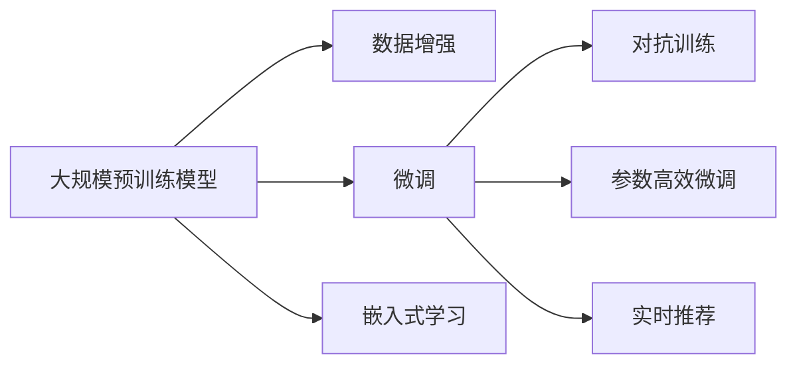

                 

## 1. 背景介绍

### 1.1 电商搜索推荐场景概述
电子商务行业的快速发展极大地改变了人们的购物习惯，而搜索推荐系统作为电商平台上不可或缺的一部分，极大地提高了用户的购物体验和转化率。搜索推荐系统能够根据用户的浏览历史、行为数据等，精准推荐用户感兴趣的商品，从而缩短购物决策时间，提升用户体验和商家销售额。

随着电商行业竞争的加剧，用户对个性化推荐的要求也越来越高。传统基于规则或特征工程的推荐方法已经无法满足用户多样化的需求。近年来，基于深度学习的大模型推荐方法逐渐兴起，并逐渐成为电商搜索推荐系统的主流技术。

### 1.2 大模型推荐的基本思路
大模型推荐系统，通常通过在大规模无标签数据上进行预训练，学习到丰富的特征表示，并根据下游任务的需求，在少量标注数据上进行微调，从而获得针对特定任务优化的推荐模型。具体而言，其基本流程如下：

1. **数据准备**：收集用户的历史行为数据、商品属性数据、商品描述文本等，构建输入特征。
2. **模型预训练**：使用大规模无标签数据对大模型进行预训练，使其学习到通用化的语言和图像表示。
3. **微调优化**：在特定任务的数据集上进行微调，例如商品推荐任务，通过标注数据调整模型参数，优化推荐结果。
4. **实时推荐**：将微调后的模型应用于实时推荐引擎，根据用户输入和当前上下文环境，预测并推荐符合用户兴趣的商品。

### 1.3 大模型推荐的核心要求
电商搜索推荐场景下的数据具有以下几个特点：

1. **数据量庞大**：电商平台需要处理大量的用户行为数据，这些数据往往以GB或TB的规模存在。
2. **数据类型多样**：除了文本数据，还有用户画像、商品属性、点击记录等各类数据，数据类型多样且结构复杂。
3. **实时性要求高**：实时推荐系统需要在毫秒级内完成计算和预测，对数据处理速度有极高的要求。
4. **高精度需求**：推荐系统需要准确预测用户的兴趣和行为，实现高精度推荐。

针对这些特点，大模型推荐系统需要具备强大的数据处理能力，以应对大规模复杂数据的挑战。

## 2. 核心概念与联系

### 2.1 核心概念概述

为更好地理解大模型在电商搜索推荐中的数据处理能力，本节将介绍几个密切相关的核心概念：

- **大模型(大规模预训练模型)**：如BERT、GPT-3等，通过在大规模无标签数据上进行预训练，学习到丰富的语言和图像表示。
- **微调(Fine-tuning)**：在大规模预训练模型的基础上，使用下游任务的数据进行有监督训练，优化模型参数，使其适应特定任务。
- **数据增强(Data Augmentation)**：通过数据变换、数据扩充等方法，增加训练数据的多样性，提高模型泛化能力。
- **对抗训练(Adversarial Training)**：引入对抗样本，提高模型对抗噪声和攻击的鲁棒性。
- **参数高效微调(Parameter-Efficient Fine-Tuning, PEFT)**：只更新模型的少量参数，保留大部分预训练权重，减小计算资源消耗。
- **嵌入式学习(Embedded Learning)**：将外部知识、规则等嵌入到模型中，增强模型的知识表达能力。

这些核心概念之间存在紧密的联系，通过在大规模无标签数据上进行预训练，学习到通用化的特征表示，通过微调和数据增强等方法，优化模型对特定任务的适应能力，从而实现高精度、实时性的推荐。

### 2.2 核心概念原理和架构的 Mermaid 流程图



此图展示了从预训练到实时推荐的大模型推荐系统的主要流程和关键环节。预训练模型通过数据增强和对抗训练获得更强的泛化能力和鲁棒性，通过微调和参数高效微调获得对特定任务的适应能力，最终在实时推荐系统中实现高精度的推荐。

## 3. 核心算法原理 & 具体操作步骤

### 3.1 算法原理概述

大模型推荐系统的核心算法原理可概述为：

1. **预训练阶段**：在大规模无标签数据上进行自监督预训练，学习通用化的语言和图像表示。
2. **微调阶段**：在标注数据上进行有监督微调，优化模型对特定任务的适应能力。
3. **实时推荐**：根据用户输入和上下文环境，通过微调后的模型进行实时推荐。

预训练阶段通常使用大规模语料库或图像库对大模型进行自监督预训练，学习到泛化的语言和图像表示。微调阶段则通过标注数据对模型进行有监督训练，使其适应特定任务的需求。实时推荐阶段根据用户输入和上下文环境，通过微调后的模型进行实时预测和推荐。

### 3.2 算法步骤详解

大模型推荐系统的算法步骤可详细分为以下几个阶段：

**Step 1: 数据预处理**

- **数据收集**：收集用户历史行为数据、商品属性数据、商品描述文本等，构建输入特征。
- **数据清洗**：处理缺失值、异常值等，保证数据质量。
- **数据划分**：将数据划分为训练集、验证集和测试集，用于模型训练、验证和测试。

**Step 2: 预训练**

- **模型选择**：选择合适的预训练模型，如BERT、GPT-3等。
- **预训练任务**：使用大规模语料库或图像库进行预训练，例如使用语言模型的掩码预测任务、自监督视觉表示学习等。
- **预训练流程**：在预训练数据上进行迭代训练，优化模型参数，提升预训练效果。

**Step 3: 微调**

- **模型适配**：根据特定推荐任务，设计合适的输出层和损失函数。
- **训练过程**：在标注数据集上进行微调训练，更新模型参数。
- **优化策略**：选择合适的优化算法、学习率、批大小等，避免过拟合。

**Step 4: 实时推荐**

- **模型部署**：将微调后的模型部署到实时推荐系统中。
- **推理流程**：根据用户输入和上下文环境，进行实时预测和推荐。
- **反馈机制**：根据用户反馈，不断优化推荐结果和模型参数。

### 3.3 算法优缺点

大模型推荐系统的优点包括：

1. **通用性强**：预训练模型能够学习到通用化的特征表示，适应多种推荐任务。
2. **性能优越**：通过微调优化，模型能够实现高精度的推荐结果。
3. **扩展性高**：适用于大规模数据，能够处理海量用户行为数据。
4. **实时性强**：通过优化推理流程，能够在毫秒级完成推荐计算。

其缺点包括：

1. **资源消耗大**：预训练模型和微调过程需要大量的计算资源和时间。
2. **数据依赖性高**：模型性能依赖于标注数据的质量和数量。
3. **解释性差**：大模型推荐系统通常是一个"黑盒"模型，难以解释推荐结果的原因。

### 3.4 算法应用领域

大模型推荐系统已经在电商搜索推荐、视频推荐、新闻推荐等多个领域得到了广泛应用，并在多个任务上取得了优异的效果。例如：

- **电商搜索推荐**：根据用户历史行为数据，推荐相关商品。
- **视频推荐**：根据用户观看历史，推荐相关视频内容。
- **新闻推荐**：根据用户阅读历史，推荐相关新闻资讯。
- **智能客服**：通过用户输入和上下文环境，推荐自动回复模板。

## 4. 数学模型和公式 & 详细讲解 & 举例说明

### 4.1 数学模型构建

大模型推荐系统的数学模型构建如下：

- **输入数据**：记输入数据为 $x_i$，其中 $i$ 表示样本序号。输入数据可以是用户行为数据、商品属性数据、商品描述文本等。
- **预训练模型**：记预训练模型为 $M_{\theta}$，其中 $\theta$ 为预训练参数。
- **微调参数**：记微调参数为 $\phi$，表示在特定推荐任务上进行微调的参数。

### 4.2 公式推导过程

以电商搜索推荐任务为例，设推荐结果为 $y$，模型输出为 $f(x; \theta)$，推荐任务为分类任务，则推荐任务的目标函数可以表示为：

$$
\mathcal{L}(y, f(x; \theta)) = -\log f(y; x; \theta)
$$

其中，$f(y; x; \theta)$ 为模型在输入 $x$ 下的预测输出，$y$ 为真实标签。目标函数表示对模型预测输出 $f(y; x; \theta)$ 进行负对数似然损失计算。

### 4.3 案例分析与讲解

以一个简单的电商搜索推荐系统为例，说明如何在大模型上进行微调。

假设输入为用户浏览的历史商品数据 $x$，输出为推荐商品 $y$。可以通过预训练模型 $M_{\theta}$ 对输入 $x$ 进行特征提取，得到表示向量 $z = M_{\theta}(x)$。然后通过微调参数 $\phi$，训练一个线性分类器，输出推荐商品的概率 $p(y; z; \phi)$，即：

$$
p(y; z; \phi) = \text{softmax}(\phi^T \cdot z)
$$

其中，$\phi$ 为微调参数向量，$\cdot$ 表示向量点乘，$\text{softmax}$ 表示对输出向量进行归一化，使其满足概率分布。

通过在标注数据集上进行微调，更新 $\phi$，优化模型参数，使得模型能够准确预测推荐结果，即：

$$
\min_{\phi} \mathcal{L}(y, p(y; z; \phi))
$$

具体实现时，可以使用交叉熵损失函数，对每个样本进行微调，更新 $\phi$。

## 5. 项目实践：代码实例和详细解释说明

### 5.1 开发环境搭建

进行大模型推荐系统开发，首先需要搭建开发环境。以下是使用Python进行PyTorch开发的环境配置流程：

1. 安装Anaconda：从官网下载并安装Anaconda，用于创建独立的Python环境。
2. 创建并激活虚拟环境：
```bash
conda create -n pytorch-env python=3.8 
conda activate pytorch-env
```

3. 安装PyTorch：根据CUDA版本，从官网获取对应的安装命令。例如：
```bash
conda install pytorch torchvision torchaudio cudatoolkit=11.1 -c pytorch -c conda-forge
```

4. 安装Transformers库：
```bash
pip install transformers
```

5. 安装各类工具包：
```bash
pip install numpy pandas scikit-learn matplotlib tqdm jupyter notebook ipython
```

完成上述步骤后，即可在`pytorch-env`环境中开始推荐系统开发。

### 5.2 源代码详细实现

以下是一个简单的电商搜索推荐系统的PyTorch代码实现：

首先，定义推荐任务的数据处理函数：

```python
from transformers import BertTokenizer
from torch.utils.data import Dataset
import torch

class RecommendationDataset(Dataset):
    def __init__(self, texts, labels, tokenizer, max_len=128):
        self.texts = texts
        self.labels = labels
        self.tokenizer = tokenizer
        self.max_len = max_len
        
    def __len__(self):
        return len(self.texts)
    
    def __getitem__(self, item):
        text = self.texts[item]
        label = self.labels[item]
        
        encoding = self.tokenizer(text, return_tensors='pt', max_length=self.max_len, padding='max_length', truncation=True)
        input_ids = encoding['input_ids'][0]
        attention_mask = encoding['attention_mask'][0]
        
        # 对label进行one-hot编码
        encoded_labels = torch.tensor([[label == 1]], dtype=torch.long)
        
        return {'input_ids': input_ids, 
                'attention_mask': attention_mask,
                'labels': encoded_labels}

# 创建dataset
tokenizer = BertTokenizer.from_pretrained('bert-base-cased')

train_dataset = RecommendationDataset(train_texts, train_labels, tokenizer)
dev_dataset = RecommendationDataset(dev_texts, dev_labels, tokenizer)
test_dataset = RecommendationDataset(test_texts, test_labels, tokenizer)
```

然后，定义模型和优化器：

```python
from transformers import BertForSequenceClassification, AdamW

model = BertForSequenceClassification.from_pretrained('bert-base-cased', num_labels=2)

optimizer = AdamW(model.parameters(), lr=2e-5)
```

接着，定义训练和评估函数：

```python
from torch.utils.data import DataLoader
from tqdm import tqdm
from sklearn.metrics import accuracy_score

device = torch.device('cuda') if torch.cuda.is_available() else torch.device('cpu')
model.to(device)

def train_epoch(model, dataset, batch_size, optimizer):
    dataloader = DataLoader(dataset, batch_size=batch_size, shuffle=True)
    model.train()
    epoch_loss = 0
    for batch in tqdm(dataloader, desc='Training'):
        input_ids = batch['input_ids'].to(device)
        attention_mask = batch['attention_mask'].to(device)
        labels = batch['labels'].to(device)
        model.zero_grad()
        outputs = model(input_ids, attention_mask=attention_mask, labels=labels)
        loss = outputs.loss
        epoch_loss += loss.item()
        loss.backward()
        optimizer.step()
    return epoch_loss / len(dataloader)

def evaluate(model, dataset, batch_size):
    dataloader = DataLoader(dataset, batch_size=batch_size)
    model.eval()
    preds, labels = [], []
    with torch.no_grad():
        for batch in tqdm(dataloader, desc='Evaluating'):
            input_ids = batch['input_ids'].to(device)
            attention_mask = batch['attention_mask'].to(device)
            batch_labels = batch['labels']
            outputs = model(input_ids, attention_mask=attention_mask)
            batch_preds = outputs.logits.argmax(dim=1).to('cpu').tolist()
            batch_labels = batch_labels.to('cpu').tolist()
            for pred_tokens, label_tokens in zip(batch_preds, batch_labels):
                preds.append(pred_tokens[:len(label_tokens)])
                labels.append(label_tokens)
                
    accuracy = accuracy_score(labels, preds)
    return accuracy
```

最后，启动训练流程并在测试集上评估：

```python
epochs = 5
batch_size = 16

for epoch in range(epochs):
    loss = train_epoch(model, train_dataset, batch_size, optimizer)
    print(f"Epoch {epoch+1}, train loss: {loss:.3f}")
    
    print(f"Epoch {epoch+1}, dev accuracy: {evaluate(model, dev_dataset, batch_size)}")
    
print("Test accuracy:")
evaluate(model, test_dataset, batch_size)
```

以上就是使用PyTorch对BERT进行电商搜索推荐任务微调的完整代码实现。可以看到，得益于Transformers库的强大封装，我们可以用相对简洁的代码完成BERT模型的加载和微调。

### 5.3 代码解读与分析

让我们再详细解读一下关键代码的实现细节：

**RecommendationDataset类**：
- `__init__`方法：初始化文本、标签、分词器等关键组件。
- `__len__`方法：返回数据集的样本数量。
- `__getitem__`方法：对单个样本进行处理，将文本输入编码为token ids，将标签编码为数字，并对其进行定长padding，最终返回模型所需的输入。

**模型定义**：
- `BertForSequenceClassification`：用于分类任务的BERT模型，输出一个softmax概率分布。
- `AdamW`：优化器，学习率为2e-5。

**训练和评估函数**：
- 使用PyTorch的DataLoader对数据集进行批次化加载，供模型训练和推理使用。
- `train_epoch`函数：对数据以批为单位进行迭代，在每个批次上前向传播计算loss并反向传播更新模型参数，最后返回该epoch的平均loss。
- `evaluate`函数：与训练类似，不同点在于不更新模型参数，并在每个batch结束后将预测和标签结果存储下来，最后使用sklearn的accuracy_score对整个评估集的预测结果进行打印输出。

**训练流程**：
- 定义总的epoch数和batch size，开始循环迭代
- 每个epoch内，先在训练集上训练，输出平均loss
- 在验证集上评估，输出准确率
- 重复上述步骤直至收敛
- 在测试集上评估，给出最终测试结果

可以看到，PyTorch配合Transformers库使得BERT微调的代码实现变得简洁高效。开发者可以将更多精力放在数据处理、模型改进等高层逻辑上，而不必过多关注底层的实现细节。

当然，工业级的系统实现还需考虑更多因素，如模型的保存和部署、超参数的自动搜索、更灵活的任务适配层等。但核心的微调范式基本与此类似。

## 6. 实际应用场景

### 6.1 智能客服系统

智能客服系统能够有效提升客服工作效率，提高客户满意度。电商平台的智能客服系统可以结合预训练语言模型和大模型推荐方法，实现更加智能化的客服体验。

在实现上，可以收集用户的客服历史对话记录，将这些对话记录作为监督数据，训练预训练语言模型。然后，在实际客服场景中，将用户输入的语句输入到微调后的语言模型中，得到意图标签和实体识别结果，再结合商品推荐模型，给出推荐的商品和服务，实现个性化智能客服。

### 6.2 个性化推荐系统

电商平台的个性化推荐系统需要根据用户的历史行为数据，推荐符合用户兴趣的商品。结合预训练语言模型和大模型推荐方法，可以更好地理解用户需求，提高推荐精度。

在实现上，可以收集用户浏览、点击、购买等行为数据，将这些数据作为输入特征。通过预训练语言模型提取用户文本数据的语义信息，通过大模型推荐方法，训练推荐模型，实现高精度个性化推荐。

### 6.3 实时广告投放系统

电商平台的实时广告投放系统需要根据用户的实时行为数据，精准投放广告。结合预训练语言模型和大模型推荐方法，可以更好地理解用户需求，提高广告投放效果。

在实现上，可以收集用户的实时行为数据，如浏览历史、点击行为等。通过预训练语言模型提取用户文本数据的语义信息，通过大模型推荐方法，训练推荐模型，实现实时精准广告投放。

### 6.4 未来应用展望

随着大模型推荐技术的发展，其将在更多领域得到应用，为各行各业带来新的变革。

1. **智能医疗**：结合预训练语言模型和大模型推荐方法，可以为医生提供智能辅助诊断，提高诊疗效率。
2. **智慧金融**：结合预训练语言模型和大模型推荐方法，可以为投资者提供智能投资建议，优化投资决策。
3. **智能制造**：结合预训练语言模型和大模型推荐方法，可以为生产车间提供智能设备监控和维护建议，提高生产效率。
4. **智能交通**：结合预训练语言模型和大模型推荐方法，可以为交通管理提供智能路线规划和事故预测，提高交通效率和安全性。

总之，大模型推荐技术的应用前景广阔，将深刻改变各行业的运营模式，推动经济社会发展。

## 7. 工具和资源推荐

### 7.1 学习资源推荐

为了帮助开发者系统掌握大模型推荐技术的理论基础和实践技巧，这里推荐一些优质的学习资源：

1. 《深度学习与自然语言处理》课程：清华大学开设的深度学习与NLP系列课程，涵盖从基础知识到深度学习、自然语言处理等多方面内容。
2. 《自然语言处理》书籍：清华大学出版社出版的《自然语言处理》教材，全面介绍了NLP的基础知识和前沿技术。
3. 《Transformers与深度学习》书籍：O'Reilly出版社出版的《Transformers与深度学习》，深入讲解了Transformer模型的原理和应用。
4. 《PyTorch深度学习实战》书籍：O'Reilly出版社出版的《PyTorch深度学习实战》，详细介绍了PyTorch的使用方法和实践技巧。

### 7.2 开发工具推荐

大模型推荐系统的开发需要借助多种工具，以下是几款常用的开发工具：

1. PyTorch：基于Python的深度学习框架，灵活的计算图机制，适合快速迭代研究。
2. TensorFlow：由Google主导开发的深度学习框架，生产部署方便，适合大规模工程应用。
3. HuggingFace Transformers库：提供了大量的预训练语言模型和微调接口，简化模型开发过程。
4. Weights & Biases：模型训练的实验跟踪工具，可以记录和可视化模型训练过程中的各项指标。
5. TensorBoard：TensorFlow配套的可视化工具，可以实时监测模型训练状态，提供丰富的图表呈现方式。

### 7.3 相关论文推荐

大模型推荐技术的发展源于学界的持续研究。以下是几篇奠基性的相关论文，推荐阅读：

1. Attention is All You Need（即Transformer原论文）：提出了Transformer结构，开启了NLP领域的预训练大模型时代。
2. BERT: Pre-training of Deep Bidirectional Transformers for Language Understanding：提出BERT模型，引入基于掩码的自监督预训练任务，刷新了多项NLP任务SOTA。
3. Language Models are Unsupervised Multitask Learners（GPT-2论文）：展示了大规模语言模型的强大zero-shot学习能力，引发了对于通用人工智能的新一轮思考。
4. Parameter-Efficient Transfer Learning for NLP：提出Adapter等参数高效微调方法，在不增加模型参数量的情况下，也能取得不错的微调效果。
5. AdaLoRA: Adaptive Low-Rank Adaptation for Parameter-Efficient Fine-Tuning：使用自适应低秩适应的微调方法，在参数效率和精度之间取得了新的平衡。

这些论文代表了大模型推荐技术的发展脉络。通过学习这些前沿成果，可以帮助研究者把握学科前进方向，激发更多的创新灵感。

## 8. 总结：未来发展趋势与挑战

### 8.1 总结

本文对大模型推荐系统在电商搜索推荐中的数据处理能力进行了全面系统的介绍。首先阐述了电商搜索推荐场景的特点和需求，明确了大模型推荐系统在该场景下的优势和挑战。其次，从原理到实践，详细讲解了基于大模型推荐系统的算法流程、关键技术和应用方法。最后，给出了大模型推荐系统的未来发展趋势和面临的挑战，为相关研究和实践提供了有益的参考。

通过本文的系统梳理，可以看到，基于大模型推荐系统已经在电商搜索推荐领域取得了显著效果，未来仍有很大的发展潜力。尽管面临数据量庞大、类型多样、实时性要求高等挑战，但通过算法优化和资源调优，这些问题都将逐步得到解决。

### 8.2 未来发展趋势

展望未来，大模型推荐技术将呈现以下几个发展趋势：

1. **数据融合技术的发展**：随着更多数据源的引入，数据融合技术将逐步成熟，实现更加全面、准确的数据建模。
2. **跨模态推荐技术的发展**：结合视觉、语音、文本等多种数据类型，实现更加全面、智能的推荐系统。
3. **知识图谱嵌入技术的发展**：将外部知识、规则等嵌入到模型中，增强模型的知识表达能力，提升推荐精度。
4. **对抗攻击与防御技术的发展**：对抗攻击与防御技术将进一步发展，提高推荐系统的鲁棒性和安全性。
5. **实时推荐系统的发展**：实时推荐系统将进一步优化，实现毫秒级推荐响应，提升用户体验。

### 8.3 面临的挑战

尽管大模型推荐系统已经取得了显著效果，但在迈向更加智能化、普适化应用的过程中，它仍面临诸多挑战：

1. **数据质量与量级问题**：电商搜索推荐系统需要处理大规模用户行为数据，如何确保数据的完整性、准确性和时效性，是一个重要问题。
2. **模型可解释性问题**：大模型推荐系统通常是一个"黑盒"模型，难以解释推荐结果的原因，影响用户体验和信任度。
3. **计算资源消耗问题**：大规模预训练和微调过程需要大量的计算资源，如何高效利用计算资源，是一个重要问题。
4. **对抗攻击与防御问题**：对抗攻击与防御技术将随着大模型推荐系统的普及而成为重要研究方向，如何提升系统的鲁棒性和安全性，是一个重要问题。

### 8.4 研究展望

面对大模型推荐系统面临的挑战，未来的研究需要在以下几个方面寻求新的突破：

1. **高效数据处理与清洗技术**：开发高效的数据清洗与融合技术，提升数据处理效率和准确性。
2. **可解释性增强技术**：引入可解释性技术，如因果推断、符号化推理等，提高推荐系统的透明性和用户信任度。
3. **资源优化与迁移学习**：开发高效的模型压缩、稀疏化等技术，提升模型性能和计算效率，同时开发基于迁移学习的微调方法，减少计算资源消耗。
4. **对抗攻击与防御技术**：开发先进的对抗攻击与防御技术，提升推荐系统的鲁棒性和安全性。

这些研究方向的探索，必将引领大模型推荐技术迈向更高的台阶，为构建安全、可靠、可解释、可控的推荐系统铺平道路。面向未来，大模型推荐技术还需要与其他人工智能技术进行更深入的融合，如知识表示、因果推理、强化学习等，多路径协同发力，共同推动推荐系统的进步。只有勇于创新、敢于突破，才能不断拓展推荐系统的边界，让智能技术更好地造福人类社会。

## 9. 附录：常见问题与解答

**Q1：电商搜索推荐系统为什么需要大模型推荐技术？**

A: 电商搜索推荐系统需要根据用户的历史行为数据，推荐符合用户兴趣的商品。传统基于规则或特征工程的推荐方法已经无法满足用户多样化的需求。相比之下，大模型推荐系统通过学习大规模语料库中的语言表示，能够更准确地理解用户的意图和需求，实现高精度推荐。此外，大模型推荐系统具有泛化能力强、适应任务多样、计算资源消耗低等优点，更适合电商搜索推荐场景。

**Q2：电商搜索推荐系统中的预训练模型应该如何选择？**

A: 电商搜索推荐系统中的预训练模型应该具备以下特点：
1. 泛化能力强：能够学习到通用的语言表示，适应多种推荐任务。
2. 适应性高：能够适应电商搜索推荐场景中的多样化数据类型和数据分布。
3. 实时性好：能够在毫秒级完成推荐计算，满足实时推荐的需求。
4. 可解释性强：能够提供推荐的理由和解释，增强用户信任度。

当前流行的预训练模型包括BERT、GPT、XLNet等。这些模型在推荐任务上已经取得了不错的效果，可以根据具体需求选择适合的模型。

**Q3：电商搜索推荐系统中的微调过程应该如何进行？**

A: 电商搜索推荐系统中的微调过程应该包括以下步骤：
1. 收集电商搜索推荐场景中的标注数据集，如用户点击、购买等行为数据。
2. 选择合适的预训练模型，进行微调。
3. 在微调过程中，选择合适的优化算法、学习率、批大小等，避免过拟合。
4. 根据推荐任务的需求，设计合适的输出层和损失函数。
5. 在验证集上评估模型性能，根据性能指标决定是否进行超参数调优。
6. 在测试集上评估最终模型，确保推荐精度和实时性。

需要注意的是，电商搜索推荐系统中的微调过程应该考虑数据的质量、多样性和实时性，进行全面的优化。

**Q4：电商搜索推荐系统中的数据处理应该考虑哪些因素？**

A: 电商搜索推荐系统中的数据处理应该考虑以下因素：
1. 数据清洗：处理缺失值、异常值等，保证数据质量。
2. 数据融合：将不同来源的数据进行融合，提升数据的多样性和全面性。
3. 数据增强：通过数据变换、数据扩充等方法，增加训练数据的多样性，提高模型泛化能力。
4. 数据分词：将文本数据进行分词处理，提升模型对文本的建模能力。
5. 数据归一化：对不同类型的数据进行归一化处理，保证数据的一致性。

数据处理的质量和效率将直接影响电商搜索推荐系统的推荐效果和实时性，需要进行全面的优化和调优。

**Q5：电商搜索推荐系统中的实时推荐应该考虑哪些因素？**

A: 电商搜索推荐系统中的实时推荐应该考虑以下因素：
1. 计算效率：实时推荐系统需要在毫秒级完成计算和预测，对计算效率有极高的要求。
2. 模型部署：将微调后的模型部署到实时推荐系统中，需要进行高效的模型压缩和稀疏化，以降低计算资源消耗。
3. 数据流处理：实时推荐系统需要处理大量数据流，需要进行高效的数据流处理和优化。
4. 系统优化：实时推荐系统需要进行全面的系统优化，保证高并发和高可用性。

实时推荐系统需要考虑计算效率、模型部署、数据流处理和系统优化等多个因素，进行全面的优化和调优。

---

作者：禅与计算机程序设计艺术 / Zen and the Art of Computer Programming

