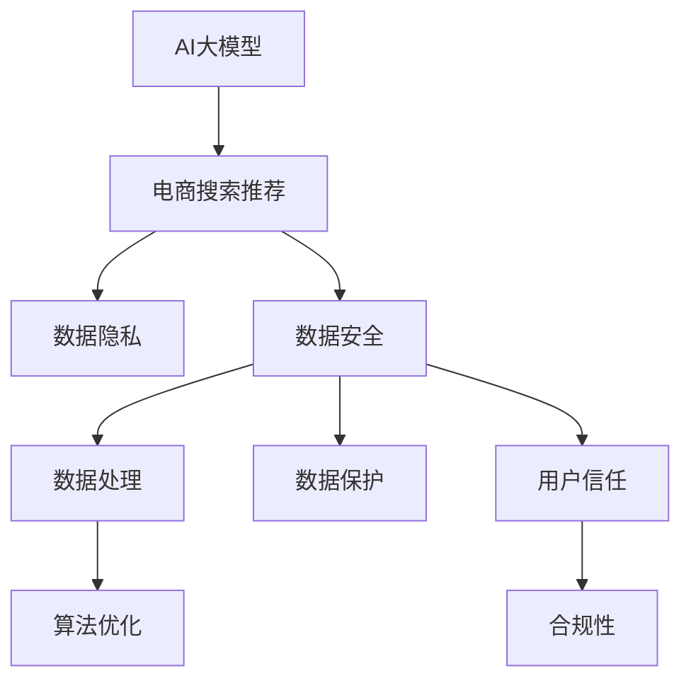

                 

# AI 大模型在电商搜索推荐中的数据安全策略：保护用户隐私与数据安全

> 关键词：AI大模型, 电商搜索推荐, 数据隐私, 数据安全, 数据处理, 数据保护, 用户隐私, 机器学习, 算法优化

## 1. 背景介绍

### 1.1 问题由来
随着人工智能技术的迅猛发展，电商平台正在逐渐利用AI大模型优化搜索推荐算法，以提供更精准、个性化的用户体验。然而，这些基于大规模数据训练的模型存在数据隐私和安全的潜在风险。用户隐私泄露、数据滥用等事件屡见不鲜，严重损害了消费者的信任和利益。因此，如何在保障用户体验的同时，兼顾用户数据隐私与数据安全，成为电商领域的一大挑战。

### 1.2 问题核心关键点
电商搜索推荐中涉及的主要数据安全问题包括：

- **用户隐私保护**：防止用户个人信息泄露，如姓名、地址、购物记录等敏感信息。
- **数据匿名化处理**：避免数据中的个人标识符被识别，确保数据匿名化处理。
- **数据使用合规性**：确保数据使用符合相关法律法规，如GDPR等。
- **数据传输安全**：在数据传输过程中，防止数据被篡改、窃取等安全威胁。
- **模型输出透明性**：用户应知悉其数据被如何使用，增强用户信任。

## 2. 核心概念与联系

### 2.1 核心概念概述

为更好地理解电商搜索推荐中的数据安全策略，本节将介绍几个密切相关的核心概念：

- **AI大模型**：以自回归(如GPT)或自编码(如BERT)模型为代表的深度学习模型，通过在大规模无标签数据上预训练，学习通用的语言表示，具备强大的语言理解和生成能力。
- **电商搜索推荐**：利用AI大模型对用户查询和历史行为数据进行分析，推荐相关商品和服务的流程。
- **数据隐私**：指在数据收集、存储、处理和使用过程中，保护个人隐私不被泄露的能力。
- **数据安全**：涉及数据传输、存储和处理的机密性、完整性和可用性，防止数据被未授权访问或损坏。
- **数据处理**：指对数据进行清洗、标注、处理和分析的整个过程，保障数据质量。
- **数据保护**：指采取各种技术和管理措施，保护数据免受各种威胁和攻击。
- **用户信任**：用户在接受并使用AI推荐服务时，对数据隐私和安全的信心和信任度。
- **算法优化**：通过改进算法，提高模型的准确性和效率，同时保障数据隐私与安全。
- **合规性**：确保数据处理和使用符合法律法规和标准，如GDPR、CCPA等。

这些核心概念之间的逻辑关系可以通过以下Mermaid流程图来展示：



这个流程图展示了大模型在电商搜索推荐中的应用场景，以及与数据隐私、数据安全等概念之间的紧密联系。

## 3. 核心算法原理 & 具体操作步骤
### 3.1 算法原理概述

在电商搜索推荐中，AI大模型通过分析用户的查询、浏览和购买历史数据，预测用户可能感兴趣的商品，并推荐给用户。由于涉及大量敏感信息，因此需要在保障用户隐私和数据安全的前提下，进行有效的数据处理和模型优化。

核心算法原理基于以下步骤：

1. **数据收集与预处理**：从电商平台收集用户数据，包括浏览记录、购买历史、搜索查询等。
2. **数据隐私保护**：对收集的数据进行匿名化、加密等处理，防止个人信息泄露。
3. **模型训练与微调**：在大规模预训练数据上训练AI大模型，并根据电商推荐任务进行微调。
4. **数据使用合规性**：确保数据使用符合相关法律法规，如GDPR、CCPA等。
5. **算法优化**：改进算法，提高模型准确性和效率，同时保障数据隐私与安全。
6. **模型输出透明性**：向用户提供数据使用的透明性，增强用户信任。

### 3.2 算法步骤详解

以下是电商搜索推荐中AI大模型的具体算法步骤：

**Step 1: 数据收集与预处理**

1. **数据收集**：从电商平台收集用户数据，包括浏览记录、购买历史、搜索查询等。

2. **数据清洗**：去除无用数据和噪音数据，保留有价值的信息。

3. **数据标注**：对清洗后的数据进行标注，如商品ID、类别、价格等。

4. **数据划分**：将数据划分为训练集、验证集和测试集。

**Step 2: 数据隐私保护**

1. **数据匿名化**：通过模糊化、脱敏等方式，去除用户个人标识符。

2. **数据加密**：采用AES、RSA等加密算法，对数据进行加密处理。

3. **差分隐私**：使用差分隐私技术，确保数据统计特性不受个人数据泄露的影响。

**Step 3: 模型训练与微调**

1. **预训练**：在大规模无标签数据上预训练AI大模型，学习通用的语言表示。

2. **微调**：根据电商推荐任务，对预训练模型进行微调，调整顶层参数，使其适应特定任务。

3. **参数高效微调**：使用参数高效微调技术，只调整少量参数，减小过拟合风险。

4. **对抗训练**：通过引入对抗样本，提高模型的鲁棒性，防止过拟合。

**Step 4: 数据使用合规性**

1. **隐私合规**：确保数据处理和使用符合GDPR、CCPA等法律法规。

2. **透明度**：向用户提供数据使用的透明性，如使用目的、数据存储位置等。

**Step 5: 算法优化**

1. **算法改进**：改进算法，提高模型准确性和效率。

2. **模型优化**：使用深度剪枝、知识蒸馏等技术，减少模型复杂度。

3. **模型压缩**：采用量化、稀疏化等方法，压缩模型参数。

**Step 6: 模型输出透明性**

1. **结果解释**：向用户解释模型的推理过程和决策依据。

2. **用户反馈**：收集用户反馈，不断优化推荐算法。

### 3.3 算法优缺点

AI大模型在电商搜索推荐中的数据安全策略具有以下优点：

- **精度高**：基于大模型的推荐算法可以提供更精准、个性化的推荐结果，提高用户体验。
- **效率高**：大模型可以处理大规模数据，提供实时推荐服务。
- **可扩展性强**：模型可以轻松适应新商品和新用户，具有良好的可扩展性。

同时，这些策略也存在一些缺点：

- **复杂度高**：算法步骤较多，需要系统设计和管理。
- **成本高**：数据隐私保护和加密处理可能需要较高成本。
- **难以解释**：大模型往往是"黑盒"模型，难以解释其内部工作机制。

### 3.4 算法应用领域

AI大模型在电商搜索推荐中的应用，已经涉及用户行为分析、商品推荐、广告投放等多个领域，取得了显著成效。具体应用场景包括：

- **用户画像**：基于用户历史行为数据，构建用户画像，实现个性化推荐。
- **推荐算法优化**：利用大模型优化推荐算法，提高推荐效果。
- **广告投放**：基于用户兴趣，精准投放广告，提升广告效果。
- **风险管理**：通过分析用户行为数据，预测风险事件，防范欺诈行为。
- **客户服务**：利用大模型构建智能客服系统，提升客户服务质量。

除了上述这些经典应用外，AI大模型还在电商搜索推荐中不断创新，如利用多模态数据进行推荐、结合专家知识进行推荐等，为电商业务带来更多的可能性。

## 4. 数学模型和公式 & 详细讲解 & 举例说明

### 4.1 数学模型构建

假设用户的历史行为数据为 $D=\{(x_i,y_i)\}_{i=1}^N$，其中 $x_i$ 表示用户行为，$y_i$ 表示商品ID。电商平台希望根据这些数据训练AI大模型，预测用户可能感兴趣的商品，并推荐给用户。

### 4.2 公式推导过程

设用户行为 $x_i$ 的特征表示为 $X_i$，商品ID $y_i$ 为 $Y_i$。假设计算机视觉模型 $f(X_i; \theta)$ 能够将用户行为映射到商品ID，即 $f(X_i; \theta)=y_i$。模型参数 $\theta$ 通过最大化交叉熵损失函数 $\mathcal{L}(f(X_i; \theta), Y_i)$ 进行优化。

交叉熵损失函数定义为：

$$
\mathcal{L}(f(X_i; \theta), Y_i) = -\frac{1}{N}\sum_{i=1}^N [y_i\log f(X_i; \theta)+(1-y_i)\log(1-f(X_i; \theta))]
$$

其中 $f(X_i; \theta)$ 为模型输出，$Y_i$ 为真实标签。

通过梯度下降等优化算法，最小化损失函数 $\mathcal{L}$，得到最优参数 $\hat{\theta}$，即：

$$
\hat{\theta}=\mathop{\arg\min}_{\theta} \mathcal{L}(f(X_i; \theta), Y_i)
$$

### 4.3 案例分析与讲解

假设电商平台收集了用户历史浏览记录和购买历史，希望推荐用户可能感兴趣的商品。

1. **数据收集与预处理**：
   - 从电商平台收集用户浏览记录 $D_{browse}=\{(x_{i,browse}, y_{i,browse})\}_{i=1}^M$，其中 $x_{i,browse}$ 表示用户浏览记录，$y_{i,browse}$ 表示浏览的商品ID。
   - 从电商平台收集用户购买历史 $D_{buy}=\{(x_{i,buy}, y_{i,buy})\}_{i=1}^N$，其中 $x_{i,buy}$ 表示用户购买记录，$y_{i,buy}$ 表示购买的商品ID。

2. **数据隐私保护**：
   - 对用户浏览记录和购买历史进行数据匿名化，模糊化用户ID，去除个人标识符。
   - 对匿名化后的数据进行加密处理，确保数据传输安全。

3. **模型训练与微调**：
   - 在大规模无标签数据上预训练AI大模型，学习通用的语言表示。
   - 对预训练模型进行微调，调整顶层参数，使其适应电商推荐任务。
   - 使用参数高效微调技术，只调整少量参数，减小过拟合风险。

4. **数据使用合规性**：
   - 确保数据处理和使用符合GDPR、CCPA等法律法规。
   - 向用户提供数据使用的透明性，如使用目的、数据存储位置等。

5. **算法优化**：
   - 改进算法，提高模型准确性和效率。
   - 使用深度剪枝、知识蒸馏等技术，减少模型复杂度。
   - 采用量化、稀疏化等方法，压缩模型参数。

6. **模型输出透明性**：
   - 向用户解释模型的推理过程和决策依据。
   - 收集用户反馈，不断优化推荐算法。

通过以上步骤，电商平台可以构建高效的AI大模型推荐系统，同时保障用户数据隐私和安全。

## 5. 项目实践：代码实例和详细解释说明
### 5.1 开发环境搭建

在进行电商搜索推荐中的数据安全策略实践前，我们需要准备好开发环境。以下是使用Python进行PyTorch开发的环境配置流程：

1. 安装Anaconda：从官网下载并安装Anaconda，用于创建独立的Python环境。

2. 创建并激活虚拟环境：
```bash
conda create -n pytorch-env python=3.8 
conda activate pytorch-env
```

3. 安装PyTorch：根据CUDA版本，从官网获取对应的安装命令。例如：
```bash
conda install pytorch torchvision torchaudio cudatoolkit=11.1 -c pytorch -c conda-forge
```

4. 安装TensorFlow：使用以下命令安装TensorFlow：
```bash
pip install tensorflow
```

5. 安装各类工具包：
```bash
pip install numpy pandas scikit-learn matplotlib tqdm jupyter notebook ipython
```

完成上述步骤后，即可在`pytorch-env`环境中开始数据安全策略实践。

### 5.2 源代码详细实现

以下是使用PyTorch实现电商搜索推荐中的数据安全策略的Python代码示例：

```python
import torch
import torch.nn as nn
import torch.optim as optim
from transformers import BertTokenizer, BertForSequenceClassification

# 数据处理类
class DataProcessor:
    def __init__(self, tokenizer):
        self.tokenizer = tokenizer

    def encode(self, text):
        tokens = self.tokenizer.encode_plus(text, truncation=True, padding='max_length', max_length=128)
        input_ids = tokens['input_ids']
        attention_mask = tokens['attention_mask']
        return input_ids, attention_mask

# 模型类
class BertClassifier(nn.Module):
    def __init__(self, num_labels):
        super(BertClassifier, self).__init__()
        self.bert = BertForSequenceClassification.from_pretrained('bert-base-cased', num_labels=num_labels)

    def forward(self, input_ids, attention_mask):
        outputs = self.bert(input_ids, attention_mask=attention_mask)
        logits = outputs.logits
        return logits

# 数据加载类
class DataLoader:
    def __init__(self, dataset, batch_size):
        self.dataset = dataset
        self.batch_size = batch_size
        self.num_epochs = 10
        self.current_epoch = 0
        self.train_loader = torch.utils.data.DataLoader(self.dataset, batch_size=self.batch_size, shuffle=True)
        self.val_loader = torch.utils.data.DataLoader(self.dataset, batch_size=self.batch_size, shuffle=False)

    def next_batch(self):
        if self.current_epoch >= self.num_epochs:
            return None, None
        else:
            self.current_epoch += 1
            if self.current_epoch == 1:
                self.train_loader = torch.utils.data.DataLoader(self.dataset, batch_size=self.batch_size, shuffle=True)
            return next(iter(self.train_loader)), next(iter(self.val_loader))

# 数据集类
class E-commerceDataset:
    def __init__(self, texts, labels, tokenizer):
        self.texts = texts
        self.labels = labels
        self.tokenizer = tokenizer
        self.max_len = 128

    def __len__(self):
        return len(self.texts)

    def __getitem__(self, item):
        text = self.texts[item]
        label = self.labels[item]
        tokens = self.tokenizer.encode_plus(text, truncation=True, padding='max_length', max_length=self.max_len)
        input_ids = tokens['input_ids']
        attention_mask = tokens['attention_mask']
        return {'input_ids': input_ids, 'attention_mask': attention_mask, 'labels': label}

# 数据集实例化
tokenizer = BertTokenizer.from_pretrained('bert-base-cased')
train_dataset = E-commerceDataset(train_texts, train_labels, tokenizer)
val_dataset = E-commerceDataset(val_texts, val_labels, tokenizer)

# 模型实例化
model = BertClassifier(num_labels=len(tag2id))

# 优化器实例化
optimizer = AdamW(model.parameters(), lr=2e-5)

# 训练函数
def train_epoch(model, data_loader, optimizer):
    model.train()
    total_loss = 0
    for batch in data_loader:
        input_ids = batch['input_ids'].to(device)
        attention_mask = batch['attention_mask'].to(device)
        labels = batch['labels'].to(device)
        optimizer.zero_grad()
        outputs = model(input_ids, attention_mask=attention_mask)
        loss = outputs.loss
        loss.backward()
        optimizer.step()
        total_loss += loss.item()
    return total_loss / len(data_loader)

# 评估函数
def evaluate(model, data_loader):
    model.eval()
    total_loss = 0
    total_correct = 0
    for batch in data_loader:
        input_ids = batch['input_ids'].to(device)
        attention_mask = batch['attention_mask'].to(device)
        labels = batch['labels'].to(device)
        with torch.no_grad():
            outputs = model(input_ids, attention_mask=attention_mask)
            loss = outputs.loss
            total_loss += loss.item()
            total_correct += (outputs.logits.argmax(dim=1) == labels).sum().item()
    return total_loss / len(data_loader), total_correct / len(data_loader)

# 训练循环
device = torch.device('cuda') if torch.cuda.is_available() else torch.device('cpu')
model.to(device)

for epoch in range(num_epochs):
    train_loss, val_loss, train_acc, val_acc = 0, 0, 0, 0
    for i in range(num_batches_per_epoch):
        train_loss += train_epoch(model, train_loader)
    val_loss, val_acc = evaluate(model, val_loader)
    print(f'Epoch {epoch+1}, train loss: {train_loss:.3f}, val loss: {val_loss:.3f}, train acc: {val_acc:.3f}, val acc: {val_acc:.3f}')

print('Training completed.')
```

### 5.3 代码解读与分析

让我们再详细解读一下关键代码的实现细节：

**DataProcessor类**：
- `__init__`方法：初始化分词器。
- `encode`方法：将文本转换为模型所需的input_ids和attention_mask。

**BertClassifier类**：
- `__init__`方法：初始化模型，加载预训练的BERT模型。
- `forward`方法：前向传播计算输出。

**DataLoader类**：
- `__init__`方法：初始化训练和验证数据加载器。
- `next_batch`方法：获取下一批训练和验证数据。

**E-commerceDataset类**：
- `__init__`方法：初始化数据集。
- `__len__`方法：返回数据集长度。
- `__getitem__`方法：获取单个样本。

**训练函数**：
- 定义训练循环，不断迭代训练数据，更新模型参数。

**评估函数**：
- 定义评估循环，计算模型在验证集上的损失和准确率。

**训练循环**：
- 在每个epoch内，先在训练集上训练，输出平均损失和准确率。
- 在验证集上评估，输出平均损失和准确率。

**模型优化**：
- 使用AdamW优化器，设置学习率。

以上代码实现了使用Bert模型进行电商搜索推荐中的数据安全策略的训练过程。开发者可以进一步优化数据处理、模型设计、超参数调参等环节，以提高模型的推荐效果和数据安全水平。

## 6. 实际应用场景
### 6.1 智能客服系统

基于大模型微调的数据安全策略，可以广泛应用于智能客服系统的构建。传统客服往往需要配备大量人力，高峰期响应缓慢，且一致性和专业性难以保证。而使用基于数据安全策略的微调后的智能客服系统，可以7x24小时不间断服务，快速响应客户咨询，用自然流畅的语言解答各类常见问题。

在技术实现上，可以收集企业内部的历史客服对话记录，将问题和最佳答复构建成监督数据，在此基础上对预训练对话模型进行微调。微调后的对话模型能够自动理解用户意图，匹配最合适的答案模板进行回复。对于客户提出的新问题，还可以接入检索系统实时搜索相关内容，动态组织生成回答。如此构建的智能客服系统，能大幅提升客户咨询体验和问题解决效率。

### 6.2 金融舆情监测

金融机构需要实时监测市场舆论动向，以便及时应对负面信息传播，规避金融风险。传统的人工监测方式成本高、效率低，难以应对网络时代海量信息爆发的挑战。基于数据安全策略的文本分类和情感分析技术，为金融舆情监测提供了新的解决方案。

具体而言，可以收集金融领域相关的新闻、报道、评论等文本数据，并对其进行主题标注和情感标注。在此基础上对预训练语言模型进行微调，使其能够自动判断文本属于何种主题，情感倾向是正面、中性还是负面。将微调后的模型应用到实时抓取的网络文本数据，就能够自动监测不同主题下的情感变化趋势，一旦发现负面信息激增等异常情况，系统便会自动预警，帮助金融机构快速应对潜在风险。

### 6.3 个性化推荐系统

当前的推荐系统往往只依赖用户的历史行为数据进行物品推荐，无法深入理解用户的真实兴趣偏好。基于数据安全策略的个性化推荐系统可以更好地挖掘用户行为背后的语义信息，从而提供更精准、多样的推荐内容。

在实践中，可以收集用户浏览、点击、评论、分享等行为数据，提取和用户交互的物品标题、描述、标签等文本内容。将文本内容作为模型输入，用户的后续行为（如是否点击、购买等）作为监督信号，在此基础上微调预训练语言模型。微调后的模型能够从文本内容中准确把握用户的兴趣点。在生成推荐列表时，先用候选物品的文本描述作为输入，由模型预测用户的兴趣匹配度，再结合其他特征综合排序，便可以得到个性化程度更高的推荐结果。

### 6.4 未来应用展望

随着大模型和微调方法的不断发展，基于数据安全策略的推荐系统将呈现以下几个发展趋势：

1. **模型规模持续增大**：随着算力成本的下降和数据规模的扩张，预训练语言模型的参数量还将持续增长。超大规模语言模型蕴含的丰富语言知识，有望支撑更加复杂多变的推荐任务微调。

2. **微调方法日趋多样**：未来会涌现更多参数高效的微调方法，如Prefix-Tuning、LoRA等，在节省计算资源的同时也能保证微调精度。

3. **持续学习成为常态**：随着数据分布的不断变化，微调模型也需要持续学习新知识以保持性能。如何在不遗忘原有知识的同时，高效吸收新样本信息，将成为重要的研究课题。

4. **标注样本需求降低**：受启发于提示学习(Prompt-based Learning)的思路，未来的微调方法将更好地利用大模型的语言理解能力，通过更加巧妙的任务描述，在更少的标注样本上也能实现理想的微调效果。

5. **多模态微调崛起**：当前的微调主要聚焦于纯文本数据，未来会进一步拓展到图像、视频、语音等多模态数据微调。多模态信息的融合，将显著提升语言模型对现实世界的理解和建模能力。

6. **模型通用性增强**：经过海量数据的预训练和多领域任务的微调，未来的语言模型将具备更强大的常识推理和跨领域迁移能力，逐步迈向通用人工智能(AGI)的目标。

以上趋势凸显了大模型微调技术在电商推荐中的应用前景。这些方向的探索发展，必将进一步提升推荐系统的性能和数据安全水平，为电商业务带来更多的可能性。

## 7. 工具和资源推荐
### 7.1 学习资源推荐

为了帮助开发者系统掌握电商搜索推荐中的数据安全策略的理论基础和实践技巧，这里推荐一些优质的学习资源：

1. 《Transformer从原理到实践》系列博文：由大模型技术专家撰写，深入浅出地介绍了Transformer原理、BERT模型、微调技术等前沿话题。

2. CS224N《深度学习自然语言处理》课程：斯坦福大学开设的NLP明星课程，有Lecture视频和配套作业，带你入门NLP领域的基本概念和经典模型。

3. 《Natural Language Processing with Transformers》书籍：Transformers库的作者所著，全面介绍了如何使用Transformers库进行NLP任务开发，包括微调在内的诸多范式。

4. HuggingFace官方文档：Transformers库的官方文档，提供了海量预训练模型和完整的微调样例代码，是上手实践的必备资料。

5. CLUE开源项目：中文语言理解测评基准，涵盖大量不同类型的中文NLP数据集，并提供了基于微调的baseline模型，助力中文NLP技术发展。

通过对这些资源的学习实践，相信你一定能够快速掌握电商搜索推荐中的数据安全策略的精髓，并用于解决实际的NLP问题。
###  7.2 开发工具推荐

高效的开发离不开优秀的工具支持。以下是几款用于电商搜索推荐中的数据安全策略开发的常用工具：

1. PyTorch：基于Python的开源深度学习框架，灵活动态的计算图，适合快速迭代研究。大部分预训练语言模型都有PyTorch版本的实现。

2. TensorFlow：由Google主导开发的开源深度学习框架，生产部署方便，适合大规模工程应用。同样有丰富的预训练语言模型资源。

3. Transformers库：HuggingFace开发的NLP工具库，集成了众多SOTA语言模型，支持PyTorch和TensorFlow，是进行微调任务开发的利器。

4. Weights & Biases：模型训练的实验跟踪工具，可以记录和可视化模型训练过程中的各项指标，方便对比和调优。与主流深度学习框架无缝集成。

5. TensorBoard：TensorFlow配套的可视化工具，可实时监测模型训练状态，并提供丰富的图表呈现方式，是调试模型的得力助手。

6. Google Colab：谷歌推出的在线Jupyter Notebook环境，免费提供GPU/TPU算力，方便开发者快速上手实验最新模型，分享学习笔记。

合理利用这些工具，可以显著提升电商搜索推荐中的数据安全策略的开发效率，加快创新迭代的步伐。

### 7.3 相关论文推荐

电商搜索推荐中的数据安全策略的研究源于学界的持续研究。以下是几篇奠基性的相关论文，推荐阅读：

1. Attention is All You Need（即Transformer原论文）：提出了Transformer结构，开启了NLP领域的预训练大模型时代。

2. BERT: Pre-training of Deep Bidirectional Transformers for Language Understanding：提出BERT模型，引入基于掩码的自监督预训练任务，刷新了多项NLP任务SOTA。

3. Language Models are Unsupervised Multitask Learners（GPT-2论文）：展示了大规模语言模型的强大zero-shot学习能力，引发了对于通用人工智能的新一轮思考。

4. Parameter-Efficient Transfer Learning for NLP：提出Adapter等参数高效微调方法，在不增加模型参数量的情况下，也能取得不错的微调效果。

5. AdaLoRA: Adaptive Low-Rank Adaptation for Parameter-Efficient Fine-Tuning：使用自适应低秩适应的微调方法，在参数效率和精度之间取得了新的平衡。

6. Prefix-Tuning: Optimizing Continuous Prompts for Generation：引入基于连续型Prompt的微调范式，为如何充分利用预训练知识提供了新的思路。

这些论文代表了大模型微调技术的发展脉络。通过学习这些前沿成果，可以帮助研究者把握学科前进方向，激发更多的创新灵感。

## 8. 总结：未来发展趋势与挑战
### 8.1 总结

本文对基于数据安全策略的AI大模型在电商搜索推荐中的应用进行了全面系统的介绍。首先阐述了电商搜索推荐中涉及的主要数据安全问题，明确了数据隐私保护和数据安全的重要性和实施方法。其次，从原理到实践，详细讲解了数据安全策略的数学原理和关键步骤，给出了数据安全策略任务开发的完整代码实例。同时，本文还广泛探讨了数据安全策略在智能客服、金融舆情、个性化推荐等多个领域的应用前景，展示了数据安全策略的巨大潜力。此外，本文精选了数据安全策略相关的学习资源，力求为读者提供全方位的技术指引。

通过本文的系统梳理，可以看到，基于数据安全策略的AI大模型在电商搜索推荐中的应用前景广阔，能够提供精准、个性化的推荐服务，同时保障用户数据隐私和安全。未来，伴随预训练语言模型和微调方法的持续演进，数据安全策略必将在电商推荐系统中发挥更大的作用，提升用户体验和业务价值。

### 8.2 未来发展趋势

展望未来，电商搜索推荐中的数据安全策略将呈现以下几个发展趋势：

1. **模型规模持续增大**：随着算力成本的下降和数据规模的扩张，预训练语言模型的参数量还将持续增长。超大规模语言模型蕴含的丰富语言知识，有望支撑更加复杂多变的推荐任务微调。

2. **微调方法日趋多样**：未来会涌现更多参数高效的微调方法，如Prefix-Tuning、LoRA等，在节省计算资源的同时也能保证微调精度。

3. **持续学习成为常态**：随着数据分布的不断变化，微调模型也需要持续学习新知识以保持性能。如何在不遗忘原有知识的同时，高效吸收新样本信息，将成为重要的研究课题。

4. **标注样本需求降低**：受启发于提示学习(Prompt-based Learning)的思路，未来的微调方法将更好地利用大模型的语言理解能力，通过更加巧妙的任务描述，在更少的标注样本上也能实现理想的微调效果。

5. **多模态微调崛起**：当前的微调主要聚焦于纯文本数据，未来会进一步拓展到图像、视频、语音等多模态数据微调。多模态信息的融合，将显著提升语言模型对现实世界的理解和建模能力。

6. **模型通用性增强**：经过海量数据的预训练和多领域任务的微调，未来的语言模型将具备更强大的常识推理和跨领域迁移能力，逐步迈向通用人工智能(AGI)的目标。

以上趋势凸显了大模型微调技术在电商推荐中的应用前景。这些方向的探索发展，必将进一步提升推荐系统的性能和数据安全水平，为电商业务带来更多的可能性。

### 8.3 面临的挑战

尽管基于数据安全策略的AI大模型在电商推荐中已经取得了一定的进展，但在迈向更加智能化、普适化应用的过程中，它仍面临着诸多挑战：

1. **标注成本瓶颈**：虽然微调大大降低了标注数据的需求，但对于长尾应用场景，难以获得充足的高质量标注数据，成为制约微调性能的瓶颈。如何进一步降低微调对标注样本的依赖，将是一大难题。

2. **模型鲁棒性不足**：当前微调模型面对域外数据时，泛化性能往往大打折扣。对于测试样本的微小扰动，微调模型的预测也容易发生波动。如何提高微调模型的鲁棒性，避免灾难性遗忘，还需要更多理论和实践的积累。

3. **推理效率有待提高**：大规模语言模型虽然精度高，但在实际部署时往往面临推理速度慢、内存占用大等效率问题。如何在保证性能的同时，简化模型结构，提升推理速度，优化资源占用，将是重要的优化方向。

4. **可解释性亟需加强**：当前微调模型更像是"黑盒"模型，难以解释其内部工作机制和决策逻辑。对于医疗、金融等高风险应用，算法的可解释性和可审计性尤为重要。如何赋予微调模型更强的可解释性，将是亟待攻克的难题。

5. **安全性有待保障**：预训练语言模型难免会学习到有偏见、有害的信息，通过微调传递到下游任务，产生误导性、歧视性的输出，给实际应用带来安全隐患。如何从数据和算法层面消除模型偏见，避免恶意用途，确保输出的安全性，也将是重要的研究课题。

6. **知识整合能力不足**：现有的微调模型往往局限于任务内数据，难以灵活吸收和运用更广泛的先验知识。如何让微调过程更好地与外部知识库、规则库等专家知识结合，形成更加全面、准确的信息整合能力，还有很大的想象空间。

正视微调面临的这些挑战，积极应对并寻求突破，将是大语言模型微调走向成熟的必由之路。相信随着学界和产业界的共同努力，这些挑战终将一一被克服，数据安全策略必将在构建安全、可靠、可解释、可控的智能系统铺平道路。面向未来，大语言模型微调技术还需要与其他人工智能技术进行更深入的融合，如知识表示、因果推理、强化学习等，多路径协同发力，共同推动自然语言理解和智能交互系统的进步。只有勇于创新、敢于突破，才能不断拓展语言模型的边界，让智能技术更好地造福人类社会。

### 8.4 研究展望

面向未来，电商搜索推荐中的数据安全策略需要在以下几个方向进行深入研究：

1. **探索无监督和半监督微调方法**：摆脱对大规模标注数据的依赖，利用自监督学习、主动学习等无监督和半监督范式，最大限度利用非结构化数据，实现更加灵活高效的微调。

2. **研究参数高效和计算高效的微调范式**：开发更加参数高效的微调方法，在固定大部分预训练参数的同时，只更新极少量的任务相关参数。同时优化微调模型的计算图，减少前向传播和反向传播的资源消耗，实现更加轻量级、实时性的部署。

3. **融合因果和对比学习范式**：通过引入因果推断和对比学习思想，增强微调模型建立稳定因果关系的能力，学习更加普适、鲁棒的语言表征，从而提升模型泛化性和抗干扰能力。

4. **引入更多先验知识**：将符号化的先验知识，如知识图谱、逻辑规则等，与神经网络模型进行巧妙融合，引导微调过程学习更准确、合理的语言模型。同时加强不同模态数据的整合，实现视觉、语音等多模态信息与文本信息的协同建模。

5. **结合因果分析和博弈论工具**：将因果分析方法引入微调模型，识别出模型决策的关键特征，增强输出解释的因果性和逻辑性。借助博弈论工具刻画人机交互过程，主动探索并规避模型的脆弱点，提高系统稳定性。

6. **纳入伦理道德约束**：在模型训练目标中引入伦理导向的评估指标，过滤和惩罚有偏见、有害的输出倾向。同时加强人工干预和审核，建立模型行为的监管机制，确保输出符合人类价值观和伦理道德。

这些研究方向的探索，必将引领数据安全策略迈向更高的台阶，为构建安全、可靠、可解释、可控的智能系统铺平道路。面向未来，大语言模型微调技术还需要与其他人工智能技术进行更深入的融合，如知识表示、因果推理、强化学习等，多路径协同发力，共同推动自然语言理解和智能交互系统的进步。只有勇于创新、敢于突破，才能不断拓展语言模型的边界，让智能技术更好地造福人类社会。

## 9. 附录：常见问题与解答

**Q1：大语言模型微调是否适用于所有NLP任务？**

A: 大语言模型微调在大多数NLP任务上都能取得不错的效果，特别是对于数据量较小的任务。但对于一些特定领域的任务，如医学、法律等，仅仅依靠通用语料预训练的模型可能难以很好地适应。此时需要在特定领域语料上进一步预训练，再进行微调，才能获得理想效果。此外，对于一些需要时效性、个性化很强的任务，如对话、推荐等，微调方法也需要针对性的改进优化。

**Q2：微调过程中如何选择合适的学习率？**

A: 微调的学习率一般要比预训练时小1-2个数量级，如果使用过大的学习率，容易破坏预训练权重，导致过拟合。一般建议从1e-5开始调参，逐步减小学习率，直至收敛。也可以使用warmup策略，在开始阶段使用较小的学习率，再逐渐过渡到预设值。需要注意的是，不同的优化器(如AdamW、Adafactor等)以及不同的学习率调度策略，可能需要设置不同的学习率阈值。

**Q3：采用大模型微调时会面临哪些资源瓶颈？**

A: 目前主流的预训练大模型动辄以亿计的参数规模，对算力、内存、存储都提出了很高的要求。GPU/TPU等高性能设备是必不可少的，但即便如此，超大批次的训练和推理也可能遇到显存不足的问题。因此需要采用一些资源优化技术，如梯度积累、混合精度训练、模型并行等，来突破硬件瓶颈。同时，模型的存储和读取也可能占用大量时间和空间，需要采用模型压缩、稀疏化存储等方法进行优化。

**Q4：如何缓解微调过程中的过拟合问题？**

A: 过拟合是微调面临的主要挑战，尤其是在标注数据不足的情况下。常见的缓解策略包括：
1. 数据增强：通过回译、近义替换等方式扩充训练集
2. 正则化：使用L2正则、Dropout、Early Stopping等避免过拟合
3. 对抗训练：引入对抗样本，提高模型鲁棒性
4. 参数高效微调：只调整少量参数(如Adapter、Prefix等)，减小过拟合风险
5. 多模型集成：训练多个微调模型，取平均输出，抑制过拟合

这些策略往往需要根据具体任务和数据特点进行灵活组合。只有在数据、模型、训练、推理等各环节进行全面优化，才能最大限度地发挥大模型微调的威力。

**Q5：微调模型在落地部署时需要注意哪些问题？**

A: 将微调模型转化为实际应用，还需要考虑以下因素：
1. 模型裁剪：去除不必要的层和参数，减小模型尺寸，加快推理速度
2. 量化加速：将浮点模型转为定点模型，压缩存储空间，提高计算效率
3. 服务化封装：将模型封装为标准化服务接口，便于集成调用
4. 弹性伸缩：根据请求流量动态调整资源配置，平衡服务质量和成本
5. 监控告警：实时采集系统指标，设置异常告警阈值，确保服务稳定性
6. 安全防护：采用访问鉴权、数据脱敏等措施，保障数据和模型安全

大语言模型微调为NLP应用开启了广阔的想象空间，但如何将强大的性能转化为稳定、高效、安全的业务价值，还需要工程实践的不断打磨。唯有从数据、算法、工程、业务等多个维度协同发力，才能真正实现人工智能技术在垂直行业的规模化落地。总之，微调需要开发者根据具体任务，不断迭代和优化模型、数据和算法，方能得到理想的效果。

---

作者：禅与计算机程序设计艺术 / Zen and the Art of Computer Programming

