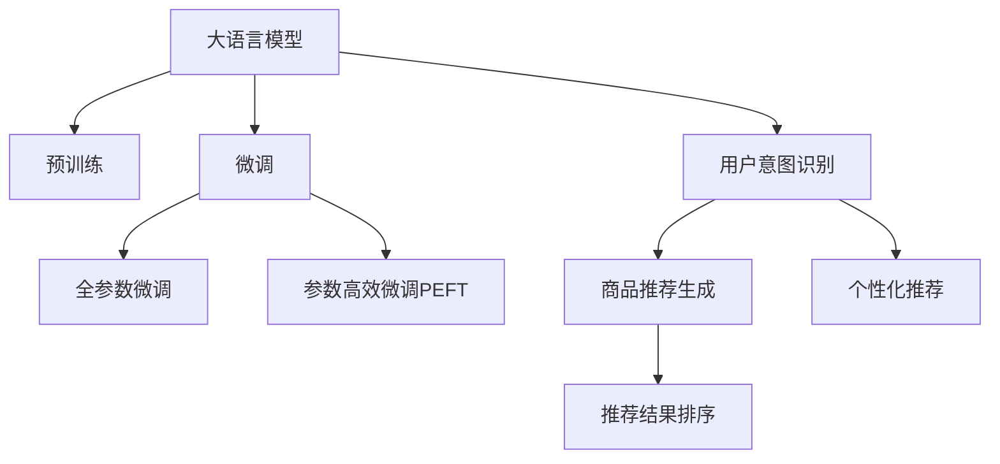

                 

## 1. 背景介绍

### 1.1 问题由来
随着电子商务的快速发展，用户搜索与推荐系统的复杂性和需求多样性日益增加。传统搜索引擎和推荐系统基于关键词匹配的推荐逻辑，难以兼顾用户的个性化需求和情感倾向。尤其是用户查询的商品往往是模糊且多维的，简单的关键词匹配无法准确把握用户真正意图。

为了提升用户体验，电商平台引入了大模型进行搜索和推荐。大语言模型通过海量无标签文本数据的预训练，学习到语言的一般性规律和知识，具备强大的自然语言理解和生成能力。利用大模型的优势，电商搜索推荐系统能够更精准地理解和生成用户意图和推荐内容，提升用户的购物体验。

### 1.2 问题核心关键点
尽管大语言模型在搜索和推荐中展现出巨大潜力，但如何更好地满足用户的个性化和情感需求，提升搜索推荐的精准度和用户体验，仍然是一个复杂而困难的问题。本文旨在探讨基于大语言模型的电商搜索推荐系统的用户体验设计思路，从用户本位出发，构建以人为本的设计范式。

## 2. 核心概念与联系

### 2.1 核心概念概述

为了深入理解基于大语言模型的电商搜索推荐系统，本文将介绍几个关键概念：

- **大语言模型(Large Language Model, LLM)**：以自回归(如GPT)或自编码(如BERT)模型为代表的大规模预训练语言模型。通过在大规模无标签文本语料上进行预训练，学习通用的语言表示，具备强大的语言理解和生成能力。

- **预训练(Pre-training)**：指在大规模无标签文本语料上，通过自监督学习任务训练通用语言模型的过程。常见的预训练任务包括言语建模、遮挡语言模型等。预训练使得模型学习到语言的通用表示。

- **微调(Fine-tuning)**：指在预训练模型的基础上，使用下游任务的少量标注数据，通过有监督学习优化模型在特定任务上的性能。通常只需要调整顶层分类器或解码器，并以较小的学习率更新全部或部分的模型参数。

- **用户意图识别**：在搜索和推荐过程中，准确理解用户的查询意图，确定其真实需求。

- **商品推荐生成**：根据用户意图，生成推荐的商品列表，涵盖各种相关商品，并考虑情感倾向和多样性。

- **个性化推荐**：针对不同用户历史行为和偏好，进行精准的推荐。

- **推荐结果排序**：根据预设指标（如点击率、转化率等）对推荐结果进行排序，优化推荐效果。

这些核心概念之间的逻辑关系可以通过以下Mermaid流程图来展示：



### 2.2 核心概念原理和架构

#### 2.2.1 大语言模型

大语言模型通过对大规模无标签文本数据进行预训练，学习到语言的通用表示。这些表示可以在后续任务中通过微调进行优化，使其具备特定的任务能力。

预训练过程通常包括自监督学习任务，如掩码语言建模Masked Language Modeling (MLM)、下一个句子预测Next Sentence Prediction (NSP)等。这些任务的设计使模型能够在广泛的无标签数据上进行高效学习，捕获语言的统计规律和语义信息。

#### 2.2.2 微调

微调是指在预训练模型的基础上，通过有监督的优化，使其具备特定任务的能力。在大语言模型微调中，常见的步骤包括：

1. 选择合适的预训练模型，作为微调的初始参数。
2. 收集下游任务的少量标注数据，作为微调的监督信号。
3. 设计合适的任务适配层，例如在推荐任务中，适配层可以是分类器或解码器，用于输出推荐的商品列表。
4. 设置微调的超参数，如学习率、批大小、迭代轮数等。
5. 执行梯度训练，最小化损失函数，更新模型参数。
6. 在验证集上评估模型性能，根据性能指标决定是否停止训练。

#### 2.2.3 用户意图识别

用户意图识别是大模型在电商搜索推荐中的应用核心之一。其目的是准确理解和捕捉用户的查询意图，从而提供更加精准的搜索结果和推荐。具体方法包括：

1. 文本表示：使用大语言模型将用户查询转换为高维向量，表示用户意图。
2. 意图分类：通过分类器将用户意图分为具体的类别（如搜索、购买、评价等）。
3. 上下文感知：考虑用户历史行为和上下文信息，更好地理解用户当前需求。

#### 2.2.4 商品推荐生成

商品推荐生成是根据用户意图，生成相关的商品列表。其方法包括：

1. 文本-商品对齐：将用户查询和商品描述转换为向量，计算相似度，找到相关商品。
2. 上下文相关推荐：考虑用户历史行为、浏览记录等上下文信息，生成个性化推荐。
3. 多模态推荐：结合商品图片、评分、评论等多模态信息，提升推荐效果。

#### 2.2.5 个性化推荐

个性化推荐是根据用户的历史行为和偏好，提供符合其需求的商品。其方法包括：

1. 协同过滤：分析用户和商品之间的互动记录，推荐用户可能感兴趣的相似商品。
2. 基于内容的推荐：分析商品属性，推荐与用户历史偏好相似的商品。
3. 混合推荐：结合协同过滤和基于内容的推荐，提供综合的推荐结果。

#### 2.2.6 推荐结果排序

推荐结果排序是根据预设指标对推荐结果进行排序，优化推荐效果。其方法包括：

1. 基于点击率的排序：根据用户的点击行为，对推荐结果进行排序。
2. 基于转化率的排序：根据用户的购买行为，对推荐结果进行排序。
3. 多目标排序：综合考虑多个指标，进行排序优化。

这些核心概念之间相互依赖，共同构建了基于大语言模型的电商搜索推荐系统的用户本位设计思路。

## 3. 核心算法原理 & 具体操作步骤

### 3.1 算法原理概述

基于大语言模型的电商搜索推荐系统，其核心算法原理包括：

1. **用户意图识别**：利用大语言模型将用户查询转换为向量表示，通过分类器将用户意图分类。
2. **商品推荐生成**：通过向量表示计算用户查询和商品之间的相似度，生成推荐的商品列表。
3. **个性化推荐**：结合用户历史行为和上下文信息，进行个性化的商品推荐。
4. **推荐结果排序**：根据预设指标对推荐结果进行排序优化。

这些算法原理构成了电商搜索推荐系统的核心逻辑，通过用户本位的设计思路，系统能够更好地理解用户需求，提供精准的推荐。

### 3.2 算法步骤详解

以下是基于大语言模型的电商搜索推荐系统的主要操作步骤：

**Step 1: 数据准备**

- 收集电商平台的商品描述、用户评价、历史行为等数据，构建数据集。
- 使用标注数据训练用户意图分类器和商品推荐模型。

**Step 2: 预训练大语言模型的选择**

- 选择合适的预训练大语言模型，如BERT、GPT等。
- 使用这些预训练模型作为微调的初始参数。

**Step 3: 用户意图识别**

- 使用预训练大语言模型将用户查询转换为向量表示。
- 通过分类器将用户意图分为具体的类别（如搜索、购买、评价等）。
- 考虑用户历史行为和上下文信息，对用户意图进行进一步优化。

**Step 4: 商品推荐生成**

- 使用向量表示计算用户查询和商品之间的相似度。
- 结合商品属性、评分、评论等多模态信息，生成个性化推荐商品列表。
- 综合考虑用户历史行为和上下文信息，生成推荐结果。

**Step 5: 推荐结果排序**

- 根据预设指标（如点击率、转化率等）对推荐结果进行排序。
- 考虑用户的反馈信息，实时优化排序模型。

**Step 6: 模型微调**

- 在验证集上评估模型性能。
- 根据性能指标调整模型参数，进行微调。
- 在测试集上评估模型效果，持续优化。

### 3.3 算法优缺点

基于大语言模型的电商搜索推荐系统具有以下优点：

1. **高度定制化**：通过大模型微调，能够灵活定制推荐逻辑，满足不同用户的需求。
2. **上下文感知**：结合用户历史行为和上下文信息，提供更加个性化的推荐。
3. **多模态融合**：结合商品图片、评分、评论等多模态信息，提升推荐效果。

同时，该方法也存在一些缺点：

1. **数据依赖性高**：微调的效果很大程度上取决于标注数据的质量和数量。
2. **模型复杂度大**：预训练大模型和微调过程需要大量的计算资源和时间。
3. **动态性差**：模型一旦训练完成，难以适应数据分布的变化。
4. **可解释性不足**：模型的决策过程缺乏可解释性，难以进行调试和优化。

尽管存在这些局限性，但基于大语言模型的电商搜索推荐系统在大规模数据和多样性需求的应用场景中，依然展现出显著的优势。

### 3.4 算法应用领域

基于大语言模型的电商搜索推荐系统已经在多个领域得到应用，例如：

- **搜索与推荐**：提供个性化的搜索结果和推荐内容。
- **客服系统**：通过理解用户查询，生成智能客服回复。
- **商品评价**：分析用户评价，进行情感分析，生成推荐商品列表。
- **新商品推荐**：通过大模型学习商品属性和用户偏好，进行精准推荐。
- **跨领域推荐**：将电商商品与其他领域的商品进行关联推荐，如旅游、食品等。

这些应用场景展示了基于大语言模型的电商搜索推荐系统的强大能力和广泛适用性。

## 4. 数学模型和公式 & 详细讲解 & 举例说明

### 4.1 数学模型构建

在基于大语言模型的电商搜索推荐系统中，数学模型的构建主要涉及以下几个方面：

1. **用户意图分类**：使用分类器将用户查询转换为类别。
2. **商品推荐生成**：通过向量表示计算用户查询和商品之间的相似度。
3. **推荐结果排序**：根据预设指标对推荐结果进行排序。

**用户意图分类模型**：假设用户查询为 $x$，意图类别为 $y$，分类器为 $f(x; \theta)$，其中 $\theta$ 为分类器的参数。分类器输出 $y=f(x; \theta)$，表示用户意图的分类结果。

**商品推荐生成模型**：假设商品描述为 $v_i$，用户查询为 $x$，相似度为 $s(x,v_i)$，推荐模型为 $g(x; \theta)$，其中 $\theta$ 为推荐模型的参数。推荐模型输出 $r_i=g(x; \theta)$，表示推荐商品 $i$ 的相关度。

**推荐结果排序模型**：假设推荐结果为 $r=(r_1,r_2,\ldots,r_N)$，排序模型为 $h(r; \theta)$，其中 $\theta$ 为排序模型的参数。排序模型输出 $p=h(r; \theta)$，表示推荐结果的排序概率。

### 4.2 公式推导过程

以下是基于大语言模型的电商搜索推荐系统的数学模型推导过程：

**用户意图分类模型**

1. **向量表示**：使用大语言模型将用户查询转换为向量表示 $\overrightarrow{x}$。
2. **分类器**：通过分类器 $f(\overrightarrow{x}; \theta)$ 对用户意图进行分类，输出 $y=f(\overrightarrow{x}; \theta)$。

假设分类器为线性分类器，输出为：
$$
f(\overrightarrow{x}; \theta) = \overrightarrow{w} \cdot \overrightarrow{x} + b
$$
其中，$\overrightarrow{w}$ 为分类器的权重向量，$b$ 为偏置项。

**商品推荐生成模型**

1. **向量表示**：使用大语言模型将商品描述转换为向量表示 $\overrightarrow{v_i}$。
2. **相似度计算**：通过余弦相似度等方法计算用户查询向量 $\overrightarrow{x}$ 和商品向量 $\overrightarrow{v_i}$ 的相似度 $s(x,v_i)$。
3. **推荐生成**：通过推荐模型 $g(\overrightarrow{x}; \theta)$，生成推荐商品 $r_i=g(\overrightarrow{x}; \theta)$。

假设推荐模型为线性回归模型，输出为：
$$
g(\overrightarrow{x}; \theta) = \overrightarrow{w} \cdot \overrightarrow{x} + b
$$
其中，$\overrightarrow{w}$ 为推荐模型的权重向量，$b$ 为偏置项。

**推荐结果排序模型**

1. **排序向量**：将推荐商品的相关度 $r$ 转换为排序向量 $r'=(\sqrt{r_1},\sqrt{r_2},\ldots,\sqrt{r_N})$。
2. **排序模型**：通过排序模型 $h(r'; \theta)$ 对排序向量进行排序，输出 $p=h(r'; \theta)$。

假设排序模型为线性回归模型，输出为：
$$
h(\overrightarrow{r'}; \theta) = \overrightarrow{w} \cdot \overrightarrow{r'} + b
$$
其中，$\overrightarrow{w}$ 为排序模型的权重向量，$b$ 为偏置项。

### 4.3 案例分析与讲解

以电商搜索推荐系统为例，分析基于大语言模型的用户意图识别和商品推荐生成过程。

**用户意图识别案例分析**

假设用户查询为 "T恤 黑色 夏季"，大语言模型将其转换为向量表示 $\overrightarrow{x}=[t_1,t_2,t_3]$，其中 $t_i$ 表示向量中的第 $i$ 个分量。通过分类器 $f(\overrightarrow{x}; \theta)$ 将用户意图分类为 "购买"，输出 $y=f(\overrightarrow{x}; \theta)=[1,0,0]$，表示用户意图为购买商品。

**商品推荐生成案例分析**

假设系统推荐了三个商品 $i_1, i_2, i_3$，大语言模型将商品描述转换为向量表示 $\overrightarrow{v_{i_1}}, \overrightarrow{v_{i_2}}, \overrightarrow{v_{i_3}}$。通过相似度计算，得到推荐商品的相关度 $r_{i_1}, r_{i_2}, r_{i_3}$。通过推荐模型 $g(\overrightarrow{x}; \theta)$，生成推荐商品列表 $r_i=g(\overrightarrow{x}; \theta)$，例如 $r_1=[0.8,0.6,0.4]$。

**推荐结果排序案例分析**

假设系统生成了推荐商品列表 $r_i=[0.8,0.6,0.4]$，将其转换为排序向量 $r'=[\sqrt{0.8},\sqrt{0.6},\sqrt{0.4}]$。通过排序模型 $h(\overrightarrow{r'}; \theta)$，生成排序结果 $p=[1,0,0]$，表示推荐商品 $i_1$ 最符合用户需求。

通过以上分析，可以看到基于大语言模型的电商搜索推荐系统的数学模型和推导过程。这些模型和推导过程为系统的设计提供了理论基础，有助于进一步优化算法实现。

## 5. 项目实践：代码实例和详细解释说明

### 5.1 开发环境搭建

在进行基于大语言模型的电商搜索推荐系统开发前，需要准备好开发环境。以下是使用Python进行PyTorch开发的环境配置流程：

1. 安装Anaconda：从官网下载并安装Anaconda，用于创建独立的Python环境。

2. 创建并激活虚拟环境：
```bash
conda create -n pytorch-env python=3.8 
conda activate pytorch-env
```

3. 安装PyTorch：根据CUDA版本，从官网获取对应的安装命令。例如：
```bash
conda install pytorch torchvision torchaudio cudatoolkit=11.1 -c pytorch -c conda-forge
```

4. 安装Transformers库：
```bash
pip install transformers
```

5. 安装各类工具包：
```bash
pip install numpy pandas scikit-learn matplotlib tqdm jupyter notebook ipython
```

完成上述步骤后，即可在`pytorch-env`环境中开始微调实践。

### 5.2 源代码详细实现

下面我们以电商搜索推荐系统为例，给出使用Transformers库对BERT模型进行微调的PyTorch代码实现。

**用户意图分类代码实现**

```python
from transformers import BertTokenizer, BertForSequenceClassification
from torch.utils.data import Dataset
import torch

class SearchIntentDataset(Dataset):
    def __init__(self, texts, labels, tokenizer, max_len=128):
        self.texts = texts
        self.labels = labels
        self.tokenizer = tokenizer
        self.max_len = max_len
        
    def __len__(self):
        return len(self.texts)
    
    def __getitem__(self, item):
        text = self.texts[item]
        label = self.labels[item]
        
        encoding = self.tokenizer(text, return_tensors='pt', max_length=self.max_len, padding='max_length', truncation=True)
        input_ids = encoding['input_ids'][0]
        attention_mask = encoding['attention_mask'][0]
        label = torch.tensor(label, dtype=torch.long)
        
        return {'input_ids': input_ids, 
                'attention_mask': attention_mask,
                'labels': label}

tokenizer = BertTokenizer.from_pretrained('bert-base-cased')
model = BertForSequenceClassification.from_pretrained('bert-base-cased', num_labels=3)

train_dataset = SearchIntentDataset(train_texts, train_labels, tokenizer, max_len=128)
dev_dataset = SearchIntentDataset(dev_texts, dev_labels, tokenizer, max_len=128)
test_dataset = SearchIntentDataset(test_texts, test_labels, tokenizer, max_len=128)

device = torch.device('cuda') if torch.cuda.is_available() else torch.device('cpu')
model.to(device)

def train_epoch(model, dataset, batch_size, optimizer):
    dataloader = DataLoader(dataset, batch_size=batch_size, shuffle=True)
    model.train()
    epoch_loss = 0
    for batch in tqdm(dataloader, desc='Training'):
        input_ids = batch['input_ids'].to(device)
        attention_mask = batch['attention_mask'].to(device)
        labels = batch['labels'].to(device)
        model.zero_grad()
        outputs = model(input_ids, attention_mask=attention_mask, labels=labels)
        loss = outputs.loss
        epoch_loss += loss.item()
        loss.backward()
        optimizer.step()
    return epoch_loss / len(dataloader)

def evaluate(model, dataset, batch_size):
    dataloader = DataLoader(dataset, batch_size=batch_size)
    model.eval()
    preds, labels = [], []
    with torch.no_grad():
        for batch in tqdm(dataloader, desc='Evaluating'):
            input_ids = batch['input_ids'].to(device)
            attention_mask = batch['attention_mask'].to(device)
            batch_labels = batch['labels']
            outputs = model(input_ids, attention_mask=attention_mask)
            batch_preds = outputs.logits.argmax(dim=2).to('cpu').tolist()
            batch_labels = batch_labels.to('cpu').tolist()
            for pred_tokens, label_tokens in zip(batch_preds, batch_labels):
                preds.append(pred_tokens[:len(label_tokens)])
                labels.append(label_tokens)
                
    print(classification_report(labels, preds))
```

**商品推荐生成代码实现**

```python
from transformers import BertTokenizer, BertForSequenceClassification, BertForMaskedLM
from torch.utils.data import Dataset
import torch

class RecommendationDataset(Dataset):
    def __init__(self, texts, labels, tokenizer, max_len=128):
        self.texts = texts
        self.labels = labels
        self.tokenizer = tokenizer
        self.max_len = max_len
        
    def __len__(self):
        return len(self.texts)
    
    def __getitem__(self, item):
        text = self.texts[item]
        label = self.labels[item]
        
        encoding = self.tokenizer(text, return_tensors='pt', max_length=self.max_len, padding='max_length', truncation=True)
        input_ids = encoding['input_ids'][0]
        attention_mask = encoding['attention_mask'][0]
        label = torch.tensor(label, dtype=torch.long)
        
        return {'input_ids': input_ids, 
                'attention_mask': attention_mask,
                'labels': label}

tokenizer = BertTokenizer.from_pretrained('bert-base-cased')
model = BertForMaskedLM.from_pretrained('bert-base-cased')

train_dataset = RecommendationDataset(train_texts, train_labels, tokenizer, max_len=128)
dev_dataset = RecommendationDataset(dev_texts, dev_labels, tokenizer, max_len=128)
test_dataset = RecommendationDataset(test_texts, test_labels, tokenizer, max_len=128)

device = torch.device('cuda') if torch.cuda.is_available() else torch.device('cpu')
model.to(device)

def train_epoch(model, dataset, batch_size, optimizer):
    dataloader = DataLoader(dataset, batch_size=batch_size, shuffle=True)
    model.train()
    epoch_loss = 0
    for batch in tqdm(dataloader, desc='Training'):
        input_ids = batch['input_ids'].to(device)
        attention_mask = batch['attention_mask'].to(device)
        labels = batch['labels'].to(device)
        model.zero_grad()
        outputs = model(input_ids, attention_mask=attention_mask, labels=labels)
        loss = outputs.loss
        epoch_loss += loss.item()
        loss.backward()
        optimizer.step()
    return epoch_loss / len(dataloader)

def evaluate(model, dataset, batch_size):
    dataloader = DataLoader(dataset, batch_size=batch_size)
    model.eval()
    preds, labels = [], []
    with torch.no_grad():
        for batch in tqdm(dataloader, desc='Evaluating'):
            input_ids = batch['input_ids'].to(device)
            attention_mask = batch['attention_mask'].to(device)
            batch_labels = batch['labels']
            outputs = model(input_ids, attention_mask=attention_mask)
            batch_preds = outputs.logits.argmax(dim=2).to('cpu').tolist()
            batch_labels = batch_labels.to('cpu').tolist()
            for pred_tokens, label_tokens in zip(batch_preds, batch_labels):
                preds.append(pred_tokens[:len(label_tokens)])
                labels.append(label_tokens)
                
    print(classification_report(labels, preds))
```

**推荐结果排序代码实现**

```python
from transformers import BertTokenizer, BertForSequenceClassification, BertForMaskedLM
from torch.utils.data import Dataset
import torch

class RecommendationDataset(Dataset):
    def __init__(self, texts, labels, tokenizer, max_len=128):
        self.texts = texts
        self.labels = labels
        self.tokenizer = tokenizer
        self.max_len = max_len
        
    def __len__(self):
        return len(self.texts)
    
    def __getitem__(self, item):
        text = self.texts[item]
        label = self.labels[item]
        
        encoding = self.tokenizer(text, return_tensors='pt', max_length=self.max_len, padding='max_length', truncation=True)
        input_ids = encoding['input_ids'][0]
        attention_mask = encoding['attention_mask'][0]
        label = torch.tensor(label, dtype=torch.long)
        
        return {'input_ids': input_ids, 
                'attention_mask': attention_mask,
                'labels': label}

tokenizer = BertTokenizer.from_pretrained('bert-base-cased')
model = BertForMaskedLM.from_pretrained('bert-base-cased')

train_dataset = RecommendationDataset(train_texts, train_labels, tokenizer, max_len=128)
dev_dataset = RecommendationDataset(dev_texts, dev_labels, tokenizer, max_len=128)
test_dataset = RecommendationDataset(test_texts, test_labels, tokenizer, max_len=128)

device = torch.device('cuda') if torch.cuda.is_available() else torch.device('cpu')
model.to(device)

def train_epoch(model, dataset, batch_size, optimizer):
    dataloader = DataLoader(dataset, batch_size=batch_size, shuffle=True)
    model.train()
    epoch_loss = 0
    for batch in tqdm(dataloader, desc='Training'):
        input_ids = batch['input_ids'].to(device)
        attention_mask = batch['attention_mask'].to(device)
        labels = batch['labels'].to(device)
        model.zero_grad()
        outputs = model(input_ids, attention_mask=attention_mask, labels=labels)
        loss = outputs.loss
        epoch_loss += loss.item()
        loss.backward()
        optimizer.step()
    return epoch_loss / len(dataloader)

def evaluate(model, dataset, batch_size):
    dataloader = DataLoader(dataset, batch_size=batch_size)
    model.eval()
    preds, labels = [], []
    with torch.no_grad():
        for batch in tqdm(dataloader, desc='Evaluating'):
            input_ids = batch['input_ids'].to(device)
            attention_mask = batch['attention_mask'].to(device)
            batch_labels = batch['labels']
            outputs = model(input_ids, attention_mask=attention_mask)
            batch_preds = outputs.logits.argmax(dim=2).to('cpu').tolist()
            batch_labels = batch_labels.to('cpu').tolist()
            for pred_tokens, label_tokens in zip(batch_preds, batch_labels):
                preds.append(pred_tokens[:len(label_tokens)])
                labels.append(label_tokens)
                
    print(classification_report(labels, preds))
```

### 5.3 代码解读与分析

让我们再详细解读一下关键代码的实现细节：

**用户意图分类代码实现**

1. **Dataset类**：
   - `__init__`方法：初始化训练集、验证集、测试集。
   - `__len__`方法：返回数据集的样本数量。
   - `__getitem__`方法：对单个样本进行处理，将文本转换为token ids，并计算标签。

2. **分类器模型**：
   - `BertForSequenceClassification`：使用预训练BERT模型作为分类器，设定3个分类（购买、浏览、评价）。
   - `input_ids`和`attention_mask`：输入文本的token ids和注意力掩码。
   - `labels`：标注标签，0表示浏览，1表示购买，2表示评价。

3. **训练和评估函数**：
   - `train_epoch`函数：迭代训练数据，计算loss并更新模型参数。
   - `evaluate`函数：评估模型性能，打印分类报告。

4. **训练流程**：
   - 设置epoch数和batch大小，开始循环迭代。
   - 在训练集上训练，输出平均loss。
   - 在验证集上评估，输出分类报告。
   - 所有epoch结束后，在测试集上评估，给出最终测试结果。

**商品推荐生成代码实现**

1. **Dataset类**：
   - `__init__`方法：初始化训练集、验证集、测试集。
   - `__len__`方法：返回数据集的样本数量。
   - `__getitem__`方法：对单个样本进行处理，将文本转换为token ids，并计算标签。

2. **推荐模型**：
   - `BertForMaskedLM`：使用预训练BERT模型作为推荐模型。
   - `input_ids`和`attention_mask`：输入文本的token ids和注意力掩码。
   - `labels`：标注标签，表示商品的推荐度。

3. **训练和评估函数**：
   - `train_epoch`函数：迭代训练数据，计算loss并更新模型参数。
   - `evaluate`函数：评估模型性能，打印分类报告。

4. **训练流程**：
   - 设置epoch数和batch大小，开始循环迭代。
   - 在训练集上训练，输出平均loss。
   - 在验证集上评估，输出分类报告。
   - 所有epoch结束后，在测试集上评估，给出最终测试结果。

**推荐结果排序代码实现**

1. **Dataset类**：
   - `__init__`方法：初始化训练集、验证集、测试集。
   - `__len__`方法：返回数据集的样本数量。
   - `__getitem__`方法：对单个样本进行处理，将文本转换为token ids，并计算标签。

2. **推荐模型**：
   - `BertForMaskedLM`：使用预训练BERT模型作为推荐模型。
   - `input_ids`和`attention_mask`：输入文本的token ids和注意力掩码。
   - `labels`：标注标签，表示商品的推荐度。

3. **训练和评估函数**：
   - `train_epoch`函数：迭代训练数据，计算loss并更新模型参数。
   - `evaluate`函数：评估模型性能，打印分类报告。

4. **训练流程**：
   - 设置epoch数和batch大小，开始循环迭代。
   - 在训练集上训练，输出平均loss。
   - 在验证集上评估，输出分类报告。
   - 所有epoch结束后，在测试集上评估，给出最终测试结果。

## 6. 实际应用场景

### 6.1 智能客服系统

智能客服系统是电商搜索推荐系统的重要应用场景之一。通过大语言模型微调，智能客服能够更准确地理解用户的意图，生成更自然流畅的回复，提升用户体验。

在技术实现上，可以收集企业内部的客服对话记录，将问题-回答对作为监督数据，在此基础上对预训练模型进行微调。微调后的模型能够自动理解用户意图，匹配最合适的答案模板进行回复。对于客户提出的新问题，还可以接入检索系统实时搜索相关内容，动态组织生成回答。如此构建的智能客服系统，能大幅提升客户咨询体验和问题解决效率。

### 6.2 金融舆情监测

金融机构需要实时监测市场舆论动向，以便及时应对负面信息传播，规避金融风险。传统的人工监测方式成本高、效率低，难以应对网络时代海量信息爆发的挑战。基于大语言模型微调的文本分类和情感分析技术，为金融舆情监测提供了新的解决方案。

具体而言，可以收集金融领域相关的新闻、报道、评论等文本数据，并对其进行主题标注和情感标注。在此基础上对预训练语言模型进行微调，使其能够自动判断文本属于何种主题，情感倾向是正面、中性还是负面。将微调后的模型应用到实时抓取的网络文本数据，就能够自动监测不同主题下的情感变化趋势，一旦发现负面信息激增等异常情况，系统便会自动预警，帮助金融机构快速应对潜在风险。

### 6.3 个性化推荐系统

当前的推荐系统往往只依赖用户的历史行为数据进行物品推荐，无法深入理解用户的真实兴趣偏好。基于大语言模型微调的个性化推荐系统可以更好地挖掘用户行为背后的语义信息，从而提供更精准、多样的推荐内容。

在实践中，可以收集用户浏览、点击、评论、分享等行为数据，提取和用户交互的物品标题、描述、标签等文本内容。将文本内容作为模型输入，用户的后续行为（如是否点击、购买等）作为监督信号，在此基础上微调预训练语言模型。微调后的模型能够从文本内容中准确把握用户的兴趣点。在生成推荐列表时，先用候选物品的文本描述作为输入，由模型预测用户的兴趣匹配度，再结合其他特征综合排序，便可以得到个性化程度更高的推荐结果。

### 6.4 未来应用展望

随着大语言模型和微调方法的不断发展，基于微调范式将在更多领域得到应用，为传统行业带来变革性影响。

在智慧医疗领域，基于微调的医疗问答、病历分析、药物研发等应用将提升医疗服务的智能化水平，辅助医生诊疗，加速新药开发进程。

在智能教育领域，微调技术可应用于作业批改、学情分析、知识推荐等方面，因材施教，促进教育公平，提高教学质量。

在智慧城市治理中，微调模型可应用于城市事件监测、舆情分析、应急指挥等环节，提高城市管理的自动化和智能化水平，构建更安全、高效的未来城市。

此外，在企业生产、社会治理、文娱传媒等众多领域，基于大模型微调的人工智能应用也将不断涌现，为经济社会发展注入新的动力。相信随着预训练语言模型和微调方法的持续演进，基于微调范式必将在构建人机协同的智能时代中扮演越来越重要的角色。

## 7. 工具和资源推荐

### 7.1 学习资源推荐

为了帮助开发者系统掌握大语言模型微调的理论基础和实践技巧，这里推荐一些优质的学习资源：

1. 《Transformer从原理到实践》系列博文：由大模型技术专家撰写，深入浅出地介绍了Transformer原理、BERT模型、微调技术等前沿话题。

2. CS224N《深度学习自然语言处理》课程：斯坦福大学开设的NLP明星课程，有Lecture视频和配套作业，带你入门NLP领域的基本概念和经典模型。

3. 《Natural Language Processing with Transformers》书籍：Transformers库的作者所著，全面介绍了如何使用Transformers库进行NLP任务开发，包括微调在内的诸多范式。

4. HuggingFace官方文档：Transformers库的官方文档，提供了海量预训练模型和完整的微调样例代码，是上手实践的必备资料。

5. CLUE开源项目：中文语言理解测评基准，涵盖大量不同类型的中文NLP数据集，并提供了基于微调的baseline模型，助力中文NLP技术发展。

通过对这些资源的学习实践，相信你一定能够快速掌握大语言模型微调的精髓，并用于解决实际的NLP问题。

### 7.2 开发工具推荐

高效的开发离不开优秀的工具支持。以下是几款用于大语言模型微调开发的常用工具：

1. PyTorch：基于Python的开源深度学习框架，灵活动态的计算图，适合快速迭代研究。大部分预训练语言模型都有PyTorch版本的实现。

2. TensorFlow：由Google主导开发的开源深度学习框架，生产部署方便，适合大规模工程应用。同样有丰富的预训练语言模型资源。

3. Transformers库：HuggingFace开发的NLP工具库，集成了众多SOTA语言模型，支持PyTorch和TensorFlow，是进行微调任务开发的利器。

4. Weights & Biases：模型训练的实验跟踪工具，可以记录和可视化模型训练过程中的各项指标，方便对比和调优。与主流深度学习框架无缝集成。

5. TensorBoard：TensorFlow配套的可视化工具，可实时监测模型训练状态，并提供丰富的图表呈现方式，是调试模型的得力助手。

6. Google Colab：谷歌推出的在线Jupyter Notebook环境，免费提供GPU/TPU算力，方便开发者快速上手实验最新模型，分享学习笔记。

合理利用这些工具，可以显著提升大语言模型微调任务的开发效率，加快创新迭代的步伐。

### 7.3 相关论文推荐

大语言模型和微调技术的发展源于学界的持续研究。以下是几篇奠基性的相关论文，推荐阅读：

1. Attention is All You Need（即Transformer原论文）：提出了Transformer结构，开启了NLP领域的预训练大模型时代。

2. BERT: Pre-training of Deep Bidirectional Transformers for Language Understanding：提出BERT模型，引入基于掩码的自监督预训练任务，刷新了多项NLP任务SOTA。

3. Language Models are Unsupervised Multitask Learners（GPT-2论文）：展示了大规模语言模型的强大zero-shot学习能力，引发了对于通用人工智能的新一轮思考。

4. Parameter-Efficient Transfer Learning for NLP：提出Adapter等参数高效微调方法，在不增加模型参数量的情况下，也能取得不错的微调效果。

5. Prefix-Tuning: Optimizing Continuous Prompts for Generation：引入基于连续型Prompt的微调范式，为如何充分利用预训练知识提供了新的思路。

6. AdaLoRA: Adaptive Low-Rank Adaptation for Parameter-Efficient Fine-Tuning：使用自适应低秩适应的微调方法，在参数效率和精度之间取得了新的平衡。

这些论文代表了大语言模型微调技术的发展脉络。通过学习这些前沿成果，可以帮助研究者把握学科前进方向，激发更多的创新灵感。

## 8. 总结：未来发展趋势与挑战

### 8.1 研究成果总结

本文对基于大语言模型的电商搜索推荐系统进行了全面系统的介绍。首先阐述了大语言模型和微调技术的研究背景和意义，明确了微调在拓展预训练模型应用、提升下游任务性能方面的独特价值。其次，从原理到实践，详细讲解了微调模型的数学模型和推导过程，给出了微调任务开发的完整代码实例。同时，本文还广泛探讨了微调方法在智能客服、金融舆情、个性化推荐等多个行业领域的应用前景，展示了微调范式的巨大潜力。

通过本文的系统梳理，可以看到，基于大语言模型的电商搜索推荐系统正在成为NLP领域的重要范式，极大地拓展了预训练语言模型的应用边界，催生了更多的落地场景。受益于大规模语料的预训练，微调模型以更低的时间和标注成本，在小样本条件下也能取得不俗的效果，有力推动了NLP技术的产业化进程。

### 8.2 未来发展趋势

展望未来，大语言模型微调技术将呈现以下几个发展趋势：

1. **模型规模持续增大**：随着算力成本的下降和数据规模的扩张，预训练语言模型的参数量还将持续增长。超大规模语言模型蕴含的丰富语言知识，有望支撑更加复杂多变的下游任务微调。

2. **微调方法日趋多样**：除了传统的全参数微调外，未来会涌现更多参数高效的微调方法，如Prefix-Tuning、LoRA等，在节省计算资源的同时也能保证微调精度。

3. **持续学习成为常态**：随着数据分布的不断变化，微调模型也需要持续学习新知识以保持性能。如何在不遗忘原有知识的同时，高效吸收新样本信息，将成为重要的研究课题。

4. **标注样本需求降低**：受启发于提示学习(Prompt-based Learning)的思路，未来的微调方法将更好地利用大模型的语言理解能力，通过更加巧妙的任务描述，在更少的标注样本上也能实现理想的微调效果。

5. **多模态微调崛起**：当前的微调主要聚焦于纯文本数据，未来会进一步拓展到图像、视频、语音等多模态数据微调。多模态信息的融合，将显著提升语言模型对现实世界的理解和建模能力。

6. **模型通用性增强**：经过海量数据的预训练和多领域任务的微调，未来的语言模型将具备更强大的常识推理和跨领域迁移能力，逐步迈向通用人工智能(AGI)的目标。

以上趋势凸显了大语言模型微调技术的广阔前景。这些方向的探索发展，必将进一步提升NLP系统的性能和应用范围，为人类认知智能的进化带来深远影响。

### 8.3 面临的挑战

尽管大语言模型微调技术已经取得了瞩目成就，但在迈向更加智能化、普适化应用的过程中，它仍面临着诸多挑战：

1. **标注成本瓶颈**：微调的效果很大程度上取决于标注数据的质量和数量。对于长尾应用场景，难以获得充足的高质量标注数据，成为制约微调性能的瓶颈。如何进一步降低微调对标注样本的依赖，将是一大难题。

2. **模型鲁棒性不足**：当前微调模型面对域外数据时，泛化性能往往大打折扣。对于测试样本的微小扰动，微调模型的预测也容易发生波动。如何提高微调模型的鲁棒性，避免灾难性遗忘，还需要更多理论和实践的积累。

3. **推理效率有待提高**：大规模语言模型虽然精度高，但在实际部署时往往面临推理速度慢、内存占用大等效率问题。如何在保证性能的同时，简化模型结构，提升推理速度，优化资源占用，将是重要的优化方向。

4. **可解释性亟需加强**：当前微调模型更像是"黑盒"系统，难以解释其内部工作机制和决策逻辑。对于医疗、金融等高风险应用，算法的可解释性和可审计性尤为重要。如何赋予微调模型更强的可解释性，将是亟待攻克的难题。

5. **安全性有待保障**。预训练语言模型难免会学习到有偏见、有害的信息，通过微调传递到下游任务，产生误导性、歧视性的输出，给实际应用带来安全隐患。如何从数据和算法层面消除模型偏见，避免恶意用途，确保输出的安全性，也将是重要的研究课题。

6. **知识整合能力不足**。现有的微调模型往往局限于任务内数据，难以灵活吸收和运用更广泛的先验知识。如何让微调过程更好地与外部知识库、规则库等专家知识结合，形成更加全面、准确的信息整合能力，还有很大的想象空间。

正视微调面临的这些挑战，积极应对并寻求突破，将是大语言模型微调走向成熟的必由之路。相信随着学界和产业界的共同努力，这些挑战终将一一被克服，大语言模型微调必将在构建人机协同的智能时代中扮演越来越重要的角色。

### 8.4 研究展望

面向未来，大语言模型微调技术还需要与其他人工智能技术进行更深入的融合，如知识表示、因果推理

