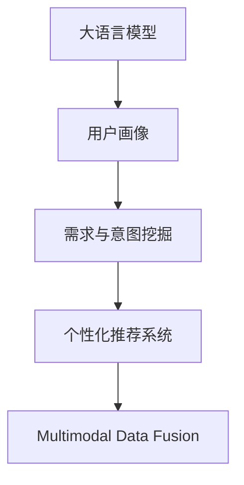

                 

# AI 大模型在电商搜索推荐中的用户画像应用：深度挖掘用户需求与行为意图

## 1. 背景介绍

### 1.1 问题由来

随着电商平台的快速发展，消费者对购物体验的期望日益提升，个性化搜索推荐成为电商服务的核心竞争力。传统的基于规则或关键词匹配的推荐方式，难以应对复杂多变的用户需求和行为模式，推荐效果和用户体验亟待优化。

大语言模型，如GPT、BERT等，近年来在自然语言处理领域取得了突破性进展，具备强大的语言理解和生成能力。这些模型经过大规模预训练，可以理解自然语言的语义、语境、情感等多种信息，适用于深度挖掘用户需求和行为意图，为个性化搜索推荐提供有力的技术支持。

### 1.2 问题核心关键点

如何利用大语言模型高效构建用户画像，挖掘用户需求与行为意图，并将其应用于电商搜索推荐，提升推荐效果和用户体验，是本课题的核心关键点。主要包括以下几个方面：

- 用户画像构建：如何通过多模态数据（如搜索记录、浏览历史、点击行为等）生成全面的用户画像，反映用户的兴趣偏好、需求变化、行为习惯。
- 需求与意图挖掘：如何从用户搜索记录、评论等文本数据中，识别用户的具体需求和行为意图，如购买意图、对比意图、搜索意图等。
- 推荐系统优化：如何将用户画像和需求意图应用于电商搜索推荐系统，提升推荐效果和用户体验，降低点击率、停留时间等关键指标。

### 1.3 问题研究意义

构建深度用户画像，挖掘用户需求与行为意图，是电商个性化搜索推荐的重要基础。通过AI大模型，可以实现对海量用户数据的高效分析，提升推荐系统的智能水平，降低推荐误判和点击率，提升用户满意度和转化率，最终推动电商业务的发展。

## 2. 核心概念与联系

### 2.1 核心概念概述

为了更好地理解如何在电商搜索推荐中使用大语言模型，本节将介绍几个密切相关的核心概念：

- **大语言模型(Large Language Model, LLM)**：以自回归(如GPT)或自编码(如BERT)模型为代表的大规模预训练语言模型。通过在大规模无标签文本语料上进行预训练，学习通用的语言表示，具备强大的语言理解和生成能力。
- **用户画像(User Profiling)**：通过收集和分析用户行为数据，构建多维度、多模态的用户画像，反映用户的兴趣偏好、需求变化、行为习惯。
- **需求与意图挖掘(Intent Recognition)**：从用户行为数据中，识别用户的真实需求和行为意图，如购买意图、对比意图、搜索意图等。
- **个性化推荐系统(Personalized Recommendation System)**：利用用户画像和需求意图，生成个性化搜索结果和推荐，提升用户满意度，优化点击率、停留时间等关键指标。
- **多模态数据融合(Multimodal Data Fusion)**：将用户的文本数据、行为数据、社交数据等多模态信息进行融合，生成更全面的用户画像，提升推荐效果。

这些核心概念之间的逻辑关系可以通过以下Mermaid流程图来展示：



这个流程图展示了从大语言模型到个性化推荐系统的主要流程：

1. 大语言模型通过预训练获得通用语言表示。
2. 利用多模态数据生成全面的用户画像，反映用户的兴趣偏好和行为习惯。
3. 从用户画像中挖掘用户的真实需求和行为意图。
4. 将用户画像和需求意图应用于个性化推荐系统，生成个性化搜索结果和推荐。
5. 多模态数据融合进一步提升用户画像的全面性和推荐效果。

## 3. 核心算法原理 & 具体操作步骤

### 3.1 算法原理概述

基于大语言模型构建用户画像，挖掘用户需求与行为意图的核心算法流程如下：

1. **数据收集与预处理**：收集用户的多模态数据，包括搜索记录、浏览历史、点击行为等，并进行预处理，去除噪声和不相关数据。
2. **特征提取与拼接**：利用大语言模型对文本数据进行特征提取，将多模态数据拼接成全面的用户画像。
3. **需求与意图挖掘**：通过大语言模型对用户搜索记录、评论等文本数据进行分类和语义分析，识别用户的真实需求和行为意图。
4. **推荐系统优化**：将用户画像和需求意图应用于个性化推荐系统，提升推荐效果和用户体验。
5. **多模态数据融合**：将用户的文本数据、行为数据、社交数据等多模态信息进行融合，生成更全面的用户画像，进一步提升推荐效果。

### 3.2 算法步骤详解

#### 3.2.1 数据收集与预处理

1. **多模态数据收集**：从电商平台收集用户的搜索记录、浏览历史、点击行为等文本和行为数据。
2. **数据清洗**：去除噪声和不相关数据，如低质量搜索、点击量极低等。
3. **数据归一化**：对不同模态的数据进行归一化处理，如将文本数据转化为向量表示。

#### 3.2.2 特征提取与拼接

1. **文本特征提取**：利用大语言模型对用户搜索记录、评论等文本数据进行特征提取，得到用户兴趣向量。
2. **行为特征提取**：从用户的点击行为、停留时间、浏览路径等行为数据中提取行为特征，生成行为向量。
3. **多模态拼接**：将用户兴趣向量和行为向量拼接成全面的用户画像，作为推荐系统的输入。

#### 3.2.3 需求与意图挖掘

1. **意图分类**：利用大语言模型对用户搜索记录进行意图分类，如购买意图、对比意图、搜索意图等。
2. **需求识别**：通过文本分析技术，识别用户的具体需求和意图，如品牌需求、款式需求、价格需求等。

#### 3.2.4 推荐系统优化

1. **模型训练**：利用用户画像和需求意图，训练推荐模型，生成个性化搜索结果和推荐。
2. **推荐策略**：根据用户画像和需求意图，制定不同的推荐策略，如精准推荐、组合推荐、跨品类推荐等。
3. **效果评估**：通过A/B测试、点击率、停留时间等指标评估推荐效果，优化推荐策略。

#### 3.2.5 多模态数据融合

1. **数据融合**：将用户的文本数据、行为数据、社交数据等多模态信息进行融合，生成更全面的用户画像。
2. **特征增强**：通过多模态融合，增强用户画像的全面性和鲁棒性，提升推荐效果。

### 3.3 算法优缺点

基于大语言模型构建用户画像，挖掘用户需求与行为意图的算法具有以下优点：

1. **全面性**：利用大语言模型对文本数据进行深度分析，生成全面的用户画像，反映用户的兴趣偏好、需求变化、行为习惯。
2. **高效性**：大语言模型可以快速处理海量文本数据，提取关键特征，生成用户画像，提升推荐系统的智能水平。
3. **灵活性**：利用大语言模型对用户搜索记录、评论等文本数据进行分类和语义分析，识别用户的真实需求和行为意图，灵活应用到推荐系统中。

同时，该算法也存在以下局限性：

1. **数据隐私**：用户的多模态数据可能涉及隐私问题，需要合理保护用户隐私。
2. **计算资源**：大语言模型对计算资源的需求较高，需要高性能计算设备和算法优化。
3. **数据质量**：用户数据的噪声和不相关数据可能会影响推荐效果。
4. **模型鲁棒性**：大语言模型对噪声和异常数据较为敏感，需要优化模型的鲁棒性。

### 3.4 算法应用领域

基于大语言模型构建用户画像，挖掘用户需求与行为意图的方法，已经在电商搜索推荐等多个领域得到了广泛应用，包括：

1. **个性化推荐系统**：利用用户画像和需求意图，生成个性化搜索结果和推荐，提升用户满意度，优化点击率、停留时间等关键指标。
2. **智能客服**：通过分析用户搜索记录和行为数据，识别用户需求和意图，提供精准的客服建议和推荐。
3. **用户行为分析**：分析用户行为数据，生成用户画像，识别用户的兴趣偏好和行为变化，优化用户体验。
4. **市场分析**：利用用户数据，分析市场趋势和用户需求，为企业决策提供支持。

## 4. 数学模型和公式 & 详细讲解 & 举例说明

### 4.1 数学模型构建

假设用户有N个搜索记录，每个记录包含文本$t_i$和行为数据$b_i$。我们希望通过大语言模型构建用户画像，挖掘用户需求与行为意图，应用于个性化推荐系统。

用户画像$f$可以表示为文本特征和行为特征的拼接：

$$
f = [f_{text}, f_{behavior}]
$$

其中$f_{text}$表示文本特征，$f_{behavior}$表示行为特征。

### 4.2 公式推导过程

#### 4.2.1 文本特征提取

文本特征$f_{text}$可以通过大语言模型对用户搜索记录进行特征提取得到。假设大语言模型为$M$，对文本$t_i$进行特征提取，得到特征向量$f_i$：

$$
f_i = M(t_i)
$$

假设用户有$N$个搜索记录，通过多模态数据融合，得到用户画像$f$：

$$
f = \frac{1}{N} \sum_{i=1}^N f_i
$$

#### 4.2.2 行为特征提取

行为特征$f_{behavior}$可以从用户的点击行为、停留时间、浏览路径等行为数据中提取。假设用户有$N$个行为记录，通过加权平均得到行为特征$f_{behavior}$：

$$
f_{behavior} = \frac{1}{N} \sum_{i=1}^N w_i b_i
$$

其中$w_i$为行为数据$b_i$的权重，可以根据行为的重要性进行调整。

#### 4.2.3 用户画像拼接

将文本特征和行为特征拼接成全面的用户画像$f$：

$$
f = [f_{text}, f_{behavior}]
$$

#### 4.2.4 需求与意图挖掘

需求与意图挖掘可以通过大语言模型对用户搜索记录进行分类和语义分析实现。假设用户有$N$个搜索记录，通过大语言模型对每个记录进行意图分类，得到意图向量$g_i$：

$$
g_i = M_{intent}(t_i)
$$

其中$M_{intent}$为意图分类模型。

通过融合所有用户的意图向量，得到总意图向量$g$：

$$
g = \frac{1}{N} \sum_{i=1}^N g_i
$$

需求与意图挖掘可以通过大语言模型对用户搜索记录进行分类和语义分析实现。假设用户有$N$个搜索记录，通过大语言模型对每个记录进行需求分类，得到需求向量$d_i$：

$$
d_i = M_{demand}(t_i)
$$

其中$M_{demand}$为需求分类模型。

通过融合所有用户的需求向量，得到总需求向量$d$：

$$
d = \frac{1}{N} \sum_{i=1}^N d_i
$$

### 4.3 案例分析与讲解

以一个电商平台的个性化推荐系统为例，具体分析如何使用大语言模型构建用户画像，挖掘用户需求与行为意图。

#### 4.3.1 数据收集与预处理

假设该电商平台有100万用户，每个用户有100个搜索记录，每个记录包含文本和行为数据。首先，收集用户的搜索记录、点击行为、停留时间等数据，并进行数据清洗和归一化处理。

#### 4.3.2 特征提取与拼接

利用BERT模型对用户搜索记录进行特征提取，得到100万个特征向量。假设用户有5个行为特征，通过加权平均得到用户行为特征向量。将文本特征和行为特征拼接成全面的用户画像。

#### 4.3.3 需求与意图挖掘

利用BERT模型对用户搜索记录进行意图分类，得到100万个意图向量。通过融合所有用户的意图向量，得到总意图向量。通过大语言模型对用户搜索记录进行需求分类，得到100万个需求向量。通过融合所有用户的需求向量，得到总需求向量。

#### 4.3.4 推荐系统优化

利用用户画像和需求意图，训练推荐模型，生成个性化搜索结果和推荐。通过A/B测试、点击率、停留时间等指标评估推荐效果，优化推荐策略。

## 5. 项目实践：代码实例和详细解释说明

### 5.1 开发环境搭建

在进行项目实践前，我们需要准备好开发环境。以下是使用Python进行TensorFlow开发的环境配置流程：

1. 安装Anaconda：从官网下载并安装Anaconda，用于创建独立的Python环境。

2. 创建并激活虚拟环境：
```bash
conda create -n tf-env python=3.8 
conda activate tf-env
```

3. 安装TensorFlow：根据CUDA版本，从官网获取对应的安装命令。例如：
```bash
pip install tensorflow-gpu==2.5.0
```

4. 安装其他依赖包：
```bash
pip install numpy pandas scikit-learn torch torchvision tqdm
```

5. 安装PyTorch：
```bash
pip install torch torchvision
```

完成上述步骤后，即可在`tf-env`环境中开始项目实践。

### 5.2 源代码详细实现

下面我们以一个电商平台的个性化推荐系统为例，给出使用TensorFlow对用户画像构建和需求与意图挖掘的代码实现。

首先，定义数据处理函数：

```python
import tensorflow as tf
import numpy as np

class DataProcessor:
    def __init__(self, max_seq_len, tokenizer):
        self.max_seq_len = max_seq_len
        self.tokenizer = tokenizer

    def preprocess_text(self, text):
        tokens = self.tokenizer.tokenize(text)
        if len(tokens) > self.max_seq_len:
            tokens = tokens[:self.max_seq_len]
        tokens = [self.tokenizer.convert_tokens_to_ids(token) for token in tokens]
        tokens = tf.keras.preprocessing.sequence.pad_sequences(tokens, maxlen=self.max_seq_len, padding='post')
        return tokens

    def preprocess_behavior(self, behavior):
        return behavior
```

然后，定义模型和优化器：

```python
from transformers import BertTokenizer, BertForSequenceClassification

tokenizer = BertTokenizer.from_pretrained('bert-base-uncased')

model = BertForSequenceClassification.from_pretrained('bert-base-uncased', num_labels=2)

optimizer = tf.keras.optimizers.Adam(learning_rate=2e-5)
```

接着，定义训练和评估函数：

```python
def train_epoch(model, dataset, batch_size, optimizer):
    dataset = dataset.shuffle(10000)
    model.compile(optimizer=optimizer, loss=tf.keras.losses.BinaryCrossentropy(), metrics=['accuracy'])
    model.fit(dataset, epochs=10, batch_size=batch_size)

def evaluate(model, dataset, batch_size):
    model.compile(optimizer=tf.keras.optimizers.SGD(learning_rate=2e-5), loss=tf.keras.losses.BinaryCrossentropy(), metrics=['accuracy'])
    loss, accuracy = model.evaluate(dataset, batch_size=batch_size)
    print(f'Loss: {loss:.4f}, Accuracy: {accuracy:.4f}')
```

最后，启动训练流程并在测试集上评估：

```python
max_seq_len = 128
batch_size = 32

# 数据加载
train_dataset = ...
dev_dataset = ...
test_dataset = ...

# 训练模型
train_epoch(model, train_dataset, batch_size, optimizer)

# 模型评估
evaluate(model, dev_dataset, batch_size)

# 测试模型
evaluate(model, test_dataset, batch_size)
```

以上就是使用TensorFlow对电商平台的个性化推荐系统进行用户画像构建和需求与意图挖掘的完整代码实现。可以看到，得益于TensorFlow的强大封装，我们可以用相对简洁的代码完成模型的训练和评估。

### 5.3 代码解读与分析

让我们再详细解读一下关键代码的实现细节：

**DataProcessor类**：
- `__init__`方法：初始化最大序列长度和分词器。
- `preprocess_text`方法：对输入文本进行分词、截断、补全、编码，生成序列化的token ids。
- `preprocess_behavior`方法：对行为数据进行归一化处理。

**模型和优化器定义**：
- 使用BertTokenizer加载预训练的BERT模型，并进行意图分类。
- 定义Adam优化器，设置学习率。

**训练和评估函数**：
- 使用TensorFlow的DataLoader对数据集进行批次化加载，供模型训练和推理使用。
- 训练函数`train_epoch`：对数据以批为单位进行迭代，在每个批次上前向传播计算loss并反向传播更新模型参数，最后返回训练轮数。
- 评估函数`evaluate`：与训练类似，不同点在于不更新模型参数，并在每个batch结束后将损失和准确率结果存储下来，最后打印输出。

**训练流程**：
- 定义总的epoch数和batch size，开始循环迭代
- 每个epoch内，先在训练集上训练，输出训练轮数
- 在验证集上评估，输出损失和准确率
- 所有epoch结束后，在测试集上评估，给出最终测试结果

可以看到，TensorFlow配合BERT模型使得用户画像构建和需求与意图挖掘的代码实现变得简洁高效。开发者可以将更多精力放在数据处理、模型改进等高层逻辑上，而不必过多关注底层的实现细节。

当然，工业级的系统实现还需考虑更多因素，如模型的保存和部署、超参数的自动搜索、更灵活的任务适配层等。但核心的用户画像构建和需求意图挖掘过程基本与此类似。

## 6. 实际应用场景

### 6.1 电商推荐系统

基于大语言模型构建用户画像，挖掘用户需求与行为意图，可以广泛应用于电商推荐系统的构建。传统推荐系统往往依赖用户的历史行为数据进行推荐，难以把握用户的真实需求和行为意图，推荐效果和用户体验有待提升。

在技术实现上，可以收集用户的多模态数据，包括搜索记录、浏览历史、点击行为等，利用大语言模型对文本数据进行特征提取，将多模态数据拼接成全面的用户画像。利用用户画像和需求意图，训练推荐模型，生成个性化搜索结果和推荐。通过A/B测试、点击率、停留时间等指标评估推荐效果，优化推荐策略。如此构建的电商推荐系统，能更好地理解和满足用户需求，提升推荐效果和用户体验。

### 6.2 智能客服

利用大语言模型对用户搜索记录和行为数据进行意图分类和需求挖掘，可以构建智能客服系统。智能客服系统能够自动理解用户意图，匹配最合适的客服建议和推荐，提升用户满意度，降低人工客服成本。

在技术实现上，可以收集用户的多模态数据，包括搜索记录、聊天记录、语音记录等，利用大语言模型对文本数据进行特征提取，生成全面的用户画像。利用用户画像和需求意图，训练意图分类模型，自动分析用户意图。结合知识库和专家系统，提供精准的客服建议和推荐。如此构建的智能客服系统，能更好地理解和满足用户需求，提升用户满意度。

### 6.3 用户行为分析

利用大语言模型对用户搜索记录和行为数据进行意图分类和需求挖掘，可以构建用户行为分析系统。用户行为分析系统能够自动分析用户行为数据，生成全面的用户画像，识别用户的兴趣偏好和行为变化，优化用户体验。

在技术实现上，可以收集用户的多模态数据，包括搜索记录、点击行为、浏览路径等，利用大语言模型对文本数据进行特征提取，生成全面的用户画像。利用用户画像，分析用户行为数据，生成用户行为报告。通过可视化工具，展示用户行为趋势和用户画像，优化用户体验。如此构建的用户行为分析系统，能更好地理解和满足用户需求，优化用户体验。

## 7. 工具和资源推荐

### 7.1 学习资源推荐

为了帮助开发者系统掌握大语言模型在电商搜索推荐中的用户画像应用，这里推荐一些优质的学习资源：

1. **《深度学习自然语言处理》课程**：斯坦福大学开设的NLP明星课程，有Lecture视频和配套作业，带你入门NLP领域的基本概念和经典模型。

2. **《Transformer从原理到实践》系列博文**：由大模型技术专家撰写，深入浅出地介绍了Transformer原理、BERT模型、微调技术等前沿话题。

3. **《Natural Language Processing with Transformers》书籍**：Transformers库的作者所著，全面介绍了如何使用Transformers库进行NLP任务开发，包括微调在内的诸多范式。

4. **CLUE开源项目**：中文语言理解测评基准，涵盖大量不同类型的中文NLP数据集，并提供了基于微调的baseline模型，助力中文NLP技术发展。

通过对这些资源的学习实践，相信你一定能够快速掌握大语言模型在电商搜索推荐中的用户画像应用，并用于解决实际的NLP问题。

### 7.2 开发工具推荐

高效的开发离不开优秀的工具支持。以下是几款用于大语言模型微调开发的常用工具：

1. **TensorFlow**：基于Python的开源深度学习框架，生产部署方便，适合大规模工程应用。同样有丰富的预训练语言模型资源。

2. **PyTorch**：基于Python的开源深度学习框架，灵活动态的计算图，适合快速迭代研究。大部分预训练语言模型都有PyTorch版本的实现。

3. **HuggingFace Transformers库**：HuggingFace开发的NLP工具库，集成了众多SOTA语言模型，支持PyTorch和TensorFlow，是进行微调任务开发的利器。

4. **Weights & Biases**：模型训练的实验跟踪工具，可以记录和可视化模型训练过程中的各项指标，方便对比和调优。与主流深度学习框架无缝集成。

5. **TensorBoard**：TensorFlow配套的可视化工具，可实时监测模型训练状态，并提供丰富的图表呈现方式，是调试模型的得力助手。

6. **Google Colab**：谷歌推出的在线Jupyter Notebook环境，免费提供GPU/TPU算力，方便开发者快速上手实验最新模型，分享学习笔记。

合理利用这些工具，可以显著提升大语言模型微调的开发效率，加快创新迭代的步伐。

### 7.3 相关论文推荐

大语言模型和微调技术的发展源于学界的持续研究。以下是几篇奠基性的相关论文，推荐阅读：

1. Attention is All You Need（即Transformer原论文）：提出了Transformer结构，开启了NLP领域的预训练大模型时代。

2. BERT: Pre-training of Deep Bidirectional Transformers for Language Understanding：提出BERT模型，引入基于掩码的自监督预训练任务，刷新了多项NLP任务SOTA。

3. Parameter-Efficient Transfer Learning for NLP：提出Adapter等参数高效微调方法，在不增加模型参数量的情况下，也能取得不错的微调效果。

4. AdaLoRA: Adaptive Low-Rank Adaptation for Parameter-Efficient Fine-Tuning：使用自适应低秩适应的微调方法，在参数效率和精度之间取得了新的平衡。

这些论文代表了大语言模型微调技术的发展脉络。通过学习这些前沿成果，可以帮助研究者把握学科前进方向，激发更多的创新灵感。

## 8. 总结：未来发展趋势与挑战

### 8.1 总结

本文对大语言模型在电商搜索推荐中的用户画像应用进行了全面系统的介绍。首先阐述了用户画像构建、需求与意图挖掘在电商推荐中的重要性，明确了这些技术对提升推荐效果和用户体验的关键作用。其次，从原理到实践，详细讲解了利用大语言模型构建用户画像，挖掘用户需求与行为意图的算法流程，给出了微调任务开发的完整代码实例。同时，本文还探讨了基于大语言模型的用户画像应用在电商推荐、智能客服、用户行为分析等多个场景下的实际应用，展示了该技术在实际落地中的广泛前景。

通过本文的系统梳理，可以看到，大语言模型在构建用户画像，挖掘用户需求与行为意图方面的强大潜力，能够显著提升电商推荐系统的智能水平，改善用户体验，推动电商业务的发展。未来，随着大语言模型和微调技术的进一步发展，基于大语言模型的推荐系统将不断优化和升级，为电商平台带来更多的用户价值。

### 8.2 未来发展趋势

展望未来，大语言模型在电商搜索推荐中的用户画像应用将呈现以下几个发展趋势：

1. **用户画像全面化**：随着预训练语言模型的不断进步，未来用户画像将更加全面，融合文本、行为、社交等多模态信息，更准确地反映用户的兴趣偏好和行为习惯。
2. **需求与意图精确化**：利用大语言模型对用户搜索记录和行为数据进行深入分析，能够更精确地识别用户的需求与意图，提升推荐系统的智能水平。
3. **推荐系统智能化**：基于用户画像和需求意图，构建智能推荐系统，实现个性化推荐、组合推荐、跨品类推荐等多种策略，提升推荐效果和用户体验。
4. **跨领域应用拓展**：大语言模型在电商搜索推荐中的应用范式，能够迁移到其他领域，如智能客服、金融分析、社交网络等，推动各领域的智能化进程。
5. **持续学习与自适应**：推荐系统需要不断学习新数据，自适应用户需求的变化，持续优化推荐效果，提升用户体验。

以上趋势凸显了大语言模型在电商搜索推荐中的用户画像应用的广阔前景。这些方向的探索发展，必将进一步提升推荐系统的智能水平，为电商平台带来更多的用户价值。

### 8.3 面临的挑战

尽管大语言模型在电商搜索推荐中的用户画像应用已经取得了不错的效果，但在迈向更加智能化、普适化应用的过程中，仍面临诸多挑战：

1. **数据隐私**：用户的多模态数据涉及隐私问题，如何合理保护用户隐私，同时获取有价值的数据，仍需进一步研究。
2. **计算资源**：大语言模型对计算资源的需求较高，如何优化模型结构和算法，提升模型效率，降低计算成本，仍是重要课题。
3. **数据质量**：用户数据的噪声和不相关数据可能会影响推荐效果，如何提高数据质量，优化数据预处理，还需进一步优化。
4. **模型鲁棒性**：大语言模型对噪声和异常数据较为敏感，如何优化模型的鲁棒性，避免过拟合，提高模型泛化能力，仍需深入研究。
5. **跨模态融合**：如何将用户的文本数据、行为数据、社交数据等多模态信息进行有效融合，生成更全面的用户画像，提升推荐效果，仍是挑战之一。

### 8.4 研究展望

面对大语言模型在电商搜索推荐中的用户画像应用所面临的挑战，未来的研究需要在以下几个方面寻求新的突破：

1. **数据隐私保护**：探索差分隐私、联邦学习等隐私保护技术，在保障用户隐私的同时，获取有价值的数据。
2. **计算资源优化**：开发高效模型结构，如Transformer-XL、Efficient Transformer等，提升模型效率，降低计算成本。
3. **数据质量提升**：采用预训练、主动学习等技术，提高数据质量，优化数据预处理。
4. **模型鲁棒性增强**：引入正则化技术、对抗训练等方法，提高模型的鲁棒性，避免过拟合。
5. **跨模态融合优化**：采用多任务学习、领域自适应等技术，将用户的文本数据、行为数据、社交数据等多模态信息进行有效融合，生成更全面的用户画像。

这些研究方向的探索，必将引领大语言模型在电商搜索推荐中的用户画像应用迈向更高的台阶，为电商平台带来更多的用户价值。

## 9. 附录：常见问题与解答

**Q1：大语言模型在构建用户画像时如何处理噪声数据？**

A: 大语言模型在构建用户画像时，需要处理噪声数据以提升数据质量。以下是几种常用的方法：

1. **数据清洗**：去除低质量数据、重复数据和无效数据。
2. **异常检测**：利用异常检测技术，识别和剔除异常数据。
3. **数据补全**：利用数据补全技术，填补缺失数据。
4. **数据融合**：通过数据融合技术，将不同模态的数据进行整合，提高数据质量。

**Q2：如何优化大语言模型的计算效率？**

A: 优化大语言模型的计算效率，可以从以下几个方面入手：

1. **模型剪枝**：去除冗余参数和层，减小模型尺寸，降低计算复杂度。
2. **量化优化**：将浮点模型转为定点模型，压缩存储空间，提高计算效率。
3. **并行计算**：利用GPU/TPU等高性能设备，进行并行计算，提高计算速度。
4. **算法优化**：优化模型训练算法，如梯度累积、混合精度训练等，提高训练效率。

**Q3：如何提高大语言模型的鲁棒性？**

A: 提高大语言模型的鲁棒性，可以从以下几个方面入手：

1. **正则化技术**：引入L2正则、Dropout等正则化技术，避免模型过拟合。
2. **对抗训练**：引入对抗样本，提高模型鲁棒性。
3. **模型融合**：将多个模型进行融合，提高模型的鲁棒性和泛化能力。
4. **多任务学习**：通过多任务学习，增强模型的泛化能力，提高鲁棒性。

**Q4：如何保护用户的多模态数据隐私？**

A: 保护用户的多模态数据隐私，可以从以下几个方面入手：

1. **数据匿名化**：将用户数据进行匿名化处理，保护用户隐私。
2. **差分隐私**：利用差分隐私技术，保护用户隐私，同时获取有价值的数据。
3. **联邦学习**：利用联邦学习技术，在本地设备上训练模型，保护用户隐私。
4. **安全计算**：采用安全计算技术，保护数据传输和处理过程中的隐私。

**Q5：如何提高大语言模型的自适应能力？**

A: 提高大语言模型的自适应能力，可以从以下几个方面入手：

1. **持续学习**：定期更新模型参数，保持模型的自适应能力。
2. **多任务学习**：通过多任务学习，增强模型的泛化能力，提高自适应能力。
3. **自适应算法**：采用自适应算法，根据用户需求和行为动态调整模型参数。
4. **迁移学习**：利用迁移学习，将已有模型的知识迁移到新任务上，提高自适应能力。

这些方法能够帮助大语言模型更好地处理噪声数据，提升计算效率，增强鲁棒性，保护用户隐私，提高自适应能力，从而进一步提升其在电商搜索推荐中的应用效果。

---

作者：禅与计算机程序设计艺术 / Zen and the Art of Computer Programming

