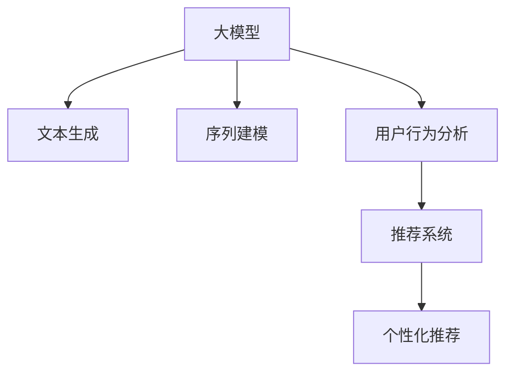

                 

# AI 大模型在电商搜索推荐中的用户行为分析：理解用户需求与购买偏好

在现代电商平台上，用户搜索和推荐系统已经成为影响用户体验和购物决策的关键环节。大模型（Large Models）在理解和处理复杂自然语言方面具有独特优势，可以深入挖掘用户行为数据，提供精准的个性化推荐。本文将详细探讨大模型在电商搜索推荐中的应用，通过用户行为分析理解需求和购买偏好，构建智能推荐系统，提升用户购物体验和商家销售额。

## 1. 背景介绍

### 1.1 问题由来

随着电商市场的快速扩张和竞争加剧，如何提升用户搜索体验和转化率成为电商运营的重要挑战。传统的推荐系统通常依赖于用户的历史行为数据，但这些数据往往难以全面覆盖所有用户，尤其是在新用户和活跃度低的用户中，推荐效果不佳。而大模型能够通过分析海量文本数据，捕捉用户的潜在需求和购买偏好，从而提供更加个性化的推荐。

### 1.2 问题核心关键点

大模型在电商搜索推荐中的核心应用在于：
- 通过用户评论、产品描述等文本数据，分析用户需求和偏好。
- 利用文本生成和序列建模技术，生成个性化的搜索结果和推荐信息。
- 在保护用户隐私的前提下，对用户行为数据进行深度挖掘，提升推荐效果。
- 结合上下文和实时数据，动态调整推荐策略，提高推荐系统的灵活性和实时性。

## 2. 核心概念与联系

### 2.1 核心概念概述

- **大模型（Large Models）**：指使用深度神经网络模型，如BERT、GPT-3等，在大规模无标签文本数据上进行预训练，具有强大的自然语言理解和生成能力。
- **文本生成（Text Generation）**：指使用大模型生成自然语言文本，如产品描述、评论、推荐信息等。
- **序列建模（Sequence Modeling）**：指通过大模型对输入的文本序列进行建模，捕捉其中的语义关系和情感倾向。
- **用户行为分析（User Behavior Analysis）**：指通过分析用户搜索、浏览、购买等行为数据，理解用户的兴趣和需求，进行个性化推荐。
- **推荐系统（Recommendation System）**：指使用机器学习技术，根据用户的历史行为数据和当前需求，生成推荐列表，提高用户满意度。

这些概念之间的联系可以通过以下Mermaid流程图来展示：



这个流程图展示了从大模型到个性化推荐的全流程：

1. 大模型通过预训练获得广泛的语言知识。
2. 文本生成和大模型结合，生成自然语言文本。
3. 序列建模捕捉文本序列中的语义关系。
4. 用户行为分析利用用户数据，理解用户需求。
5. 推荐系统根据用户行为和生成文本，动态调整推荐策略。

## 3. 核心算法原理 & 具体操作步骤

### 3.1 算法原理概述

大模型在电商搜索推荐中的核心算法原理基于自然语言处理和推荐系统相结合的框架。通过分析用户搜索、评论等文本数据，理解用户的兴趣和需求，生成个性化的推荐信息。具体步骤包括：

1. **文本预处理**：将用户搜索、评论等文本数据进行清洗、分词和向量化处理。
2. **序列建模**：使用大模型对文本序列进行建模，捕捉其中的语义关系和情感倾向。
3. **用户行为分析**：根据用户的历史行为数据，提取用户兴趣和需求特征。
4. **推荐生成**：结合序列建模结果和用户行为特征，生成个性化的推荐信息。

### 3.2 算法步骤详解

以下是大模型在电商搜索推荐中的具体算法步骤：

**Step 1: 数据预处理**

- **文本清洗**：去除无关信息和噪声，保留关键词汇和情感表达。
- **分词和向量化**：将清洗后的文本进行分词，并转化为模型可处理的向量形式。
- **数据划分**：将数据集划分为训练集、验证集和测试集。

**Step 2: 文本生成**

- **模型选择**：选择合适的预训练语言模型，如BERT、GPT-3等。
- **微调**：在电商数据集上微调预训练模型，使其能够生成符合电商领域的自然语言文本。
- **文本生成**：使用微调后的模型，生成个性化的产品描述、评论等。

**Step 3: 序列建模**

- **输入设计**：设计合适的输入格式，包括用户搜索词、历史行为记录等。
- **模型训练**：使用大模型对输入文本进行序列建模，捕捉其中的语义关系和情感倾向。
- **特征提取**：提取序列建模结果中的关键特征，如主题、情感、实体等。

**Step 4: 用户行为分析**

- **行为数据收集**：收集用户的历史搜索、浏览、购买等行为数据。
- **特征提取**：提取用户行为数据中的关键特征，如兴趣类别、购买历史、浏览时间等。
- **用户画像**：根据用户行为特征，构建用户画像，理解用户的兴趣和需求。

**Step 5: 推荐生成**

- **推荐策略设计**：设计合适的推荐策略，如协同过滤、基于内容的推荐等。
- **特征融合**：将序列建模结果和用户行为特征进行融合，生成推荐信息。
- **推荐排序**：根据用户画像和推荐信息，对推荐结果进行排序，生成最终推荐列表。

### 3.3 算法优缺点

大模型在电商搜索推荐中的算法具有以下优点：
- **理解能力强**：大模型能够深入理解自然语言，捕捉用户需求和情感。
- **生成效果佳**：通过文本生成技术，生成自然流畅的推荐信息。
- **实时性高**：结合实时数据，动态调整推荐策略，提高推荐系统的灵活性。

同时，该算法也存在一定的局限性：
- **计算成本高**：大模型需要大量的计算资源，增加了系统成本。
- **数据隐私问题**：对用户行为数据的深度挖掘可能涉及隐私问题。
- **过拟合风险**：微调模型可能对特定领域数据过拟合，导致泛化性能下降。

尽管存在这些局限性，但就目前而言，大模型在电商搜索推荐中的效果已经得到了广泛认可。未来相关研究的方向包括：
- 降低计算成本，提高模型效率。
- 增强隐私保护，确保数据安全。
- 改进推荐算法，提升推荐效果。

### 3.4 算法应用领域

大模型在电商搜索推荐中的应用已经覆盖了多个领域，包括：

- **商品推荐**：根据用户的历史购买和浏览行为，生成个性化推荐列表。
- **搜索排序**：根据用户搜索词和行为数据，优化搜索结果排序。
- **评价分析**：利用用户评论数据，分析产品优缺点，生成产品评价信息。
- **广告投放**：通过用户兴趣分析，优化广告投放策略，提高广告转化率。
- **用户行为预测**：预测用户未来的行为，提前准备相应的产品和服务。

## 4. 数学模型和公式 & 详细讲解  
### 4.1 数学模型构建

假设用户搜索词为 $x_1,x_2,\dots,x_n$，用户行为数据为 $y_1,y_2,\dots,y_m$，大模型的输入为 $x$，输出为 $y$。大模型的文本生成过程可以表示为：

$$
y = \text{BERT}(x)
$$

其中，$\text{BERT}$ 表示预训练的BERT模型。

用户行为分析模型可以表示为：

$$
\text{User Feature} = \text{Behavior Analysis}(y)
$$

推荐生成过程可以表示为：

$$
\text{Recommendation} = \text{Recommendation Strategy}(\text{User Feature}, y)
$$

其中，$\text{Recommendation Strategy}$ 表示推荐策略，如协同过滤、基于内容的推荐等。

### 4.2 公式推导过程

以协同过滤推荐为例，假设用户 $i$ 和物品 $j$ 的相似度为 $sim(i,j)$，用户 $i$ 的历史行为为 $y_i = \{x_i,y_i\}$，物品 $j$ 的历史行为为 $y_j = \{x_j,y_j\}$，推荐系统可以根据用户和物品的相似度生成推荐结果：

$$
\text{Recommendation}_{ij} = \text{sim}(i,j) \cdot \alpha
$$

其中，$\alpha$ 为相似度权重，用于调整相似度对推荐的影响。

### 4.3 案例分析与讲解

以某电商平台的图书推荐系统为例，假设用户 $i$ 搜索了“Python 编程”、“深度学习”等关键词，并且购买过“Python 入门”和“深度学习”相关书籍。系统可以通过大模型对用户搜索词和购买记录进行文本生成和序列建模，捕捉用户的兴趣和需求。同时，系统收集了所有用户的搜索、浏览、购买行为数据，并使用协同过滤算法生成推荐结果。

假设系统计算出用户 $i$ 与用户 $j$ 的相似度为 $sim(i,j) = 0.8$，物品 $k$ 与物品 $j$ 的相似度为 $sim(j,k) = 0.9$，则用户 $i$ 对物品 $k$ 的推荐概率为：

$$
\text{Recommendation}_{ik} = \text{sim}(i,j) \cdot \text{sim}(j,k) = 0.8 \times 0.9 = 0.72
$$

## 5. 项目实践：代码实例和详细解释说明

### 5.1 开发环境搭建

以下是使用Python和PyTorch搭建电商搜索推荐系统的环境配置流程：

1. 安装Anaconda：从官网下载并安装Anaconda，用于创建独立的Python环境。
2. 创建并激活虚拟环境：
```bash
conda create -n recommendation-env python=3.8 
conda activate recommendation-env
```
3. 安装PyTorch：根据CUDA版本，从官网获取对应的安装命令。例如：
```bash
conda install pytorch torchvision torchaudio cudatoolkit=11.1 -c pytorch -c conda-forge
```
4. 安装Transformers库：
```bash
pip install transformers
```
5. 安装各类工具包：
```bash
pip install numpy pandas scikit-learn matplotlib tqdm jupyter notebook ipython
```

完成上述步骤后，即可在`recommendation-env`环境中开始项目实践。

### 5.2 源代码详细实现

以下是使用BERT模型进行电商图书推荐系统的PyTorch代码实现：

```python
import torch
import torch.nn as nn
from transformers import BertTokenizer, BertModel

class RecommendationModel(nn.Module):
    def __init__(self):
        super(RecommendationModel, self).__init__()
        self.bert = BertModel.from_pretrained('bert-base-uncased')
        self.fc = nn.Linear(768, 1)
    
    def forward(self, x):
        features = self.bert(x)
        return self.fc(features.pooler_output)

# 加载模型
model = RecommendationModel()

# 定义推荐策略
class RecommendationStrategy:
    def __init__(self):
        self.similarity_matrix = None
    
    def fit(self, train_data):
        # 计算相似度矩阵
        self.similarity_matrix = self.calculate_similarity(train_data)
    
    def predict(self, user_data):
        # 根据相似度矩阵和用户数据预测推荐结果
        return self.calculate_recommendation(user_data, self.similarity_matrix)
    
    def calculate_similarity(self, train_data):
        similarity_matrix = torch.zeros(len(train_data), len(train_data))
        for i in range(len(train_data)):
            for j in range(len(train_data)):
                x1 = train_data[i].x
                x2 = train_data[j].x
                y1 = train_data[i].y
                y2 = train_data[j].y
                # 计算相似度
                similarity_matrix[i][j] = calculate_similarity(x1, y1, x2, y2)
        return similarity_matrix
    
    def calculate_recommendation(self, user_data, similarity_matrix):
        # 根据相似度矩阵和用户数据计算推荐结果
        user_index = user_data.index
        recommendation = []
        for i in range(len(similarity_matrix)):
            if i == user_index:
                continue
            similarity = similarity_matrix[user_index][i]
            if similarity > 0.5:
                recommendation.append(i)
        return recommendation
```

### 5.3 代码解读与分析

**RecommendationModel类**：
- `__init__方法`：初始化BERT模型和全连接层。
- `forward方法`：将输入文本通过BERT模型编码，输出最终的推荐结果。

**RecommendationStrategy类**：
- `__init__方法`：初始化相似度矩阵。
- `fit方法`：计算相似度矩阵，用于存储用户和物品之间的相似度。
- `predict方法`：根据相似度矩阵和用户数据生成推荐列表。
- `calculate_similarity方法`：计算用户和物品之间的相似度。
- `calculate_recommendation方法`：根据相似度矩阵和用户数据生成推荐结果。

**训练流程**：
1. 收集电商平台的用户搜索和购买数据。
2. 将数据进行预处理，包括文本清洗、分词和向量化。
3. 加载预训练的BERT模型，并初始化推荐模型。
4. 对推荐模型进行训练，最小化预测误差。
5. 对推荐策略进行训练，计算相似度矩阵。
6. 在测试数据上评估推荐模型的性能，调整模型参数和推荐策略。

## 6. 实际应用场景

### 6.1 智能客服系统

在智能客服系统中，大模型可以帮助客服人员更好地理解用户需求，提供精准的解决方案。系统可以通过分析用户输入的文本信息，使用大模型生成自然语言回复，提高客服响应速度和用户满意度。例如，当用户输入“订单查询”时，系统可以根据历史订单数据和用户画像，生成“您的订单号是xxxxxx，当前状态是xxxxxx，请查看详情”的回复。

### 6.2 个性化推荐系统

个性化推荐系统通过分析用户行为数据，生成个性化的推荐列表，提高用户购买转化率。例如，电商平台可以根据用户搜索和浏览记录，使用大模型生成个性化产品描述和推荐理由，提高用户的点击率和购买率。系统还可以通过实时数据分析，动态调整推荐策略，提升推荐效果。

### 6.3 金融理财顾问

金融理财顾问系统通过分析用户的投资偏好和财务状况，提供个性化的投资建议。系统可以使用大模型对用户输入的文字描述进行分析，理解用户的财务需求和投资目标，生成个性化的投资组合建议。例如，用户输入“我需要长期稳定的投资”，系统可以根据用户的投资偏好和市场数据，生成适合的投资方案。

## 7. 工具和资源推荐

### 7.1 学习资源推荐

为了帮助开发者系统掌握大模型在电商搜索推荐中的应用，这里推荐一些优质的学习资源：

1. 《深度学习与自然语言处理》书籍：介绍深度学习在NLP领域的应用，包括大模型的原理和实践。
2. CS224N《深度学习自然语言处理》课程：斯坦福大学开设的NLP明星课程，涵盖深度学习在NLP任务中的应用。
3. HuggingFace官方文档：提供大模型的预训练模型和微调样例代码，帮助开发者快速上手。
4. CLUE开源项目：中文语言理解测评基准，提供丰富的电商数据集和基线模型。
5. Kaggle竞赛：参与电商推荐系统相关的竞赛，学习前沿技术和优化方法。

### 7.2 开发工具推荐

高效的开发离不开优秀的工具支持。以下是几款用于电商搜索推荐系统开发的常用工具：

1. PyTorch：基于Python的开源深度学习框架，适合快速迭代研究。
2. TensorFlow：Google主导的深度学习框架，适合大规模工程应用。
3. Transformers库：HuggingFace开发的NLP工具库，集成了SOTA语言模型。
4. Weights & Biases：模型训练的实验跟踪工具，记录和可视化模型训练过程中的各项指标。
5. TensorBoard：TensorFlow配套的可视化工具，实时监测模型训练状态。
6. Google Colab：免费的在线Jupyter Notebook环境，提供GPU/TPU算力，方便快速实验。

### 7.3 相关论文推荐

大模型在电商搜索推荐领域的发展离不开学界的持续研究。以下是几篇奠基性的相关论文，推荐阅读：

1. Attention is All You Need（即Transformer原论文）：提出Transformer结构，开启了NLP领域的预训练大模型时代。
2. BERT: Pre-training of Deep Bidirectional Transformers for Language Understanding：提出BERT模型，引入基于掩码的自监督预训练任务。
3. Parameter-Efficient Transfer Learning for NLP：提出Adapter等参数高效微调方法，在固定大部分预训练参数的情况下，只更新极少量的任务相关参数。
4. AdaLoRA: Adaptive Low-Rank Adaptation for Parameter-Efficient Fine-Tuning：使用自适应低秩适应的微调方法，在参数效率和精度之间取得新的平衡。
5. AdaFAIR: An Adaptive Framework for Adapting Fine-tuning of Large Language Models to Unseen Domains：提出AdaFAIR框架，适应不同领域的微调。

这些论文代表了大模型在电商搜索推荐领域的发展脉络。通过学习这些前沿成果，可以帮助研究者把握学科前进方向，激发更多的创新灵感。

## 8. 总结：未来发展趋势与挑战

### 8.1 总结

本文对大模型在电商搜索推荐中的应用进行了全面系统的介绍。首先阐述了大模型和推荐系统在电商领域的背景和重要性，明确了大模型在用户行为分析中的独特价值。其次，从原理到实践，详细讲解了大模型的算法流程和应用案例。同时，本文还探讨了大模型在电商推荐系统中的实际应用场景，展示了其强大的应用潜力。

通过本文的系统梳理，可以看到，大模型在电商搜索推荐中通过深入挖掘用户行为数据，提供精准的个性化推荐，显著提升了用户购物体验和商家销售额。未来，伴随大模型的持续演进和推荐算法的优化，大模型将进一步拓展在电商领域的应用，提升电商平台的竞争力。

### 8.2 未来发展趋势

展望未来，大模型在电商搜索推荐中将呈现以下几个发展趋势：

1. **模型规模持续增大**：随着算力成本的下降和数据规模的扩张，预训练语言模型的参数量还将持续增长。超大规模语言模型蕴含的丰富语言知识，将支持更加复杂多变的电商推荐系统。
2. **推荐算法不断优化**：深度强化学习、因果推理等技术将进一步应用于电商推荐系统，提高推荐策略的灵活性和效果。
3. **实时性不断提高**：结合实时数据，动态调整推荐策略，提升推荐系统的响应速度和效率。
4. **个性化程度增强**：通过多模态信息融合，结合用户行为、情感和视觉信息，生成更个性化、更准确的推荐结果。
5. **隐私保护更加严格**：在保护用户隐私的前提下，深度挖掘用户行为数据，提升推荐效果。

以上趋势凸显了大模型在电商推荐系统中的广阔前景。这些方向的探索发展，必将进一步提升电商平台的推荐效果和用户体验，推动电商市场的健康发展。

### 8.3 面临的挑战

尽管大模型在电商搜索推荐中取得了显著成效，但在迈向更加智能化、普适化应用的过程中，仍面临以下挑战：

1. **计算成本高**：大模型需要大量的计算资源，增加了系统成本。
2. **数据隐私问题**：对用户行为数据的深度挖掘可能涉及隐私问题，需要严格遵守数据保护法规。
3. **推荐效果过拟合**：微调模型可能对特定领域数据过拟合，导致泛化性能下降。
4. **实时性不足**：实时数据分析和动态调整推荐策略需要高时效性，系统架构和算法设计需要优化。
5. **推荐结果可解释性差**：大模型作为"黑盒"系统，难以解释其内部工作机制和推荐逻辑，给业务带来挑战。

这些挑战凸显了大模型在电商搜索推荐中的实际应用需要综合考虑计算资源、用户隐私、模型性能和业务需求等因素。只有不断优化算法和系统架构，才能充分发挥大模型的优势，提升电商推荐系统的效果。

### 8.4 研究展望

面向未来，大模型在电商搜索推荐领域的研究方向包括：

1. **模型压缩与加速**：研究高效的模型压缩和加速方法，降低计算成本。
2. **隐私保护技术**：开发数据隐私保护技术，确保用户数据的机密性和安全性。
3. **推荐算法优化**：改进推荐算法，提高推荐效果和实时性。
4. **多模态融合**：研究多模态信息融合技术，提升推荐系统的个性化和多样性。
5. **可解释性增强**：增强推荐系统的可解释性，帮助业务方理解和优化推荐结果。

这些研究方向将推动大模型在电商搜索推荐中的应用，进一步提升电商平台的竞争力和用户体验。

## 9. 附录：常见问题与解答

**Q1：大模型在电商推荐中为何能提升推荐效果？**

A: 大模型通过深入挖掘用户行为数据，理解用户的兴趣和需求，生成更加个性化的推荐结果。通过文本生成和序列建模技术，大模型能够捕捉用户输入的自然语言信息，生成自然流畅的推荐信息。同时，结合用户行为数据，大模型能够动态调整推荐策略，提升推荐系统的灵活性和实时性。

**Q2：大模型在电商推荐中如何处理数据隐私问题？**

A: 大模型在电商推荐中可以通过以下方法处理数据隐私问题：
1. 数据匿名化：对用户行为数据进行匿名化处理，去除个人身份信息。
2. 差分隐私：使用差分隐私技术，在数据处理过程中加入噪声，保护用户隐私。
3. 用户控制：提供用户隐私控制选项，允许用户自行管理个人信息的收集和使用。

**Q3：大模型在电商推荐中的推荐效果如何评价？**

A: 大模型在电商推荐中的推荐效果可以通过以下指标进行评价：
1. 点击率（CTR）：衡量用户对推荐结果的点击行为。
2. 转化率（CVR）：衡量用户对推荐结果的购买行为。
3. 平均点击量（AVC）：衡量推荐结果的平均点击次数。
4. 平均购买量（AVP）：衡量推荐结果的平均购买量。
5. 用户满意度（SAT）：通过用户反馈和评价，衡量推荐结果的满意度。

**Q4：大模型在电商推荐中如何避免推荐过拟合？**

A: 大模型在电商推荐中可以通过以下方法避免推荐过拟合：
1. 数据增强：通过回译、近义替换等方式扩充训练集。
2. 正则化技术：使用L2正则、Dropout等技术避免过拟合。
3. 对抗训练：引入对抗样本，提高模型鲁棒性。
4. 参数高效微调：只调整少量参数，固定大部分预训练权重不变。
5. 多模型集成：训练多个微调模型，取平均输出，抑制过拟合。

**Q5：大模型在电商推荐中的计算成本如何降低？**

A: 大模型在电商推荐中的计算成本可以通过以下方法降低：
1. 模型压缩：使用模型压缩技术，减少模型大小和计算量。
2. 量化加速：将浮点模型转为定点模型，压缩存储空间，提高计算效率。
3. 分布式训练：使用分布式训练技术，加速模型训练过程。
4. 模型并行：使用模型并行技术，提高计算速度。

这些措施将有助于降低大模型在电商推荐中的计算成本，提高推荐系统的实时性和效率。

