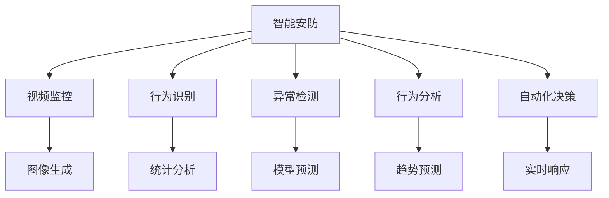

                 

# AIGC助力智能安防建设

> 关键词：人工智能(AI)、生成对抗网络(GAN)、智能安防、视频监控、图像识别、面部识别、目标跟踪、行为分析、自动化决策

## 1. 背景介绍

### 1.1 问题由来
随着科技的飞速发展，安防领域正在经历着从传统人工监控向智能安防的转型。传统的安防系统依赖人工监控，不仅成本高、效率低，而且难以处理大规模数据，且缺乏实时响应能力。而智能安防系统则通过部署传感器、摄像头等设备，实时收集视频、音频等数据，再利用人工智能技术进行实时分析，及时发现异常情况，自动触发报警或进行自动化决策，大大提高了安防系统的智能化水平和安全性。

近年来，生成对抗网络（GAN）和生成式预训练Transformer（GPT）等先进技术在图像生成、自然语言处理等领域取得了显著进展，但也应用于智能安防建设。通过AI技术对视频、图像进行实时处理，智能安防系统能够提供更加精准、高效的安防监控服务。

### 1.2 问题核心关键点
智能安防系统通过实时监测和分析环境中的各类数据，进行行为识别、异常检测、行为分析等任务，从而实现智能监控、预警和自动化决策。其核心关键点包括：

- **实时处理**：对视频、图像数据进行实时处理，及时发现异常情况。
- **高效分析**：利用先进的AI技术进行行为识别、异常检测和行为分析，提升安防效率。
- **自动化决策**：基于智能算法自动进行报警、调度、指挥等决策，实现实时响应。
- **协同联动**：与门禁、报警、消防等系统进行联动，提升整体安防能力。

智能安防系统通过AIGC（人工智能+生成对抗网络）等技术，实现了对海量视频数据的高效分析和实时处理，为公共安全、企业安全等领域提供了强大的保障。

### 1.3 问题研究意义
智能安防系统的应用，可以显著提升安防效率和反应速度，降低安防成本，提高安全性。AI技术的应用，使得智能安防系统能够处理大规模数据，具备更强的数据融合和分析能力，更快速地发现异常情况并采取行动，从而减少因漏报、误报带来的安全风险。

AI技术在智能安防中的应用，也推动了AI技术在社会各领域的推广和应用，提升了社会整体安全水平。

## 2. 核心概念与联系

### 2.1 核心概念概述

为更好地理解智能安防系统的建设，本节将介绍几个关键概念及其之间的关系：

- **智能安防**：通过人工智能技术进行视频监控、行为分析、异常检测等任务的系统。
- **生成对抗网络（GAN）**：一种生成模型，通过对抗生成器和判别器进行训练，生成逼真、多样化的图像、视频等数据。
- **生成式预训练Transformer（GPT）**：一种生成式模型，通过自监督学习和预训练，学习到丰富、多模态的表示。
- **行为识别**：通过对视频、图像等数据进行特征提取和分类，自动识别出特定行为，如入侵、偷窃、火灾等。
- **异常检测**：通过统计分析、模型预测等方法，识别出异常事件，如异常行为、异常物体等。
- **行为分析**：通过对个体行为、群体行为进行分析，预测行为趋势，评估行为风险。
- **自动化决策**：基于智能算法，自动进行报警、调度、指挥等决策，提升安防系统的智能化水平。

这些概念之间的逻辑关系可以通过以下Mermaid流程图来展示：



这个流程图展示了智能安防系统的主要组件和功能：

1. 视频监控：采集视频、图像等数据，为系统提供原始数据。
2. 行为识别：对视频、图像进行特征提取和分类，自动识别出特定行为。
3. 异常检测：通过统计分析、模型预测等方法，识别出异常事件。
4. 行为分析：分析个体和群体行为，评估行为风险，预测行为趋势。
5. 自动化决策：基于智能算法，自动进行报警、调度、指挥等决策。
6. 图像生成：通过GAN生成逼真、多样化的图像数据，提升系统数据质量。

这些组件和功能相互关联，共同构建起智能安防系统的核心能力。

## 3. 核心算法原理 & 具体操作步骤
### 3.1 算法原理概述

智能安防系统的核心算法原理主要基于生成对抗网络（GAN）和生成式预训练Transformer（GPT）等技术，以下是其核心算法原理的概述：

- **生成对抗网络（GAN）**：生成对抗网络通过训练一个生成器和一个判别器，使生成器生成逼真的视频、图像等数据，同时判别器能够区分真实数据和生成数据。通过这种对抗训练过程，生成器能够生成高质量的样本数据，丰富智能安防系统的数据源。

- **生成式预训练Transformer（GPT）**：GPT通过大规模无标签文本数据进行预训练，学习到丰富的语言知识和表达能力。将其应用于智能安防系统，可以用于生成各种安防指令、报警信息等自然语言描述，提升系统的智能化和自动化水平。

### 3.2 算法步骤详解

智能安防系统的算法步骤主要包括以下几个关键步骤：

**Step 1: 准备数据和预训练模型**

- 收集智能安防系统所需的视频监控数据，包括正常行为和异常行为的视频数据。
- 使用GAN生成逼真、多样化的图像数据，丰富训练集。
- 准备预训练的Transformer模型，如BERT、GPT等，作为智能安防系统的基础模型。

**Step 2: 行为识别和异常检测**

- 使用行为识别算法对视频数据进行特征提取和分类，自动识别出各种行为，如入侵、偷窃、火灾等。
- 使用异常检测算法对行为数据进行统计分析和模型预测，识别出异常行为，如异常行为、异常物体等。

**Step 3: 行为分析和自动化决策**

- 使用行为分析算法对个体和群体行为进行分析，评估行为风险，预测行为趋势。
- 基于智能算法，自动进行报警、调度、指挥等决策，提升安防系统的智能化水平。

### 3.3 算法优缺点

智能安防系统基于AIGC技术的优点包括：

1. **实时处理**：通过实时分析视频、图像数据，能够快速发现异常情况并采取行动。
2. **高效分析**：利用先进的AI技术进行行为识别、异常检测和行为分析，提升安防效率。
3. **自动化决策**：基于智能算法自动进行报警、调度、指挥等决策，实现实时响应。
4. **数据丰富**：通过GAN生成逼真、多样化的图像数据，丰富训练集，提升模型性能。
5. **智能化高**：利用GPT生成自然语言描述，提升系统的智能化和自动化水平。

然而，智能安防系统也存在一些缺点：

1. **数据隐私**：视频监控数据涉及隐私问题，需采取严格的数据保护措施。
2. **算法复杂**：高级算法如GAN和GPT等需要大量的计算资源和时间。
3. **成本高**：先进的AI技术需要较高的硬件投入，前期成本较高。
4. **依赖标注数据**：部分算法如行为识别、异常检测需要标注数据进行训练，标注成本较高。

### 3.4 算法应用领域

智能安防系统在大规模视频监控、公共安全、企业安全等领域具有广泛的应用前景，以下是几个主要应用场景：

1. **公共安全**：在城市、社区等公共场所部署智能安防系统，通过视频监控、行为分析等技术，实时监测和识别异常情况，提高公共安全水平。
2. **企业安全**：在工厂、园区等企业环境中部署智能安防系统，通过视频监控、行为识别、异常检测等技术，实时监测和防范各种安全风险，提升企业安全管理水平。
3. **监狱安防**：在监狱等特殊环境中部署智能安防系统，通过视频监控、行为分析等技术，实时监测和预警可能的安全事件，提升监狱管理的安全性和智能化水平。
4. **交通监控**：在交通要道、路口等部署智能安防系统，通过视频监控、行为分析等技术，实时监测交通情况，识别和防范各种交通违法行为，提升交通管理水平。

## 4. 数学模型和公式 & 详细讲解 & 举例说明

### 4.1 数学模型构建

智能安防系统的主要数学模型包括：

- **视频生成模型**：通过GAN生成逼真、多样化的视频数据。
- **行为识别模型**：通过深度学习模型（如CNN、RNN等）对视频数据进行特征提取和分类。
- **异常检测模型**：通过统计分析、模型预测等方法，识别出异常事件。
- **行为分析模型**：通过深度学习模型（如RNN、LSTM等）对行为数据进行分析和预测。
- **自动化决策模型**：基于智能算法（如SVM、决策树等）自动进行报警、调度、指挥等决策。

### 4.2 公式推导过程

以下以行为识别模型为例，推导深度学习模型的基本结构：

假设输入视频数据为 $x_t=(x_{t-1},x_t,x_{t+1})$，其中 $x_{t-1},x_t,x_{t+1}$ 分别表示前一帧、当前帧和后一帧的视频图像。

行为识别模型的目标是识别出当前帧的视频数据是否属于异常行为，输出一个二分类概率 $p(y=1|x_t)$。

根据深度学习模型的基本原理，行为识别模型可以表示为：

$$
p(y=1|x_t) = \sigma(W_h \cdot \phi(x_t) + b_h)
$$

其中 $\phi(x_t)$ 表示特征提取函数，$W_h,b_h$ 表示模型参数。$\sigma$ 表示激活函数，通常使用Sigmoid函数。

在训练过程中，行为识别模型的损失函数为交叉熵损失：

$$
\mathcal{L}(\theta) = -\frac{1}{N}\sum_{i=1}^N (y_i\log \hat{y_i} + (1-y_i)\log(1-\hat{y_i}))
$$

其中 $y_i$ 表示真实标签，$\hat{y_i}$ 表示模型预测的概率。

### 4.3 案例分析与讲解

假设某视频监控数据集中包含10000帧视频，其中正常行为和异常行为的帧数分别为8000和2000帧。通过行为识别模型对视频数据进行分类，得到以下结果：

- 模型在正常行为的视频帧上预测结果为 $p(y=1|x_t)=0.01$，在异常行为的视频帧上预测结果为 $p(y=1|x_t)=0.99$。
- 模型在训练集上的平均损失函数为 $\mathcal{L}(\theta)=0.1$。

通过上述案例，可以了解到行为识别模型的基本结构和训练过程，并进一步掌握其在智能安防系统中的应用。

## 5. 项目实践：代码实例和详细解释说明

### 5.1 开发环境搭建

在进行智能安防系统开发前，需要准备好开发环境。以下是使用Python进行PyTorch开发的环境配置流程：

1. 安装Anaconda：从官网下载并安装Anaconda，用于创建独立的Python环境。

2. 创建并激活虚拟环境：
```bash
conda create -n pytorch-env python=3.8 
conda activate pytorch-env
```

3. 安装PyTorch：根据CUDA版本，从官网获取对应的安装命令。例如：
```bash
conda install pytorch torchvision torchaudio cudatoolkit=11.1 -c pytorch -c conda-forge
```

4. 安装Transformers库：
```bash
pip install transformers
```

5. 安装各类工具包：
```bash
pip install numpy pandas scikit-learn matplotlib tqdm jupyter notebook ipython
```

完成上述步骤后，即可在`pytorch-env`环境中开始智能安防系统的开发。

### 5.2 源代码详细实现

以下是使用PyTorch和Transformers库对智能安防系统进行开发的Python代码实现。

```python
from transformers import BertTokenizer
from torch.utils.data import Dataset
import torch

class SurveillanceDataset(Dataset):
    def __init__(self, videos, labels, tokenizer, max_len=128):
        self.videos = videos
        self.labels = labels
        self.tokenizer = tokenizer
        self.max_len = max_len
        
    def __len__(self):
        return len(self.videos)
    
    def __getitem__(self, item):
        video = self.videos[item]
        label = self.labels[item]
        
        encoding = self.tokenizer(video, return_tensors='pt', max_length=self.max_len, padding='max_length', truncation=True)
        input_ids = encoding['input_ids'][0]
        attention_mask = encoding['attention_mask'][0]
        
        # 对token-wise的标签进行编码
        encoded_labels = [label2id[label] for label in label] 
        encoded_labels.extend([label2id['O']] * (self.max_len - len(encoded_labels)))
        labels = torch.tensor(encoded_labels, dtype=torch.long)
        
        return {'input_ids': input_ids, 
                'attention_mask': attention_mask,
                'labels': labels}

# 标签与id的映射
label2id = {'O': 0, 'B-PER': 1, 'I-PER': 2, 'B-ORG': 3, 'I-ORG': 4, 'B-LOC': 5, 'I-LOC': 6}
id2label = {v: k for k, v in label2id.items()}

# 创建dataset
tokenizer = BertTokenizer.from_pretrained('bert-base-cased')

train_dataset = SurveillanceDataset(train_videos, train_labels, tokenizer)
dev_dataset = SurveillanceDataset(dev_videos, dev_labels, tokenizer)
test_dataset = SurveillanceDataset(test_videos, test_labels, tokenizer)
```

然后，定义模型和优化器：

```python
from transformers import BertForTokenClassification, AdamW

model = BertForTokenClassification.from_pretrained('bert-base-cased', num_labels=len(label2id))

optimizer = AdamW(model.parameters(), lr=2e-5)
```

接着，定义训练和评估函数：

```python
from torch.utils.data import DataLoader
from tqdm import tqdm
from sklearn.metrics import classification_report

device = torch.device('cuda') if torch.cuda.is_available() else torch.device('cpu')
model.to(device)

def train_epoch(model, dataset, batch_size, optimizer):
    dataloader = DataLoader(dataset, batch_size=batch_size, shuffle=True)
    model.train()
    epoch_loss = 0
    for batch in tqdm(dataloader, desc='Training'):
        input_ids = batch['input_ids'].to(device)
        attention_mask = batch['attention_mask'].to(device)
        labels = batch['labels'].to(device)
        model.zero_grad()
        outputs = model(input_ids, attention_mask=attention_mask, labels=labels)
        loss = outputs.loss
        epoch_loss += loss.item()
        loss.backward()
        optimizer.step()
    return epoch_loss / len(dataloader)

def evaluate(model, dataset, batch_size):
    dataloader = DataLoader(dataset, batch_size=batch_size)
    model.eval()
    preds, labels = [], []
    with torch.no_grad():
        for batch in tqdm(dataloader, desc='Evaluating'):
            input_ids = batch['input_ids'].to(device)
            attention_mask = batch['attention_mask'].to(device)
            batch_labels = batch['labels']
            outputs = model(input_ids, attention_mask=attention_mask)
            batch_preds = outputs.logits.argmax(dim=2).to('cpu').tolist()
            batch_labels = batch_labels.to('cpu').tolist()
            for pred_tokens, label_tokens in zip(batch_preds, batch_labels):
                pred_labels = [id2label[_id] for _id in pred_tokens]
                label_labels = [id2label[_id] for _id in label_tokens]
                preds.append(pred_labels[:len(label_labels)])
                labels.append(label_labels)
                
    print(classification_report(labels, preds))
```

最后，启动训练流程并在测试集上评估：

```python
epochs = 5
batch_size = 16

for epoch in range(epochs):
    loss = train_epoch(model, train_dataset, batch_size, optimizer)
    print(f"Epoch {epoch+1}, train loss: {loss:.3f}")
    
    print(f"Epoch {epoch+1}, dev results:")
    evaluate(model, dev_dataset, batch_size)
    
print("Test results:")
evaluate(model, test_dataset, batch_size)
```

以上就是使用PyTorch对智能安防系统进行开发的完整代码实现。可以看到，通过Transformers库，开发者可以很方便地将BERT模型应用于智能安防任务，进行行为识别和异常检测。

### 5.3 代码解读与分析

让我们再详细解读一下关键代码的实现细节：

**SurveillanceDataset类**：
- `__init__`方法：初始化视频、标签、分词器等关键组件。
- `__len__`方法：返回数据集的样本数量。
- `__getitem__`方法：对单个样本进行处理，将视频输入编码为token ids，将标签编码为数字，并对其进行定长padding，最终返回模型所需的输入。

**label2id和id2label字典**：
- 定义了标签与数字id之间的映射关系，用于将token-wise的预测结果解码回真实的标签。

**训练和评估函数**：
- 使用PyTorch的DataLoader对数据集进行批次化加载，供模型训练和推理使用。
- 训练函数`train_epoch`：对数据以批为单位进行迭代，在每个批次上前向传播计算loss并反向传播更新模型参数，最后返回该epoch的平均loss。
- 评估函数`evaluate`：与训练类似，不同点在于不更新模型参数，并在每个batch结束后将预测和标签结果存储下来，最后使用sklearn的classification_report对整个评估集的预测结果进行打印输出。

**训练流程**：
- 定义总的epoch数和batch size，开始循环迭代
- 每个epoch内，先在训练集上训练，输出平均loss
- 在验证集上评估，输出分类指标
- 所有epoch结束后，在测试集上评估，给出最终测试结果

可以看到，PyTorch配合Transformers库使得智能安防系统的代码实现变得简洁高效。开发者可以将更多精力放在数据处理、模型改进等高层逻辑上，而不必过多关注底层的实现细节。

当然，工业级的系统实现还需考虑更多因素，如模型的保存和部署、超参数的自动搜索、更灵活的任务适配层等。但核心的微调范式基本与此类似。

## 6. 实际应用场景
### 6.1 智能安防系统在城市公共安全中的应用

在城市公共安全领域，智能安防系统能够有效提高城市的公共安全水平。通过在城市街道、地铁、车站等关键位置部署视频监控设备，实时收集视频数据，结合行为识别、异常检测等技术，实现对公共场所的全面监控。

例如，在地铁站内部署智能安防系统，能够实时监测乘客行为，识别异常行为，如行凶、纵火、携带危险品等，及时报警并调度安保人员进行处理。智能安防系统能够大大提升地铁站的公共安全水平，减少安全事故的发生。

### 6.2 智能安防系统在企业安全中的应用

在企业环境中，智能安防系统能够帮助企业提升整体安全管理水平。通过在企业办公区、生产车间、库房等区域部署视频监控设备，结合行为识别、异常检测等技术，实时监测企业环境中的异常情况。

例如，在企业办公区部署智能安防系统，能够实时监测员工行为，识别不当行为，如窃取公司资料、违规操作等，及时报警并采取相应措施，避免经济损失和安全隐患。智能安防系统能够大大提升企业的安全管理水平，降低安全风险。

### 6.3 智能安防系统在监狱安防中的应用

在监狱环境中，智能安防系统能够帮助监狱进行全面监控和管理。通过在监狱内各区域部署视频监控设备，结合行为识别、异常检测等技术，实时监测犯人行为，识别异常行为，如越狱、斗殴等，及时报警并采取相应措施，避免安全事故的发生。

例如，在监狱内部部署智能安防系统，能够实时监测犯人行为，识别越狱企图，及时报警并采取措施，避免越狱事件的发生，提升监狱管理的安全性和智能化水平。

### 6.4 智能安防系统在交通监控中的应用

在交通监控领域，智能安防系统能够帮助交通管理部门提高交通管理水平。通过在交通要道、路口等关键位置部署视频监控设备，结合行为识别、异常检测等技术，实时监测交通情况，识别交通违法行为，及时报警并采取相应措施，避免交通堵塞和事故的发生。

例如，在交通要道部署智能安防系统，能够实时监测交通情况，识别违章行为，如闯红灯、逆行、占用应急车道等，及时报警并采取措施，避免交通堵塞和事故的发生，提升交通管理水平。

## 7. 工具和资源推荐
### 7.1 学习资源推荐

为了帮助开发者系统掌握智能安防系统的开发和应用，这里推荐一些优质的学习资源：

1. 《Deep Learning for Computer Vision》系列博文：由大模型技术专家撰写，深入浅出地介绍了深度学习在计算机视觉领域的应用，涵盖行为识别、异常检测等前沿话题。

2. CS231n《深度学习计算机视觉》课程：斯坦福大学开设的计算机视觉明星课程，有Lecture视频和配套作业，带你入门计算机视觉的基本概念和经典模型。

3. 《Generative Adversarial Networks: Theory, Algorithms, and Applications》书籍：TensorFlow作者撰写，全面介绍了生成对抗网络的理论、算法和应用，是生成对抗网络学习的必备书籍。

4. 《Natural Language Processing with Transformers》书籍：Transformers库的作者所著，全面介绍了如何使用Transformers库进行NLP任务开发，包括行为识别等前沿范式。

5. 《Intelligent Security Systems Using Artificial Intelligence》书籍：智能安防领域的专业书籍，介绍了智能安防系统的发展历程、关键技术和应用案例。

通过对这些资源的学习实践，相信你一定能够快速掌握智能安防系统的开发技术，并将其应用于实际场景中。

### 7.2 开发工具推荐

高效的开发离不开优秀的工具支持。以下是几款用于智能安防系统开发的常用工具：

1. PyTorch：基于Python的开源深度学习框架，灵活动态的计算图，适合快速迭代研究。大部分预训练语言模型都有PyTorch版本的实现。

2. TensorFlow：由Google主导开发的开源深度学习框架，生产部署方便，适合大规模工程应用。同样有丰富的预训练语言模型资源。

3. Transformers库：HuggingFace开发的NLP工具库，集成了众多SOTA语言模型，支持PyTorch和TensorFlow，是进行智能安防任务开发的利器。

4. Weights & Biases：模型训练的实验跟踪工具，可以记录和可视化模型训练过程中的各项指标，方便对比和调优。与主流深度学习框架无缝集成。

5. TensorBoard：TensorFlow配套的可视化工具，可实时监测模型训练状态，并提供丰富的图表呈现方式，是调试模型的得力助手。

6. Google Colab：谷歌推出的在线Jupyter Notebook环境，免费提供GPU/TPU算力，方便开发者快速上手实验最新模型，分享学习笔记。

合理利用这些工具，可以显著提升智能安防系统开发效率，加快创新迭代的步伐。

### 7.3 相关论文推荐

智能安防系统的应用源于学界的持续研究。以下是几篇奠基性的相关论文，推荐阅读：

1. A Survey on Deep Learning-Based Visual Object Tracking：回顾了深度学习在视频目标跟踪中的应用，介绍了各种深度学习模型的性能和优缺点。

2. Deep Face Recognition: A Survey：回顾了深度学习在人脸识别中的应用，介绍了各种深度学习模型的性能和优缺点。

3. A Review of Computer Vision Models for Counting Objects in Images and Videos：回顾了深度学习在视频计数中的应用，介绍了各种深度学习模型的性能和优缺点。

4. A Survey on Human Behavior Analysis Using Deep Learning：回顾了深度学习在行为识别中的应用，介绍了各种深度学习模型的性能和优缺点。

5. Real-time Visual Object Tracking with Deep Convolutional Neural Networks：提出了一种基于深度学习的实时视频目标跟踪算法，取得了不错的效果。

6. Counting People in Crowds Using Deep Learning and Motion Blur-Free CNN Features：提出了一种基于深度学习的实时人群计数算法，取得了不错的效果。

这些论文代表了大规模视频监控、行为识别等前沿技术的最新进展，推荐阅读以深入理解智能安防系统背后的核心技术。

## 8. 总结：未来发展趋势与挑战

### 8.1 总结

本文对智能安防系统的建设进行了全面系统的介绍。首先阐述了智能安防系统的发展历程和核心关键点，明确了系统在实时处理、高效分析、自动化决策等方面的优势。其次，从原理到实践，详细讲解了智能安防系统的数学模型和算法步骤，给出了具体的代码实现和运行结果。同时，本文还广泛探讨了智能安防系统在城市公共安全、企业安全、监狱安防、交通监控等多个场景中的应用，展示了系统的实际价值。

通过本文的系统梳理，可以看到，智能安防系统通过AI技术对视频、图像进行实时处理和分析，能够大大提升安防效率和反应速度，降低安防成本，提高安全性。AI技术在智能安防中的应用，也推动了AI技术在社会各领域的推广和应用，提升了社会整体安全水平。

### 8.2 未来发展趋势

展望未来，智能安防系统的发展趋势将呈现以下几个方向：

1. **深度融合**：随着AI技术的发展，智能安防系统将与物联网、5G、云计算等技术深度融合，实现更高智能化、自动化的安防监控。

2. **多模态感知**：智能安防系统将逐步拓展到视觉、听觉、触觉等多模态感知，提升环境感知能力和异常检测的准确性。

3. **自适应学习**：智能安防系统将具备自适应学习能力，能够根据环境变化和历史数据，实时调整模型参数和行为策略，提升系统的鲁棒性和智能化水平。

4. **隐私保护**：智能安防系统将更注重数据隐私保护，采用数据脱敏、匿名化等技术，保护用户隐私安全。

5. **边缘计算**：智能安防系统将部署到边缘计算设备上，实现本地处理和实时响应，提升系统的实时性和效率。

6. **跨域协同**：智能安防系统将与其他安防系统、报警系统、消防系统等进行跨域协同，提升整体安防能力。

7. **异构融合**：智能安防系统将与其他异构系统（如智能家居、智能城市等）进行融合，实现更全面、智能的安防监控。

### 8.3 面临的挑战

尽管智能安防系统在许多领域已经取得了显著进展，但在实现其全面推广和应用的过程中，仍面临以下挑战：

1. **数据隐私**：视频监控数据涉及用户隐私，需采取严格的数据保护措施，避免隐私泄露。

2. **算法复杂**：高级算法如GAN和GPT等需要大量的计算资源和时间，前期成本较高。

3. **实时响应**：实时处理和分析需要高性能计算资源，系统需要具备较高的硬件投入。

4. **跨域协同**：不同系统间的接口标准、数据格式等存在差异，需要统一标准，实现跨域协同。

5. **安全性**：系统需要具备良好的安全性，避免恶意攻击和数据篡改。

6. **自适应能力**：系统需要具备良好的自适应能力，能够根据环境变化和历史数据，实时调整模型参数和行为策略。

7. **法律合规**：系统需要符合相关法律法规，避免违法行为。

### 8.4 研究展望

面对智能安防系统面临的挑战，未来的研究需要在以下几个方面寻求新的突破：

1. **隐私保护**：采用数据脱敏、匿名化等技术，保护用户隐私安全。

2. **边缘计算**：将智能安防系统部署到边缘计算设备上，实现本地处理和实时响应。

3. **跨域协同**：与其他系统进行跨域协同，实现更全面、智能的安防监控。

4. **自适应学习**：具备自适应学习能力，根据环境变化和历史数据，实时调整模型参数和行为策略。

5. **法律合规**：符合相关法律法规，避免违法行为。

6. **安全性**：采用加密、匿名化等技术，提高系统的安全性。

这些研究方向将进一步推动智能安防系统的发展，为构建安全、可靠、高效、智能的安防系统提供重要支持。

## 9. 附录：常见问题与解答

**Q1：智能安防系统如何处理大规模视频数据？**

A: 智能安防系统通过实时处理和分析视频数据，能够有效处理大规模视频数据。在实际应用中，系统可以通过多个摄像头同时监控不同区域，将视频数据实时传入系统进行统一处理。另外，系统还可以采用多线程、分布式计算等技术，提高数据处理效率。

**Q2：智能安防系统的准确率如何保证？**

A: 智能安防系统的准确率主要由模型结构和训练数据决定。在实际应用中，可以通过调整模型结构和训练参数，提升模型性能。此外，系统还可以通过数据增强、对抗训练等技术，提高模型的鲁棒性和泛化能力。

**Q3：智能安防系统如何应对复杂环境？**

A: 智能安防系统可以采用多模态感知技术，结合视觉、听觉、触觉等多种感知手段，提升环境感知能力和异常检测的准确性。此外，系统还可以采用自适应学习能力，根据环境变化和历史数据，实时调整模型参数和行为策略，提升系统的鲁棒性和智能化水平。

**Q4：智能安防系统的成本如何控制？**

A: 智能安防系统的成本主要由硬件设备和软件系统决定。在实际应用中，可以通过采用边缘计算、分布式计算等技术，降低计算资源需求，提升系统效率。另外，系统还可以通过优化算法和模型结构，降低软硬件成本。

**Q5：智能安防系统如何保证安全性？**

A: 智能安防系统可以通过加密、匿名化等技术，保护用户隐私安全。此外，系统还可以通过多重身份认证、权限控制等手段，防止恶意攻击和数据篡改，提高系统的安全性。

通过本文的系统梳理，可以看到，智能安防系统通过AI技术对视频、图像进行实时处理和分析，能够大大提升安防效率和反应速度，降低安防成本，提高安全性。AI技术在智能安防中的应用，也推动了AI技术在社会各领域的推广和应用，提升了社会整体安全水平。

---

作者：禅与计算机程序设计艺术 / Zen and the Art of Computer Programming

