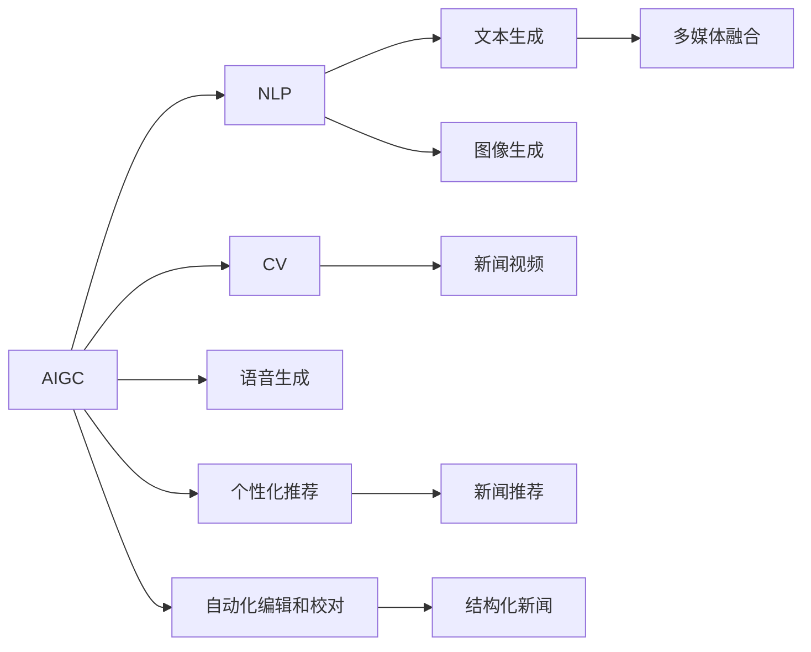

                 

# AIGC重塑新闻传播业

近年来，人工智能生成内容(AI Generated Content, AIGC)技术的飞速发展，正在迅速重塑新闻传播业的格局。通过融合先进的自然语言处理(NLP)、计算机视觉(CV)和语音生成等技术，AIGC为新闻生产带来了全新的工具和理念，显著提升了内容的丰富性、时效性和可读性。本文将详细探讨AIGC技术在新闻传播业中的应用潜力及其带来的变革，为从业者和研究者提供全面的视角和实用的技术指南。

## 1. 背景介绍

### 1.1 问题由来
新闻传播业经历了从传统纸媒、广播、电视到互联网时代的深刻变革。然而，随着信息过载和社交媒体的兴起，传统新闻机构的竞争压力不断增大，内容制作成本和人员负担也在加重。在这一背景下，人工智能生成内容技术（AIGC）应运而生，借助其在NLP、CV和语音处理等领域的突破，极大地提升了新闻生产的速度和质量，为新闻传播业注入了新的活力。

### 1.2 问题核心关键点
AIGC技术在新闻传播业的应用，主要体现在以下几个关键点：
- 实时生成新闻报道：利用NLP技术自动撰写新闻稿件，适应新闻事件的即时性需求。
- 个性化新闻推荐：通过用户行为和兴趣建模，提供精准的个性化新闻推荐，提高用户阅读体验。
- 多媒体融合：结合CV和语音生成技术，生成新闻视频和音频，丰富新闻表现形式。
- 自动化编辑和校对：运用OCR和自然语言理解技术，实现新闻的自动化编辑和校对。

## 2. 核心概念与联系

### 2.1 核心概念概述

为更好地理解AIGC在新闻传播业中的应用，本节将介绍几个密切相关的核心概念：

- **AIGC**：人工智能生成内容，指的是利用AI技术自动生成文本、图像、音频等各类内容的自动化工具。AIGC涵盖了NLP、CV、图像生成等技术，是当前人工智能技术发展的热点。

- **NLP**：自然语言处理，指的是利用AI技术理解、生成和处理人类语言的技术。NLP是AIGC中最为核心的技术之一，主要用于文本生成和语言理解。

- **CV**：计算机视觉，指的是利用AI技术理解和生成图像和视频的技术。CV在AIGC中的应用主要体现在新闻视频和图像生成方面。

- **多媒体融合**：结合NLP、CV和语音生成技术，生成融合文本、图像、音频等多种媒体形式的新闻内容。

- **个性化推荐**：利用机器学习技术，根据用户的历史行为和兴趣，为其推荐定制化新闻内容。

- **自动化编辑和校对**：运用OCR和自然语言理解技术，自动将非结构化文本转化为结构化新闻，并进行校对和格式化。

这些核心概念之间的逻辑关系可以通过以下Mermaid流程图来展示：



这个流程图展示了大语言模型的核心概念及其之间的关系：

1. AIGC作为综合体，将文本、图像、语音等多种信息进行融合。
2. NLP技术通过文本生成实现新闻自动撰写。
3. CV技术通过图像生成实现新闻视频生成。
4. 语音生成技术为新闻音频制作提供支持。
5. 多媒体融合技术实现多种媒体形式的集成。
6. 个性化推荐技术根据用户兴趣生成定制化新闻。
7. 自动化编辑和校对技术实现新闻内容的结构化和格式化。

这些概念共同构成了AIGC技术在新闻传播业中的应用框架，使其能够在新闻制作、分发和用户互动等各个环节发挥重要作用。

## 3. 核心算法原理 & 具体操作步骤

### 3.1 算法原理概述

AIGC技术在新闻传播业的应用，本质上是将AI生成的内容与传统新闻采编流程进行深度融合，以提升内容生产和传播的效率和效果。具体来说，这一过程可以分解为以下几个关键步骤：

1. **数据获取**：通过网络爬虫等技术，自动获取新闻事件的相关数据，如文本、图片、视频等。
2. **内容生成**：利用NLP、CV等技术，自动生成新闻文本、图像和视频内容。
3. **内容审核**：通过OCR和自然语言理解技术，对生成内容进行格式化和校对。
4. **内容发布**：将格式化后的内容发布到各类新闻平台，包括网站、社交媒体等。
5. **用户互动**：利用个性化推荐技术，为不同用户推荐其感兴趣的新闻内容。

### 3.2 算法步骤详解

以下是AIGC技术在新闻传播业中应用的具体操作步骤：

#### 3.2.1 数据获取
数据获取是新闻内容自动生成的基础。利用网络爬虫技术，可以从各大新闻网站、社交媒体等渠道自动抓取新闻事件相关的文本、图片和视频数据。例如，可以使用Python的Scrapy框架构建爬虫程序，实现对目标网站的自动化数据抓取。

#### 3.2.2 内容生成
内容生成是AIGC技术的核心。通过NLP技术，可以自动撰写新闻稿件，生成新闻文本。目前，较为流行的文本生成模型包括GPT系列、BERT等。以GPT-3为例，可以通过调用其API接口，将获取的新闻事件数据输入模型，自动生成新闻文本。

```python
from openai import OpenAI, OpenAIError
openai = OpenAI(api_key='YOUR_API_KEY')
response = openai.Completion.create(
  engine="text-davinci-003",
  prompt="生成一篇关于XXXX事件的报道",
  max_tokens=150,
  temperature=0.5,
  n=1,
  stop=None,
  temperature=0.7,
  top_p=1.0,
  frequency_penalty=0.0,
  presence_penalty=0.0,
  max_length=1000,
  min_length=1
)
text = response['choices'][0]['text']
```

#### 3.2.3 内容审核
内容审核是确保新闻内容质量的重要环节。利用OCR技术和自然语言理解技术，可以将非结构化文本转化为结构化新闻，并进行格式化和校对。以OCR技术为例，可以使用Google Cloud Vision API对图片中的文本进行识别，提取新闻标题和正文。

#### 3.2.4 内容发布
内容发布是将生成的新闻内容分发到各类新闻平台。利用API接口，可以将格式化后的新闻文本、图片和视频自动推送到网站、社交媒体等渠道。例如，可以使用Python的Requests库，将生成的文本和图片发布到新闻网站。

#### 3.2.5 用户互动
用户互动是提高新闻阅读体验的重要手段。利用个性化推荐技术，可以根据用户的历史行为和兴趣，为其推荐定制化新闻内容。例如，可以使用TensorFlow或PyTorch等深度学习框架，训练用户兴趣模型，根据用户的阅读记录和点击行为，推荐相关新闻。

### 3.3 算法优缺点

AIGC技术在新闻传播业的应用，具有以下优点：
1. 提高新闻生产效率：利用自动化的内容生成技术，显著降低了新闻采编的时间和成本。
2. 丰富新闻表现形式：结合多媒体融合技术，可以生成文本、图像、视频等多媒体形式的新闻，提升用户阅读体验。
3. 提高新闻时效性：实时抓取新闻事件数据，自动生成和发布新闻，适应新闻事件的即时性需求。
4. 提升个性化推荐效果：利用用户兴趣建模，提供定制化新闻推荐，提高用户黏性和互动性。

但同时，AIGC技术也存在一些局限性：
1. 内容真实性问题：自动生成的新闻内容可能存在不实或偏见，需要人工审核确保其真实性和客观性。
2. 数据隐私和安全问题：自动抓取新闻数据可能涉及用户隐私保护和数据安全，需要加强技术保护和法律监管。
3. 技术门槛较高：涉及NLP、CV等多项技术，对开发者的技术水平要求较高。

### 3.4 算法应用领域

AIGC技术在新闻传播业的应用，已经覆盖了从新闻撰写、编辑、审核到发布和推荐的各个环节。以下是几个典型的应用场景：

1. **新闻自动化撰写**：利用NLP技术自动撰写新闻稿件，减少人工编辑工作量。例如，使用GPT-3生成关于新冠疫情的报道，再由人工编辑进行校对和格式化。

2. **新闻视频生成**：结合CV和语音生成技术，生成新闻视频和音频，丰富新闻表现形式。例如，利用GAN生成新闻现场视频，结合自动字幕和语音生成技术，生成新闻播报视频。

3. **新闻图片生成**：利用CV技术生成新闻图片，增强新闻的视觉吸引力。例如，使用StyleGAN生成新闻事件相关的背景图片，增强新闻的视觉冲击力。

4. **新闻个性化推荐**：利用用户行为数据和兴趣建模技术，为不同用户推荐其感兴趣的新闻内容。例如，利用协同过滤和深度学习模型，为不同用户推荐个性化的新闻内容。

5. **新闻自动化编辑和校对**：利用OCR和自然语言理解技术，实现新闻的自动化编辑和校对。例如，利用OCR技术自动识别新闻图片中的文本，再通过自然语言理解技术进行格式化和校对。

6. **新闻多媒体融合**：结合NLP、CV和语音生成技术，生成融合文本、图像、音频等多种媒体形式的新闻内容。例如，利用视频编辑软件将自动生成的新闻文本和图像进行剪辑，加入语音生成技术生成的播报音频，形成完整的新闻视频。

这些应用场景展示了AIGC技术在新闻传播业的广泛应用，为新闻生产、分发和用户互动带来了新的突破。

## 4. 数学模型和公式 & 详细讲解 & 举例说明

### 4.1 数学模型构建

AIGC技术在新闻传播业中的应用，主要涉及以下几个数学模型：

- **文本生成模型**：如GPT、BERT等，用于自动生成新闻文本。
- **图像生成模型**：如GAN、VAE等，用于生成新闻图片和视频。
- **用户兴趣建模模型**：如协同过滤、深度学习等，用于个性化推荐。
- **OCR识别模型**：如CNN、RNN等，用于将图片中的文本进行识别。

以文本生成模型为例，其核心目标是通过输入的上下文文本，预测下一个可能的单词。设输入文本为 $x$，输出单词为 $y$，模型通过前向传播计算输出概率 $p(y|x)$，然后通过交叉熵损失函数 $\mathcal{L}$ 进行优化，最小化预测值与真实值之间的差异。

$$
\mathcal{L}(\theta) = -\sum_{i=1}^N \log p(y_i|x_i)
$$

其中，$N$ 表示训练样本数量，$\theta$ 为模型参数，$p(y_i|x_i)$ 为模型预测下一个单词的概率。

### 4.2 公式推导过程

以文本生成模型为例，推导其训练目标函数和优化过程：

设模型参数为 $\theta$，输入文本为 $x$，输出单词为 $y$，训练样本为 $(x_i, y_i)$。模型的前向传播过程为：

$$
p(y|x) = \frac{e^{\sum_i \log\frac{p(y_i|x_i)}}{Z}
$$

其中，$Z$ 为归一化因子，保证概率值和为1。优化目标为最小化交叉熵损失函数：

$$
\mathcal{L}(\theta) = -\sum_{i=1}^N \log p(y_i|x_i)
$$

根据链式法则，计算模型参数的梯度：

$$
\frac{\partial \mathcal{L}(\theta)}{\partial \theta} = \frac{\partial \sum_{i=1}^N \log p(y_i|x_i)}{\partial \theta}
$$

通过反向传播算法，更新模型参数，最小化交叉熵损失函数。重复以上过程直至收敛，最终得到最优参数 $\theta^*$。

### 4.3 案例分析与讲解

以新闻事件自动生成的例子，展示AIGC技术在实际应用中的效果：

假设要自动生成一篇关于“华为新发布的折叠屏手机”的新闻报道，具体步骤如下：

1. 使用网络爬虫技术，从各大新闻网站自动抓取相关文本和图片数据。
2. 将抓取到的文本数据输入GPT-3模型，自动生成新闻标题和正文。
3. 利用OCR技术，自动识别新闻图片中的文本信息，提取相关数据。
4. 将生成的新闻文本、图片和视频进行格式化和校对，发布到新闻网站。
5. 利用协同过滤和深度学习模型，根据用户历史行为和兴趣，推荐相关新闻。

## 5. 项目实践：代码实例和详细解释说明

### 5.1 开发环境搭建

在进行AIGC实践前，我们需要准备好开发环境。以下是使用Python进行AIGC开发的环境配置流程：

1. 安装Anaconda：从官网下载并安装Anaconda，用于创建独立的Python环境。

2. 创建并激活虚拟环境：
```bash
conda create -n aigc-env python=3.8 
conda activate aigc-env
```

3. 安装依赖库：
```bash
conda install torch transformers numpy scikit-learn pandas
```

4. 安装AIGC相关的库：
```bash
pip install openai google-cloud-vision
```

完成上述步骤后，即可在`aigc-env`环境中开始AIGC实践。

### 5.2 源代码详细实现

以下是利用AIGC技术进行新闻事件自动生成的Python代码实现：

```python
from openai import OpenAI, OpenAIError
from google.cloud import vision_v1p1beta1 as vision
import torch
from transformers import GPT2Tokenizer, GPT2Model
import requests

# 初始化OpenAI API Key
openai = OpenAI(api_key='YOUR_API_KEY')

# 初始化Google Cloud Vision API
client = vision.ImageAnnotatorClient()

# 获取新闻事件数据
response = requests.get('https://www.example.com/news/event/XYZ')
text = response.text

# 使用GPT-3生成新闻标题和正文
response = openai.Completion.create(
  engine="text-davinci-003",
  prompt="生成一篇关于XXXX事件的报道",
  max_tokens=150,
  temperature=0.5,
  n=1,
  stop=None,
  temperature=0.7,
  top_p=1.0,
  frequency_penalty=0.0,
  presence_penalty=0.0,
  max_length=1000,
  min_length=1
)
title = response['choices'][0]['text']

# 使用OCR技术识别新闻图片中的文本
with open('news_image.jpg', 'rb') as image_file:
    content = image_file.read()
image = vision.Image(content=content)
response = client.text_detection(image=image)
texts = response.text_annotations

# 输出新闻标题、正文和图片识别结果
print('新闻标题：', title)
print('新闻正文：', text)
print('新闻图片识别结果：', texts)
```

这段代码首先通过网络爬虫获取新闻事件的相关文本数据，然后使用GPT-3自动生成新闻标题和正文。接着，使用OCR技术识别新闻图片中的文本信息，最后输出完整的自动生成新闻。

### 5.3 代码解读与分析

让我们再详细解读一下关键代码的实现细节：

1. 网络爬虫：使用requests库，自动从目标网站获取新闻事件数据。
2. GPT-3文本生成：调用OpenAI API，输入新闻事件描述，自动生成新闻标题和正文。
3. OCR图片识别：使用Google Cloud Vision API，读取新闻图片，进行文本识别，提取相关信息。
4. 格式化和输出：将生成的新闻标题、正文和图片信息进行格式化和输出。

## 6. 实际应用场景

### 6.1 智能新闻聚合平台

智能新闻聚合平台可以利用AIGC技术，自动抓取并生成各类新闻，为用户提供个性化的新闻推荐。例如，利用GPT-3生成新闻标题和正文，结合用户兴趣模型和协同过滤算法，提供定制化的新闻推荐。

### 6.2 新闻自动化采编系统

新闻自动化采编系统可以利用AIGC技术，自动抓取并生成新闻事件的相关数据，自动撰写新闻稿件，并进行自动化编辑和校对。例如，使用OCR技术自动抓取图片中的文本信息，结合GPT-3生成新闻标题和正文，再通过自动化编辑工具进行格式化和校对。

### 6.3 实时新闻播报系统

实时新闻播报系统可以利用AIGC技术，自动生成新闻视频和音频，实现新闻的实时播报。例如，利用GAN生成新闻现场视频，结合语音生成技术生成播报音频，通过多媒体融合技术实现完整的实时新闻播报。

### 6.4 未来应用展望

随着AIGC技术的不断进步，其在新闻传播业的应用将进一步拓展，带来更多的创新和突破：

1. 多模态新闻生产：结合文本、图像、音频等多种信息，生成更丰富、更吸引人的新闻内容。
2. 新闻事实核查：利用自然语言理解技术，自动核查新闻内容的真实性，提升新闻质量。
3. 情感分析与舆情监测：结合情感分析技术，实时监测新闻舆情，提供舆情分析和预警。
4. 智能客服与问答系统：利用对话生成技术，自动回答用户的新闻咨询，提升用户体验。
5. 新闻创意生成：利用创意生成技术，自动生成新闻报道的创意和结构，提升新闻编辑的工作效率。

## 7. 工具和资源推荐

### 7.1 学习资源推荐

为了帮助开发者系统掌握AIGC的理论基础和实践技巧，这里推荐一些优质的学习资源：

1. 《Transformers从原理到实践》系列博文：由大模型技术专家撰写，深入浅出地介绍了Transformer原理、BERT模型、文本生成技术等前沿话题。

2. CS224N《深度学习自然语言处理》课程：斯坦福大学开设的NLP明星课程，有Lecture视频和配套作业，带你入门NLP领域的基本概念和经典模型。

3. 《Natural Language Processing with Transformers》书籍：Transformers库的作者所著，全面介绍了如何使用Transformers库进行NLP任务开发，包括文本生成在内的诸多范式。

4. Weights & Biases：模型训练的实验跟踪工具，可以记录和可视化模型训练过程中的各项指标，方便对比和调优。与主流深度学习框架无缝集成。

5. Google Cloud Vision API：Google提供的OCR和图像识别服务，支持多种语言和数据格式的文本识别。

通过对这些资源的学习实践，相信你一定能够快速掌握AIGC技术的精髓，并用于解决实际的NLP问题。

### 7.2 开发工具推荐

高效的开发离不开优秀的工具支持。以下是几款用于AIGC开发的常用工具：

1. Python：作为最流行的编程语言，Python在AIGC开发中具有广泛的应用，易于学习和使用。

2. PyTorch：基于Python的开源深度学习框架，灵活动态的计算图，适合快速迭代研究。

3. TensorFlow：由Google主导开发的开源深度学习框架，生产部署方便，适合大规模工程应用。

4. OpenAI：提供GPT系列模型的API接口，支持文本生成、对话生成等功能。

5. Google Cloud Vision API：Google提供的OCR和图像识别服务，支持多种语言和数据格式的文本识别。

6. Weights & Biases：模型训练的实验跟踪工具，可以记录和可视化模型训练过程中的各项指标，方便对比和调优。

7. Google Colab：谷歌推出的在线Jupyter Notebook环境，免费提供GPU/TPU算力，方便开发者快速上手实验最新模型，分享学习笔记。

合理利用这些工具，可以显著提升AIGC开发的效率，加快创新迭代的步伐。

### 7.3 相关论文推荐

AIGC技术的发展源于学界的持续研究。以下是几篇奠基性的相关论文，推荐阅读：

1. Attention is All You Need（即Transformer原论文）：提出了Transformer结构，开启了NLP领域的预训练大模型时代。

2. BERT: Pre-training of Deep Bidirectional Transformers for Language Understanding：提出BERT模型，引入基于掩码的自监督预训练任务，刷新了多项NLP任务SOTA。

3. T5: Exploring the Limits of Transfer Learning with a Unified Text-to-Text Transformer：提出T5模型，实现了多种NLP任务的统一预训练和微调，提升了模型的泛化能力。

4. XLNet: Generalized Autoregressive Pretraining for Language Understanding：提出XLNet模型，通过自回归和自编码的混合训练，提升了语言模型的泛化性能。

5. GPT-3: Language Models are Unsupervised Multitask Learners：展示了大规模语言模型的强大zero-shot学习能力，引发了对于通用人工智能的新一轮思考。

这些论文代表了大语言模型在NLP领域的最新进展，为AIGC技术的发展提供了理论支撑。

## 8. 总结：未来发展趋势与挑战

### 8.1 总结

本文对AIGC技术在新闻传播业中的应用进行了全面系统的介绍。首先阐述了AIGC技术的发展背景和应用潜力，明确了其在新闻生产、分发和用户互动等方面的独特价值。其次，从原理到实践，详细讲解了AIGC的数学模型和关键操作步骤，给出了AIGC任务开发的完整代码实例。同时，本文还广泛探讨了AIGC技术在智能新闻聚合、新闻自动化采编、实时新闻播报等多个行业领域的应用前景，展示了AIGC技术的广泛应用潜力。此外，本文精选了AIGC技术的各类学习资源，力求为读者提供全方位的技术指引。

通过本文的系统梳理，可以看到，AIGC技术正在成为新闻传播业的重要工具，极大地提升了内容生产的效率和质量，为新闻业带来了新的变革。未来，伴随AIGC技术的不断发展，新闻传播业必将迎来更多创新和突破，为媒体用户带来更丰富、更精准的新闻服务。

### 8.2 未来发展趋势

展望未来，AIGC技术在新闻传播业的应用将呈现以下几个发展趋势：

1. 多模态新闻生产：结合文本、图像、音频等多种信息，生成更丰富、更吸引人的新闻内容。
2. 新闻事实核查：利用自然语言理解技术，自动核查新闻内容的真实性，提升新闻质量。
3. 情感分析与舆情监测：结合情感分析技术，实时监测新闻舆情，提供舆情分析和预警。
4. 智能客服与问答系统：利用对话生成技术，自动回答用户的新闻咨询，提升用户体验。
5. 新闻创意生成：利用创意生成技术，自动生成新闻报道的创意和结构，提升新闻编辑的工作效率。

这些趋势展示了AIGC技术在新闻传播业的应用前景，为新闻业的发展提供了新的方向。

### 8.3 面临的挑战

尽管AIGC技术在新闻传播业中已经取得了一定的进展，但在迈向更加智能化、普适化应用的过程中，仍面临诸多挑战：

1. 内容真实性问题：自动生成的新闻内容可能存在不实或偏见，需要人工审核确保其真实性和客观性。
2. 数据隐私和安全问题：自动抓取新闻数据可能涉及用户隐私保护和数据安全，需要加强技术保护和法律监管。
3. 技术门槛较高：涉及NLP、CV等多项技术，对开发者的技术水平要求较高。
4. 用户接受度问题：部分用户可能对自动生成的新闻内容持怀疑态度，需要加强用户教育和信任建立。

### 8.4 研究展望

面对AIGC技术面临的挑战，未来的研究需要在以下几个方面寻求新的突破：

1. 引入更多先验知识：将符号化的先验知识，如知识图谱、逻辑规则等，与神经网络模型进行巧妙融合，引导AIGC过程学习更准确、合理的语言模型。同时加强不同模态数据的整合，实现视觉、语音等多模态信息与文本信息的协同建模。

2. 结合因果分析和博弈论工具：将因果分析方法引入AIGC模型，识别出模型决策的关键特征，增强输出解释的因果性和逻辑性。借助博弈论工具刻画人机交互过程，主动探索并规避模型的脆弱点，提高系统稳定性。

3. 纳入伦理道德约束：在AIGC模型的训练目标中引入伦理导向的评估指标，过滤和惩罚有偏见、有害的输出倾向。同时加强人工干预和审核，建立模型行为的监管机制，确保输出符合人类价值观和伦理道德。

这些研究方向的探索，必将引领AIGC技术在新闻传播业中的应用走向更高的台阶，为新闻业带来更多创新和突破。面向未来，AIGC技术还需要与其他人工智能技术进行更深入的融合，如知识表示、因果推理、强化学习等，多路径协同发力，共同推动新闻业的技术进步。只有勇于创新、敢于突破，才能不断拓展AIGC技术的边界，让新闻传播业迈向更加智能化、普适化、高效化的新时代。

## 9. 附录：常见问题与解答

**Q1：AIGC技术是否会取代传统的新闻工作者？**

A: AIGC技术可以辅助新闻工作者进行内容生成和编辑，提高其工作效率和质量，但不会完全取代传统的新闻工作者。新闻工作者仍然需要在内容核查、深度报道、用户互动等方面发挥重要作用，AIGC技术只是提供了一种辅助工具。

**Q2：自动生成的新闻内容是否真实可信？**

A: 自动生成的新闻内容可能存在不实或偏见，需要人工审核确保其真实性和客观性。因此，在实际应用中，还需要结合人工审核和数据验证，保证新闻内容的质量和可信度。

**Q3：AIGC技术如何应对多语言新闻生产？**

A: 多语言新闻生产是AIGC技术的一个重要应用领域。可以利用跨语言翻译模型，将自动生成的文本内容翻译成多种语言。例如，使用HuggingFace的mBART等模型，实现文本的自动翻译和校对。

**Q4：AIGC技术在新闻生产中的应用是否会导致版权问题？**

A: 利用AIGC技术生成的新闻内容，可能涉及版权和知识产权问题。需要在技术使用中严格遵守相关法律法规，确保内容的合法性和合规性。

这些问题的解答，为AIGC技术在新闻传播业中的应用提供了重要的参考，帮助从业者和研究者更好地理解和应用这一前沿技术。

---

作者：禅与计算机程序设计艺术 / Zen and the Art of Computer Programming

