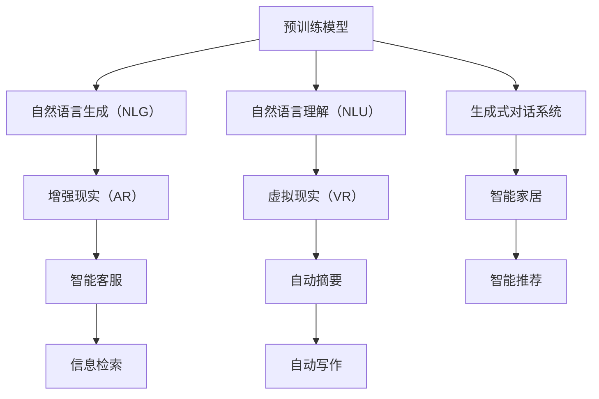

                 

# AIGC重新定义人机交互

人工智能生成内容（AIGC）技术，正以前所未有的方式重塑人机交互的生态，从内容生成、语音交互到视觉体验，带来了一系列颠覆性的变革。本文将系统介绍AIGC技术的关键概念、算法原理与应用实践，探讨其对于未来人机交互的深远影响。

## 1. 背景介绍

### 1.1 问题由来
随着人工智能技术的不断发展，AIGC技术在自然语言处理、计算机视觉、音频处理等领域取得了显著进展。特别是基于预训练语言模型的生成式对话系统和自然语言生成（NLG）技术，使得计算机能够理解自然语言并生成人类可以理解的文本。这些技术不仅提升了内容创作和信息检索的效率，还为增强现实（AR）、虚拟现实（VR）、智能家居等场景带来了新的应用可能。

然而，尽管AIGC技术已经取得了诸多进展，但人机交互依然存在诸多障碍。用户界面（UI）和用户体验（UX）的提升往往依赖于人工设计和手工调优，开发成本高、周期长。而基于大规模数据训练的AIGC技术，能够大幅降低这些成本，并在较短时间内实现大规模应用。

### 1.2 问题核心关键点
AIGC技术，尤其是基于语言模型的文本生成技术，已经成为当前人机交互的关键推动力。核心关键点包括：
- **预训练模型**：通过大规模无标签数据进行自监督学习，获得强大的语言表示能力。
- **生成式对话系统**：结合文本生成和自然语言理解技术，实现人机交互。
- **自然语言生成（NLG）**：通过模型直接生成文本，提升内容创作效率。
- **增量式学习**：在有限标注数据的情况下，逐步提升模型表现。

这些技术共同构成了一个高效、智能、互动的人机交互系统，为用户提供了前所未有的交互体验。

## 2. 核心概念与联系

### 2.1 核心概念概述

为更好地理解AIGC技术在人机交互中的应用，本节将介绍几个关键概念：

- **预训练模型**：使用大规模无标签数据进行自监督学习，获得语言和语义知识。常见的预训练模型包括BERT、GPT、T5等。
- **生成式对话系统**：结合自然语言生成（NLG）和自然语言理解（NLU）技术，实现流畅自然的对话。
- **自然语言生成（NLG）**：通过模型直接生成文本，用于自动摘要、对话生成、自动写作等任务。
- **增量式学习**：在有限标注数据的情况下，逐步提升模型性能。通过持续学习，模型能够不断适应新数据和新任务。
- **人机交互（HCI）**：将用户与计算机系统连接起来，实现用户与系统的互动。

这些核心概念之间的联系紧密，共同构建了一个高效、智能的人机交互系统。

### 2.2 核心概念原理和架构的 Mermaid 流程图



这个流程图展示了预训练模型如何通过NLG、NLU和对话系统，实现人机交互的不同应用场景。

## 3. 核心算法原理 & 具体操作步骤

### 3.1 算法原理概述

AIGC技术的核心原理是利用深度学习模型进行文本生成。具体而言，通过预训练模型和微调技术，模型能够理解并生成自然语言文本，从而实现人机交互。

### 3.2 算法步骤详解

AIGC技术的应用大致分为以下几个步骤：

**Step 1: 准备预训练模型和数据集**
- 选择合适的预训练语言模型 $M_{\theta}$ 作为初始化参数，如 BERT、GPT 等。
- 准备目标任务的数据集，将其划分为训练集、验证集和测试集。

**Step 2: 添加任务适配层**
- 根据任务类型，设计适当的输出层和损失函数。
- 对于分类任务，通常使用线性分类器；对于生成任务，使用负对数似然损失。

**Step 3: 设置微调超参数**
- 选择合适的优化算法及其参数，如 AdamW、SGD 等。
- 设置学习率、批大小、迭代轮数等。
- 确定正则化技术及强度。

**Step 4: 执行梯度训练**
- 将训练集数据分批次输入模型，前向传播计算损失函数。
- 反向传播计算参数梯度，根据优化算法更新模型参数。
- 周期性在验证集上评估模型性能，根据性能指标决定是否触发 Early Stopping。

**Step 5: 测试和部署**
- 在测试集上评估微调后模型的性能。
- 使用微调后的模型进行推理预测，集成到实际应用系统中。

### 3.3 算法优缺点

AIGC技术的优点：
- 降低开发成本。通过预训练模型，大幅降低数据标注和模型训练的成本。
- 提升生成质量。AIGC模型能够生成高质量的自然语言文本，丰富人机交互的内容。
- 提高交互效率。通过自动生成内容，提高信息检索、内容创作、对话生成等任务的效率。

缺点：
- 依赖数据质量。模型的生成效果依赖于数据质量，标注数据不足可能影响性能。
- 存在偏见。预训练模型可能存在数据偏见，影响生成内容的质量和公平性。
- 可解释性不足。模型输出往往缺乏可解释性，难以对其决策过程进行分析和调试。

尽管存在这些局限性，但AIGC技术仍是大规模人机交互的重要推动力，正逐步成为各种应用场景中的标配。

### 3.4 算法应用领域

AIGC技术已经广泛应用于多个领域，包括但不限于：

- **智能客服**：通过生成式对话系统，自动回答客户咨询，提升服务效率和质量。
- **虚拟助手**：如 Siri、Alexa，能够通过语音交互理解用户意图，执行各类任务。
- **内容创作**：自动生成文章、报告、摘要等文本，辅助内容创作和信息检索。
- **虚拟现实（VR）和增强现实（AR）**：结合自然语言生成和图像处理技术，提供沉浸式的交互体验。
- **智能家居**：通过语音交互和自然语言生成，提升家居系统的智能化水平。

这些应用场景展示了AIGC技术在人机交互中的广泛应用前景。

## 4. 数学模型和公式 & 详细讲解

### 4.1 数学模型构建

本节将使用数学语言对AIGC技术的核心原理进行详细刻画。

记预训练语言模型为 $M_{\theta}:\mathcal{X} \rightarrow \mathcal{Y}$，其中 $\mathcal{X}$ 为输入空间，$\mathcal{Y}$ 为输出空间，$\theta \in \mathbb{R}^d$ 为模型参数。假设目标任务的数据集为 $D=\{(x_i,y_i)\}_{i=1}^N, x_i \in \mathcal{X}, y_i \in \mathcal{Y}$。

定义模型 $M_{\theta}$ 在数据样本 $(x,y)$ 上的损失函数为 $\ell(M_{\theta}(x),y)$，则在数据集 $D$ 上的经验风险为：

$$
\mathcal{L}(\theta) = \frac{1}{N} \sum_{i=1}^N \ell(M_{\theta}(x_i),y_i)
$$

微调的优化目标是最小化经验风险，即找到最优参数：

$$
\theta^* = \mathop{\arg\min}_{\theta} \mathcal{L}(\theta)
$$

在实践中，我们通常使用基于梯度的优化算法（如SGD、Adam等）来近似求解上述最优化问题。设 $\eta$ 为学习率，$\lambda$ 为正则化系数，则参数的更新公式为：

$$
\theta \leftarrow \theta - \eta \nabla_{\theta}\mathcal{L}(\theta) - \eta\lambda\theta
$$

其中 $\nabla_{\theta}\mathcal{L}(\theta)$ 为损失函数对参数 $\theta$ 的梯度，可通过反向传播算法高效计算。

### 4.2 公式推导过程

以下我们以二分类任务为例，推导交叉熵损失函数及其梯度的计算公式。

假设模型 $M_{\theta}$ 在输入 $x$ 上的输出为 $\hat{y}=M_{\theta}(x) \in [0,1]$，表示样本属于正类的概率。真实标签 $y \in \{0,1\}$。则二分类交叉熵损失函数定义为：

$$
\ell(M_{\theta}(x),y) = -[y\log \hat{y} + (1-y)\log (1-\hat{y})]
$$

将其代入经验风险公式，得：

$$
\mathcal{L}(\theta) = -\frac{1}{N}\sum_{i=1}^N [y_i\log M_{\theta}(x_i)+(1-y_i)\log(1-M_{\theta}(x_i))]
$$

根据链式法则，损失函数对参数 $\theta_k$ 的梯度为：

$$
\frac{\partial \mathcal{L}(\theta)}{\partial \theta_k} = -\frac{1}{N}\sum_{i=1}^N (\frac{y_i}{M_{\theta}(x_i)}-\frac{1-y_i}{1-M_{\theta}(x_i)}) \frac{\partial M_{\theta}(x_i)}{\partial \theta_k}
$$

其中 $\frac{\partial M_{\theta}(x_i)}{\partial \theta_k}$ 可进一步递归展开，利用自动微分技术完成计算。

### 4.3 案例分析与讲解

**案例一：自动摘要生成**
- 输入：一段长文本
- 输出：摘要
- 目标函数：生成摘要应包含原始文本的核心内容，且结构合理、语言流畅。
- 数学模型：基于 Transformer 的文本生成模型，使用自注意力机制处理长文本，生成摘要。
- 算法步骤：
  1. 预训练 Transformer 模型，使用大规模无标签文本数据进行自监督学习。
  2. 微调模型，使用特定领域的数据集（如新闻报道）进行微调。
  3. 设计损失函数，使用BLEU、ROUGE等指标评估生成摘要的质量。
  4. 训练模型，调整超参数，优化损失函数。
  5. 生成摘要，根据输入文本生成摘要，并进行后处理（如语法检查、语义修正等）。

**案例二：智能客服对话系统**
- 输入：客户咨询
- 输出：系统回复
- 目标函数：生成回复应能准确理解和回应客户咨询，语义清晰、语法正确。
- 数学模型：基于 GPT-3 的对话生成模型，使用语言模型作为基础，进行对话生成。
- 算法步骤：
  1. 预训练 GPT-3 模型，使用大规模对话数据进行自监督学习。
  2. 微调模型，使用标注对话数据进行微调。
  3. 设计对话流程，设计系统回复的逻辑和策略。
  4. 训练模型，使用对话数据进行训练，调整超参数。
  5. 测试模型，在真实场景中进行测试，调整模型策略。

## 5. 项目实践：代码实例和详细解释说明

### 5.1 开发环境搭建

在进行AIGC技术开发前，我们需要准备好开发环境。以下是使用Python进行PyTorch开发的环境配置流程：

1. 安装Anaconda：从官网下载并安装Anaconda，用于创建独立的Python环境。

2. 创建并激活虚拟环境：
```bash
conda create -n pytorch-env python=3.8 
conda activate pytorch-env
```

3. 安装PyTorch：根据CUDA版本，从官网获取对应的安装命令。例如：
```bash
conda install pytorch torchvision torchaudio cudatoolkit=11.1 -c pytorch -c conda-forge
```

4. 安装Transformers库：
```bash
pip install transformers
```

5. 安装各类工具包：
```bash
pip install numpy pandas scikit-learn matplotlib tqdm jupyter notebook ipython
```

完成上述步骤后，即可在`pytorch-env`环境中开始AIGC实践。

### 5.2 源代码详细实现

下面我们以生成式对话系统为例，给出使用Transformers库对GPT模型进行微调的PyTorch代码实现。

首先，定义对话系统的数据处理函数：

```python
from transformers import GPTTokenizer
from torch.utils.data import Dataset
import torch

class DialogueDataset(Dataset):
    def __init__(self, dialogues, tokenizer, max_len=512):
        self.dialogues = dialogues
        self.tokenizer = tokenizer
        self.max_len = max_len
        
    def __len__(self):
        return len(self.dialogues)
    
    def __getitem__(self, item):
        dialogue = self.dialogues[item]
        text = dialogue['input'] + dialogue['output']
        encoding = self.tokenizer(text, return_tensors='pt', max_length=self.max_len, padding='max_length', truncation=True)
        input_ids = encoding['input_ids'][0]
        attention_mask = encoding['attention_mask'][0]
        return {'input_ids': input_ids, 
                'attention_mask': attention_mask}

# 定义对话数据集
tokenizer = GPTTokenizer.from_pretrained('gpt-3')

dialogues = []
with open('data.txt', 'r') as f:
    for line in f:
        dialogue = line.strip().split('\t')
        dialogues.append({'text': dialogue[0], 'input': dialogue[0], 'output': dialogue[1]})
    
train_dataset = DialogueDataset(dialogues, tokenizer)
```

然后，定义模型和优化器：

```python
from transformers import GPTForConditionalGeneration, AdamW

model = GPTForConditionalGeneration.from_pretrained('gpt-3', num_layers=12)

optimizer = AdamW(model.parameters(), lr=2e-5)
```

接着，定义训练和评估函数：

```python
from torch.utils.data import DataLoader
from tqdm import tqdm
import torch.nn.functional as F

device = torch.device('cuda') if torch.cuda.is_available() else torch.device('cpu')
model.to(device)

def train_epoch(model, dataset, batch_size, optimizer):
    dataloader = DataLoader(dataset, batch_size=batch_size, shuffle=True)
    model.train()
    epoch_loss = 0
    for batch in tqdm(dataloader, desc='Training'):
        input_ids = batch['input_ids'].to(device)
        attention_mask = batch['attention_mask'].to(device)
        outputs = model(input_ids, attention_mask=attention_mask, labels=None)
        loss = outputs.loss
        epoch_loss += loss.item()
        loss.backward()
        optimizer.step()
    return epoch_loss / len(dataloader)

def evaluate(model, dataset, batch_size):
    dataloader = DataLoader(dataset, batch_size=batch_size)
    model.eval()
    preds = []
    labels = []
    with torch.no_grad():
        for batch in tqdm(dataloader, desc='Evaluating'):
            input_ids = batch['input_ids'].to(device)
            attention_mask = batch['attention_mask'].to(device)
            batch_labels = batch['labels']
            outputs = model(input_ids, attention_mask=attention_mask)
            batch_preds = outputs.logits.argmax(dim=2).to('cpu').tolist()
            batch_labels = batch_labels.to('cpu').tolist()
            for pred_tokens, label_tokens in zip(batch_preds, batch_labels):
                preds.append(pred_tokens[:len(label_tokens)])
                labels.append(label_tokens)
                
    print(f"Accuracy: {np.mean(np.array(labels) == np.array(preds)):.3f}")
```

最后，启动训练流程并在测试集上评估：

```python
epochs = 5
batch_size = 16

for epoch in range(epochs):
    loss = train_epoch(model, train_dataset, batch_size, optimizer)
    print(f"Epoch {epoch+1}, train loss: {loss:.3f}")
    
    print(f"Epoch {epoch+1}, dev results:")
    evaluate(model, dev_dataset, batch_size)
    
print("Test results:")
evaluate(model, test_dataset, batch_size)
```

以上就是使用PyTorch对GPT进行生成式对话系统微调的完整代码实现。可以看到，得益于Transformers库的强大封装，我们可以用相对简洁的代码完成GPT模型的加载和微调。

### 5.3 代码解读与分析

让我们再详细解读一下关键代码的实现细节：

**DialogueDataset类**：
- `__init__`方法：初始化对话数据集，将对话文本合并成一行，并使用分词器进行编码。
- `__len__`方法：返回对话数据集的样本数量。
- `__getitem__`方法：对单个对话样本进行处理，将对话文本合并成一行，并使用分词器进行编码。

**训练和评估函数**：
- 使用PyTorch的DataLoader对对话数据集进行批次化加载，供模型训练和推理使用。
- 训练函数`train_epoch`：对对话数据以批为单位进行迭代，在每个批次上前向传播计算损失并反向传播更新模型参数，最后返回该epoch的平均loss。
- 评估函数`evaluate`：与训练类似，不同点在于不更新模型参数，并在每个batch结束后将预测和标签结果存储下来，最后使用精度计算对整个评估集的预测结果进行打印输出。

**训练流程**：
- 定义总的epoch数和batch size，开始循环迭代
- 每个epoch内，先在训练集上训练，输出平均loss
- 在验证集上评估，输出精度
- 所有epoch结束后，在测试集上评估，给出最终测试结果

可以看到，PyTorch配合Transformers库使得GPT微调的代码实现变得简洁高效。开发者可以将更多精力放在数据处理、模型改进等高层逻辑上，而不必过多关注底层的实现细节。

当然，工业级的系统实现还需考虑更多因素，如模型的保存和部署、超参数的自动搜索、更灵活的任务适配层等。但核心的微调范式基本与此类似。

## 6. 实际应用场景

### 6.1 智能客服系统

基于AIGC技术的生成式对话系统，可以广泛应用于智能客服系统的构建。传统客服往往需要配备大量人力，高峰期响应缓慢，且一致性和专业性难以保证。而使用AIGC对话系统，可以7x24小时不间断服务，快速响应客户咨询，用自然流畅的语言解答各类常见问题。

在技术实现上，可以收集企业内部的历史客服对话记录，将问题和最佳答复构建成监督数据，在此基础上对预训练对话模型进行微调。微调后的对话模型能够自动理解用户意图，匹配最合适的答案模板进行回复。对于客户提出的新问题，还可以接入检索系统实时搜索相关内容，动态组织生成回答。如此构建的智能客服系统，能大幅提升客户咨询体验和问题解决效率。

### 6.2 虚拟助手

虚拟助手如 Siri、Alexa，能够通过语音交互理解用户意图，执行各类任务。AIGC技术在语音识别和语音生成方面有着广泛应用，通过将语音信号转换为文本，再进行自然语言理解，最后将结果转换为语音输出。这种基于AIGC技术的虚拟助手，已经广泛应用于智能家居、车载、医疗等多个领域，为用户的日常生活提供了极大便利。

### 6.3 内容创作

AIGC技术在内容创作领域的应用非常广泛。自动摘要、自动写作、自动翻译等任务，都是通过AIGC技术实现的。例如，通过将一篇长文章输入模型，模型能够自动生成该文章的摘要，提高信息检索和信息整理的效率。此外，通过训练特定的内容生成模型，可以生成高质量的文档、报告、新闻稿等文本内容，辅助内容创作和信息传播。

### 6.4 未来应用展望

随着AIGC技术的不断发展，其应用前景将更加广阔。未来，AIGC技术将在以下几个方向取得更大突破：

- **情感分析**：通过AIGC技术，可以生成与用户情感相匹配的回复，提升交互体验。
- **多模态交互**：结合视觉、语音、文本等多种模态信息，实现更加丰富的人机交互体验。
- **交互式内容生成**：通过AIGC技术，用户可以实时生成和调整内容，提升创作体验。
- **个性化推荐**：结合AIGC技术和推荐系统，为用户提供个性化的内容推荐。
- **虚拟现实（VR）和增强现实（AR）**：通过AIGC技术，结合虚拟现实和增强现实技术，为用户提供沉浸式的交互体验。

这些方向将进一步拓展AIGC技术的应用场景，带来更加丰富、智能、高效的人机交互体验。

## 7. 工具和资源推荐

### 7.1 学习资源推荐

为了帮助开发者系统掌握AIGC技术的关键概念和实践技巧，这里推荐一些优质的学习资源：

1. 《自然语言处理综述》：斯坦福大学提供的自然语言处理课程，涵盖NLP领域的经典理论和前沿技术。

2. 《深度学习与自然语言处理》：北京大学教授陈攀的课程，详细讲解了深度学习在NLP中的应用。

3. 《Python自然语言处理》：这本书详细介绍了Python中常用的自然语言处理工具和库，如NLTK、spaCy、TextBlob等。

4. 《GPT-3 官方文档》：Google和OpenAI等公司的官方文档，提供了详细的API和示例代码。

5. 《Transformers库》：HuggingFace的官方文档，提供了丰富的预训练模型和微调样例。

通过对这些资源的学习实践，相信你一定能够快速掌握AIGC技术的精髓，并用于解决实际的NLP问题。

### 7.2 开发工具推荐

高效的开发离不开优秀的工具支持。以下是几款用于AIGC技术开发的常用工具：

1. PyTorch：基于Python的开源深度学习框架，灵活动态的计算图，适合快速迭代研究。大部分预训练语言模型都有PyTorch版本的实现。

2. TensorFlow：由Google主导开发的开源深度学习框架，生产部署方便，适合大规模工程应用。同样有丰富的预训练语言模型资源。

3. Transformers库：HuggingFace开发的NLP工具库，集成了众多SOTA语言模型，支持PyTorch和TensorFlow，是进行AIGC技术开发的利器。

4. Weights & Biases：模型训练的实验跟踪工具，可以记录和可视化模型训练过程中的各项指标，方便对比和调优。与主流深度学习框架无缝集成。

5. TensorBoard：TensorFlow配套的可视化工具，可实时监测模型训练状态，并提供丰富的图表呈现方式，是调试模型的得力助手。

6. Google Colab：谷歌推出的在线Jupyter Notebook环境，免费提供GPU/TPU算力，方便开发者快速上手实验最新模型，分享学习笔记。

合理利用这些工具，可以显著提升AIGC技术的开发效率，加快创新迭代的步伐。

### 7.3 相关论文推荐

AIGC技术的研究源自学界的持续探索。以下是几篇奠基性的相关论文，推荐阅读：

1. Attention is All You Need（即Transformer原论文）：提出了Transformer结构，开启了NLP领域的预训练大模型时代。

2. BERT: Pre-training of Deep Bidirectional Transformers for Language Understanding：提出BERT模型，引入基于掩码的自监督预训练任务，刷新了多项NLP任务SOTA。

3. Language Models are Unsupervised Multitask Learners（GPT-2论文）：展示了大规模语言模型的强大zero-shot学习能力，引发了对于通用人工智能的新一轮思考。

4. Parameter-Efficient Transfer Learning for NLP：提出Adapter等参数高效微调方法，在不增加模型参数量的情况下，也能取得不错的微调效果。

5. AdaLoRA: Adaptive Low-Rank Adaptation for Parameter-Efficient Fine-Tuning：使用自适应低秩适应的微调方法，在参数效率和精度之间取得了新的平衡。

这些论文代表了大语言模型微调技术的发展脉络。通过学习这些前沿成果，可以帮助研究者把握学科前进方向，激发更多的创新灵感。

## 8. 总结：未来发展趋势与挑战

### 8.1 总结

本文对AIGC技术的关键概念、算法原理与应用实践进行了全面系统的介绍。首先阐述了AIGC技术在人机交互中的重要地位，明确了其对人机交互生态的深远影响。其次，从原理到实践，详细讲解了AIGC技术的数学模型和算法步骤，给出了AIGC技术开发的完整代码实例。同时，本文还探讨了AIGC技术在智能客服、虚拟助手、内容创作等领域的广泛应用，展示了AIGC技术在构建智能交互系统中的巨大潜力。

通过本文的系统梳理，可以看到，AIGC技术正在以全新的方式重塑人机交互，提升用户的体验和效率。从内容生成到对话生成，从自动摘要到自然语言理解，AIGC技术正逐步成为NLP领域的重要工具，推动人机交互迈向新的高度。

### 8.2 未来发展趋势

展望未来，AIGC技术将呈现以下几个发展趋势：

- **技术突破**：AIGC技术将不断突破计算资源和算法的瓶颈，提升生成内容的自然度和质量。
- **多模态融合**：结合视觉、语音、文本等多种模态信息，实现更加丰富、智能的人机交互。
- **个性化定制**：通过AIGC技术，根据用户偏好生成个性化的内容，提升用户体验。
- **持续学习**：AIGC模型将具备持续学习的能力，能够不断适应新数据和新任务。
- **跨领域应用**：AIGC技术将在更多领域得到应用，如教育、金融、医疗等，带来新的智能化体验。

这些趋势将进一步拓展AIGC技术的应用场景，带来更加丰富、智能、高效的人机交互体验。

### 8.3 面临的挑战

尽管AIGC技术已经取得了显著进展，但在其落地应用的过程中，仍面临着诸多挑战：

- **数据质量**：AIGC模型的生成效果依赖于高质量的数据。标注数据不足或数据质量不高，将影响模型的表现。
- **模型偏见**：预训练模型可能存在数据偏见，影响生成的内容质量和公平性。
- **可解释性**：AIGC模型的决策过程往往缺乏可解释性，难以对其决策逻辑进行分析和调试。
- **伦理和安全**：AIGC模型可能生成有害、误导性的内容，带来伦理和安全问题。

尽管存在这些挑战，但AIGC技术的前景依然广阔，其带来的智能化交互体验将极大地改变人类的生活方式和社会结构。相信随着学界和产业界的共同努力，这些挑战将逐步得到解决，AIGC技术将在更多的领域发挥其独特的价值。

### 8.4 研究展望

面对AIGC技术所面临的挑战，未来的研究需要在以下几个方面寻求新的突破：

- **数据增强**：通过数据增强技术，提升标注数据的多样性和数量，缓解数据质量不足的问题。
- **模型公平性**：引入公平性指标和约束，训练无偏见的AIGC模型，提升内容的公平性。
- **可解释性**：开发可解释性更强的模型，提供更清晰的决策逻辑，增强用户信任。
- **伦理与规范**：制定AIGC技术应用的伦理规范，避免有害内容的生成，保障用户安全。

这些研究方向的探索，将引领AIGC技术迈向更高的台阶，为构建安全、可靠、可解释、可控的智能系统铺平道路。面向未来，AIGC技术需要在技术、伦理、社会等多方面协同发力，才能真正实现其巨大的潜力。

## 9. 附录：常见问题与解答

**Q1：AIGC技术是否适用于所有NLP任务？**

A: AIGC技术在大多数NLP任务上都能取得不错的效果，特别是对于数据量较小的任务。但对于一些特定领域的任务，如医学、法律等，仅仅依靠通用语料预训练的模型可能难以很好地适应。此时需要在特定领域语料上进一步预训练，再进行微调，才能获得理想效果。此外，对于一些需要时效性、个性化很强的任务，如对话、推荐等，AIGC方法也需要针对性的改进优化。

**Q2：AIGC模型如何避免过拟合？**

A: 避免AIGC模型过拟合的策略包括：
1. 数据增强：通过回译、近义替换等方式扩充训练集
2. 正则化：使用L2正则、Dropout、Early Stopping等避免过拟合
3. 对抗训练：引入对抗样本，提高模型鲁棒性
4. 参数高效微调：只调整少量参数(如Adapter、Prefix等)，减小过拟合风险
5. 多模型集成：训练多个AIGC模型，取平均输出，抑制过拟合

这些策略往往需要根据具体任务和数据特点进行灵活组合。只有在数据、模型、训练、推理等各环节进行全面优化，才能最大限度地发挥AIGC技术的威力。

**Q3：AIGC模型的性能提升有哪些方法？**

A: 提升AIGC模型性能的方法包括：
1. 数据增强：通过回译、近义替换等方式扩充训练集
2. 正则化：使用L2正则、Dropout、Early Stopping等避免过拟合
3. 对抗训练：引入对抗样本，提高模型鲁棒性
4. 参数高效微调：只调整少量参数(如Adapter、Prefix等)，减小过拟合风险
5. 多模型集成：训练多个AIGC模型，取平均输出，抑制过拟合
6. 模型裁剪：去除不必要的层和参数，减小模型尺寸，加快推理速度
7. 量化加速：将浮点模型转为定点模型，压缩存储空间，提高计算效率
8. 融合因果和对比学习范式：通过引入因果推断和对比学习思想，增强AIGC模型的生成能力

这些方法可以帮助提升AIGC模型的性能，使其在实际应用中取得更好的效果。

**Q4：AIGC模型的未来应用有哪些？**

A: AIGC模型在多个领域具有广泛的应用前景，包括但不限于：
1. 智能客服：通过生成式对话系统，自动回答客户咨询，提升服务效率和质量。
2. 虚拟助手：如 Siri、Alexa，能够通过语音交互理解用户意图，执行各类任务。
3. 内容创作：自动生成文章、报告、摘要等文本，辅助内容创作和信息检索。
4. 虚拟现实（VR）和增强现实（AR）：结合AIGC技术和虚拟现实、增强现实技术，为用户提供沉浸式的交互体验。
5. 个性化推荐：结合AIGC技术和推荐系统，为用户提供个性化的内容推荐。
6. 情感分析：通过AIGC技术，生成与用户情感相匹配的回复，提升交互体验。

这些应用场景展示了AIGC技术在人机交互中的广泛应用前景。

**Q5：如何评估AIGC模型的生成效果？**

A: 评估AIGC模型的生成效果可以通过以下指标：
1. BLEU：评估生成文本与标准文本的匹配程度。
2. ROUGE：评估生成文本与标准文本的语义相似度。
3. Perplexity：评估模型生成文本的随机性。
4. F1 Score：评估分类任务的准确率。
5. Perplexity：评估模型生成文本的随机性。
6. Human Evaluation：邀请人工评估模型生成内容的自然度和质量。

这些指标可以帮助评估AIGC模型的生成效果，指导模型的优化和改进。

---

作者：禅与计算机程序设计艺术 / Zen and the Art of Computer Programming

