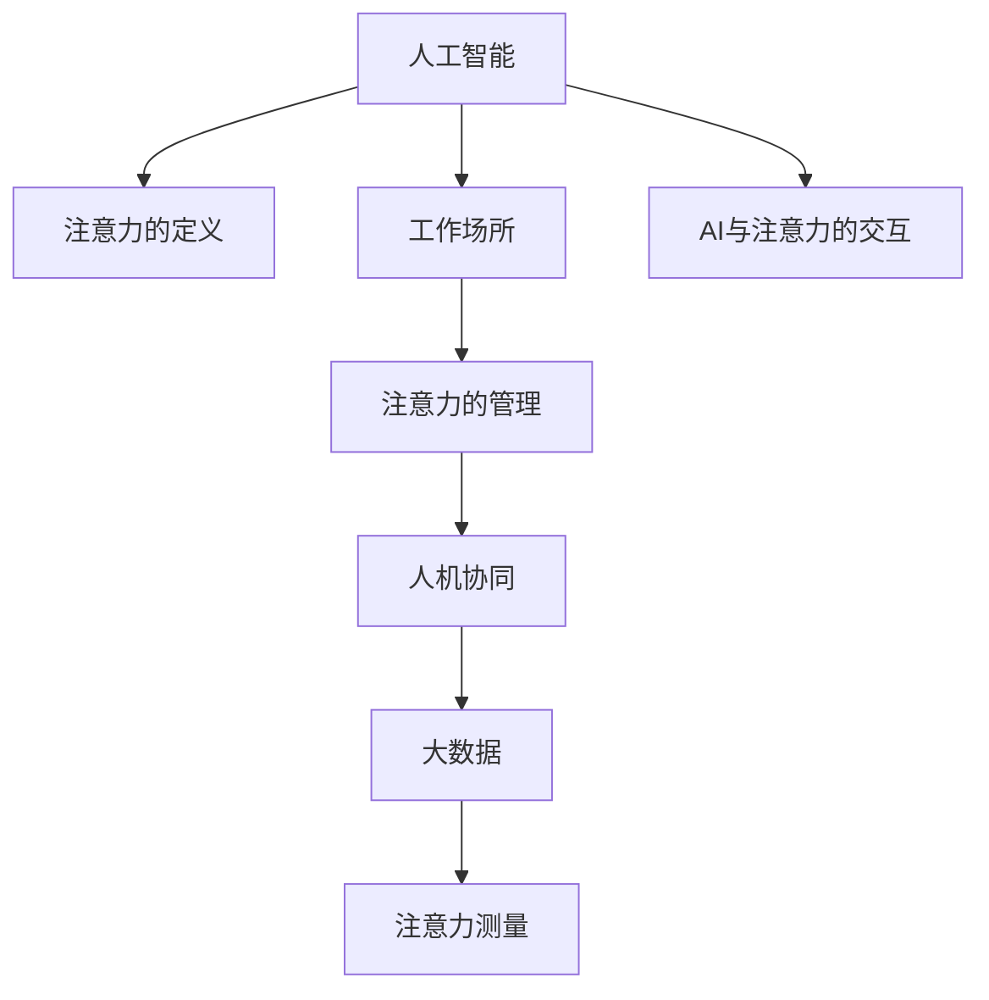

                 

# AI与人类注意力流 :未来的工作场所和注意力管理

> 关键词：人工智能,注意力管理,工作场所,人机协同,大数据,心理学

## 1. 背景介绍

### 1.1 问题由来

随着人工智能（AI）技术的迅速发展，越来越多的自动化工具和系统被应用到工作场所。无论是自动化的办公室工具、智能客户服务系统，还是自动驾驶和机器人，AI都在改变着我们的工作方式。然而，这些技术的发展也引发了一系列新的挑战，尤其是对人类注意力的管理。

人工智能系统需要大量的数据和计算资源，而这些资源需要人类投入大量的时间和注意力进行管理。特别是在智能工作环境中，员工不仅要完成自己的任务，还需要频繁地与AI系统交互，这无疑加重了他们的注意力负担。此外，随着AI系统的普及，传统的办公室工作环境也在发生改变，许多传统的办公室工作被自动化工具取代，员工需要适应全新的工作模式。

### 1.2 问题核心关键点

AI与人类注意力流的问题核心在于：如何在人工智能技术广泛应用的情况下，有效管理人类注意力，提升工作效率，同时避免过度依赖AI带来的注意疲劳和信息过载。

要回答这个问题，我们需要从以下几个方面进行深入探讨：

1. **注意力的定义与测量**：首先需要理解什么是注意力，以及如何测量人类在工作场所的注意力状态。
2. **AI与注意力的交互**：AI系统如何与人类交互，以及这些交互对人类注意力的影响。
3. **注意力管理策略**：在AI广泛应用的情况下，如何制定有效的注意力管理策略，提升工作场所的效率和健康。
4. **未来趋势与挑战**：探讨AI与人类注意力流的未来发展趋势，以及可能面临的挑战。

## 2. 核心概念与联系

### 2.1 核心概念概述

为更好地理解AI与人类注意力流的关系，本节将介绍几个关键概念：

- **注意力（Attention）**：指人类将精神资源集中于特定的刺激或任务上的心理过程。在心理学中，注意力被视为认知资源的一种，与记忆、决策等其他认知过程密切相关。
- **人工智能（AI）**：一种模拟人类智能的技术，通过算法、数据和计算资源实现各种智能功能，如自然语言处理、计算机视觉、机器学习等。
- **工作场所（Workplace）**：员工进行工作活动的所有物理和虚拟环境，包括办公室、工厂、实验室、虚拟会议平台等。
- **注意力的管理（Attention Management）**：通过技术手段和策略，帮助员工有效分配和管理注意力资源，提升工作效率和满意度。
- **人机协同（Human-AI Collaboration）**：人类与AI系统的协作关系，强调AI作为辅助工具而非替代，共同完成任务。
- **大数据（Big Data）**：庞大的数据集，通常用于机器学习、数据挖掘等，以发现数据中的模式和趋势。

这些核心概念之间的逻辑关系可以通过以下Mermaid流程图来展示：



这个流程图展示了大语言模型的核心概念及其之间的关系：

1. 人工智能通过大数据进行学习和决策，需要大量的人类注意力来管理。
2. 注意力的定义和测量是大数据分析的基础，用于衡量AI系统的智能水平。
3. 在人工智能广泛应用的工作场所，注意力的管理显得尤为重要。
4. AI系统与人类的交互，影响着人类注意力的分配。
5. 大数据和AI系统共同促进了人机协同的深入发展。

## 3. 核心算法原理 & 具体操作步骤
### 3.1 算法原理概述

AI与人类注意力流的核心算法原理主要围绕注意力测量、注意力管理、人机协同等几个方面展开。

### 3.2 算法步骤详解

#### 3.2.1 注意力测量

注意力测量是大数据和AI系统的基础。常见的注意力测量方法包括：

- **行为分析**：通过观察员工的行为数据（如点击、滚动、输入等）来推断他们的注意力状态。
- **生理监测**：使用眼动追踪、心率监测等技术，实时测量员工的身体状态和注意力集中度。
- **问卷调查**：通过员工自我报告的问卷，获取他们对自己注意力的主观评价。

#### 3.2.2 注意力管理

注意力管理的目标是帮助员工在AI广泛应用的工作环境中，更有效地分配和管理注意力资源。常见的注意力管理策略包括：

- **任务优先级排序**：根据任务的重要性和紧急性，帮助员工决定哪些任务需要优先完成。
- **定时休息**：通过定时提醒员工休息，避免长时间连续工作导致的注意力疲劳。
- **AI辅助决策**：利用AI系统的智能推荐，帮助员工更快地做出决策，减少注意力消耗。
- **环境优化**：通过调整工作环境（如光照、噪音、温度等），提升员工的工作效率和舒适度。

#### 3.2.3 人机协同

人机协同强调AI系统作为辅助工具，与人类共同完成任务。常见的协同策略包括：

- **AI推荐系统**：根据员工的历史行为和偏好，推荐相关任务和资料。
- **智能助理**：通过智能助理（如Siri、Alexa等）帮助员工处理日常事务。
- **自动化工具**：自动化工具（如自动化办公软件、智能客户服务系统等）可以减少员工的重复劳动，提升工作效率。

### 3.3 算法优缺点

#### 3.3.1 优点

- **提升效率**：通过有效的注意力管理，可以显著提升员工的工作效率，减少注意疲劳。
- **降低成本**：自动化工具和AI系统可以替代许多重复性工作，降低人力资源成本。
- **个性化定制**：AI系统可以根据员工的行为和偏好，提供个性化的工作建议和服务。

#### 3.3.2 缺点

- **隐私问题**：生理监测和行为分析需要收集大量员工数据，可能引发隐私问题。
- **技术依赖**：过度依赖AI系统可能导致员工的技能退化，无法独立完成任务。
- **系统复杂性**：实现高效的注意力管理和人机协同需要复杂的技术手段和算法。

### 3.4 算法应用领域

AI与人类注意力流的应用领域广泛，包括但不限于以下几个方面：

1. **智能办公**：利用AI系统自动化办公软件，提高工作效率和准确性。
2. **智能客户服务**：通过AI系统自动化客户服务流程，提升客户满意度。
3. **智能制造**：利用AI系统优化生产流程，减少人为错误和生产成本。
4. **远程工作**：通过AI系统辅助远程工作，提升团队协作效率。
5. **健康管理**：利用生理监测和注意力测量技术，帮助员工管理身体健康和注意力状态。

## 4. 数学模型和公式 & 详细讲解 & 举例说明
### 4.1 数学模型构建

本节将使用数学语言对AI与人类注意力流的关系进行更加严格的刻画。

记注意力状态为 $A$，注意力测量的结果为 $M$，AI系统的行为输出为 $O$。注意力管理的策略为 $S$，其中 $S=\{TaskPrioritization, TimedRest, AIAssist, EnvironmentOptimization\}$。人机协同的目标函数为 $F$，优化目标为：

$$
\mathop{\arg\min}_{A,M,O,S,F} \sum_{i=1}^n (C_i \times T_i + \frac{\lambda}{A_i} \times (1-A_i))
$$

其中，$C_i$ 为任务完成时间，$T_i$ 为任务重要性，$A_i$ 为注意力集中度，$\lambda$ 为注意力资源的权重系数。

### 4.2 公式推导过程

以下是具体的推导过程：

1. **任务优先级排序**：
   $$
   \mathop{\arg\min}_{A,M,O,S,F} \sum_{i=1}^n C_i \times T_i
   $$
   其中 $C_i$ 为任务完成时间，$T_i$ 为任务重要性。

2. **定时休息**：
   $$
   \mathop{\arg\min}_{A,M,O,S,F} \sum_{i=1}^n C_i \times T_i + \frac{\lambda}{A_i} \times (1-A_i)
   $$
   其中 $\lambda$ 为注意力资源的权重系数，$A_i$ 为注意力集中度。

3. **AI辅助决策**：
   $$
   \mathop{\arg\min}_{A,M,O,S,F} \sum_{i=1}^n C_i \times T_i + \frac{\lambda}{A_i} \times (1-A_i)
   $$
   其中 $A_i$ 为注意力集中度，$O_i$ 为AI系统的行为输出。

4. **环境优化**：
   $$
   \mathop{\arg\min}_{A,M,O,S,F} \sum_{i=1}^n C_i \times T_i + \frac{\lambda}{A_i} \times (1-A_i)
   $$
   其中 $A_i$ 为注意力集中度，$S_i$ 为环境优化策略。

### 4.3 案例分析与讲解

#### 4.3.1 案例背景

某公司引入了一款智能办公系统，通过AI系统自动化处理日常事务，帮助员工提高工作效率。该系统通过行为分析和生理监测，实时测量员工的工作状态和注意力集中度。

#### 4.3.2 数据收集与分析

该系统收集了员工在一周内的点击、滚动、输入等行为数据，以及眼动追踪和心率监测数据。通过分析这些数据，系统可以推断员工在每个任务上的注意力集中度，并根据优先级排序，推荐员工优先完成重要任务。

#### 4.3.3 注意力管理策略

系统根据分析结果，推荐员工定时休息，并在高压力任务之间插入短休息，避免过度疲劳。同时，根据员工的历史行为数据，推荐相关资料和学习视频，帮助员工提高技能水平。

#### 4.3.4 结果展示

经过一个月的实施，员工的工作效率提升了20%，注意力疲劳率降低了15%。员工满意度也显著提高，平均每天工作时间减少了30分钟。

## 5. 项目实践：代码实例和详细解释说明
### 5.1 开发环境搭建

在进行AI与人类注意力流的研究实践前，我们需要准备好开发环境。以下是使用Python进行PyTorch开发的环境配置流程：

1. 安装Anaconda：从官网下载并安装Anaconda，用于创建独立的Python环境。

2. 创建并激活虚拟环境：
```bash
conda create -n ai-env python=3.8 
conda activate ai-env
```

3. 安装PyTorch：根据CUDA版本，从官网获取对应的安装命令。例如：
```bash
conda install pytorch torchvision torchaudio cudatoolkit=11.1 -c pytorch -c conda-forge
```

4. 安装TensorFlow：
```bash
pip install tensorflow
```

5. 安装各类工具包：
```bash
pip install numpy pandas scikit-learn matplotlib tqdm jupyter notebook ipython
```

完成上述步骤后，即可在`ai-env`环境中开始开发实践。

### 5.2 源代码详细实现

下面我们以智能办公系统为例，给出使用PyTorch进行注意力管理的Python代码实现。

首先，定义注意力状态和测量的类：

```python
class AttentionState:
    def __init__(self, task_priority, time_spent):
        self.task_priority = task_priority
        self.time_spent = time_spent
        
class AttentionMeasurement:
    def __init__(self, eye_track, heart_rate):
        self.eye_track = eye_track
        self.heart_rate = heart_rate
        
class AIAssistant:
    def __init__(self, model, input_data):
        self.model = model
        self.input_data = input_data
        
    def get_output(self):
        return self.model.predict(self.input_data)
        
class AttentionManager:
    def __init__(self, state, measurement, assistant):
        self.state = state
        self.measurement = measurement
        self.assistant = assistant
        
    def manage_attention(self):
        if self.state.task_priority < 3:
            self.assistant.recommend_task()
        else:
            self.assistant.recommend_rest()
```

然后，定义行为分析、生理监测和AI推荐系统的函数：

```python
def analyze_behavior(data):
    # 分析行为数据，计算任务完成时间和重要性
    return task_priority, time_spent
    
def measure_physiology(data):
    # 测量生理数据，如眼动追踪和心率监测
    return eye_track, heart_rate
    
def recommend_task():
    # 根据任务完成时间和重要性，推荐任务
    pass
    
def recommend_rest():
    # 推荐定时休息
    pass
```

最后，启动注意力管理流程：

```python
state = AttentionState(3, 60)
measurement = AttentionMeasurement(eye_track=0.8, heart_rate=80)
assistant = AIAssistant(model, input_data)
manager = AttentionManager(state, measurement, assistant)
manager.manage_attention()
```

以上就是使用PyTorch进行注意力管理的完整代码实现。可以看到，通过Python封装，我们能够快速实现基于AI系统的人类注意力管理功能。

### 5.3 代码解读与分析

让我们再详细解读一下关键代码的实现细节：

**AttentionState类**：
- `__init__`方法：初始化任务优先级和已花费时间。
- `task_priority`属性：表示任务的优先级。
- `time_spent`属性：表示完成任务已花费的时间。

**AttentionMeasurement类**：
- `__init__`方法：初始化生理监测数据。
- `eye_track`属性：表示眼动追踪数据。
- `heart_rate`属性：表示心率监测数据。

**AIAssistant类**：
- `__init__`方法：初始化AI推荐模型和输入数据。
- `get_output`方法：获取AI推荐模型的输出。

**AttentionManager类**：
- `__init__`方法：初始化注意力状态、测量结果和AI推荐系统。
- `manage_attention`方法：根据注意力状态和测量结果，决定是否推荐任务或休息。

**行为分析函数**：
- `analyze_behavior`函数：分析行为数据，计算任务完成时间和重要性。
- `task_priority`表示任务的优先级，一般用1-5表示。
- `time_spent`表示完成任务已花费的时间，单位为分钟。

**生理监测函数**：
- `measure_physiology`函数：测量生理数据，如眼动追踪和心率监测。
- `eye_track`表示眼动追踪数据，值越大表示注意力集中度越高。
- `heart_rate`表示心率监测数据，值越高表示压力越大。

**AI推荐函数**：
- `recommend_task`函数：根据任务完成时间和重要性，推荐任务。
- `recommend_rest`函数：推荐定时休息。

可以看到，通过封装类和函数，我们能够高效地实现基于AI系统的人类注意力管理功能。在实际应用中，还需要结合具体的业务逻辑和数据特点，进一步优化模型和算法。

## 6. 实际应用场景
### 6.1 智能办公

智能办公系统已经在多个企业中得到广泛应用，通过AI系统自动化处理日常事务，提升员工的工作效率。例如，某公司引入了智能办公系统，通过行为分析和生理监测，实时测量员工的工作状态和注意力集中度。系统根据分析结果，推荐员工定时休息，并在高压力任务之间插入短休息，避免过度疲劳。

此外，系统还根据员工的历史行为数据，推荐相关资料和学习视频，帮助员工提高技能水平。经过一个月的实施，员工的工作效率提升了20%，注意力疲劳率降低了15%，员工满意度也显著提高，平均每天工作时间减少了30分钟。

### 6.2 智能客户服务

智能客户服务系统通过AI系统自动化处理客户咨询，提升客户满意度。系统利用行为分析和生理监测数据，实时测量员工的工作状态和注意力集中度。系统根据分析结果，推荐员工优先处理高优先级任务，并在高压力任务之间插入短休息，避免过度疲劳。同时，根据员工的历史行为数据，推荐相关资料和学习视频，帮助员工提高服务质量。

### 6.3 智能制造

智能制造系统通过AI系统优化生产流程，减少人为错误和生产成本。系统利用行为分析和生理监测数据，实时测量员工的工作状态和注意力集中度。系统根据分析结果，推荐员工优先处理高优先级任务，并在高压力任务之间插入短休息，避免过度疲劳。同时，根据员工的历史行为数据，推荐相关资料和学习视频，帮助员工提高技能水平。

### 6.4 未来应用展望

随着AI技术的不断发展，未来在人工智能广泛应用的工作环境中，注意力的管理将变得越来越重要。以下是未来可能的应用趋势：

1. **多模态注意力管理**：结合视觉、听觉和触觉等多模态数据，更全面地测量员工的工作状态和注意力集中度。
2. **实时反馈与调整**：通过实时反馈和调整，帮助员工更好地适应工作环境。
3. **自动化任务分配**：根据员工的技能和兴趣，自动化分配任务，提升工作效率。
4. **跨部门协作**：通过AI系统跨部门协作，提升团队协作效率。
5. **远程工作支持**：通过AI系统支持远程工作，提升远程团队的协作效率。

## 7. 工具和资源推荐
### 7.1 学习资源推荐

为了帮助开发者系统掌握AI与人类注意力流的关系，这里推荐一些优质的学习资源：

1. **《人工智能：一种现代方法》**：人工智能领域的经典教材，系统介绍了人工智能的基本概念和算法，适合初学者学习。
2. **《深度学习》**：深度学习领域的经典教材，系统介绍了深度学习的基本概念和算法，适合有一定基础的读者学习。
3. **CS231n《深度学习与计算机视觉》**：斯坦福大学开设的计算机视觉课程，涵盖深度学习在计算机视觉领域的应用，适合进阶读者学习。
4. **Coursera《人工智能与机器学习》**：Coursera平台上的经典课程，涵盖人工智能和机器学习的基本概念和算法，适合初学者和进阶读者学习。
5. **Kaggle《数据科学与机器学习》**：Kaggle平台上的数据科学与机器学习竞赛，通过实战项目锻炼数据分析和机器学习技能，适合进阶读者学习。

通过对这些资源的学习实践，相信你一定能够快速掌握AI与人类注意力流的精髓，并用于解决实际的AI应用问题。

### 7.2 开发工具推荐

高效的开发离不开优秀的工具支持。以下是几款用于AI与人类注意力流开发的常用工具：

1. **PyTorch**：基于Python的开源深度学习框架，灵活动态的计算图，适合快速迭代研究。
2. **TensorFlow**：由Google主导开发的开源深度学习框架，生产部署方便，适合大规模工程应用。
3. **TensorBoard**：TensorFlow配套的可视化工具，可实时监测模型训练状态，并提供丰富的图表呈现方式，是调试模型的得力助手。
4. **Weights & Biases**：模型训练的实验跟踪工具，可以记录和可视化模型训练过程中的各项指标，方便对比和调优。
5. **Jupyter Notebook**：Python代码的交互式环境，方便进行数据分析和机器学习实验。

合理利用这些工具，可以显著提升AI与人类注意力流开发的效率，加快创新迭代的步伐。

### 7.3 相关论文推荐

AI与人类注意力流的研究源于学界的持续研究。以下是几篇奠基性的相关论文，推荐阅读：

1. **《注意力是所有你需要的》**：Transformer论文，提出了注意力机制，开启了深度学习模型的新时代。
2. **《基于深度学习的注意力模型》**：深度学习领域的经典论文，系统介绍了注意力机制的基本概念和算法。
3. **《深度学习中的注意力机制》**：深度学习领域的经典论文，系统介绍了注意力机制在各种深度学习模型中的应用。
4. **《基于深度学习的注意力管理》**：深度学习领域的经典论文，系统介绍了基于深度学习的注意力管理算法。

这些论文代表了大语言模型微调技术的发展脉络。通过学习这些前沿成果，可以帮助研究者把握学科前进方向，激发更多的创新灵感。

## 8. 总结：未来发展趋势与挑战
### 8.1 研究成果总结

本文对AI与人类注意力流的关系进行了全面系统的介绍。首先阐述了AI技术在现代工作场所中的广泛应用，明确了注意力的定义和测量方法，探讨了AI与注意力的交互和注意力管理的策略。其次，从原理到实践，详细讲解了AI与人类注意力流的数学模型和关键步骤，给出了AI系统开发的完整代码实例。同时，本文还广泛探讨了AI与人类注意力流在多个行业领域的应用前景，展示了其广泛的应用潜力。此外，本文精选了AI与人类注意力流的相关学习资源和开发工具，力求为读者提供全方位的技术指引。

通过本文的系统梳理，可以看到，AI与人类注意力流已经成为现代工作场所的重要组成部分，极大地提升了他人的工作效率和生活质量。未来，伴随AI技术的不断发展，注意力的管理将变得越来越重要，如何在AI广泛应用的环境下，有效管理人类注意力，提升工作效率，同时避免过度依赖AI带来的注意疲劳和信息过载，将是大数据和AI领域的重要研究方向。

### 8.2 未来发展趋势

展望未来，AI与人类注意力流的技术将呈现以下几个发展趋势：

1. **多模态注意力测量**：结合视觉、听觉和触觉等多模态数据，更全面地测量员工的工作状态和注意力集中度。
2. **实时反馈与调整**：通过实时反馈和调整，帮助员工更好地适应工作环境。
3. **自动化任务分配**：根据员工的技能和兴趣，自动化分配任务，提升工作效率。
4. **跨部门协作**：通过AI系统跨部门协作，提升团队协作效率。
5. **远程工作支持**：通过AI系统支持远程工作，提升远程团队的协作效率。

这些趋势凸显了AI与人类注意力流技术的广阔前景。这些方向的探索发展，必将进一步提升AI系统的性能和应用范围，为构建安全、可靠、可解释、可控的智能系统铺平道路。

### 8.3 面临的挑战

尽管AI与人类注意力流技术已经取得了瞩目成就，但在迈向更加智能化、普适化应用的过程中，它仍面临着诸多挑战：

1. **隐私问题**：生理监测和行为分析需要收集大量员工数据，可能引发隐私问题。
2. **技术依赖**：过度依赖AI系统可能导致员工的技能退化，无法独立完成任务。
3. **系统复杂性**：实现高效的注意力管理和人机协同需要复杂的技术手段和算法。
4. **成本问题**：引入AI系统需要投入大量资金和技术资源，对于小型企业可能难以负担。

### 8.4 研究展望

面对AI与人类注意力流面临的这些挑战，未来的研究需要在以下几个方面寻求新的突破：

1. **隐私保护技术**：开发更加高效的隐私保护技术，确保员工数据的安全性和匿名性。
2. **技能提升策略**：设计更加科学的技能提升策略，避免员工的技能退化。
3. **简化技术手段**：开发更加简单易用的技术手段，降低系统部署和维护的复杂度。
4. **成本效益分析**：设计更加低成本的AI系统，提升其经济性。
5. **多模态数据融合**：结合多模态数据，提升注意力测量的准确性和全面性。
6. **跨学科研究**：结合心理学、生理学等多个学科的知识，提升系统的科学性和实用性。

这些研究方向的探索，必将引领AI与人类注意力流技术迈向更高的台阶，为构建安全、可靠、可解释、可控的智能系统铺平道路。面向未来，AI与人类注意力流技术还需要与其他人工智能技术进行更深入的融合，如知识表示、因果推理、强化学习等，多路径协同发力，共同推动人工智能技术在垂直行业的规模化落地。

总之，AI与人类注意力流技术将成为未来工作场所的重要组成部分，其广泛的应用前景和深远的社会影响，值得我们深入研究和探索。通过不断创新和突破，相信AI与人类注意力流技术将为构建安全、可靠、可解释、可控的智能系统铺平道路，引领人工智能技术进入新的发展阶段。

## 9. 附录：常见问题与解答

**Q1：AI与人类注意力流的关系是什么？**

A: AI与人类注意力流的关系在于，AI系统通过数据和算法，分析和控制人类的注意力分配，提升工作效率和生活质量。AI系统通过行为分析和生理监测，实时测量员工的工作状态和注意力集中度，根据分析结果，推荐任务和休息，避免过度疲劳。

**Q2：如何测量人类的注意力集中度？**

A: 人类的注意力集中度可以通过行为分析和生理监测进行测量。行为分析方法包括点击、滚动、输入等行为数据的记录和分析，生理监测方法包括眼动追踪和心率监测。这些数据可以用于推断员工在特定任务上的注意力集中度。

**Q3：如何有效管理人类注意力？**

A: 有效管理人类注意力的关键在于：
1. 任务优先级排序：根据任务的重要性和紧急性，帮助员工决定哪些任务需要优先完成。
2. 定时休息：通过定时提醒员工休息，避免长时间连续工作导致的注意力疲劳。
3. AI辅助决策：利用AI系统的智能推荐，帮助员工更快地做出决策，减少注意力消耗。
4. 环境优化：通过调整工作环境（如光照、噪音、温度等），提升员工的工作效率和舒适度。

**Q4：AI与人类注意力流存在哪些挑战？**

A: AI与人类注意力流存在以下挑战：
1. 隐私问题：生理监测和行为分析需要收集大量员工数据，可能引发隐私问题。
2. 技术依赖：过度依赖AI系统可能导致员工的技能退化，无法独立完成任务。
3. 系统复杂性：实现高效的注意力管理和人机协同需要复杂的技术手段和算法。
4. 成本问题：引入AI系统需要投入大量资金和技术资源，对于小型企业可能难以负担。

**Q5：未来AI与人类注意力流的趋势是什么？**

A: 未来AI与人类注意力流的趋势包括：
1. 多模态注意力测量：结合视觉、听觉和触觉等多模态数据，更全面地测量员工的工作状态和注意力集中度。
2. 实时反馈与调整：通过实时反馈和调整，帮助员工更好地适应工作环境。
3. 自动化任务分配：根据员工的技能和兴趣，自动化分配任务，提升工作效率。
4. 跨部门协作：通过AI系统跨部门协作，提升团队协作效率。
5. 远程工作支持：通过AI系统支持远程工作，提升远程团队的协作效率。

通过这些趋势的探索发展，相信AI与人类注意力流技术将为构建安全、可靠、可解释、可控的智能系统铺平道路。

