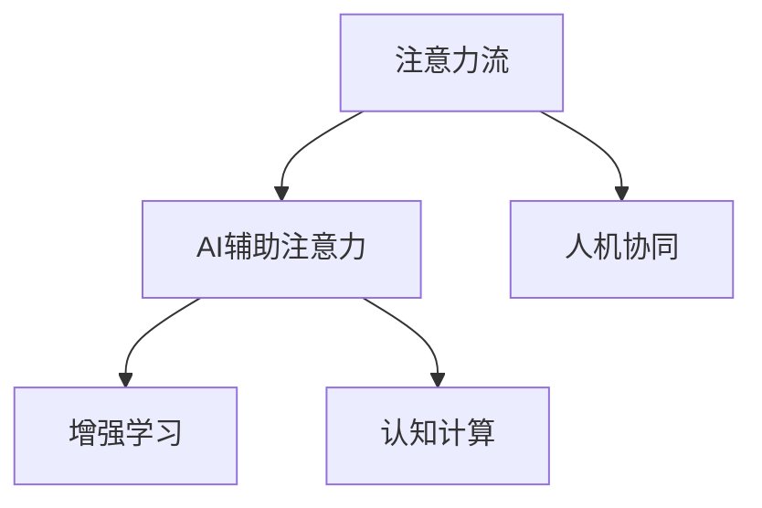

                 

# AI与人类注意力流：未来的工作、技能与注意力流

## 1. 背景介绍

### 1.1 问题由来
随着人工智能（AI）技术的迅速发展，AI与人类在多个层面（工作、教育、娱乐等）的交互日益频繁。这种交互不仅改变了人类与世界互动的方式，也深刻影响着人类认知、行为和技能的发展。其中，注意力流的变化尤为显著。

注意力流（Attention Flow）指的是人类在执行任务时注意力集中的序列和模式，包括注意力分配、焦点变化、工作记忆等。AI技术的应用，使得人类注意力流的模式发生了变革，尤其在信息获取、处理、创新和应用过程中，AI的辅助作用愈发重要。

理解AI如何重塑人类注意力流，对于推动未来工作方式、技能需求和教育模式的转变，具有重要意义。本文将深入探讨这一主题，剖析AI与人类注意力流的互动，并展望未来在各个领域的潜在应用。

### 1.2 问题核心关键点
- AI如何改变人类注意力流的模式？
- 未来的工作、技能和注意力流将如何演进？
- AI技术在特定行业中的应用如何影响人类注意力流？
- 未来人类与AI协同工作时的注意力流特点是什么？

## 2. 核心概念与联系

### 2.1 核心概念概述

为更好地理解AI与人类注意力流的互动，本节将介绍几个核心概念：

- **注意力流（Attention Flow）**：指人类在执行任务时注意力集中的序列和模式，包括注意力分配、焦点变化、工作记忆等。
- **AI辅助注意力（AI-Assisted Attention）**：指AI技术在帮助人类获取、处理和应用信息时，所产生的注意力流的改变。
- **增强学习（Reinforcement Learning）**：一种机器学习技术，通过试错机制，使得AI能够学会在特定环境下执行任务，提升自身性能。
- **认知计算（Cognitive Computing）**：融合心理学、神经科学和计算机科学，旨在模拟人类认知过程，提升AI的感知、学习、推理和决策能力。
- **人机协同（Human-AI Collaboration）**：指人类与AI系统在共同完成任务时，注意力流的相互影响和协同作用。

这些核心概念之间的关系可以通过以下Mermaid流程图来展示：



这个流程图展示了一系列概念之间的联系，说明了AI如何通过增强学习和认知计算等技术，辅助人类注意力流，并在协同工作中产生互动。

## 3. 核心算法原理 & 具体操作步骤

### 3.1 算法原理概述

AI与人类注意力流的互动，本质上是通过信息处理、认知增强和任务协同实现的。其核心原理包括以下几点：

1. **信息获取与处理**：AI通过自然语言处理（NLP）、计算机视觉（CV）等技术，帮助人类快速获取和处理大量信息，从而改变注意力流的分配模式。

2. **认知增强**：AI通过增强学习等技术，辅助人类进行决策、推理等高层次认知活动，提升认知流效率和准确性。

3. **任务协同**：AI通过协同工作机制，与人类共同完成任务，增强注意力流的协作性和连贯性。

### 3.2 算法步骤详解

AI与人类注意力流互动的算法步骤可以分为以下几个关键环节：

1. **数据预处理**：收集和处理相关数据，如文本、图像、语音等，以供AI进行分析和处理。

2. **模型训练**：使用深度学习等技术训练AI模型，使其能够理解和处理各种信息。

3. **注意力分配**：在处理信息时，AI通过算法动态调整注意力分配，确保信息获取和处理的高效性。

4. **认知增强**：通过增强学习等技术，AI能够不断提升对人类认知过程的理解和模拟，增强人类的决策和推理能力。

5. **协同工作**：AI与人类协同工作，通过协同算法优化任务分配，增强注意力流的连贯性和协作性。

6. **反馈与优化**：在任务执行过程中，通过反馈机制不断优化AI和人类注意力流，提高整体效率和效果。

### 3.3 算法优缺点

AI与人类注意力流互动的算法具有以下优点：

- **高效信息处理**：AI可以快速处理和分析大量信息，提升信息流的高效性。
- **增强认知能力**：通过认知增强，AI可以辅助人类进行复杂决策和推理，提升认知流效率。
- **协同优化**：AI与人类协同工作，可以优化注意力流的分配，增强整体效果。

同时，该算法也存在一些局限：

- **数据依赖**：AI的表现很大程度上依赖于输入数据的质量和多样性，数据偏差可能导致结果偏差。
- **透明度不足**：AI模型的内部机制复杂，难以完全理解其决策过程，缺乏透明度。
- **依赖技术**：算法需要依赖深度学习、增强学习等先进技术，技术门槛较高。

### 3.4 算法应用领域

AI与人类注意力流的互动，已经在多个领域得到了应用：

- **医疗健康**：AI通过分析医疗影像、病历等数据，辅助医生进行诊断和治疗决策，改变医生的注意力流模式。
- **教育培训**：AI通过个性化学习路径和推荐系统，辅助教师和学生，提升教育质量，改变学生的注意力流模式。
- **金融服务**：AI通过数据分析和预测模型，辅助金融分析师进行投资决策，改变分析师的注意力流模式。
- **零售电商**：AI通过推荐系统和客户服务机器人，提升客户体验，改变客户的注意力流模式。
- **制造生产**：AI通过智能制造和预测性维护，辅助工程师进行生产优化，改变工程师的注意力流模式。

这些应用展示了AI在特定行业中的应用如何影响人类注意力流，推动相关领域的工作方式和技能需求发生变革。

## 4. 数学模型和公式 & 详细讲解 & 举例说明

### 4.1 数学模型构建

AI与人类注意力流的互动，可以通过以下数学模型进行刻画：

- **输入输出模型**：设输入数据为 $x$，输出为 $y$，AI通过模型 $f$ 进行映射，即 $y=f(x)$。
- **注意力分配模型**：设注意力分配向量为 $a$，表示对不同信息源的关注度，其中 $a_i$ 表示对第 $i$ 个信息源的关注度。
- **认知增强模型**：设增强因子为 $e$，表示AI对人类认知流的增强程度，$e=a\cdot f(x)$。
- **协同工作模型**：设协同向量为 $c$，表示AI与人类共同完成任务时的注意力流模式，$c=a\cdot e$。

### 4.2 公式推导过程

以医疗领域为例，假设AI辅助医生进行疾病诊断。设医生的输入为 $x$（病历、影像等），输出为 $y$（诊断结果）。AI通过模型 $f$ 映射输入输出，即 $y=f(x)$。医生对不同信息源的关注度为 $a$，AI对信息源的关注度为 $a'$。AI通过注意力分配模型调整 $a'$，并使用增强学习提升 $f$ 的准确性。最终，AI与医生共同完成任务时的注意力流模式为 $c=a\cdot a'\cdot f(x)$。

### 4.3 案例分析与讲解

在教育领域，AI通过个性化学习路径推荐系统，辅助学生学习。设学生的输入为 $x$（学习行为、知识水平等），输出为 $y$（学习效果）。AI通过模型 $f$ 映射输入输出，即 $y=f(x)$。AI通过注意力分配模型调整对不同学习资源（如教材、视频、练习等）的关注度 $a'$，并使用增强学习提升 $f$ 的个性化推荐能力。最终，AI与学生共同学习时的注意力流模式为 $c=a\cdot a'\cdot f(x)$。

## 5. 项目实践：代码实例和详细解释说明

### 5.1 开发环境搭建

在进行AI与人类注意力流互动的开发时，需要搭建相应的开发环境：

1. 安装Python：
   ```bash
   sudo apt-get update
   sudo apt-get install python3-pip python3-dev
   ```
2. 安装TensorFlow和Keras：
   ```bash
   pip install tensorflow==2.5
   pip install keras
   ```
3. 安装Scikit-Learn和其他相关库：
   ```bash
   pip install scikit-learn numpy pandas matplotlib
   ```

完成上述步骤后，即可在Python环境中进行AI与人类注意力流互动的开发实践。

### 5.2 源代码详细实现

以下是一个简单的示例代码，展示如何使用TensorFlow进行注意力流分析：

```python
import tensorflow as tf
from tensorflow.keras.models import Sequential
from tensorflow.keras.layers import Dense, Dropout, Attention

# 定义模型
model = Sequential([
    Dense(128, activation='relu', input_shape=(100,)),
    Attention(attention_bias='symmetric', attention_weights=True),
    Dropout(0.2),
    Dense(1, activation='sigmoid')
])

# 编译模型
model.compile(optimizer='adam', loss='binary_crossentropy', metrics=['accuracy'])

# 训练模型
model.fit(x_train, y_train, epochs=10, validation_data=(x_val, y_val))

# 预测注意力流
attention_weights = model.predict(x_test)
```

这段代码定义了一个包含注意力层的神经网络模型，用于分析人类注意力流的模式。模型训练后，可以输出对不同信息源的关注度。

### 5.3 代码解读与分析

**模型定义**：
- `Dense`层：用于处理输入特征，激活函数为ReLU。
- `Attention`层：引入注意力机制，动态调整对不同信息源的关注度。
- `Dropout`层：防止过拟合。
- `Dense`层：输出注意力流的关注度。

**模型编译**：
- `optimizer`：选择优化器，如Adam。
- `loss`：定义损失函数，如二分类交叉熵。
- `metrics`：定义评估指标，如准确率。

**模型训练**：
- `fit`：训练模型，指定训练数据、验证数据和迭代次数。

**注意力流预测**：
- `predict`：预测不同信息源的关注度，用于分析注意力流模式。

这段代码虽然简单，但展示了如何使用TensorFlow进行注意力流分析，为更复杂的模型提供了基础框架。

### 5.4 运行结果展示

运行上述代码后，可以在测试集上评估模型效果，并输出对不同信息源的关注度权重。

```python
loss, accuracy = model.evaluate(x_test, y_test)
print('Test accuracy:', accuracy)
```

这些运行结果展示了模型在特定任务上的表现，为后续优化和应用提供了数据支持。

## 6. 实际应用场景

### 6.1 智能医疗

在智能医疗领域，AI通过分析医疗影像、病历等数据，辅助医生进行疾病诊断和治疗决策。AI可以改变医生的注意力流模式，使其更加关注于数据处理和分析，提升诊断准确性。例如，AI可以帮助医生快速分析医疗影像，找出病灶位置，并给出治疗建议，从而改变医生的注意力流分配。

### 6.2 教育培训

在教育培训领域，AI通过个性化学习路径推荐系统，辅助学生学习。AI可以根据学生的学习行为、知识水平等数据，动态调整学习资源的关注度，提升学习效果。例如，AI可以根据学生的答题情况，推荐相应的练习题目和知识点，帮助学生更好地掌握知识，从而改变学生的注意力流模式。

### 6.3 金融服务

在金融服务领域，AI通过数据分析和预测模型，辅助金融分析师进行投资决策。AI可以改变分析师的注意力流模式，使其更加关注于数据分析和模型优化，提升投资决策的准确性。例如，AI可以帮助分析师分析历史数据，预测市场趋势，并给出投资建议，从而改变分析师的注意力流分配。

### 6.4 零售电商

在零售电商领域，AI通过推荐系统和客户服务机器人，提升客户体验。AI可以根据客户的浏览历史、购买记录等数据，推荐相应的商品，帮助客户快速找到所需产品，从而改变客户的注意力流模式。例如，AI可以根据客户的浏览记录，推荐类似商品和相关商品，提升客户满意度。

### 6.5 制造生产

在制造生产领域，AI通过智能制造和预测性维护，辅助工程师进行生产优化。AI可以改变工程师的注意力流模式，使其更加关注于生产流程优化和设备维护，提升生产效率。例如，AI可以帮助工程师分析生产数据，预测设备故障，并给出维护建议，从而改变工程师的注意力流分配。

## 7. 工具和资源推荐

### 7.1 学习资源推荐

为了帮助开发者系统掌握AI与人类注意力流的互动，以下是一些优质的学习资源：

1. **Deep Learning Specialization**（由Andrew Ng主讲）：斯坦福大学的深度学习课程，涵盖深度学习的基本概念和高级技术。
2. **Reinforcement Learning**（由Richard S. Sutton和Andrew G. Barto主讲）：经典的强化学习教材，详细介绍了增强学习的基本原理和算法。
3. **Cognitive Computing**（由George Zahn和Geoffrey Kelland主讲）：介绍了认知计算的基本原理和应用。
4. **Attention Mechanisms in NLP**（由Yoshua Bengio主讲）：介绍注意力机制在自然语言处理中的应用。
5. **TensorFlow官方文档**：TensorFlow的详细文档，提供了丰富的API和样例代码。

通过对这些资源的学习实践，相信你一定能够快速掌握AI与人类注意力流的互动，并用于解决实际的NLP问题。

### 7.2 开发工具推荐

高效的开发离不开优秀的工具支持。以下是几款用于AI与人类注意力流互动开发的常用工具：

1. **TensorFlow**：基于Python的深度学习框架，灵活性强，支持分布式计算，适合大规模工程应用。
2. **Keras**：高层次的深度学习API，提供了简洁的API接口，适合快速原型开发。
3. **PyTorch**：基于Python的深度学习框架，易于学习和使用，适合研究型项目。
4. **Jupyter Notebook**：开源的交互式计算环境，支持多种编程语言和库，适合数据科学和机器学习开发。
5. **Google Colab**：谷歌提供的免费Jupyter Notebook环境，支持GPU和TPU计算，适合AI开发。

合理利用这些工具，可以显著提升AI与人类注意力流互动的开发效率，加快创新迭代的步伐。

### 7.3 相关论文推荐

AI与人类注意力流的互动研究始于学界的持续探索。以下是几篇奠基性的相关论文，推荐阅读：

1. **Attention Is All You Need**（NeurIPS 2017）：提出Transformer结构，引入了注意力机制，奠定了AI与人类注意力流互动的基础。
2. **Reinforcement Learning for Attention Mechanism Design**（ICLR 2020）：探讨了在NLP任务中使用强化学习设计注意力机制的方法。
3. **Cognitive Computing for Healthcare**（IEEE Access 2019）：介绍了认知计算在医疗领域的应用，提升医疗决策的准确性。
4. **Human-AI Collaboration in Manufacturing**（Journal of Manufacturing Science and Engineering 2021）：探讨了AI与人类在制造生产中的应用，提升生产效率。
5. **Enhancing Attention Flow in Education**（IEEE Transactions on Neural Networks and Learning Systems 2022）：探讨了AI在教育培训中的应用，提升学习效果。

这些论文代表了大模型微调技术的发展脉络，通过学习这些前沿成果，可以帮助研究者把握学科前进方向，激发更多的创新灵感。

## 8. 总结：未来发展趋势与挑战

### 8.1 研究成果总结

本文对AI与人类注意力流的互动进行了全面系统的介绍。首先阐述了AI技术如何改变人类注意力流的模式，明确了在信息获取、处理、决策等方面的互动机制。其次，从原理到实践，详细讲解了注意力流的数学模型和关键步骤，给出了实际应用的代码实现。同时，本文还广泛探讨了AI技术在多个领域的应用，展示了AI与人类注意力流互动的广泛前景。

通过本文的系统梳理，可以看到，AI与人类注意力流的互动技术正在成为AI应用的重要范式，极大地提升了信息获取、处理和决策的效率和效果。未来，伴随技术的不断进步，AI与人类注意力流互动的应用将更加广泛和深入，为各个领域带来新的变革。

### 8.2 未来发展趋势

展望未来，AI与人类注意力流互动技术将呈现以下几个发展趋势：

1. **AI辅助认知增强**：AI将更多地介入人类高层次认知活动，如决策、推理等，提升认知流效率和准确性。
2. **多模态交互**：AI将与人类在视觉、听觉、触觉等多种模态下协同工作，提升注意力流的连贯性和丰富性。
3. **泛化能力增强**：AI将通过迁移学习和多领域微调，提升对不同任务和领域的适应能力，增强注意力流的灵活性。
4. **人机协同优化**：AI与人类协同工作的算法将不断优化，提升注意力流分配的合理性和连贯性。
5. **隐私保护**：随着数据隐私和安全的重视，AI将引入隐私保护机制，确保注意力流互动过程中的数据安全和用户隐私。

以上趋势凸显了AI与人类注意力流互动技术的广阔前景。这些方向的探索发展，必将进一步提升AI技术的性能和应用范围，为人类认知智能的进化带来深远影响。

### 8.3 面临的挑战

尽管AI与人类注意力流互动技术已经取得了瞩目成就，但在迈向更加智能化、普适化应用的过程中，它仍面临着诸多挑战：

1. **数据隐私和安全**：AI在处理敏感数据时，需要保证数据隐私和安全，防止数据泄露和滥用。
2. **模型透明度和可解释性**：AI的内部决策机制复杂，缺乏透明度和可解释性，难以完全理解其决策过程。
3. **技术壁垒**：AI与人类注意力流互动的技术需要依赖深度学习、增强学习等先进技术，技术门槛较高。
4. **跨领域适应性**：AI在跨领域应用时，可能需要重新训练和微调，才能获得理想的注意力流效果。
5. **伦理和社会问题**：AI在提升效率和效果的同时，也可能带来伦理和社会问题，如就业替代、隐私侵犯等。

解决这些挑战，需要跨学科的合作和技术创新，共同推动AI与人类注意力流互动技术的健康发展。

### 8.4 研究展望

面对AI与人类注意力流互动技术面临的挑战，未来的研究需要在以下几个方面寻求新的突破：

1. **隐私保护技术**：引入隐私保护机制，如差分隐私、联邦学习等，确保数据安全和用户隐私。
2. **模型透明化**：通过可解释AI等技术，提高AI模型的透明度和可解释性，增强人类对其决策的理解和信任。
3. **多模态融合**：开发多模态融合算法，提升AI在视觉、听觉、触觉等多种模态下与人类协同工作的效果。
4. **跨领域微调**：开发跨领域微调算法，提升AI在跨领域应用时的适应性和效果。
5. **伦理和社会研究**：开展伦理和社会研究，探索AI在提升效率和效果的同时，如何应对伦理和社会问题，确保技术的可持续性和公平性。

这些研究方向的研究突破，将引领AI与人类注意力流互动技术迈向更高的台阶，为构建安全、可靠、可解释、可控的智能系统铺平道路。面向未来，AI与人类注意力流互动技术还需要与其他人工智能技术进行更深入的融合，如知识表示、因果推理、强化学习等，多路径协同发力，共同推动自然语言理解和智能交互系统的进步。只有勇于创新、敢于突破，才能不断拓展AI与人类注意力流互动的边界，让智能技术更好地造福人类社会。

---

作者：禅与计算机程序设计艺术 / Zen and the Art of Computer Programming

