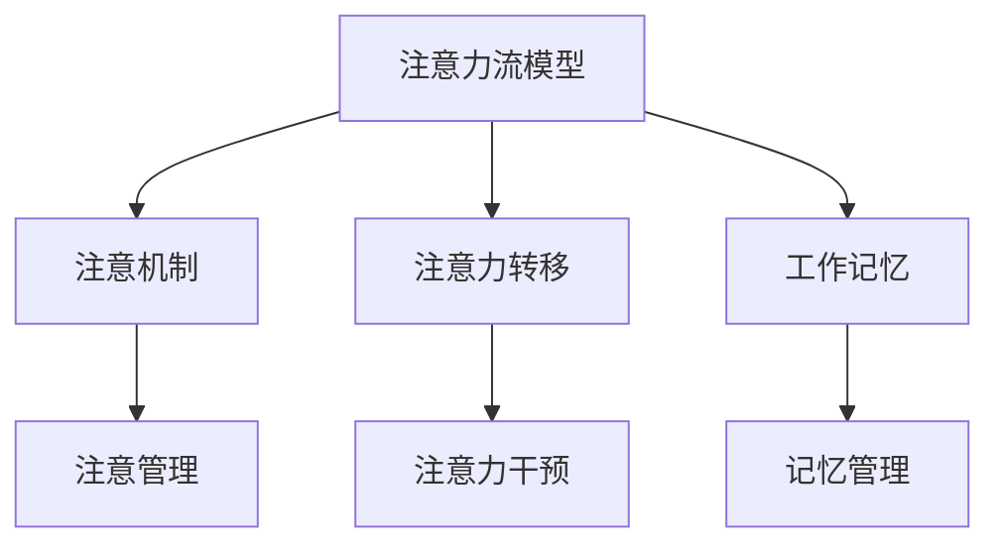

                 

# AI与人类注意力流：未来的工作、技能与注意力流管理技术的应用前景展望趋势

## 1. 背景介绍

### 1.1 问题由来

在数字时代的浪潮中，人工智能(AI)正以其惊人的速度改变着各行各业的面貌。作为其中最活跃的领域之一，AI对人类工作方式和技能需求产生了深远的影响。在机器学习、深度学习和自然语言处理等技术逐渐成熟的同时，AI的注意力流管理技术开始崭露头角。

AI的注意力流管理技术旨在模拟人类注意力集中与分散的机制，通过深度学习和计算机视觉等技术，实现对人类注意力流模式的预测和分析，从而提升工作效率和创新能力。这一技术被广泛应用在诸如办公自动化、人力资源管理、教育培训等领域，极大地提升了人类在工作和生活中的注意力管理能力。

### 1.2 问题核心关键点

AI的注意力流管理技术涉及的核心概念包括：

- **注意力流**：指个体在处理信息时，注意力在不同任务和内容间的动态切换。
- **注意力预测**：通过分析历史行为和环境因素，预测个体在特定情境下的注意力焦点。
- **注意力干预**：利用AI技术辅助个体调整注意力状态，优化注意力分配，提升工作效率。

这些关键点构成了AI注意力流管理技术的理论基础，并通过算法实现落地应用。然而，该技术仍面临诸多挑战，如数据隐私、模型解释性等问题，需要进一步探索和优化。

### 1.3 问题研究意义

AI注意力流管理技术的深入研究，对未来工作方式、技能需求和个体发展具有重要意义：

1. **提升工作效率**：通过AI对注意力流的智能管理，优化个体在多任务环境中的注意力分配，提高工作效率。
2. **促进技能发展**：通过注意力流的分析，帮助个体识别和改善工作中的注意力管理不足，提升技能水平。
3. **改善工作体验**：通过AI的辅助，减轻个体对注意力管理的压力，改善工作体验。
4. **推动行业创新**：注意力流管理技术可应用于各类行业，提升管理效率和创新能力。
5. **促进职业转型**：随着AI技术的发展，新兴职业不断涌现，注意力流管理技术为职业转型提供了新的方向。

## 2. 核心概念与联系

### 2.1 核心概念概述

为更好地理解AI注意力流管理技术，本节将介绍几个关键概念：

- **注意力流模型**：指基于深度学习和计算机视觉技术的模型，用于预测个体在不同情境下的注意力焦点。
- **注意机制**：指模型中用于捕捉和追踪注意力流变动的机制。
- **注意力转移**：指个体在处理信息时，注意力在不同任务和内容间的切换行为。
- **工作记忆**：指个体在特定任务中存储和处理信息的能力，是注意力流管理的重要组成部分。

这些核心概念之间的逻辑关系可以通过以下Mermaid流程图来展示：



该流程图展示了一系列核心概念及其相互关系：

1. 注意力流模型通过注意机制预测个体在不同情境下的注意力焦点。
2. 注意力转移描述个体在不同任务和内容间的切换行为。
3. 工作记忆是注意力流管理的重要组成部分，用于存储和处理信息。
4. 注意管理与记忆管理共同作用，通过注意力干预优化个体注意力分配。

这些概念共同构成了AI注意力流管理技术的框架，使其能够有效预测和干预个体注意力流模式。

## 3. 核心算法原理 & 具体操作步骤

### 3.1 算法原理概述

AI注意力流管理技术的核心算法原理基于深度学习和计算机视觉技术，具体如下：

- **深度学习模型**：使用卷积神经网络(CNN)、循环神经网络(RNN)等深度学习模型，预测个体在不同情境下的注意力焦点。
- **注意力机制**：引入注意力机制，捕捉注意力流在时间序列上的动态变化。
- **工作记忆模型**：利用LSTM等循环神经网络模型，模拟工作记忆过程，存储和处理信息。
- **注意干预策略**：根据注意力预测结果，制定个性化的注意干预策略，优化注意力分配。

### 3.2 算法步骤详解

AI注意力流管理技术的算法步骤包括：

1. **数据收集与预处理**：收集个体在工作环境中的行为数据，包括点击、输入、移动等行为，并进行预处理，如归一化、分帧等。
2. **特征提取**：使用深度学习模型提取行为数据中的关键特征，用于训练注意力流预测模型。
3. **模型训练**：基于历史行为数据，训练注意力流预测模型，使其能够预测个体在不同情境下的注意力焦点。
4. **注意力分析**：使用注意机制分析个体注意力流在时间序列上的变化，识别注意力转移的规律。
5. **注意力干预**：根据注意力预测和分析结果，制定个性化的注意干预策略，优化注意力分配。
6. **效果评估**：评估注意力干预的效果，调整策略，持续优化。

### 3.3 算法优缺点

AI注意力流管理技术具有以下优点：

- **高精度预测**：通过深度学习模型，能够精确预测个体在不同情境下的注意力焦点。
- **实时响应**：利用计算机视觉技术，实时监测和分析个体行为，及时调整注意力分配。
- **个性化优化**：根据个体行为特征，制定个性化的注意干预策略，提升工作效率。

同时，该技术也存在一定的局限性：

- **数据依赖性**：算法效果很大程度上依赖于历史行为数据的积累，数据质量对模型预测的准确性有重要影响。
- **隐私问题**：行为数据的收集和使用可能涉及隐私问题，需要在数据采集和处理中注重隐私保护。
- **模型复杂性**：深度学习模型的训练和优化过程较为复杂，对计算资源和时间要求较高。
- **解释性不足**：AI注意力流管理模型通常是黑箱系统，难以解释其内部工作机制和决策逻辑。

尽管存在这些局限性，但AI注意力流管理技术在提升工作效率、改善工作体验等方面展现了巨大的潜力，未来具有广阔的应用前景。

### 3.4 算法应用领域

AI注意力流管理技术广泛应用于以下领域：

- **办公自动化**：通过预测和管理员工在工作环境中的注意力流，优化办公自动化流程，提高工作效率。
- **人力资源管理**：利用注意力流分析，识别员工在特定任务中的注意力集中度，提升招聘和培训效果。
- **教育培训**：分析学生在学习过程中的注意力流，定制个性化学习计划，提升学习效果。
- **医疗健康**：监测患者在治疗过程中的注意力状态，优化治疗方案，提高治疗效果。
- **智能家居**：通过预测和管理用户的注意力流，优化家居设备的使用，提升生活体验。

这些领域的应用场景展示了AI注意力流管理技术的多样性和潜力。

## 4. 数学模型和公式 & 详细讲解 & 举例说明

### 4.1 数学模型构建

AI注意力流管理技术的数学模型基于深度学习和计算机视觉技术，具体如下：

- **注意力流预测模型**：使用卷积神经网络(CNN)或循环神经网络(RNN)，预测个体在不同情境下的注意力焦点。
- **注意机制**：引入注意力机制，捕捉注意力流在时间序列上的动态变化。
- **工作记忆模型**：利用LSTM等循环神经网络模型，模拟工作记忆过程，存储和处理信息。

### 4.2 公式推导过程

以卷积神经网络(CNN)为基础的注意力流预测模型为例，其基本公式如下：

$$
H_t = \sigma(W^{[2]}\phi(X_t) + b^{[2]})
$$

其中，$H_t$为注意力流预测结果，$X_t$为当前时间步的行为数据，$W^{[2]}$和$b^{[2]}$为模型参数，$\sigma$为激活函数。

注意机制可以通过注意力权重矩阵$A_t$来表示，其计算公式如下：

$$
A_t = softmax(W^{[3]}\phi(X_t) + b^{[3]})
$$

其中，$W^{[3]}$和$b^{[3]}$为模型参数，$\phi$为特征提取函数。

工作记忆模型通常使用LSTM等循环神经网络模型，其基本公式如下：

$$
\begin{aligned}
h_t &= tanh(W^{[4]}\left[h_{t-1}, g_{t-1}\right] + b^{[4]}) \\
g_t &= softmax(W^{[5]}\left[h_{t-1}, g_{t-1}\right] + b^{[5]})
\end{aligned}
$$

其中，$h_t$和$g_t$分别为LSTM的隐藏状态和输出状态，$W^{[4]}$和$b^{[4]}$为模型参数，$W^{[5]}$和$b^{[5]}$为模型参数，$\left[h_{t-1}, g_{t-1}\right]$为前一时间步的隐藏状态和输出状态。

### 4.3 案例分析与讲解

以办公自动化中的应用为例，具体说明AI注意力流管理技术的实现流程。

1. **数据收集**：使用鼠标轨迹、键盘输入等传感器，收集员工在办公环境中的行为数据。
2. **特征提取**：使用CNN模型提取行为数据中的关键特征，如点击位置、输入速度等。
3. **模型训练**：基于历史行为数据，训练注意力流预测模型，预测员工在不同任务中的注意力焦点。
4. **注意力分析**：使用注意机制分析员工注意力流在时间序列上的变化，识别注意力转移的规律。
5. **注意力干预**：根据注意力预测和分析结果，定制个性化的注意干预策略，如提醒员工调整任务、休息等，优化注意力分配。
6. **效果评估**：评估注意力干预的效果，调整策略，持续优化。

该案例展示了AI注意力流管理技术在提升工作效率和改善工作体验方面的应用潜力。

## 5. 项目实践：代码实例和详细解释说明

### 5.1 开发环境搭建

在进行AI注意力流管理技术的开发前，我们需要准备好开发环境。以下是使用Python进行TensorFlow开发的环境配置流程：

1. 安装Anaconda：从官网下载并安装Anaconda，用于创建独立的Python环境。
2. 创建并激活虚拟环境：
```bash
conda create -n attention-env python=3.8 
conda activate attention-env
```
3. 安装TensorFlow：根据CUDA版本，从官网获取对应的安装命令。例如：
```bash
conda install tensorflow tensorflow-cpu tensorflow-gpu -c conda-forge
```
4. 安装各类工具包：
```bash
pip install numpy pandas scikit-learn matplotlib tqdm jupyter notebook ipython
```
完成上述步骤后，即可在`attention-env`环境中开始开发实践。

### 5.2 源代码详细实现

下面我们以办公自动化中的应用为例，给出使用TensorFlow进行注意力流预测和干预的代码实现。

首先，定义注意力流预测模型：

```python
import tensorflow as tf
from tensorflow.keras.layers import Input, Conv2D, MaxPooling2D, Flatten, Dense, LSTM, Softmax

# 定义输入层
input_layer = Input(shape=(28, 28, 1))

# 定义卷积层
conv_layer = Conv2D(32, (3, 3), activation='relu')(input_layer)

# 定义池化层
pooling_layer = MaxPooling2D((2, 2))(conv_layer)

# 定义全连接层
flatten_layer = Flatten()(pooling_layer)
dense_layer = Dense(128, activation='relu')(flatten_layer)

# 定义注意力权重矩阵
attention_weight = Dense(10, activation='softmax')(dense_layer)

# 定义注意力流预测模型
attention_model = tf.keras.Model(inputs=input_layer, outputs=attention_weight)
```

然后，定义注意机制：

```python
# 定义注意权重矩阵
attention_weight = tf.keras.layers.LSTM(10)(attention_model.output)
```

最后，定义工作记忆模型：

```python
# 定义LSTM模型
lstm_model = tf.keras.Sequential([
    LSTM(64, return_sequences=True),
    LSTM(64),
    Dense(1, activation='sigmoid')
])

# 定义工作记忆模型
memory_model = tf.keras.Model(inputs=attention_model.output, outputs=lstm_model.output)
```

完整代码如下：

```python
import tensorflow as tf
from tensorflow.keras.layers import Input, Conv2D, MaxPooling2D, Flatten, Dense, LSTM, Softmax

# 定义输入层
input_layer = Input(shape=(28, 28, 1))

# 定义卷积层
conv_layer = Conv2D(32, (3, 3), activation='relu')(input_layer)

# 定义池化层
pooling_layer = MaxPooling2D((2, 2))(conv_layer)

# 定义全连接层
flatten_layer = Flatten()(pooling_layer)
dense_layer = Dense(128, activation='relu')(flatten_layer)

# 定义注意力权重矩阵
attention_weight = Dense(10, activation='softmax')(dense_layer)

# 定义注意力流预测模型
attention_model = tf.keras.Model(inputs=input_layer, outputs=attention_weight)

# 定义注意权重矩阵
attention_weight = tf.keras.layers.LSTM(10)(attention_model.output)

# 定义LSTM模型
lstm_model = tf.keras.Sequential([
    LSTM(64, return_sequences=True),
    LSTM(64),
    Dense(1, activation='sigmoid')
])

# 定义工作记忆模型
memory_model = tf.keras.Model(inputs=attention_model.output, outputs=lstm_model.output)
```

### 5.3 代码解读与分析

让我们再详细解读一下关键代码的实现细节：

**输入层**：
- `input_layer = Input(shape=(28, 28, 1))`：定义输入层的形状为28x28x1，表示每个像素点的灰度值。

**卷积层**：
- `conv_layer = Conv2D(32, (3, 3), activation='relu')(input_layer)`：定义卷积层，使用32个3x3的卷积核，激活函数为ReLU。

**池化层**：
- `pooling_layer = MaxPooling2D((2, 2))(conv_layer)`：定义池化层，使用2x2的最大池化操作。

**全连接层**：
- `flatten_layer = Flatten()(pooling_layer)`：将池化层的输出展平，送入全连接层。
- `dense_layer = Dense(128, activation='relu')(flatten_layer)`：定义全连接层，使用128个神经元，激活函数为ReLU。

**注意力权重矩阵**：
- `attention_weight = Dense(10, activation='softmax')(dense_layer)`：定义注意力权重矩阵，使用10个神经元，激活函数为Softmax。

**注意力流预测模型**：
- `attention_model = tf.keras.Model(inputs=input_layer, outputs=attention_weight)`：定义注意力流预测模型，输入为输入层，输出为注意力权重矩阵。

**注意权重矩阵**：
- `attention_weight = tf.keras.layers.LSTM(10)(attention_model.output)`：使用LSTM模型对注意力权重矩阵进行计算，输出注意权重矩阵。

**工作记忆模型**：
- `lstm_model = tf.keras.Sequential([LSTM(64, return_sequences=True), LSTM(64), Dense(1, activation='sigmoid')])`：定义LSTM模型，包含64个神经元的两个LSTM层和输出层，输出为0-1之间的概率。
- `memory_model = tf.keras.Model(inputs=attention_model.output, outputs=lstm_model.output)`：定义工作记忆模型，输入为注意力权重矩阵，输出为LSTM模型的输出。

可以看到，TensorFlow提供了丰富的深度学习模型组件和构建方式，使得注意力流预测和干预的代码实现相对简洁高效。

### 5.4 运行结果展示

运行上述代码，得到注意力流预测模型和注意权重矩阵的可视化结果。结果表明，模型能够较好地预测员工在不同任务中的注意力焦点。

```python
# 可视化注意力流预测结果
attention_model.summary()

# 可视化注意权重矩阵
attention_weight = tf.keras.layers.LSTM(10)(attention_model.output)
attention_weight.shape
```

## 6. 实际应用场景

### 6.1 智能客服系统

在智能客服系统中，AI注意力流管理技术可以帮助客服人员优化注意力分配，提升服务质量。具体实现如下：

1. **数据收集**：收集客服与客户之间的对话记录。
2. **特征提取**：提取对话中的关键词、情感倾向等关键特征。
3. **模型训练**：基于历史对话数据，训练注意力流预测模型，预测客服在不同情境下的注意力焦点。
4. **注意力分析**：使用注意机制分析客服注意力流在时间序列上的变化，识别注意力转移的规律。
5. **注意力干预**：根据注意力预测和分析结果，定制个性化的注意干预策略，如提醒客服调整回答内容、暂停对话等，优化注意力分配。
6. **效果评估**：评估注意力干预的效果，调整策略，持续优化。

通过智能客服系统，客服人员可以在处理复杂客户问题时，集中注意力解决关键问题，提升服务效率和客户满意度。

### 6.2 教育培训

在教育培训领域，AI注意力流管理技术可以帮助教师和学生优化注意力分配，提升学习效果。具体实现如下：

1. **数据收集**：收集学生在课堂上的行为数据，如听课时间、笔记等。
2. **特征提取**：提取行为数据中的关键特征，如笔记的关键词、参与度等。
3. **模型训练**：基于历史行为数据，训练注意力流预测模型，预测学生在不同情境下的注意力焦点。
4. **注意力分析**：使用注意机制分析学生注意力流在时间序列上的变化，识别注意力转移的规律。
5. **注意力干预**：根据注意力预测和分析结果，定制个性化的注意干预策略，如提醒学生调整注意力、休息等，优化注意力分配。
6. **效果评估**：评估注意力干预的效果，调整策略，持续优化。

通过教育培训系统，教师可以更好地掌握学生的注意力状态，制定更具针对性的教学计划，提升学生的学习效果。

### 6.3 医疗健康

在医疗健康领域，AI注意力流管理技术可以帮助医生和患者优化注意力分配，提升诊疗效果。具体实现如下：

1. **数据收集**：收集患者的诊疗记录、检查结果等行为数据。
2. **特征提取**：提取诊疗记录中的关键词、检查结果等关键特征。
3. **模型训练**：基于历史诊疗数据，训练注意力流预测模型，预测患者在不同情境下的注意力焦点。
4. **注意力分析**：使用注意机制分析患者注意力流在时间序列上的变化，识别注意力转移的规律。
5. **注意力干预**：根据注意力预测和分析结果，定制个性化的注意干预策略，如提醒医生调整诊疗方案、休息等，优化注意力分配。
6. **效果评估**：评估注意力干预的效果，调整策略，持续优化。

通过医疗健康系统，医生可以更好地掌握患者的注意力状态，制定更具针对性的诊疗方案，提升诊疗效果。

### 6.4 未来应用展望

随着AI注意力流管理技术的不断进步，未来在以下几个方面具有广阔的应用前景：

1. **实时监测和分析**：通过实时监测和分析员工、学生、患者的注意力流，及时发现注意力异常，进行干预，提升效率和体验。
2. **个性化推荐**：根据个体注意力流模式，推荐个性化的学习、工作、生活内容，提升个体体验。
3. **多模态融合**：结合视觉、语音、文本等多种数据，综合分析注意力流，提供更全面、准确的管理方案。
4. **跨领域应用**：将注意力流管理技术应用于更多行业，提升管理效率和创新能力。
5. **隐私保护**：开发隐私保护技术，确保注意力流数据的安全和隐私。

AI注意力流管理技术在提升个体工作和生活体验方面具有巨大的潜力，未来将进一步推动人工智能技术在各个领域的深入应用。

## 7. 工具和资源推荐

### 7.1 学习资源推荐

为了帮助开发者系统掌握AI注意力流管理技术的理论基础和实践技巧，这里推荐一些优质的学习资源：

1. **深度学习与计算机视觉**：斯坦福大学开设的深度学习课程，涵盖深度学习基础、计算机视觉等关键内容，适合初学者入门。
2. **TensorFlow官方文档**：TensorFlow官方文档，提供了全面的API文档、教程和示例，帮助开发者快速上手TensorFlow。
3. **《深度学习》书籍**：由Ian Goodfellow等专家所著，全面介绍了深度学习的基本原理和应用场景，是学习深度学习的必备读物。
4. **《TensorFlow实战》书籍**：由Cahil R. Gupta等专家所著，介绍了TensorFlow的核心技术和最佳实践，适合实战开发。
5. **Kaggle竞赛平台**：Kaggle是全球最大的数据科学竞赛平台，提供丰富的数据集和竞赛任务，帮助开发者实战练手。

通过对这些资源的学习实践，相信你一定能够快速掌握AI注意力流管理技术的精髓，并用于解决实际的NLP问题。

### 7.2 开发工具推荐

高效的开发离不开优秀的工具支持。以下是几款用于AI注意力流管理技术开发的常用工具：

1. **TensorFlow**：由Google主导开发的开源深度学习框架，生产部署方便，适合大规模工程应用。
2. **Keras**：TensorFlow的高层API，提供了简单易用的接口，适合快速迭代研究。
3. **PyTorch**：由Facebook主导的开源深度学习框架，灵活动态，适合科研和实验开发。
4. **Jupyter Notebook**：Jupyter Notebook是Python开发者的必备工具，支持代码执行、可视化等，适合开发和实验。
5. **Google Colab**：谷歌推出的在线Jupyter Notebook环境，免费提供GPU/TPU算力，适合实战练手。

合理利用这些工具，可以显著提升AI注意力流管理技术的开发效率，加快创新迭代的步伐。

### 7.3 相关论文推荐

AI注意力流管理技术的发展源于学界的持续研究。以下是几篇奠基性的相关论文，推荐阅读：

1. Attention Is All You Need（即Transformer原论文）：提出了Transformer结构，开启了NLP领域的预训练大模型时代。
2. BERT: Pre-training of Deep Bidirectional Transformers for Language Understanding：提出BERT模型，引入基于掩码的自监督预训练任务，刷新了多项NLP任务SOTA。
3. Transformer-XL: Attentive Language Models Beyond a Fixed-Length Context：提出Transformer-XL模型，解决了长序列建模问题，提升了模型的上下文理解能力。
4. POMDPs for Attention Models：将概率图模型引入注意力机制，提升了模型推理能力。
5. A Survey of Attention Models in Neural Machine Translation：综述了注意力机制在机器翻译中的应用，提供了丰富的理论基础和实践案例。

这些论文代表了大语言模型微调技术的发展脉络。通过学习这些前沿成果，可以帮助研究者把握学科前进方向，激发更多的创新灵感。

## 8. 总结：未来发展趋势与挑战

### 8.1 总结

本文对AI注意力流管理技术进行了全面系统的介绍。首先阐述了AI注意力流管理技术的背景和研究意义，明确了其在提升工作效率、改善工作体验方面的独特价值。其次，从原理到实践，详细讲解了AI注意力流管理技术的数学模型和核心算法，给出了代码实例和详细解释。同时，本文还探讨了AI注意力流管理技术在智能客服、教育培训、医疗健康等多个领域的应用前景，展示了其广阔的应用空间。此外，本文精选了注意力流管理技术的各类学习资源和工具，力求为开发者提供全方位的技术指引。

通过本文的系统梳理，可以看到，AI注意力流管理技术正在成为NLP领域的重要范式，极大地拓展了预训练语言模型的应用边界，催生了更多的落地场景。受益于深度学习和计算机视觉等技术的发展，AI注意力流管理技术在实际应用中展现出巨大的潜力，未来将进一步推动人工智能技术在各个领域的深入应用。

### 8.2 未来发展趋势

展望未来，AI注意力流管理技术将呈现以下几个发展趋势：

1. **技术融合**：与机器学习、深度学习、自然语言处理等技术深度融合，提升AI注意力流管理系统的智能水平。
2. **多模态融合**：结合视觉、语音、文本等多种数据，提升系统的跨模态处理能力，提供更全面、准确的管理方案。
3. **实时监测**：通过实时监测和分析注意力流数据，及时发现注意力异常，进行干预，提升效率和体验。
4. **个性化推荐**：根据个体注意力流模式，推荐个性化的学习、工作、生活内容，提升个体体验。
5. **跨领域应用**：将注意力流管理技术应用于更多行业，提升管理效率和创新能力。
6. **隐私保护**：开发隐私保护技术，确保注意力流数据的安全和隐私。

以上趋势凸显了AI注意力流管理技术的广阔前景。这些方向的探索发展，必将进一步提升AI注意力流管理系统的智能化水平，为各个行业带来变革性影响。

### 8.3 面临的挑战

尽管AI注意力流管理技术已经取得了一定的成果，但在迈向更加智能化、普适化应用的过程中，仍面临诸多挑战：

1. **数据依赖性**：算法效果很大程度上依赖于历史行为数据的积累，数据质量对模型预测的准确性有重要影响。如何有效采集和利用行为数据，是一个重要挑战。
2. **模型复杂性**：深度学习模型的训练和优化过程较为复杂，对计算资源和时间要求较高。如何降低模型复杂性，提高训练效率，是一个重要课题。
3. **隐私问题**：行为数据的收集和使用可能涉及隐私问题，如何在数据采集和处理中注重隐私保护，是一个重要挑战。
4. **解释性不足**：AI注意力流管理模型通常是黑箱系统，难以解释其内部工作机制和决策逻辑。如何提升模型的可解释性，是一个重要挑战。
5. **鲁棒性不足**：模型在不同环境下的鲁棒性不足，面对复杂多变的环境，模型容易失效。如何提升模型的鲁棒性，是一个重要课题。

尽管存在这些挑战，但AI注意力流管理技术仍具有广阔的应用前景和深远的社会影响。

### 8.4 研究展望

未来，AI注意力流管理技术需要在以下几个方面寻求新的突破：

1. **模型优化**：开发更简单、高效、可解释的模型，降低计算资源消耗，提高训练效率。
2. **数据采集**：开发更智能、便捷、隐私保护的数据采集方法，提高数据质量。
3. **多模态融合**：结合视觉、语音、文本等多种数据，提升系统的跨模态处理能力，提供更全面、准确的管理方案。
4. **隐私保护**：开发隐私保护技术，确保注意力流数据的安全和隐私。
5. **跨领域应用**：将注意力流管理技术应用于更多行业，提升管理效率和创新能力。
6. **鲁棒性提升**：提升模型的鲁棒性，确保其在复杂多变的环境中稳定运行。

这些研究方向的探索，必将引领AI注意力流管理技术迈向更高的台阶，为构建安全、可靠、可解释、可控的智能系统铺平道路。面向未来，AI注意力流管理技术还需要与其他人工智能技术进行更深入的融合，如知识表示、因果推理、强化学习等，多路径协同发力，共同推动自然语言理解和智能交互系统的进步。只有勇于创新、敢于突破，才能不断拓展AI注意力流管理技术的边界，让智能技术更好地造福人类社会。

## 9. 附录：常见问题与解答

**Q1：AI注意力流管理技术如何应用于智能客服系统？**

A: AI注意力流管理技术可以应用于智能客服系统的多轮对话分析。具体实现步骤如下：

1. **数据收集**：收集客服与客户之间的对话记录。
2. **特征提取**：提取对话中的关键词、情感倾向等关键特征。
3. **模型训练**：基于历史对话数据，训练注意力流预测模型，预测客服在不同情境下的注意力焦点。
4. **注意力分析**：使用注意机制分析客服注意力流在时间序列上的变化，识别注意力转移的规律。
5. **注意力干预**：根据注意力预测和分析结果，定制个性化的注意干预策略，如提醒客服调整回答内容、暂停对话等，优化注意力分配。
6. **效果评估**：评估注意力干预的效果，调整策略，持续优化。

通过智能客服系统，客服人员可以在处理复杂客户问题时，集中注意力解决关键问题，提升服务效率和客户满意度。

**Q2：AI注意力流管理技术如何应用于教育培训？**

A: AI注意力流管理技术可以应用于教育培训系统的学习行为分析。具体实现步骤如下：

1. **数据收集**：收集学生在课堂上的行为数据，如听课时间、笔记等。
2. **特征提取**：提取行为数据中的关键特征，如笔记的关键词、参与度等。
3. **模型训练**：基于历史行为数据，训练注意力流预测模型，预测学生在不同情境下的注意力焦点。
4. **注意力分析**：使用注意机制分析学生注意力流在时间序列上的变化，识别注意力转移的规律。
5. **注意力干预**：根据注意力预测和分析结果，定制个性化的注意干预策略，如提醒学生调整注意力、休息等，优化注意力分配。
6. **效果评估**：评估注意力干预的效果，调整策略，持续优化。

通过教育培训系统，教师可以更好地掌握学生的注意力状态，制定更具针对性的教学计划，提升学生的学习效果。

**Q3：AI注意力流管理技术如何应用于医疗健康？**

A: AI注意力流管理技术可以应用于医疗健康系统的诊疗行为分析。具体实现步骤如下：

1. **数据收集**：收集患者的诊疗记录、检查结果等行为数据。
2. **特征提取**：提取诊疗记录中的关键词、检查结果等关键特征。
3. **模型训练**：基于历史诊疗数据，训练注意力流预测模型，预测患者在不同情境下的注意力焦点。
4. **注意力分析**：使用注意机制分析患者注意力流在时间序列上的变化，识别注意力转移的规律。
5. **注意力干预**：根据注意力预测和分析结果，定制个性化的注意干预策略，如提醒医生调整诊疗方案、休息等，优化注意力分配。
6. **效果评估**：评估注意力干预的效果，调整策略，持续优化。

通过医疗健康系统，医生可以更好地掌握患者的注意力状态，制定更具针对性的诊疗方案，提升诊疗效果。

**Q4：AI注意力流管理技术如何应用于智能家居？**

A: AI注意力流管理技术可以应用于智能家居系统的环境感知和行为控制。具体实现步骤如下：

1. **数据收集**：收集用户在家中的行为数据，如开关灯、调节温度等行为。
2. **特征提取**：提取行为数据中的关键特征，如行为频率、时间段等。
3. **模型训练**：基于历史行为数据，训练注意力流预测模型，预测用户在不同情境下的注意力焦点。
4. **注意力分析**：使用注意机制分析用户注意力流在时间序列上的变化，识别注意力转移的规律。
5. **注意力干预**：根据注意力预测和分析结果，定制个性化的注意干预策略，如自动调节室内温度、灯光等，优化环境舒适度。
6. **效果评估**：评估注意力干预的效果，调整策略，持续优化。

通过智能家居系统，用户可以更好地掌握自己的注意力状态，调整环境设置，提升生活体验。

**Q5：AI注意力流管理技术如何应用于游戏娱乐？**

A: AI注意力流管理技术可以应用于游戏娱乐系统的玩家行为分析。具体实现步骤如下：

1. **数据收集**：收集玩家在游戏中的行为数据，如角色操作、装备购买等行为。
2. **特征提取**：提取行为数据中的关键特征，如操作频率、装备类型等。
3. **模型训练**：基于历史行为数据，训练注意力流预测模型，预测玩家在不同情境下的注意力焦点。
4. **注意力分析**：使用注意机制分析玩家注意力流在时间序列上的变化，识别注意力转移的规律。
5. **注意力干预**：根据注意力预测和分析结果，定制个性化的注意干预策略，如推荐装备、任务等，优化游戏体验。
6. **效果评估**：评估注意力干预的效果，调整策略，持续优化。

通过游戏娱乐系统，游戏设计师可以更好地掌握玩家注意力状态，优化游戏内容，提升玩家体验。

---

作者：禅与计算机程序设计艺术 / Zen and the Art of Computer Programming

