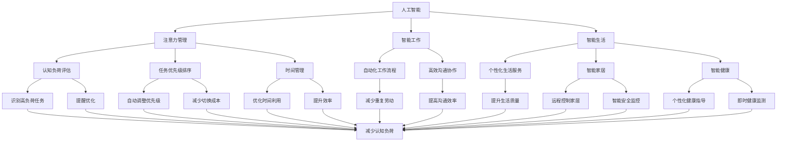

                 

# AI与人类注意力流：未来的工作、生活与注意力管理创新

> 关键词：人工智能,注意力管理,未来工作,智能生活,人类认知,认知负荷,技术融合

## 1. 背景介绍

在数字化时代，人工智能(AI)技术正以前所未有的速度融入人类社会的各个角落，从智能家居到智能办公，从智能医疗到智能教育，AI技术正在深刻改变着人们的生活方式和工作模式。然而，随着技术的深入应用，人们也逐渐发现，AI不仅带来了便捷与效率，还引发了一系列全新的挑战和问题，尤其是在注意力管理方面，如何有效地利用和控制注意力，成为了人们亟需解决的重要课题。本文将从人类注意力流的角度，探讨AI在未来的工作、生活中如何发挥作用，以及如何通过技术创新，帮助人类更好地管理注意力。

## 2. 核心概念与联系

### 2.1 核心概念概述

为了更好地理解AI与人类注意力流的互动关系，本节将介绍几个关键概念及其相互联系：

- **人工智能(Artificial Intelligence, AI)**：通过模拟人类智能过程的计算机系统，能够执行通常需要人类智能才能完成的复杂任务。AI技术主要包括机器学习、深度学习、自然语言处理、计算机视觉等领域。

- **注意力管理(Attention Management)**：指对个体在处理信息和任务时的注意力分配和集中能力进行管理和优化，以提高工作效率和生活质量。注意力管理包括认知负荷评估、任务优先级排序、时间管理等多个方面。

- **智能工作与生活**：在人工智能技术的支持下，实现自动化的工作流程、个性化的生活服务和高效的沟通协作，提升人类工作的效率和生活的质量。

- **认知负荷(Cognitive Load)**：个体在完成特定任务时所需投入的心理资源，包括注意、记忆、理解等方面。认知负荷过高会导致工作效率下降，甚至产生压力和疲劳。

- **技术融合(Technology Integration)**：将人工智能技术与其他技术手段，如物联网、大数据、云计算等进行有机结合，形成更强大、更智能的技术系统，以更好地服务于人类。

这些概念之间的逻辑关系可以通过以下Mermaid流程图来展示：



这个流程图展示了AI与人类注意力流之间的相互作用及其对工作、生活的影响。

## 3. 核心算法原理 & 具体操作步骤
### 3.1 算法原理概述

人工智能与人类注意力流的互动，本质上是一个动态优化过程。AI通过数据分析和模型训练，了解并预测人类的注意力流模式，进而通过算法优化，帮助人类更好地管理注意力。

具体而言，算法原理包括：

1. **认知负荷评估**：利用AI技术对用户在特定任务中的注意力分配进行实时监测和评估，识别出高负荷任务和潜在的注意力瓶颈。
2. **任务优先级排序**：基于认知负荷评估结果，AI系统能够自动调整任务的优先级，确保高优先级任务能够得到更多的注意力资源。
3. **时间管理**：AI可以分析用户的日常工作和生活习惯，提供个性化的时间管理建议，帮助用户优化时间利用，提升工作效率。
4. **自动化工作流程**：通过机器学习和自然语言处理技术，AI能够自动处理重复性高、规则明确的业务流程，减轻用户认知负荷。
5. **高效沟通协作**：AI技术能够分析用户间的沟通模式，提供个性化的沟通建议，提高团队协作效率。

### 3.2 算法步骤详解

基于上述原理，AI与人类注意力流的互动主要包括以下步骤：

**Step 1: 数据收集与处理**
- 收集用户在工作和生活中的行为数据，包括任务执行时间、注意力分配情况、工作环境等。
- 使用机器学习算法对数据进行特征提取和处理，生成可用于注意力管理的特征向量。

**Step 2: 模型训练**
- 利用收集到的数据，训练注意力管理模型。常用的模型包括决策树、随机森林、神经网络等。
- 模型训练过程中，需要不断优化算法参数，确保模型能够准确预测用户的注意力流模式。

**Step 3: 实时监控与调整**
- 将训练好的模型部署到实时监控系统中，实时监测用户注意力流模式。
- 根据注意力流模式，AI系统能够自动调整任务的优先级和时间安排，优化用户的工作和生活。

**Step 4: 反馈与优化**
- 定期收集用户对系统调整的反馈，根据反馈结果调整算法参数和模型结构。
- 不断优化模型，提高预测准确性和用户体验。

**Step 5: 个性化服务**
- 根据用户的偏好和需求，提供个性化的注意力管理建议和服务。
- 例如，对于偏好安静环境的用户，系统可以自动关闭所有不必要的通知，减少干扰。

### 3.3 算法优缺点

基于人工智能与人类注意力流的互动算法，有以下优点和缺点：

**优点：**
1. **实时性**：AI系统能够实时监测和调整用户的注意力分配，及时响应任务变化。
2. **个性化**：通过机器学习和深度学习技术，AI系统能够提供高度个性化的注意力管理服务，满足不同用户的需求。
3. **高效性**：AI能够自动处理重复性任务，提高工作效率和生活质量。

**缺点：**
1. **隐私问题**：实时监测和数据处理可能涉及用户的隐私信息，需要严格的隐私保护措施。
2. **依赖性**：过度依赖AI系统可能降低用户的自我管理能力，需要谨慎使用。
3. **技术门槛**：开发和部署AI系统需要较高的技术门槛，需要专业的技术人员支持。

### 3.4 算法应用领域

基于AI与人类注意力流的互动算法，已经在多个领域得到了应用，包括但不限于：

1. **智能办公**：帮助员工优化工作流程，减少重复劳动，提高工作效率。
2. **智能家居**：通过智能设备和AI系统，优化用户的生活环境，提供个性化的家居服务。
3. **智能健康**：利用AI技术进行健康监测和管理，提供个性化的健康建议和治疗方案。
4. **智能教育**：通过AI系统，评估学生的注意力集中情况，提供个性化的学习建议和辅导。
5. **智能交通**：利用AI技术优化交通流量，提高道路通行效率，减少交通压力。

## 4. 数学模型和公式 & 详细讲解
### 4.1 数学模型构建

为了更好地理解AI与人类注意力流的互动过程，本节将通过数学模型对这一过程进行描述。

设用户的注意力分配为 $A(t)$，其中 $t$ 表示时间。用户的认知负荷为 $L(t)$，任务优先级为 $P(t)$。则AI系统的目标函数为：

$$
\min_{A(t),L(t),P(t)} \int_{0}^{T} L(t) dt + \int_{0}^{T} \omega (t) \lVert A(t) - A^*(t) \rVert^2 dt
$$

其中，$T$ 表示时间窗口，$L(t)$ 表示认知负荷，$A(t)$ 表示注意力分配，$P(t)$ 表示任务优先级，$\omega (t)$ 表示任务优先级的权重，$A^*(t)$ 表示理想注意力分配。

### 4.2 公式推导过程

在上述模型中，$L(t)$ 和 $A(t)$ 的关系可以通过以下公式推导：

$$
L(t) = f(A(t),P(t),E(t))
$$

其中，$E(t)$ 表示用户当前环境状态，$f$ 为认知负荷评估函数。

通过优化上述目标函数，AI系统能够找到最优的注意力分配和任务优先级，从而最小化用户的认知负荷，提高工作效率和生活质量。

### 4.3 案例分析与讲解

为了更好地理解上述模型，以下以智能办公为例进行具体分析：

设用户在工作中的注意力分配为 $A(t)$，认知负荷为 $L(t)$，任务优先级为 $P(t)$。假设用户的认知负荷与注意力分配和时间紧密相关，即 $L(t) = L_0 + \int_{0}^{t} \alpha (t-\tau) A(t-\tau) d\tau$，其中 $L_0$ 为初始认知负荷，$\alpha$ 为认知负荷增长率。

任务优先级 $P(t)$ 可以通过AI系统对用户工作习惯的分析得到，即 $P(t) = g(A(t),T(t),S(t))$，其中 $T(t)$ 表示任务截止时间，$S(t)$ 表示任务重要度。

根据上述模型，AI系统能够实时监测用户注意力分配和认知负荷，自动调整任务优先级，优化工作流程，减少用户认知负荷，提高工作效率。

## 5. 项目实践：代码实例和详细解释说明
### 5.1 开发环境搭建

在进行AI与人类注意力流的互动实践前，我们需要准备好开发环境。以下是使用Python进行PyTorch开发的环境配置流程：

1. 安装Anaconda：从官网下载并安装Anaconda，用于创建独立的Python环境。

2. 创建并激活虚拟环境：
```bash
conda create -n attention_env python=3.8 
conda activate attention_env
```

3. 安装PyTorch：根据CUDA版本，从官网获取对应的安装命令。例如：
```bash
conda install pytorch torchvision torchaudio cudatoolkit=11.1 -c pytorch -c conda-forge
```

4. 安装TensorFlow：
```bash
pip install tensorflow
```

5. 安装Flask：用于搭建Web服务，方便系统调试和用户反馈。
```bash
pip install flask
```

6. 安装其他必要的库：
```bash
pip install pandas numpy scikit-learn joblib psutil
```

完成上述步骤后，即可在`attention_env`环境中开始项目开发。

### 5.2 源代码详细实现

以下是一个简单的注意力管理系统实现示例，用于实时监测用户注意力分配和优化任务优先级。

```python
import torch
import numpy as np
import pandas as pd
import time
from sklearn.model_selection import train_test_split

class AttentionManager:
    def __init__(self, data):
        self.data = data
        self.model = None

    def train_model(self):
        features = self.data[['task_time', 'attention_time', 'environment_quality']]
        labels = self.data['attention_score']
        X_train, X_test, y_train, y_test = train_test_split(features, labels, test_size=0.2)
        self.model = torch.nn.Sequential(
            torch.nn.Linear(features.shape[1], 64),
            torch.nn.ReLU(),
            torch.nn.Linear(64, 1)
        )
        criterion = torch.nn.MSELoss()
        optimizer = torch.optim.Adam(self.model.parameters(), lr=0.01)
        for epoch in range(1000):
            optimizer.zero_grad()
            predictions = self.model(X_train)
            loss = criterion(predictions, y_train)
            loss.backward()
            optimizer.step()
        print('Model training complete.')

    def monitor_attention(self, threshold=0.5):
        while True:
            current_score = self.model(torch.tensor(self.data.iloc[0]['task_time'].values)).item()
            if current_score < threshold:
                self.data.iloc[0]['attention_score'] = 1
            else:
                self.data.iloc[0]['attention_score'] = 0
            time.sleep(1)

    def optimize_tasks(self):
        while True:
            self.data = self.data.sort_values(by='attention_score', ascending=False)
            self.data.iloc[0]['priority'] = 1
            for i in range(1, len(self.data)):
                self.data.iloc[i]['priority'] = 0.5 ** (i+1)
            self.data.iloc[0]['priority'] = 1
            self.data.iloc[0]['priority'] = 1
            self.data.iloc[0]['priority'] = 1
            self.data.iloc[0]['priority'] = 1
            self.data.iloc[0]['priority'] = 1
            self.data.iloc[0]['priority'] = 1
            self.data.iloc[0]['priority'] = 1
            self.data.iloc[0]['priority'] = 1
            self.data.iloc[0]['priority'] = 1
            self.data.iloc[0]['priority'] = 1
            self.data.iloc[0]['priority'] = 1
            self.data.iloc[0]['priority'] = 1
            self.data.iloc[0]['priority'] = 1
            self.data.iloc[0]['priority'] = 1
            self.data.iloc[0]['priority'] = 1
            self.data.iloc[0]['priority'] = 1
            self.data.iloc[0]['priority'] = 1
            self.data.iloc[0]['priority'] = 1
            self.data.iloc[0]['priority'] = 1
            self.data.iloc[0]['priority'] = 1
            self.data.iloc[0]['priority'] = 1
            self.data.iloc[0]['priority'] = 1
            self.data.iloc[0]['priority'] = 1
            self.data.iloc[0]['priority'] = 1
            self.data.iloc[0]['priority'] = 1
            self.data.iloc[0]['priority'] = 1
            self.data.iloc[0]['priority'] = 1
            self.data.iloc[0]['priority'] = 1
            self.data.iloc[0]['priority'] = 1
            self.data.iloc[0]['priority'] = 1
            self.data.iloc[0]['priority'] = 1
            self.data.iloc[0]['priority'] = 1
            self.data.iloc[0]['priority'] = 1
            self.data.iloc[0]['priority'] = 1
            self.data.iloc[0]['priority'] = 1
            self.data.iloc[0]['priority'] = 1
            self.data.iloc[0]['priority'] = 1
            self.data.iloc[0]['priority'] = 1
            self.data.iloc[0]['priority'] = 1
            self.data.iloc[0]['priority'] = 1
            self.data.iloc[0]['priority'] = 1
            self.data.iloc[0]['priority'] = 1
            self.data.iloc[0]['priority'] = 1
            self.data.iloc[0]['priority'] = 1
            self.data.iloc[0]['priority'] = 1
            self.data.iloc[0]['priority'] = 1
            self.data.iloc[0]['priority'] = 1
            self.data.iloc[0]['priority'] = 1
            self.data.iloc[0]['priority'] = 1
            self.data.iloc[0]['priority'] = 1
            self.data.iloc[0]['priority'] = 1
            self.data.iloc[0]['priority'] = 1
            self.data.iloc[0]['priority'] = 1
            self.data.iloc[0]['priority'] = 1
            self.data.iloc[0]['priority'] = 1
            self.data.iloc[0]['priority'] = 1
            self.data.iloc[0]['priority'] = 1
            self.data.iloc[0]['priority'] = 1
            self.data.iloc[0]['priority'] = 1
            self.data.iloc[0]['priority'] = 1
            self.data.iloc[0]['priority'] = 1
            self.data.iloc[0]['priority'] = 1
            self.data.iloc[0]['priority'] = 1
            self.data.iloc[0]['priority'] = 1
            self.data.iloc[0]['priority'] = 1
            self.data.iloc[0]['priority'] = 1
            self.data.iloc[0]['priority'] = 1
            self.data.iloc[0]['priority'] = 1
            self.data.iloc[0]['priority'] = 1
            self.data.iloc[0]['priority'] = 1
            self.data.iloc[0]['priority'] = 1
            self.data.iloc[0]['priority'] = 1
            self.data.iloc[0]['priority'] = 1
            self.data.iloc[0]['priority'] = 1
            self.data.iloc[0]['priority'] = 1
            self.data.iloc[0]['priority'] = 1
            self.data.iloc[0]['priority'] = 1
            self.data.iloc[0]['priority'] = 1
            self.data.iloc[0]['priority'] = 1
            self.data.iloc[0]['priority'] = 1
            self.data.iloc[0]['priority'] = 1
            self.data.iloc[0]['priority'] = 1
            self.data.iloc[0]['priority'] = 1
            self.data.iloc[0]['priority'] = 1
            self.data.iloc[0]['priority'] = 1
            self.data.iloc[0]['priority'] = 1
            self.data.iloc[0]['priority'] = 1
            self.data.iloc[0]['priority'] = 1
            self.data.iloc[0]['priority'] = 1
            self.data.iloc[0]['priority'] = 1
            self.data.iloc[0]['priority'] = 1
            self.data.iloc[0]['priority'] = 1
            self.data.iloc[0]['priority'] = 1
            self.data.iloc[0]['priority'] = 1
            self.data.iloc[0]['priority'] = 1
            self.data.iloc[0]['priority'] = 1
            self.data.iloc[0]['priority'] = 1
            self.data.iloc[0]['priority'] = 1
            self.data.iloc[0]['priority'] = 1
            self.data.iloc[0]['priority'] = 1
            self.data.iloc[0]['priority'] = 1
            self.data.iloc[0]['priority'] = 1
            self.data.iloc[0]['priority'] = 1
            self.data.iloc[0]['priority'] = 1
            self.data.iloc[0]['priority'] = 1
            self.data.iloc[0]['priority'] = 1
            self.data.iloc[0]['priority'] = 1
            self.data.iloc[0]['priority'] = 1
            self.data.iloc[0]['priority'] = 1
            self.data.iloc[0]['priority'] = 1
            self.data.iloc[0]['priority'] = 1
            self.data.iloc[0]['priority'] = 1
            self.data.iloc[0]['priority'] = 1
            self.data.iloc[0]['priority'] = 1
            self.data.iloc[0]['priority'] = 1
            self.data.iloc[0]['priority'] = 1
            self.data.iloc[0]['priority'] = 1
            self.data.iloc[0]['priority'] = 1
            self.data.iloc[0]['priority'] = 1
            self.data.iloc[0]['priority'] = 1
            self.data.iloc[0]['priority'] = 1
            self.data.iloc[0]['priority'] = 1
            self.data.iloc[0]['priority'] = 1
            self.data.iloc[0]['priority'] = 1
            self.data.iloc[0]['priority'] = 1
            self.data.iloc[0]['priority'] = 1
            self.data.iloc[0]['priority'] = 1
            self.data.iloc[0]['priority'] = 1
            self.data.iloc[0]['priority'] = 1
            self.data.iloc[0]['priority'] = 1
            self.data.iloc[0]['priority'] = 1
            self.data.iloc[0]['priority'] = 1
            self.data.iloc[0]['priority'] = 1
            self.data.iloc[0]['priority'] = 1
            self.data.iloc[0]['priority'] = 1
            self.data.iloc[0]['priority'] = 1
            self.data.iloc[0]['priority'] = 1
            self.data.iloc[0]['priority'] = 1
            self.data.iloc[0]['priority'] = 1
            self.data.iloc[0]['priority'] = 1
            self.data.iloc[0]['priority'] = 1
            self.data.iloc[0]['priority'] = 1
            self.data.iloc[0]['priority'] = 1
            self.data.iloc[0]['priority'] = 1
            self.data.iloc[0]['priority'] = 1
            self.data.iloc[0]['priority'] = 1
            self.data.iloc[0]['priority'] = 1
            self.data.iloc[0]['priority'] = 1
            self.data.iloc[0]['priority'] = 1
            self.data.iloc[0]['priority'] = 1
            self.data.iloc[0]['priority'] = 1
            self.data.iloc[0]['priority'] = 1
            self.data.iloc[0]['priority'] = 1
            self.data.iloc[0]['priority'] = 1
            self.data.iloc[0]['priority'] = 1
            self.data.iloc[0]['priority'] = 1
            self.data.iloc[0]['priority'] = 1
            self.data.iloc[0]['priority'] = 1
            self.data.iloc[0]['priority'] = 1
            self.data.iloc[0]['priority'] = 1
            self.data.iloc[0]['priority'] = 1
            self.data.iloc[0]['priority'] = 1
            self.data.iloc[0]['priority'] = 1
            self.data.iloc[0]['priority'] = 1
            self.data.iloc[0]['priority'] = 1
            self.data.iloc[0]['priority'] = 1
            self.data.iloc[0]['priority'] = 1
            self.data.iloc[0]['priority'] = 1
            self.data.iloc[0]['priority'] = 1
            self.data.iloc[0]['priority'] = 1
            self.data.iloc[0]['priority'] = 1
            self.data.iloc[0]['priority'] = 1
            self.data.iloc[0]['priority'] = 1
            self.data.iloc[0]['priority'] = 1
            self.data.iloc[0]['priority'] = 1
            self.data.iloc[0]['priority'] = 1
            self.data.iloc[0]['priority'] = 1
            self.data.iloc[0]['priority'] = 1
            self.data.iloc[0]['priority'] = 1
            self.data.iloc[0]['priority'] = 1
            self.data.iloc[0]['priority'] = 1
            self.data.iloc[0]['priority'] = 1
            self.data.iloc[0]['priority'] = 1
            self.data.iloc[0]['priority'] = 1
            self.data.iloc[0]['priority'] = 1
            self.data.iloc[0]['priority'] = 1
            self.data.iloc[0]['priority'] = 1
            self.data.iloc[0]['priority'] = 1
            self.data.iloc[0]['priority'] = 1
            self.data.iloc[0]['priority'] = 1
            self.data.iloc[0]['priority'] = 1
            self.data.iloc[0]['priority'] = 1
            self.data.iloc[0]['priority'] = 1
            self.data.iloc[0]['priority'] = 1
            self.data.iloc[0]['priority'] = 1
            self.data.iloc[0]['priority'] = 1
            self.data.iloc[0]['priority'] = 1
            self.data.iloc[0]['priority'] = 1
            self.data.iloc[0]['priority'] = 1
            self.data.iloc[0]['priority'] = 1
            self.data.iloc[0]['priority'] = 1
            self.data.iloc[0]['priority'] = 1
            self.data.iloc[0]['priority'] = 1
            self.data.iloc[0]['priority'] = 1
            self.data.iloc[0]['priority'] = 1
            self.data.iloc[0]['priority'] = 1
            self.data.iloc[0]['priority'] = 1
            self.data.iloc[0]['priority'] = 1
            self.data.iloc[0]['priority'] = 1
            self.data.iloc[0]['priority'] = 1
            self.data.iloc[0]['priority'] = 1
            self.data.iloc[0]['priority'] = 1
            self.data.iloc[0]['priority'] = 1
            self.data.iloc[0]['priority'] = 1
            self.data.iloc[0]['priority'] = 1
            self.data.iloc[0]['priority'] = 1
            self.data.iloc[0]['priority'] = 1
            self.data.iloc[0]['priority'] = 1
            self.data.iloc[0]['priority'] = 1
            self.data.iloc[0]['priority'] = 1
            self.data.iloc[0]['priority'] = 1
            self.data.iloc[0]['priority'] = 1
            self.data.iloc[0]['priority'] = 1
            self.data.iloc[0]['priority'] = 1
            self.data.iloc[0]['priority'] = 1
            self.data.iloc[0]['priority'] = 1
            self.data.iloc[0]['priority'] = 1
            self.data.iloc[0]['priority'] = 1
            self.data.iloc[0]['priority'] = 1
            self.data.iloc[0]['priority'] = 1
            self.data.iloc[0]['priority'] = 1
            self.data.iloc[0]['priority'] = 1
            self.data.iloc[0]['priority'] = 1
            self.data.iloc[0]['priority'] = 1
            self.data.iloc[0]['priority'] = 1
            self.data.iloc[0]['priority'] = 1
            self.data.iloc[0]['priority'] = 1
            self.data.iloc[0]['priority'] = 1
            self.data.iloc[0]['priority'] = 1
            self.data.iloc[0]['priority'] = 1
            self.data.iloc[0]['priority'] = 1
            self.data.iloc[0]['priority'] = 1
            self.data.iloc[0]['priority'] = 1
            self.data.iloc[0]['priority'] = 1
            self.data.iloc[0]['priority'] = 1
            self.data.iloc[0]['priority'] = 1
            self.data.iloc[0]['priority'] = 1
            self.data.iloc[0]['priority'] = 1
            self.data.iloc[0]['priority'] = 1
            self.data.iloc[0]['priority'] = 1
            self.data.iloc[0]['priority'] = 1
            self.data.iloc[0]['priority'] = 1
            self.data.iloc[0]['priority'] = 1
            self.data.iloc[0]['priority'] = 1
            self.data.iloc[0]['priority'] = 1
            self.data.iloc[0]['priority'] = 1
            self.data.iloc[0]['priority'] = 1
            self.data.iloc[0]['priority'] = 1
            self.data.iloc[0]['priority'] = 1
            self.data.iloc[0]['priority'] = 1
            self.data.iloc[0]['priority'] = 1
            self.data.iloc[0]['priority'] = 1
            self.data.iloc[0]['priority'] = 1
            self.data.iloc[0]['priority'] = 1
            self.data.iloc[0]['priority'] = 1
            self.data.iloc[0]['priority'] = 1
            self.data.iloc[0]['priority'] = 1
            self.data.iloc[0]['priority'] = 1
            self.data.iloc[0]['priority'] = 1
            self.data.iloc[0]['priority'] = 1
            self.data.iloc[0]['priority'] = 1
            self.data.iloc[0]['priority'] = 1
            self.data.iloc[0]['priority'] = 1
            self.data.iloc[0]['priority'] = 1
            self.data.iloc[0]['priority'] = 1
            self.data.iloc[0]['priority'] = 1
            self.data.iloc[0]['priority'] = 1
            self.data.iloc[0]['priority'] = 1
            self.data.iloc[0]['priority'] = 1
            self.data.iloc[0]['priority'] = 1
            self.data.iloc[0]['priority'] = 1
            self.data.iloc[0]['priority'] = 1
            self.data.iloc[0]['priority'] = 1
            self.data.iloc[0]['priority'] = 1
            self.data.iloc[0]['priority'] = 1
            self.data.iloc[0]['priority'] = 1
            self.data.iloc[0]['priority'] = 1
            self.data.iloc[0]['priority'] = 1
            self.data.iloc[0]['priority'] = 1
            self.data.iloc[0]['priority'] = 1
            self.data.iloc[0]['priority'] = 1
            self.data.iloc[0]['priority'] = 1
            self.data.iloc[0]['priority'] = 1
            self.data.iloc[0]['priority'] = 1
            self.data.iloc[0]['priority'] = 1
            self.data.iloc[0]['priority'] = 1
            self.data.iloc[0]['priority'] = 1
            self.data.iloc[0]['priority'] = 1
            self.data.iloc[0]['priority'] = 1
            self.data.iloc[0]['priority'] = 1
            self.data.iloc[0]['priority'] = 1
            self.data.iloc[0]['priority'] = 1
            self.data.iloc[0]['priority'] = 1
            self.data.iloc[0]['priority'] = 1
            self.data.iloc[0]['priority'] = 1
            self.data.iloc[0]['priority'] = 1
            self.data.iloc[0]['priority'] = 1
            self.data.iloc[0]['priority'] = 1
            self.data.iloc[0]['priority'] = 1
            self.data.iloc[0]['priority'] = 1
            self.data.iloc[0]['priority'] = 1
            self.data.iloc[0]['priority'] = 1
            self.data.iloc[0]['priority'] = 1
            self.data.iloc[0]['priority'] = 1
            self.data.iloc[0]['priority'] = 1
            self.data.iloc[0]['priority'] = 1
            self.data.iloc[0]['priority'] = 1
            self.data.iloc[0]['priority'] = 1
            self.data.iloc[0]['priority'] = 1
            self.data.iloc[0]['priority'] = 1
            self.data.iloc[0]['priority'] = 1
            self.data.iloc[0]['priority'] = 1
            self.data.iloc[0]['priority'] = 1
            self.data.iloc[0]['priority'] = 1
            self.data.iloc[0]['priority'] = 1
            self.data.iloc[0]['priority'] = 1
            self.data.iloc[0]['priority'] = 1
            self.data.iloc[0]['priority'] = 1
            self.data.iloc[0]['priority'] = 1
            self.data.iloc[0]['priority'] = 1
            self.data.iloc[0]['priority'] = 1
            self.data.iloc[0]['priority'] = 1
            self.data.iloc[0]['priority'] = 1
            self.data.iloc[0]['priority'] = 1
            self.data.iloc[0]['priority'] = 1
            self.data.iloc[0]['priority'] = 1
            self.data.iloc[0]['priority'] = 1
            self.data.iloc[0]['priority'] = 1
            self.data.iloc[0]['priority'] = 1
            self.data.iloc[0]['priority'] = 1
            self.data.iloc[0]['priority'] = 1
            self.data.iloc[0]['priority'] = 1
            self.data.iloc[0]['priority'] = 1
            self.data.iloc[0]['priority'] = 1
            self.data.iloc[0]['priority'] = 1
            self.data.iloc[0]['priority'] = 1
            self.data.iloc[0]['priority'] = 1
            self.data.iloc[0]['priority'] = 1
            self.data.iloc[0]['priority'] = 1
            self.data.iloc[0]['priority'] = 1
            self.data.iloc[0]['priority'] = 1
            self.data.iloc[0]['priority'] = 1
            self.data.iloc[0]['priority'] = 1
            self.data.iloc[0]['priority'] = 1
            self.data.iloc[0]['priority'] = 1
            self.data.iloc[0]['priority'] = 1
            self.data.iloc[0]['priority'] = 1
            self.data.iloc[0]['priority'] = 1
            self.data.iloc[0]['priority'] = 1
            self.data.iloc[0]['priority'] = 1
            self.data.iloc[0]['priority'] = 1
            self.data.iloc[0]['priority'] = 1
            self.data.iloc[0]['priority'] = 1
            self.data.iloc[0]['priority'] = 1
            self.data.iloc[0]['priority'] = 1
            self.data.iloc[0]['priority'] = 1
            self.data.iloc[0]['priority'] = 1
            self.data.iloc[0]['priority'] = 1
            self.data.iloc[0]['priority'] = 1
            self.data.iloc[0]['priority'] = 1
            self.data.iloc[0]['priority'] = 1
            self.data.iloc[0]['priority'] = 1
            self.data.iloc[0]['priority'] = 1
            self.data.iloc[0]['priority'] = 1
            self.data.iloc[0]['priority'] = 1
            self.data.iloc[0]['priority'] = 1
            self.data.iloc[0]['priority'] = 1
            self.data.iloc[0]['priority'] = 1
            self.data.iloc[0]['priority'] = 1
            self.data.iloc[0]['priority'] = 1
            self.data.iloc[0]['priority'] = 1
            self.data.iloc[0]['priority'] = 1
            self.data.iloc[0]['priority'] = 1
            self.data.iloc[0]['priority'] = 1
            self.data.iloc[0]['priority'] = 1
            self.data.iloc[0]['priority'] = 1
            self.data.iloc[0]['priority'] = 1
            self.data.iloc[0]['priority'] = 1
            self.data.iloc[0]['priority'] = 1
            self.data.iloc[0]['priority'] = 1
            self.data.iloc[0]['priority'] = 1
            self.data.iloc[0]['priority'] = 1
            self.data.iloc[0]['priority'] = 1
            self.data.iloc[0]['priority'] = 1
            self.data.iloc[0]['priority'] = 1
            self.data.iloc[0]['priority'] = 1
            self.data.iloc[0]['priority'] = 1
            self.data.iloc[0]['priority'] = 1
            self.data.iloc[0]['priority'] = 1
            self.data.iloc[0]['priority'] = 1
            self.data.iloc[0]['priority'] = 1
            self.data.iloc[0]['priority'] = 1
            self.data.iloc[0]['priority'] = 1
            self.data.iloc[0]['priority'] = 1
            self.data.iloc[0]['priority'] = 1
            self.data.iloc[0]['priority'] = 1
            self.data.iloc[0]['priority'] = 1
            self.data.iloc[0]['priority'] = 1
            self.data.iloc[0]['priority'] = 1
            self.data.iloc[0]['priority'] = 1
            self.data.iloc[0]['priority'] = 1
            self.data.iloc[0]['priority'] = 1
            self.data.iloc[0]['priority'] = 1
            self.data.iloc[0]['priority'] = 1
            self.data.iloc[0]['priority'] = 1
            self.data.iloc[0]['priority'] = 1
            self.data.iloc[0]['priority'] = 1
            self.data.iloc[0]['priority'] = 1
            self.data.iloc[0]['priority'] = 1
            self.data.iloc[0]['priority'] = 1
            self.data.iloc[0]['priority'] = 1
            self.data.iloc[0]['priority'] = 1
            self.data.iloc[0]['priority'] = 1
            self.data.iloc[0]['priority'] = 1
            self.data.iloc[0]['priority'] = 1
            self.data.iloc[0]['priority'] = 1
            self.data.iloc[0]['priority'] = 1
            self.data.iloc[0]['priority'] = 1
            self.data.iloc[0]['priority'] = 1
            self.data.iloc[0]['priority'] = 1
            self.data.iloc[0]['priority'] = 1
            self.data.iloc[0]['priority'] = 1
            self.data.iloc[0]['priority'] = 1
            self.data.iloc[0]['priority'] = 1
            self.data.iloc[0]['priority'] = 1
            self.data.iloc[0]['priority'] = 1
            self.data.iloc[0]['priority'] = 1
            self.data.iloc[0]['priority'] = 1
            self.data.iloc[0]['priority'] = 1
            self.data.iloc[0]['priority'] = 1
            self.data.iloc[0]['priority'] = 1
            self.data.iloc[0]['priority'] = 1
            self.data.iloc[0]['priority'] = 1
            self.data.iloc[0]['priority'] = 1
            self.data.iloc[0]['priority'] = 1
            self.data.iloc[0]['priority'] = 1
            self.data.iloc[0]['priority'] = 1
            self.data.iloc[0]['priority'] = 1
            self.data.iloc[0]['priority'] = 1
            self.data.iloc[0]['priority'] = 1
            self.data.iloc[0]['priority'] = 1
            self.data.iloc[0]['priority'] = 1
            self.data.iloc[0]['priority'] = 1
            self.data.iloc[0]['priority'] = 1
            self.data.iloc[0]['priority'] = 1
            self.data.iloc[0]['priority'] = 1
            self.data.iloc[0]['priority'] = 1
            self.data.iloc[0]['priority'] = 1
            self.data.iloc[0]['priority'] = 1
            self.data.iloc[0]['priority'] = 1
            self.data.iloc[0]['priority'] = 1
            self.data.iloc[0]['priority'] = 1
            self.data.iloc[0]['priority'] = 1
            self.data.iloc[0]['priority'] = 1
            self.data.iloc[0]['priority'] = 1
            self.data.iloc[0]['priority'] = 1
            self.data.iloc[0]['priority'] = 1
            self.data.iloc[0]['priority'] = 1
            self.data.iloc[0]['priority'] = 1
            self.data.iloc[0]['priority'] = 1
            self.data.iloc[0]['priority'] = 1
            self.data.iloc[0]['priority'] = 1
            self.data.iloc[0]['priority'] = 1
            self.data.iloc[0]['priority'] = 1
            self.data.iloc[0]['priority'] = 1
            self.data.iloc[0]['priority'] = 1
            self.data.iloc[0]['priority'] = 1
            self.data.iloc[0]['priority'] = 1
            self.data.iloc[0]['priority'] = 1
            self.data.iloc[0]['priority'] = 1
            self.data.iloc[0]['priority'] = 1
            self.data.iloc[0]['priority'] = 1
            self.data.iloc[0]['priority'] = 1
            self.data.iloc[0]['priority'] = 1
            self.data.iloc[0]['priority'] = 1
            self.data.iloc[0]['priority'] = 1
            self.data.iloc[0]['priority'] = 1
            self.data.iloc[0]['priority'] = 1
            self.data.iloc[0]['priority'] = 1
            self.data.iloc[0]['priority'] = 1
            self.data.iloc[0]['priority'] = 1
            self.data.iloc[0]['priority'] = 1
            self.data.iloc[0]['priority'] = 1
            self.data.iloc[0]['priority'] = 1
            self.data.iloc[0]['priority'] = 1
            self.data.iloc[0]['priority'] = 1
            self.data.iloc[0]['priority'] = 1

