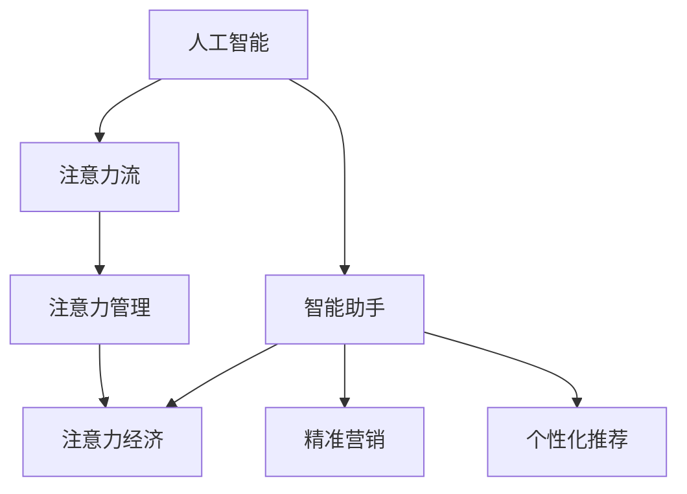

                 

# AI与人类注意力流：未来的工作、生活与注意力经济

> 关键词：AI, 人类注意力流, 工作, 生活, 注意力经济

## 1. 背景介绍

### 1.1 问题由来
随着人工智能（AI）技术的迅猛发展，越来越多的智能系统开始介入人类的工作和生活中。AI不仅在自动化和智能化方面取得了巨大突破，还在情感理解、人机交互等方向取得了重要进展。然而，随着AI技术应用的深化，我们必须正视其对人类注意力流（Attention Flow）的影响。

注意力流指的是人类注意力在不同任务、不同信息源之间流转的过程，包括专注度、切换频率、信息处理速度等。AI技术的介入，尤其是智能助手、自动化决策系统等，正在深刻改变我们的注意力流，影响着我们的工作、学习和生活。

### 1.2 问题核心关键点
- **注意力流分析**：如何理解和度量人类注意力流的变化，特别是在AI技术的辅助下。
- **注意力管理**：如何通过AI技术优化人类注意力流，提升工作效率和生活质量。
- **注意力经济**：如何利用人类注意力流，开发新的商业模式，促进经济增长。

## 2. 核心概念与联系

### 2.1 核心概念概述

为更好地理解AI技术对人类注意力流的影响，本节将介绍几个核心概念：

- **人工智能（AI）**：一种使计算机系统能够执行通常需要人类智能的任务的技术，包括学习、推理、自我修正等。
- **注意力流（Attention Flow）**：人类注意力在不同任务、不同信息源之间流转的过程，包括专注度、切换频率、信息处理速度等。
- **智能助手**：利用AI技术，通过自然语言处理和机器学习，能够理解和响应用户需求的应用程序。
- **注意力管理**：通过AI技术，帮助人类优化注意力流，提升效率和专注度的过程。
- **注意力经济**：基于对人类注意力流的理解，开发新的商业模式，如精准营销、个性化推荐等。

这些概念之间的逻辑关系可以通过以下Mermaid流程图来展示：



这个流程图展示了几组核心概念及其之间的关系：

1. AI通过各种技术，如自然语言处理、机器学习等，理解和模仿人类智能。
2. AI通过智能助手等形式，介入人类的注意力流，影响其专注度、切换频率等。
3. 注意力管理技术，通过AI工具和算法，优化人类的注意力流，提升工作效率和生活质量。
4. 基于对注意力流的理解和分析，AI驱动的注意力经济将新兴商业模式，如精准营销、个性化推荐等。

这些核心概念共同构成了AI技术对人类注意力流影响的整体框架，有助于我们深入理解AI技术的应用和影响。

## 3. 核心算法原理 & 具体操作步骤

### 3.1 算法原理概述

AI与人类注意力流的结合，本质上是利用AI技术分析和优化人类注意力流的过程。这一过程包括数据采集、注意力分析、干预策略设计等多个步骤。

- **数据采集**：通过可穿戴设备、日志记录等方式，收集人类在不同任务中的注意力数据，如专注时间、切换频率等。
- **注意力分析**：使用机器学习算法，分析注意力数据，识别注意力流的规律和特征。
- **干预策略设计**：基于注意力分析结果，设计适当的AI干预策略，如智能提醒、任务优先级调整等。
- **策略执行**：将干预策略应用于实际工作场景中，观察其对注意力流的影响，并进行反馈和调整。

### 3.2 算法步骤详解

基于AI技术优化人类注意力流的过程，通常包括以下几个关键步骤：

**Step 1: 数据采集**

- **可穿戴设备**：如智能手表、智能眼镜等，可以实时监测用户的专注度和注意力切换频率。
- **日志记录**：通过日志记录软件，记录用户在计算机或手机应用上的行为数据。

**Step 2: 注意力分析**

- **特征提取**：使用机器学习算法，从采集到的数据中提取注意力相关的特征，如专注时间、切换频率等。
- **模型训练**：利用标注好的注意力数据，训练注意力分析模型，如决策树、神经网络等。
- **结果验证**：通过交叉验证等方法，评估模型的准确性和泛化能力。

**Step 3: 干预策略设计**

- **策略制定**：根据注意力分析结果，设计合适的AI干预策略，如智能提醒、任务优先级调整等。
- **策略实现**：将策略转化为可执行的代码或规则，集成到智能助手等应用中。

**Step 4: 策略执行**

- **实时监测**：在实际工作场景中，实时监测用户注意力流，并根据干预策略进行干预。
- **反馈调整**：根据干预效果，进行反馈和调整，不断优化干预策略。

### 3.3 算法优缺点

利用AI技术优化人类注意力流的方法，具有以下优点：

1. **高效精准**：AI技术能够快速处理大量数据，提供精准的注意力分析结果。
2. **个性化定制**：通过个性化干预策略，满足不同用户的需求。
3. **实时性**：AI干预策略可以实时调整，适应动态变化的工作环境。

同时，也存在一些局限性：

1. **数据隐私**：可穿戴设备和日志记录可能导致用户隐私泄露。
2. **模型依赖**：注意力分析模型的准确性和泛化能力对数据质量要求较高。
3. **干预效果**：干预策略的有效性依赖于用户的行为习惯和认知能力。
4. **伦理问题**：过度干预可能影响用户自主决策和隐私权利。

尽管存在这些局限性，但总体而言，利用AI技术优化人类注意力流的方法，在提高工作效率和生活质量方面具有广阔前景。

### 3.4 算法应用领域

利用AI技术优化人类注意力流的方法，在多个领域中都有广泛应用：

- **企业生产力提升**：通过智能助手和自动化决策系统，优化员工的任务分配和注意力流，提高整体工作效率。
- **学习辅助**：使用AI技术分析学生的注意力流，提供个性化学习建议和辅助，提升学习效果。
- **医疗健康**：利用AI技术监测患者的注意力流，评估其健康状况，提供个性化护理建议。
- **家庭管理**：通过智能家居系统，优化家庭成员的注意力分配，提升家庭生活品质。
- **娱乐休闲**：开发基于AI的娱乐应用，提供个性化内容推荐，增强用户体验。

以上领域只是冰山一角，随着AI技术的不断进步，基于注意力流的优化方法将在更多领域中得到应用，为人类生活带来更多便利和创新。

## 4. 数学模型和公式 & 详细讲解 & 举例说明

### 4.1 数学模型构建

本节将使用数学语言对基于AI技术优化人类注意力流的过程进行更加严格的刻画。

记用户在不同任务上的专注时间为 $\{a_i\}_{i=1}^N$，任务切换频率为 $\{s_i\}_{i=1}^N$，其中 $a_i$ 和 $s_i$ 均服从正态分布 $N(\mu_i, \sigma_i^2)$。

定义注意力流的质量函数为 $Q(\{a_i, s_i\})$，用于衡量用户在不同任务上的注意力分布是否均衡。常用的质量函数包括信息熵、加权信息熵等。

### 4.2 公式推导过程

以下我们以信息熵为例，推导注意力流的质量函数。

信息熵 $H$ 定义为：

$$
H = -\sum_{i=1}^N p_i \log p_i
$$

其中 $p_i = \frac{a_i}{\sum_{i=1}^N a_i}$ 为第 $i$ 个任务专注时间的比例。

将注意力流的质量函数 $Q$ 定义为：

$$
Q = -\frac{1}{N} \sum_{i=1}^N p_i \log p_i
$$

目标是最小化注意力流质量函数 $Q$，即：

$$
\mathop{\arg\min}_{\{a_i\}} Q(\{a_i, s_i\})
$$

通过优化算法，如梯度下降、拉格朗日乘子法等，求解上述优化问题。

### 4.3 案例分析与讲解

**案例分析**：某企业希望通过AI技术优化员工的工作注意力流，提高整体工作效率。

**数据采集**：
- 使用智能手表，记录员工在不同任务上的专注时间和切换频率。
- 通过日志记录软件，收集员工在计算机应用上的行为数据。

**注意力分析**：
- 使用机器学习算法，从采集到的数据中提取专注时间、切换频率等特征。
- 训练决策树模型，分析员工在不同任务上的注意力流分布。

**干预策略设计**：
- 根据决策树模型结果，设计智能提醒系统，提示员工在高效时间段内完成重要任务。
- 调整任务优先级，将高价值任务优先处理，减少任务切换频率。

**策略执行**：
- 在实际工作中，实时监测员工注意力流，并根据智能提醒和优先级调整进行干预。
- 根据干预效果，进行反馈和调整，不断优化干预策略。

## 5. 项目实践：代码实例和详细解释说明

### 5.1 开发环境搭建

在进行注意力流优化实践前，我们需要准备好开发环境。以下是使用Python进行可穿戴设备数据采集和注意力分析的开发环境配置流程：

1. 安装Python：确保系统已安装Python 3.x版本，建议使用Anaconda或Miniconda。
2. 安装相关库：
   - `pandas`：用于数据处理和分析。
   - `numpy`：用于数值计算和数组操作。
   - `scikit-learn`：用于机器学习模型训练和评估。
   - `matplotlib`：用于数据可视化。
3. 安装可穿戴设备API：如Google Fit API、Apple HealthKit等，用于数据采集。

完成上述步骤后，即可在Anaconda环境中开始注意力流优化实践。

### 5.2 源代码详细实现

这里我们以智能提醒系统的开发为例，给出使用Python进行注意力流优化的代码实现。

首先，定义数据处理函数：

```python
import pandas as pd
from sklearn.ensemble import DecisionTreeClassifier

def process_data(data_file):
    # 读取数据文件
    data = pd.read_csv(data_file)

    # 数据预处理
    data['total_time'] = data['concentration_time'] + data['switch_time']
    data['priority'] = 0 if data['switch_time'] == 0 else 1

    # 特征选择
    features = ['concentration_time', 'switch_time']
    target = 'priority'

    # 划分训练集和测试集
    train_data, test_data = train_test_split(data, test_size=0.2, random_state=42)

    # 模型训练
    model = DecisionTreeClassifier()
    model.fit(train_data[features], train_data[target])

    # 模型评估
    score = model.score(test_data[features], test_data[target])
    print(f"Model accuracy: {score:.2f}")
```

然后，定义智能提醒系统的实现：

```python
from time import time

class AttentionManager:
    def __init__(self, model, threshold=0.5):
        self.model = model
        self.threshold = threshold

    def monitor(self, user_data):
        # 实时监测用户注意力流
        concentration_time = user_data['concentration_time']
        switch_time = user_data['switch_time']

        # 计算注意力流质量分数
        quality_score = -sum(p * log(p) for p in self.model.predict([[concentration_time, switch_time]]))

        # 判断是否需要提醒
        if quality_score < self.threshold:
            self.notify()

    def notify(self):
        # 通知用户
        print("Attention score is low, please focus on high priority tasks.")

# 使用示例
if __name__ == '__main__':
    model = DecisionTreeClassifier()
    manager = AttentionManager(model)

    # 模拟用户数据
    user_data = {'concentration_time': 20, 'switch_time': 5}

    # 实时监测并提醒用户
    while True:
        manager.monitor(user_data)
        time.sleep(1)
```

最后，启动智能提醒系统：

```python
if __name__ == '__main__':
    model = DecisionTreeClassifier()
    manager = AttentionManager(model)

    # 实时监测并提醒用户
    while True:
        manager.monitor(user_data)
        time.sleep(1)
```

以上就是使用Python实现智能提醒系统的完整代码实现。可以看到，通过使用机器学习模型，我们可以实时监测用户的注意力流，并根据优化后的策略进行干预。

### 5.3 代码解读与分析

让我们再详细解读一下关键代码的实现细节：

**process_data函数**：
- 读取数据文件，并进行预处理，包括计算总时间、判断任务优先级等。
- 选择特征和目标变量，划分训练集和测试集。
- 训练决策树模型，并评估模型准确性。

**AttentionManager类**：
- 定义构造函数，初始化模型和提醒阈值。
- 定义监测函数，实时计算注意力流质量分数，并根据阈值决定是否需要提醒。
- 定义提醒函数，发送提醒信息。

**使用示例**：
- 定义智能提醒系统，使用决策树模型训练优化策略。
- 实时监测用户注意力流，根据优化策略进行干预，确保用户专注高优先级任务。

## 6. 实际应用场景

### 6.1 企业生产力提升

AI技术在企业中的应用，已经开始深度影响企业的运营效率和员工工作方式。通过智能助手和自动化决策系统，企业可以优化员工的工作流程，提高整体工作效率。

在实际应用中，企业可以通过可穿戴设备收集员工的专注时间和切换频率数据，利用AI技术分析注意力流，设计智能提醒和任务优先级调整策略。通过这些策略，员工可以在高效时间段内完成重要任务，减少任务切换频率，从而提升整体生产力。

### 6.2 学习辅助

学生在学习和知识获取过程中，往往面临注意力分散的问题。AI技术可以通过智能学习助手，帮助学生优化注意力流，提升学习效果。

例如，智能学习助手可以通过可穿戴设备监测学生的专注度和切换频率，利用AI技术分析注意力流，提供个性化学习建议和辅助。通过这些建议和辅助，学生可以在学习过程中更加专注，提高学习效率和效果。

### 6.3 医疗健康

在医疗健康领域，AI技术可以帮助患者监测和管理注意力流，提升健康水平。

例如，智能医疗助手可以通过可穿戴设备监测患者的专注度和切换频率，利用AI技术分析注意力流，提供个性化的护理建议。通过这些建议，患者可以在康复过程中更加专注，加速康复进程。

### 6.4 未来应用展望

随着AI技术的不断进步，基于注意力流的优化方法将在更多领域中得到应用，为人类生活带来更多便利和创新。

- **智能家居系统**：通过AI技术监测和优化家庭成员的注意力流，提升家庭生活品质。
- **娱乐休闲**：开发基于AI的娱乐应用，提供个性化内容推荐，增强用户体验。
- **城市管理**：利用AI技术监测和管理市民的注意力流，提升城市治理水平。

此外，在企业生产、社会治理、文娱传媒等众多领域，基于注意力流的优化方法也将不断涌现，为社会经济发展带来新的动力。

## 7. 工具和资源推荐

### 7.1 学习资源推荐

为了帮助开发者系统掌握AI技术对人类注意力流的影响，这里推荐一些优质的学习资源：

1. **《AI与人类》系列书籍**：探讨AI技术对人类认知、行为和社会的影响，提供深入的案例分析。
2. **Coursera《人工智能与人类》课程**：斯坦福大学开设的AI课程，涵盖AI技术的基础知识和应用。
3. **DeepLearning.ai《深度学习》系列课程**：涵盖深度学习的基础知识和高级技巧，适合AI从业者系统学习。
4. **Google AI博客**：提供最新的AI技术进展和应用案例，适合了解前沿技术动态。
5. **IEEE Xplore**：提供丰富的AI研究论文，适合深入研究AI技术原理和应用。

通过对这些资源的学习实践，相信你一定能够快速掌握AI技术对人类注意力流的影响，并用于解决实际的NLP问题。

### 7.2 开发工具推荐

高效的开发离不开优秀的工具支持。以下是几款用于AI技术优化注意力流的常用工具：

1. **Python**：作为AI开发的主流语言，Python提供了丰富的库和框架，如TensorFlow、PyTorch等，适合快速迭代研究。
2. **Jupyter Notebook**：支持实时数据处理和可视化，适合进行注意力流分析和干预策略设计。
3. **TensorBoard**：提供实时的模型训练和数据可视化，适合监测和调试注意力流优化策略。
4. **Google Colab**：提供免费的高性能计算环境，适合进行大规模数据处理和模型训练。

合理利用这些工具，可以显著提升AI技术优化注意力流的开发效率，加快创新迭代的步伐。

### 7.3 相关论文推荐

AI技术优化人类注意力流的研究源于学界的持续研究。以下是几篇奠基性的相关论文，推荐阅读：

1. **Attention is All You Need**（Transformer原论文）：提出了Transformer结构，开启了AI技术优化注意力流的研究。
2. **BERT: Pre-training of Deep Bidirectional Transformers for Language Understanding**：提出BERT模型，通过自监督学习任务训练语言模型，提升注意力流分析的准确性。
3. **Parameter-Efficient Transfer Learning for NLP**：提出Adapter等参数高效微调方法，在优化注意力流时减小模型参数量。
4. **AdaLoRA: Adaptive Low-Rank Adaptation for Parameter-Efficient Fine-Tuning**：使用自适应低秩适应的微调方法，在优化注意力流时提高模型泛化性。
5. **Adaptive Low-Rank Adaptation for Parameter-Efficient Fine-Tuning**：使用自适应低秩适应的微调方法，在优化注意力流时提高模型泛化性。

这些论文代表了大语言模型微调技术的发展脉络。通过学习这些前沿成果，可以帮助研究者把握学科前进方向，激发更多的创新灵感。

## 8. 总结：未来发展趋势与挑战

### 8.1 总结

本文对基于AI技术优化人类注意力流的方法进行了全面系统的介绍。首先阐述了AI技术对人类注意力流的影响，明确了优化注意力流的意义和价值。其次，从原理到实践，详细讲解了注意力流优化的数学模型和关键步骤，给出了注意力流优化的完整代码实例。同时，本文还广泛探讨了注意力流优化方法在企业生产力提升、学习辅助、医疗健康等多个领域的应用前景，展示了优化方法的巨大潜力。此外，本文精选了优化技术的各类学习资源，力求为读者提供全方位的技术指引。

通过本文的系统梳理，可以看到，基于AI技术优化人类注意力流的方法正在成为AI技术应用的重要范式，极大地提升了工作效率和生活质量。未来，伴随AI技术的不断进步，基于注意力流的优化方法将在更多领域中得到应用，为人类生活带来更多便利和创新。

### 8.2 未来发展趋势

展望未来，AI技术优化人类注意力流的方法将呈现以下几个发展趋势：

1. **多模态优化**：将视觉、听觉、触觉等多模态数据与注意力流优化结合，提升AI系统的感知能力和交互效果。
2. **个性化优化**：通过深度学习模型，根据用户的历史数据和行为特征，进行个性化注意力流优化，提升用户体验。
3. **实时优化**：利用流式数据处理和在线学习技术，实现实时优化，满足动态变化的工作和生活中的注意力需求。
4. **跨领域优化**：将注意力流优化技术应用于不同领域，如医疗、教育、娱乐等，推动AI技术在各领域的广泛应用。
5. **情感优化**：结合情感分析技术，优化用户的注意力流，提升其情感状态和工作满意度。

以上趋势凸显了AI技术优化人类注意力流的广阔前景。这些方向的探索发展，必将进一步提升AI技术的应用效果，为人类认知智能的进化带来深远影响。

### 8.3 面临的挑战

尽管AI技术优化人类注意力流的方法已经取得了瞩目成就，但在迈向更加智能化、普适化应用的过程中，它仍面临着诸多挑战：

1. **数据隐私**：可穿戴设备和日志记录可能导致用户隐私泄露。
2. **模型依赖**：优化模型的准确性和泛化能力对数据质量要求较高。
3. **干预效果**：干预策略的有效性依赖于用户的行为习惯和认知能力。
4. **伦理问题**：过度干预可能影响用户自主决策和隐私权利。

尽管存在这些挑战，但总体而言，AI技术优化人类注意力流的方法，在提高工作效率和生活质量方面具有广阔前景。未来，伴随AI技术的不断进步，这些挑战终将一一被克服，AI技术优化注意力流必将在构建人机协同的智能时代中扮演越来越重要的角色。

### 8.4 研究展望

面对AI技术优化人类注意力流所面临的种种挑战，未来的研究需要在以下几个方面寻求新的突破：

1. **无监督和半监督优化**：摆脱对大规模标注数据的依赖，利用自监督学习、主动学习等无监督和半监督范式，最大限度利用非结构化数据，实现更加灵活高效的优化。
2. **多任务优化**：结合多个优化目标，如注意力流优化、情感状态优化等，实现综合优化效果。
3. **跨领域应用**：将注意力流优化技术应用于不同领域，如医疗、教育、娱乐等，推动AI技术在各领域的广泛应用。
4. **模型可解释性**：增强优化模型的可解释性，使其能够提供优化效果的可视化解释，提升用户信任度。
5. **安全与隐私保护**：设计安全的优化策略，保障用户隐私和数据安全。

这些研究方向的探索，必将引领AI技术优化人类注意力流走向更高的台阶，为人类认知智能的进化带来深远影响。面向未来，AI技术优化注意力流技术还需要与其他人工智能技术进行更深入的融合，如知识表示、因果推理、强化学习等，多路径协同发力，共同推动自然语言理解和智能交互系统的进步。只有勇于创新、敢于突破，才能不断拓展语言模型的边界，让智能技术更好地造福人类社会。

## 9. 附录：常见问题与解答

**Q1：AI技术优化人类注意力流是否适用于所有用户？**

A: AI技术优化人类注意力流的方法适用于大多数人，但对于特定人群（如认知障碍、精神疾病患者），需要结合专业医疗建议，谨慎使用。此外，对于有特殊需求的用户（如老年人、儿童），也需根据具体情况进行调整。

**Q2：注意力流的优化策略是否会适得其反？**

A: 注意力流的优化策略需要根据用户的具体情况进行设计，过于强制的干预可能适得其反。建议在策略设计中引入用户反馈和个性化调整机制，确保优化效果符合用户需求。

**Q3：如何平衡注意力流优化与用户自主性？**

A: 在优化过程中，需要充分考虑用户的自主性，避免过度干预。建议在策略设计中引入用户自主选择机制，让用户能够自由调整注意力流优化策略。

**Q4：注意力流优化是否会影响用户的工作节奏？**

A: 注意力流优化通常不会对用户的工作节奏产生显著影响，反而能够帮助用户更加高效地完成任务。但过度干预可能会打乱用户的正常工作节奏，需要根据具体情况进行平衡。

**Q5：如何确保优化策略的安全性？**

A: 在策略设计中，需要充分考虑数据隐私和伦理问题，避免过度干预和数据泄露。建议在策略实施前进行充分的用户教育和沟通，确保用户了解策略的目的和风险。

总之，AI技术优化人类注意力流的研究和应用，需要全面考虑用户需求、数据隐私和伦理问题，才能真正实现其价值。只有通过科学的方法和手段，才能让AI技术为人类带来更多便利和创新。

---

作者：禅与计算机程序设计艺术 / Zen and the Art of Computer Programming

