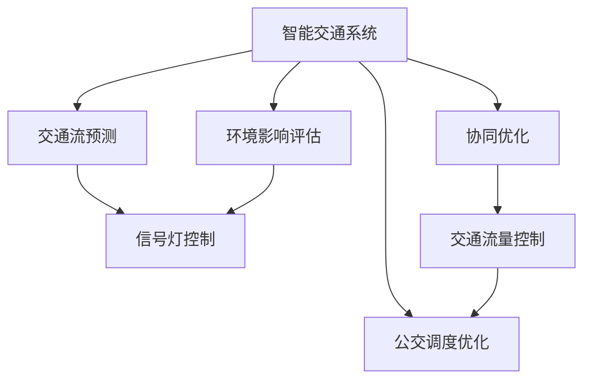
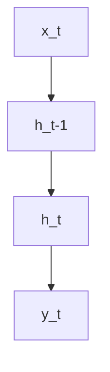

                 

# AI与人类计算：打造可持续发展的城市交通规划与管理

> 关键词：城市交通管理,交通流预测,智能交通系统,环境影响评估,协同优化

## 1. 背景介绍

### 1.1 问题由来
随着城市化进程的加速和全球人口的增长，城市交通问题日益突出。交通拥堵、事故频发、环境污染等现象已经成为全球城市面临的共同挑战。传统交通管理方法在处理大规模复杂系统时，往往难以兼顾效率和公平，甚至可能产生适得其反的效果。

近年来，随着人工智能技术的迅速发展，智能交通系统成为了解决城市交通问题的关键技术手段。人工智能技术能够对交通数据进行实时监测和分析，提供精准的交通预测和优化建议，极大地提升了交通管理的智能化水平。

然而，智能交通系统依赖于大量的数据输入，包括车辆位置、速度、行驶轨迹、道路状况等。如何有效收集、处理和分析这些数据，将其转化为对交通管理决策有益的信息，成为智能交通系统面临的重要挑战。

### 1.2 问题核心关键点
本文聚焦于利用AI技术优化城市交通规划与管理的核心问题，主要包括以下几个方面：
1. 交通流预测：准确预测交通流的变化趋势，为交通管理提供科学依据。
2. 智能交通系统：构建高效的智能交通系统，提升交通管理的智能化水平。
3. 环境影响评估：评估交通系统对环境的影响，促进绿色交通发展。
4. 协同优化：实现交通管理的协同优化，提升城市交通系统的整体性能。

## 2. 核心概念与联系

### 2.1 核心概念概述

为更好地理解AI在城市交通规划与管理中的应用，本节将介绍几个密切相关的核心概念：

- **智能交通系统(ITS, Intelligent Transportation Systems)**：通过传感器、通信技术和AI算法，实现对交通流的实时监测和智能控制，提升交通系统的效率和安全性。

- **交通流预测**：利用历史交通数据，通过AI模型预测未来的交通状态和流量变化，为交通管理决策提供支持。

- **环境影响评估**：评估交通系统的环境影响，包括空气污染、噪音污染、碳排放等，为交通管理提供绿色发展方向。

- **协同优化**：通过AI算法实现交通流、信号灯、公交系统等各子系统间的协同优化，提升整体交通系统的运行效率。

这些核心概念之间的逻辑关系可以通过以下Mermaid流程图来展示：



这个流程图展示出智能交通系统各个组件之间的互动关系：

1. 智能交通系统采集和处理实时交通数据。
2. 交通流预测根据历史数据，预测未来交通状态。
3. 环境影响评估分析交通对环境的影响。
4. 信号灯控制根据预测结果调整信号灯设置。
5. 公交调度优化调整公交线路和班次。
6. 交通流量控制调整道路通行限制。
7. 各个子系统通过协同优化，提升整体效率。

这些核心概念共同构成了智能交通系统的整体框架，使得AI技术能够在城市交通管理中发挥重要作用。

## 3. 核心算法原理 & 具体操作步骤

### 3.1 算法原理概述

基于AI的智能交通系统主要涉及以下算法原理：

- **交通流预测算法**：通过机器学习模型预测交通流的变化趋势，如RNN、LSTM、CNN、GRU等。
- **环境影响评估算法**：使用统计模型和AI算法评估交通系统的环境影响，如线性回归、随机森林、神经网络等。
- **信号灯控制算法**：通过优化算法调整信号灯设置，如动态规划、遗传算法、强化学习等。
- **公交调度优化算法**：基于AI算法优化公交线路和班次安排，如遗传算法、粒子群优化、神经网络等。

这些算法原理通过实时数据收集和处理，可以实现对交通流的精准预测和智能控制。

### 3.2 算法步骤详解

以交通流预测为例，介绍基于AI的智能交通系统的具体实施步骤：

**Step 1: 数据收集与预处理**
- 收集城市道路交通数据，包括车辆位置、速度、行驶轨迹等。
- 清洗数据，处理缺失值、异常值和噪音。
- 数据标准化，保证数据的一致性和可比性。

**Step 2: 特征工程**
- 提取重要的特征，如车速、时间、天气条件、交通信号灯状态等。
- 选择和组合特征，构建更强大的模型输入。

**Step 3: 模型选择与训练**
- 选择适当的预测模型，如RNN、LSTM、GRU等。
- 设计合适的损失函数和优化算法。
- 使用历史数据训练模型，调整超参数。

**Step 4: 模型评估与调优**
- 使用验证集评估模型性能，选择最佳模型。
- 对模型进行调优，提高预测准确率。

**Step 5: 模型部署与应用**
- 将模型部署到实时交通管理系统。
- 实时处理交通数据，预测交通流变化。
- 根据预测结果，调整交通管理策略。

### 3.3 算法优缺点

基于AI的智能交通系统具有以下优点：
1. 实时性好：AI模型能够实时处理交通数据，快速提供预测结果。
2. 预测准确度高：利用历史数据训练的AI模型，能够提供高精度的交通流预测。
3. 可扩展性强：AI模型能够处理大规模数据，适应不同城市规模和交通状况。

同时，该系统也存在以下缺点：
1. 数据依赖性高：AI模型依赖于高质量、大量的交通数据，数据获取成本较高。
2. 模型复杂度高：AI模型的训练和优化需要大量的计算资源和专业知识。
3. 实时性限制：AI模型在处理极端情况时，可能会产生误差，影响预测精度。
4. 可解释性不足：AI模型往往是"黑盒"系统，难以解释其决策过程。

尽管存在这些局限性，但就目前而言，基于AI的智能交通系统仍然是大规模城市交通管理的有效手段。未来相关研究的重点在于如何进一步降低数据需求，提高模型可解释性，增强系统的稳定性和鲁棒性。

### 3.4 算法应用领域

基于AI的智能交通系统已经在多个领域得到广泛应用，例如：

- **交通流量预测**：通过对历史交通数据的分析，预测未来交通流量变化，为交通管理提供决策支持。
- **信号灯优化**：利用AI算法优化信号灯配时，提高交通流顺畅度。
- **公交调度优化**：优化公交线路和班次安排，提升公交系统的效率和可靠性。
- **事故预警**：通过AI模型分析交通数据，及时发现交通事故隐患，减少事故发生率。
- **环境监测**：实时监测交通系统的环境影响，评估交通管理措施的效果。

除了上述这些经典应用外，智能交通系统还被创新性地应用到更多场景中，如智能停车管理、共享单车调度、智能收费系统等，为城市交通管理带来新的解决方案。随着AI技术的不断发展，相信智能交通系统将在更广阔的应用领域大放异彩。

## 4. 数学模型和公式 & 详细讲解 & 举例说明

### 4.1 数学模型构建

基于AI的智能交通系统涉及多个数学模型，其中交通流预测是核心之一。以RNN模型为例，介绍其数学模型构建过程。

假设交通数据为 $\{x_t, y_t\}_{t=1}^N$，其中 $x_t$ 为时间 $t$ 的交通状态特征，$y_t$ 为时间 $t$ 的交通流量。交通流预测的目标是利用历史数据 $(x_1, y_1), \ldots, (x_{t-1}, y_{t-1})$ 预测未来时间 $t$ 的交通流量 $y_t$。

定义RNN模型为 $f$，其结构如下：

$$
f: \mathbb{R}^d \times \mathbb{R}^d \rightarrow \mathbb{R}
$$

其中 $d$ 为输入和输出的维度。模型包含一个隐藏状态 $h_t$，动态更新，模型结构如图：



其中 $h_t$ 由上一时刻的隐藏状态 $h_{t-1}$ 和当前时间步的输入 $x_t$ 更新得到：

$$
h_t = \phi(h_{t-1}, x_t)
$$

其中 $\phi$ 为隐藏状态的更新函数，通常采用LSTM、GRU等门控结构。

### 4.2 公式推导过程

RNN模型预测交通流量的公式推导过程如下：

1. **初始化**：
   - 随机初始化隐藏状态 $h_0$。
   - 设置学习率 $\eta$。

2. **前向传播**：
   - 根据当前时间步的输入 $x_t$ 更新隐藏状态 $h_t$：
   $$
   h_t = \phi(h_{t-1}, x_t)
   $$
   - 计算输出 $y_t$：
   $$
   y_t = \psi(h_t)
   $$
   其中 $\psi$ 为输出层的激活函数，如Sigmoid、Tanh等。

3. **损失函数计算**：
   - 定义均方误差损失函数：
   $$
   L = \frac{1}{N} \sum_{t=1}^N (y_t - \hat{y}_t)^2
   $$
   其中 $\hat{y}_t$ 为模型预测的交通流量。

4. **反向传播**：
   - 计算梯度：
   $$
   \nabla_{\theta} L = \frac{\partial L}{\partial \theta}
   $$
   - 使用反向传播算法更新模型参数 $\theta$：
   $$
   \theta \leftarrow \theta - \eta \nabla_{\theta} L
   $$

5. **模型评估**：
   - 使用测试集评估模型性能，选择最佳模型。
   - 对模型进行调优，提高预测准确率。

### 4.3 案例分析与讲解

以某城市交通流预测为例，介绍基于RNN模型的预测流程：

**数据集**：收集城市道路交通数据，包括车辆位置、速度、行驶轨迹等。

**模型构建**：选择RNN模型作为预测模型，设计合适的隐藏状态更新函数和输出激活函数。

**训练过程**：
1. 随机初始化隐藏状态 $h_0$。
2. 前向传播，计算当前时间步的输出 $y_t$。
3. 计算损失函数 $L$。
4. 反向传播，更新模型参数 $\theta$。

**模型评估**：
1. 使用验证集评估模型性能。
2. 选择最佳模型。
3. 对模型进行调优。

最终，利用训练好的模型对未来交通流量进行预测，实时调整交通管理策略。

## 5. 项目实践：代码实例和详细解释说明

### 5.1 开发环境搭建

在进行AI辅助的智能交通系统开发前，我们需要准备好开发环境。以下是使用Python进行TensorFlow开发的Python环境配置流程：

1. 安装Anaconda：从官网下载并安装Anaconda，用于创建独立的Python环境。

2. 创建并激活虚拟环境：
```bash
conda create -n ai-env python=3.8 
conda activate ai-env
```

3. 安装TensorFlow：
```bash
conda install tensorflow
```

4. 安装各类工具包：
```bash
pip install numpy pandas scikit-learn matplotlib tqdm jupyter notebook ipython
```

完成上述步骤后，即可在`ai-env`环境中开始AI辅助的智能交通系统开发。

### 5.2 源代码详细实现

下面我们以交通流预测为例，给出使用TensorFlow对RNN模型进行训练的Python代码实现。

```python
import tensorflow as tf
import numpy as np
from tensorflow.keras.models import Sequential
from tensorflow.keras.layers import Dense, LSTM
from tensorflow.keras.optimizers import Adam

# 定义数据生成函数
def generate_data(timesteps, batch_size, num_features):
    data = np.random.randn(timesteps, num_features)
    labels = np.cumsum(data, axis=1)[:, -1]
    data = data[:, :timesteps-1]
    labels = labels[:, -1]
    data = data.reshape((-1, num_features, timesteps))
    labels = labels.reshape((-1, 1))
    return data, labels

# 设置模型参数
timesteps = 20
num_features = 4
num_outputs = 1
num_epochs = 100
batch_size = 32
learning_rate = 0.001

# 生成数据
data, labels = generate_data(timesteps, batch_size, num_features)

# 构建模型
model = Sequential()
model.add(LSTM(64, return_sequences=True, input_shape=(num_features, timesteps)))
model.add(LSTM(64))
model.add(Dense(num_outputs))

# 定义损失函数和优化器
loss_fn = tf.keras.losses.MeanSquaredError()
optimizer = Adam(learning_rate=learning_rate)

# 编译模型
model.compile(optimizer=optimizer, loss=loss_fn)

# 训练模型
model.fit(data, labels, epochs=num_epochs, batch_size=batch_size, validation_split=0.2)

# 预测未来交通流量
future_data = np.random.randn(timesteps-1, num_features)
future_output = model.predict(future_data)
```

以上就是使用TensorFlow对RNN模型进行交通流预测的完整代码实现。可以看到，TensorFlow提供的高级API使得模型的构建和训练过程变得简单易懂。

### 5.3 代码解读与分析

让我们再详细解读一下关键代码的实现细节：

**生成数据函数**：
- 随机生成时间序列数据，用于模拟交通流量的变化。
- 将时间序列数据和标签按批次分流，准备训练和验证数据。

**模型构建**：
- 使用LSTM层进行时间序列数据的处理。
- 设计合适的网络结构，输出层采用Dense层。

**模型训练**：
- 定义损失函数和优化器，如均方误差损失和Adam优化器。
- 使用`fit`函数训练模型，设置合适的训练轮数和批次大小。

**模型评估**：
- 使用验证集评估模型性能。
- 对模型进行调优，优化超参数。

**预测未来交通流量**：
- 随机生成未来的输入数据。
- 使用训练好的模型对未来交通流量进行预测。

可以看到，TensorFlow提供的高级API使得模型的构建和训练过程变得简单易懂，大大降低了AI辅助的智能交通系统开发的门槛。

当然，工业级的系统实现还需考虑更多因素，如模型的保存和部署、超参数的自动搜索、更灵活的模型结构等。但核心的AI辅助的智能交通系统开发流程基本与此类似。

## 6. 实际应用场景

### 6.1 智能交通系统

AI辅助的智能交通系统已经在多个城市得到广泛应用，例如：

- **实时交通流量预测**：通过对历史交通数据的分析，实时预测未来的交通流量变化，为交通管理提供决策支持。
- **信号灯优化**：利用AI算法优化信号灯配时，提高交通流顺畅度。
- **公交调度优化**：优化公交线路和班次安排，提升公交系统的效率和可靠性。
- **事故预警**：通过AI模型分析交通数据，及时发现交通事故隐患，减少事故发生率。
- **环境监测**：实时监测交通系统的环境影响，评估交通管理措施的效果。

除了上述这些经典应用外，AI辅助的智能交通系统还被创新性地应用到更多场景中，如智能停车管理、共享单车调度、智能收费系统等，为城市交通管理带来新的解决方案。

### 6.2 未来应用展望

随着AI技术的不断发展，AI辅助的智能交通系统将在更广阔的应用领域大放异彩。未来的应用场景可能包括：

- **车联网管理**：实现车辆与交通系统之间的智能互动，提升交通流的协同优化。
- **城市应急响应**：通过AI模型分析交通数据，及时响应突发事件，保障城市安全。
- **交通系统协同优化**：实现交通系统各子系统间的协同优化，提升整体交通系统的运行效率。
- **绿色交通发展**：利用AI模型评估交通系统的环境影响，推动绿色交通发展。

此外，在智慧城市治理中，AI辅助的智能交通系统也将发挥重要作用，构建更安全、高效的未来城市。

## 7. 工具和资源推荐

### 7.1 学习资源推荐

为了帮助开发者系统掌握AI在城市交通规划与管理中的应用，这里推荐一些优质的学习资源：

1. **TensorFlow官方文档**：TensorFlow官方文档提供了丰富的API文档和教程，适合初学者上手AI辅助的智能交通系统开发。
2. **《深度学习基础》课程**：斯坦福大学开设的深度学习课程，提供了深度学习的基本概念和实践技术，是学习AI辅助的智能交通系统的重要基础。
3. **《智能交通系统》书籍**：详细介绍了智能交通系统的理论和实践，包括AI技术在交通管理中的应用。
4. **AI辅助的智能交通系统案例分析**：收录了多个AI辅助的智能交通系统成功案例，有助于理解AI技术在实际应用中的具体实现。

通过对这些资源的学习实践，相信你一定能够快速掌握AI辅助的智能交通系统的精髓，并用于解决实际的交通问题。

### 7.2 开发工具推荐

高效的开发离不开优秀的工具支持。以下是几款用于AI辅助的智能交通系统开发的常用工具：

1. **TensorFlow**：由Google主导开发的深度学习框架，生产部署方便，适合大规模工程应用。
2. **PyTorch**：基于Python的开源深度学习框架，灵活动态的计算图，适合快速迭代研究。
3. **Jupyter Notebook**：开源的交互式笔记本工具，方便开发者进行模型训练和调试。
4. **Weights & Biases**：模型训练的实验跟踪工具，可以记录和可视化模型训练过程中的各项指标，方便对比和调优。
5. **Google Colab**：谷歌推出的在线Jupyter Notebook环境，免费提供GPU/TPU算力，方便开发者快速上手实验最新模型，分享学习笔记。

合理利用这些工具，可以显著提升AI辅助的智能交通系统开发的效率，加快创新迭代的步伐。

### 7.3 相关论文推荐

AI辅助的智能交通系统的发展源于学界的持续研究。以下是几篇奠基性的相关论文，推荐阅读：

1. **《使用深度学习进行交通流量预测》**：介绍使用深度学习模型预测交通流量的原理和方法，展示了AI技术在交通管理中的应用。
2. **《基于LSTM的智能交通系统优化》**：详细介绍了使用LSTM模型优化智能交通系统的方法，包括模型构建、训练和优化过程。
3. **《环境影响评估与智能交通系统的协同优化》**：探讨了AI技术在交通系统环境影响评估和协同优化中的应用，提出了多目标优化的方法。

这些论文代表了大规模AI辅助的智能交通系统的发展脉络。通过学习这些前沿成果，可以帮助研究者把握学科前进方向，激发更多的创新灵感。

## 8. 总结：未来发展趋势与挑战

### 8.1 总结

本文对基于AI的智能交通系统进行了全面系统的介绍。首先阐述了AI在城市交通规划与管理中的应用背景和意义，明确了智能交通系统的核心问题。其次，从原理到实践，详细讲解了AI辅助的智能交通系统的数学模型和关键步骤，给出了AI辅助的智能交通系统开发的完整代码实例。同时，本文还广泛探讨了AI辅助的智能交通系统在多个行业领域的应用前景，展示了AI技术在城市交通管理中的巨大潜力。此外，本文精选了AI辅助的智能交通系统的学习资源，力求为读者提供全方位的技术指引。

通过本文的系统梳理，可以看到，AI辅助的智能交通系统已经成为解决城市交通问题的重要技术手段，其高效、实时、精准的特点，使得交通管理的智能化水平大大提升。未来，伴随AI技术的进一步发展，AI辅助的智能交通系统将在更广阔的应用领域发挥更大的作用，深刻影响人类的生产生活方式。

### 8.2 未来发展趋势

展望未来，AI辅助的智能交通系统将呈现以下几个发展趋势：

1. **实时性进一步提升**：随着AI技术的发展，实时交通流量预测和信号灯优化的精度和速度将进一步提升，实现更加高效的交通管理。
2. **多模态数据融合**：将视觉、声音、位置等多模态数据进行融合，提升交通系统的感知能力和智能化水平。
3. **边缘计算的引入**：通过边缘计算技术，将AI模型部署到路侧设备中，实现交通数据的实时处理和分析，降低网络延迟。
4. **联邦学习的应用**：利用联邦学习技术，实现数据在不离线的状态下进行分布式模型训练，提高隐私保护和模型泛化能力。
5. **AI伦理与公平性**：在AI辅助的智能交通系统设计中，引入伦理和公平性考量，确保系统的透明、公正和可解释性。

这些趋势凸显了AI辅助的智能交通系统的广阔前景。这些方向的探索发展，必将进一步提升交通系统的效率和公平性，为城市的可持续发展提供新的动力。

### 8.3 面临的挑战

尽管AI辅助的智能交通系统已经取得了瞩目成就，但在迈向更加智能化、普适化应用的过程中，它仍面临着诸多挑战：

1. **数据质量问题**：AI模型依赖于高质量的交通数据，数据获取成本较高，且数据质量难以保证。
2. **模型可解释性不足**：AI模型的决策过程往往是"黑盒"系统，难以解释其内部工作机制和决策逻辑。
3. **系统安全性问题**：AI辅助的智能交通系统可能被恶意攻击或滥用，带来安全隐患。
4. **资源消耗高**：AI模型需要大量的计算资源和存储资源，设备成本较高。
5. **伦理与公平性问题**：AI系统可能存在偏见，如对特定群体的歧视，需要进一步完善伦理设计。

尽管存在这些挑战，但AI辅助的智能交通系统仍是大规模城市交通管理的重要技术手段。未来研究需要从数据质量、模型可解释性、系统安全性、资源消耗和伦理公平性等方面进行优化，才能实现AI辅助的智能交通系统的全面落地。

### 8.4 研究展望

面向未来，AI辅助的智能交通系统需要在以下几个方面寻求新的突破：

1. **数据增强与多源数据融合**：通过数据增强和多种传感器融合，提升交通数据的全面性和准确性。
2. **模型可解释性**：引入可解释性技术，如LIME、SHAP等，增强AI模型的透明性和可解释性。
3. **联邦学习与边缘计算**：利用联邦学习技术进行分布式模型训练，降低数据传输成本和隐私风险。利用边缘计算技术，将AI模型部署到路侧设备中，实现实时处理和分析。
4. **伦理与公平性设计**：引入伦理与公平性考量，确保AI系统透明、公正、可解释。
5. **多目标优化**：在交通系统优化中，引入多目标优化技术，综合考虑交通流量、环境影响、能源消耗等多方面因素，提升系统的整体性能。

这些研究方向的探索，必将引领AI辅助的智能交通系统迈向更高的台阶，为构建安全、可靠、可解释、可控的智能交通系统铺平道路。面向未来，AI辅助的智能交通系统需要与其他人工智能技术进行更深入的融合，如知识表示、因果推理、强化学习等，多路径协同发力，共同推动交通系统的智能化和可持续发展。

## 9. 附录：常见问题与解答

**Q1：AI辅助的智能交通系统是否适用于所有城市？**

A: AI辅助的智能交通系统在大型城市和大数据环境下表现最佳，但对于中小型城市和数据获取难度较大的地区，可能需要结合人工干预和优化策略。

**Q2：AI辅助的智能交通系统对数据质量要求高，如何保证数据质量？**

A: 数据质量是AI辅助的智能交通系统的关键。数据质量可以通过以下措施保证：
1. 数据采集设备的维护和升级。
2. 数据清洗和预处理，去除异常值和噪音。
3. 数据标注和验证，确保数据的准确性和一致性。
4. 引入多源数据融合，提高数据全面性。

**Q3：AI辅助的智能交通系统对模型可解释性要求高，如何提高可解释性？**

A: 提高AI辅助的智能交通系统的模型可解释性可以通过以下措施：
1. 使用可解释性技术，如LIME、SHAP等，对模型进行解释。
2. 引入透明和公正的设计原则，确保系统的透明和公正性。
3. 对模型进行可视化分析，帮助开发者理解模型决策过程。

**Q4：AI辅助的智能交通系统面临哪些资源消耗问题？**

A: AI辅助的智能交通系统面临的主要资源消耗问题包括：
1. 计算资源消耗高，需要高性能的硬件设备。
2. 存储资源消耗大，需要大量的存储空间。
3. 网络资源消耗大，需要稳定的网络连接。

为了解决这些问题，可以采用以下措施：
1. 使用边缘计算技术，将AI模型部署到路侧设备中，降低网络延迟和传输成本。
2. 利用联邦学习技术进行分布式模型训练，降低数据传输成本和隐私风险。

**Q5：AI辅助的智能交通系统如何应对伦理与公平性问题？**

A: AI辅助的智能交通系统在设计过程中需要考虑伦理与公平性问题，可以通过以下措施：
1. 引入伦理与公平性考量，确保系统的透明、公正和可解释性。
2. 定期进行系统评估，识别和消除系统中的偏见和歧视。
3. 引入多样性和包容性设计，确保系统的公平性和包容性。

总之，AI辅助的智能交通系统需要在数据质量、模型可解释性、系统安全性、资源消耗和伦理公平性等方面进行优化，才能实现全面落地。面向未来，AI辅助的智能交通系统需要与其他人工智能技术进行更深入的融合，共同推动交通系统的智能化和可持续发展。

---

作者：禅与计算机程序设计艺术 / Zen and the Art of Computer Programming

